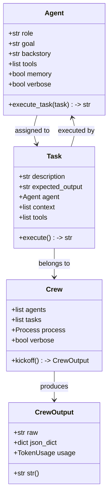
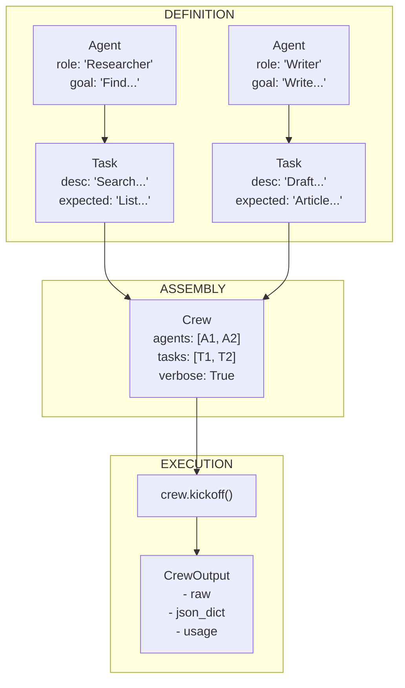
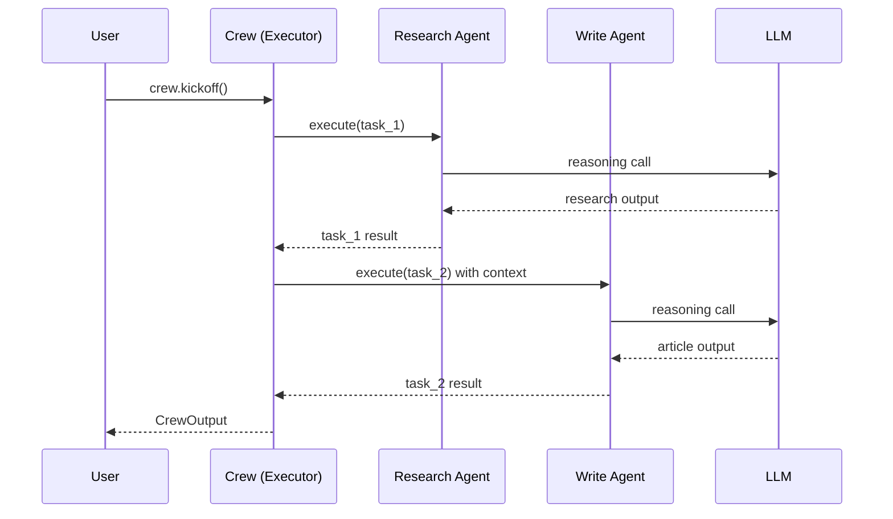

# CrewAI Fundamentals, Agents and Tasks

CrewAI is a multi-agent orchestration framework that enables you to define **role-based AI agents**, assign them **tasks**, and run them as a coordinated **crew**. It is built on top of large language models (LLMs) and provides a clean, Pythonic API for composing sophisticated multi-agent workflows.

---

## What is CrewAI?

CrewAI provides three core abstractions that work together to create multi-agent systems:

- **Agent** — An AI entity with a specific role, goal, and backstory. Agents use LLMs to reason, make decisions, and execute tasks.
- **Task** — A unit of work assigned to an agent, with a description, expected output, and optional tools or context dependencies.
- **Crew** — The orchestrator that assembles agents and tasks, manages execution flow, and returns the final results.

```python
from crewai import Agent, Task, Crew

# All three core classes work together
agent = Agent(role="Analyst", goal="Analyze data", backstory="Data expert.")
task = Task(description="Analyze Q1 sales data.", expected_output="Report.", agent=agent)
crew = Crew(agents=[agent], tasks=[task])
result = crew.kickoff()
```

CrewAI agents typically use large language models (LLMs) under the hood to reason, execute tasks, and collaborate. The framework abstracts away the complexity of prompt engineering, tool calling, and multi-step reasoning.

[!NOTE]
CrewAI is designed for **role-based multi-agent orchestration**. If you need a single-agent loop with tool calling, LangGraph or a simple LangChain chain may be more appropriate. CrewAI shines when you have multiple specialized agents that need to collaborate, delegate, and pass context between each other.

---

## The Agent Class

Every agent in CrewAI is an instance of the `Agent` class. At minimum, you provide a `role` and a `goal`:

```python
from crewai import Agent

# A minimal agent — role and goal are required
researcher = Agent(
    role="Research Analyst",
    goal="Find the latest trends in AI agents",
    backstory="You are a senior analyst at a tech research firm.",
)
```

Key parameters:

| Parameter | Required | Purpose |
| :--- | :--- | :--- |
| `role` | Yes | The agent's job title — guides the LLM's persona |
| `goal` | Yes | What the agent aims to achieve — focuses reasoning |
| `backstory` | No | Contextual narrative for the agent's personality |
| `tools` | No | List of tools the agent can use |
| `memory` | No | Enables cross-task memory within a crew run |
| `verbose` | No | Enables step-by-step logging |

[!TIP]
The `role` parameter is the most influential attribute for shaping agent behavior. A role like "Senior Python Developer" produces dramatically different outputs than "Junior Code Reviewer" — even with the same `goal`. Be specific: include seniority, domain, and specialization.

```python
# Compare these two agents — same goal, different roles
junior = Agent(
    role="Junior Developer",
    goal="Review the pull request and suggest improvements",
    backstory="You are learning Python best practices.",
)

senior = Agent(
    role="Senior Principal Engineer",
    goal="Review the pull request and suggest improvements",
    backstory="You have 15 years of experience in distributed systems.",
)
```

---

## The Task Class

A `Task` describes what needs to be done and which agent should do it:

```python
from crewai import Task

research_task = Task(
    description="Search the web for recent breakthroughs in multi-agent systems.",
    expected_output="A bullet list of 5 key breakthroughs with sources.",
    agent=researcher,
)
```

Tasks can also define `context` from other tasks, `tools`, and `callback` functions. The `expected_output` field is critically important — it tells both the agent and the framework what constitutes a successful completion.

```python
# A task with context from another task
task_a = Task(
    description="Gather quarterly revenue data.",
    expected_output="Raw data table.",
    agent=agent_a,
)

task_b = Task(
    description="Analyze the revenue data and identify trends.\n\nData:\n{context}",
    expected_output="3 key trends with supporting evidence.",
    agent=agent_b,
    context=[task_a],  # receives task_a's output
)
```

[!WARNING]
Task ordering matters. In a sequential process, tasks execute in the order they are defined in the list. If task B depends on task A's output, task A **must** appear before task B in the `tasks` list. Failure to order tasks correctly results in empty or incorrect context being passed.

| Task Parameter | Required | Purpose |
| :--- | :--- | :--- |
| `description` | Yes | Instructions for the agent |
| `expected_output` | No | What success looks like |
| `agent` | Yes | Which agent executes this task |
| `context` | No | List of tasks whose outputs are passed in |
| `tools` | No | Tools specific to this task (overrides agent tools) |
| `callback` | No | Function called after task completion |

---

## The Crew Class

A `Crew` ties agents and tasks together and controls execution:

```python
from crewai import Crew

crew = Crew(
    agents=[researcher],
    tasks=[research_task],
    verbose=True,   # prints step-by-step logs
)

result = crew.kickoff()  # run the crew
print(result)
```

`kickoff()` returns the final output as a string (by default) or as a structured `CrewOutput` object.

```python
# Crew with multiple agents
multi_agent_crew = Crew(
    agents=[researcher, analyst, writer],
    tasks=[research_task, analysis_task, report_task],
    verbose=True,
)
```

[!WARNING]
Always set `verbose=True` during development. Without it, debugging failures in agent reasoning or task execution becomes significantly harder because no intermediate steps are logged.

---

## Core Class Diagram



---

## Agent → Task → Crew Flow



The agent is assigned to a task, the task belongs to a crew, and `crew.kickoff()` executes everything. During execution, each agent receives its task description, performs LLM reasoning, and returns results in sequence.

---

## Execution Sequence



---

## Complete Minimal Crew

```python
from crewai import Agent, Task, Crew

# 1. Define agent
summarizer = Agent(
    role="Content Summarizer",
    goal="Summarize technical articles into 3 bullet points",
    backstory="You are an editor who distills complex topics.",
)

# 2. Define task
task = Task(
    description="Summarize the article about CrewAI architecture.",
    expected_output="3 concise bullet points.",
    agent=summarizer,
)

# 3. Assemble and run crew
crew = Crew(
    agents=[summarizer],
    tasks=[task],
    verbose=True,
)

output = crew.kickoff()
print(f"Result:\n{output}")
```

---

## Multi-Agent Research Crew

Here is a more realistic example with three agents working together:

```python
from crewai import Agent, Task, Crew

# --- Research Agent ---
researcher = Agent(
    role="AI Research Specialist",
    goal="Find the latest developments in multi-agent systems",
    backstory=(
        "You are a PhD-level researcher at a top AI lab. "
        "You read academic papers and technical blogs daily "
        "and can synthesize complex information quickly."
    ),
    verbose=True,
)

# --- Analysis Agent ---
analyst = Agent(
    role="Data Analyst",
    goal="Extract key patterns and insights from research data",
    backstory=(
        "You are a senior data analyst with a background in statistics. "
        "You turn raw information into structured insights."
    ),
    verbose=True,
)

# --- Writer Agent ---
writer = Agent(
    role="Technical Writer",
    goal="Create a clear, engaging blog post from research findings",
    backstory=(
        "You are a professional technical writer who explains "
        "complex AI concepts to a broad audience."
    ),
    verbose=True,
)

# --- Tasks ---
research_data = Task(
    description=(
        "Research the latest developments in multi-agent AI systems. "
        "Focus on papers published in 2025-2026. Cover: "
        "(1) new architectures, (2) tool-use paradigms, (3) collaboration patterns."
    ),
    expected_output="A structured summary of 5 key developments with citations.",
    agent=researcher,
)

analysis = Task(
    description="Analyze the research data and identify the top 3 trends.",
    expected_output="3 trend statements, each with supporting evidence and impact assessment.",
    agent=analyst,
    context=[research_data],  # receives researcher's output
)

blog_post = Task(
    description=(
        "Write a 500-word blog post about the trends found in the research. "
        "Make it accessible to ML engineers. Use the analysis as source material.\n\n"
        "Research:\n{context}"
    ),
    expected_output="A polished blog post in markdown format.",
    agent=writer,
    context=[analysis],
)

# --- Crew ---
crew = Crew(
    agents=[researcher, analyst, writer],
    tasks=[research_data, analysis, blog_post],
    verbose=True,
)

result = crew.kickoff()
print(str(result))
```

---

## Basic Output Handling

`crew.kickoff()` returns a `CrewOutput` object. You can access:

| Method / Attribute | Description |
| :--- | :--- |
| `.raw` | Raw string output from the final task |
| `.json_dict` | Parsed JSON output (if the output is valid JSON) |
| `.str()` | Human-readable string representation |
| `str(result)` | Same as `.str()` |
| `result.usage` | Token usage metadata (input/output tokens) |

```python
output = crew.kickoff()

# Access raw text
print(output.raw)

# Access token usage
print(f"Tokens used: {output.usage}")

# Convert to string explicitly
report = str(output)

# Try JSON parsing
if output.json_dict:
    for key, value in output.json_dict.items():
        print(f"{key}: {value}")
```

---

## Agent vs Task vs Crew — Responsibilities

| Aspect | Agent | Task | Crew |
| :--- | :--- | :--- | :--- |
| **Purpose** | Who performs the work | What work to do | How work is orchestrated |
| **Required** | `role`, `goal` | `description`, `agent` | `agents`, `tasks` |
| **Optional** | `backstory`, `tools`, `memory` | `expected_output`, `tools`, `context` | `verbose`, `process`, `memory` |
| **Executes** | LLM reasoning | Invokes agent | Calls `kickoff()` |
| **Output** | Part of task result | Final `CrewOutput` | `CrewOutput` |
| **Configuration** | Identity & capabilities | Instructions & dependencies | Orchestration & execution |

### When to Use Which Class

| Scenario | Use |
| :--- | :--- |
| Define a specialist's persona and tools | `Agent` |
| Specify a piece of work with expected output | `Task` |
| Orchestrate multiple agents across tasks | `Crew` |
| Run the entire workflow | `crew.kickoff()` |

---

## Interactive Questions

```question
{
  "id": "ca-01-q1",
  "type": "multiple-choice",
  "question": "You are building a research pipeline: Agent A collects data, Agent B analyzes it, Agent C writes a report. Which CrewAI classes do you need?",
  "options": [
    "Only Agent and Task",
    "Agent, Task, and Crew",
    "Only Task and Crew",
    "Only Agent and Crew"
  ],
  "correct": 1,
  "explanation": "You need Agent (to define each specialist), Task (to describe each unit of work), and Crew (to orchestrate execution and order)."
}
```

```question
{
  "id": "ca-01-q2",
  "type": "multiple-choice",
  "question": "Your agent keeps producing vague, generic responses. What is the most likely cause?",
  "options": [
    "The verbose mode is disabled",
    "The role is too generic (e.g., 'Assistant')",
    "The expected_output is missing",
    "The agent has too many tools"
  ],
  "correct": 1,
  "explanation": "A generic role like 'Assistant' gives the LLM no persona to adopt. Be specific: 'Senior Data Scientist' or 'Technical Documentation Specialist' produces dramatically better outputs."
}
```

```question
{
  "id": "ca-01-q3",
  "type": "multiple-choice",
  "question": "Task A produces data that Task B needs. In a sequential process, what must you ensure?",
  "options": [
    "Task A and Task B run in parallel",
    "Task A appears before Task B in the tasks list",
    "Task B has allow_delegation=True",
    "Task A has verbose=True"
  ],
  "correct": 1,
  "explanation": "In a sequential process, tasks execute in list order. Task A must come before Task B so its output is available when Task B runs."
}
```

```question
{
  "id": "ca-01-q4",
  "type": "multiple-choice",
  "question": "After crew.kickoff(), you need the raw string output. Which attribute do you access?",
  "options": [
    "result.tokens",
    "result.json_dict",
    "result.raw",
    "result.output"
  ],
  "correct": 2,
  "explanation": "The .raw attribute on a CrewOutput object returns the raw string result. .json_dict returns parsed JSON if applicable."
}
```

```question
{
  "id": "ca-01-q5",
  "type": "multiple-choice",
  "question": "Your crew has 3 agents but the final output is empty. What is the first debugging step?",
  "options": [
    "Add more tools to every agent",
    "Set verbose=True on the crew",
    "Remove all context parameters",
    "Increase the LLM temperature"
  ],
  "correct": 1,
  "explanation": "verbose=True prints every reasoning step, tool call, and error message. This is the fastest way to find where execution fails."
}
```

---

## 5 Practice Questions

**1. Which two parameters are required when creating an `Agent`?**

- A) `role` and `backstory`
- B) `role` and `goal` ✅
- C) `goal` and `verbose`
- D) `backstory` and `tools`

**2. What does `crew.kickoff()` return?**

- A) A plain string
- B) A `CrewOutput` object ✅
- C) A list of `Task` objects
- D) An `Agent` instance

**3. Which class holds the `description` and `expected_output` fields?**

- A) `Agent`
- B) `Crew`
- C) `Task` ✅
- D) `CrewOutput`

**4. What is the primary role of the `Crew` class?**

- A) Defining the LLM model
- B) Orchestrating agents and tasks ✅
- C) Creating tool instances
- D) Logging token usage

**5. How do you access the raw string result after `kickoff()`?**

- A) `result.tokens`
- B) `result.json_dict`
- C) `result.raw` ✅
- D) `result.output`

---

[!SUCCESS]
### Key Takeaways
- CrewAI provides three core classes: `Agent`, `Task`, and `Crew`.
- An `Agent` requires a `role` and `goal`; a backstory provides personality.
- A `Task` is assigned to one agent and carries an `expected_output`.
- A `Crew` orchestrates agents and tasks via `kickoff()`.
- `verbose=True` is critical for debugging agent behavior.
- `CrewOutput` offers `.raw`, `.json_dict`, `.str()`, and `.usage` accessors.
- The flow is: Agent ← Task → Crew → kickoff() → output.
- Task ordering in the list determines execution order.
- Specific roles produce better agent outputs than generic ones.
