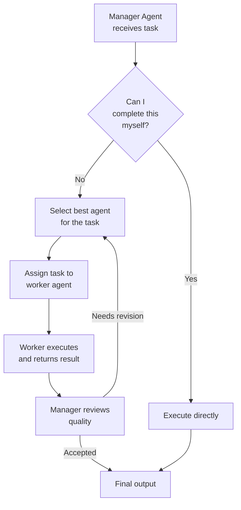
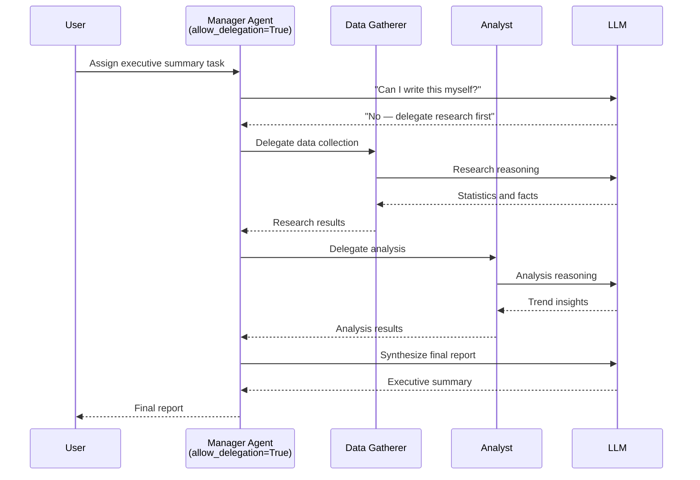

# Defining Roles, Goals, Backstories and Delegation

A well-defined agent is the foundation of a reliable CrewAI system. Each attribute — role, goal, backstory, delegation settings — shapes how the agent behaves, collaborates, and delegates tasks to peers. Getting these right is the difference between a system that produces generic text and one that delivers expert-level results.

---

## Role, Goal, and Backstory

These three attributes form the agent's identity. Together they define the persona, objective, and expertise that the LLM uses to reason:

```python
from crewai import Agent

analyst = Agent(
    role="Senior Data Analyst",
    goal="Identify revenue trends from quarterly sales data",
    backstory=(
        "You have 10 years of experience in financial analytics "
        "and have worked at top consulting firms. You explain "
        "complex data in simple terms."
    ),
)
```

| Attribute | Purpose | Impact |
| :--- | :--- | :--- |
| `role` | Job title / function | Guides the LLM's persona and tone |
| `goal` | Objective the agent must achieve | Focuses reasoning and task planning |
| `backstory` | Narrative context and expertise | Adds depth to decision-making |

[!IMPORTANT]
The `role` parameter is the strongest signal for LLM behavior. An agent with `role="Senior Security Engineer"` will prioritize safety and threat modeling. The same agent with `role="Product Manager"` will prioritize user needs and timelines. Choose roles that encode the expertise you need.

```python
# Compare how role changes output focus
security_agent = Agent(
    role="Senior Security Engineer",
    goal="Review the new authentication system design",
    backstory="You specialize in OAuth, SAML, and zero-trust architectures.",
)

pm_agent = Agent(
    role="Product Manager",
    goal="Review the new authentication system design",
    backstory="You focus on user experience and time-to-market.",
)
# Same goal, but the agents will emphasize completely different aspects
```

[!WARNING]
Avoid generic backstories like "You are a helpful assistant." The more specific the backstory, the better the agent's output quality. Include domain expertise, years of experience, and communication style. A good backstory template: "You are a [seniority] [role] with [X] years of experience in [domain]. You [communication style]."

---

## Agent Collaboration via Delegation

CrewAI agents can delegate tasks to each other. Enable delegation with `allow_delegation=True`:

```python
manager = Agent(
    role="Project Manager",
    goal="Coordinate research and deliver a final report",
    backstory="You manage cross-functional teams and delegate work.",
    allow_delegation=True,  # can ask other agents for help
)

researcher = Agent(
    role="Research Specialist",
    goal="Gather data on assigned topics",
    backstory="You are a skilled online researcher.",
    allow_delegation=False,  # focused on execution, not delegation
)

writer = Agent(
    role="Report Writer",
    goal="Compile findings into a polished report",
    backstory="You write clear, professional reports.",
    allow_delegation=False,
)
```

When `allow_delegation=True`, the agent can ask another agent to take over a task, creating a dynamic collaboration flow. The delegating agent evaluates whether it can complete the task; if not, it routes the work to a more appropriate peer.

[!TIP]
Only enable `allow_delegation` on agents that act as managers or coordinators. Worker agents (researchers, writers, coders) should keep it `False`. This prevents delegation ping-pong where agents keep passing work back and forth.

```python
# Best practice: one manager delegates, workers execute
manager = Agent(
    role="Research Director",
    goal="Produce a comprehensive market analysis report",
    backstory="You lead a team of analysts and writers.",
    allow_delegation=True,  # orchestrator
)
analyst = Agent(
    role="Market Analyst",
    goal="Analyze market data and identify trends",
    backstory="You are a CFA-certified analyst.",
    allow_delegation=False,  # executor
)
writer = Agent(
    role="Report Writer",
    goal="Write professional reports",
    backstory="You are a business writer.",
    allow_delegation=False,  # executor
)
```

---

## Delegation Flow



---

## Verbose Mode

Verbose logging shows every reasoning step, tool call, and delegation:

```python
agent = Agent(
    role="Support Agent",
    goal="Resolve customer queries",
    backstory="You are a first-line support representative.",
    verbose=True,  # prints thoughts, actions, observations
)
```

Three verbosity levels:
- `False` — no output (default)
- `True` — detailed step-by-step logs
- A `Verbose` enum with granular control (available in newer versions)

```python
from crewai import Verbose

# Granular verbosity control
agent = Agent(
    role="Debug Agent",
    goal="Debug the system",
    backstory="You are a systems engineer.",
    verbose=Verbose.INFO,  # show reasoning but skip tool details
)
```

---

## Memory in Agents

Agents can retain context across multiple task executions:

```python
agent_with_memory = Agent(
    role="Chatbot",
    goal="Maintain coherent multi-turn conversations",
    backstory="You are a friendly customer assistant.",
    memory=True,  # enables short-term memory within a crew run
)
```

| Memory Setting | Behavior |
| :--- | :--- |
| `memory=False` (default) | No memory; each task starts fresh |
| `memory=True` | Agent remembers previous interactions within the same crew run |

[!NOTE]
Agent-level memory (`memory=True`) is separate from crew-level memory configuration. Agent memory is short-term (in-process) and is lost after `kickoff()` ends. For persistent memory across runs, use crew-level `memory_config` with a LongTermMemory backend (covered in lesson 5).

---

## Agent Collaboration Sequence



---

## Specialized Agents with Delegation — Full Example

```python
from crewai import Agent, Task, Crew

# --- Agents ---
manager = Agent(
    role="Research Manager",
    goal="Oversee research and compile the final report",
    backstory="You lead a research team and delegate tasks effectively.",
    allow_delegation=True,
    verbose=True,
)

data_gatherer = Agent(
    role="Data Gatherer",
    goal="Find relevant statistics and facts",
    backstory="You are an expert at searching databases and the web.",
    allow_delegation=False,
)

analyst = Agent(
    role="Analyst",
    goal="Interpret data and generate insights",
    backstory="You turn raw data into actionable insights.",
    allow_delegation=False,
)

# --- Tasks ---
gather_task = Task(
    description="Collect 2025 AI adoption statistics from reputable sources.",
    expected_output="A table of statistics with sources.",
    agent=data_gatherer,
)

analyze_task = Task(
    description="Analyze the gathered statistics and identify top 3 trends.",
    expected_output="3 trend statements with supporting data.",
    agent=analyst,
)

report_task = Task(
    description="Write a final executive summary based on the analysis.",
    expected_output="A 1-page executive summary.",
    agent=manager,  # manager can delegate parts of this
)

# --- Crew ---
crew = Crew(
    agents=[manager, data_gatherer, analyst],
    tasks=[gather_task, analyze_task, report_task],
    verbose=True,
)

result = crew.kickoff()
print(result)
```

---

## Context Sharing Between Delegated Agents

Tasks can share context explicitly to create smooth handoffs between delegated agents:

```python
from crewai import Agent, Task, Crew

# Agents
manager = Agent(
    role="Research Manager",
    goal="Produce a complete research report",
    backstory="You coordinate research projects.",
    allow_delegation=True,
)

gatherer = Agent(
    role="Data Gatherer",
    goal="Collect comprehensive data",
    backstory="You are an expert researcher.",
    allow_delegation=False,
)

writer = Agent(
    role="Report Writer",
    goal="Write clear reports from data",
    backstory="You are a professional writer.",
    allow_delegation=False,
)

# Tasks with context passing
collect = Task(
    description="Gather data on renewable energy adoption rates globally.",
    expected_output="Data table with country-by-country adoption rates.",
    agent=gatherer,
)

analyze = Task(
    description=(
        "Analyze the renewable energy data and identify the top 5 adopters.\n\n"
        "Data source:\n{context}"
    ),
    expected_output="Analysis report listing top 5 countries with growth rates.",
    agent=gatherer,  # same agent does analysis with the data
    context=[collect],
)

write = Task(
    description=(
        "Write an executive summary based on this analysis:\n\n{context}"
    ),
    expected_output="One-page executive summary suitable for C-suite.",
    agent=writer,
    context=[analyze],
)

crew = Crew(
    agents=[manager, gatherer, writer],
    tasks=[collect, analyze, write],
    verbose=True,
)

result = crew.kickoff()
```

---

## Agent Attributes Comparison

| Attribute | Type | Default | Effect |
| :--- | :--- | :--- | :--- |
| `role` | `str` | — (required) | Sets agent persona |
| `goal` | `str` | — (required) | Defines objective |
| `backstory` | `str` | `""` | Adds narrative context |
| `allow_delegation` | `bool` | `False` | Enables cross-agent delegation |
| `verbose` | `bool` / `Verbose` | `False` | Enables step-by-step logging |
| `memory` | `bool` | `False` | Preserves context across tasks |
| `tools` | `List[BaseTool]` | `[]` | Attaches custom capabilities |

### Attribute Impact on Behavior

| Configuration | Output Effect | Performance Impact |
| :--- | :--- | :--- |
| Specific role + detailed backstory | High quality, domain-aware | Slightly more tokens per call |
| Generic role + no backstory | Generic, shallow responses | Faster, fewer tokens |
| `allow_delegation=True` | Collaborative, dynamic | More LLM calls for delegation decisions |
| `verbose=True` | Full transparency | No performance impact (console only) |
| `memory=True` | Context-aware, coherent | More tokens for context retention |

---

## Interactive Questions

```question
{
  "id": "ca-02-q1",
  "type": "multiple-choice",
  "question": "You have two agents with the same goal but different roles: 'Junior Developer' and 'Senior Architect'. Both review a pull request. What will differ most in their outputs?",
  "options": [
    "Both will produce identical reviews",
    "The Senior Architect will focus on system design while the Junior Developer focuses on syntax",
    "The Junior Developer will produce longer reviews",
    "The Senior Architect cannot review code"
  ],
  "correct": 1,
  "explanation": "Role dramatically shapes LLM behavior. A Senior Architect emphasizes architecture and design patterns, while a Junior Developer focuses on syntax and basic best practices."
}
```

```question
{
  "id": "ca-02-q2",
  "type": "multiple-choice",
  "question": "Your research team has 4 agents all with allow_delegation=True. The task keeps getting passed between agents without completing. What is the issue?",
  "options": [
    "The LLM is too slow",
    "Too many agents can delegate — only managers should delegate",
    "The verbose mode is causing delays",
    "The tasks are too complex"
  ],
  "correct": 1,
  "explanation": "When every agent can delegate, they may endlessly pass work. Only manager-type agents should have allow_delegation=True; worker agents should be pure executors."
}
```

```question
{
  "id": "ca-02-q3",
  "type": "multiple-choice",
  "question": "An agent with role='Support Agent' produces generic responses. Which change would have the biggest impact?",
  "options": [
    "Set verbose=True",
    "Change role to 'Senior Technical Support Engineer specializing in Kubernetes'",
    "Set memory=True",
    "Add allow_delegation=True"
  ],
  "correct": 1,
  "explanation": "A more specific role gives the LLM a clearer persona. Adding specialization ('Kubernetes') and seniority ('Senior') dramatically improves output relevance."
}
```

```question
{
  "id": "ca-02-q4",
  "type": "multiple-choice",
  "question": "In a hierarchical crew, the manager agent delegates a task to a worker. The worker returns low-quality results. What happens next?",
  "options": [
    "The worker is removed from the crew",
    "The manager can re-assign or ask for revisions",
    "The crew crashes with an error",
    "The task is skipped"
  ],
  "correct": 1,
  "explanation": "In hierarchical mode, the manager agent reviews outputs and can request revisions or re-assign tasks to different workers. This is a key advantage of hierarchical orchestration."
}
```

```question
{
  "id": "ca-02-q5",
  "type": "multiple-choice",
  "question": "Two agents run sequentially: Agent A collects data, Agent B writes a report. Agent B's output contradicts the data Agent A collected. What is the most likely cause?",
  "options": [
    "Agent B has allow_delegation=True",
    "Agent B lacks context from Agent A",
    "The verbose mode is too low",
    "Agent A's role is too specific"
  ],
  "correct": 1,
  "explanation": "Agent B needs context from Agent A to base its report on real data. Without it, Agent B generates content from its own training data. Pass context explicitly or ensure sequential process passes it automatically."
}
```

---

## 5 Practice Questions

**1. Which agent attribute has the strongest impact on the LLM's persona and tone?**

- A) `goal`
- B) `role` ✅
- C) `verbose`
- D) `memory`

**2. What does `allow_delegation=True` enable?**

- A) The agent can skip tasks
- B) The agent can ask other agents to take over work ✅
- C) The agent can modify its own goal
- D) The agent can use external APIs

**3. What happens when `verbose=True`?**

- A) The agent runs faster
- B) The crew logs every reasoning step and tool call ✅
- C) The output is formatted as JSON
- D) Delegation is disabled

**4. Which of the following is NOT an agent attribute?**

- A) `backstory`
- B) `expected_output` ✅
- C) `allow_delegation`
- D) `memory`

**5. What does `memory=True` do in an agent?**

- A) Stores the final output to disk
- B) Retains context across tasks within a crew run ✅
- C) Caches tool results
- D) Enables delegation

---

[!SUCCESS]
### Key Takeaways
- `role`, `goal`, and `backstory` define the agent's identity and behavior.
- Specific backstories produce higher-quality agent outputs.
- `allow_delegation=True` enables dynamic cross-agent collaboration.
- `verbose=True` is essential for debugging and transparency.
- `memory=True` preserves context between tasks in a single crew run.
- Managers with delegation can coordinate specialized workers.
- Each attribute has a specific role in shaping agent behavior.
- Only enable delegation on manager agents to avoid delegation loops.
- Context passing between tasks ensures coherent multi-step workflows.
