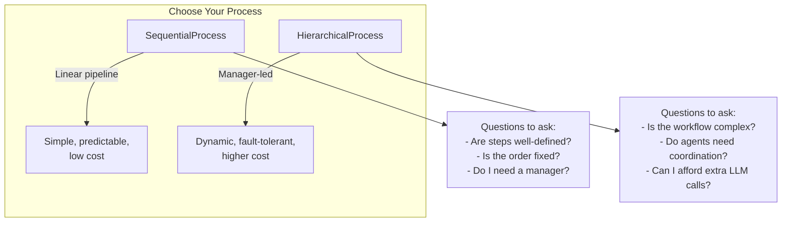
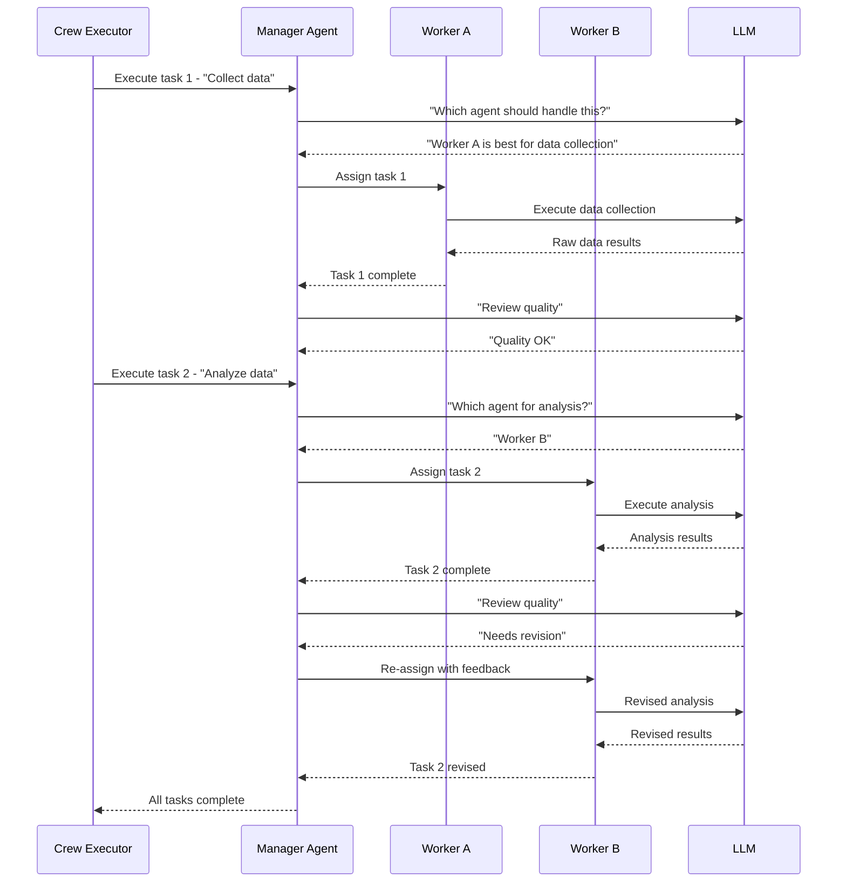
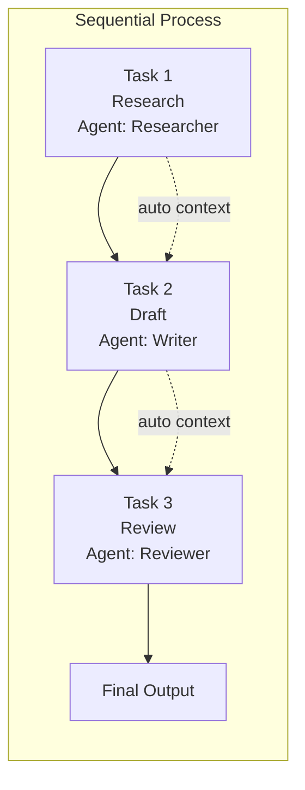
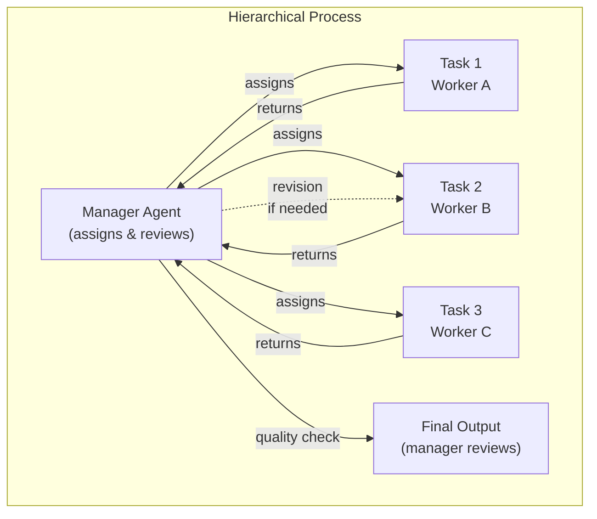
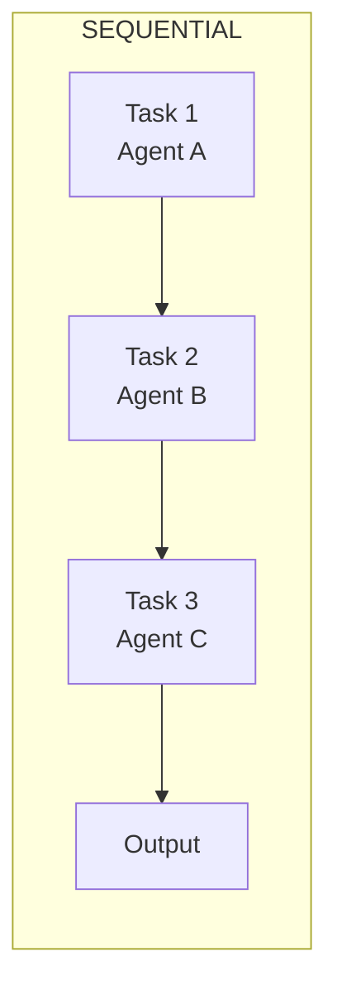
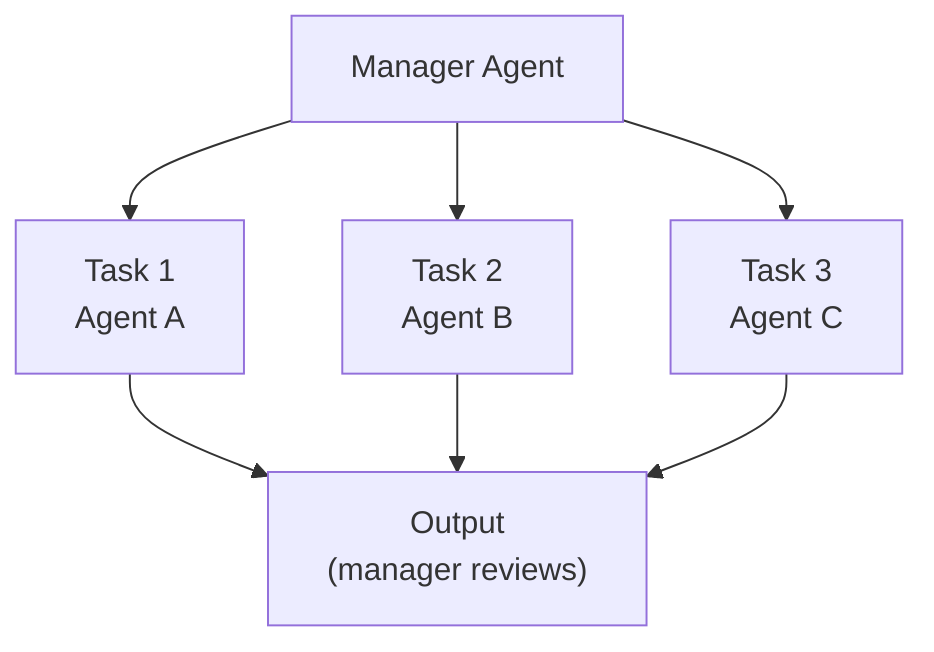

# Crew Orchestration: Sequential and Hierarchical Processes

CrewAI supports two built-in orchestration processes: **sequential** (linear pipeline) and **hierarchical** (manager-led). Choosing the right process determines how tasks flow and how agents collaborate. This decision directly impacts the scalability, robustness, and cost of your multi-agent system.

---

## Process Overview



---

## Sequential Process (`SequentialProcess`)

Tasks run one after another in the order they are defined. Each task receives the output of the previous task automatically via context. This is the simplest and most predictable execution mode.

```python
from crewai import Agent, Task, Crew, Process

# Agents
researcher = Agent(
    role="Researcher",
    goal="Find relevant information",
    backstory="You are a thorough researcher.",
)

writer = Agent(
    role="Writer",
    goal="Write a clear article based on research",
    backstory="You are a skilled technical writer.",
)

reviewer = Agent(
    role="Reviewer",
    goal="Proofread and improve article quality",
    backstory="You are a meticulous editor.",
)

# Tasks (executed in order)
research_task = Task(
    description="Research the history of AI agents.",
    expected_output="A timeline of key milestones.",
    agent=researcher,
)

write_task = Task(
    description="Write a 300-word article from the research.",
    expected_output="A polished article.",
    agent=writer,
)

review_task = Task(
    description="Proofread and improve the article.",
    expected_output="Final version with tracked changes.",
    agent=reviewer,
)

# Sequential crew
crew = Crew(
    agents=[researcher, writer, reviewer],
    tasks=[research_task, write_task, review_task],
    process=Process.sequential,  # default if not specified
    verbose=True,
)

result = crew.kickoff()
```

[!NOTE]
`Process.sequential` is the default. If you do not specify a `process` parameter, CrewAI runs tasks sequentially. This is ideal for **well-defined pipelines** where each step depends on the previous one, such as research → draft → review → publish.

---

## Hierarchical Process (`HierarchicalProcess`)

A **manager agent** coordinates the work. It assigns tasks to worker agents, reviews outputs, and handles delegation automatically. The manager decides which agent should handle each task and can re-assign work if results are unsatisfactory.

```python
from crewai import Agent, Task, Crew, Process

# Manager agent — coordinates the crew
manager = Agent(
    role="Project Manager",
    goal="Deliver a high-quality final report",
    backstory="You manage technical projects and delegate tasks.",
    allow_delegation=True,  # required for hierarchical process
)

# Worker agents
engineer = Agent(
    role="Data Engineer",
    goal="Build data pipelines",
    backstory="You design ETL pipelines.",
)

analyst = Agent(
    role="Analyst",
    goal="Extract insights from data",
    backstory="You turn data into business value.",
)

# Tasks — the manager decides who does what
pipeline_task = Task(
    description="Build a pipeline to collect user activity data.",
    expected_output="Working pipeline description.",
    agent=engineer,
)

insight_task = Task(
    description="Analyze the collected data for user behavior patterns.",
    expected_output="Report of 3 key patterns.",
    agent=analyst,
)

summary_task = Task(
    description="Summarize all findings into an executive brief.",
    expected_output="One-page executive brief.",
    agent=manager,
)

# Hierarchical crew
crew = Crew(
    agents=[manager, engineer, analyst],
    tasks=[pipeline_task, insight_task, summary_task],
    process=Process.hierarchical,
    verbose=True,
    manager_agent=manager,  # explicit manager
)

result = crew.kickoff()
```

[!WARNING]
In a hierarchical process, the manager agent **must** have `allow_delegation=True`. Without it, the crew cannot assign tasks dynamically and will raise an error at runtime. Additionally, the manager incurs extra LLM calls for every delegation decision, increasing both token usage and cost.

---

## Hierarchical Manager Decision Flow



---

## Context Passing Between Tasks

Tasks can explicitly pass context to downstream tasks using the `context` parameter:

```python
task_a = Task(
    description="Collect sales data for Q1.",
    expected_output="Raw Q1 sales data.",
    agent=gatherer,
)

task_b = Task(
    description="""Analyze the Q1 sales data and identify trends.
The data is: {context}""",
    expected_output="3 trends with supporting evidence.",
    agent=analyst,
    context=[task_a],  # passes task_a's output as context
)
```

In a sequential process, context is passed automatically. In a hierarchical process, the manager decides what context each worker receives.

```python
# Multiple context sources
task_c = Task(
    description=(
        "Write a comprehensive report using the following data:\n\n"
        "Sales Data:\n{sales_context}\n\n"
        "User Research:\n{research_context}"
    ),
    expected_output="A 2-page comprehensive report.",
    agent=writer,
    context=[sales_task, research_task],  # multiple upstream tasks
)
```

[!TIP]
Use the `context` parameter even in sequential processes when a task needs input from a non-adjacent earlier task. For example, task D needs data from task A (skipping B and C). Explicit context makes these relationships clear and maintainable.

---

## Sequential Execution Visualization





---

## Process Comparison

| Aspect | SequentialProcess | HierarchicalProcess |
| :--- | :--- | :--- |
| **Execution order** | Fixed linear order | Manager decides dynamically |
| **Agent autonomy** | Low — tasks are pre-assigned | High — manager assigns & reviews |
| **Manager required** | No | Yes (with `allow_delegation=True`) |
| **Context passing** | Automatic between adjacent tasks | Managed by the manager agent |
| **Best for** | Simple pipelines, well-defined steps | Complex workflows requiring coordination |
| **Overhead** | Minimal | Higher (manager LLM calls) |
| **Error recovery** | Manual | Manager can re-assign failed tasks |
| **Token cost** | 1 LLM call per task | 1-2 extra LLM calls per task (manager decisions) |
| **Scalability** | Up to ~10 tasks | Up to ~50+ agents |
| **Debugging** | Easy (linear trace) | Moderate (manager decisions add complexity) |

### When to Use Each Process

| Scenario | Recommended Process | Reason |
| :--- | :--- | :--- |
| Research → Write → Publish pipeline | Sequential | Fixed steps, clear dependencies |
| Multi-agent software development team | Hierarchical | Needs coordination, code review, re-assignment |
| Data ETL with validation checks | Sequential | Each step depends cleanly on previous |
| Customer support with escalation | Hierarchical | Dynamic routing based on issue type |
| Content generation with review cycle | Sequential | Predictable order, well-defined stages |
| Automated research with unknown requirements | Hierarchical | Manager adapts to findings dynamically |

---

## Custom Manager Configuration

When you do not specify a `manager_agent`, CrewAI creates a default manager LLM. You can customize this:

```python
from langchain_openai import ChatOpenAI
from crewai import Agent, Task, Crew, Process

# Custom manager LLM — faster, cheaper model
manager_llm = ChatOpenAI(
    model="gpt-4o-mini",
    temperature=0.0,  # deterministic delegation decisions
)

# Crew with implicit manager (CrewAI creates one)
crew = Crew(
    agents=[worker_a, worker_b, worker_c],
    tasks=[task1, task2, task3],
    process=Process.hierarchical,
    manager_llm=manager_llm,  # custom LLM for the default manager
    verbose=True,
)

# Or use an explicit manager agent
explicit_manager = Agent(
    role="Technical Program Manager",
    goal="Deliver projects on time with high quality",
    backstory="You manage AI engineering teams.",
    allow_delegation=True,
    llm=manager_llm,  # custom LLM for this manager
)

crew_with_manager = Crew(
    agents=[explicit_manager, worker_a, worker_b],
    tasks=[task1, task2, task3],
    process=Process.hierarchical,
    manager_agent=explicit_manager,
    verbose=True,
)
```

---

## ASCII Diagram: Sequential vs Hierarchical





In sequential mode, agents execute in a fixed order. In hierarchical mode, the manager dynamically orchestrates the flow.

---

## Interactive Questions

```question
{
  "id": "ca-03-q1",
  "type": "multiple-choice",
  "question": "You are building a content pipeline: outline → draft → review → publish. Each step depends on the previous one. Which process should you use?",
  "options": [
    "HierarchicalProcess — for dynamic assignment",
    "SequentialProcess — for fixed linear steps",
    "Neither — this requires custom code",
    "Either would work equally well"
  ],
  "correct": 1,
  "explanation": "A content pipeline has well-defined, fixed-order steps where each depends on the previous. SequentialProcess is ideal: simple, predictable, and low-overhead."
}
```

```question
{
  "id": "ca-03-q2",
  "type": "multiple-choice",
  "question": "Your hierarchical crew has 5 workers. The manager spends a lot on LLM calls for delegation decisions. What optimization can you make?",
  "options": [
    "Switch to SequentialProcess",
    "Use a cheaper LLM for the manager (e.g., gpt-4o-mini)",
    "Remove allow_delegation from the manager",
    "Reduce the number of tasks"
  ],
  "correct": 1,
  "explanation": "The manager makes delegation decisions via LLM calls. Using a cheaper model (gpt-4o-mini) for the manager reduces cost while keeping reasoning quality high for workers."
}
```

```question
{
  "id": "ca-03-q3",
  "type": "multiple-choice",
  "question": "In a sequential process, Task C needs data from Task A (not from B, which runs between them). How do you provide this context?",
  "options": [
    "Re-order tasks so A is adjacent to C",
    "Use context=[task_a] on Task C",
    "The sequential process handles this automatically",
    "Switch to hierarchical process"
  ],
  "correct": 1,
  "explanation": "Use the context parameter to explicitly link non-adjacent tasks. Task C can reference Task A's output directly via context=[task_a], even though Task B runs between them."
}
```

```question
{
  "id": "ca-03-q4",
  "type": "multiple-choice",
  "question": "You run a hierarchical crew without setting manager_agent. What happens?",
  "options": [
    "The crew runs sequentially instead",
    "CrewAI creates a default manager LLM",
    "An error is raised",
    "The first agent becomes the manager"
  ],
  "correct": 1,
  "explanation": "When no manager_agent is specified, CrewAI automatically creates a default manager LLM to handle delegation. You can customize it via manager_llm."
}
```

```question
{
  "id": "ca-03-q5",
  "type": "multiple-choice",
  "question": "A hierarchical crew has a manager and 3 workers. Worker A's output is substandard. What can the manager do?",
  "options": [
    "Nothing — tasks are fixed after assignment",
    "Re-assign the task to a different worker or request revision",
    "Remove Worker A from the crew",
    "Switch to SequentialProcess automatically"
  ],
  "correct": 1,
  "explanation": "A key advantage of hierarchical process is the manager can review outputs and re-assign failing tasks to different workers or request revisions from the same worker."
}
```

---

## 5 Practice Questions

**1. Which process type requires a manager agent with `allow_delegation=True`?**

- A) SequentialProcess
- B) HierarchicalProcess ✅
- C) Both
- D) Neither

**2. How is context passed between tasks in a sequential process?**

- A) Explicitly via the `context` parameter only
- B) Automatically between adjacent tasks ✅
- C) Context is never shared
- D) Via a shared database

**3. What is the main advantage of a hierarchical process over a sequential one?**

- A) Lower token usage
- B) Dynamic task assignment and error recovery ✅
- C) Faster execution
- D) Simpler configuration

**4. Which enum value represents the sequential process in CrewAI?**

- A) `Process.linear`
- B) `Process.sequential` ✅
- C) `Process.pipeline`
- D) `Process.simple`

**5. What happens if you use `Process.hierarchical` without setting `manager_agent`?**

- A) The first agent becomes the manager
- B) CrewAI creates a default manager LLM ✅
- C) The crew runs sequentially instead
- D) An error is raised immediately

---

[!SUCCESS]
### Key Takeaways
- `Process.sequential` runs tasks in a fixed linear order with automatic context passing.
- `Process.hierarchical` uses a manager agent for dynamic task assignment.
- The manager agent must have `allow_delegation=True`.
- Context can be passed explicitly via the `context` parameter on any task.
- Sequential is best for simple, well-defined pipelines.
- Hierarchical excels at complex workflows requiring coordination.
- The manager in a hierarchical process can re-assign failed tasks.
- Use cheaper LLMs for the manager to reduce hierarchical overhead.
- Explicit `context` links non-adjacent tasks even in sequential mode.
