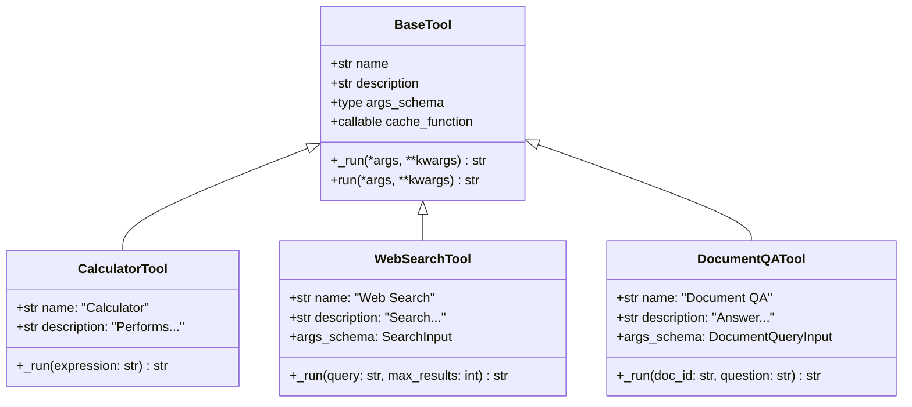
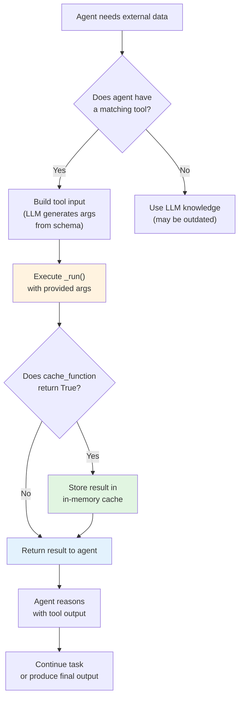
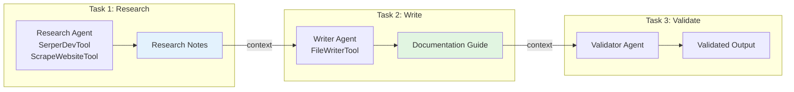

# Custom Tools, Tool Integration and Shared Context

Tools give agents the ability to interact with external systems: search the web, query databases, run calculations, or call APIs. CrewAI provides a rich tool ecosystem and a simple API for creating your own. Without tools, agents can only use their training data; with tools, they can access real-time information and take actions in the world.

---

## The `BaseTool` Class

Every tool in CrewAI extends `BaseTool`. At minimum, you define a `name`, `description`, and `_run()` method:

```python
from crewai.tools import BaseTool
from pydantic import Field

class CalculatorTool(BaseTool):
    name: str = "Calculator"
    description: str = "Performs basic arithmetic operations (add, subtract, multiply, divide)."

    # Optional: define input schema with Pydantic
    args_schema: type = Field  # uses the tool's own fields

    def _run(self, expression: str) -> str:
        """Evaluate a simple arithmetic expression."""
        try:
            result = eval(expression)  # simplified — use safe eval in production
            return f"Result: {result}"
        except Exception as e:
            return f"Error: {str(e)}"
```

[!IMPORTANT]
The `name` and `description` fields are critical — they are what the agent's LLM reads to decide when to use a tool. A clear, descriptive name and a detailed description of when and how to use the tool dramatically improve correct tool selection by the agent.

---

## Tool Class Hierarchy



---

## Creating a Custom Tool with Parameters

You can define structured input parameters using Pydantic:

```python
from crewai.tools import BaseTool
from pydantic import BaseModel, Field

class SearchInput(BaseModel):
    query: str = Field(description="The search query string")
    max_results: int = Field(default=5, description="Maximum number of results to return")

class WebSearchTool(BaseTool):
    name: str = "Web Search"
    description: str = "Search the web for current information on a given topic."
    args_schema: type = SearchInput

    def _run(self, query: str, max_results: int = 5) -> str:
        # Mock implementation — replace with real API call
        results = [
            f"Result {i}: Mock result for '{query}'"
            for i in range(1, max_results + 1)
        ]
        return "\n".join(results)
```

```python
# Using the tool
tool = WebSearchTool()
result = tool._run(query="CrewAI agents", max_results=3)
print(result)
# Result 1: Mock result for 'CrewAI agents'
# Result 2: Mock result for 'CrewAI agents'
# Result 3: Mock result for 'CrewAI agents'
```

---

## Custom Tool Execution Flow



---

## Real-World Tool: Web Search with Serper

```python
import requests
from crewai.tools import BaseTool
from pydantic import BaseModel, Field

class SearchInput(BaseModel):
    query: str = Field(description="The search query to look up")

class RealSearchTool(BaseTool):
    name: str = "Web Search"
    description: str = "Search Google for current information using the Serper API."
    args_schema: type = SearchInput

    def _run(self, query: str) -> str:
        """Execute a real web search via Serper.dev API."""
        url = "https://google.serper.dev/search"
        headers = {
            "X-API-KEY": "your-api-key-here",  # replace with real key
            "Content-Type": "application/json",
        }
        payload = {"q": query, "num": 5}

        try:
            response = requests.post(url, json=payload, headers=headers)
            response.raise_for_status()
            data = response.json()

            # Format results
            results = []
            for item in data.get("organic", []):
                title = item.get("title", "")
                snippet = item.get("snippet", "")
                link = item.get("link", "")
                results.append(f"- [{title}]({link})\n  {snippet}")

            return "\n".join(results) if results else "No results found."
        except Exception as e:
            return f"Search failed: {str(e)}"
```

---

## Tool Caching

CrewAI automatically caches tool outputs when the same input is used again within a crew run:

```python
class ExpensiveAPITool(BaseTool):
    name: str = "Expensive API"
    description: str = "Calls an external API with expensive rate limits."
    cache_function: callable = lambda args: True  # enable caching

    def _run(self, query: str) -> str:
        # This result will be cached after the first call
        return f"Data for: {query}"
```

| Cache Setting | Behavior |
| :--- | :--- |
| No cache function | Results are never cached |
| `lambda args: True` | Always cache results |
| `lambda args: len(args) > 10` | Cache only for long queries |

[!WARNING]
Caching is **in-memory** and scoped to one `crew.kickoff()` call. If you need persistent caching across runs, implement your own cache layer using Redis or a database.

[!TIP]
Use caching aggressively for tools that call rate-limited APIs (e.g., GPT-4 API calls, external search APIs). A `cache_function` that always returns `True` for deterministic tools prevents redundant API calls and speeds up execution significantly.

```python
from datetime import datetime, timedelta

# Time-based caching — only cache for 5 minutes
class TimeBasedCacheTool(BaseTool):
    name: str = "Time Check"
    description: str = "Checks current time."
    cache_function: callable = lambda args: False  # never cache time data

# Conditional caching — cache based on input characteristics
class SmartCacheTool(BaseTool):
    name: str = "Stock Price"
    description: str = "Fetches current stock prices."
    cache_function: callable = lambda args: len(str(args)) < 20  # short queries
```

---

## Built-in Tools (`crewai_tools`)

The `crewai_tools` package provides many ready-to-use tools:

```python
from crewai_tools import (
    SerperDevTool,        # Google Search via Serper
    ScrapeWebsiteTool,    # Extract text from a URL
    FileReadTool,         # Read local files
    FileWriterTool,       # Write to local files
    MDXSearchTool,        # Search within .mdx documentation
    DirectoryReadTool,    # List directory contents
    CodeInterpreterTool,  # Execute Python code
    PDFSearchTool,        # Search PDF documents
)

# Attach tools to an agent
researcher = Agent(
    role="Researcher",
    goal="Find and summarize online information",
    backstory="You are a research specialist.",
    tools=[SerperDevTool(), ScrapeWebsiteTool()],
)
```

---

## Built-in Tool Comparison

| Tool | Purpose | Input | Output | Category |
| :--- | :--- | :--- | :--- | :--- |
| `SerperDevTool` | Google Search | Query string | Search result snippets | Search |
| `ScrapeWebsiteTool` | Web scraping | URL | Page text content | Web |
| `FileReadTool` | Read files | File path | File contents | File |
| `FileWriterTool` | Write files | Path + content | Confirmation message | File |
| `MDXSearchTool` | MDX doc search | Query | Relevant sections | Search |
| `DirectoryReadTool` | List directory | Directory path | File/folder list | File |
| `CodeInterpreterTool` | Run Python | Code string | Execution output | Code |
| `PDFSearchTool` | PDF search | PDF path + query | Matching text chunks | Search |

### Tool Categories

| Category | Tools | Use Case |
| :--- | :--- | :--- |
| **Search** | `SerperDevTool`, `MDXSearchTool`, `PDFSearchTool` | Finding information |
| **Web** | `ScrapeWebsiteTool` | Extracting web content |
| **File** | `FileReadTool`, `FileWriterTool`, `DirectoryReadTool` | Local file operations |
| **Code** | `CodeInterpreterTool` | Running code |

---

## Sharing Context Between Tasks

Tasks can share context explicitly, enabling multi-step research workflows:

```python
from crewai import Agent, Task, Crew

researcher = Agent(
    role="Research Analyst",
    goal="Find comprehensive information",
    backstory="You are a skilled researcher.",
)

writer = Agent(
    role="Technical Writer",
    goal="Create documentation from research notes",
    backstory="You write clear developer documentation.",
)

# Task 1: research
research_task = Task(
    description="Research CrewAI custom tool development.",
    expected_output="Detailed research notes with API references.",
    agent=researcher,
)

# Task 2: write — receives research output as context
write_task = Task(
    description="""Write a step-by-step guide based on this research:
    
{context}""",
    expected_output="A complete guide in markdown format.",
    agent=writer,
    context=[research_task],  # explicit context from prior task
)

crew = Crew(
    agents=[researcher, writer],
    tasks=[research_task, write_task],
    verbose=True,
)

result = crew.kickoff()
```

---

## Context Flow Diagram



---

## Full Example: Custom Tool + Shared Context

```python
from crewai.tools import BaseTool
from crewai import Agent, Task, Crew
from pydantic import BaseModel, Field

# --- Custom tool ---
class DocumentQueryInput(BaseModel):
    doc_id: str = Field(description="Document identifier")
    question: str = Field(description="Question about the document")

class DocumentQATool(BaseTool):
    name: str = "Document QA"
    description: str = "Answer questions about internal documents."
    args_schema: type = DocumentQueryInput

    def _run(self, doc_id: str, question: str) -> str:
        # Mock QA — replace with a real retrieval pipeline
        return f"Answer to '{question}' on doc {doc_id}: [mock answer]"

# --- Agents & Tasks ---
qa_agent = Agent(
    role="QA Specialist",
    goal="Answer document questions accurately",
    backstory="You are an expert at document analysis.",
    tools=[DocumentQATool()],
)

summarizer = Agent(
    role="Summarizer",
    goal="Summarize Q&A into key insights",
    backstory="You distill complex Q&A into clear summaries.",
)

qa_task = Task(
    description="Answer questions about doc-42 using the Document QA tool.",
    expected_output="Answers to all questions.",
    agent=qa_agent,
)

summary_task = Task(
    description="Summarize the Q&A results.\n\n{context}",
    expected_output="3 key insight bullet points.",
    agent=summarizer,
    context=[qa_task],
)

crew = Crew(
    agents=[qa_agent, summarizer],
    tasks=[qa_task, summary_task],
    verbose=True,
)

crew.kickoff()
```

---

## Interactive Questions

```question
{
  "id": "ca-04-q1",
  "type": "multiple-choice",
  "question": "You build a custom tool that queries a weather API. The agent never uses it. What is the most likely cause?",
  "options": [
    "The LLM is too small",
    "The tool's name and description are unclear or misleading",
    "The tool has too many parameters",
    "The agent has verbose=True"
  ],
  "correct": 1,
  "explanation": "The agent's LLM decides when to use tools based on their name and description. If 'name' and 'description' don't clearly indicate when to use the tool, the agent will ignore it."
}
```

```question
{
  "id": "ca-04-q2",
  "type": "multiple-choice",
  "question": "Your custom tool calls an API with rate limits. The same query is made 10 times in one crew run. How can you optimize this?",
  "options": [
    "Increase the timeout",
    "Add a cache_function that returns True",
    "Reduce the description length",
    "Use a different base class"
  ],
  "correct": 1,
  "explanation": "Setting cache_function=lambda args: True caches results in memory per crew run, so repeated identical queries won't trigger API calls after the first one."
}
```

```question
{
  "id": "ca-04-q3",
  "type": "multiple-choice",
  "question": "A task needs input from two different upstream tasks. How do you provide both contexts?",
  "options": [
    "Use a single context parameter with a list of both tasks",
    "Create a third task that merges them",
    "Switch to hierarchical process",
    "Use two separate context parameters"
  ],
  "correct": 0,
  "explanation": "The context parameter accepts a list: context=[task_a, task_b]. The downstream task receives both outputs and can reference them in its description."
}
```

```question
{
  "id": "ca-04-q4",
  "type": "multiple-choice",
  "question": "You deploy a CrewAI system to production. Tool caching no longer works across user sessions. Why?",
  "options": [
    "Caching only works in development mode",
    "Tool caching is in-memory per kickoff() call — it doesn't persist across runs",
    "The cache_function was removed in production",
    "Production requires verbose=True for caching"
  ],
  "correct": 1,
  "explanation": "CrewAI's built-in caching is in-memory and scoped to a single crew.kickoff() call. For persistent caching across sessions, implement Redis or database-backed caching."
}
```

```question
{
  "id": "ca-04-q5",
  "type": "multiple-choice",
  "question": "An agent has both SerperDevTool (web search) and CalculatorTool. The task is 'Calculate 15% of 340'. Which tool should the agent use?",
  "options": [
    "SerperDevTool — to search for the answer",
    "CalculatorTool — to compute the percentage",
    "Both — search first, then calculate",
    "Neither — the agent computes internally"
  ],
  "correct": 1,
  "explanation": "CalculatorTool is the correct choice for arithmetic operations. The agent should use tool descriptions to match the task to the right tool — CalculatorTool's description mentions arithmetic."
}
```

---

## 5 Practice Questions

**1. Which base class should you extend to create a custom CrewAI tool?**

- A) `Agent`
- B) `BaseTool` ✅
- C) `ToolBase`
- D) `Crew`

**2. What is the purpose of `args_schema` in a custom tool?**

- A) It enables caching
- B) It defines the tool's input parameters using Pydantic ✅
- C) It sets the tool's description
- D) It registers the tool with the crew

**3. Which tool from `crewai_tools` would you use to search the web?**

- A) `FileReadTool`
- B) `CodeInterpreterTool`
- C) `SerperDevTool` ✅
- D) `DirectoryReadTool`

**4. How does tool caching work in CrewAI?**

- A) Results are stored in a SQLite database
- B) Results are cached in memory per `kickoff()` call ✅
- C) Results are never cached
- D) Caching requires a Redis instance

**5. Which parameter on a `Task` allows you to pass output from another task?**

- A) `context` ✅
- B) `depends_on`
- C) `inputs`
- D) `shared_context`

---

[!SUCCESS]
### Key Takeaways
- Extend `BaseTool` and implement `_run()` to create custom tools.
- Use Pydantic models as `args_schema` for structured tool inputs.
- Tool caching is in-memory per crew run and reduces redundant API calls.
- The `crewai_tools` package provides ready-to-use tools for search, scraping, files, and code execution.
- The `context` parameter on a `Task` enables explicit data flow between tasks.
- Custom tools can encapsulate any external API or computation.
- Always provide a clear `name` and `description` for each tool so agents use them correctly.
- Tool descriptions are what LLMs use to decide tool selection — invest in them.
- Agent-level tools can be overridden by task-level tools for specific needs.
