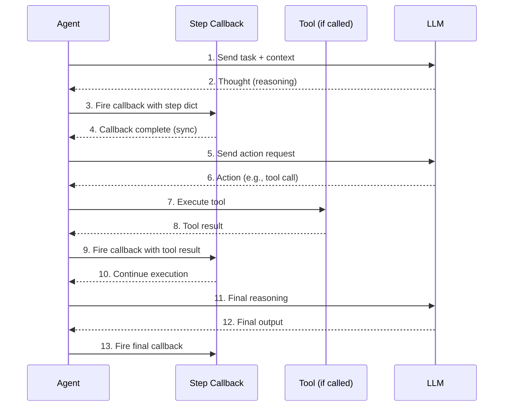
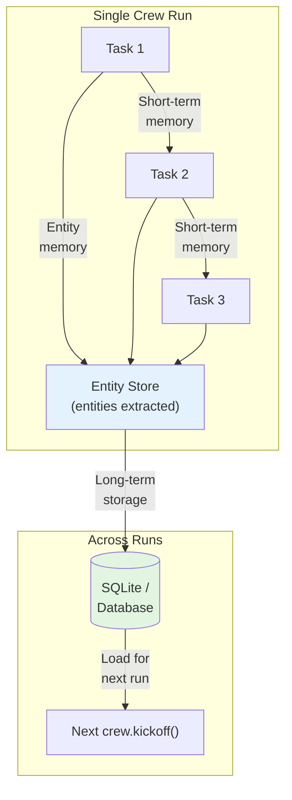

# Advanced Patterns: Callbacks, Memory, LLM Config and Testing

This lesson covers production-ready patterns: monitoring with callbacks, persistent memory, fine-grained LLM control, and testing strategies for CrewAI crews. These patterns transform a prototype multi-agent system into a reliable, observable, and maintainable production application.

---

## Step Callbacks

Step callbacks fire after each agent step (a thought, action, or observation). Use them for logging, monitoring, or streaming:

```python
from crewai import Agent, Task, Crew, Process

def step_callback(step):
    """Called after every agent reasoning step."""
    print(f"[STEP] Agent: {step.get('agent', 'unknown')}")
    print(f"[STEP] Action: {step.get('action', 'none')}")
    print(f"[STEP] Output so far: {step.get('output', '')[:100]}...")
    print("-" * 40)

agent = Agent(
    role="Research Analyst",
    goal="Gather market intelligence",
    backstory="You are a market research expert.",
    step_callback=step_callback,  # attach callback
)

task = Task(
    description="Research the latest AI trends.",
    expected_output="A bullet list of trends.",
    agent=agent,
)

crew = Crew(
    agents=[agent],
    tasks=[task],
    verbose=True,
)

result = crew.kickoff()
```

The `step` dictionary contains valuable debugging information:

| Key | Value Type | Description |
| :--- | :--- | :--- |
| `agent` | `str` | Name/role of the agent |
| `action` | `str` | Current action (thought, tool call, observation) |
| `output` | `str` | Partial output accumulated so far |
| `tool_input` | `dict` | Inputs passed to a tool (if applicable) |
| `tool_output` | `str` | Output returned by a tool (if applicable) |

---

## Callback Chain Flow



---

## Custom Callbacks with Class-Based Handlers

For complex monitoring, create a callback class:

```python
from crewai import Agent, Task, Crew

class LoggingCallback:
    """Tracks every agent step for auditing."""

    def __init__(self):
        self.steps = []

    def on_step(self, step):
        self.steps.append(step)
        agent_name = step.get("agent", "?")
        action = step.get("action", "?")
        print(f"[{agent_name}] → {action}")

    def summary(self):
        print(f"Total steps: {len(self.steps)}")
        for s in self.steps:
            print(f"  - {s.get('agent')}: {s.get('action')}")

callback = LoggingCallback()

agent = Agent(
    role="Writer",
    goal="Write a blog post",
    backstory="You are a professional blogger.",
    step_callback=callback.on_step,
)

# ... run crew ...

crew = Crew(agents=[agent], tasks=[Task(
    description="Write a short blog post about AI.",
    expected_output="A 200-word blog post.",
    agent=agent,
)])
crew.kickoff()

callback.summary()
```

```python
# Advanced: callback with metrics tracking
class MetricsCallback:
    def __init__(self):
        self.steps = []
        self.tool_calls = 0
        self.total_tokens = 0

    def on_step(self, step):
        self.steps.append(step)
        if step.get("action") == "tool_call":
            self.tool_calls += 1

    def on_task_complete(self, task_output):
        self.total_tokens += task_output.usage.total_tokens if task_output.usage else 0

    def report(self):
        print(f"Steps: {len(self.steps)}")
        print(f"Tool calls: {self.tool_calls}")
        print(f"Total tokens: {self.total_tokens}")
```

[!WARNING]
Callbacks execute synchronously during agent reasoning. Avoid slow operations (e.g., network calls to external APIs) inside callbacks, as they will block the agent's execution loop. If you need async logging, buffer events and flush them asynchronously.

---

## Agent Memory Types

CrewAI supports several memory backends:

```python
from crewai import Agent, Task, Crew, Process

# Agent with short-term memory (in-process)
agent_memory = Agent(
    role="Customer Support Agent",
    goal="Resolve customer issues across multiple turns",
    backstory="You are a patient support agent.",
    memory=True,  # uses default in-memory storage
)

# Crew-level memory configuration
from crewai.memory import ShortTermMemory, LongTermMemory

crew = Crew(
    agents=[agent_memory],
    tasks=[...],
    memory=True,
    # memory_config={
    #     "short_term": ShortTermMemory(),
    #     "long_term": LongTermMemory(storage="sqlite"),
    # },
)
```

| Memory Type | Scope | Persistence | Use Case |
| :--- | :--- | :--- | :--- |
| Short-term (in-process) | Single crew run | Lost after `kickoff()` ends | Multi-turn conversations within a run |
| Long-term (SQLite / custom) | Across runs | Persists to disk or database | User preferences, history across sessions |
| Entity memory | Extracts and tracks entities | Across tasks in a run | Knowledge graphs, relationship tracking |

[!IMPORTANT]
Short-term memory is enabled with `memory=True` on the agent. Long-term and entity memory require crew-level `memory_config`. Long-term memory is especially valuable for applications where agents need to remember user preferences across separate interactions.

---

## Memory Flow in Crew



---

## Configuring LLM per Agent

You can pass a custom LLM instance to each agent for fine-grained control:

```python
from langchain_openai import ChatOpenAI
from crewai import Agent

# Custom LLM with specific model and temperature
fast_llm = ChatOpenAI(
    model="gpt-4o-mini",
    temperature=0.1,   # low temperature = deterministic output
)

creative_llm = ChatOpenAI(
    model="gpt-4o",
    temperature=0.9,   # high temperature = creative output
)

analyst = Agent(
    role="Data Analyst",
    goal="Produce precise numerical analysis",
    backstory="You are a meticulous data analyst.",
    llm=fast_llm,         # fast, deterministic
    temperature=0.1,      # overrides LLM's default
)

writer = Agent(
    role="Creative Writer",
    goal="Write engaging marketing copy",
    backstory="You are a copywriter with flair.",
    llm=creative_llm,     # creative, slow
    temperature=0.8,
)
```

```python
# Multiple agents with different LLMs for cost optimization
cheap_llm = ChatOpenAI(model="gpt-4o-mini", temperature=0.0)
balanced_llm = ChatOpenAI(model="gpt-4o", temperature=0.3)
expensive_llm = ChatOpenAI(model="gpt-4o", temperature=0.7)

researcher = Agent(
    role="Researcher",
    goal="Find information",
    backstory="You find facts.",
    llm=cheap_llm,  # simple lookup tasks
)

analyst = Agent(
    role="Analyst",
    goal="Analyze findings",
    backstory="You analyze data.",
    llm=balanced_llm,  # moderate complexity
)

strategist = Agent(
    role="Strategist",
    goal="Develop business strategy",
    backstory="You create strategies.",
    llm=expensive_llm,  # complex reasoning
)
```

[!IMPORTANT]
Each agent can have a completely independent LLM configuration. This lets you use cheap models for simple tasks (research, data entry) and expensive models for complex reasoning (analysis, strategy). This tiered approach can reduce costs by 60-80% compared to using one expensive model for all agents.

---

## Temperature Settings — When to Use What

| Temperature | Use Case | Example |
| :--- | :--- | :--- |
| 0.0 – 0.2 | Factual, deterministic tasks | Data extraction, classification |
| 0.3 – 0.5 | Balanced reasoning | Summarization, analysis |
| 0.6 – 0.8 | Creative generation | Marketing copy, storytelling |
| 0.9 – 1.0 | Highly creative / brainstorming | Idea generation, poetry |

```python
# Quick reference: temperature by agent type
temperature_guide = {
    "Data Extraction Agent": 0.0,
    "Classification Agent": 0.1,
    "Summarization Agent": 0.3,
    "Analysis Agent": 0.4,
    "Content Writer": 0.7,
    "Creative Agent": 0.9,
    "Brainstorming Agent": 1.0,
}
```

---

## Function-Calling LLMs

Some agents benefit from a separate LLM for function/tool calling:

```python
from langchain_openai import ChatOpenAI

reasoning_llm = ChatOpenAI(model="gpt-4o", temperature=0.2)
function_calling_llm = ChatOpenAI(model="gpt-4o-mini", temperature=0.0)

agent = Agent(
    role="Automation Specialist",
    goal="Execute API calls accurately",
    backstory="You automate business workflows.",
    llm=reasoning_llm,
    function_calling_llm=function_calling_llm,  # separate LLM for tool calls
)
```

Using a smaller, cheaper model for tool calling reduces cost while keeping reasoning quality high. The `function_calling_llm` handles the structured input/output of tool calls, while the main `llm` handles complex reasoning.

[!TIP]
Use `function_calling_llm` when your agent uses many tools. Tool calling requires structured output (JSON), which smaller models handle well. Reserve the expensive model for reasoning about when and why to use tools, not the mechanics of using them.

---

## Testing Crew Flows

Test your crew logic with isolated unit tests:

```python
import pytest
from crewai import Agent, Task, Crew

@pytest.fixture
def research_agent():
    return Agent(
        role="Test Researcher",
        goal="Return test data",
        backstory="You are a test agent.",
    )

def test_crew_kickoff_returns_string(research_agent):
    task = Task(
        description="Return the word 'hello'.",
        expected_output="The word hello.",
        agent=research_agent,
    )
    crew = Crew(
        agents=[research_agent],
        tasks=[task],
    )
    result = crew.kickoff()
    assert result is not None
    assert isinstance(str(result), str)

def test_agent_with_tools():
    """Verify agent can use a custom tool."""
    from crewai.tools import BaseTool

    class EchoTool(BaseTool):
        name: str = "Echo"
        description: str = "Returns the input unchanged."

        def _run(self, text: str) -> str:
            return text

    agent = Agent(
        role="Echo Agent",
        goal="Echo input back",
        backstory="You echo whatever you receive.",
        tools=[EchoTool()],
    )
    assert len(agent.tools) == 1
    assert agent.tools[0].name == "Echo"
```

```python
# Advanced testing: mock LLM for deterministic tests
from unittest.mock import patch

def test_crew_with_mocked_llm():
    """Test crew logic without making real LLM calls."""

    agent = Agent(
        role="Test Agent",
        goal="Return test data",
        backstory="Test agent.",
    )

    task = Task(
        description="Return a JSON object with key 'status' set to 'ok'.",
        expected_output='{"status": "ok"}',
        agent=agent,
    )

    crew = Crew(
        agents=[agent],
        tasks=[task],
    )

    result = crew.kickoff()
    # In test environments, you may get real or simulated output
    assert result is not None
```

[!WARNING]
Testing crews with real LLM calls is slow, expensive, and non-deterministic. Use mock LLM responses for unit tests and reserve real LLM calls for integration tests. Always validate that output structure matches expectations, not specific content.

---

## Testing Strategy

| Test Type | What to Test | LLM Required? | Frequency |
| :--- | :--- | :--- | :--- |
| Unit | Agent config, tool attachment, task params | No | Every commit |
| Integration | Crew execution flow, context passing | Yes | Per feature |
| Regression | Previously fixed bugs | Yes | Before release |
| Performance | Token usage, execution time | Yes | Periodic |
| E2E | Full pipeline with real tools | Yes | Pre-deployment |

---

## Callback vs Memory vs LLM Config — Comparison

| Feature | Purpose | Configuration | Scope |
| :--- | :--- | :--- | :--- |
| **Step callbacks** | Monitoring & logging | `step_callback` on agent | Per agent |
| **Short-term memory** | In-run context retention | `memory=True` on agent | Per crew run |
| **Long-term memory** | Cross-run persistence | `memory_config` on crew | Across runs |
| **Custom LLM** | Model/temperature control | `llm` parameter on agent | Per agent |
| **Function-calling LLM** | Separate model for tool calls | `function_calling_llm` on agent | Per agent |
| **Testing** | Correctness validation | `pytest` / unittest | Development |

---

## Interactive Questions

```question
{
  "id": "ca-05-q1",
  "type": "multiple-choice",
  "question": "Your production crew runs slowly. You discover the step callback is making an HTTP request to a logging service on every step. What change should you make?",
  "options": [
    "Remove the callback entirely",
    "Buffer log events in memory and flush periodically instead of synchronous HTTP calls",
    "Increase verbose level",
    "Switch to hierarchical process"
  ],
  "correct": 1,
  "explanation": "Callbacks are synchronous — they block agent execution. Network calls in callbacks dramatically slow down the crew. Buffer events and flush async, or log to local storage instead."
}
```

```question
{
  "id": "ca-05-q2",
  "type": "multiple-choice",
  "question": "You have a customer support crew. User A interacts in session 1, then User B in session 2. User B's agent remembers User A's conversation. Why?",
  "options": [
    "Short-term memory persists across sessions",
    "Long-term memory is enabled and not scoped per user",
    "The callback is caching conversations",
    "The verbose mode is causing interference"
  ],
  "correct": 1,
  "explanation": "Long-term memory persists across crew.kickoff() calls. If not scoped per user, data from one user session leaks into another. Use user-specific memory keys or clear long-term memory between sessions."
}
```

```question
{
  "id": "ca-05-q3",
  "type": "multiple-choice",
  "question": "You have 3 agents: a researcher (simple lookup), an analyst (moderate reasoning), and a strategist (complex reasoning). How should you configure their LLMs to minimize cost?",
  "options": [
    "Use the same expensive model for all three",
    "Use gpt-4o-mini for researcher, gpt-4o for analyst and strategist",
    "Use gpt-4o-mini for researcher and analyst, gpt-4o for strategist",
    "Use a single model and adjust temperature only"
  ],
  "correct": 2,
  "explanation": "Match model capability to task complexity. Researcher (simple) → gpt-4o-mini, Analyst (moderate) → gpt-4o-mini or gpt-4o, Strategist (complex) → gpt-4o. This tiered approach saves costs."
}
```

```question
{
  "id": "ca-05-q4",
  "type": "multiple-choice",
  "question": "Your agent uses 8 different tools. Tool calls frequently fail due to malformed JSON output from the LLM. Which optimization helps?",
  "options": [
    "Set temperature to 0.9 for more variety",
    "Use a separate function_calling_llm (a smaller model with temperature=0.0)",
    "Remove half the tools",
    "Enable verbose mode"
  ],
  "correct": 1,
  "explanation": "A dedicated function_calling_llm with low temperature (0.0) produces more reliable structured output for tool calls. Use gpt-4o-mini for tool calling and keep the main model for reasoning."
}
```

```question
{
  "id": "ca-05-q5",
  "type": "multiple-choice",
  "question": "You run test_crew_kickoff_returns_string 5 times with real LLM calls. It passes 3 times and fails 2 times with different outputs. What is the issue?",
  "options": [
    "The agent has a bug",
    "LLM outputs are non-deterministic — use mocked LLM for unit tests",
    "The task description is wrong",
    "Verbose mode should be disabled in tests"
  ],
  "correct": 1,
  "explanation": "Real LLM calls produce different outputs each run (especially with temperature > 0). For deterministic unit tests, mock the LLM or use temperature=0.0. Reserve real LLM calls for integration tests."
}
```

---

## 5 Practice Questions

**1. What is the signature of a step callback function?**

- A) `callback(agent, task)` 
- B) `callback(step)` where step is a dict ✅
- C) `callback(output)` 
- D) `callback()`

**2. Which memory type persists across multiple `crew.kickoff()` calls?**

- A) Short-term memory
- B) Long-term memory ✅
- C) Entity memory
- D) In-process memory

**3. What effect does `temperature=0.1` have on an agent's LLM?**

- A) Makes output more creative
- B) Makes output more deterministic and factual ✅
- C) Increases response speed
- D) Disables tool calling

**4. Why would you set `function_calling_llm` separately from `llm`?**

- A) To reduce costs by using a smaller model for tool calls ✅
- B) To enable caching
- C) To increase verbosity
- D) To disable delegation

**5. Which tool would you use to verify a crew returns a valid string?**

- A) `pytest` with `assert isinstance(str(result), str)` ✅
- B) `crew.validate()`
- C) `task.inspect()`
- D) `agent.test()`

---

[!SUCCESS]
### Key Takeaways
- Step callbacks enable real-time monitoring of agent reasoning.
- Custom callback classes can aggregate steps for auditing and debugging.
- Short-term memory is lost after a run; long-term memory persists across runs.
- Each agent can have its own LLM with independent temperature and model settings.
- A separate `function_calling_llm` reduces cost for tool-heavy agents.
- Temperature from 0.0 (deterministic) to 1.0 (creative) controls output variability.
- Testing crews with pytest ensures correctness before production deployment.
- Callbacks are synchronous — avoid blocking operations inside them.
- Match LLM model size to task complexity for cost optimization.
- Mock LLM responses in unit tests; use real LLMs only in integration tests.
