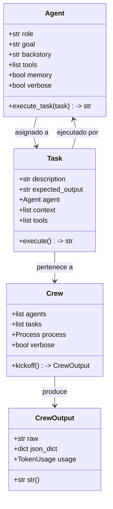
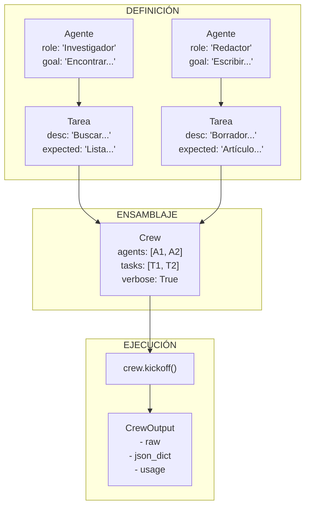
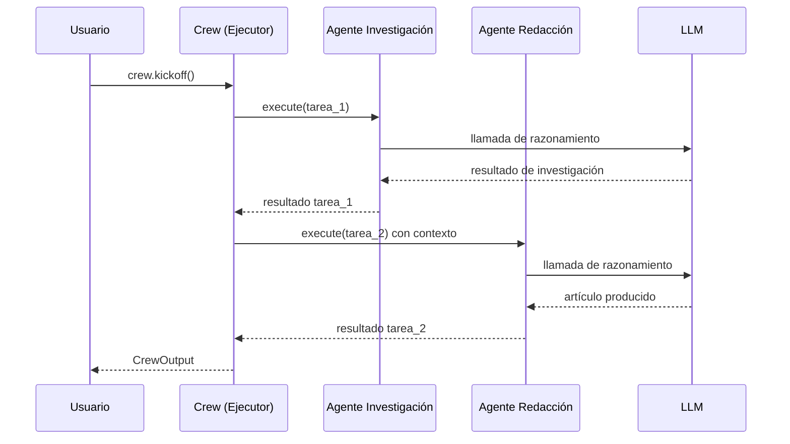

# Fundamentos de CrewAI, Agentes y Tareas

CrewAI es un framework de orquestración multi-agente que permite definir **agentes de IA basados en roles**, asignarles **tareas** y ejecutarlos como un **crew** coordinado. Está construido sobre grandes modelos de lenguaje (LLMs) y proporciona una API Pythonica limpia para componer flujos de trabajo multi-agente sofisticados.

---

## ¿Qué es CrewAI?

CrewAI proporciona tres abstracciones principales que trabajan juntas para crear sistemas multi-agente:

- **Agent** — Una entidad de IA con un rol, objetivo e historia específicos. Los agentes usan LLMs para razonar, tomar decisiones y ejecutar tareas.
- **Task** — Una unidad de trabajo asignada a un agente, con descripción, salida esperada y herramientas o dependencias de contexto opcionales.
- **Crew** — El orquestador que ensambla agentes y tareas, gestiona el flujo de ejecución y devuelve los resultados finales.

```python
from crewai import Agent, Task, Crew

# Las tres clases principales trabajan juntas
agent = Agent(role="Analista", goal="Analizar datos", backstory="Experto en datos.")
task = Task(description="Analizar datos de ventas del Q1.", expected_output="Informe.", agent=agent)
crew = Crew(agents=[agent], tasks=[task])
result = crew.kickoff()
```

Los agentes de CrewAI típicamente usan grandes modelos de lenguaje (LLMs) para razonar, ejecutar tareas y colaborar. El framework abstrae la complejidad de la ingeniería de prompt, llamadas a herramientas y razonamiento en múltiples pasos.

[!NOTE]
CrewAI está diseñado para **orquestración multi-agente basada en roles**. Si necesitas un bucle de agente único con llamadas a herramientas, LangGraph o una cadena simple de LangChain puede ser más apropiada. CrewAI brilla cuando tienes múltiples agentes especializados que necesitan colaborar, delegar y pasar contexto entre sí.

---

## La Clase Agent

Cada agente en CrewAI es una instancia de la clase `Agent`. Como mínimo, proporcionas un `role` y un `goal`:

```python
from crewai import Agent

# Un agente mínimo — role y goal son obligatorios
investigador = Agent(
    role="Analista de Investigación",
    goal="Encontrar las últimas tendencias en agentes de IA",
    backstory="Eres un analista senior en una empresa de investigación tecnológica.",
)
```

Parámetros principales:

| Parámetro | Obligatorio | Propósito |
| :--- | :--- | :--- |
| `role` | Sí | El cargo/función del agente — guía la personalidad del LLM |
| `goal` | Sí | Lo que el agente pretende lograr — enfoca el razonamiento |
| `backstory` | No | Narrativa contextual para la personalidad del agente |
| `tools` | No | Lista de herramientas que el agente puede usar |
| `memory` | No | Activa memoria entre tareas en una ejecución |
| `verbose` | No | Activa registro paso a paso |

[!TIP]
El parámetro `role` es el atributo más influyente para moldear el comportamiento del agente. Un rol como "Desarrollador Python Senior" produce salidas dramáticamente diferentes que "Revisor de Código Junior" — incluso con el mismo `goal`. Sé específico: incluye senioridad, dominio y especialización.

```python
# Compara estos dos agentes — mismo goal, roles diferentes
junior = Agent(
    role="Desarrollador Junior",
    goal="Revisar el pull request y sugerir mejoras",
    backstory="Estás aprendiendo mejores prácticas en Python.",
)

senior = Agent(
    role="Ingeniero Principal Senior",
    goal="Revisar el pull request y sugerir mejoras",
    backstory="Tienes 15 años de experiencia en sistemas distribuidos.",
)
```

---

## La Clase Task

Una `Task` describe lo que debe hacerse y qué agente debe hacerlo:

```python
from crewai import Task

tarea_investigacion = Task(
    description="Busca en la web avances recientes en sistemas multi-agente.",
    expected_output="Una lista de 5 avances clave con fuentes.",
    agent=investigador,
)
```

Las tareas también pueden definir `context` de otras tareas, `tools` y funciones `callback`. El campo `expected_output` es extremadamente importante — le dice tanto al agente como al framework lo que constituye una finalización exitosa.

```python
# Una tarea con contexto de otra tarea
tarea_a = Task(
    description="Recopila datos trimestrales de ingresos.",
    expected_output="Tabla de datos brutos.",
    agent=agent_a,
)

tarea_b = Task(
    description="Analiza los datos de ingresos e identifica tendencias.\n\nDatos:\n{context}",
    expected_output="3 tendencias clave con evidencia de soporte.",
    agent=agent_b,
    context=[tarea_a],
)
```

[!WARNING]
El orden de las tareas importa. En un proceso secuencial, las tareas se ejecutan en el orden en que se definen en la lista. Si la tarea B depende de la salida de la tarea A, la tarea A **debe** aparecer antes que la tarea B en la lista `tasks`. No ordenar las tareas correctamente resulta en contexto vacío o incorrecto.

| Parámetro de Task | Obligatorio | Propósito |
| :--- | :--- | :--- |
| `description` | Sí | Instrucciones para el agente |
| `expected_output` | No | Cómo se ve el éxito |
| `agent` | Sí | Qué agente ejecuta esta tarea |
| `context` | No | Lista de tareas cuyas salidas se pasan |
| `tools` | No | Herramientas específicas para esta tarea |
| `callback` | No | Función llamada al completar la tarea |

---

## La Clase Crew

Un `Crew` une agentes y tareas y controla la ejecución:

```python
from crewai import Crew

crew = Crew(
    agents=[investigador],
    tasks=[tarea_investigacion],
    verbose=True,  # imprime logs paso a paso
)

resultado = crew.kickoff()  # ejecuta el crew
print(resultado)
```

`kickoff()` devuelve la salida final como una cadena (por defecto) o como un objeto `CrewOutput`.

```python
# Crew con múltiples agentes
crew_multi_agente = Crew(
    agents=[investigador, analista, redactor],
    tasks=[tarea_investigacion, tarea_analisis, tarea_informe],
    verbose=True,
)
```

[!WARNING]
Siempre establece `verbose=True` durante el desarrollo. Sin esto, depurar fallos en el razonamiento del agente o en la ejecución de tareas se vuelve significativamente más difícil porque ningún paso intermedio se registra.

---

## Diagrama de Clases Principal



---

## Flujo Agente → Tarea → Crew



El agente se asigna a una tarea, la tarea pertenece a un crew, y `crew.kickoff()` ejecuta todo. Durante la ejecución, cada agente recibe su descripción de tarea, realiza razonamiento LLM y devuelve resultados en secuencia.

---

## Secuencia de Ejecución



---

## Crew Mínimo Completo

```python
from crewai import Agent, Task, Crew

# 1. Definir agente
resumidor = Agent(
    role="Resumidor de Contenido",
    goal="Resumir artículos técnicos en 3 puntos clave",
    backstory="Eres un editor que destila temas complejos.",
)

# 2. Definir tarea
tarea = Task(
    description="Resume el artículo sobre la arquitectura de CrewAI.",
    expected_output="3 puntos concisos.",
    agent=resumidor,
)

# 3. Ensamblar y ejecutar crew
crew = Crew(
    agents=[resumidor],
    tasks=[tarea],
    verbose=True,
)

output = crew.kickoff()
print(f"Resultado:\n{output}")
```

---

## Crew de Investigación Multi-Agente

Aquí hay un ejemplo más realista con tres agentes trabajando juntos:

```python
from crewai import Agent, Task, Crew

# --- Agente de Investigación ---
investigador = Agent(
    role="Especialista en Investigación de IA",
    goal="Encontrar los últimos desarrollos en sistemas multi-agente",
    backstory=(
        "Eres un investigador nivel PhD en un laboratorio de IA de primer nivel. "
        "Lees artículos académicos y blogs técnicos a diario "
        "y puedes sintetizar información compleja rápidamente."
    ),
    verbose=True,
)

# --- Agente de Análisis ---
analista = Agent(
    role="Analista de Datos",
    goal="Extraer patrones e ideas clave de los datos de investigación",
    backstory=(
        "Eres un analista de datos senior con formación en estadística. "
        "Conviertes información bruta en ideas estructuradas."
    ),
    verbose=True,
)

# --- Agente de Redacción ---
redactor = Agent(
    role="Redactor Técnico",
    goal="Crear una publicación de blog clara y atractiva a partir de hallazgos",
    backstory=(
        "Eres un redactor técnico profesional que explica "
        "conceptos complejos de IA a una audiencia amplia."
    ),
    verbose=True,
)

# --- Tareas ---
datos_investigacion = Task(
    description=(
        "Investiga los últimos desarrollos en sistemas multi-agente de IA. "
        "Enfócate en artículos publicados en 2025-2026. Cubre: "
        "(1) nuevas arquitecturas, (2) paradigmas de uso de herramientas, "
        "(3) patrones de colaboración."
    ),
    expected_output="Un resumen estructurado de 5 desarrollos clave con citas.",
    agent=investigador,
)

analisis = Task(
    description="Analiza los datos de investigación e identifica las 3 tendencias principales.",
    expected_output="3 declaraciones de tendencias, cada una con evidencia de soporte y evaluación de impacto.",
    agent=analista,
    context=[datos_investigacion],
)

publicacion_blog = Task(
    description=(
        "Escribe una publicación de blog de 500 palabras sobre las tendencias "
        "encontradas en la investigación. Hazla accesible para ingenieros de ML. "
        "Usa el análisis como material fuente.\n\n"
        "Investigación:\n{context}"
    ),
    expected_output="Una publicación de blog pulida en formato markdown.",
    agent=redactor,
    context=[analisis],
)

# --- Crew ---
crew = Crew(
    agents=[investigador, analista, redactor],
    tasks=[datos_investigacion, analisis, publicacion_blog],
    verbose=True,
)

resultado = crew.kickoff()
print(str(resultado))
```

---

## Manejo Básico de Salida

`crew.kickoff()` devuelve un objeto `CrewOutput`. Puedes acceder a:

| Método / Atributo | Descripción |
| :--- | :--- |
| `.raw` | Salida bruta en cadena de la tarea final |
| `.json_dict` | Salida analizada como JSON (si es válido) |
| `.str()` | Representación legible como cadena |
| `str(resultado)` | Igual que `.str()` |
| `resultado.usage` | Metadatos de uso de tokens (entrada/salida) |

```python
output = crew.kickoff()

# Acceder a texto bruto
print(output.raw)

# Acceder a uso de tokens
print(f"Tokens usados: {output.usage}")

# Convertir a cadena explícitamente
informe = str(output)

# Intentar análisis JSON
if output.json_dict:
    for clave, valor in output.json_dict.items():
        print(f"{clave}: {valor}")
```

---

## Agente vs Tarea vs Crew — Responsabilidades

| Aspecto | Agent | Task | Crew |
| :--- | :--- | :--- | :--- |
| **Propósito** | Quién realiza el trabajo | Qué trabajo hacer | Cómo se orquesta |
| **Obligatorio** | `role`, `goal` | `description`, `agent` | `agents`, `tasks` |
| **Opcional** | `backstory`, `tools`, `memory` | `expected_output`, `tools`, `context` | `verbose`, `process`, `memory` |
| **Ejecuta** | Razonamiento LLM | Invoca agente | Llama a `kickoff()` |
| **Salida** | Parte del resultado de la tarea | `CrewOutput` final | `CrewOutput` |
| **Configuración** | Identidad y capacidades | Instrucciones y dependencias | Orquestación y ejecución |

### Cuándo Usar Cada Clase

| Escenario | Usa |
| :--- | :--- |
| Definir la personalidad y herramientas de un especialista | `Agent` |
| Especificar un trabajo con salida esperada | `Task` |
| Orquestar múltiples agentes entre tareas | `Crew` |
| Ejecutar todo el flujo de trabajo | `crew.kickoff()` |

---

## Preguntas Interactivas

```question
{
  "id": "ca-01-q1",
  "type": "multiple-choice",
  "question": "Estás construyendo un pipeline de investigación: Agente A recopila datos, Agente B analiza, Agente C escribe un informe. ¿Qué clases de CrewAI necesitas?",
  "options": [
    "Solo Agent y Task",
    "Agent, Task y Crew",
    "Solo Task y Crew",
    "Solo Agent y Crew"
  ],
  "correct": 1,
  "explanation": "Necesitas Agent (para definir cada especialista), Task (para describir cada unidad de trabajo) y Crew (para orquestar la ejecución y el orden)."
}
```

```question
{
  "id": "ca-01-q2",
  "type": "multiple-choice",
  "question": "Tu agente sigue produciendo respuestas vagas y genéricas. ¿Cuál es la causa más probable?",
  "options": [
    "El modo verbose está deshabilitado",
    "El role es demasiado genérico (ej.: 'Asistente')",
    "Falta el expected_output",
    "El agente tiene demasiadas herramientas"
  ],
  "correct": 1,
  "explanation": "Un role genérico como 'Asistente' no le da al LLM una personalidad que adoptar. Sé específico: 'Científico de Datos Senior' o 'Especialista en Documentación Técnica' produce resultados dramáticamente mejores."
}
```

```question
{
  "id": "ca-01-q3",
  "type": "multiple-choice",
  "question": "La Tarea A produce datos que la Tarea B necesita. En un proceso secuencial, ¿qué debes garantizar?",
  "options": [
    "Las Tareas A y B se ejecutan en paralelo",
    "La Tarea A aparece antes que la Tarea B en la lista de tasks",
    "La Tarea B tiene allow_delegation=True",
    "La Tarea A tiene verbose=True"
  ],
  "correct": 1,
  "explanation": "En un proceso secuencial, las tareas se ejecutan en el orden de la lista. La Tarea A debe venir antes que la Tarea B para que su salida esté disponible cuando la Tarea B se ejecute."
}
```

```question
{
  "id": "ca-01-q4",
  "type": "multiple-choice",
  "question": "Después de crew.kickoff(), necesitas la salida bruta en cadena. ¿Qué atributo accedes?",
  "options": [
    "result.tokens",
    "result.json_dict",
    "result.raw",
    "result.output"
  ],
  "correct": 2,
  "explanation": "El atributo .raw en un objeto CrewOutput devuelve el resultado bruto en cadena. .json_dict devuelve JSON analizado si es aplicable."
}
```

```question
{
  "id": "ca-01-q5",
  "type": "multiple-choice",
  "question": "Tu crew tiene 3 agentes pero la salida final está vacía. ¿Cuál es el primer paso de depuración?",
  "options": [
    "Agregar más herramientas a cada agente",
    "Establecer verbose=True en el crew",
    "Eliminar todos los parámetros de contexto",
    "Aumentar la temperatura del LLM"
  ],
  "correct": 1,
  "explanation": "verbose=True imprime cada paso de razonamiento, llamada a herramienta y mensaje de error. Esta es la forma más rápida de encontrar dónde falla la ejecución."
}
```

---

## 5 Preguntas de Práctica

**1. ¿Qué dos parámetros son obligatorios al crear un `Agent`?**

- A) `role` y `backstory`
- B) `role` y `goal` ✅
- C) `goal` y `verbose`
- D) `backstory` y `tools`

**2. ¿Qué devuelve `crew.kickoff()`?**

- A) Una cadena simple
- B) Un objeto `CrewOutput` ✅
- C) Una lista de objetos `Task`
- D) Una instancia de `Agent`

**3. ¿Qué clase contiene los campos `description` y `expected_output`?**

- A) `Agent`
- B) `Crew`
- C) `Task` ✅
- D) `CrewOutput`

**4. ¿Cuál es el rol principal de la clase `Crew`?**

- A) Definir el modelo LLM
- B) Orquestrar agentes y tareas ✅
- C) Crear instancias de herramientas
- D) Registrar uso de tokens

**5. ¿Cómo accedes al resultado bruto en cadena después de `kickoff()`?**

- A) `resultado.tokens`
- B) `resultado.json_dict`
- C) `resultado.raw` ✅
- D) `resultado.output`

---

[!SUCCESS]
### Puntos Clave
- CrewAI proporciona tres clases principales: `Agent`, `Task` y `Crew`.
- Un `Agent` requiere `role` y `goal`; un backstory proporciona personalidad.
- Una `Task` se asigna a un agente y lleva un `expected_output`.
- Un `Crew` orquesta agentes y tareas mediante `kickoff()`.
- `verbose=True` es esencial para depurar el comportamiento del agente.
- `CrewOutput` ofrece acceso a `.raw`, `.json_dict`, `.str()` y `.usage`.
- El flujo es: Agent ← Task → Crew → kickoff() → salida.
- El orden de las tareas en la lista determina el orden de ejecución.
- Los roles específicos producen mejores salidas que los roles genéricos.
