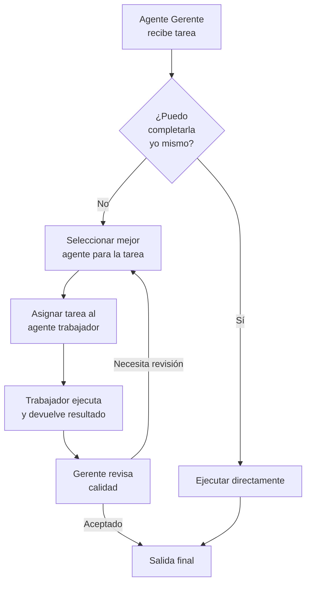
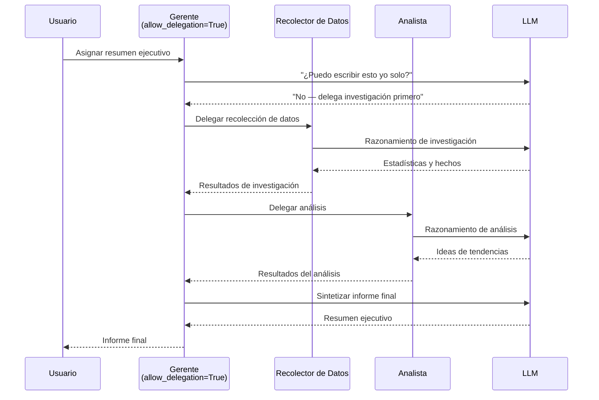

# Definiendo Roles, Objetivos, Historias y Delegación

Un agente bien definido es la base de un sistema CrewAI confiable. Cada atributo — rol, objetivo, historia, configuración de delegación — moldea cómo el agente se comporta, colabora y delega tareas. Acertar estos atributos es la diferencia entre un sistema que produce texto genérico y uno que entrega resultados de nivel experto.

---

## Rol, Objetivo e Historia

Estos tres atributos forman la identidad del agente. Juntos definen la personalidad, el objetivo y la experiencia que el LLM usa para razonar:

```python
from crewai import Agent

analista = Agent(
    role="Analista de Datos Senior",
    goal="Identificar tendencias de ingresos a partir de datos trimestrales de ventas",
    backstory=(
        "Tienes 10 años de experiencia en análisis financiero "
        "y has trabajado en las mejores consultoras. Explicas "
        "datos complejos en términos simples."
    ),
)
```

| Atributo | Propósito | Impacto |
| :--- | :--- | :--- |
| `role` | Cargo / función | Guía la personalidad y el tono del LLM |
| `goal` | Objetivo que el agente debe lograr | Enfoca el razonamiento y la planificación |
| `backstory` | Contexto narrativo y experiencia | Añade profundidad a la toma de decisiones |

[!IMPORTANT]
El parámetro `role` es la señal más fuerte para el comportamiento del LLM. Un agente con `role="Ingeniero de Seguridad Senior"` priorizará seguridad y modelado de amenazas. El mismo agente con `role="Gerente de Producto"` priorizará necesidades del usuario y plazos. Elige roles que codifiquen la experiencia que necesitas.

```python
# Compara cómo el role cambia el enfoque de la salida
agente_seguridad = Agent(
    role="Ingeniero de Seguridad Senior",
    goal="Revisar el diseño del nuevo sistema de autenticación",
    backstory="Eres especialista en OAuth, SAML y arquitecturas zero-trust.",
)

agente_pm = Agent(
    role="Gerente de Producto",
    goal="Revisar el diseño del nuevo sistema de autenticación",
    backstory="Te enfocas en la experiencia del usuario y el tiempo de mercado.",
)
# Mismo goal, pero los agentes enfatizarán aspectos completamente diferentes
```

[!WARNING]
Evita historias genéricas como "Eres un asistente útil." Cuanto más específica sea la historia, mejor será la calidad de la salida del agente. Incluye experiencia de dominio, años de trayectoria y estilo de comunicación. Un buen modelo de historia: "Eres un [senioridad] [rol] con [X] años de experiencia en [dominio]. [Estilo de comunicación]."

---

## Colaboración de Agentes mediante Delegación

Los agentes de CrewAI pueden delegarse tareas entre sí. Habilita la delegación con `allow_delegation=True`:

```python
gerente = Agent(
    role="Gerente de Proyecto",
    goal="Coordinar la investigación y entregar un informe final",
    backstory="Gestionas equipos multifuncionales y delegas trabajo.",
    allow_delegation=True,  # puede pedir ayuda a otros agentes
)

investigador = Agent(
    role="Especialista en Investigación",
    goal="Recopilar datos sobre los temas asignados",
    backstory="Eres un investigador online hábil.",
    allow_delegation=False,  # enfocado en ejecución, no delegación
)

redactor = Agent(
    role="Redactor de Informes",
    goal="Compilar hallazgos en un informe pulido",
    backstory="Escribes informes claros y profesionales.",
    allow_delegation=False,
)
```

Cuando `allow_delegation=True`, el agente puede pedir a otro agente que asuma una tarea, creando un flujo de colaboración dinámico. El agente delegante evalúa si puede completar la tarea; si no, redirige el trabajo a un colega más apropiado.

[!TIP]
Activa `allow_delegation` solo en agentes que actúan como gerentes o coordinadores. Los agentes trabajadores (investigadores, redactores, programadores) deben mantenerlo `False`. Esto evita el ping-pong de delegación donde los agentes se pasan el trabajo unos a otros.

```python
# Mejor práctica: un gerente delega, trabajadores ejecutan
gerente = Agent(
    role="Director de Investigación",
    goal="Producir un informe completo de análisis de mercado",
    backstory="Lideras un equipo de analistas y redactores.",
    allow_delegation=True,  # orquestador
)
analista = Agent(
    role="Analista de Mercado",
    goal="Analizar datos de mercado e identificar tendencias",
    backstory="Eres un analista certificado CFA.",
    allow_delegation=False,  # ejecutor
)
redactor = Agent(
    role="Redactor de Informes",
    goal="Escribir informes profesionales",
    backstory="Eres un redactor de negocios.",
    allow_delegation=False,  # ejecutor
)
```

---

## Flujo de Delegación



---

## Modo Verbose

El registro verbose muestra cada paso de razonamiento, llamada a herramienta y delegación:

```python
agent = Agent(
    role="Agente de Soporte",
    goal="Resolver consultas de clientes",
    backstory="Eres un representante de soporte de primera línea.",
    verbose=True,  # imprime pensamientos, acciones, observaciones
)
```

Tres niveles de verbosidad:
- `False` — sin salida (por defecto)
- `True` — registros detallados paso a paso
- Un enum `Verbose` con control granular (disponible en versiones recientes)

```python
from crewai import Verbose

# Control granular de verbosidad
agent = Agent(
    role="Agente de Depuración",
    goal="Depurar el sistema",
    backstory="Eres un ingeniero de sistemas.",
    verbose=Verbose.INFO,  # muestra razonamiento pero omite detalles de herramientas
)
```

---

## Memoria en Agentes

Los agentes pueden retener contexto entre múltiples ejecuciones de tareas:

```python
agente_con_memoria = Agent(
    role="Chatbot",
    goal="Mantener conversaciones coherentes de múltiples turnos",
    backstory="Eres un asistente de atención amigable.",
    memory=True,  # activa memoria a corto plazo dentro de una ejecución
)
```

| Configuración de Memoria | Comportamiento |
| :--- | :--- |
| `memory=False` (por defecto) | Sin memoria; cada tarea comienza desde cero |
| `memory=True` | El agente recuerda interacciones previas en la misma ejecución |

[!NOTE]
La memoria a nivel de agente (`memory=True`) es separada de la configuración de memoria a nivel de crew. La memoria del agente es a corto plazo (en proceso) y se pierde después de que `kickoff()` termina. Para memoria persistente entre ejecuciones, usa `memory_config` del crew con un backend LongTermMemory (cubierto en la lección 5).

---

## Secuencia de Colaboración de Agentes



---

## Agentes Especializados con Delegación — Ejemplo Completo

```python
from crewai import Agent, Task, Crew

# --- Agentes ---
gerente = Agent(
    role="Gerente de Investigación",
    goal="Supervisar la investigación y compilar el informe final",
    backstory="Lideras un equipo de investigación y delegas tareas eficazmente.",
    allow_delegation=True,
    verbose=True,
)

recolector = Agent(
    role="Recolector de Datos",
    goal="Encontrar estadísticas y hechos relevantes",
    backstory="Eres experto en buscar en bases de datos y la web.",
    allow_delegation=False,
)

analista = Agent(
    role="Analista",
    goal="Interpretar datos y generar insights",
    backstory="Conviertes datos brutos en insights accionables.",
    allow_delegation=False,
)

# --- Tareas ---
tarea_recoleccion = Task(
    description="Recopila estadísticas de adopción de IA 2025 de fuentes confiables.",
    expected_output="Tabla de estadísticas con fuentes.",
    agent=recolector,
)

tarea_analisis = Task(
    description="Analiza las estadísticas recopiladas e identifica las 3 tendencias principales.",
    expected_output="3 declaraciones de tendencias con datos de soporte.",
    agent=analista,
)

tarea_informe = Task(
    description="Escribe un resumen ejecutivo final basado en el análisis.",
    expected_output="Resumen ejecutivo de 1 página.",
    agent=gerente,
)

# --- Crew ---
crew = Crew(
    agents=[gerente, recolector, analista],
    tasks=[tarea_recoleccion, tarea_analisis, tarea_informe],
    verbose=True,
)

resultado = crew.kickoff()
print(resultado)
```

---

## Compartir Contexto Entre Agentes Delegados

Las tareas pueden compartir contexto explícitamente para crear transiciones suaves entre agentes delegados:

```python
from crewai import Agent, Task, Crew

# Agentes
gerente = Agent(
    role="Gerente de Investigación",
    goal="Producir un informe de investigación completo",
    backstory="Coordinas proyectos de investigación.",
    allow_delegation=True,
)

recolector = Agent(
    role="Recolector de Datos",
    goal="Recopilar datos exhaustivos",
    backstory="Eres un investigador experto.",
    allow_delegation=False,
)

redactor = Agent(
    role="Redactor de Informes",
    goal="Escribir informes claros a partir de datos",
    backstory="Eres un redactor profesional.",
    allow_delegation=False,
)

# Tareas con paso de contexto
recoleccion = Task(
    description="Recopila datos sobre tasas de adopción de energía renovable a nivel global.",
    expected_output="Tabla de datos con tasas de adopción por país.",
    agent=recolector,
)

analisis = Task(
    description=(
        "Analiza los datos de energía renovable e identifica los 5 principales adoptantes.\n\n"
        "Fuente de datos:\n{context}"
    ),
    expected_output="Informe de análisis listando los top 5 países con tasas de crecimiento.",
    agent=recolector,
    context=[recoleccion],
)

redaccion = Task(
    description=(
        "Escribe un resumen ejecutivo basado en este análisis:\n\n{context}"
    ),
    expected_output="Resumen ejecutivo de una página adecuado para la dirección.",
    agent=redactor,
    context=[analisis],
)

crew = Crew(
    agents=[gerente, recolector, redactor],
    tasks=[recoleccion, analisis, redaccion],
    verbose=True,
)

resultado = crew.kickoff()
```

---

## Comparación de Atributos del Agente

| Atributo | Tipo | Por Defecto | Efecto |
| :--- | :--- | :--- | :--- |
| `role` | `str` | — (obligatorio) | Define la personalidad del agente |
| `goal` | `str` | — (obligatorio) | Define el objetivo |
| `backstory` | `str` | `""` | Añade contexto narrativo |
| `allow_delegation` | `bool` | `False` | Activa delegación entre agentes |
| `verbose` | `bool` / `Verbose` | `False` | Activa registro paso a paso |
| `memory` | `bool` | `False` | Preserva contexto entre tareas |
| `tools` | `List[BaseTool]` | `[]` | Adjunta capacidades personalizadas |

### Impacto de los Atributos en el Comportamiento

| Configuración | Efecto en la Salida | Impacto en Rendimiento |
| :--- | :--- | :--- |
| Rol específico + historia detallada | Alta calidad, consciente del dominio | Ligeramente más tokens por llamada |
| Rol genérico + sin historia | Respuestas genéricas y superficiales | Más rápido, menos tokens |
| `allow_delegation=True` | Colaborativo, dinámico | Más llamadas LLM para decisiones de delegación |
| `verbose=True` | Transparencia total | Sin impacto en rendimiento (solo consola) |
| `memory=True` | Consciente del contexto, coherente | Más tokens para retención de contexto |

---

## Preguntas Interactivas

```question
{
  "id": "ca-02-q1",
  "type": "multiple-choice",
  "question": "Tienes dos agentes con el mismo goal pero roles diferentes: 'Desarrollador Junior' y 'Arquitecto Senior'. Ambos revisan un pull request. ¿Qué será más diferente en sus salidas?",
  "options": [
    "Ambos producirán revisiones idénticas",
    "El Arquitecto Senior se enfocará en el diseño del sistema mientras el Junior se enfoca en la sintaxis",
    "El Desarrollador Junior producirá revisiones más largas",
    "El Arquitecto Senior no puede revisar código"
  ],
  "correct": 1,
  "explanation": "El role moldea dramáticamente el comportamiento del LLM. Un Arquitecto Senior enfatiza arquitectura y patrones de diseño, mientras que un Desarrollador Junior se enfoca en sintaxis y buenas prácticas básicas."
}
```

```question
{
  "id": "ca-02-q2",
  "type": "multiple-choice",
  "question": "Tu equipo de investigación tiene 4 agentes todos con allow_delegation=True. La tarea se pasa entre agentes sin completarse. ¿Cuál es el problema?",
  "options": [
    "El LLM es demasiado lento",
    "Demasiados agentes pueden delegar — solo los gerentes deben delegar",
    "El modo verbose está causando retrasos",
    "Las tareas son demasiado complejas"
  ],
  "correct": 1,
  "explanation": "Cuando todos los agentes pueden delegar, pueden pasarse el trabajo indefinidamente. Solo los agentes tipo gerente deben tener allow_delegation=True; los agentes trabajadores deben ser ejecutores puros."
}
```

```question
{
  "id": "ca-02-q3",
  "type": "multiple-choice",
  "question": "Un agente con role='Agente de Soporte' produce respuestas genéricas. ¿Qué cambio tendría el mayor impacto?",
  "options": [
    "Establecer verbose=True",
    "Cambiar el role a 'Agente de Soporte Técnico Senior especializado en Kubernetes'",
    "Establecer memory=True",
    "Agregar allow_delegation=True"
  ],
  "correct": 1,
  "explanation": "Un role más específico le da al LLM una personalidad más clara. Agregar especialización ('Kubernetes') y senioridad ('Senior') mejora dramáticamente la relevancia de la salida."
}
```

```question
{
  "id": "ca-02-q4",
  "type": "multiple-choice",
  "question": "En un crew jerárquico, el gerente delega una tarea a un trabajador. El trabajador devuelve resultados de baja calidad. ¿Qué sucede a continuación?",
  "options": [
    "El trabajador es eliminado del crew",
    "El gerente puede reasignar o pedir revisiones",
    "El crew se bloquea con un error",
    "La tarea se omite"
  ],
  "correct": 1,
  "explanation": "En el modo jerárquico, el gerente revisa las salidas y puede solicitar revisiones o reasignar tareas a diferentes trabajadores. Esta es una ventaja clave de la orquestación jerárquica."
}
```

```question
{
  "id": "ca-02-q5",
  "type": "multiple-choice",
  "question": "Dos agentes se ejecutan secuencialmente: Agente A recopila datos, Agente B escribe un informe. La salida del Agente B contradice los datos que el Agente A recopiló. ¿Cuál es la causa más probable?",
  "options": [
    "El Agente B tiene allow_delegation=True",
    "Falta contexto del Agente A para el Agente B",
    "El modo verbose está demasiado bajo",
    "El role del Agente A es demasiado específico"
  ],
  "correct": 1,
  "explanation": "El Agente B necesita contexto del Agente A para basar su informe en datos reales. Sin él, el Agente B genera contenido de sus propios datos de entrenamiento. Pasa contexto explícitamente o garantiza que el proceso secuencial lo pase automáticamente."
}
```

---

## 5 Preguntas de Práctica

**1. ¿Qué atributo del agente tiene el mayor impacto en la personalidad y el tono del LLM?**

- A) `goal`
- B) `role` ✅
- C) `verbose`
- D) `memory`

**2. ¿Qué permite `allow_delegation=True`?**

- A) El agente puede saltarse tareas
- B) El agente puede pedir a otros agentes que asuman trabajo ✅
- C) El agente puede modificar su propio objetivo
- D) El agente puede usar APIs externas

**3. ¿Qué sucede cuando `verbose=True`?**

- A) El agente se ejecuta más rápido
- B) El crew registra cada paso de razonamiento y llamada a herramienta ✅
- C) La salida se formatea como JSON
- D) La delegación se desactiva

**4. ¿Cuál de los siguientes NO es un atributo de agente?**

- A) `backstory`
- B) `expected_output` ✅
- C) `allow_delegation`
- D) `memory`

**5. ¿Qué hace `memory=True` en un agente?**

- A) Almacena la salida final en disco
- B) Retiene contexto entre tareas dentro de una ejecución del crew ✅
- C) Almacena en caché resultados de herramientas
- D) Activa la delegación

---

[!SUCCESS]
### Puntos Clave
- `role`, `goal` y `backstory` definen la identidad y el comportamiento del agente.
- Las historias específicas producen salidas de agente de mayor calidad.
- `allow_delegation=True` permite colaboración dinámica entre agentes.
- `verbose=True` es esencial para depuración y transparencia.
- `memory=True` preserva contexto entre tareas en una sola ejecución.
- Los gerentes con delegación pueden coordinar trabajadores especializados.
- Cada atributo tiene un rol específico en la formación del comportamiento del agente.
- Activa la delegación solo en gerentes para evitar bucles de delegación.
- El paso de contexto entre tareas garantiza flujos de trabajo coherentes.
