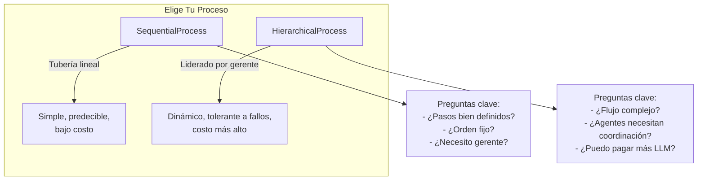
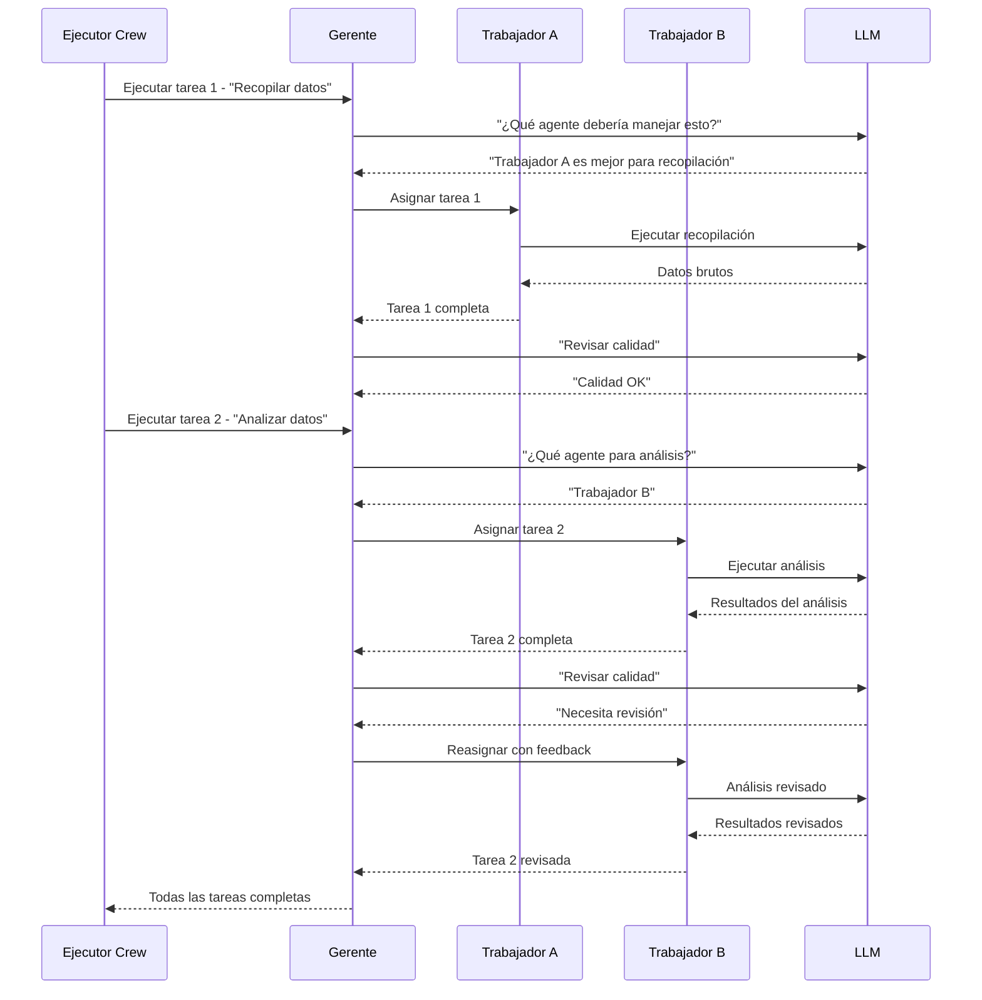
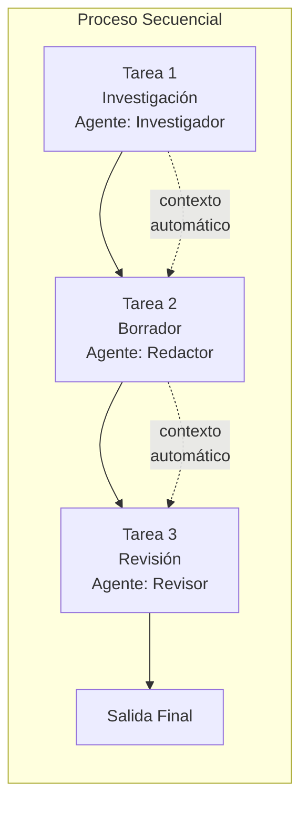
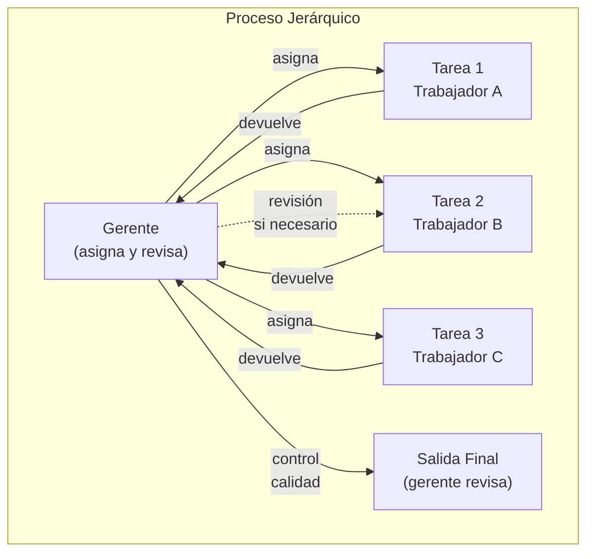
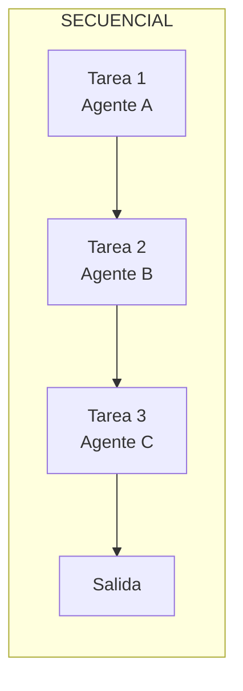
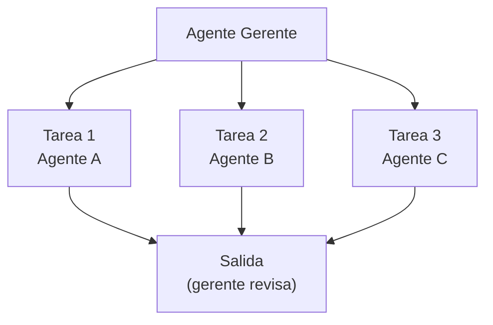

# Orquestración de Crew: Procesos Secuenciales y Jerárquicos

CrewAI soporta dos procesos de orquestración nativos: **secuencial** (tubería lineal) y **jerárquico** (liderado por gerente). Elegir el proceso correcto determina cómo fluyen las tareas y cómo colaboran los agentes. Esta decisión impacta directamente la escalabilidad, robustez y costo de tu sistema multi-agente.

---

## Visión General de los Procesos



---

## Proceso Secuencial (`SequentialProcess`)

Las tareas se ejecutan una tras otra en el orden en que se definen. Cada tarea recibe automáticamente la salida de la tarea anterior mediante contexto. Este es el modo de ejecución más simple y predecible.

```python
from crewai import Agent, Task, Crew, Process

# Agentes
investigador = Agent(
    role="Investigador",
    goal="Encontrar información relevante",
    backstory="Eres un investigador minucioso.",
)

redactor = Agent(
    role="Redactor",
    goal="Escribir un artículo claro basado en la investigación",
    backstory="Eres un redactor técnico hábil.",
)

revisor = Agent(
    role="Revisor",
    goal="Revisar y mejorar la calidad del artículo",
    backstory="Eres un editor meticuloso.",
)

# Tareas (ejecutadas en orden)
tarea_investigacion = Task(
    description="Investiga la historia de los agentes de IA.",
    expected_output="Una línea de tiempo de hitos clave.",
    agent=investigador,
)

tarea_redaccion = Task(
    description="Escribe un artículo de 300 palabras a partir de la investigación.",
    expected_output="Un artículo pulido.",
    agent=redactor,
)

tarea_revision = Task(
    description="Revisa y mejora el artículo.",
    expected_output="Versión final con cambios rastreados.",
    agent=revisor,
)

# Crew secuencial
crew = Crew(
    agents=[investigador, redactor, revisor],
    tasks=[tarea_investigacion, tarea_redaccion, tarea_revision],
    process=Process.sequential,  # por defecto si no se especifica
    verbose=True,
)

resultado = crew.kickoff()
```

[!NOTE]
`Process.sequential` es el valor por defecto. Si no especificas un parámetro `process`, CrewAI ejecuta las tareas secuencialmente. Esto es ideal para **tuberías bien definidas** donde cada paso depende del anterior, como investigación → borrador → revisión → publicación.

---

## Proceso Jerárquico (`HierarchicalProcess`)

Un **agente gerente** coordina el trabajo. Asigna tareas a los agentes trabajadores, revisa salidas y gestiona la delegación automáticamente. El gerente decide qué agente debe manejar cada tarea y puede reasignar trabajo si los resultados son insatisfactorios.

```python
from crewai import Agent, Task, Crew, Process

# Agente gerente — coordina el crew
gerente = Agent(
    role="Gerente de Proyecto",
    goal="Entregar un informe final de alta calidad",
    backstory="Gestionas proyectos técnicos y delegas tareas.",
    allow_delegation=True,  # obligatorio para proceso jerárquico
)

# Agentes trabajadores
ingeniero = Agent(
    role="Ingeniero de Datos",
    goal="Construir tuberías de datos",
    backstory="Diseñas tuberías ETL.",
)

analista = Agent(
    role="Analista",
    goal="Extraer insights de los datos",
    backstory="Conviertes datos en valor de negocio.",
)

# Tareas — el gerente decide quién hace qué
tarea_tuberia = Task(
    description="Construye una tubería para recolectar datos de actividad del usuario.",
    expected_output="Descripción de la tubería funcional.",
    agent=ingeniero,
)

tarea_insight = Task(
    description="Analiza los datos recolectados en busca de patrones de comportamiento.",
    expected_output="Informe de 3 patrones clave.",
    agent=analista,
)

tarea_resumen = Task(
    description="Resume todos los hallazgos en un informe ejecutivo.",
    expected_output="Informe ejecutivo de una página.",
    agent=gerente,
)

# Crew jerárquico
crew = Crew(
    agents=[gerente, ingeniero, analista],
    tasks=[tarea_tuberia, tarea_insight, tarea_resumen],
    process=Process.hierarchical,
    verbose=True,
    manager_agent=gerente,  # gerente explícito
)

resultado = crew.kickoff()
```

[!WARNING]
En un proceso jerárquico, el agente gerente **debe** tener `allow_delegation=True`. Sin esto, el crew no puede asignar tareas dinámicamente y generará un error en tiempo de ejecución. Además, el gerente incurre en llamadas LLM extras para cada decisión de delegación, aumentando el uso de tokens y el costo.

---

## Flujo de Decisión del Gerente Jerárquico



---

## Paso de Contexto Entre Tareas

Las tareas pueden pasar contexto explícitamente a tareas subsiguientes usando el parámetro `context`:

```python
tarea_a = Task(
    description="Recopila datos de ventas del Q1.",
    expected_output="Datos brutos de ventas del Q1.",
    agent=recolector,
)

tarea_b = Task(
    description="""Analiza los datos de ventas del Q1 e identifica tendencias.
Los datos son: {context}""",
    expected_output="3 tendencias con evidencia de soporte.",
    agent=analista,
    context=[tarea_a],  # pasa la salida de tarea_a como contexto
)
```

En un proceso secuencial, el contexto se pasa automáticamente. En un proceso jerárquico, el gerente decide qué contexto recibe cada trabajador.

```python
# Múltiples fuentes de contexto
tarea_c = Task(
    description=(
        "Escribe un informe completo usando los siguientes datos:\n\n"
        "Datos de Ventas:\n{contexto_ventas}\n\n"
        "Investigación de Usuarios:\n{contexto_investigacion}"
    ),
    expected_output="Un informe completo de 2 páginas.",
    agent=redactor,
    context=[tarea_ventas, tarea_investigacion],
)
```

[!TIP]
Usa el parámetro `context` incluso en procesos secuenciales cuando una tarea necesite entrada de una tarea anterior no adyacente. Por ejemplo, la tarea D necesita datos de la tarea A (saltándose B y C). El contexto explícito hace que estas relaciones sean claras y mantenibles.

---

## Visualización de Ejecución Secuencial





---

## Comparación de Procesos

| Aspecto | SequentialProcess | HierarchicalProcess |
| :--- | :--- | :--- |
| **Orden de ejecución** | Lineal fijo | El gerente decide dinámicamente |
| **Autonomía del agente** | Baja — tareas pre-asignadas | Alta — el gerente asigna y revisa |
| **Gerente necesario** | No | Sí (con `allow_delegation=True`) |
| **Paso de contexto** | Automático entre tareas adyacentes | Gestionado por el agente gerente |
| **Mejor para** | Tuberías simples, pasos bien definidos | Flujos complejos que requieren coordinación |
| **Costo** | Mínimo | Mayor (llamadas LLM del gerente) |
| **Recuperación de errores** | Manual | El gerente puede reasignar tareas fallidas |
| **Costo de tokens** | 1 llamada LLM por tarea | 1-2 llamadas LLM extra por tarea |
| **Escalabilidad** | Hasta ~10 tareas | Hasta ~50+ agentes |
| **Depuración** | Fácil (rastreo lineal) | Moderada (decisiones del gerente añaden complejidad) |

### Cuándo Usar Cada Proceso

| Escenario | Proceso Recomendado | Motivo |
| :--- | :--- | :--- |
| Pipeline Investigación → Redactar → Publicar | Sequential | Pasos fijos, dependencias claras |
| Equipo de desarrollo de software multi-agente | Hierarchical | Necesita coordinación, revisión de código, reasignación |
| ETL de datos con validaciones | Sequential | Cada paso depende limpiamente del anterior |
| Soporte al cliente con escalamiento | Hierarchical | Enrutamiento dinámico según tipo de problema |
| Generación de contenido con ciclo de revisión | Sequential | Orden predecible, etapas bien definidas |
| Investigación automatizada con requisitos desconocidos | Hierarchical | El gerente se adapta dinámicamente a los hallazgos |

---

## Configuración Personalizada de Gerente

Cuando no especificas un `manager_agent`, CrewAI crea un LLM gerente por defecto. Puedes personalizarlo:

```python
from langchain_openai import ChatOpenAI
from crewai import Agent, Task, Crew, Process

# LLM gerente personalizado — modelo más rápido y barato
llm_gerente = ChatOpenAI(
    model="gpt-4o-mini",
    temperature=0.0,  # decisiones de delegación deterministas
)

# Crew con gerente implícito (CrewAI crea uno)
crew = Crew(
    agents=[worker_a, worker_b, worker_c],
    tasks=[tarea1, tarea2, tarea3],
    process=Process.hierarchical,
    manager_llm=llm_gerente,  # LLM personalizado para el gerente por defecto
    verbose=True,
)

# O usa un agente gerente explícito
gerente_explicito = Agent(
    role="Gerente Técnico de Programa",
    goal="Entregar proyectos a tiempo con alta calidad",
    backstory="Gestionas equipos de ingeniería de IA.",
    allow_delegation=True,
    llm=llm_gerente,
)

crew_con_gerente = Crew(
    agents=[gerente_explicito, worker_a, worker_b],
    tasks=[tarea1, tarea2, tarea3],
    process=Process.hierarchical,
    manager_agent=gerente_explicito,
    verbose=True,
)
```

---

## Diagrama: Secuencial vs Jerárquico





En modo secuencial, los agentes ejecutan en orden fijo. En modo jerárquico, el gerente orquesta el flujo dinámicamente.

---

## Preguntas Interactivas

```question
{
  "id": "ca-03-q1",
  "type": "multiple-choice",
  "question": "Estás construyendo un pipeline de contenido: esquema → borrador → revisión → publicación. Cada paso depende del anterior. ¿Qué proceso deberías usar?",
  "options": [
    "HierarchicalProcess — para asignación dinámica",
    "SequentialProcess — para pasos lineales fijos",
    "Ninguno — esto requiere código personalizado",
    "Cualquiera funcionaría igual de bien"
  ],
  "correct": 1,
  "explanation": "Un pipeline de contenido tiene pasos bien definidos y de orden fijo, donde cada uno depende del anterior. SequentialProcess es ideal: simple, predecible y de bajo costo."
}
```

```question
{
  "id": "ca-03-q2",
  "type": "multiple-choice",
  "question": "Tu crew jerárquico tiene 5 trabajadores. El gerente gasta mucho en llamadas LLM para decisiones de delegación. ¿Qué optimización puedes hacer?",
  "options": [
    "Cambiar a SequentialProcess",
    "Usar un LLM más barato para el gerente (ej.: gpt-4o-mini)",
    "Eliminar allow_delegation del gerente",
    "Reducir el número de tareas"
  ],
  "correct": 1,
  "explanation": "El gerente toma decisiones de delegación mediante llamadas LLM. Usar un modelo más barato (gpt-4o-mini) para el gerente reduce costos mientras mantiene la calidad del razonamiento para los trabajadores."
}
```

```question
{
  "id": "ca-03-q3",
  "type": "multiple-choice",
  "question": "En un proceso secuencial, la Tarea C necesita datos de la Tarea A (no de B, que se ejecuta entre ellas). ¿Cómo proporcionas este contexto?",
  "options": [
    "Reordenar tareas para que A esté adyacente a C",
    "Usar context=[tarea_a] en la Tarea C",
    "El proceso secuencial maneja esto automáticamente",
    "Cambiar a proceso jerárquico"
  ],
  "correct": 1,
  "explanation": "Usa el parámetro context para vincular explícitamente tareas no adyacentes. La Tarea C puede referenciar la salida de la Tarea A directamente mediante context=[tarea_a], incluso si la Tarea B se ejecuta entre ellas."
}
```

```question
{
  "id": "ca-03-q4",
  "type": "multiple-choice",
  "question": "Ejecutas un crew jerárquico sin establecer manager_agent. ¿Qué sucede?",
  "options": [
    "El crew se ejecuta secuencialmente en su lugar",
    "CrewAI crea un LLM gerente por defecto",
    "Se genera un error",
    "El primer agente se convierte en el gerente"
  ],
  "correct": 1,
  "explanation": "Cuando no se especifica manager_agent, CrewAI crea automáticamente un LLM gerente por defecto para manejar la delegación. Puedes personalizarlo mediante manager_llm."
}
```

```question
{
  "id": "ca-03-q5",
  "type": "multiple-choice",
  "question": "Un crew jerárquico tiene un gerente y 3 trabajadores. La salida del Trabajador A es deficiente. ¿Qué puede hacer el gerente?",
  "options": [
    "Nada — las tareas son fijas después de la asignación",
    "Reasignar la tarea a un trabajador diferente o solicitar revisión",
    "Eliminar al Trabajador A del crew",
    "Cambiar a SequentialProcess automáticamente"
  ],
  "correct": 1,
  "explanation": "Una ventaja clave del proceso jerárquico es que el gerente puede revisar salidas y reasignar tareas fallidas a diferentes trabajadores o solicitar revisiones del mismo trabajador."
}
```

---

## 5 Preguntas de Práctica

**1. ¿Qué tipo de proceso requiere un agente gerente con `allow_delegation=True`?**

- A) SequentialProcess
- B) HierarchicalProcess ✅
- C) Ambos
- D) Ninguno

**2. ¿Cómo se pasa el contexto entre tareas en un proceso secuencial?**

- A) Explícitamente mediante el parámetro `context` solamente
- B) Automáticamente entre tareas adyacentes ✅
- C) El contexto nunca se comparte
- D) Mediante una base de datos compartida

**3. ¿Cuál es la principal ventaja de un proceso jerárquico sobre uno secuencial?**

- A) Menor uso de tokens
- B) Asignación dinámica de tareas y recuperación de errores ✅
- C) Ejecución más rápida
- D) Configuración más simple

**4. ¿Qué valor enum representa el proceso secuencial en CrewAI?**

- A) `Process.linear`
- B) `Process.sequential` ✅
- C) `Process.pipeline`
- D) `Process.simple`

**5. ¿Qué sucede si usas `Process.hierarchical` sin establecer `manager_agent`?**

- A) El primer agente se convierte en el gerente
- B) CrewAI crea un LLM gerente por defecto ✅
- C) El crew se ejecuta secuencialmente
- D) Se genera un error inmediatamente

---

[!SUCCESS]
### Puntos Clave
- `Process.sequential` ejecuta tareas en orden lineal fijo con paso automático de contexto.
- `Process.hierarchical` usa un agente gerente para asignación dinámica de tareas.
- El agente gerente debe tener `allow_delegation=True`.
- El contexto se puede pasar explícitamente mediante el parámetro `context` en cualquier tarea.
- Secuencial es mejor para tuberías simples y bien definidas.
- Jerárquico es excelente para flujos de trabajo complejos que requieren coordinación.
- El gerente en un proceso jerárquico puede reasignar tareas fallidas.
- Usa LLMs más baratos para el gerente para reducir costos jerárquicos.
- El contexto explícito vincula tareas no adyacentes incluso en modo secuencial.
