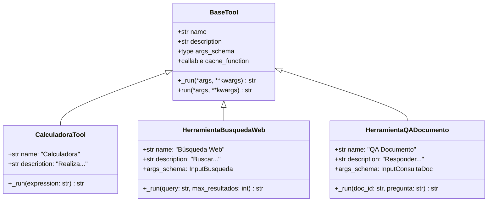
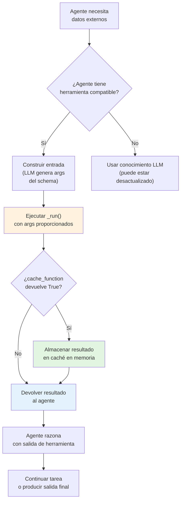
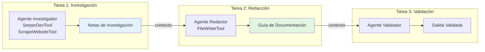

# Herramientas Personalizadas, Integración y Contexto Compartido

Las herramientas permiten a los agentes interactuar con sistemas externos: buscar en la web, consultar bases de datos, ejecutar cálculos o llamar APIs. CrewAI proporciona un rico ecosistema de herramientas y una API simple para crear las tuyas propias. Sin herramientas, los agentes solo pueden usar sus datos de entrenamiento; con herramientas, pueden acceder a información en tiempo real y realizar acciones en el mundo.

---

## La Clase `BaseTool`

Cada herramienta en CrewAI extiende `BaseTool`. Como mínimo, defines `name`, `description` y el método `_run()`:

```python
from crewai.tools import BaseTool
from pydantic import Field

class CalculadoraTool(BaseTool):
    name: str = "Calculadora"
    description: str = "Realiza operaciones aritméticas básicas (suma, resta, multiplicación, división)."

    args_schema: type = Field

    def _run(self, expresion: str) -> str:
        """Evalúa una expresión aritmética simple."""
        try:
            resultado = eval(expresion)
            return f"Resultado: {resultado}"
        except Exception as e:
            return f"Error: {str(e)}"
```

[!IMPORTANT]
Los campos `name` y `description` son críticos — son lo que el LLM del agente lee para decidir cuándo usar una herramienta. Un nombre claro y descriptivo y una descripción detallada de cuándo y cómo usar la herramienta mejoran dramáticamente la selección correcta de herramientas por parte del agente.

---

## Jerarquía de Clases de Herramientas



---

## Creando una Herramienta Personalizada con Parámetros

Puedes definir parámetros de entrada estructurados usando Pydantic:

```python
from crewai.tools import BaseTool
from pydantic import BaseModel, Field

class InputBusqueda(BaseModel):
    query: str = Field(description="La cadena de consulta")
    max_resultados: int = Field(default=5, description="Número máximo de resultados")

class HerramientaBusquedaWeb(BaseTool):
    name: str = "Búsqueda Web"
    description: str = "Busca en la web información actual sobre un tema."
    args_schema: type = InputBusqueda

    def _run(self, query: str, max_resultados: int = 5) -> str:
        resultados = [
            f"Resultado {i}: Resultado simulado para '{query}'"
            for i in range(1, max_resultados + 1)
        ]
        return "\n".join(resultados)
```

```python
# Usando la herramienta
tool = HerramientaBusquedaWeb()
resultado = tool._run(query="agentes CrewAI", max_resultados=3)
print(resultado)
# Resultado 1: Resultado simulado para 'agentes CrewAI'
# Resultado 2: Resultado simulado para 'agentes CrewAI'
# Resultado 3: Resultado simulado para 'agentes CrewAI'
```

---

## Flujo de Ejecución de Herramienta Personalizada



---

## Herramienta Real: Búsqueda Web con Serper

```python
import requests
from crewai.tools import BaseTool
from pydantic import BaseModel, Field

class InputBusqueda(BaseModel):
    query: str = Field(description="La consulta de búsqueda")

class HerramientaBusquedaReal(BaseTool):
    name: str = "Búsqueda Web"
    description: str = "Busca en Google información actual usando la API Serper."
    args_schema: type = InputBusqueda

    def _run(self, query: str) -> str:
        """Ejecuta una búsqueda web real mediante API Serper.dev."""
        url = "https://google.serper.dev/search"
        headers = {
            "X-API-KEY": "tu-clave-api-aqui",
            "Content-Type": "application/json",
        }
        payload = {"q": query, "num": 5}

        try:
            response = requests.post(url, json=payload, headers=headers)
            response.raise_for_status()
            data = response.json()

            resultados = []
            for item in data.get("organic", []):
                titulo = item.get("title", "")
                snippet = item.get("snippet", "")
                link = item.get("link", "")
                resultados.append(f"- [{titulo}]({link})\n  {snippet}")

            return "\n".join(resultados) if resultados else "No se encontraron resultados."
        except Exception as e:
            return f"Búsqueda falló: {str(e)}"
```

---

## Caché de Herramientas

CrewAI almacena en caché automáticamente las salidas de las herramientas cuando se usa la misma entrada nuevamente:

```python
class HerramientaAPICara(BaseTool):
    name: str = "API Cara"
    description: str = "Llama a una API externa con límites de tasa costosos."
    cache_function: callable = lambda args: True  # activar caché

    def _run(self, query: str) -> str:
        return f"Datos para: {query}"
```

| Configuración de Caché | Comportamiento |
| :--- | :--- |
| Sin función de caché | Los resultados nunca se almacenan en caché |
| `lambda args: True` | Siempre almacenar resultados en caché |
| `lambda args: len(args) > 10` | Caché solo para consultas largas |

[!WARNING]
La caché es **en memoria** y tiene alcance de una sola llamada `crew.kickoff()`. Si necesitas caché persistente entre ejecuciones, implementa tu propia capa de caché usando Redis o una base de datos.

[!TIP]
Usa caché agresivamente para herramientas que llaman APIs con límites de tasa (ej.: llamadas a API GPT-4, APIs de búsqueda externas). Una `cache_function` que siempre devuelve `True` para herramientas determinísticas previene llamadas API redundantes y acelera la ejecución significativamente.

```python
from datetime import datetime, timedelta

# Caché basada en tiempo — nunca almacenar datos de tiempo
class HerramientaVerificacionTiempo(BaseTool):
    name: str = "Verificación de Hora"
    description: str = "Verifica la hora actual."
    cache_function: callable = lambda args: False

# Caché condicional — basada en características de la entrada
class HerramientaCacheInteligente(BaseTool):
    name: str = "Precio de Acciones"
    description: str = "Obtiene precios actuales de acciones."
    cache_function: callable = lambda args: len(str(args)) < 20
```

---

## Herramientas Nativas (`crewai_tools`)

El paquete `crewai_tools` proporciona muchas herramientas listas para usar:

```python
from crewai_tools import (
    SerperDevTool,        # Búsqueda Google via Serper
    ScrapeWebsiteTool,    # Extrae texto de una URL
    FileReadTool,         # Lee archivos locales
    FileWriterTool,       # Escribe en archivos locales
    MDXSearchTool,        # Busca en documentación .mdx
    DirectoryReadTool,    # Lista contenido de directorios
    CodeInterpreterTool,  # Ejecuta código Python
    PDFSearchTool,        # Busca en documentos PDF
)

# Adjuntar herramientas a un agente
investigador = Agent(
    role="Investigador",
    goal="Encontrar y resumir información online",
    backstory="Eres un especialista en investigación.",
    tools=[SerperDevTool(), ScrapeWebsiteTool()],
)
```

---

## Comparación de Herramientas Nativas

| Herramienta | Propósito | Entrada | Salida | Categoría |
| :--- | :--- | :--- | :--- | :--- |
| `SerperDevTool` | Búsqueda Google | Cadena de consulta | Fragmentos de resultados | Búsqueda |
| `ScrapeWebsiteTool` | Raspado web | URL | Contenido textual de la página | Web |
| `FileReadTool` | Leer archivos | Ruta del archivo | Contenido del archivo | Archivo |
| `FileWriterTool` | Escribir archivos | Ruta + contenido | Mensaje de confirmación | Archivo |
| `MDXSearchTool` | Búsqueda en docs MDX | Consulta | Secciones relevantes | Búsqueda |
| `DirectoryReadTool` | Listar directorio | Ruta del directorio | Lista de archivos/carpetas | Archivo |
| `CodeInterpreterTool` | Ejecutar Python | Código | Salida de la ejecución | Código |
| `PDFSearchTool` | Buscar en PDF | Ruta PDF + consulta | Fragmentos de texto | Búsqueda |

### Categorías de Herramientas

| Categoría | Herramientas | Caso de Uso |
| :--- | :--- | :--- |
| **Búsqueda** | `SerperDevTool`, `MDXSearchTool`, `PDFSearchTool` | Encontrar información |
| **Web** | `ScrapeWebsiteTool` | Extraer contenido web |
| **Archivo** | `FileReadTool`, `FileWriterTool`, `DirectoryReadTool` | Operaciones con archivos locales |
| **Código** | `CodeInterpreterTool` | Ejecutar código |

---

## Compartiendo Contexto Entre Tareas

Las tareas pueden compartir contexto explícitamente, permitiendo flujos de investigación en múltiples pasos:

```python
from crewai import Agent, Task, Crew

investigador = Agent(
    role="Analista de Investigación",
    goal="Encontrar información exhaustiva",
    backstory="Eres un investigador hábil.",
)

redactor = Agent(
    role="Redactor Técnico",
    goal="Crear documentación a partir de notas de investigación",
    backstory="Escribes documentación clara para desarrolladores.",
)

# Tarea 1: investigación
tarea_investigacion = Task(
    description="Investiga sobre desarrollo de herramientas personalizadas en CrewAI.",
    expected_output="Notas de investigación detalladas con referencias de API.",
    agent=investigador,
)

# Tarea 2: redacción — recibe salida de investigación como contexto
tarea_redaccion = Task(
    description="""Escribe una guía paso a paso basada en esta investigación:

{context}""",
    expected_output="Una guía completa en formato markdown.",
    agent=redactor,
    context=[tarea_investigacion],
)

crew = Crew(
    agents=[investigador, redactor],
    tasks=[tarea_investigacion, tarea_redaccion],
    verbose=True,
)

resultado = crew.kickoff()
```

---

## Diagrama de Flujo de Contexto



---

## Ejemplo Completo: Herramienta Personalizada + Contexto Compartido

```python
from crewai.tools import BaseTool
from crewai import Agent, Task, Crew
from pydantic import BaseModel, Field

# --- Herramienta personalizada ---
class InputConsultaDoc(BaseModel):
    doc_id: str = Field(description="Identificador del documento")
    pregunta: str = Field(description="Pregunta sobre el documento")

class HerramientaQADocumento(BaseTool):
    name: str = "QA Documento"
    description: str = "Responde preguntas sobre documentos internos."
    args_schema: type = InputConsultaDoc

    def _run(self, doc_id: str, pregunta: str) -> str:
        return f"Respuesta para '{pregunta}' en doc {doc_id}: [respuesta simulada]"

# --- Agentes & Tareas ---
agente_qa = Agent(
    role="Especialista en QA",
    goal="Responder preguntas sobre documentos con precisión",
    backstory="Eres experto en análisis de documentos.",
    tools=[HerramientaQADocumento()],
)

resumidor = Agent(
    role="Resumidor",
    goal="Resumir Q&A en insights clave",
    backstory="Destilas Q&A complejos en resúmenes claros.",
)

tarea_qa = Task(
    description="Responde preguntas sobre el doc-42 usando la herramienta QA Documento.",
    expected_output="Respuestas para todas las preguntas.",
    agent=agente_qa,
)

tarea_resumen = Task(
    description="Resume los resultados del Q&A.\n\n{context}",
    expected_output="3 puntos de insight clave.",
    agent=resumidor,
    context=[tarea_qa],
)

crew = Crew(
    agents=[agente_qa, resumidor],
    tasks=[tarea_qa, tarea_resumen],
    verbose=True,
)

crew.kickoff()
```

---

## Preguntas Interactivas

```question
{
  "id": "ca-04-q1",
  "type": "multiple-choice",
  "question": "Creaste una herramienta personalizada que consulta una API de clima. El agente nunca la usa. ¿Cuál es la causa más probable?",
  "options": [
    "El LLM es demasiado pequeño",
    "El nombre y la descripción de la herramienta no son claros o son engañosos",
    "La herramienta tiene demasiados parámetros",
    "El agente tiene verbose=True"
  ],
  "correct": 1,
  "explanation": "El LLM del agente decide cuándo usar herramientas según su nombre y descripción. Si 'name' y 'description' no indican claramente cuándo usar la herramienta, el agente la ignorará."
}
```

```question
{
  "id": "ca-04-q2",
  "type": "multiple-choice",
  "question": "Tu herramienta personalizada llama a una API con límites de tasa. La misma consulta se hace 10 veces en una ejecución. ¿Cómo puedes optimizar?",
  "options": [
    "Aumentar el timeout",
    "Agregar una cache_function que devuelva True",
    "Reducir la longitud de la descripción",
    "Usar una clase base diferente"
  ],
  "correct": 1,
  "explanation": "Establecer cache_function=lambda args: True almacena resultados en caché en memoria por ejecución, así que consultas idénticas repetidas no activarán llamadas API después de la primera."
}
```

```question
{
  "id": "ca-04-q3",
  "type": "multiple-choice",
  "question": "Una tarea necesita entrada de dos tareas upstream diferentes. ¿Cómo proporcionas ambos contextos?",
  "options": [
    "Usar un solo parámetro context con una lista de ambas tareas",
    "Crear una tercera tarea que las fusione",
    "Cambiar a proceso jerárquico",
    "Usar dos parámetros context separados"
  ],
  "correct": 0,
  "explanation": "El parámetro context acepta una lista: context=[tarea_a, tarea_b]. La tarea downstream recibe ambas salidas y puede referenciarlas en su descripción."
}
```

```question
{
  "id": "ca-04-q4",
  "type": "multiple-choice",
  "question": "Despliegas un sistema CrewAI en producción. La caché de herramientas ya no funciona entre sesiones de usuario. ¿Por qué?",
  "options": [
    "La caché solo funciona en modo desarrollo",
    "La caché de herramientas está en memoria por llamada kickoff() — no persiste entre ejecuciones",
    "La cache_function se eliminó en producción",
    "Producción requiere verbose=True para caché"
  ],
  "correct": 1,
  "explanation": "La caché incorporada de CrewAI está en memoria y tiene alcance de una sola llamada crew.kickoff(). Para caché persistente entre sesiones, implementa caché con Redis o base de datos."
}
```

```question
{
  "id": "ca-04-q5",
  "type": "multiple-choice",
  "question": "Un agente tiene SerperDevTool (búsqueda web) y CalculadoraTool. La tarea es 'Calcular 15% de 340'. ¿Qué herramienta debería usar el agente?",
  "options": [
    "SerperDevTool — para buscar la respuesta",
    "CalculadoraTool — para calcular el porcentaje",
    "Ambas — buscar primero, luego calcular",
    "Ninguna — el agente calcula internamente"
  ],
  "correct": 1,
  "explanation": "CalculadoraTool es la opción correcta para operaciones aritméticas. El agente debe usar las descripciones de las herramientas para emparejar la tarea con la herramienta correcta — la descripción de CalculadoraTool menciona aritmética."
}
```

---

## 5 Preguntas de Práctica

**1. ¿Qué clase base debes extender para crear una herramienta personalizada en CrewAI?**

- A) `Agent`
- B) `BaseTool` ✅
- C) `ToolBase`
- D) `Crew`

**2. ¿Cuál es el propósito de `args_schema` en una herramienta personalizada?**

- A) Activar caché
- B) Definir los parámetros de entrada usando Pydantic ✅
- C) Definir la descripción de la herramienta
- D) Registrar la herramienta en el crew

**3. ¿Qué herramienta de `crewai_tools` usarías para buscar en la web?**

- A) `FileReadTool`
- B) `CodeInterpreterTool`
- C) `SerperDevTool` ✅
- D) `DirectoryReadTool`

**4. ¿Cómo funciona la caché de herramientas en CrewAI?**

- A) Los resultados se almacenan en una base de datos SQLite
- B) Los resultados se almacenan en caché en memoria por llamada `kickoff()` ✅
- C) Los resultados nunca se almacenan en caché
- D) La caché requiere una instancia de Redis

**5. ¿Qué parámetro en una `Task` permite pasar la salida de otra tarea?**

- A) `context` ✅
- B) `depends_on`
- C) `inputs`
- D) `shared_context`

---

[!SUCCESS]
### Puntos Clave
- Extiende `BaseTool` e implementa `_run()` para crear herramientas personalizadas.
- Usa modelos Pydantic como `args_schema` para entradas estructuradas.
- La caché de herramientas está en memoria por ejecución y reduce llamadas API redundantes.
- El paquete `crewai_tools` proporciona herramientas listas para búsqueda, raspado, archivos y ejecución de código.
- El parámetro `context` en una `Task` permite flujo de datos explícito entre tareas.
- Las herramientas personalizadas pueden encapsular cualquier API externa o computación.
- Siempre proporciona `name` y `description` claros para cada herramienta.
- Las descripciones de herramientas son lo que los LLMs usan para decidir la selección — invierte en ellas.
- Las herramientas a nivel de agente pueden ser reemplazadas por herramientas a nivel de tarea para necesidades específicas.
