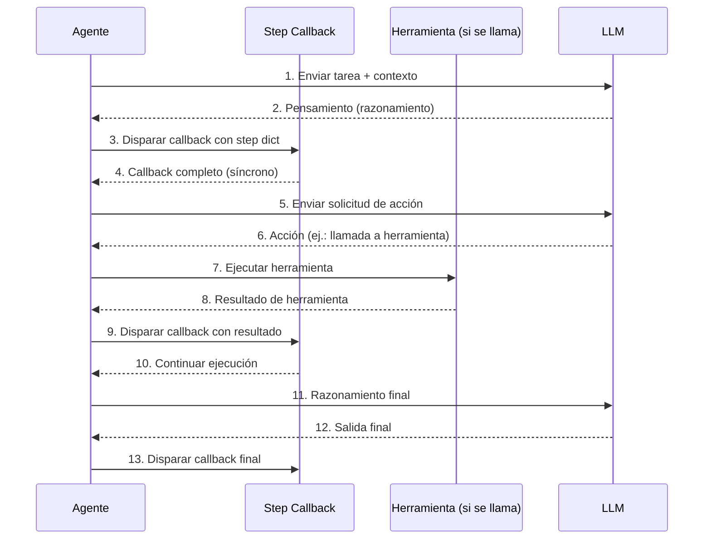
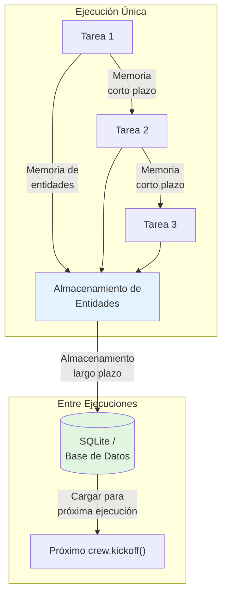

# Patrones Avanzados: Callbacks, Memoria, Config LLM y Pruebas

Esta lección cubre patrones listos para producción: monitoreo con callbacks, memoria persistente, control detallado de LLM y estrategias de prueba para crews de CrewAI. Estos patrones transforman un sistema multi-agente prototipo en una aplicación de producción confiable, observable y mantenible.

---

## Step Callbacks

Los step callbacks se disparan después de cada paso del agente (pensamiento, acción u observación). Úsalos para registro, monitoreo o streaming:

```python
from crewai import Agent, Task, Crew, Process

def step_callback(step):
    """Se llama después de cada paso de razonamiento del agente."""
    print(f"[PASO] Agente: {step.get('agent', 'desconocido')}")
    print(f"[PASO] Acción: {step.get('action', 'ninguna')}")
    print(f"[PASO] Salida hasta ahora: {step.get('output', '')[:100]}...")
    print("-" * 40)

agente = Agent(
    role="Analista de Investigación",
    goal="Recopilar inteligencia de mercado",
    backstory="Eres un experto en investigación de mercado.",
    step_callback=step_callback,  # adjuntar callback
)

tarea = Task(
    description="Investiga las últimas tendencias de IA.",
    expected_output="Lista de tendencias.",
    agent=agente,
)

crew = Crew(
    agents=[agente],
    tasks=[tarea],
    verbose=True,
)

resultado = crew.kickoff()
```

El diccionario `step` contiene información valiosa de depuración:

| Clave | Tipo de Valor | Descripción |
| :--- | :--- | :--- |
| `agent` | `str` | Nombre/rol del agente |
| `action` | `str` | Acción actual (pensamiento, llamada a herramienta, observación) |
| `output` | `str` | Salida parcial acumulada hasta ahora |
| `tool_input` | `dict` | Entradas pasadas a una herramienta (si aplica) |
| `tool_output` | `str` | Salida devuelta por una herramienta (si aplica) |

---

## Flujo de la Cadena de Callbacks



---

## Callbacks Personalizados con Handlers Basados en Clase

Para monitoreo complejo, crea una clase de callback:

```python
from crewai import Agent, Task, Crew

class CallbackRegistro:
    """Rastrea cada paso del agente para auditoría."""

    def __init__(self):
        self.steps = []

    def on_step(self, step):
        self.steps.append(step)
        nombre_agente = step.get("agent", "?")
        accion = step.get("action", "?")
        print(f"[{nombre_agente}] → {accion}")

    def summary(self):
        print(f"Total de pasos: {len(self.steps)}")
        for s in self.steps:
            print(f"  - {s.get('agent')}: {s.get('action')}")

callback = CallbackRegistro()

agente = Agent(
    role="Redactor",
    goal="Escribir un post de blog",
    backstory="Eres un bloguero profesional.",
    step_callback=callback.on_step,
)

crew = Crew(agents=[agente], tasks=[Task(
    description="Escribe un post corto sobre IA.",
    expected_output="Un post de 200 palabras.",
    agent=agente,
)])
crew.kickoff()

callback.summary()
```

```python
# Avanzado: callback con seguimiento de métricas
class CallbackMetricas:
    def __init__(self):
        self.steps = []
        self.llamadas_herramienta = 0
        self.total_tokens = 0

    def on_step(self, step):
        self.steps.append(step)
        if step.get("action") == "tool_call":
            self.llamadas_herramienta += 1

    def on_task_complete(self, task_output):
        if task_output.usage:
            self.total_tokens += task_output.usage.total_tokens

    def reporte(self):
        print(f"Pasos: {len(self.steps)}")
        print(f"Llamadas a herramientas: {self.llamadas_herramienta}")
        print(f"Total de tokens: {self.total_tokens}")
```

[!WARNING]
Los callbacks se ejecutan de forma síncrona durante el razonamiento del agente. Evita operaciones lentas (como llamadas de red a APIs externas) dentro de los callbacks, ya que bloquearán el bucle de ejecución del agente. Si necesitas registro asíncrono, almacena eventos en búfer y vacíalos asíncronamente.

---

## Tipos de Memoria del Agente

CrewAI soporta varios backends de memoria:

```python
from crewai import Agent, Task, Crew, Process

# Agente con memoria a corto plazo (en proceso)
agente_memoria = Agent(
    role="Agente de Soporte",
    goal="Resolver problemas de clientes en múltiples turnos",
    backstory="Eres un agente de soporte paciente.",
    memory=True,
)

# Configuración de memoria a nivel de crew
from crewai.memory import ShortTermMemory, LongTermMemory

crew = Crew(
    agents=[agente_memoria],
    tasks=[...],
    memory=True,
)
```

| Tipo de Memoria | Alcance | Persistencia | Caso de Uso |
| :--- | :--- | :--- | :--- |
| Corto plazo (en proceso) | Una sola ejecución | Se pierde después de `kickoff()` | Conversaciones multi-turno en una ejecución |
| Largo plazo (SQLite / personalizado) | Entre ejecuciones | Persiste en disco o base de datos | Preferencias de usuario, historial entre sesiones |
| Memoria de entidades | Extrae y rastrea entidades | Entre tareas en una ejecución | Grafos de conocimiento, seguimiento de relaciones |

[!IMPORTANT]
La memoria a corto plazo se activa con `memory=True` en el agente. La memoria a largo plazo y de entidades requieren `memory_config` a nivel de crew. La memoria a largo plazo es especialmente valiosa para aplicaciones donde los agentes necesitan recordar preferencias de usuario entre interacciones separadas.

---

## Flujo de Memoria en el Crew



---

## Configurando LLM por Agente

Puedes pasar una instancia LLM personalizada a cada agente:

```python
from langchain_openai import ChatOpenAI
from crewai import Agent

# LLM personalizado con modelo y temperatura específicos
llm_rapido = ChatOpenAI(
    model="gpt-4o-mini",
    temperature=0.1,
)

llm_creativo = ChatOpenAI(
    model="gpt-4o",
    temperature=0.9,
)

analista = Agent(
    role="Analista de Datos",
    goal="Producir análisis numérico preciso",
    backstory="Eres un analista de datos meticuloso.",
    llm=llm_rapido,
    temperature=0.1,
)

redactor = Agent(
    role="Redactor Creativo",
    goal="Escribir textos de marketing atractivos",
    backstory="Eres un copywriter con estilo.",
    llm=llm_creativo,
    temperature=0.8,
)
```

```python
# Múltiples agentes con diferentes LLMs para optimización de costos
llm_barato = ChatOpenAI(model="gpt-4o-mini", temperature=0.0)
llm_equilibrado = ChatOpenAI(model="gpt-4o", temperature=0.3)
llm_caro = ChatOpenAI(model="gpt-4o", temperature=0.7)

investigador = Agent(
    role="Investigador",
    goal="Encontrar información",
    backstory="Encuentras hechos.",
    llm=llm_barato,
)

analista = Agent(
    role="Analista",
    goal="Analizar hallazgos",
    backstory="Analizas datos.",
    llm=llm_equilibrado,
)

estratega = Agent(
    role="Estratega",
    goal="Desarrollar estrategia de negocio",
    backstory="Creass estrategias.",
    llm=llm_caro,
)
```

[!IMPORTANT]
Cada agente puede tener una configuración de LLM completamente independiente. Esto permite usar modelos baratos para tareas simples (investigación, entrada de datos) y modelos caros para razonamiento complejo (análisis, estrategia). Este enfoque en capas puede reducir costos en 60-80% comparado con usar un modelo caro para todos los agentes.

---

## Configuraciones de Temperatura — Cuándo Usar

| Temperatura | Caso de Uso | Ejemplo |
| :--- | :--- | :--- |
| 0.0 – 0.2 | Tareas factuales y deterministas | Extracción de datos, clasificación |
| 0.3 – 0.5 | Razonamiento equilibrado | Resumen, análisis |
| 0.6 – 0.8 | Generación creativa | Marketing, narrativas |
| 0.9 – 1.0 | Altamente creativo / lluvia de ideas | Generación de ideas, poesía |

```python
# Referencia rápida: temperatura por tipo de agente
guia_temperatura = {
    "Agente de Extracción de Datos": 0.0,
    "Agente de Clasificación": 0.1,
    "Agente de Resumen": 0.3,
    "Agente de Análisis": 0.4,
    "Redactor de Contenido": 0.7,
    "Agente Creativo": 0.9,
    "Agente de Lluvia de Ideas": 1.0,
}
```

---

## LLMs para Llamada de Funciones

Algunos agentes se benefician de un LLM separado para llamadas a herramientas:

```python
from langchain_openai import ChatOpenAI

llm_razonamiento = ChatOpenAI(model="gpt-4o", temperature=0.2)
llm_llamada_funcion = ChatOpenAI(model="gpt-4o-mini", temperature=0.0)

agente = Agent(
    role="Especialista en Automatización",
    goal="Ejecutar llamadas API con precisión",
    backstory="Automatizas flujos de trabajo de negocio.",
    llm=llm_razonamiento,
    function_calling_llm=llm_llamada_funcion,
)
```

Usar un modelo más pequeño y barato para llamadas a herramientas reduce costos mientras mantiene la calidad del razonamiento. El `function_calling_llm` maneja la entrada/salida estructurada de las llamadas a herramientas, mientras que el `llm` principal maneja el razonamiento complejo.

[!TIP]
Usa `function_calling_llm` cuando tu agente use muchas herramientas. Las llamadas a herramientas requieren salida estructurada (JSON), que los modelos más pequeños manejan bien. Reserva el modelo caro para razonar sobre cuándo y por qué usar herramientas, no la mecánica de usarlas.

---

## Probando Flujos de Crew

Prueba la lógica de tu crew con pruebas unitarias aisladas:

```python
import pytest
from crewai import Agent, Task, Crew

@pytest.fixture
def agente_investigacion():
    return Agent(
        role="Investigador de Prueba",
        goal="Devolver datos de prueba",
        backstory="Eres un agente de prueba.",
    )

def test_crew_kickoff_devuelve_cadena(agente_investigacion):
    tarea = Task(
        description="Devuelve la palabra 'hola'.",
        expected_output="La palabra hola.",
        agent=agente_investigacion,
    )
    crew = Crew(
        agents=[agente_investigacion],
        tasks=[tarea],
    )
    resultado = crew.kickoff()
    assert resultado is not None
    assert isinstance(str(resultado), str)

def test_agente_con_herramientas():
    from crewai.tools import BaseTool

    class HerramientaEcho(BaseTool):
        name: str = "Echo"
        description: str = "Devuelve la entrada sin cambios."

        def _run(self, texto: str) -> str:
            return texto

    agente = Agent(
        role="Agente Echo",
        goal="Devolver eco de la entrada",
        backstory="Eco todo lo que recibes.",
        tools=[HerramientaEcho()],
    )
    assert len(agente.tools) == 1
    assert agente.tools[0].name == "Echo"
```

```python
# Prueba avanzada: mock LLM para pruebas deterministas
from unittest.mock import patch

def test_crew_con_llm_mockeado():
    """Prueba la lógica del crew sin hacer llamadas LLM reales."""

    agente = Agent(
        role="Agente de Prueba",
        goal="Devolver datos de prueba",
        backstory="Agente de prueba.",
    )

    tarea = Task(
        description="Devuelve un objeto JSON con la clave 'status' establecida en 'ok'.",
        expected_output='{"status": "ok"}',
        agent=agente,
    )

    crew = Crew(
        agents=[agente],
        tasks=[tarea],
    )

    resultado = crew.kickoff()
    assert resultado is not None
```

[!WARNING]
Probar crews con llamadas LLM reales es lento, caro y no determinista. Usa respuestas LLM simuladas para pruebas unitarias y reserva llamadas LLM reales para pruebas de integración. Siempre valida que la estructura de la salida coincida con las expectativas, no el contenido específico.

---

## Estrategia de Pruebas

| Tipo de Prueba | Qué Probar | ¿LLM Necesario? | Frecuencia |
| :--- | :--- | :--- | :--- |
| Unitaria | Config del agente, adjuntar herramientas, params de tarea | No | Cada commit |
| Integración | Flujo de ejecución del crew, paso de contexto | Sí | Por funcionalidad |
| Regresión | Errores corregidos anteriormente | Sí | Antes del release |
| Rendimiento | Uso de tokens, tiempo de ejecución | Sí | Periódico |
| E2E | Pipeline completo con herramientas reales | Sí | Pre-despliegue |

---

## Callback vs Memoria vs Config LLM — Comparación

| Característica | Propósito | Configuración | Alcance |
| :--- | :--- | :--- | :--- |
| **Step callbacks** | Monitoreo y registro | `step_callback` en el agente | Por agente |
| **Memoria corto plazo** | Retención de contexto en ejecución | `memory=True` en el agente | Por ejecución |
| **Memoria largo plazo** | Persistencia entre ejecuciones | `memory_config` en el crew | Entre ejecuciones |
| **LLM personalizado** | Control de modelo/temperatura | Parámetro `llm` en el agente | Por agente |
| **LLM llamada función** | Modelo separado para herramientas | `function_calling_llm` en el agente | Por agente |
| **Pruebas** | Validación de corrección | `pytest` / unittest | Desarrollo |

---

## Preguntas Interactivas

```question
{
  "id": "ca-05-q1",
  "type": "multiple-choice",
  "question": "Tu crew de producción se ejecuta lentamente. Descubres que el step callback está haciendo una solicitud HTTP a un servicio de registro en cada paso. ¿Qué cambio deberías hacer?",
  "options": [
    "Eliminar el callback por completo",
    "Almacenar eventos de registro en búfer en memoria y vaciarlos periódicamente en lugar de llamadas HTTP síncronas",
    "Aumentar el nivel verbose",
    "Cambiar a proceso jerárquico"
  ],
  "correct": 1,
  "explanation": "Los callbacks son síncronos — bloquean la ejecución del agente. Las llamadas de red en callbacks ralentizan drásticamente el crew. Almacena eventos en búfer y vacíalos de forma asíncrona, o registra en almacenamiento local."
}
```

```question
{
  "id": "ca-05-q2",
  "type": "multiple-choice",
  "question": "Tienes un crew de soporte al cliente. El Usuario A interactúa en la sesión 1, luego el Usuario B en la sesión 2. El agente del Usuario B recuerda la conversación del Usuario A. ¿Por qué?",
  "options": [
    "La memoria a corto plazo persiste entre sesiones",
    "La memoria a largo plazo está activada y no tiene alcance por usuario",
    "El callback está almacenando conversaciones en caché",
    "El modo verbose está causando interferencia"
  ],
  "correct": 1,
  "explanation": "La memoria a largo plazo persiste entre llamadas crew.kickoff(). Si no tiene alcance por usuario, los datos de una sesión de usuario se filtran a otra. Usa claves de memoria específicas por usuario o limpia la memoria a largo plazo entre sesiones."
}
```

```question
{
  "id": "ca-05-q3",
  "type": "multiple-choice",
  "question": "Tienes 3 agentes: un investigador (consulta simple), un analista (razonamiento moderado) y un estratega (razonamiento complejo). ¿Cómo configurar sus LLMs para minimizar costos?",
  "options": [
    "Usar el mismo modelo caro para los tres",
    "Usar gpt-4o-mini para investigador, gpt-4o para analista y estratega",
    "Usar gpt-4o-mini para investigador y analista, gpt-4o para estratega",
    "Usar un solo modelo y ajustar solo la temperatura"
  ],
  "correct": 2,
  "explanation": "Empareja la capacidad del modelo con la complejidad de la tarea. Investigador (simple) → gpt-4o-mini, Analista (moderado) → gpt-4o-mini o gpt-4o, Estratega (complejo) → gpt-4o. Este enfoque en capas ahorra costos."
}
```

```question
{
  "id": "ca-05-q4",
  "type": "multiple-choice",
  "question": "Tu agente usa 8 herramientas diferentes. Las llamadas a herramientas fallan frecuentemente debido a salida JSON malformada del LLM. ¿Qué optimización ayuda?",
  "options": [
    "Establecer temperatura a 0.9 para más variedad",
    "Usar un function_calling_llm separado (un modelo más pequeño con temperature=0.0)",
    "Eliminar la mitad de las herramientas",
    "Activar modo verbose"
  ],
  "correct": 1,
  "explanation": "Un function_calling_llm dedicado con temperatura baja (0.0) produce salida estructurada más confiable para llamadas a herramientas. Usa gpt-4o-mini para llamadas a herramientas y mantén el modelo principal para razonamiento."
}
```

```question
{
  "id": "ca-05-q5",
  "type": "multiple-choice",
  "question": "Ejecutas test_crew_kickoff_devuelve_cadena 5 veces con llamadas LLM reales. Pasa 3 veces y falla 2 veces con salidas diferentes. ¿Cuál es el problema?",
  "options": [
    "El agente tiene un error",
    "Las salidas LLM son no deterministas — usa LLM simulado para pruebas unitarias",
    "La descripción de la tarea está incorrecta",
    "El modo verbose debe deshabilitarse en pruebas"
  ],
  "correct": 1,
  "explanation": "Las llamadas LLM reales producen salidas diferentes cada ejecución (especialmente con temperatura > 0). Para pruebas unitarias deterministas, simula el LLM o usa temperature=0.0. Reserva llamadas LLM reales para pruebas de integración."
}
```

---

## 5 Preguntas de Práctica

**1. ¿Cuál es la firma de una función step callback?**

- A) `callback(agent, task)`
- B) `callback(step)` donde step es un diccionario ✅
- C) `callback(output)`
- D) `callback()`

**2. ¿Qué tipo de memoria persiste entre múltiples llamadas `crew.kickoff()`?**

- A) Memoria a corto plazo
- B) Memoria a largo plazo ✅
- C) Memoria de entidades
- D) Memoria en proceso

**3. ¿Qué efecto tiene `temperature=0.1` en el LLM de un agente?**

- A) Hace la salida más creativa
- B) Hace la salida más determinista y factual ✅
- C) Aumenta la velocidad de respuesta
- D) Desactiva llamadas a herramientas

**4. ¿Por qué definir `function_calling_llm` separadamente de `llm`?**

- A) Para reducir costos usando un modelo más pequeño para llamadas a herramientas ✅
- B) Para activar caché
- C) Para aumentar la verbosidad
- D) Para desactivar delegación

**5. ¿Qué herramienta usarías para verificar que un crew devuelve una cadena válida?**

- A) `pytest` con `assert isinstance(str(resultado), str)` ✅
- B) `crew.validate()`
- C) `task.inspect()`
- D) `agent.test()`

---

[!SUCCESS]
### Puntos Clave
- Los step callbacks permiten monitoreo en tiempo real del razonamiento del agente.
- Las clases de callback personalizadas pueden agregar pasos para auditoría y depuración.
- La memoria a corto plazo se pierde después de una ejecución; la memoria a largo plazo persiste.
- Cada agente puede tener su propio LLM con temperatura y modelo independientes.
- Un `function_calling_llm` separado reduce costos para agentes que usan muchas herramientas.
- La temperatura de 0.0 (determinista) a 1.0 (creativa) controla la variabilidad de la salida.
- Probar crews con pytest garantiza corrección antes del despliegue en producción.
- Los callbacks son síncronos — evita operaciones bloqueantes dentro de ellos.
- Empareja el tamaño del modelo LLM con la complejidad de la tarea para optimización de costos.
- Simula respuestas LLM en pruebas unitarias; usa LLMs reales solo en pruebas de integración.
