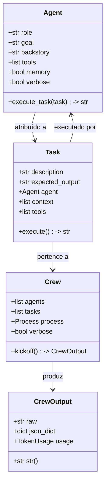
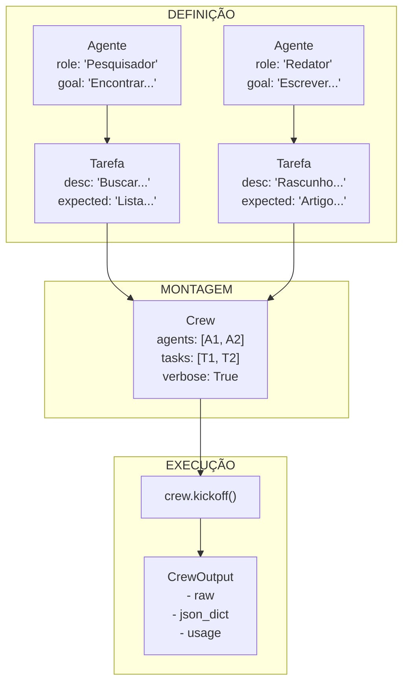
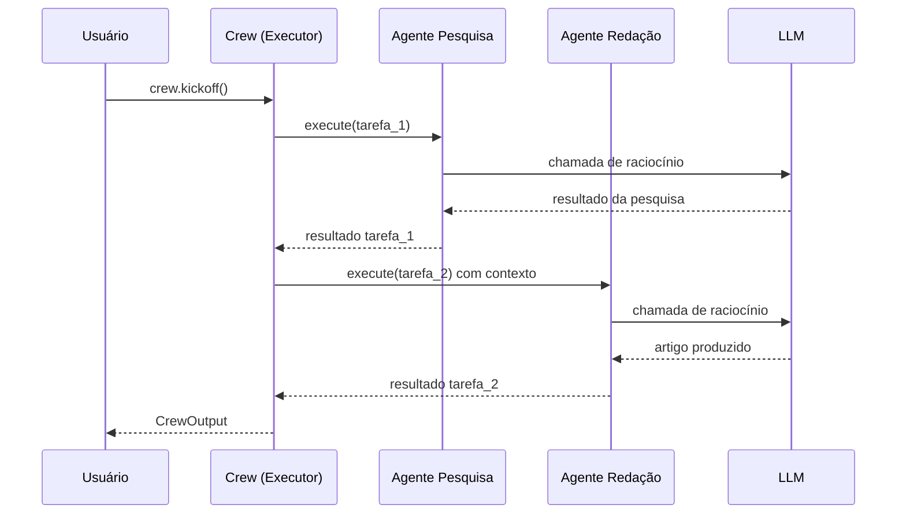

# Fundamentos do CrewAI, Agentes e Tarefas

CrewAI é um framework de orquestração multi-agente que permite definir **agentes de IA baseados em papéis**, atribuir **tarefas** e executá-los como uma **crew** coordenada. Ele é construído sobre grandes modelos de linguagem (LLMs) e fornece uma API Pythonica limpa para compor fluxos de trabalho multi-agente sofisticados.

---

## O que é CrewAI?

CrewAI fornece três abstrações principais que trabalham juntas para criar sistemas multi-agente:

- **Agent** — Uma entidade de IA com papel, objetivo e histórico específicos. Agentes usam LLMs para raciocinar, tomar decisões e executar tarefas.
- **Task** — Uma unidade de trabalho atribuída a um agente, com descrição, saída esperada e ferramentas ou dependências de contexto opcionais.
- **Crew** — O orquestrador que monta agentes e tarefas, gerencia o fluxo de execução e retorna os resultados finais.

```python
from crewai import Agent, Task, Crew

# Todas as três classes principais trabalham juntas
agent = Agent(role="Analista", goal="Analisar dados", backstory="Especialista em dados.")
task = Task(description="Analisar dados de vendas do Q1.", expected_output="Relatório.", agent=agent)
crew = Crew(agents=[agent], tasks=[task])
result = crew.kickoff()
```

Os agentes CrewAI normalmente usam grandes modelos de linguagem (LLMs) para raciocinar, executar tarefas e colaborar. O framework abstrai a complexidade da engenharia de prompt, chamadas de ferramentas e raciocínio em várias etapas.

[!NOTE]
CrewAI é projetado para **orquestração multi-agente baseada em papéis**. Se você precisa de um loop de agente único com chamadas de ferramenta, LangGraph ou uma chain simples do LangChain pode ser mais apropriada. CrewAI brilha quando você tem múltiplos agentes especializados que precisam colaborar, delegar e passar contexto entre si.

---

## A Classe Agent

Cada agente no CrewAI é uma instância da classe `Agent`. No mínimo, você fornece um `role` e um `goal`:

```python
from crewai import Agent

# Um agente mínimo — role e goal são obrigatórios
pesquisador = Agent(
    role="Analista de Pesquisa",
    goal="Encontrar as últimas tendências em agentes de IA",
    backstory="Você é um analista sênior em uma empresa de pesquisa de tecnologia.",
)
```

Parâmetros principais:

| Parâmetro | Obrigatório | Propósito |
| :--- | :--- | :--- |
| `role` | Sim | O cargo/função do agente — guia a persona do LLM |
| `goal` | Sim | O que o agente pretende alcançar — foca o raciocínio |
| `backstory` | Não | Narrativa contextual para a personalidade do agente |
| `tools` | Não | Lista de ferramentas que o agente pode usar |
| `memory` | Não | Ativa memória entre tarefas em uma execução |
| `verbose` | Não | Ativa registro passo a passo |

[!TIP]
O parâmetro `role` é o atributo mais influente para moldar o comportamento do agente. Um papel como "Desenvolvedor Python Sênior" produz saídas dramaticamente diferentes de "Revisor de Código Júnior" — mesmo com o mesmo `goal`. Seja específico: inclua senioridade, domínio e especialização.

```python
# Compare estes dois agentes — mesmo goal, roles diferentes
junior = Agent(
    role="Desenvolvedor Júnior",
    goal="Revisar o pull request e sugerir melhorias",
    backstory="Você está aprendendo melhores práticas em Python.",
)

senior = Agent(
    role="Engenheiro Principal Sênior",
    goal="Revisar o pull request e sugerir melhorias",
    backstory="Você tem 15 anos de experiência em sistemas distribuídos.",
)
```

---

## A Classe Task

Uma `Task` descreve o que precisa ser feito e qual agente deve fazê-lo:

```python
from crewai import Task

tarefa_pesquisa = Task(
    description="Pesquise na web por avanços recentes em sistemas multi-agente.",
    expected_output="Uma lista de 5 avanços principais com fontes.",
    agent=pesquisador,
)
```

Tarefas também podem definir `context` de outras tarefas, `tools` e funções `callback`. O campo `expected_output` é extremamente importante — ele diz tanto ao agente quanto ao framework o que constitui uma conclusão bem-sucedida.

```python
# Uma tarefa com contexto de outra tarefa
tarefa_a = Task(
    description="Colete dados trimestrais de receita.",
    expected_output="Tabela de dados brutos.",
    agent=agent_a,
)

tarefa_b = Task(
    description="Analise os dados de receita e identifique tendências.\n\nDados:\n{context}",
    expected_output="3 tendências principais com evidências de suporte.",
    agent=agent_b,
    context=[tarefa_a],  # recebe a saída de tarefa_a
)
```

[!WARNING]
A ordem das tarefas importa. Em um processo sequencial, as tarefas executam na ordem em que são definidas na lista. Se a tarefa B depende da saída da tarefa A, a tarefa A **deve** aparecer antes da tarefa B na lista `tasks`. Falhar em ordenar as tarefas corretamente resulta em contexto vazio ou incorreto.

| Parâmetro da Task | Obrigatório | Propósito |
| :--- | :--- | :--- |
| `description` | Sim | Instruções para o agente |
| `expected_output` | Não | Como é o sucesso |
| `agent` | Sim | Qual agente executa esta tarefa |
| `context` | Não | Lista de tarefas cujas saídas são passadas |
| `tools` | Não | Ferramentas específicas para esta tarefa |
| `callback` | Não | Função chamada após a conclusão |

---

## A Classe Crew

Uma `Crew` une agentes e tarefas e controla a execução:

```python
from crewai import Crew

crew = Crew(
    agents=[pesquisador],
    tasks=[tarefa_pesquisa],
    verbose=True,  # imprime logs passo a passo
)

resultado = crew.kickoff()  # executa a crew
print(resultado)
```

`kickoff()` retorna a saída final como uma string (padrão) ou como um objeto `CrewOutput`.

```python
# Crew com múltiplos agentes
crew_multi_agente = Crew(
    agents=[pesquisador, analista, redator],
    tasks=[tarefa_pesquisa, tarefa_analise, tarefa_relatorio],
    verbose=True,
)
```

[!WARNING]
Sempre defina `verbose=True` durante o desenvolvimento. Sem isso, depurar falhas no raciocínio do agente ou na execução de tarefas se torna significativamente mais difícil, pois nenhuma etapa intermediária é registrada.

---

## Diagrama de Classes Principal



---

## Fluxo Agente → Tarefa → Crew



O agente é atribuído a uma tarefa, a tarefa pertence a uma crew, e `crew.kickoff()` executa tudo. Durante a execução, cada agente recebe sua descrição de tarefa, realiza raciocínio LLM e retorna resultados em sequência.

---

## Sequência de Execução



---

## Crew Mínima Completa

```python
from crewai import Agent, Task, Crew

# 1. Definir agente
summarizer = Agent(
    role="Sumarizador de Conteúdo",
    goal="Resumir artigos técnicos em 3 pontos principais",
    backstory="Você é um editor que destila tópicos complexos.",
)

# 2. Definir tarefa
tarefa = Task(
    description="Resuma o artigo sobre arquitetura CrewAI.",
    expected_output="3 pontos concisos.",
    agent=summarizer,
)

# 3. Montar e executar crew
crew = Crew(
    agents=[summarizer],
    tasks=[tarefa],
    verbose=True,
)

output = crew.kickoff()
print(f"Resultado:\n{output}")
```

---

## Crew de Pesquisa Multi-Agente

Aqui está um exemplo mais realista com três agentes trabalhando juntos:

```python
from crewai import Agent, Task, Crew

# --- Agente de Pesquisa ---
pesquisador = Agent(
    role="Especialista em Pesquisa de IA",
    goal="Encontrar os últimos desenvolvimentos em sistemas multi-agente",
    backstory=(
        "Você é um pesquisador nível PhD em um laboratório de IA de topo. "
        "Você lê artigos acadêmicos e blogs técnicos diariamente "
        "e pode sintetizar informações complexas rapidamente."
    ),
    verbose=True,
)

# --- Agente de Análise ---
analista = Agent(
    role="Analista de Dados",
    goal="Extrair padrões e insights principais dos dados de pesquisa",
    backstory=(
        "Você é um analista de dados sênior com formação em estatística. "
        "Você transforma informações brutas em insights estruturados."
    ),
    verbose=True,
)

# --- Agente de Redação ---
redator = Agent(
    role="Redator Técnico",
    goal="Criar um post de blog claro e envolvente a partir dos resultados da pesquisa",
    backstory=(
        "Você é um redator técnico profissional que explica "
        "conceitos complexos de IA para um público amplo."
    ),
    verbose=True,
)

# --- Tarefas ---
dados_pesquisa = Task(
    description=(
        "Pesquise os últimos desenvolvimentos em sistemas multi-agente de IA. "
        "Foque em artigos publicados em 2025-2026. Cubra: "
        "(1) novas arquiteturas, (2) paradigmas de uso de ferramentas, "
        "(3) padrões de colaboração."
    ),
    expected_output="Um resumo estruturado de 5 desenvolvimentos principais com citações.",
    agent=pesquisador,
)

analise = Task(
    description="Analise os dados da pesquisa e identifique as 3 principais tendências.",
    expected_output="3 declarações de tendências, cada uma com evidências de suporte e avaliação de impacto.",
    agent=analista,
    context=[dados_pesquisa],
)

post_blog = Task(
    description=(
        "Escreva um post de blog de 500 palavras sobre as tendências "
        "encontradas na pesquisa. Torne-o acessível para engenheiros de ML. "
        "Use a análise como material de origem.\n\n"
        "Pesquisa:\n{context}"
    ),
    expected_output="Um post de blog refinado em formato markdown.",
    agent=redator,
    context=[analise],
)

# --- Crew ---
crew = Crew(
    agents=[pesquisador, analista, redator],
    tasks=[dados_pesquisa, analise, post_blog],
    verbose=True,
)

resultado = crew.kickoff()
print(str(resultado))
```

---

## Manipulação Básica de Saída

`crew.kickoff()` retorna um objeto `CrewOutput`. Você pode acessar:

| Método / Atributo | Descrição |
| :--- | :--- |
| `.raw` | Saída bruta em string da tarefa final |
| `.json_dict` | Saída analisada como JSON (se válido) |
| `.str()` | Representação legível em string |
| `str(resultado)` | Mesmo que `.str()` |
| `resultado.usage` | Metadados de uso de tokens (entrada/saída) |

```python
output = crew.kickoff()

# Acessar texto bruto
print(output.raw)

# Acessar uso de tokens
print(f"Tokens usados: {output.usage}")

# Converter para string explicitamente
relatorio = str(output)

# Tentar parsing JSON
if output.json_dict:
    for chave, valor in output.json_dict.items():
        print(f"{chave}: {valor}")
```

---

## Agente vs Tarefa vs Crew — Responsabilidades

| Aspecto | Agent | Task | Crew |
| :--- | :--- | :--- | :--- |
| **Propósito** | Quem executa o trabalho | O que fazer | Como é orquestrado |
| **Obrigatório** | `role`, `goal` | `description`, `agent` | `agents`, `tasks` |
| **Opcional** | `backstory`, `tools`, `memory` | `expected_output`, `tools`, `context` | `verbose`, `process`, `memory` |
| **Executa** | Raciocínio LLM | Invoca agente | Chama `kickoff()` |
| **Saída** | Parte do resultado da tarefa | `CrewOutput` final | `CrewOutput` |
| **Configuração** | Identidade e capacidades | Instruções e dependências | Orquestração e execução |

### Quando Usar Cada Classe

| Cenário | Use |
| :--- | :--- |
| Definir persona e ferramentas de um especialista | `Agent` |
| Especificar um trabalho com saída esperada | `Task` |
| Orquestrar múltiplos agentes entre tarefas | `Crew` |
| Executar todo o fluxo de trabalho | `crew.kickoff()` |

---

## Perguntas Interativas

```question
{
  "id": "ca-01-q1",
  "type": "multiple-choice",
  "question": "Você está construindo um pipeline de pesquisa: Agente A coleta dados, Agente B analisa, Agente C escreve um relatório. Quais classes do CrewAI você precisa?",
  "options": [
    "Apenas Agent e Task",
    "Agent, Task e Crew",
    "Apenas Task e Crew",
    "Apenas Agent e Crew"
  ],
  "correct": 1,
  "explanation": "Você precisa de Agent (para definir cada especialista), Task (para descrever cada unidade de trabalho) e Crew (para orquestrar a execução e a ordem)."
}
```

```question
{
  "id": "ca-01-q2",
  "type": "multiple-choice",
  "question": "Seu agente continua produzindo respostas vagas e genéricas. Qual é a causa mais provável?",
  "options": [
    "O modo verbose está desabilitado",
    "O role é muito genérico (ex.: 'Assistente')",
    "O expected_output está faltando",
    "O agente tem muitas ferramentas"
  ],
  "correct": 1,
  "explanation": "Um role genérico como 'Assistente' não dá ao LLM uma persona para adotar. Seja específico: 'Cientista de Dados Sênior' ou 'Especialista em Documentação Técnica' produz resultados dramaticamente melhores."
}
```

```question
{
  "id": "ca-01-q3",
  "type": "multiple-choice",
  "question": "A Tarefa A produz dados que a Tarefa B precisa. Em um processo sequencial, o que você deve garantir?",
  "options": [
    "As Tarefas A e B executam em paralelo",
    "A Tarefa A aparece antes da Tarefa B na lista de tasks",
    "A Tarefa B tem allow_delegation=True",
    "A Tarefa A tem verbose=True"
  ],
  "correct": 1,
  "explanation": "Em um processo sequencial, as tarefas executam na ordem da lista. A Tarefa A deve vir antes da Tarefa B para que sua saída esteja disponível quando a Tarefa B executar."
}
```

```question
{
  "id": "ca-01-q4",
  "type": "multiple-choice",
  "question": "Após crew.kickoff(), você precisa da saída bruta em string. Qual atributo você acessa?",
  "options": [
    "result.tokens",
    "result.json_dict",
    "result.raw",
    "result.output"
  ],
  "correct": 2,
  "explanation": "O atributo .raw em um objeto CrewOutput retorna o resultado bruto em string. .json_dict retorna JSON analisado, se aplicável."
}
```

```question
{
  "id": "ca-01-q5",
  "type": "multiple-choice",
  "question": "Sua crew tem 3 agentes mas a saída final está vazia. Qual é o primeiro passo de depuração?",
  "options": [
    "Adicionar mais ferramentas a cada agente",
    "Definir verbose=True na crew",
    "Remover todos os parâmetros de contexto",
    "Aumentar a temperatura do LLM"
  ],
  "correct": 1,
  "explanation": "verbose=True imprime cada etapa de raciocínio, chamada de ferramenta e mensagem de erro. Esta é a maneira mais rápida de encontrar onde a execução falha."
}
```

---

## 5 Perguntas de Prática

**1. Quais dois parâmetros são obrigatórios ao criar um `Agent`?**

- A) `role` e `backstory`
- B) `role` e `goal` ✅
- C) `goal` e `verbose`
- D) `backstory` e `tools`

**2. O que `crew.kickoff()` retorna?**

- A) Uma string simples
- B) Um objeto `CrewOutput` ✅
- C) Uma lista de objetos `Task`
- D) Uma instância de `Agent`

**3. Qual classe contém os campos `description` e `expected_output`?**

- A) `Agent`
- B) `Crew`
- C) `Task` ✅
- D) `CrewOutput`

**4. Qual é o papel principal da classe `Crew`?**

- A) Definir o modelo LLM
- B) Orquestrar agentes e tarefas ✅
- C) Criar instâncias de ferramentas
- D) Registrar uso de tokens

**5. Como acessar o resultado bruto em string após `kickoff()`?**

- A) `resultado.tokens`
- B) `resultado.json_dict`
- C) `resultado.raw` ✅
- D) `resultado.output`

---

[!SUCCESS]
### Principais Conclusões
- CrewAI fornece três classes principais: `Agent`, `Task` e `Crew`.
- Um `Agent` requer `role` e `goal`; um backstory fornece personalidade.
- Uma `Task` é atribuída a um agente e carrega um `expected_output`.
- Uma `Crew` orquestra agentes e tarefas via `kickoff()`.
- `verbose=True` é essencial para depurar o comportamento do agente.
- `CrewOutput` oferece acesso a `.raw`, `.json_dict`, `.str()` e `.usage`.
- O fluxo é: Agent ← Task → Crew → kickoff() → saída.
- A ordem das tarefas na lista determina a ordem de execução.
- Roles específicos produzem melhores saídas que roles genéricos.
