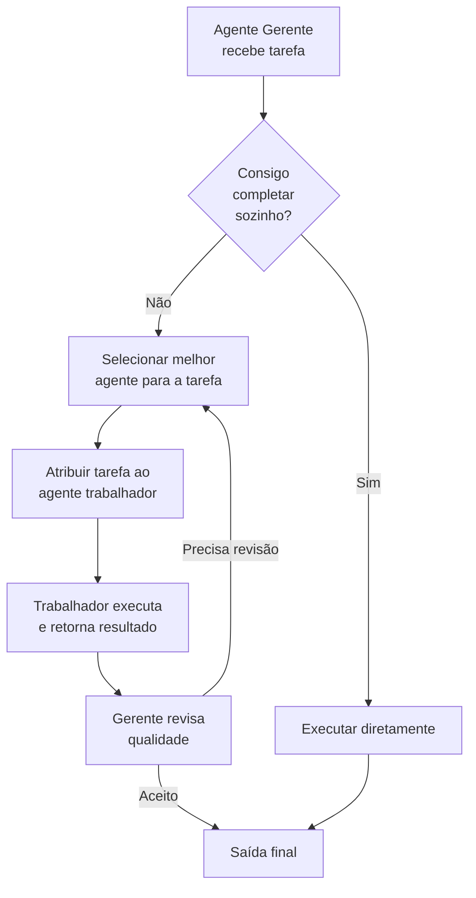
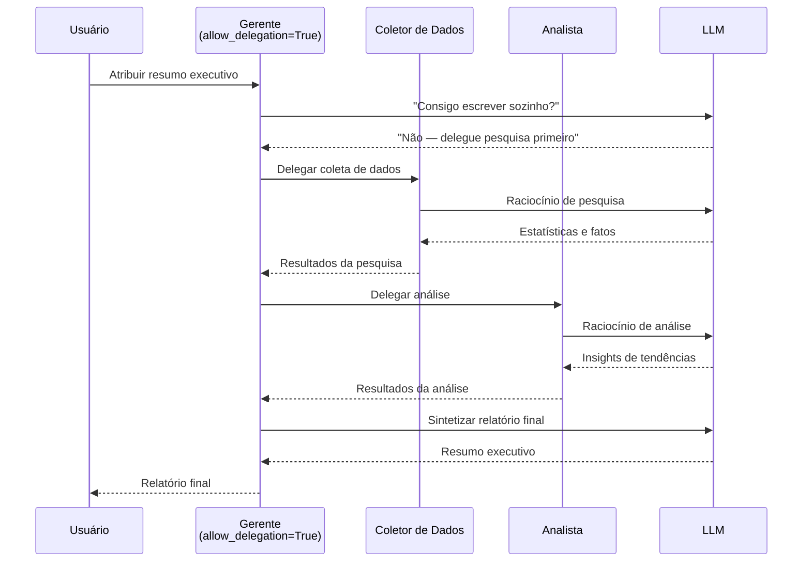

# Definindo Papéis, Objetivos, Históricos e Delegação

Um agente bem definido é a base de um sistema CrewAI confiável. Cada atributo — papel, objetivo, histórico, configurações de delegação — molda como o agente se comporta, colabora e delega tarefas. Acertar esses atributos é a diferença entre um sistema que produz texto genérico e um que entrega resultados de nível especialista.

---

## Papel, Objetivo e Histórico

Estes três atributos formam a identidade do agente. Juntos, eles definem a persona, o objetivo e a expertise que o LLM usa para raciocinar:

```python
from crewai import Agent

analista = Agent(
    role="Analista de Dados Sênior",
    goal="Identificar tendências de receita a partir de dados trimestrais de vendas",
    backstory=(
        "Você tem 10 anos de experiência em análise financeira "
        "e trabalhou nas melhores consultorias. Você explica "
        "dados complexos em termos simples."
    ),
)
```

| Atributo | Propósito | Impacto |
| :--- | :--- | :--- |
| `role` | Cargo / função | Guia a persona e o tom do LLM |
| `goal` | Objetivo que o agente deve alcançar | Foca o raciocínio e o planejamento |
| `backstory` | Contexto narrativo e expertise | Adiciona profundidade à tomada de decisão |

[!IMPORTANT]
O parâmetro `role` é o sinal mais forte para o comportamento do LLM. Um agente com `role="Engenheiro de Segurança Sênior"` priorizará segurança e modelagem de ameaças. O mesmo agente com `role="Gerente de Produto"` priorizará necessidades do usuário e prazos. Escolha papéis que codifiquem a expertise que você precisa.

```python
# Compare como o role muda o foco da saída
agente_seguranca = Agent(
    role="Engenheiro de Segurança Sênior",
    goal="Revisar o design do novo sistema de autenticação",
    backstory="Você é especialista em OAuth, SAML e arquiteturas zero-trust.",
)

agente_pm = Agent(
    role="Gerente de Produto",
    goal="Revisar o design do novo sistema de autenticação",
    backstory="Você foca na experiência do usuário e tempo de mercado.",
)
# Mesmo goal, mas os agentes enfatizarão aspectos completamente diferentes
```

[!WARNING]
Evite históricos genéricos como "Você é um assistente prestativo." Quanto mais específico o histórico, melhor a qualidade da saída do agente. Inclua expertise de domínio, anos de experiência e estilo de comunicação. Um bom modelo de histórico: "Você é um [senioridade] [papel] com [X] anos de experiência em [domínio]. Você [estilo de comunicação]."

---

## Colaboração de Agentes via Delegação

Agentes CrewAI podem delegar tarefas uns aos outros. Habilite a delegação com `allow_delegation=True`:

```python
gerente = Agent(
    role="Gerente de Projeto",
    goal="Coordenar pesquisa e entregar relatório final",
    backstory="Você gerencia equipes multifuncionais e delega trabalho.",
    allow_delegation=True,  # pode pedir ajuda a outros agentes
)

pesquisador = Agent(
    role="Especialista em Pesquisa",
    goal="Coletar dados sobre tópicos atribuídos",
    backstory="Você é um pesquisador online habilidoso.",
    allow_delegation=False,  # focado em execução, não delegação
)

redator = Agent(
    role="Redator de Relatórios",
    goal="Compilar descobertas em um relatório refinado",
    backstory="Você escreve relatórios claros e profissionais.",
    allow_delegation=False,
)
```

Quando `allow_delegation=True`, o agente pode pedir a outro agente para assumir uma tarefa, criando um fluxo de colaboração dinâmico. O agente delegante avalia se pode completar a tarefa; se não puder, encaminha o trabalho para um colega mais apropriado.

[!TIP]
Ative `allow_delegation` apenas em agentes que atuam como gerentes ou coordenadores. Agentes trabalhadores (pesquisadores, redatores, programadores) devem manter `False`. Isso evita o ping-pong de delegação onde agentes ficam passando trabalho uns para os outros.

```python
# Melhor prática: um gerente delega, trabalhadores executam
gerente = Agent(
    role="Diretor de Pesquisa",
    goal="Produzir um relatório abrangente de análise de mercado",
    backstory="Você lidera uma equipe de analistas e redatores.",
    allow_delegation=True,  # orquestrador
)
analista = Agent(
    role="Analista de Mercado",
    goal="Analisar dados de mercado e identificar tendências",
    backstory="Você é um analista certificado CFA.",
    allow_delegation=False,  # executor
)
redator = Agent(
    role="Redator de Relatórios",
    goal="Escrever relatórios profissionais",
    backstory="Você é um redator de negócios.",
    allow_delegation=False,  # executor
)
```

---

## Fluxo de Delegação



---

## Modo Verbose

O registro verbose mostra cada etapa de raciocínio, chamada de ferramenta e delegação:

```python
agent = Agent(
    role="Agente de Suporte",
    goal="Resolver dúvidas de clientes",
    backstory="Você é um representante de suporte de primeira linha.",
    verbose=True,  # imprime pensamentos, ações, observações
)
```

Três níveis de verbosidade:
- `False` — sem saída (padrão)
- `True` — logs detalhados passo a passo
- Um enum `Verbose` com controle granular (disponível em versões recentes)

```python
from crewai import Verbose

# Controle granular de verbosidade
agent = Agent(
    role="Agente de Depuração",
    goal="Depurar o sistema",
    backstory="Você é um engenheiro de sistemas.",
    verbose=Verbose.INFO,  # mostra raciocínio mas omite detalhes de ferramentas
)
```

---

## Memória em Agentes

Agentes podem reter contexto entre múltiplas execuções de tarefas:

```python
agent_com_memoria = Agent(
    role="Chatbot",
    goal="Manter conversas coerentes de múltiplas interações",
    backstory="Você é um assistente de atendimento amigável.",
    memory=True,  # ativa memória de curto prazo dentro de uma execução
)
```

| Configuração de Memória | Comportamento |
| :--- | :--- |
| `memory=False` (padrão) | Sem memória; cada tarefa começa do zero |
| `memory=True` | Agente lembra interações anteriores na mesma execução |

[!NOTE]
A memória em nível de agente (`memory=True`) é separada da configuração de memória em nível de crew. A memória do agente é de curto prazo (em processo) e é perdida após `kickoff()` terminar. Para memória persistente entre execuções, use `memory_config` da crew com um backend LongTermMemory (abordado na lição 5).

---

## Sequência de Colaboração de Agentes



---

## Agentes Especializados com Delegação — Exemplo Completo

```python
from crewai import Agent, Task, Crew

# --- Agentes ---
gerente = Agent(
    role="Gerente de Pesquisa",
    goal="Supervisionar pesquisa e compilar relatório final",
    backstory="Você lidera uma equipe de pesquisa e delega tarefas eficazmente.",
    allow_delegation=True,
    verbose=True,
)

coletor = Agent(
    role="Coletor de Dados",
    goal="Encontrar estatísticas e fatos relevantes",
    backstory="Você é especialista em pesquisar bases de dados e a web.",
    allow_delegation=False,
)

analista = Agent(
    role="Analista",
    goal="Interpretar dados e gerar insights",
    backstory="Você transforma dados brutos em insights acionáveis.",
    allow_delegation=False,
)

# --- Tarefas ---
tarefa_coleta = Task(
    description="Colete estatísticas de adoção de IA 2025 de fontes confiáveis.",
    expected_output="Tabela de estatísticas com fontes.",
    agent=coletor,
)

tarefa_analise = Task(
    description="Analise as estatísticas coletadas e identifique as 3 principais tendências.",
    expected_output="3 declarações de tendências com dados de suporte.",
    agent=analista,
)

tarefa_relatorio = Task(
    description="Escreva um resumo executivo final baseado na análise.",
    expected_output="Resumo executivo de 1 página.",
    agent=gerente,
)

# --- Crew ---
crew = Crew(
    agents=[gerente, coletor, analista],
    tasks=[tarefa_coleta, tarefa_analise, tarefa_relatorio],
    verbose=True,
)

resultado = crew.kickoff()
print(resultado)
```

---

## Compartilhamento de Contexto Entre Agentes Delegados

Tarefas podem compartilhar contexto explicitamente para criar transições suaves entre agentes delegados:

```python
from crewai import Agent, Task, Crew

# Agentes
gerente = Agent(
    role="Gerente de Pesquisa",
    goal="Produzir um relatório de pesquisa completo",
    backstory="Você coordena projetos de pesquisa.",
    allow_delegation=True,
)

coletor = Agent(
    role="Coletor de Dados",
    goal="Coletar dados abrangentes",
    backstory="Você é um pesquisador especialista.",
    allow_delegation=False,
)

redator = Agent(
    role="Redator de Relatórios",
    goal="Escrever relatórios claros a partir de dados",
    backstory="Você é um redator profissional.",
    allow_delegation=False,
)

# Tarefas com passagem de contexto
coleta = Task(
    description="Colete dados sobre taxas de adoção de energia renovável globalmente.",
    expected_output="Tabela de dados com taxas de adoção por país.",
    agent=coletor,
)

analise = Task(
    description=(
        "Analise os dados de energia renovável e identifique os 5 maiores adotantes.\n\n"
        "Fonte de dados:\n{context}"
    ),
    expected_output="Relatório de análise listando os top 5 países com taxas de crescimento.",
    agent=coletor,
    context=[coleta],
)

escrita = Task(
    description=(
        "Escreva um resumo executivo baseado nesta análise:\n\n{context}"
    ),
    expected_output="Resumo executivo de uma página adequado para a diretoria.",
    agent=redator,
    context=[analise],
)

crew = Crew(
    agents=[gerente, coletor, redator],
    tasks=[coleta, analise, escrita],
    verbose=True,
)

resultado = crew.kickoff()
```

---

## Comparação de Atributos do Agente

| Atributo | Tipo | Padrão | Efeito |
| :--- | :--- | :--- | :--- |
| `role` | `str` | — (obrigatório) | Define a persona do agente |
| `goal` | `str` | — (obrigatório) | Define o objetivo |
| `backstory` | `str` | `""` | Adiciona contexto narrativo |
| `allow_delegation` | `bool` | `False` | Ativa delegação entre agentes |
| `verbose` | `bool` / `Verbose` | `False` | Ativa logging passo a passo |
| `memory` | `bool` | `False` | Preserva contexto entre tarefas |
| `tools` | `List[BaseTool]` | `[]` | Anexa capacidades personalizadas |

### Impacto dos Atributos no Comportamento

| Configuração | Efeito na Saída | Impacto na Performance |
| :--- | :--- | :--- |
| Role específico + backstory detalhado | Alta qualidade, consciente do domínio | Ligeiramente mais tokens por chamada |
| Role genérico + sem backstory | Respostas genéricas e superficiais | Mais rápido, menos tokens |
| `allow_delegation=True` | Colaborativo, dinâmico | Mais chamadas LLM para decisões de delegação |
| `verbose=True` | Transparência total | Sem impacto na performance (console apenas) |
| `memory=True` | Consciente do contexto, coerente | Mais tokens para retenção de contexto |

---

## Perguntas Interativas

```question
{
  "id": "ca-02-q1",
  "type": "multiple-choice",
  "question": "Você tem dois agentes com o mesmo goal mas roles diferentes: 'Desenvolvedor Júnior' e 'Arquiteto Sênior'. Ambos revisam um pull request. O que será mais diferente em suas saídas?",
  "options": [
    "Ambos produzirão revisões idênticas",
    "O Arquiteto Sênior focará no design do sistema enquanto o Júnior foca na sintaxe",
    "O Desenvolvedor Júnior produzirá revisões mais longas",
    "O Arquiteto Sênior não pode revisar código"
  ],
  "correct": 1,
  "explanation": "O role molda dramaticamente o comportamento do LLM. Um Arquiteto Sênior enfatiza arquitetura e padrões de design, enquanto um Desenvolvedor Júnior foca em sintaxe e boas práticas básicas."
}
```

```question
{
  "id": "ca-02-q2",
  "type": "multiple-choice",
  "question": "Sua equipe de pesquisa tem 4 agentes todos com allow_delegation=True. A tarefa fica sendo passada entre agentes sem ser concluída. Qual é o problema?",
  "options": [
    "O LLM está muito lento",
    "Muitos agentes podem delegar — apenas gerentes devem delegar",
    "O modo verbose está causando atrasos",
    "As tarefas são muito complexas"
  ],
  "correct": 1,
  "explanation": "Quando todos os agentes podem delegar, eles podem passar trabalho indefinidamente. Apenas agentes do tipo gerente devem ter allow_delegation=True; agentes trabalhadores devem ser executores puros."
}
```

```question
{
  "id": "ca-02-q3",
  "type": "multiple-choice",
  "question": "Um agente com role='Agente de Suporte' produz respostas genéricas. Qual mudança teria o maior impacto?",
  "options": [
    "Definir verbose=True",
    "Mudar o role para 'Agente de Suporte Técnico Sênior especializado em Kubernetes'",
    "Definir memory=True",
    "Adicionar allow_delegation=True"
  ],
  "correct": 1,
  "explanation": "Um role mais específico dá ao LLM uma persona mais clara. Adicionar especialização ('Kubernetes') e senioridade ('Sênior') melhora dramaticamente a relevância da saída."
}
```

```question
{
  "id": "ca-02-q4",
  "type": "multiple-choice",
  "question": "Em uma crew hierárquica, o gerente delega uma tarefa a um trabalhador. O trabalhador retorna resultados de baixa qualidade. O que acontece em seguida?",
  "options": [
    "O trabalhador é removido da crew",
    "O gerente pode reatribuir ou pedir revisões",
    "A crew trava com um erro",
    "A tarefa é pulada"
  ],
  "correct": 1,
  "explanation": "No modo hierárquico, o gerente revisa as saídas e pode solicitar revisões ou reatribuir tarefas a diferentes trabalhadores. Esta é uma vantagem chave da orquestração hierárquica."
}
```

```question
{
  "id": "ca-02-q5",
  "type": "multiple-choice",
  "question": "Dois agentes executam sequencialmente: Agente A coleta dados, Agente B escreve um relatório. A saída do Agente B contradiz os dados que o Agente A coletou. Qual é a causa mais provável?",
  "options": [
    "O Agente B tem allow_delegation=True",
    "Falta contexto do Agente A para o Agente B",
    "O modo verbose está muito baixo",
    "O role do Agente A é muito específico"
  ],
  "correct": 1,
  "explanation": "O Agente B precisa de contexto do Agente A para basear seu relatório em dados reais. Sem ele, o Agente B gera conteúdo de seus próprios dados de treinamento. Passe contexto explicitamente ou garanta que o processo sequencial o passe automaticamente."
}
```

---

## 5 Perguntas de Prática

**1. Qual atributo do agente tem o maior impacto na persona e no tom do LLM?**

- A) `goal`
- B) `role` ✅
- C) `verbose`
- D) `memory`

**2. O que `allow_delegation=True` permite?**

- A) O agente pode pular tarefas
- B) O agente pode pedir a outros agentes para assumir trabalho ✅
- C) O agente pode modificar seu próprio objetivo
- D) O agente pode usar APIs externas

**3. O que acontece quando `verbose=True`?**

- A) O agente executa mais rápido
- B) A crew registra cada etapa de raciocínio e chamada de ferramenta ✅
- C) A saída é formatada como JSON
- D) A delegação é desativada

**4. Qual dos seguintes NÃO é um atributo de agente?**

- A) `backstory`
- B) `expected_output` ✅
- C) `allow_delegation`
- D) `memory`

**5. O que `memory=True` faz em um agente?**

- A) Armazena a saída final em disco
- B) Retém contexto entre tarefas dentro de uma execução da crew ✅
- C) Armazena em cache resultados de ferramentas
- D) Ativa delegação

---

[!SUCCESS]
### Principais Conclusões
- `role`, `goal` e `backstory` definem a identidade e o comportamento do agente.
- Históricos específicos produzem saídas de agente de maior qualidade.
- `allow_delegation=True` permite colaboração dinâmica entre agentes.
- `verbose=True` é essencial para depuração e transparência.
- `memory=True` preserva contexto entre tarefas em uma única execução.
- Gerentes com delegação podem coordenar trabalhadores especializados.
- Cada atributo tem um papel específico na formação do comportamento do agente.
- Ative delegação apenas em gerentes para evitar loops de delegação.
- A passagem de contexto entre tarefas garante fluxos de trabalho coerentes.
