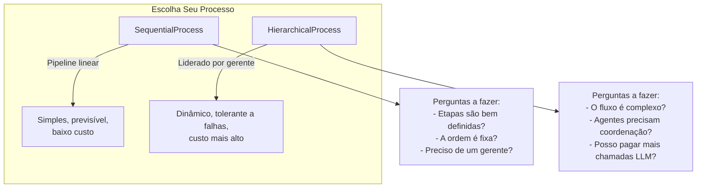
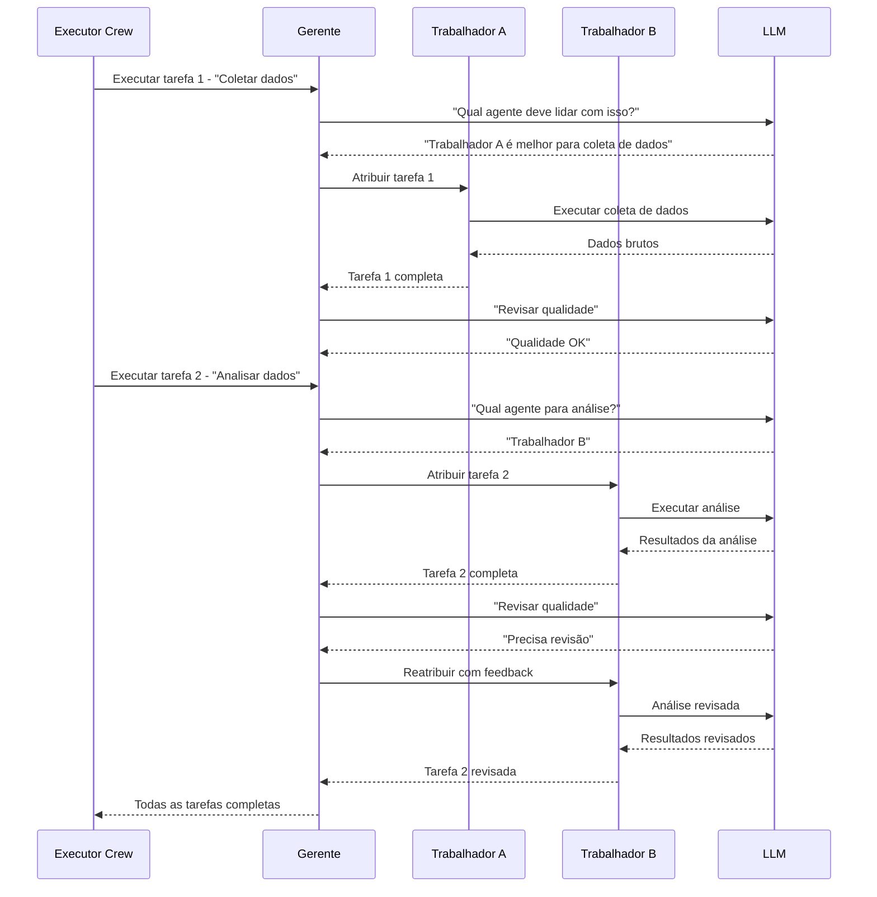
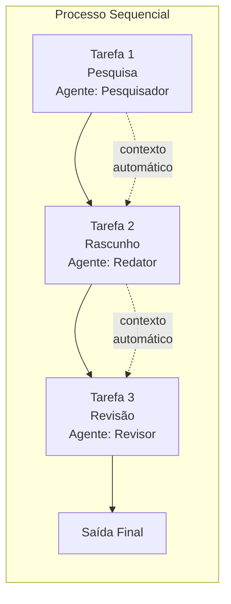
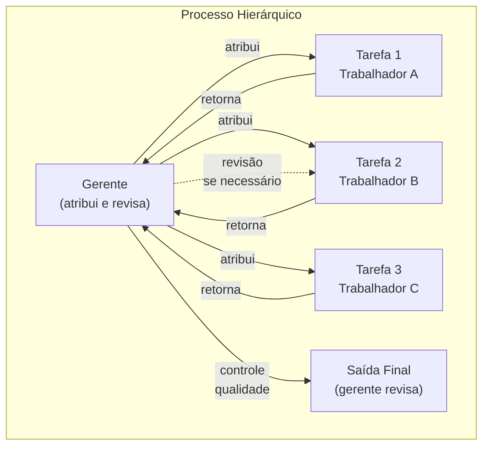
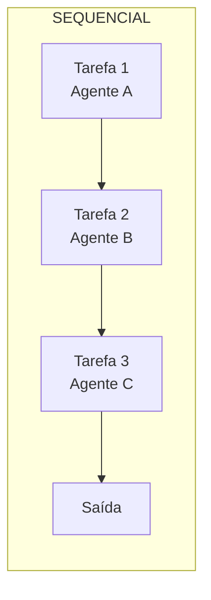
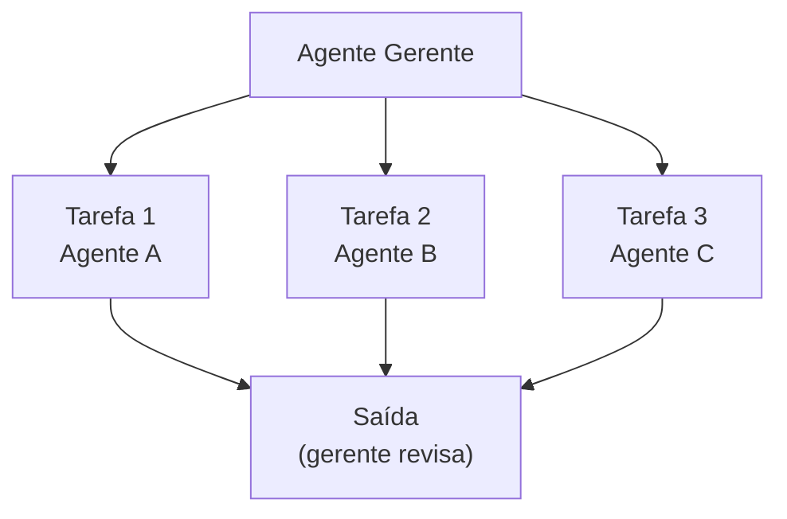

# Orquestração de Crew: Processos Sequenciais e Hierárquicos

O CrewAI suporta dois processos de orquestração nativos: **sequencial** (pipeline linear) e **hierárquico** (liderado por gerente). Escolher o processo certo determina como as tarefas fluem e como os agentes colaboram. Esta decisão impacta diretamente a escalabilidade, robustez e custo do seu sistema multi-agente.

---

## Visão Geral dos Processos



---

## Processo Sequencial (`SequentialProcess`)

As tarefas são executadas uma após a outra na ordem em que são definidas. Cada tarefa recebe automaticamente a saída da tarefa anterior via contexto. Este é o modo de execução mais simples e previsível.

```python
from crewai import Agent, Task, Crew, Process

# Agentes
pesquisador = Agent(
    role="Pesquisador",
    goal="Encontrar informações relevantes",
    backstory="Você é um pesquisador minucioso.",
)

redator = Agent(
    role="Redator",
    goal="Escrever um artigo claro baseado na pesquisa",
    backstory="Você é um redator técnico habilidoso.",
)

revisor = Agent(
    role="Revisor",
    goal="Revisar e melhorar a qualidade do artigo",
    backstory="Você é um editor meticuloso.",
)

# Tarefas (executadas em ordem)
tarefa_pesquisa = Task(
    description="Pesquise a história dos agentes de IA.",
    expected_output="Uma linha do tempo dos marcos principais.",
    agent=pesquisador,
)

tarefa_escrita = Task(
    description="Escreva um artigo de 300 palavras a partir da pesquisa.",
    expected_output="Um artigo refinado.",
    agent=redator,
)

tarefa_revisao = Task(
    description="Revise e melhore o artigo.",
    expected_output="Versão final com alterações rastreadas.",
    agent=revisor,
)

# Crew sequencial
crew = Crew(
    agents=[pesquisador, redator, revisor],
    tasks=[tarefa_pesquisa, tarefa_escrita, tarefa_revisao],
    process=Process.sequential,  # padrão se não especificado
    verbose=True,
)

resultado = crew.kickoff()
```

[!NOTE]
`Process.sequential` é o padrão. Se você não especificar um parâmetro `process`, o CrewAI executa tarefas sequencialmente. Isso é ideal para **pipelines bem definidos** onde cada etapa depende da anterior, como pesquisa → rascunho → revisão → publicação.

---

## Processo Hierárquico (`HierarchicalProcess`)

Um **agente gerente** coordena o trabalho. Ele atribui tarefas aos agentes trabalhadores, revisa saídas e gerencia delegação automaticamente. O gerente decide qual agente deve lidar com cada tarefa e pode reatribuir trabalho se os resultados forem insatisfatórios.

```python
from crewai import Agent, Task, Crew, Process

# Agente gerente — coordena a crew
gerente = Agent(
    role="Gerente de Projeto",
    goal="Entregar um relatório final de alta qualidade",
    backstory="Você gerencia projetos técnicos e delega tarefas.",
    allow_delegation=True,  # obrigatório para processo hierárquico
)

# Agentes trabalhadores
engenheiro = Agent(
    role="Engenheiro de Dados",
    goal="Construir pipelines de dados",
    backstory="Você projeta pipelines ETL.",
)

analista = Agent(
    role="Analista",
    goal="Extrair insights dos dados",
    backstory="Você transforma dados em valor de negócio.",
)

# Tarefas — o gerente decide quem faz o quê
tarefa_pipeline = Task(
    description="Construa um pipeline para coletar dados de atividade do usuário.",
    expected_output="Descrição do pipeline funcional.",
    agent=engenheiro,
)

tarefa_insight = Task(
    description="Analise os dados coletados em busca de padrões de comportamento.",
    expected_output="Relatório de 3 padrões principais.",
    agent=analista,
)

tarefa_resumo = Task(
    description="Resuma todas as descobertas em um brief executivo.",
    expected_output="Brief executivo de uma página.",
    agent=gerente,
)

# Crew hierárquica
crew = Crew(
    agents=[gerente, engenheiro, analista],
    tasks=[tarefa_pipeline, tarefa_insight, tarefa_resumo],
    process=Process.hierarchical,
    verbose=True,
    manager_agent=gerente,  # gerente explícito
)

resultado = crew.kickoff()
```

[!WARNING]
Em um processo hierárquico, o agente gerente **deve** ter `allow_delegation=True`. Sem isso, a crew não consegue atribuir tarefas dinamicamente e gerará um erro em execução. Além disso, o gerente incorre em chamadas LLM extras para cada decisão de delegação, aumentando o uso de tokens e o custo.

---

## Fluxo de Decisão do Gerente Hierárquico



---

## Passagem de Contexto Entre Tarefas

Tarefas podem passar contexto explicitamente para tarefas subsequentes usando o parâmetro `context`:

```python
tarefa_a = Task(
    description="Colete dados de vendas do Q1.",
    expected_output="Dados brutos de vendas do Q1.",
    agent=coletor,
)

tarefa_b = Task(
    description="""Analise os dados de vendas do Q1 e identifique tendências.
Os dados são: {context}""",
    expected_output="3 tendências com evidências de suporte.",
    agent=analista,
    context=[tarefa_a],  # passa a saída de tarefa_a como contexto
)
```

Em um processo sequencial, o contexto é passado automaticamente. Em um processo hierárquico, o gerente decide qual contexto cada trabalhador recebe.

```python
# Múltiplas fontes de contexto
tarefa_c = Task(
    description=(
        "Escreva um relatório abrangente usando os seguintes dados:\n\n"
        "Dados de Vendas:\n{contexto_vendas}\n\n"
        "Pesquisa de Usuários:\n{contexto_pesquisa}"
    ),
    expected_output="Um relatório abrangente de 2 páginas.",
    agent=redator,
    context=[tarefa_vendas, tarefa_pesquisa],  # múltiplas tarefas upstream
)
```

[!TIP]
Use o parâmetro `context` mesmo em processos sequenciais quando uma tarefa precisar de entrada de uma tarefa anterior não adjacente. Por exemplo, tarefa D precisa de dados da tarefa A (pulando B e C). Contexto explícito torna essas relações claras e fáceis de manter.

---

## Visualização da Execução Sequencial





---

## Comparação de Processos

| Aspecto | SequentialProcess | HierarchicalProcess |
| :--- | :--- | :--- |
| **Ordem de execução** | Linear fixa | Gerente decide dinamicamente |
| **Autonomia do agente** | Baixa — tarefas pré-atribuídas | Alta — gerente atribui e revisa |
| **Gerente necessário** | Não | Sim (com `allow_delegation=True`) |
| **Passagem de contexto** | Automática entre tarefas adjacentes | Gerenciada pelo agente gerente |
| **Melhor para** | Pipelines simples, etapas bem definidas | Fluxos complexos que exigem coordenação |
| **Custo** | Mínimo | Maior (chamadas LLM do gerente) |
| **Recuperação de erros** | Manual | Gerente pode reatribuir tarefas falhas |
| **Custo de tokens** | 1 chamada LLM por tarefa | 1-2 chamadas LLM extras por tarefa |
| **Escalabilidade** | Até ~10 tarefas | Até ~50+ agentes |
| **Depuração** | Fácil (rastreio linear) | Moderada (decisões do gerente adicionam complexidade) |

### Quando Usar Cada Processo

| Cenário | Processo Recomendado | Motivo |
| :--- | :--- | :--- |
| Pipeline Pesquisa → Escrever → Publicar | Sequential | Etapas fixas, dependências claras |
| Equipe de desenvolvimento de software multi-agente | Hierarchical | Precisa coordenação, revisão de código, reatribuição |
| ETL de dados com validações | Sequential | Cada etapa depende limpidamente da anterior |
| Suporte ao cliente com escalonamento | Hierarchical | Roteamento dinâmico baseado no tipo de problema |
| Geração de conteúdo com ciclo de revisão | Sequential | Ordem previsível, estágios bem definidos |
| Pesquisa automatizada com requisitos desconhecidos | Hierarchical | Gerente se adapta dinamicamente aos resultados |

---

## Configuração Personalizada de Gerente

Quando você não especifica um `manager_agent`, o CrewAI cria um LLM gerente padrão. Você pode personalizar isso:

```python
from langchain_openai import ChatOpenAI
from crewai import Agent, Task, Crew, Process

# LLM gerente personalizado — modelo mais rápido e barato
llm_gerente = ChatOpenAI(
    model="gpt-4o-mini",
    temperature=0.0,  # decisões de delegação determinísticas
)

# Crew com gerente implícito (CrewAI cria um)
crew = Crew(
    agents=[worker_a, worker_b, worker_c],
    tasks=[tarefa1, tarefa2, tarefa3],
    process=Process.hierarchical,
    manager_llm=llm_gerente,  # LLM personalizado para o gerente padrão
    verbose=True,
)

# Ou use um agente gerente explícito
gerente_explicito = Agent(
    role="Gerente Técnico de Programa",
    goal="Entregar projetos no prazo com alta qualidade",
    backstory="Você gerencia equipes de engenharia de IA.",
    allow_delegation=True,
    llm=llm_gerente,
)

crew_com_gerente = Crew(
    agents=[gerente_explicito, worker_a, worker_b],
    tasks=[tarefa1, tarefa2, tarefa3],
    process=Process.hierarchical,
    manager_agent=gerente_explicito,
    verbose=True,
)
```

---

## Diagrama: Sequencial vs Hierárquico





No modo sequencial, os agentes executam em ordem fixa. No modo hierárquico, o gerente orquestra o fluxo dinamicamente.

---

## Perguntas Interativas

```question
{
  "id": "ca-03-q1",
  "type": "multiple-choice",
  "question": "Você está construindo um pipeline de conteúdo: esboço → rascunho → revisão → publicação. Cada etapa depende da anterior. Qual processo você deve usar?",
  "options": [
    "HierarchicalProcess — para atribuição dinâmica",
    "SequentialProcess — para etapas lineares fixas",
    "Nenhum — isso requer código personalizado",
    "Qualquer um funcionaria igualmente bem"
  ],
  "correct": 1,
  "explanation": "Um pipeline de conteúdo tem etapas bem definidas e de ordem fixa, onde cada uma depende da anterior. SequentialProcess é ideal: simples, previsível e de baixo custo."
}
```

```question
{
  "id": "ca-03-q2",
  "type": "multiple-choice",
  "question": "Sua crew hierárquica tem 5 trabalhadores. O gerente gasta muito com chamadas LLM para decisões de delegação. Qual otimização você pode fazer?",
  "options": [
    "Mudar para SequentialProcess",
    "Usar um LLM mais barato para o gerente (ex.: gpt-4o-mini)",
    "Remover allow_delegation do gerente",
    "Reduzir o número de tarefas"
  ],
  "correct": 1,
  "explanation": "O gerente toma decisões de delegação via chamadas LLM. Usar um modelo mais barato (gpt-4o-mini) para o gerente reduz custos enquanto mantém a qualidade do raciocínio para os trabalhadores."
}
```

```question
{
  "id": "ca-03-q3",
  "type": "multiple-choice",
  "question": "Em um processo sequencial, a Tarefa C precisa de dados da Tarefa A (não de B, que executa entre elas). Como você fornece este contexto?",
  "options": [
    "Reordenar tarefas para que A fique adjacente a C",
    "Usar context=[tarefa_a] na Tarefa C",
    "O processo sequencial lida com isso automaticamente",
    "Mudar para processo hierárquico"
  ],
  "correct": 1,
  "explanation": "Use o parâmetro context para vincular explicitamente tarefas não adjacentes. A Tarefa C pode referenciar a saída da Tarefa A diretamente via context=[tarefa_a], mesmo que a Tarefa B execute entre elas."
}
```

```question
{
  "id": "ca-03-q4",
  "type": "multiple-choice",
  "question": "Você executa uma crew hierárquica sem definir manager_agent. O que acontece?",
  "options": [
    "A crew executa sequencialmente em vez disso",
    "O CrewAI cria um LLM gerente padrão",
    "Um erro é gerado",
    "O primeiro agente se torna o gerente"
  ],
  "correct": 1,
  "explanation": "Quando nenhum manager_agent é especificado, o CrewAI cria automaticamente um LLM gerente padrão para lidar com a delegação. Você pode personalizá-lo via manager_llm."
}
```

```question
{
  "id": "ca-03-q5",
  "type": "multiple-choice",
  "question": "Uma crew hierárquica tem um gerente e 3 trabalhadores. A saída do Trabalhador A é abaixo do padrão. O que o gerente pode fazer?",
  "options": [
    "Nada — as tarefas são fixas após a atribuição",
    "Reatribuir a tarefa a um trabalhador diferente ou solicitar revisão",
    "Remover o Trabalhador A da crew",
    "Mudar para SequentialProcess automaticamente"
  ],
  "correct": 1,
  "explanation": "Uma vantagem chave do processo hierárquico é que o gerente pode revisar saídas e reatribuir tarefas com falha para diferentes trabalhadores ou solicitar revisões do mesmo trabalhador."
}
```

---

## 5 Perguntas de Prática

**1. Qual tipo de processo requer um agente gerente com `allow_delegation=True`?**

- A) SequentialProcess
- B) HierarchicalProcess ✅
- C) Ambos
- D) Nenhum

**2. Como o contexto é passado entre tarefas em um processo sequencial?**

- A) Explicitamente via parâmetro `context` apenas
- B) Automaticamente entre tarefas adjacentes ✅
- C) O contexto nunca é compartilhado
- D) Via um banco de dados compartilhado

**3. Qual é a principal vantagem de um processo hierárquico sobre um sequencial?**

- A) Menor uso de tokens
- B) Atribuição dinâmica de tarefas e recuperação de erros ✅
- C) Execução mais rápida
- D) Configuração mais simples

**4. Qual valor enum representa o processo sequencial no CrewAI?**

- A) `Process.linear`
- B) `Process.sequential` ✅
- C) `Process.pipeline`
- D) `Process.simple`

**5. O que acontece se você usar `Process.hierarchical` sem definir `manager_agent`?**

- A) O primeiro agente se torna o gerente
- B) O CrewAI cria um LLM gerente padrão ✅
- C) A crew executa sequencialmente
- D) Um erro é gerado imediatamente

---

[!SUCCESS]
### Principais Conclusões
- `Process.sequential` executa tarefas em ordem linear fixa com passagem automática de contexto.
- `Process.hierarchical` usa um agente gerente para atribuição dinâmica de tarefas.
- O agente gerente deve ter `allow_delegation=True`.
- Contexto pode ser passado explicitamente via parâmetro `context` em qualquer tarefa.
- Sequencial é melhor para pipelines simples e bem definidos.
- Hierárquico é excelente para fluxos de trabalho complexos que exigem coordenação.
- O gerente em um processo hierárquico pode reatribuir tarefas falhas.
- Use LLMs mais baratos para o gerente para reduzir custos hierárquicos.
- Contexto explícito vincula tarefas não adjacentes mesmo no modo sequencial.
