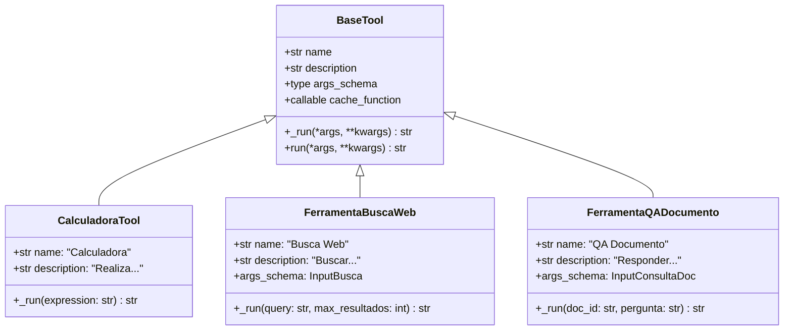
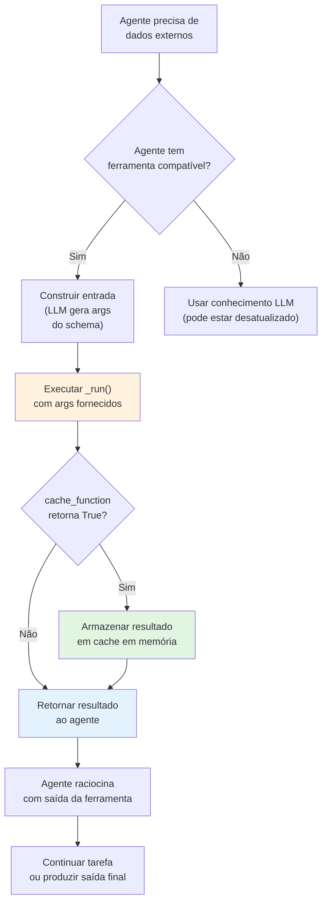
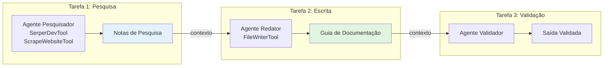

# Ferramentas Personalizadas, Integração e Contexto Compartilhado

Ferramentas dão aos agentes a capacidade de interagir com sistemas externos: pesquisar na web, consultar bancos de dados, executar cálculos ou chamar APIs. O CrewAI fornece um rico ecossistema de ferramentas e uma API simples para criar as suas próprias. Sem ferramentas, os agentes só podem usar seus dados de treinamento; com ferramentas, eles podem acessar informações em tempo real e realizar ações no mundo.

---

## A Classe `BaseTool`

Cada ferramenta no CrewAI estende `BaseTool`. No mínimo, você define `name`, `description` e o método `_run()`:

```python
from crewai.tools import BaseTool
from pydantic import Field

class CalculadoraTool(BaseTool):
    name: str = "Calculadora"
    description: str = "Realiza operações aritméticas básicas (soma, subtração, multiplicação, divisão)."

    args_schema: type = Field

    def _run(self, expressao: str) -> str:
        """Avalia uma expressão aritmética simples."""
        try:
            resultado = eval(expressao)
            return f"Resultado: {resultado}"
        except Exception as e:
            return f"Erro: {str(e)}"
```

[!IMPORTANT]
Os campos `name` e `description` são críticos — eles são o que o LLM do agente lê para decidir quando usar uma ferramenta. Um nome claro e descritivo e uma descrição detalhada de quando e como usar a ferramenta melhoram dramaticamente a seleção correta de ferramentas pelo agente.

---

## Hierarquia de Classes de Ferramentas



---

## Criando uma Ferramenta Personalizada com Parâmetros

Você pode definir parâmetros de entrada estruturados usando Pydantic:

```python
from crewai.tools import BaseTool
from pydantic import BaseModel, Field

class InputBusca(BaseModel):
    query: str = Field(description="A string de consulta")
    max_resultados: int = Field(default=5, description="Número máximo de resultados")

class FerramentaBuscaWeb(BaseTool):
    name: str = "Busca Web"
    description: str = "Pesquise na web por informações atuais sobre um tópico."
    args_schema: type = InputBusca

    def _run(self, query: str, max_resultados: int = 5) -> str:
        resultados = [
            f"Resultado {i}: Resultado simulado para '{query}'"
            for i in range(1, max_resultados + 1)
        ]
        return "\n".join(resultados)
```

```python
# Usando a ferramenta
tool = FerramentaBuscaWeb()
resultado = tool._run(query="agentes CrewAI", max_resultados=3)
print(resultado)
# Resultado 1: Resultado simulado para 'agentes CrewAI'
# Resultado 2: Resultado simulado para 'agentes CrewAI'
# Resultado 3: Resultado simulado para 'agentes CrewAI'
```

---

## Fluxo de Execução de Ferramenta Personalizada



---

## Ferramenta Real: Busca Web com Serper

```python
import requests
from crewai.tools import BaseTool
from pydantic import BaseModel, Field

class InputBusca(BaseModel):
    query: str = Field(description="A consulta de pesquisa")

class FerramentaBuscaReal(BaseTool):
    name: str = "Busca Web"
    description: str = "Pesquise no Google por informações atuais usando a API Serper."
    args_schema: type = InputBusca

    def _run(self, query: str) -> str:
        """Executa uma busca web real via API Serper.dev."""
        url = "https://google.serper.dev/search"
        headers = {
            "X-API-KEY": "sua-chave-api-aqui",
            "Content-Type": "application/json",
        }
        payload = {"q": query, "num": 5}

        try:
            response = requests.post(url, json=payload, headers=headers)
            response.raise_for_status()
            data = response.json()

            resultados = []
            for item in data.get("organic", []):
                titulo = item.get("title", "")
                snippet = item.get("snippet", "")
                link = item.get("link", "")
                resultados.append(f"- [{titulo}]({link})\n  {snippet}")

            return "\n".join(resultados) if resultados else "Nenhum resultado encontrado."
        except Exception as e:
            return f"Busca falhou: {str(e)}"
```

---

## Cache de Ferramentas

O CrewAI armazena em cache automaticamente as saídas das ferramentas quando a mesma entrada é usada novamente:

```python
class FerramentaAPICara(BaseTool):
    name: str = "API Cara"
    description: str = "Chama uma API externa com limites de taxa caros."
    cache_function: callable = lambda args: True  # ativar cache

    def _run(self, query: str) -> str:
        return f"Dados para: {query}"
```

| Configuração de Cache | Comportamento |
| :--- | :--- |
| Sem função de cache | Resultados nunca são armazenados em cache |
| `lambda args: True` | Sempre armazenar resultados em cache |
| `lambda args: len(args) > 10` | Cache apenas para consultas longas |

[!WARNING]
O cache é **em memória** e tem escopo de uma única chamada `crew.kickoff()`. Se precisar de cache persistente entre execuções, implemente sua própria camada de cache usando Redis ou um banco de dados.

[!TIP]
Use cache agressivamente para ferramentas que chamam APIs com limites de taxa (ex.: chamadas de API GPT-4, APIs de busca externas). Uma `cache_function` que sempre retorna `True` para ferramentas determinísticas previne chamadas de API redundantes e acelera a execução significativamente.

```python
from datetime import datetime, timedelta

# Cache baseado em tempo — nunca armazenar dados de tempo
class FerramentaVerificacaoTempo(BaseTool):
    name: str = "Verificação de Hora"
    description: str = "Verifica a hora atual."
    cache_function: callable = lambda args: False  # nunca armazenar em cache

# Cache condicional — baseado em características da entrada
class FerramentaCacheInteligente(BaseTool):
    name: str = "Preço de Ações"
    description: str = "Busca preços atuais de ações."
    cache_function: callable = lambda args: len(str(args)) < 20
```

---

## Ferramentas Nativas (`crewai_tools`)

O pacote `crewai_tools` fornece muitas ferramentas prontas para uso:

```python
from crewai_tools import (
    SerperDevTool,        # Pesquisa Google via Serper
    ScrapeWebsiteTool,    # Extrai texto de uma URL
    FileReadTool,         # Lê arquivos locais
    FileWriterTool,       # Escreve em arquivos locais
    MDXSearchTool,        # Pesquisa em documentação .mdx
    DirectoryReadTool,    # Lista conteúdo de diretórios
    CodeInterpreterTool,  # Executa código Python
    PDFSearchTool,        # Pesquisa em documentos PDF
)

# Anexar ferramentas a um agente
pesquisador = Agent(
    role="Pesquisador",
    goal="Encontrar e resumir informações online",
    backstory="Você é um especialista em pesquisa.",
    tools=[SerperDevTool(), ScrapeWebsiteTool()],
)
```

---

## Comparação de Ferramentas Nativas

| Ferramenta | Propósito | Entrada | Saída | Categoria |
| :--- | :--- | :--- | :--- | :--- |
| `SerperDevTool` | Pesquisa Google | String de consulta | Trechos de resultados | Busca |
| `ScrapeWebsiteTool` | Raspagem web | URL | Conteúdo textual da página | Web |
| `FileReadTool` | Ler arquivos | Caminho do arquivo | Conteúdo do arquivo | Arquivo |
| `FileWriterTool` | Escrever arquivos | Caminho + conteúdo | Mensagem de confirmação | Arquivo |
| `MDXSearchTool` | Pesquisa em docs MDX | Consulta | Seções relevantes | Busca |
| `DirectoryReadTool` | Listar diretório | Caminho do diretório | Lista de arquivos/pastas | Arquivo |
| `CodeInterpreterTool` | Executar Python | Código | Saída da execução | Código |
| `PDFSearchTool` | Pesquisar em PDF | Caminho PDF + consulta | Trechos de texto | Busca |

### Categorias de Ferramentas

| Categoria | Ferramentas | Caso de Uso |
| :--- | :--- | :--- |
| **Busca** | `SerperDevTool`, `MDXSearchTool`, `PDFSearchTool` | Encontrar informações |
| **Web** | `ScrapeWebsiteTool` | Extrair conteúdo web |
| **Arquivo** | `FileReadTool`, `FileWriterTool`, `DirectoryReadTool` | Operações em arquivos locais |
| **Código** | `CodeInterpreterTool` | Executar código |

---

## Compartilhando Contexto Entre Tarefas

Tarefas podem compartilhar contexto explicitamente, permitindo fluxos de pesquisa em várias etapas:

```python
from crewai import Agent, Task, Crew

pesquisador = Agent(
    role="Analista de Pesquisa",
    goal="Encontrar informações abrangentes",
    backstory="Você é um pesquisador habilidoso.",
)

redator = Agent(
    role="Redator Técnico",
    goal="Criar documentação a partir de notas de pesquisa",
    backstory="Você escreve documentação clara para desenvolvedores.",
)

# Tarefa 1: pesquisa
tarefa_pesquisa = Task(
    description="Pesquise sobre desenvolvimento de ferramentas personalizadas no CrewAI.",
    expected_output="Notas de pesquisa detalhadas com referências de API.",
    agent=pesquisador,
)

# Tarefa 2: escrita — recebe saída da pesquisa como contexto
tarefa_escrita = Task(
    description="""Escreva um guia passo a passo baseado nesta pesquisa:

{context}""",
    expected_output="Um guia completo em formato markdown.",
    agent=redator,
    context=[tarefa_pesquisa],
)

crew = Crew(
    agents=[pesquisador, redator],
    tasks=[tarefa_pesquisa, tarefa_escrita],
    verbose=True,
)

resultado = crew.kickoff()
```

---

## Diagrama de Fluxo de Contexto



---

## Exemplo Completo: Ferramenta Personalizada + Contexto Compartilhado

```python
from crewai.tools import BaseTool
from crewai import Agent, Task, Crew
from pydantic import BaseModel, Field

# --- Ferramenta personalizada ---
class InputConsultaDoc(BaseModel):
    doc_id: str = Field(description="Identificador do documento")
    pergunta: str = Field(description="Pergunta sobre o documento")

class FerramentaQADocumento(BaseTool):
    name: str = "QA Documento"
    description: str = "Responda perguntas sobre documentos internos."
    args_schema: type = InputConsultaDoc

    def _run(self, doc_id: str, pergunta: str) -> str:
        return f"Resposta para '{pergunta}' no doc {doc_id}: [resposta simulada]"

# --- Agentes & Tarefas ---
agente_qa = Agent(
    role="Especialista em QA",
    goal="Responder perguntas sobre documentos com precisão",
    backstory="Você é especialista em análise de documentos.",
    tools=[FerramentaQADocumento()],
)

sumarizador = Agent(
    role="Sumarizador",
    goal="Resumir Q&A em insights principais",
    backstory="Você destila Q&A complexos em resumos claros.",
)

tarefa_qa = Task(
    description="Responda perguntas sobre o doc-42 usando a ferramenta QA Documento.",
    expected_output="Respostas para todas as perguntas.",
    agent=agente_qa,
)

tarefa_resumo = Task(
    description="Resuma os resultados do Q&A.\n\n{context}",
    expected_output="3 pontos de insight principais.",
    agent=sumarizador,
    context=[tarefa_qa],
)

crew = Crew(
    agents=[agente_qa, sumarizador],
    tasks=[tarefa_qa, tarefa_resumo],
    verbose=True,
)

crew.kickoff()
```

---

## Perguntas Interativas

```question
{
  "id": "ca-04-q1",
  "type": "multiple-choice",
  "question": "Você cria uma ferramenta personalizada que consulta uma API de clima. O agente nunca a usa. Qual é a causa mais provável?",
  "options": [
    "O LLM é muito pequeno",
    "O nome e a descrição da ferramenta não são claros ou são enganosos",
    "A ferramenta tem muitos parâmetros",
    "O agente tem verbose=True"
  ],
  "correct": 1,
  "explanation": "O LLM do agente decide quando usar ferramentas com base em seu nome e descrição. Se 'name' e 'description' não indicam claramente quando usar a ferramenta, o agente a ignorará."
}
```

```question
{
  "id": "ca-04-q2",
  "type": "multiple-choice",
  "question": "Sua ferramenta personalizada chama uma API com limites de taxa. A mesma consulta é feita 10 vezes em uma execução. Como você pode otimizar?",
  "options": [
    "Aumentar o timeout",
    "Adicionar uma cache_function que retorna True",
    "Reduzir o tamanho da descrição",
    "Usar uma classe base diferente"
  ],
  "correct": 1,
  "explanation": "Definir cache_function=lambda args: True armazena resultados em cache em memória por execução, então consultas idênticas repetidas não acionarão chamadas de API após a primeira."
}
```

```question
{
  "id": "ca-04-q3",
  "type": "multiple-choice",
  "question": "Uma tarefa precisa de entrada de duas tarefas upstream diferentes. Como você fornece ambos os contextos?",
  "options": [
    "Usar um único parâmetro context com uma lista de ambas as tarefas",
    "Criar uma terceira tarefa que as mescla",
    "Mudar para processo hierárquico",
    "Usar dois parâmetros context separados"
  ],
  "correct": 0,
  "explanation": "O parâmetro context aceita uma lista: context=[tarefa_a, tarefa_b]. A tarefa downstream recebe ambas as saídas e pode referenciá-las em sua descrição."
}
```

```question
{
  "id": "ca-04-q4",
  "type": "multiple-choice",
  "question": "Você implanta um sistema CrewAI em produção. O cache de ferramentas não funciona mais entre sessões de usuário. Por quê?",
  "options": [
    "O cache só funciona em modo de desenvolvimento",
    "O cache de ferramentas é em memória por chamada kickoff() — não persiste entre execuções",
    "A cache_function foi removida em produção",
    "Produção requer verbose=True para cache"
  ],
  "correct": 1,
  "explanation": "O cache interno do CrewAI é em memória e tem escopo de uma única chamada crew.kickoff(). Para cache persistente entre sessões, implemente cache com Redis ou banco de dados."
}
```

```question
{
  "id": "ca-04-q5",
  "type": "multiple-choice",
  "question": "Um agente tem SerperDevTool (busca web) e CalculadoraTool. A tarefa é 'Calcular 15% de 340'. Qual ferramenta o agente deve usar?",
  "options": [
    "SerperDevTool — para pesquisar a resposta",
    "CalculadoraTool — para computar a porcentagem",
    "Ambas — pesquisar primeiro, depois calcular",
    "Nenhuma — o agente computa internamente"
  ],
  "correct": 1,
  "explanation": "CalculadoraTool é a escolha correta para operações aritméticas. O agente deve usar as descrições das ferramentas para corresponder a tarefa à ferramenta certa — a descrição da CalculadoraTool menciona aritmética."
}
```

---

## 5 Perguntas de Prática

**1. Qual classe base você deve estender para criar uma ferramenta personalizada no CrewAI?**

- A) `Agent`
- B) `BaseTool` ✅
- C) `ToolBase`
- D) `Crew`

**2. Qual é o propósito de `args_schema` em uma ferramenta personalizada?**

- A) Ativar cache
- B) Definir os parâmetros de entrada usando Pydantic ✅
- C) Definir a descrição da ferramenta
- D) Registrar a ferramenta na crew

**3. Qual ferramenta do `crewai_tools` você usaria para pesquisar na web?**

- A) `FileReadTool`
- B) `CodeInterpreterTool`
- C) `SerperDevTool` ✅
- D) `DirectoryReadTool`

**4. Como o cache de ferramentas funciona no CrewAI?**

- A) Os resultados são armazenados em um banco SQLite
- B) Os resultados são armazenados em cache em memória por chamada `kickoff()` ✅
- C) Os resultados nunca são armazenados em cache
- D) O cache requer uma instância Redis

**5. Qual parâmetro em uma `Task` permite passar a saída de outra tarefa?**

- A) `context` ✅
- B) `depends_on`
- C) `inputs`
- D) `shared_context`

---

[!SUCCESS]
### Principais Conclusões
- Estenda `BaseTool` e implemente `_run()` para criar ferramentas personalizadas.
- Use modelos Pydantic como `args_schema` para entradas estruturadas.
- O cache de ferramentas é em memória por execução e reduz chamadas de API redundantes.
- O pacote `crewai_tools` fornece ferramentas prontas para busca, raspagem, arquivos e execução de código.
- O parâmetro `context` em uma `Task` permite fluxo de dados explícito entre tarefas.
- Ferramentas personalizadas podem encapsular qualquer API externa ou computação.
- Sempre forneça `name` e `description` claros para cada ferramenta.
- As descrições das ferramentas são o que os LLMs usam para decidir a seleção — invista nelas.
- Ferramentas em nível de agente podem ser substituídas por ferramentas em nível de tarefa para necessidades específicas.
