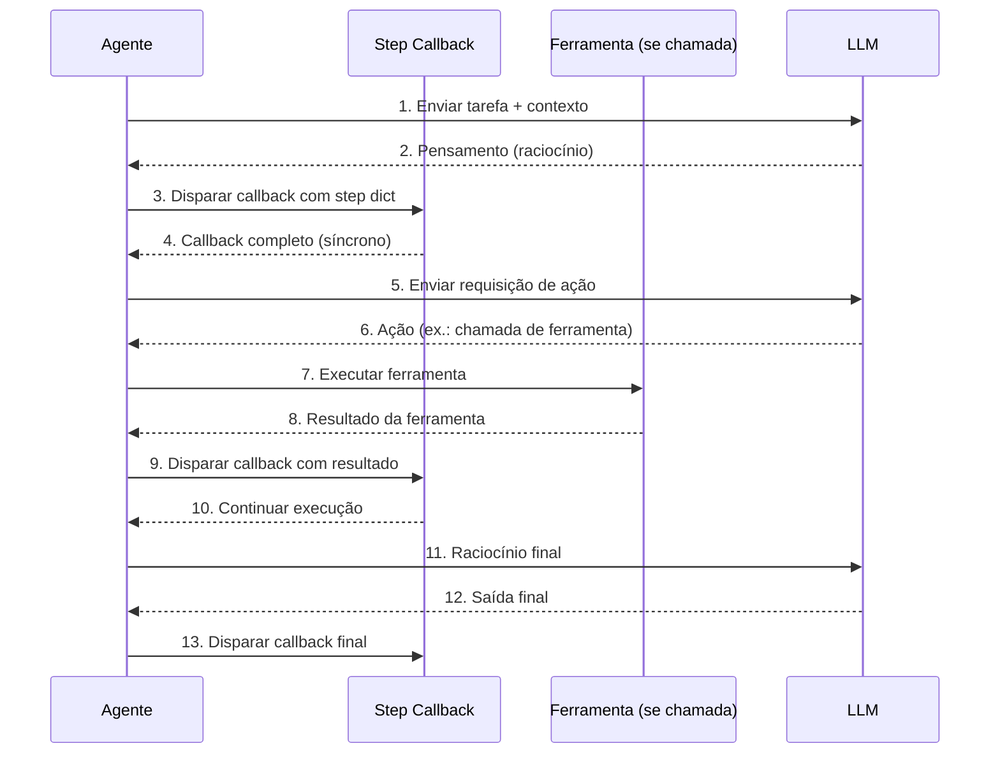
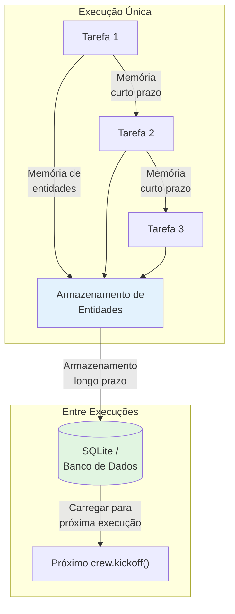

# Padrões Avançados: Callbacks, Memória, Config LLM e Testes

Esta lição cobre padrões prontos para produção: monitoramento com callbacks, memória persistente, controle refinado de LLM e estratégias de teste para crews CrewAI. Esses padrões transformam um sistema multi-agente protótipo em uma aplicação de produção confiável, observável e sustentável.

---

## Step Callbacks

Step callbacks são disparados após cada etapa do agente (pensamento, ação ou observação). Use-os para logging, monitoramento ou streaming:

```python
from crewai import Agent, Task, Crew, Process

def step_callback(step):
    """Chamado após cada etapa de raciocínio do agente."""
    print(f"[ETAPA] Agente: {step.get('agent', 'desconhecido')}")
    print(f"[ETAPA] Ação: {step.get('action', 'nenhuma')}")
    print(f"[ETAPA] Saída até agora: {step.get('output', '')[:100]}...")
    print("-" * 40)

agente = Agent(
    role="Analista de Pesquisa",
    goal="Coletar inteligência de mercado",
    backstory="Você é um especialista em pesquisa de mercado.",
    step_callback=step_callback,  # anexar callback
)

tarefa = Task(
    description="Pesquise as últimas tendências de IA.",
    expected_output="Lista de tendências.",
    agent=agente,
)

crew = Crew(
    agents=[agente],
    tasks=[tarefa],
    verbose=True,
)

resultado = crew.kickoff()
```

O dicionário `step` contém informações valiosas de depuração:

| Chave | Tipo de Valor | Descrição |
| :--- | :--- | :--- |
| `agent` | `str` | Nome/papel do agente |
| `action` | `str` | Ação atual (pensamento, chamada de ferramenta, observação) |
| `output` | `str` | Saída parcial acumulada até agora |
| `tool_input` | `dict` | Entradas passadas para uma ferramenta (se aplicável) |
| `tool_output` | `str` | Saída retornada por uma ferramenta (se aplicável) |

---

## Fluxo da Cadeia de Callbacks



---

## Callbacks Personalizados com Handlers Baseados em Classe

Para monitoramento complexo, crie uma classe de callback:

```python
from crewai import Agent, Task, Crew

class CallbackLogging:
    """Rastreia cada etapa do agente para auditoria."""

    def __init__(self):
        self.steps = []

    def on_step(self, step):
        self.steps.append(step)
        nome_agente = step.get("agent", "?")
        acao = step.get("action", "?")
        print(f"[{nome_agente}] → {acao}")

    def summary(self):
        print(f"Total de etapas: {len(self.steps)}")
        for s in self.steps:
            print(f"  - {s.get('agent')}: {s.get('action')}")

callback = CallbackLogging()

agente = Agent(
    role="Redator",
    goal="Escrever um post de blog",
    backstory="Você é um blogueiro profissional.",
    step_callback=callback.on_step,
)

crew = Crew(agents=[agente], tasks=[Task(
    description="Escreva um post curto sobre IA.",
    expected_output="Um post de 200 palavras.",
    agent=agente,
)])
crew.kickoff()

callback.summary()
```

```python
# Avançado: callback com rastreamento de métricas
class CallbackMetricas:
    def __init__(self):
        self.steps = []
        self.chamadas_ferramenta = 0
        self.total_tokens = 0

    def on_step(self, step):
        self.steps.append(step)
        if step.get("action") == "tool_call":
            self.chamadas_ferramenta += 1

    def on_task_complete(self, task_output):
        if task_output.usage:
            self.total_tokens += task_output.usage.total_tokens

    def relatorio(self):
        print(f"Etapas: {len(self.steps)}")
        print(f"Chamadas de ferramenta: {self.chamadas_ferramenta}")
        print(f"Total de tokens: {self.total_tokens}")
```

[!WARNING]
Callbacks executam de forma síncrona durante o raciocínio do agente. Evite operações lentas (como chamadas de rede para APIs externas) dentro de callbacks, pois elas bloquearão o loop de execução do agente. Se precisar de logging assíncrono, armazene eventos em buffer e descarregue-os assincronamente.

---

## Tipos de Memória do Agente

O CrewAI suporta vários backends de memória:

```python
from crewai import Agent, Task, Crew, Process

# Agente com memória de curto prazo (em processo)
agente_memoria = Agent(
    role="Agente de Suporte",
    goal="Resolver problemas de clientes em múltiplas interações",
    backstory="Você é um agente de suporte paciente.",
    memory=True,
)

# Configuração de memória no nível da crew
from crewai.memory import ShortTermMemory, LongTermMemory

crew = Crew(
    agents=[agente_memoria],
    tasks=[...],
    memory=True,
)
```

| Tipo de Memória | Escopo | Persistência | Caso de Uso |
| :--- | :--- | :--- | :--- |
| Curto prazo (em processo) | Única execução | Perdida após `kickoff()` | Conversas multi-turno em uma execução |
| Longo prazo (SQLite / personalizado) | Entre execuções | Persiste em disco ou banco | Preferências do usuário, histórico entre sessões |
| Memória de entidades | Extrai e rastreia entidades | Entre tarefas em uma execução | Grafos de conhecimento, rastreamento de relacionamentos |

[!IMPORTANT]
Memória de curto prazo é ativada com `memory=True` no agente. Memória de longo prazo e de entidades exigem `memory_config` no nível da crew. A memória de longo prazo é especialmente valiosa para aplicações onde os agentes precisam lembrar preferências do usuário entre interações separadas.

---

## Fluxo de Memória na Crew



---

## Configurando LLM por Agente

Você pode passar uma instância LLM personalizada para cada agente:

```python
from langchain_openai import ChatOpenAI
from crewai import Agent

# LLM personalizado com modelo e temperatura específicos
llm_rapido = ChatOpenAI(
    model="gpt-4o-mini",
    temperature=0.1,
)

llm_criativo = ChatOpenAI(
    model="gpt-4o",
    temperature=0.9,
)

analista = Agent(
    role="Analista de Dados",
    goal="Produzir análise numérica precisa",
    backstory="Você é um analista de dados meticuloso.",
    llm=llm_rapido,
    temperature=0.1,
)

redator = Agent(
    role="Redator Criativo",
    goal="Escrever textos de marketing envolventes",
    backstory="Você é um copywriter com estilo.",
    llm=llm_criativo,
    temperature=0.8,
)
```

```python
# Múltiplos agentes com diferentes LLMs para otimização de custos
llm_barato = ChatOpenAI(model="gpt-4o-mini", temperature=0.0)
llm_equilibrado = ChatOpenAI(model="gpt-4o", temperature=0.3)
llm_caro = ChatOpenAI(model="gpt-4o", temperature=0.7)

pesquisador = Agent(
    role="Pesquisador",
    goal="Encontrar informações",
    backstory="Você encontra fatos.",
    llm=llm_barato,
)

analista = Agent(
    role="Analista",
    goal="Analisar resultados",
    backstory="Você analisa dados.",
    llm=llm_equilibrado,
)

estrategista = Agent(
    role="Estrategista",
    goal="Desenvolver estratégia de negócios",
    backstory="Você cria estratégias.",
    llm=llm_caro,
)
```

[!IMPORTANT]
Cada agente pode ter uma configuração de LLM completamente independente. Isso permite usar modelos baratos para tarefas simples (pesquisa, entrada de dados) e modelos caros para raciocínio complexo (análise, estratégia). Esta abordagem em camadas pode reduzir custos em 60-80% comparado a usar um modelo caro para todos os agentes.

---

## Configurações de Temperatura — Quando Usar

| Temperatura | Caso de Uso | Exemplo |
| :--- | :--- | :--- |
| 0.0 – 0.2 | Tarefas factuais e determinísticas | Extração de dados, classificação |
| 0.3 – 0.5 | Raciocínio equilibrado | Sumarização, análise |
| 0.6 – 0.8 | Geração criativa | Marketing, narrativas |
| 0.9 – 1.0 | Altamente criativo / brainstorming | Geração de ideias, poesia |

```python
# Referência rápida: temperatura por tipo de agente
guia_temperatura = {
    "Agente de Extração de Dados": 0.0,
    "Agente de Classificação": 0.1,
    "Agente de Sumarização": 0.3,
    "Agente de Análise": 0.4,
    "Redator de Conteúdo": 0.7,
    "Agente Criativo": 0.9,
    "Agente de Brainstorming": 1.0,
}
```

---

## LLMs para Chamada de Funções

Alguns agentes se beneficiam de um LLM separado para chamadas de ferramentas:

```python
from langchain_openai import ChatOpenAI

llm_raciocinio = ChatOpenAI(model="gpt-4o", temperature=0.2)
llm_chamada_funcao = ChatOpenAI(model="gpt-4o-mini", temperature=0.0)

agente = Agent(
    role="Especialista em Automação",
    goal="Executar chamadas de API com precisão",
    backstory="Você automatiza fluxos de trabalho de negócios.",
    llm=llm_raciocinio,
    function_calling_llm=llm_chamada_funcao,
)
```

Usar um modelo menor e mais barato para chamadas de ferramentas reduz custos enquanto mantém a qualidade do raciocínio. O `function_calling_llm` lida com a entrada/saída estruturada das chamadas de ferramenta, enquanto o `llm` principal lida com o raciocínio complexo.

[!TIP]
Use `function_calling_llm` quando seu agente usar muitas ferramentas. Chamadas de ferramenta exigem saída estruturada (JSON), que modelos menores manipulam bem. Reserve o modelo caro para raciocinar sobre quando e por que usar ferramentas, não a mecânica de usá-las.

---

## Testando Fluxos de Crew

Teste a lógica da sua crew com testes unitários isolados:

```python
import pytest
from crewai import Agent, Task, Crew

@pytest.fixture
def agente_pesquisa():
    return Agent(
        role="Pesquisador de Teste",
        goal="Retornar dados de teste",
        backstory="Você é um agente de teste.",
    )

def test_crew_kickoff_retorna_string(agente_pesquisa):
    tarefa = Task(
        description="Retorne a palavra 'olá'.",
        expected_output="A palavra olá.",
        agent=agente_pesquisa,
    )
    crew = Crew(
        agents=[agente_pesquisa],
        tasks=[tarefa],
    )
    resultado = crew.kickoff()
    assert resultado is not None
    assert isinstance(str(resultado), str)

def test_agente_com_ferramentas():
    from crewai.tools import BaseTool

    class FerramentaEcho(BaseTool):
        name: str = "Echo"
        description: str = "Retorna a entrada inalterada."

        def _run(self, texto: str) -> str:
            return texto

    agente = Agent(
        role="Agente Echo",
        goal="Ecoar entrada de volta",
        backstory="Você ecoa tudo que recebe.",
        tools=[FerramentaEcho()],
    )
    assert len(agente.tools) == 1
    assert agente.tools[0].name == "Echo"
```

```python
# Teste avançado: mock LLM para testes determinísticos
from unittest.mock import patch

def test_crew_com_llm_mockado():
    """Testa a lógica da crew sem fazer chamadas LLM reais."""

    agente = Agent(
        role="Agente de Teste",
        goal="Retornar dados de teste",
        backstory="Agente de teste.",
    )

    tarefa = Task(
        description="Retorne um objeto JSON com a chave 'status' definida como 'ok'.",
        expected_output='{"status": "ok"}',
        agent=agente,
    )

    crew = Crew(
        agents=[agente],
        tasks=[tarefa],
    )

    resultado = crew.kickoff()
    assert resultado is not None
```

[!WARNING]
Testar crews com chamadas LLM reais é lento, caro e não-determinístico. Use respostas LLM simuladas para testes unitários e reserve chamadas LLM reais para testes de integração. Sempre valide que a estrutura da saída corresponde às expectativas, não o conteúdo específico.

---

## Estratégia de Testes

| Tipo de Teste | O que Testar | LLM Necessário? | Frequência |
| :--- | :--- | :--- | :--- |
| Unitário | Config do agente, anexação de ferramentas, params de tarefa | Não | A cada commit |
| Integração | Fluxo de execução da crew, passagem de contexto | Sim | Por funcionalidade |
| Regressão | Bugs corrigidos anteriormente | Sim | Antes do release |
| Performance | Uso de tokens, tempo de execução | Sim | Periódico |
| E2E | Pipeline completo com ferramentas reais | Sim | Pré-implantação |

---

## Callback vs Memória vs Config LLM — Comparação

| Recurso | Propósito | Configuração | Escopo |
| :--- | :--- | :--- | :--- |
| **Step callbacks** | Monitoramento e logging | `step_callback` no agente | Por agente |
| **Memória curto prazo** | Retenção de contexto na execução | `memory=True` no agente | Por execução |
| **Memória longo prazo** | Persistência entre execuções | `memory_config` na crew | Entre execuções |
| **LLM personalizado** | Controle de modelo/temperatura | Parâmetro `llm` no agente | Por agente |
| **LLM chamada função** | Modelo separado para ferramentas | `function_calling_llm` no agente | Por agente |
| **Testes** | Validação de corretude | `pytest` / unittest | Desenvolvimento |

---

## Perguntas Interativas

```question
{
  "id": "ca-05-q1",
  "type": "multiple-choice",
  "question": "Sua crew de produção executa lentamente. Você descobre que o step callback está fazendo uma requisição HTTP a um serviço de logging a cada etapa. Qual mudança você deve fazer?",
  "options": [
    "Remover o callback completamente",
    "Armazenar eventos de log em buffer na memória e descarregar periodicamente em vez de chamadas HTTP síncronas",
    "Aumentar o nível verbose",
    "Mudar para processo hierárquico"
  ],
  "correct": 1,
  "explanation": "Callbacks são síncronos — eles bloqueiam a execução do agente. Chamadas de rede em callbacks diminuem drasticamente a crew. Armazene eventos em buffer e descarregue de forma assíncrona, ou registre em armazenamento local."
}
```

```question
{
  "id": "ca-05-q2",
  "type": "multiple-choice",
  "question": "Você tem uma crew de suporte ao cliente. O Usuário A interage na sessão 1, depois o Usuário B na sessão 2. O agente do Usuário B lembra da conversa do Usuário A. Por quê?",
  "options": [
    "A memória de curto prazo persiste entre sessões",
    "A memória de longo prazo está ativada e não tem escopo por usuário",
    "O callback está armazenando conversas em cache",
    "O modo verbose está causando interferência"
  ],
  "correct": 1,
  "explanation": "A memória de longo prazo persiste entre chamadas crew.kickoff(). Se não tiver escopo por usuário, dados de uma sessão de usuário vazam para outra. Use chaves de memória específicas por usuário ou limpe a memória de longo prazo entre sessões."
}
```

```question
{
  "id": "ca-05-q3",
  "type": "multiple-choice",
  "question": "Você tem 3 agentes: um pesquisador (consulta simples), um analista (raciocínio moderado) e um estrategista (raciocínio complexo). Como configurar seus LLMs para minimizar custos?",
  "options": [
    "Usar o mesmo modelo caro para todos os três",
    "Usar gpt-4o-mini para pesquisador, gpt-4o para analista e estrategista",
    "Usar gpt-4o-mini para pesquisador e analista, gpt-4o para estrategista",
    "Usar um único modelo e ajustar apenas a temperatura"
  ],
  "correct": 2,
  "explanation": "Corresponda a capacidade do modelo à complexidade da tarefa. Pesquisador (simples) → gpt-4o-mini, Analista (moderado) → gpt-4o-mini ou gpt-4o, Estrategista (complexo) → gpt-4o. Esta abordagem em camadas economiza custos."
}
```

```question
{
  "id": "ca-05-q4",
  "type": "multiple-choice",
  "question": "Seu agente usa 8 ferramentas diferentes. Chamadas de ferramenta frequentemente falham devido a saída JSON malformada do LLM. Qual otimização ajuda?",
  "options": [
    "Definir temperatura para 0.9 para mais variedade",
    "Usar um function_calling_llm separado (um modelo menor com temperature=0.0)",
    "Remover metade das ferramentas",
    "Ativar modo verbose"
  ],
  "correct": 1,
  "explanation": "Um function_calling_llm dedicado com temperatura baixa (0.0) produz saída estruturada mais confiável para chamadas de ferramenta. Use gpt-4o-mini para chamadas de ferramenta e mantenha o modelo principal para raciocínio."
}
```

```question
{
  "id": "ca-05-q5",
  "type": "multiple-choice",
  "question": "Você executa test_crew_kickoff_retorna_string 5 vezes com chamadas LLM reais. Passa 3 vezes e falha 2 vezes com saídas diferentes. Qual é o problema?",
  "options": [
    "O agente tem um bug",
    "Saídas LLM são não-determinísticas — use LLM simulado para testes unitários",
    "A descrição da tarefa está errada",
    "O modo verbose deve ser desabilitado em testes"
  ],
  "correct": 1,
  "explanation": "Chamadas LLM reais produzem saídas diferentes a cada execução (especialmente com temperatura > 0). Para testes unitários determinísticos, simule o LLM ou use temperature=0.0. Reserve chamadas LLM reais para testes de integração."
}
```

---

## 5 Perguntas de Prática

**1. Qual é a assinatura de uma função step callback?**

- A) `callback(agent, task)`
- B) `callback(step)` onde step é um dicionário ✅
- C) `callback(output)`
- D) `callback()`

**2. Qual tipo de memória persiste entre múltiplas chamadas `crew.kickoff()`?**

- A) Memória de curto prazo
- B) Memória de longo prazo ✅
- C) Memória de entidades
- D) Memória em processo

**3. Qual efeito `temperature=0.1` tem no LLM de um agente?**

- A) Torna a saída mais criativa
- B) Torna a saída mais determinística e factual ✅
- C) Aumenta a velocidade de resposta
- D) Desativa chamadas de ferramentas

**4. Por que definir `function_calling_llm` separadamente de `llm`?**

- A) Para reduzir custos usando um modelo menor para chamadas de ferramentas ✅
- B) Para ativar cache
- C) Para aumentar a verbosidade
- D) Para desativar delegação

**5. Qual ferramenta você usaria para verificar se uma crew retorna uma string válida?**

- A) `pytest` com `assert isinstance(str(resultado), str)` ✅
- B) `crew.validate()`
- C) `task.inspect()`
- D) `agent.test()`

---

[!SUCCESS]
### Principais Conclusões
- Step callbacks permitem monitoramento em tempo real do raciocínio do agente.
- Classes de callback personalizadas podem agregar etapas para auditoria e depuração.
- Memória de curto prazo é perdida após uma execução; memória de longo prazo persiste.
- Cada agente pode ter seu próprio LLM com temperatura e modelo independentes.
- Um `function_calling_llm` separado reduz custos para agentes que usam muitas ferramentas.
- Temperatura de 0.0 (determinística) a 1.0 (criativa) controla a variabilidade da saída.
- Testar crews com pytest garante corretude antes da implantação em produção.
- Callbacks são síncronos — evite operações bloqueantes dentro deles.
- Corresponda o tamanho do modelo LLM à complexidade da tarefa para otimização de custos.
- Simule respostas LLM em testes unitários; use LLMs reais apenas em testes de integração.
