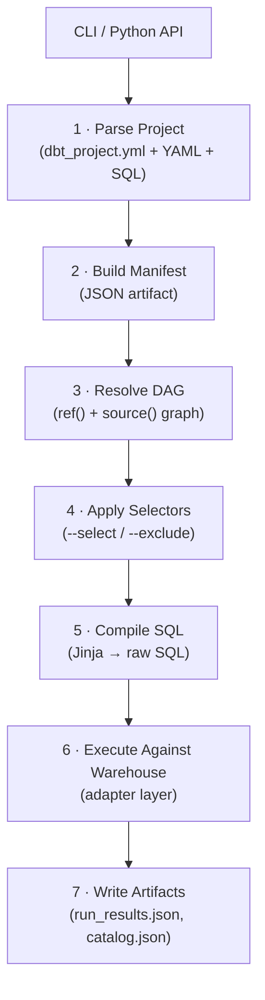
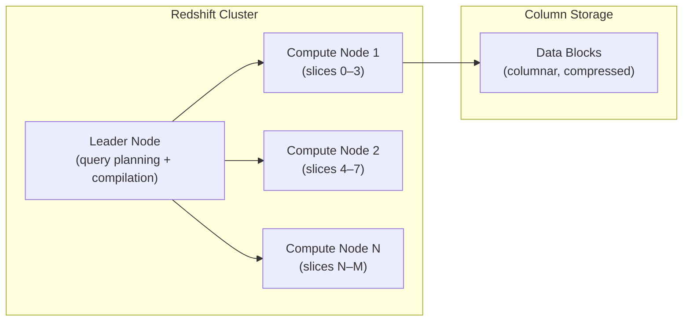

# dbt-core Architecture and the dbt-redshift Adapter

Before tuning models, writing advanced macros, or orchestrating pipelines, you need a clear mental model of what happens when you run `dbt run`. This module maps dbt-core's internal execution pipeline onto Amazon Redshift's architecture so every choice you make later has a reason behind it.

---

## How dbt-core Executes a Run

dbt-core follows a deterministic pipeline every time you invoke a command:



The **adapter layer** (step 6) is what isolates your SQL transformations from warehouse-specific DDL. `dbt-redshift` implements this layer for Amazon Redshift.

[!NOTE]
As of **dbt-core v2.0** (June 2026), the parse and compile steps run on a Rust-based engine shared with dbt Fusion. Parse times on large projects dropped by up to **30×** compared to dbt-core v1.x. Even if you are on v1.10 or v1.11, you benefit from partial improvements introduced via back-ports.

---

## The Adapter Protocol

Every adapter implements a set of interfaces defined in `dbt-adapters`:

| Interface | What it does | Redshift implementation |
| :--- | :--- | :--- |
| `SQLAdapter` | Execute raw SQL, fetch results | `redshift-connector` (ADBC in Fusion) |
| `Relation` | Represent tables, views, mat. views | Adds `late_binding`, `backup` flags |
| `Column` | Map warehouse types to dbt types | Redshift-specific type mapping |
| `Credentials` | Authenticate and connect | IAM, password, IAM Identity Center |
| `ConnectionManager` | Pool and reuse connections | `keepalives_idle`, SSL options |

[!IMPORTANT]
In September 2025, the `dbt-redshift` repository was **archived and merged** into [`dbt-labs/dbt-adapters`](https://github.com/dbt-labs/dbt-adapters). All future issues and PRs go there. The PyPI package `dbt-redshift` continues to be published under the same name — only the source repository changed.

---

## Installing dbt-redshift

```bash
# Latest stable (tracks dbt-core 1.10.x)
pip install dbt-redshift==1.10.1

# For dbt-core 1.11 (release candidate as of June 2026)
pip install dbt-redshift==1.11.0rc3

# Pin to a specific dbt-core version for reproducibility
pip install "dbt-core==1.10.4" "dbt-redshift==1.10.1"
```

Always pin both `dbt-core` and `dbt-redshift` to the **same minor version** in `requirements.txt`. Mismatched minor versions frequently cause subtle runtime failures.

---

## profiles.yml — Connection Methods

dbt-redshift supports four authentication methods. Choose the one that fits your security posture.

### Method 1: Username + Password (simplest, not recommended for production)

```yaml
# ~/.dbt/profiles.yml
my_redshift:
  target: dev
  outputs:
    dev:
      type: redshift
      host: my-cluster.abc123.us-east-1.redshift.amazonaws.com
      port: 5439
      user: analytics_user
      password: "{{ env_var('DBT_REDSHIFT_PASSWORD') }}"
      dbname: analytics
      schema: dbt_dev
      threads: 4
      keepalives_idle: 240
      connect_timeout: 30
      sslmode: require
```

### Method 2: IAM Role (recommended for EC2, ECS, Lambda)

```yaml
my_redshift:
  target: prod
  outputs:
    prod:
      type: redshift
      method: iam
      host: my-cluster.abc123.us-east-1.redshift.amazonaws.com
      port: 5439
      user: analytics_user
      dbname: analytics
      schema: dbt_prod
      cluster_id: my-cluster          # required for IAM
      region: us-east-1
      iam_profile: dbt-prod-profile   # optional: named AWS profile
      threads: 8
      keepalives_idle: 240
```

### Method 3: IAM Identity Center (Browser SSO, added in dbt-redshift 1.9.x)

```yaml
my_redshift:
  target: dev
  outputs:
    dev:
      type: redshift
      method: browser_identity_center
      host: my-cluster.abc123.us-east-1.redshift.amazonaws.com
      port: 5439
      dbname: analytics
      schema: dbt_dev
      iam_idp_arn: arn:aws:iam::123456789012:saml-provider/MyIdP
      iam_role_arn: arn:aws:iam::123456789012:role/RedshiftAnalyticsRole
      threads: 4
      region: us-east-1
```

### Method 4: Redshift Serverless

```yaml
my_redshift:
  target: serverless
  outputs:
    serverless:
      type: redshift
      method: iam                      # IAM Role auth
      host: my-workgroup.abc123.us-east-1.redshift-serverless.amazonaws.com
      port: 5439
      dbname: analytics
      schema: dbt_prod
      iam_role_arn: arn:aws:iam::123456789012:role/RedshiftServerlessRole
      threads: 16                      # Serverless scales dynamically
      region: us-east-1
```

[!TIP]
Redshift Serverless has no `cluster_id`. Remove that field and use `iam_role_arn` instead. The IAM Role specified must have `redshift-serverless:GetCredentials` permissions.

---

## dbt_project.yml — Project Baseline

```yaml
# dbt_project.yml
name: 'my_analytics'
version: '1.0.0'
config-version: 2

profile: 'my_redshift'

model-paths: ["models"]
analysis-paths: ["analyses"]
test-paths: ["tests"]
seed-paths: ["seeds"]
macro-paths: ["macros"]
snapshot-paths: ["snapshots"]
docs-paths: ["docs"]

target-path: "target"
clean-targets: ["target", "dbt_packages"]

# Redshift-specific defaults for all models
models:
  my_analytics:
    # Staging layer: views (fast to rebuild, no storage cost)
    staging:
      +materialized: view
      +bind: false              # late-binding views for all staging
      +schema: staging

    # Intermediate layer: ephemeral or views
    intermediate:
      +materialized: ephemeral

    # Marts layer: tables with Redshift performance configs
    marts:
      +materialized: table
      +dist: even               # default dist style for mart tables
      +sort_type: auto          # auto-sort for simplicity
      +schema: marts
      +contract:
        enforced: true          # enforce model contracts in marts

# Behavior flags (dbt-core 1.9+)
flags:
  require_batched_execution_for_custom_microbatch_strategy: false
  source_freshness_run_project_hooks: false
```

---

## Cross-Database Support with Datasharing (dbt-redshift 1.11+)

Starting with `dbt-redshift v1.11.0rc1`, you can enable Redshift Datasharing to materialize models into a different database or cluster:

```yaml
# profiles.yml
my_redshift:
  target: prod
  outputs:
    prod:
      type: redshift
      method: iam
      host: my-cluster.abc123.us-east-1.redshift.amazonaws.com
      port: 5439
      dbname: primary_db
      schema: dbt_prod
      datasharing: true          # ← enables cross-database support
      threads: 8
      region: us-east-1
```

With `datasharing: true`, dbt-redshift switches metadata queries from `pg_*` / `information_schema` views to Redshift's native `SHOW` system commands, which return cross-database and cross-cluster objects.

```sql
-- model: models/marts/fct_orders.sql
{{ config(
    materialized='table',
    database='consumer_db',   -- materialize into a different database
    schema='shared_marts'
) }}

select
    o.order_id,
    o.customer_id,
    o.total_amount
from {{ ref('stg_orders') }} o
```

[!WARNING]
Cross-database writes require **SNAPSHOT transaction isolation level**. For views that reference tables in another database, always use late-binding views (`bind: false`). Regular views referencing cross-database objects will fail.

---

## Understanding Redshift Architecture — What dbt Cares About

Amazon Redshift is a **Massively Parallel Processing (MPP)** columnar data warehouse. Every design decision in your dbt project should account for how Redshift physically stores and queries data.



Key properties relevant to dbt:

| Property | What it controls | dbt config |
| :--- | :--- | :--- |
| **Distribution style** | How rows are spread across slices | `dist:` |
| **Sort key** | Physical ordering of rows on disk | `sort:` / `sort_type:` |
| **Compression encoding** | Column-level compression algorithm | `encode:` (via raw DDL) |
| **Backup** | Whether table is included in snapshots | `backup: true/false` |
| **Bind** | Late-binding view | `bind: false` |

These properties are passed directly through dbt's Redshift config block and compiled into the DDL that dbt executes against your cluster.

---

## Verifying Your Setup

```bash
# Test the connection
dbt debug --profiles-dir . --profile my_redshift

# Compile without executing (safe check)
dbt compile --select staging

# Run a single model
dbt run --select stg_orders

# Check dbt-redshift version
python -c "import dbt.adapters.redshift; print(dbt.adapters.redshift.__version__)"
```

Expected `dbt debug` output:

```
Running with dbt=1.10.4
dbt-redshift: 1.10.1

Connection:
  host: my-cluster.abc123.us-east-1.redshift.amazonaws.com
  database: analytics
  schema: dbt_dev
  user: analytics_user

Required fields are all present and valid.
Connection test: OK connection ok
```

---

## 5 Practice Questions

```question
{
  "id": "dbt-rs-01-q1",
  "type": "multiple-choice",
  "question": "In dbt-core's execution pipeline, at which step does Jinja templating get resolved into raw SQL?",
  "options": [
    "Parse Project",
    "Build Manifest",
    "Compile SQL",
    "Execute Against Warehouse"
  ],
  "correct": 2,
  "explanation": "Jinja is resolved in step 5 — Compile SQL — which converts model files (with {{ ref() }}, {{ config() }}, loops, etc.) into warehouse-native SQL before execution."
}
```

```question
{
  "id": "dbt-rs-01-q2",
  "type": "multiple-choice",
  "question": "Which authentication method is recommended when running dbt-core from AWS ECS Fargate tasks?",
  "options": [
    "Username and password in profiles.yml",
    "IAM Role (method: iam)",
    "Browser Identity Center",
    "No authentication — ECS is trusted by default"
  ],
  "correct": 1,
  "explanation": "IAM Role authentication (method: iam) is the recommended approach for compute services like ECS Fargate. The task role is assumed automatically — no static credentials are needed."
}
```

```question
{
  "id": "dbt-rs-01-q3",
  "type": "multiple-choice",
  "question": "What does setting `datasharing: true` in profiles.yml change about how dbt-redshift queries metadata?",
  "options": [
    "It enables dbt to write to S3 directly",
    "It switches metadata queries from pg_* tables to Redshift SHOW system commands",
    "It disables schema validation for performance",
    "It automatically replicates data to a secondary cluster"
  ],
  "correct": 1,
  "explanation": "With datasharing: true, dbt-redshift uses native SHOW system commands instead of pg_* / information_schema catalog tables, which only surface objects in the currently connected database."
}
```

```question
{
  "id": "dbt-rs-01-q4",
  "type": "multiple-choice",
  "question": "The dbt-redshift source repository was archived in September 2025. Where should you now file bug reports?",
  "options": [
    "github.com/dbt-labs/dbt-redshift (still active)",
    "github.com/dbt-labs/dbt-adapters",
    "github.com/dbt-labs/dbt-core",
    "aws.amazon.com/redshift/issues"
  ],
  "correct": 1,
  "explanation": "The dbt-redshift repository was merged into dbt-labs/dbt-adapters in September 2025. All new issues, PRs, and contributions go there."
}
```

```question
{
  "id": "dbt-rs-01-q5",
  "type": "multiple-choice",
  "question": "What is the key difference between Redshift Serverless and a provisioned cluster when configuring profiles.yml?",
  "options": [
    "Serverless uses port 5432 instead of 5439",
    "Serverless requires a cluster_id field",
    "Serverless does not have a cluster_id; use iam_role_arn and the serverless endpoint host instead",
    "Serverless does not support IAM authentication"
  ],
  "correct": 2,
  "explanation": "Redshift Serverless endpoints have no cluster_id. Authentication uses iam_role_arn with the GetCredentials permission, and the host points to the workgroup endpoint."
}
```

```question
{
  "id": "dbt-rs-01-q6",
  "type": "multiple-choice",
  "question": "Why should you always pin dbt-core and dbt-redshift to the same minor version?",
  "options": [
    "AWS requires version alignment for billing purposes",
    "Mismatched minor versions frequently cause subtle runtime failures due to interface changes",
    "dbt-core only works with one specific version of dbt-redshift",
    "It reduces network latency when connecting to Redshift"
  ],
  "correct": 1,
  "explanation": "The adapter protocol between dbt-core and adapters evolves with each minor version. Mismatches cause subtle failures because the adapter may call internal dbt-core interfaces that have changed."
}
```

---

[!SUCCESS]
### Key Takeaways

- dbt-core follows a 7-step pipeline: parse → manifest → DAG → select → compile → execute → artifacts. The adapter layer isolates your SQL from warehouse DDL.
- The `dbt-redshift` package moved into `dbt-labs/dbt-adapters` in September 2025. PyPI name stays the same.
- Four authentication methods are supported: password, IAM Role, IAM Identity Center (browser SSO), and Redshift Serverless via `iam_role_arn`.
- Set `datasharing: true` in profiles.yml (dbt-redshift 1.11+) to enable cross-database and cross-cluster model materialization.
- Redshift's MPP architecture means every config decision — dist style, sort key, bind, backup — has a direct performance impact.
- Always pin `dbt-core` and `dbt-redshift` to the same minor version in your dependency file.