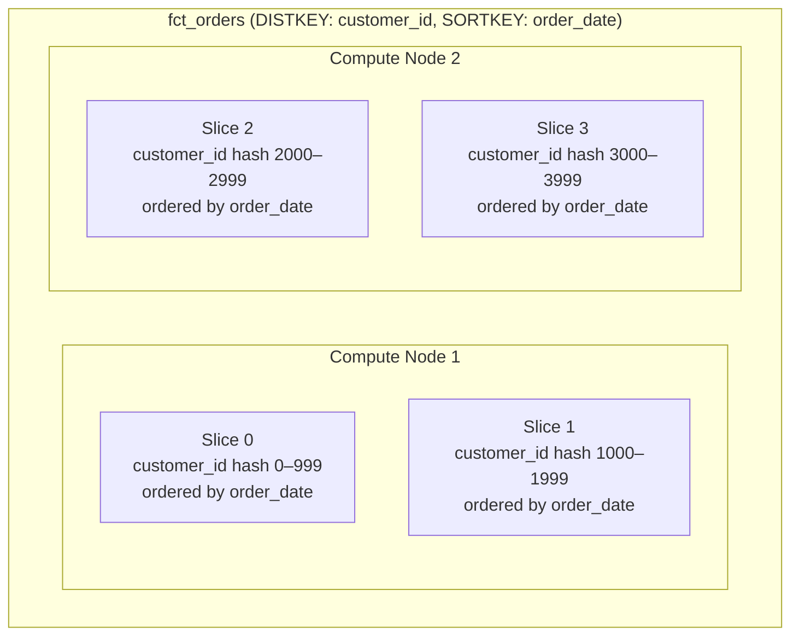
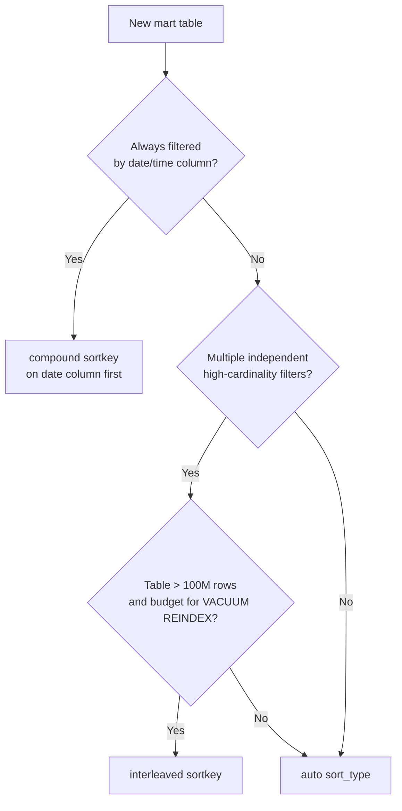

# Redshift Performance Patterns: Sort Keys, Dist Styles, and Compression

Every SQL query you run on Redshift either benefits from or is penalized by the physical storage decisions made when tables were created. dbt gives you full control over those decisions through model-level configuration. This module teaches you to make them intentionally.

---

## How Redshift Stores Data

Redshift stores table data in **column blocks** distributed across **slices** on compute nodes. Two properties govern physical placement:

- **Distribution style** — which slice each row goes to (affects data movement during joins)
- **Sort key** — the physical ordering of rows on disk (affects range-restricted scans)



---

## Distribution Styles

Distribution style controls where Redshift places rows across slices. Choosing the wrong style causes **data redistribution at query time**, which is the most common Redshift performance killer.

| Style | dbt config | Behavior | Best for |
| :--- | :--- | :--- | :--- |
| `AUTO` | `dist: auto` | Redshift decides (small → ALL, large → KEY or EVEN) | Default; let Advisor tune it |
| `EVEN` | `dist: even` | Round-robin across all slices | Large fact tables with no clear join key |
| `KEY` | `dist: <column>` | Rows with same key go to same slice | Join-heavy tables; co-locates joined rows |
| `ALL` | `dist: all` | Full copy on every node | Small, frequently-joined dimension tables |

### Configuring Distribution in dbt

```sql
-- models/marts/fct_orders.sql
{{ config(
    materialized='table',
    dist='customer_id',          -- KEY dist on customer_id
    sort=['order_date', 'status'],
    sort_type='compound'
) }}

select
    order_id,
    customer_id,
    order_date,
    status,
    total_amount
from {{ ref('stg_orders') }}
```

```yaml
# models/marts/schema.yml — YAML-level config (applies to all files in directory)
models:
  - name: dim_customers
    config:
      materialized: table
      dist: all          # small dimension → copy everywhere
      sort: customer_id
      sort_type: compound
```

[!TIP]
When `fct_orders` and `dim_customers` are both queried together, set `fct_orders.dist = customer_id` and `dim_customers.dist = all`. Redshift can then join them without redistributing any rows — a **co-located join**.

---

## Sort Keys

Sort keys define the physical order of rows on disk. Redshift uses **zone maps** (min/max metadata per disk block) to skip blocks that cannot contain rows matching your `WHERE` clause. A well-chosen sort key can reduce scanned blocks by 90%+.

### Compound Sort Key

Rows are sorted primarily by the first key column, then by the second, etc. — like a composite index.

```sql
{{ config(
    materialized='table',
    sort=['order_date', 'customer_id', 'status'],
    sort_type='compound'         -- default when sort_type is omitted
) }}
```

Use compound when:
- Queries filter on the **leading column(s)** frequently
- You have a clear time-series dimension (`event_date`, `created_at`)
- The leading column has high cardinality relative to query predicates

### Interleaved Sort Key

Each column gets equal weight in the sort. More flexible but incurs higher maintenance cost (`VACUUM REINDEX`).

```sql
{{ config(
    materialized='table',
    sort=['region', 'product_category', 'customer_segment'],
    sort_type='interleaved'
) }}
```

[!WARNING]
Interleaved sort keys require a full `VACUUM REINDEX` to maintain effectiveness. On large tables this can take hours. AWS strongly recommends compound sort keys or `AUTO` for most workloads. Avoid interleaved unless you have multiple independent high-cardinality filter columns with no clear priority.

### Auto Sort Key

Redshift Advisor automatically chooses and adjusts the sort key based on query patterns.

```sql
{{ config(
    materialized='table',
    sort_type='auto'
) }}
```

Set `+sort_type: auto` in `dbt_project.yml` as a project-wide default and only override for tables where you have a strong, stable filter pattern (e.g., a time-series fact table always filtered by `event_date`).

### Sort Key Decision Flowchart



---

## Configuring Sort Keys at Project Level

```yaml
# dbt_project.yml
models:
  my_analytics:
    marts:
      facts:
        +sort_type: compound
        +sort: event_date        # every fact table defaults to event_date sort
      dimensions:
        +dist: all               # all dimension tables → ALL distribution
        +sort_type: compound
```

Individual models override the project default:

```sql
-- models/marts/facts/fct_page_views.sql
-- Inherits: sort=event_date, sort_type=compound from dbt_project.yml
-- Override dist to KEY for co-location with dim_sessions
{{ config(
    dist='session_id'
) }}

select *
from {{ ref('stg_page_views') }}
```

---

## Column Compression Encodings

Redshift uses column-level compression to reduce storage and improve I/O performance. By default, `COPY` and `CREATE TABLE AS SELECT` apply **automatic compression (AZ64 / LZO)**.

For dbt-created tables, you have two options:

### Option 1: Let Redshift Auto-Analyze (Recommended)

```sql
{{ config(
    materialized='table',
    dist='customer_id',
    sort='order_date'
    -- No encode config: Redshift applies ENCODE AUTO
) }}
```

When you create a table via `CREATE TABLE AS SELECT` (which dbt uses), Redshift applies `ENCODE AUTO` by default in newer cluster versions. Advisor will analyze and apply optimal encodings.

### Option 2: Post-Hook ANALYZE COMPRESSION + ALTER

For tables where you want explicit control, use a post-hook macro:

```sql
-- macros/analyze_and_compress.sql

    analyze compression {{ relation }};

```

```sql
-- models/marts/fct_events.sql
{{ config(
    materialized='table',
    dist='event_id',
    sort=['event_date', 'event_type'],
    sort_type='compound',
    post_hook="{{ analyze_and_compress(this) }}"
) }}

select * from {{ ref('stg_events') }}
```

---

## Table Backup

The `backup` config controls whether a table is included in Redshift automated snapshots. Disable backups for staging or intermediate tables that can be rebuilt:

```sql
{{ config(
    materialized='table',
    backup=false        -- do not include in cluster snapshots
) }}
```

```yaml
# dbt_project.yml — disable backup for all staging tables
models:
  my_analytics:
    staging:
      +backup: false
    intermediate:
      +backup: false
    marts:
      +backup: true     # explicit; this is the default
```

---

## Practical Configuration Reference

Here is a complete configuration example for a production fact table:

```sql
-- models/marts/facts/fct_sales.sql
{{ config(
    materialized='table',

    -- Distribution: KEY on customer_id
    -- (co-locates with dim_customers which uses dist=all)
    dist='customer_id',

    -- Sort: compound on sale_date first (date range queries are primary)
    sort=['sale_date', 'product_id'],
    sort_type='compound',

    -- Include in Redshift snapshots
    backup=true,

    -- Model contract (enforced in prod)
    contract={'enforced': true},

    -- Grants
    grants={'select': ['role_analyst', 'role_reporting']},

    -- Post-hook: vacuum after full-refresh
    post_hook=[
        "{{ vacuumable(this) }}"
    ]
) }}

with sales as (
    select * from {{ ref('stg_sales') }}
),

customers as (
    select * from {{ ref('dim_customers') }}
)

select
    s.sale_id,
    s.customer_id,
    s.product_id,
    s.sale_date,
    s.amount,
    s.quantity,
    c.customer_segment,
    c.region
from sales s
left join customers c using (customer_id)
```

---

## VACUUM and ANALYZE in dbt

Redshift requires periodic `VACUUM` (reclaim deleted rows) and `ANALYZE` (update query planner statistics). dbt lets you automate these with post-hooks or operations.

```sql
-- macros/maintenance.sql

    
        
            vacuum {{ vacuum_type }} {{ relation }};
        
        
        {{ log("VACUUM complete: " ~ relation, info=true) }}
    



    
        
            analyze {{ relation }};
        
        
        {{ log("ANALYZE complete: " ~ relation, info=true) }}
    

```

Run as an operation after a full pipeline execution:

```bash
dbt run-operation vacuum_table --args "{'relation': 'analytics.marts.fct_sales'}"
dbt run-operation analyze_table --args "{'relation': 'analytics.marts.fct_sales'}"
```

[!IMPORTANT]
Redshift Serverless **automatically reclaims storage** and does not require manual `VACUUM`. For provisioned clusters on RA3 nodes, schedule `VACUUM` as a recurring dbt operation or AWS Lambda function triggered after your dbt pipeline completes.

---

## 5 Practice Questions

```question
{
  "id": "dbt-rs-02-q1",
  "type": "multiple-choice",
  "question": "You have a large fact table (fct_orders) and a small dimension table (dim_customers, ~50K rows). Both are joined frequently on customer_id. What distribution configuration minimizes data movement?",
  "options": [
    "fct_orders: dist=even, dim_customers: dist=even",
    "fct_orders: dist=customer_id, dim_customers: dist=all",
    "fct_orders: dist=all, dim_customers: dist=customer_id",
    "Both tables: dist=auto"
  ],
  "correct": 1,
  "explanation": "Setting fct_orders with KEY distribution on customer_id and dim_customers with ALL distribution creates a co-located join — Redshift can join rows without any data redistribution."
}
```

```question
{
  "id": "dbt-rs-02-q2",
  "type": "multiple-choice",
  "question": "A table is always queried with WHERE event_date BETWEEN '2024-01-01' AND '2024-12-31'. Which sort key configuration gives the best performance?",
  "options": [
    "sort_type: interleaved, sort: [event_date, user_id]",
    "sort_type: compound, sort: [event_date]",
    "sort_type: auto",
    "No sort key — Redshift handles this automatically"
  ],
  "correct": 1,
  "explanation": "A compound sort key with event_date as the leading column lets Redshift use zone maps to skip disk blocks outside the date range, reducing I/O dramatically."
}
```

```question
{
  "id": "dbt-rs-02-q3",
  "type": "multiple-choice",
  "question": "What is the main operational downside of interleaved sort keys?",
  "options": [
    "They don't support compound filters",
    "They require a full VACUUM REINDEX to stay effective, which can take hours on large tables",
    "They are not supported on Redshift Serverless",
    "They only work with dist=even"
  ],
  "correct": 1,
  "explanation": "Interleaved sort keys lose effectiveness as rows are inserted and deleted. Restoring performance requires VACUUM REINDEX, which is a resource-intensive, time-consuming operation."
}
```

```question
{
  "id": "dbt-rs-02-q4",
  "type": "multiple-choice",
  "question": "Why might you set `backup: false` on your staging models?",
  "options": [
    "To enable cross-database datasharing",
    "To reduce cluster snapshot storage costs for tables that can be rebuilt from sources",
    "To allow late-binding view behavior",
    "To skip compression analysis"
  ],
  "correct": 1,
  "explanation": "Staging tables are derived from raw sources and can be rebuilt. Excluding them from snapshots reduces snapshot storage costs without any data loss risk."
}
```

```question
{
  "id": "dbt-rs-02-q5",
  "type": "multiple-choice",
  "question": "When does Redshift Serverless require you to run VACUUM manually?",
  "options": [
    "After every dbt run",
    "Never — Redshift Serverless reclaims storage automatically",
    "Only after running COPY commands",
    "Only for tables with interleaved sort keys"
  ],
  "correct": 1,
  "explanation": "Redshift Serverless automatically reclaims storage and does not require manual VACUUM operations. This is one of its key operational advantages over provisioned clusters."
}
```

```question
{
  "id": "dbt-rs-02-q6",
  "type": "multiple-choice",
  "question": "A data engineer sets `+sort_type: auto` as a project-wide default in dbt_project.yml but overrides it to `sort_type: compound, sort: event_date` on a specific fact table. Which config wins?",
  "options": [
    "The project-level default always wins",
    "The model-level config block override wins",
    "They are merged — both sort types are applied",
    "The most recently modified file wins"
  ],
  "correct": 1,
  "explanation": "dbt configuration follows a precedence hierarchy: model-level config blocks override schema.yml, which overrides dbt_project.yml defaults. The most specific definition wins."
}
```

---

[!SUCCESS]
### Key Takeaways

- Distribution style controls data placement across slices. Wrong choices cause expensive runtime redistribution. Use KEY + ALL for common fact–dimension joins.
- Compound sort keys are the most common choice; put your primary filter column first. Reserve interleaved for specific multi-dimensional filter patterns.
- `sort_type: auto` is a safe project-wide default; override only where you have strong, stable query patterns.
- Disable `backup` on staging and intermediate tables to reduce snapshot storage costs.
- Redshift Serverless eliminates the need for manual VACUUM — a key operational advantage.
- Use post-hook macros to automate `VACUUM` and `ANALYZE` on provisioned clusters.
- Model-level config blocks override schema.yml, which overrides dbt_project.yml — most specific wins.