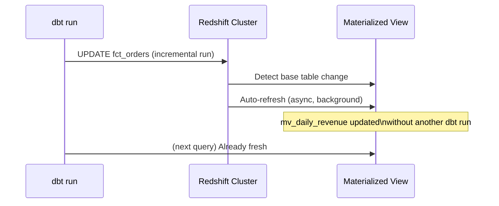
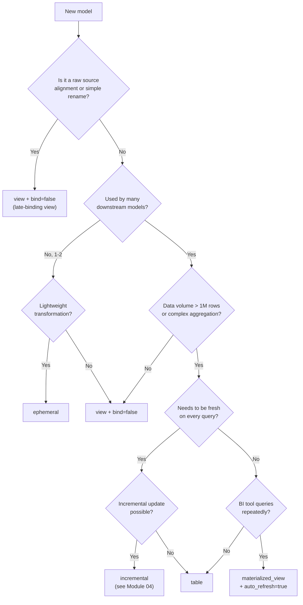

# Materializations Deep Dive: Tables, Views, Late-Binding Views, and Redshift Materialized Views

Choosing the right materialization is the single most impactful architectural decision in a dbt project. Each materialization type has different trade-offs in terms of storage, freshness, query performance, and deployment resilience. Redshift extends dbt's standard set with two platform-specific options that are essential for production use.

---

## The Full Materialization Matrix on Redshift

| Materialization | dbt type | Storage | Freshness | Cascade-safe | Redshift-specific |
| :--- | :--- | :--- | :--- | :--- | :--- |
| Table | `table` | Full copy | Updated on run | Yes (drop + recreate) | sort/dist/backup |
| View | `view` | None (metadata only) | Always current | No (breaks on drop+cascade) | bind config |
| Late-binding view | `view` + `bind: false` | None | Always current | **Yes** | Redshift-only |
| Incremental | `incremental` | Partial updates | Updated incrementally | Partial | All incremental strategies |
| Ephemeral | `ephemeral` | None (CTE) | N/A — inline | N/A | None |
| Materialized view | `materialized_view` | Precomputed | Auto or manual refresh | Yes (DROP CASCADE) | sort/dist/auto_refresh/backup |

---

## Standard Views vs. Late-Binding Views

Regular Redshift views are **tightly bound** to their dependencies. If you drop an upstream table with `CASCADE`, all dependent views are dropped too. This causes cascading failures in production during dbt full-refresh runs.

**Late-binding views** (`bind: false`) are unbound from their dependencies. They survive upstream drops and are compatible with Redshift Spectrum (external tables).

```sql
-- Regular view — will break if stg_orders is dropped
{{ config(materialized='view') }}

select * from {{ ref('stg_orders') }}
```

```sql
-- Late-binding view — survives upstream drops
{{ config(
    materialized='view',
    bind=false
) }}

select * from {{ ref('stg_orders') }}
```

### Setting Late-Binding as Project Default

For production deployments, make late-binding the default for all views:

```yaml
# dbt_project.yml
models:
  my_analytics:
    # All views in staging and intermediate are late-binding by default
    staging:
      +materialized: view
      +bind: false
    intermediate:
      +materialized: view
      +bind: false
    # Marts use tables; bind is irrelevant for tables
    marts:
      +materialized: table
```

[!IMPORTANT]
Always use `bind: false` (late-binding views) in production Redshift deployments. Regular views break when upstream tables are dropped during a full refresh — a very common dbt operation. This is the primary reason to prefer late-binding views for the `view` materialization on Redshift.

---

## Redshift Materialized Views

Redshift materialized views store precomputed query results on disk and can be refreshed automatically or on demand. They are distinct from dbt's `incremental` strategy — they are a native Redshift feature.

### When to use materialized views

- Complex aggregations queried repeatedly by BI tools (Tableau, QuickSight)
- Redshift Spectrum queries over S3 data that should be precomputed
- Models where query latency is critical but full rebuild is too slow

### dbt Configuration

```sql
-- models/marts/mv_daily_revenue.sql
{{ config(
    materialized='materialized_view',

    -- Distribution
    dist='region',

    -- Sort key
    sort=['report_date', 'region'],
    sort_type='compound',

    -- Auto-refresh: Redshift refreshes when base tables change
    auto_refresh=true,

    -- Include in cluster snapshots
    backup=true,

    -- What happens when config changes (apply, continue, or fail)
    on_configuration_change='apply'
) }}

select
    date_trunc('day', o.order_date)::date   as report_date,
    c.region,
    sum(o.total_amount)                      as total_revenue,
    count(distinct o.customer_id)            as unique_customers,
    count(o.order_id)                        as order_count
from {{ ref('fct_orders') }} o
join {{ ref('dim_customers') }} c using (customer_id)
group by 1, 2
```

### on_configuration_change Behavior

| Value | Behavior when config changes |
| :--- | :--- |
| `apply` | dbt runs `ALTER MATERIALIZED VIEW` to apply the change in-place |
| `continue` | dbt logs a warning and skips the model |
| `fail` | dbt raises an error |

Use `apply` for `auto_refresh` and sort/dist changes. Use `fail` in CI environments to catch unexpected config drift.

### Auto-Refresh Architecture



[!TIP]
Materialized views with `auto_refresh=true` are refreshed asynchronously by Redshift when base tables change. This means BI tools querying the MV get fresh data without waiting for the next dbt run. However, auto-refresh has a **lag of up to 5 minutes** on Redshift Serverless. For SLA-sensitive reports, combine `auto_refresh=true` with a dbt post-hook that calls `REFRESH MATERIALIZED VIEW` immediately after the base tables are built.

### Manual Refresh Post-Hook

```sql
-- macros/refresh_mv.sql

    
        
            refresh materialized view {{ relation }};
        
        
        {{ log("Refreshed materialized view: " ~ relation, info=true) }}
    

```

```sql
-- models/marts/mv_daily_revenue.sql
{{ config(
    materialized='materialized_view',
    auto_refresh=true,
    post_hook="{{ refresh_materialized_view(this) }}"
) }}
```

### Materialized View with Cascade Drop

Dropping a materialized view that references another materialized view requires `CASCADE`. dbt-redshift handles this automatically with `DROP CASCADE` support added in v1.9.x:

```sql
-- This works correctly in dbt-redshift >= 1.9
-- dbt handles DROP CASCADE when a materialized view references another
{{ config(
    materialized='materialized_view',
    auto_refresh=false
) }}

select *
from {{ ref('mv_daily_revenue') }}   -- references another materialized view
where region = 'EMEA'
```

---

## Ephemeral Models — When and When Not

Ephemeral models inject their SQL as a CTE into downstream queries. They have **no storage** and are computed inline at query time.

```sql
-- models/intermediate/int_orders_enriched.sql (ephemeral)
{{ config(materialized='ephemeral') }}

select
    o.*,
    c.customer_segment,
    c.region
from {{ ref('stg_orders') }} o
left join {{ ref('stg_customers') }} c using (customer_id)
```

Downstream models using `ref('int_orders_enriched')` will inline this CTE automatically.

**Use ephemeral when:**
- The transformation is a lightweight join or column rename used in only 1–2 downstream models
- You want to avoid materializing intermediate results for cost reasons

**Avoid ephemeral when:**
- The same intermediate result is used in 3+ downstream models (Redshift executes the CTE N times)
- The CTE is complex or expensive (no opportunity for Redshift to cache it)
- You need to test or document the intermediate transformation independently

---

## Choosing the Right Materialization



---

## Practical Layer Architecture for Redshift

```yaml
# dbt_project.yml — recommended layered config for Redshift production
models:
  my_analytics:
    sources:
      # Raw layer: not a dbt layer, but documented via sources.yml

    staging:
      +materialized: view
      +bind: false              # late-binding always
      +backup: false            # rebuilt from sources; no snapshot needed
      +schema: staging

    intermediate:
      +materialized: ephemeral  # default; override to view for complex CTEs

    marts:
      dimensions:
        +materialized: table
        +dist: all              # small dimension → copy everywhere
        +sort_type: compound
        +backup: true
        +schema: marts

      facts:
        +materialized: table
        +sort_type: compound    # override sort column per model
        +backup: true
        +schema: marts

      reporting:
        +materialized: materialized_view
        +auto_refresh: true
        +backup: true
        +schema: reporting
```

---

## 5 Practice Questions

```question
{
  "id": "dbt-rs-03-q1",
  "type": "multiple-choice",
  "question": "A dbt full-refresh run drops upstream staging tables with CASCADE. Which view type survives this operation?",
  "options": [
    "Standard view (bind: true)",
    "Late-binding view (bind: false)",
    "Materialized view with auto_refresh=true",
    "Ephemeral model"
  ],
  "correct": 1,
  "explanation": "Late-binding views (bind: false) are unbound from their source dependencies. They are not dropped when upstream tables are dropped with CASCADE, making them safe for production deployments."
}
```

```question
{
  "id": "dbt-rs-03-q2",
  "type": "multiple-choice",
  "question": "Which on_configuration_change value should you use on materialized views in CI to catch unexpected config drift?",
  "options": [
    "apply",
    "continue",
    "fail",
    "rebuild"
  ],
  "correct": 2,
  "explanation": "Setting on_configuration_change: fail in CI causes dbt to raise an error when a materialized view's config differs from what's deployed, catching accidental changes before they reach production."
}
```

```question
{
  "id": "dbt-rs-03-q3",
  "type": "multiple-choice",
  "question": "An ephemeral model is referenced by 8 different downstream models. What is the performance risk?",
  "options": [
    "Ephemeral models cannot be referenced by more than 3 models",
    "The ephemeral CTE is inlined and re-executed once per downstream model — 8 times total",
    "The ephemeral model is cached after the first execution",
    "dbt will automatically convert it to a table if it's referenced more than 5 times"
  ],
  "correct": 1,
  "explanation": "Ephemeral models are CTEs inlined into each downstream model's compiled SQL. Redshift executes the CTE for each downstream model independently — there is no caching."
}
```

```question
{
  "id": "dbt-rs-03-q4",
  "type": "multiple-choice",
  "question": "You need a BI-facing aggregation that is always fresh, built on top of a large fact table, and queried hundreds of times per hour. What materialization fits best?",
  "options": [
    "table",
    "view",
    "ephemeral",
    "materialized_view with auto_refresh=true"
  ],
  "correct": 3,
  "explanation": "A Redshift materialized view with auto_refresh=true stores the precomputed aggregation (fast queries) and refreshes automatically when the base table changes (always fresh), without requiring another dbt run."
}
```

```question
{
  "id": "dbt-rs-03-q5",
  "type": "multiple-choice",
  "question": "What must you also configure when a late-binding view references an external table via Redshift Spectrum?",
  "options": [
    "bind: true",
    "dist: all",
    "bind: false — late-binding views are required for Spectrum external table compatibility",
    "auto_refresh: true"
  ],
  "correct": 2,
  "explanation": "Late-binding views (bind: false) are required when referencing Redshift Spectrum external tables. Regular (bound) views cannot reference external tables."
}
```

```question
{
  "id": "dbt-rs-03-q6",
  "type": "multiple-choice",
  "question": "How long can the auto-refresh lag be for Redshift Serverless materialized views?",
  "options": [
    "Immediate — no lag",
    "Up to 5 minutes",
    "Up to 1 hour",
    "Up to 24 hours"
  ],
  "correct": 1,
  "explanation": "Redshift Serverless materialized views with auto_refresh=true can have a lag of up to 5 minutes. For stricter SLAs, combine auto_refresh with a dbt post-hook that calls REFRESH MATERIALIZED VIEW immediately after base table updates."
}
```

---

[!SUCCESS]
### Key Takeaways

- Always use late-binding views (`bind: false`) in production Redshift deployments to survive upstream DROP CASCADE operations.
- Redshift materialized views with `auto_refresh=true` are the best choice for BI-facing aggregations — precomputed storage, automatic freshness, no extra dbt runs needed.
- Use `on_configuration_change: fail` in CI pipelines to detect materialized view config drift early.
- Ephemeral models are CTEs inlined per downstream model — avoid them when referenced by many models.
- The `post_hook` pattern with `REFRESH MATERIALIZED VIEW` ensures freshness guarantees stricter than auto-refresh's 5-minute lag.
- Layer your project: staging → late-binding views, intermediate → ephemeral or views, marts/facts → tables, reporting → materialized views.