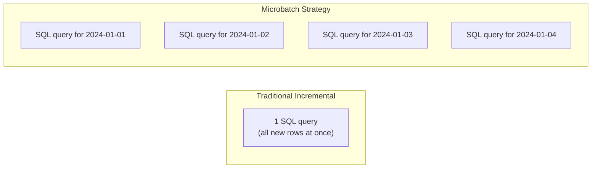
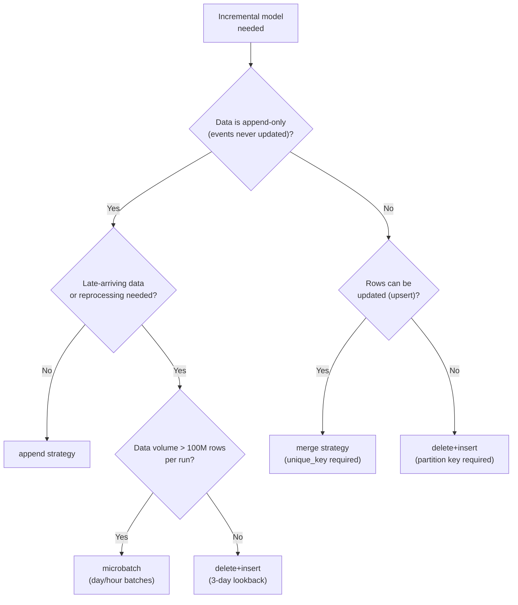

# Advanced Incremental Models and the Microbatch Strategy

Incremental models are the core tool for handling datasets that are too large to rebuild from scratch on every run. dbt-core 1.9 introduced the **microbatch strategy**, a first-class pattern for processing event data in isolated time windows — each batch is its own SQL statement, independently retryable. This module covers all incremental strategies available on Redshift and explains when to use each.

---

## Incremental Strategy Overview

dbt-redshift supports four incremental strategies:

| Strategy | Mechanism | Duplicates | Full refresh supported | Best for |
| :--- | :--- | :--- | :--- | :--- |
| `append` | `INSERT INTO` | Possible | Yes | Immutable event logs |
| `delete+insert` | `DELETE` then `INSERT` | No | Yes | Partitioned data, no MERGE support |
| `merge` | `MERGE` (upsert) | No | Yes | Slowly changing facts, SCD Type 1 |
| `microbatch` | Per-batch `DELETE+INSERT` | No | Bounded | Time-series event data (dbt 1.9+) |

---

## Strategy 1: Append

Inserts all new rows without checking for duplicates. The simplest and fastest strategy.

```sql
-- models/marts/facts/fct_raw_events.sql
{{ config(
    materialized='incremental',
    incremental_strategy='append',
    dist='event_id',
    sort=['event_timestamp'],
    sort_type='compound',
    unique_key='event_id'       -- used for docs only; not enforced in append
) }}

select
    event_id,
    user_id,
    event_type,
    event_timestamp,
    properties
from {{ ref('stg_raw_events') }}


    where event_timestamp > (
        select coalesce(max(event_timestamp), '1970-01-01') 
        from {{ this }}
    )

```

Use `append` only when source data is truly immutable — each event_id appears exactly once and is never updated.

---

## Strategy 2: Delete + Insert

Deletes the affected partition, then inserts. Avoids duplicates without requiring Redshift MERGE support (though Redshift does support MERGE as of 2022).

```sql
-- models/marts/facts/fct_daily_metrics.sql
{{ config(
    materialized='incremental',
    incremental_strategy='delete+insert',
    unique_key=['report_date', 'region'],   -- partition key to delete + reinsert
    dist='region',
    sort=['report_date'],
    sort_type='compound'
) }}

select
    report_date,
    region,
    sum(revenue)       as total_revenue,
    count(order_id)    as order_count
from {{ ref('fct_orders') }}


    where report_date >= (
        select dateadd('day', -3, max(report_date)) 
        from {{ this }}
    )

group by 1, 2
```

The `unique_key` list defines which rows to delete before re-inserting. dbt compiles this as:

```sql
delete from analytics.marts.fct_daily_metrics
where (report_date, region) in (
    select report_date, region from __dbt_tmp
);

insert into analytics.marts.fct_daily_metrics
select * from __dbt_tmp;
```

---

## Strategy 3: Merge (Upsert)

Uses a native `MERGE` statement to update existing rows or insert new ones. The most powerful strategy for slowly-changing fact data.

```sql
-- models/marts/facts/fct_order_status.sql
{{ config(
    materialized='incremental',
    incremental_strategy='merge',
    unique_key='order_id',
    dist='customer_id',
    sort=['updated_at'],
    sort_type='compound',
    merge_update_columns=['status', 'updated_at', 'total_amount']
) }}

select
    order_id,
    customer_id,
    status,
    total_amount,
    updated_at
from {{ ref('stg_orders') }}


    where updated_at > (
        select coalesce(max(updated_at), '1970-01-01')
        from {{ this }}
    )

```

The `merge_update_columns` config limits which columns are updated on match — efficient when only a few columns change frequently.

---

## Strategy 4: Microbatch (dbt-core 1.9+)

The microbatch strategy is a fundamentally different approach. Instead of one SQL query with an `is_incremental()` block, dbt generates **one SQL query per time batch** and executes them independently.

### Key differences from traditional incremental



Each batch:
- Is independently retryable
- Filters upstream `ref()` models automatically when they also have `event_time`
- Runs concurrently up to `threads` limit
- Does not require an `is_incremental()` block

### Microbatch Configuration

```sql
-- models/marts/facts/fct_events_microbatch.sql
{{ config(
    materialized='incremental',
    incremental_strategy='microbatch',

    -- Required: the timestamp column that defines batch boundaries
    event_time='event_timestamp',

    -- Batch size: 'hour', 'day', 'month', 'year'
    batch_size='day',

    -- How many past batches to re-process on each run
    -- (accounts for late-arriving data)
    lookback=3,

    -- The earliest possible event timestamp to process
    begin='2023-01-01',

    -- Prevent accidental full refresh
    full_refresh=false,

    -- Redshift performance configs
    dist='user_id',
    sort=['event_timestamp', 'event_type'],
    sort_type='compound'
) }}

-- Write SQL for a SINGLE batch — dbt handles the date range filtering
select
    event_id,
    user_id,
    event_type,
    event_timestamp,
    session_id,
    page_url,
    properties
from {{ ref('stg_raw_events') }}
-- No is_incremental() block needed!
-- dbt automatically filters stg_raw_events to the current batch window
```

### What dbt generates for each batch

For a `batch_size='day'` run on 2024-03-15, dbt compiles:

```sql
-- Batch for 2024-03-13 (lookback=3, so 3 days re-processed)
delete from analytics.marts.fct_events_microbatch
where event_timestamp >= '2024-03-13 00:00:00'
  and event_timestamp <  '2024-03-14 00:00:00';

insert into analytics.marts.fct_events_microbatch
select ...
from stg_raw_events
where event_timestamp >= '2024-03-13 00:00:00'
  and event_timestamp <  '2024-03-14 00:00:00';

-- Batch for 2024-03-14
delete from ...  where event_timestamp >= '2024-03-14' ...
insert ...

-- Batch for 2024-03-15
delete from ...  where event_timestamp >= '2024-03-15' ...
insert ...
```

### Bounded Full Refresh

With `full_refresh=false`, a standard `dbt run --full-refresh` will **error** on microbatch models (protecting against accidental rebuild). Use bounded flags instead:

```bash
# Rebuild a specific time window without touching other batches
dbt run --select fct_events_microbatch \
    --event-time-start 2024-01-01 \
    --event-time-end   2024-02-01
```

### Automatic Upstream Filtering

If upstream `ref()` models also declare `event_time`, dbt passes the current batch's date range to them automatically:

```sql
-- models/staging/stg_raw_events.sql
{{ config(
    materialized='view',
    bind=false,
    event_time='event_timestamp'   -- declare event_time here
) }}

select * from {{ source('raw', 'events') }}
```

Now when microbatch processes the 2024-03-15 batch, `stg_raw_events` is automatically filtered to that day — dbt adds the `WHERE event_timestamp >= ... AND event_timestamp < ...` predicate on the source query.

---

## Choosing Between Incremental Strategies



---

## Incremental Model Best Practices for Redshift

### 1. Always specify a lookback window

Late-arriving events are common in distributed systems. A 3-day lookback ensures they are captured:

```sql

    where event_date >= (
        select dateadd('day', -3, max(event_date)) 
        from {{ this }}
    )

```

### 2. Use coalesce for first-run safety

On first run (or after full refresh), `max()` over an empty table returns NULL:

```sql

    where updated_at > (
        select coalesce(max(updated_at), '2020-01-01'::timestamp)
        from {{ this }}
    )

```

### 3. Combine dist key with unique_key for merge performance

```sql
{{ config(
    incremental_strategy='merge',
    unique_key='event_id',
    dist='event_id'    -- hash join: event_id in both tables → co-located
) }}
```

Setting `dist` to the same column as `unique_key` ensures Redshift can perform the merge with minimal data movement across nodes.

### 4. Monitor microbatch run metadata

dbt 1.9+ captures per-batch metadata in `run_results.json`:

```bash
# Inspect which batches ran and their status
cat target/run_results.json | python3 -c "
import json, sys
results = json.load(sys.stdin)
for r in results['results']:
    if 'batch' in r:
        print(r['unique_id'], r['batch']['event_time_start'], r['status'])
"
```

---

## 5 Practice Questions

```question
{
  "id": "dbt-rs-04-q1",
  "type": "multiple-choice",
  "question": "The microbatch strategy in dbt 1.9+ does NOT require which element that traditional incremental models require?",
  "options": [
    "A unique_key configuration",
    "An is_incremental() block in the model SQL",
    "A dist style configuration",
    "A begin date"
  ],
  "correct": 1,
  "explanation": "Microbatch models do not use is_incremental() blocks. dbt generates one SQL query per batch period and handles the date filtering automatically, so the model SQL is written for a single batch window."
}
```

```question
{
  "id": "dbt-rs-04-q2",
  "type": "multiple-choice",
  "question": "You run `dbt run --full-refresh` on a microbatch model configured with `full_refresh: false`. What happens?",
  "options": [
    "dbt rebuilds the entire table from the begin date",
    "dbt raises an error — full refresh is blocked by the full_refresh: false config",
    "dbt rebuilds only the last 3 batches",
    "dbt ignores the flag and runs normally"
  ],
  "correct": 1,
  "explanation": "Setting full_refresh: false on a microbatch model protects against accidental full rebuilds. dbt raises an error. To rebuild a range, use --event-time-start and --event-time-end instead."
}
```

```question
{
  "id": "dbt-rs-04-q3",
  "type": "multiple-choice",
  "question": "For a merge strategy incremental model on Redshift, setting `dist` to the same column as `unique_key` has what performance benefit?",
  "options": [
    "It reduces the number of SQL statements generated",
    "It ensures both the target table and the temp table have co-located rows, minimizing data redistribution during the merge join",
    "It enables auto_refresh on the model",
    "It allows the model to run without a unique_key"
  ],
  "correct": 1,
  "explanation": "When the distribution key matches the merge join key (unique_key), Redshift can join the target and temp tables without redistributing rows across nodes — a co-located hash join."
}
```

```question
{
  "id": "dbt-rs-04-q4",
  "type": "multiple-choice",
  "question": "What is the purpose of the `lookback` parameter in the microbatch strategy?",
  "options": [
    "It defines how far back in time dbt searches for the begin date",
    "It specifies how many past batch periods to re-process on each run to capture late-arriving data",
    "It sets the retention period after which batches are deleted",
    "It controls the number of concurrent batch threads"
  ],
  "correct": 1,
  "explanation": "lookback=3 with batch_size='day' means dbt re-processes the last 3 days on every run. This ensures late-arriving events (which typically arrive within a few days) are captured in their correct batch."
}
```

```question
{
  "id": "dbt-rs-04-q5",
  "type": "multiple-choice",
  "question": "When does dbt automatically filter an upstream ref() model in a microbatch run?",
  "options": [
    "Always — all refs are automatically filtered",
    "Only when the upstream model uses the incremental materialization",
    "When the upstream model also declares an event_time configuration",
    "Only when the upstream model is a source (not a ref)"
  ],
  "correct": 2,
  "explanation": "Automatic upstream filtering only applies when the referenced model also declares event_time. dbt then passes the current batch's time window as a filter on that model's output."
}
```

```question
{
  "id": "dbt-rs-04-q6",
  "type": "multiple-choice",
  "question": "Which strategy should you choose for a fact table where rows can be retroactively updated (e.g., order status changes from 'pending' to 'shipped')?",
  "options": [
    "append",
    "delete+insert with a full date range",
    "merge with unique_key='order_id'",
    "microbatch"
  ],
  "correct": 2,
  "explanation": "Merge (upsert) is the right strategy when source rows can be updated after initial ingestion. It matches on unique_key and updates existing rows while inserting new ones."
}
```

---

[!SUCCESS]
### Key Takeaways

- dbt-redshift supports four incremental strategies: append, delete+insert, merge, and microbatch (1.9+).
- Microbatch generates one SQL query per time period — no `is_incremental()` block needed; each batch is independently retryable.
- Configure `lookback` to re-process recent batches and capture late-arriving data.
- Protect microbatch models with `full_refresh: false`; use `--event-time-start` / `--event-time-end` for bounded rebuilds.
- For merge performance on Redshift, align `dist` with `unique_key` to enable co-located joins.
- Use `coalesce(max(col), 'fallback_date')` in `is_incremental()` filters to handle first-run (empty table) edge cases.
- Upstream refs with matching `event_time` configs are automatically filtered in microbatch runs — declare it in all your staging views.