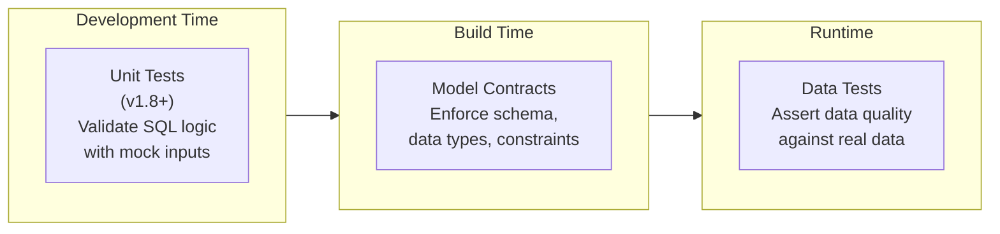
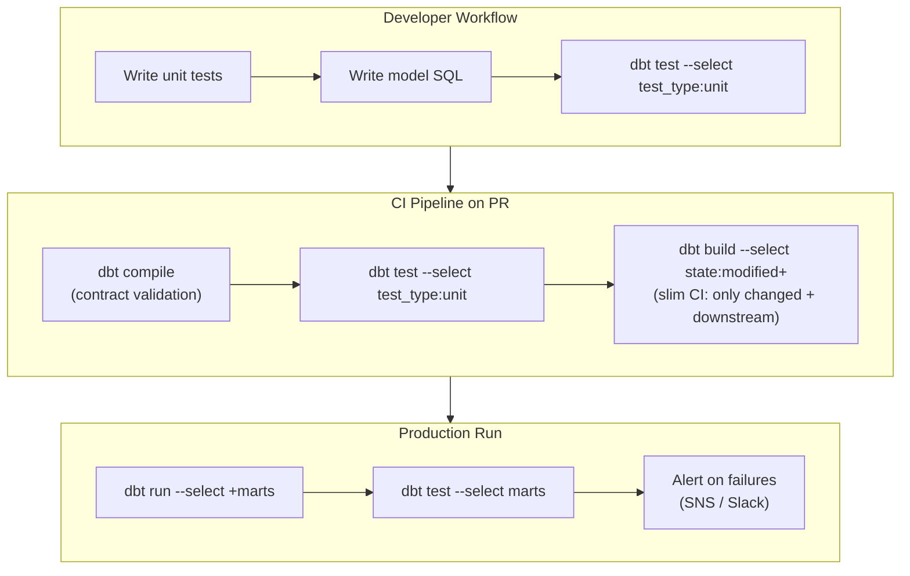

# Model Contracts, Unit Tests, and Data Quality

dbt-core provides three complementary mechanisms for data quality: **model contracts** (compile-time schema enforcement), **unit tests** (logic validation with mock data, v1.8+), and **data tests** (runtime data assertions). Together they form a test-driven development workflow for analytics engineering that rivals software engineering quality practices.

---

## The Three Pillars of dbt Data Quality



| Feature | When it runs | Tests what | Mock data? |
| :--- | :--- | :--- | :--- |
| Unit tests | Before materialization | SQL transformation logic | Yes — static inputs |
| Model contracts | At compile/build time | Schema structure, column types | No |
| Data tests | After materialization | Actual data values | No |

---

## Model Contracts

A model contract declares the expected schema for a model and enforces it at build time. When a contract is enforced, dbt validates that the compiled SQL returns exactly the columns, types, and constraints defined — failing before any data is written if they don't match.

### Defining a Contract

```yaml
# models/marts/facts/schema.yml
models:
  - name: fct_orders
    description: "Fact table for customer orders"

    config:
      contract:
        enforced: true          # enforce at build time

    columns:
      - name: order_id
        description: "Unique order identifier"
        data_type: varchar      # enforced type
        constraints:
          - type: not_null
          - type: primary_key   # informational on Redshift (not DDL enforced)
          - type: unique

      - name: customer_id
        description: "FK to dim_customers"
        data_type: integer
        constraints:
          - type: not_null
          - type: foreign_key
            to: ref('dim_customers')
            to_columns: [customer_id]   # supported in dbt-core 1.9+

      - name: order_date
        data_type: date
        constraints:
          - type: not_null

      - name: total_amount
        data_type: numeric(18, 4)
        constraints:
          - type: not_null
          - type: check
            expression: "total_amount >= 0"

      - name: status
        data_type: varchar(50)
        constraints:
          - type: not_null
```

[!WARNING]
On Redshift, `primary_key`, `foreign_key`, and `unique` constraints are **informational only** — Redshift does not enforce them at the database level. dbt model contracts validate the schema at compile time, but referential integrity must be enforced via dbt `data_tests`. Use `not_null` and `check` constraints where Redshift does enforce them.

### Enforcing Contracts Project-Wide for Marts

```yaml
# dbt_project.yml
models:
  my_analytics:
    marts:
      +contract:
        enforced: true    # all mart models require a defined contract
```

Individual staging models can opt out:

```yaml
models:
  my_analytics:
    staging:
      +contract:
        enforced: false   # staging contracts are optional
```

### What happens when a contract is violated?

```
dbt run --select fct_orders

Compilation Error in model fct_orders
  This model has an enforced contract that failed.
  Please ensure the name, data_type, and number of columns in your
  contract match the columns in your model's definition.

  Contract Violation(s):
  - Column 'discount_pct' is present in model but missing in contract
  - Column 'total_amount' declared as numeric(18,4) but model returns float8
```

---

## Unit Tests (dbt-core 1.8+)

Unit tests validate your SQL transformation logic using **static mock data** — no warehouse compute required beyond the test itself. They enable test-driven development: write the test, write the model, run the test.

### Basic Unit Test Structure

```yaml
# models/marts/facts/schema.yml (continued)

unit_tests:
  - name: test_fct_orders_status_mapping
    description: "Verify that raw status codes map to correct display values"
    model: fct_orders

    given:
      # Mock the upstream ref('stg_orders')
      - input: ref('stg_orders')
        rows:
          - {order_id: 1, customer_id: 101, raw_status: 'P',  total_amount: 99.99,  order_date: '2024-01-15'}
          - {order_id: 2, customer_id: 102, raw_status: 'S',  total_amount: 149.50, order_date: '2024-01-16'}
          - {order_id: 3, customer_id: 103, raw_status: 'C',  total_amount: 0.00,   order_date: '2024-01-17'}
          - {order_id: 4, customer_id: 104, raw_status: 'RJ', total_amount: 55.00,  order_date: '2024-01-18'}

      # Mock the upstream ref('dim_customers')
      - input: ref('dim_customers')
        rows:
          - {customer_id: 101, customer_segment: 'Enterprise', region: 'US'}
          - {customer_id: 102, customer_segment: 'SMB',        region: 'EMEA'}
          - {customer_id: 103, customer_segment: 'Enterprise', region: 'APAC'}
          - {customer_id: 104, customer_segment: 'SMB',        region: 'US'}

    expect:
      rows:
        - {order_id: 1, status: 'Pending',   customer_segment: 'Enterprise', region: 'US'}
        - {order_id: 2, status: 'Shipped',   customer_segment: 'SMB',        region: 'EMEA'}
        - {order_id: 3, status: 'Cancelled', customer_segment: 'Enterprise', region: 'APAC'}
        - {order_id: 4, status: 'Rejected',  customer_segment: 'SMB',        region: 'US'}
```

### Unit Test with Timestamp Overrides

Non-deterministic functions like `current_timestamp` break unit tests. Use `overrides` to fix them:

```yaml
unit_tests:
  - name: test_fct_orders_loaded_at_is_set
    model: fct_orders
    overrides:
      macros:
        # Fix the current_timestamp macro for deterministic testing
        current_timestamp: "'2024-06-01 12:00:00'::timestamp"
      env_vars:
        # Override environment variables if used in the model
        DBT_ENV_NAME: "test"
    given:
      - input: ref('stg_orders')
        rows:
          - {order_id: 1, customer_id: 101, raw_status: 'P', total_amount: 99.99, order_date: '2024-01-15'}
    expect:
      rows:
        - {order_id: 1, loaded_at: '2024-06-01 12:00:00'}
```

### Running Unit Tests

```bash
# Run all unit tests
dbt test --select "test_type:unit"

# Run all data tests (excludes unit tests)
dbt test --select "test_type:data"

# Run unit tests for a specific model
dbt test --select "fct_orders,test_type:unit"

# Run both in CI (all tests)
dbt test --select marts
```

### Unit Test for an Incremental Model

Unit tests for incremental models can mock the "current table state" to simulate the `is_incremental()` path:

```yaml
unit_tests:
  - name: test_incremental_dedup_logic
    model: fct_order_status
    overrides:
      is_incremental: true     # simulate incremental run
    given:
      - input: ref('stg_orders')
        rows:
          - {order_id: 1, status: 'Shipped', updated_at: '2024-03-15 10:00:00'}
      - input: this            # mock the current table state
        rows:
          - {order_id: 1, status: 'Pending', updated_at: '2024-03-14 08:00:00'}
    expect:
      rows:
        - {order_id: 1, status: 'Shipped', updated_at: '2024-03-15 10:00:00'}
```

---

## Data Tests

Data tests run against real materialized data after models are built. They complement unit tests by asserting data quality at runtime.

### Generic Tests (Built-in)

```yaml
# models/marts/facts/schema.yml
models:
  - name: fct_orders
    columns:
      - name: order_id
        data_tests:
          - not_null
          - unique

      - name: customer_id
        data_tests:
          - not_null
          - relationships:
              to: ref('dim_customers')
              field: customer_id

      - name: status
        data_tests:
          - accepted_values:
              values: ['Pending', 'Shipped', 'Cancelled', 'Rejected']

      - name: total_amount
        data_tests:
          - not_null
          - dbt_utils.accepted_range:
              min_value: 0
              max_value: 1000000
```

### Singular Tests (Custom SQL Assertions)

For complex business logic that cannot be expressed with generic tests:

```sql
-- tests/assert_orders_have_valid_dates.sql
-- This test fails if any rows are returned
select
    order_id,
    order_date,
    shipped_date
from {{ ref('fct_orders') }}
where shipped_date < order_date
  and shipped_date is not null
  and order_date is not null
```

```sql
-- tests/assert_revenue_matches_line_items.sql
-- Revenue in fct_orders must equal the sum of line items
select
    o.order_id,
    o.total_amount            as header_amount,
    sum(li.unit_price * li.quantity) as calculated_amount,
    abs(o.total_amount - sum(li.unit_price * li.quantity)) as discrepancy
from {{ ref('fct_orders') }} o
join {{ ref('fct_order_line_items') }} li using (order_id)
group by 1, 2
having abs(o.total_amount - sum(li.unit_price * li.quantity)) > 0.01
```

### Test Severity and Store Failures

```yaml
models:
  - name: fct_orders
    columns:
      - name: total_amount
        data_tests:
          - not_null:
              severity: error      # fail the run
          - dbt_utils.accepted_range:
              min_value: 0
              severity: warn       # log warning, continue run
              store_failures: true # save failing rows to the warehouse
              store_failures_as: table
```

Storing failures lets you query the failing rows directly in Redshift:

```sql
-- After a run with store_failures: true
select * from analytics.dbt_test__audit.accepted_range_fct_orders_total_amount_min_value__0
order by dbt_sentry_run_started_at desc
limit 100;
```

---

## Combining All Three: A Production Quality Gate



### Recommended `dbt build` for Full Quality Gate

`dbt build` runs models, tests, seeds, and snapshots in DAG order — models run, then their tests immediately:

```bash
# Full build with all quality checks
dbt build --select +marts --exclude "test_type:unit"

# Slim CI: only modified models and their descendants
dbt build \
    --select "state:modified+" \
    --defer \
    --state ./prod-artifacts \
    --exclude "test_type:unit"
```

---

## 5 Practice Questions

```question
{
  "id": "dbt-rs-05-q1",
  "type": "multiple-choice",
  "question": "A model contract is violated because the model returns a column not listed in the contract. At what point does dbt fail?",
  "options": [
    "After the model runs and data is written to the warehouse",
    "At compile time, before any SQL is executed against the warehouse",
    "Only during dbt test, not during dbt run",
    "It logs a warning but does not fail"
  ],
  "correct": 1,
  "explanation": "Model contracts are enforced at compile/build time. dbt validates the model's declared schema against the contract definition before executing any SQL against the warehouse."
}
```

```question
{
  "id": "dbt-rs-05-q2",
  "type": "multiple-choice",
  "question": "On Amazon Redshift, which constraint type in a model contract is actually enforced at the database level?",
  "options": [
    "primary_key",
    "foreign_key",
    "unique",
    "not_null via a CHECK constraint"
  ],
  "correct": 3,
  "explanation": "Redshift enforces check constraints (including not_null, which maps to a NOT NULL column constraint). primary_key, foreign_key, and unique are informational — declared but not enforced by Redshift's storage engine."
}
```

```question
{
  "id": "dbt-rs-05-q3",
  "type": "multiple-choice",
  "question": "Why is the `overrides.macros.current_timestamp` configuration important in unit tests?",
  "options": [
    "It makes tests run faster by skipping timestamp computations",
    "It fixes non-deterministic functions so unit tests return consistent, reproducible results",
    "It is required for unit tests to work on Redshift",
    "It enables the test to run without a warehouse connection"
  ],
  "correct": 1,
  "explanation": "Functions like current_timestamp return different values on every call, making unit test assertions non-deterministic. Overriding them with a fixed value ensures the test result is the same every run."
}
```

```question
{
  "id": "dbt-rs-05-q4",
  "type": "multiple-choice",
  "question": "What command runs ONLY unit tests and excludes data tests?",
  "options": [
    "dbt test --unit-only",
    "dbt test --select test_type:unit",
    "dbt test --no-data-tests",
    "dbt unit-test"
  ],
  "correct": 1,
  "explanation": "The selector test_type:unit filters the test execution to only unit tests. Use test_type:data to run only data tests. Both selectors are available from dbt-core 1.9+."
}
```

```question
{
  "id": "dbt-rs-05-q5",
  "type": "multiple-choice",
  "question": "Setting `store_failures: true` on a data test does what?",
  "options": [
    "Prevents the test from failing the run",
    "Saves the rows that fail the test to a table in the warehouse for inspection",
    "Runs the test more frequently",
    "Sends test failures to an S3 bucket"
  ],
  "correct": 1,
  "explanation": "store_failures: true materializes failing rows into a table in your warehouse (default schema: dbt_test__audit). Engineers can then query the table to understand what data failed and why."
}
```

```question
{
  "id": "dbt-rs-05-q6",
  "type": "multiple-choice",
  "question": "What does `dbt build` do differently from running `dbt run` followed by `dbt test`?",
  "options": [
    "dbt build skips tests for performance",
    "dbt build runs each model's tests immediately after that model succeeds, in DAG order",
    "dbt build only runs unit tests, not data tests",
    "dbt build compiles models but does not execute them"
  ],
  "correct": 1,
  "explanation": "dbt build processes models in DAG order, running each model's tests immediately after it is built. If a model fails its tests, downstream models are not built — this catches issues earlier than running tests after all models complete."
}
```

---

[!SUCCESS]
### Key Takeaways

- Model contracts enforce compile-time schema validation — column names, data types, and constraints must match before SQL executes.
- On Redshift, only `not_null` and `check` constraints are database-enforced. Use `primary_key`, `foreign_key`, and `unique` as informational documentation and enforce them with data tests.
- Unit tests (v1.8+) validate SQL transformation logic with static mock data — no warehouse compute needed beyond the test query itself.
- Override non-deterministic macros (`current_timestamp`) in unit tests to ensure reproducible results.
- `store_failures: true` materializes failing test rows into an audit table in your warehouse for debugging.
- `dbt build` runs models and their tests in DAG order — a model's tests run before its descendants are built.
- Combine unit tests (development), model contracts (build time), and data tests (runtime) for a full quality gate.