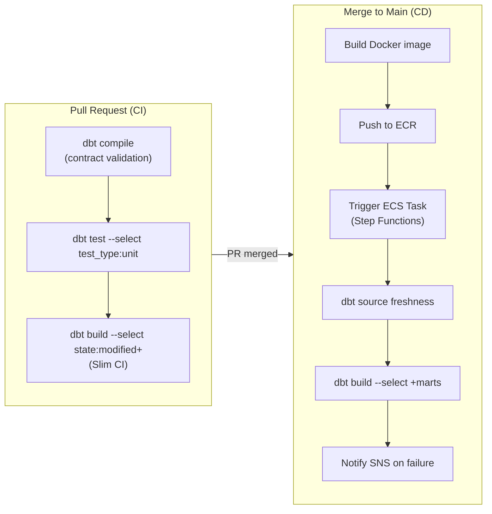
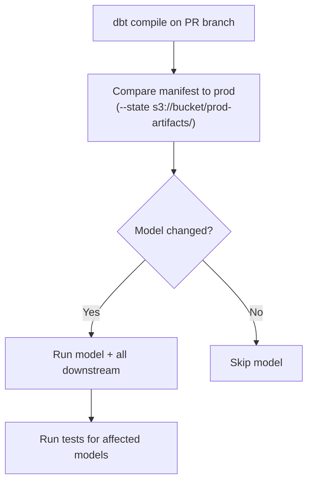

# CI/CD Pipelines and Slim CI on Redshift

A dbt project without a CI/CD pipeline is a liability waiting to be discovered in production. This module builds a full production deployment pipeline for dbt-core on AWS: GitHub Actions for CI, Slim CI using dbt state comparison, artifact storage in S3, and deployment with Amazon ECS Fargate.

---

## Pipeline Architecture Overview



---

## Slim CI: State-Based Comparison

Slim CI runs dbt only on models that changed since the last production run. It requires:

1. A production manifest (`manifest.json`) stored in S3
2. `--state` pointing to that manifest
3. `--select state:modified+` to select changed models and their descendants

### How it works



### S3 Artifact Structure

```
s3://my-dbt-artifacts/
├── prod/
│   ├── latest/
│   │   ├── manifest.json
│   │   ├── run_results.json
│   │   └── catalog.json
│   └── 2024-03-15T14:30:00/
│       ├── manifest.json
│       └── run_results.json
└── ci/
    └── pr-123/
        ├── manifest.json
        └── run_results.json
```

---

## GitHub Actions CI Workflow

```yaml
# .github/workflows/dbt-ci.yml
name: dbt CI

on:
  pull_request:
    branches: [main]
    paths:
      - 'models/**'
      - 'macros/**'
      - 'tests/**'
      - 'snapshots/**'
      - 'seeds/**'
      - 'dbt_project.yml'
      - 'packages.yml'

env:
  AWS_REGION: us-east-1
  DBT_ARTIFACT_BUCKET: my-dbt-artifacts

jobs:
  dbt-ci:
    runs-on: ubuntu-latest
    permissions:
      id-token: write    # for OIDC authentication to AWS
      contents: read

    steps:
      - name: Checkout
        uses: actions/checkout@v4

      - name: Set up Python
        uses: actions/setup-python@v5
        with:
          python-version: '3.12'

      - name: Install dbt
        run: |
          pip install \
            dbt-core==1.10.4 \
            dbt-redshift==1.10.1

      - name: Configure AWS credentials (OIDC)
        uses: aws-actions/configure-aws-credentials@v4
        with:
          role-to-assume: arn:aws:iam::${{ secrets.AWS_ACCOUNT_ID }}:role/GithubActionsDBTRole
          aws-region: ${{ env.AWS_REGION }}

      - name: Download prod manifest for Slim CI
        run: |
          mkdir -p ./prod-artifacts
          aws s3 cp s3://${{ env.DBT_ARTIFACT_BUCKET }}/prod/latest/manifest.json \
            ./prod-artifacts/manifest.json \
            || echo "No prod manifest found — running full CI"

      - name: Install dbt packages
        run: dbt deps
        env:
          DBT_PROFILES_DIR: ./ci-profiles

      - name: dbt compile (contract + Jinja validation)
        run: dbt compile
        env:
          DBT_PROFILES_DIR: ./ci-profiles
          DBT_TARGET: ci

      - name: Run unit tests
        run: dbt test --select "test_type:unit"
        env:
          DBT_PROFILES_DIR: ./ci-profiles
          DBT_TARGET: ci

      - name: Slim CI — build changed models + tests
        run: |
          if [ -f ./prod-artifacts/manifest.json ]; then
            dbt build \
              --select "state:modified+" \
              --defer \
              --state ./prod-artifacts \
              --exclude "test_type:unit" \
              --target ci
          else
            dbt build \
              --select "+marts" \
              --exclude "test_type:unit" \
              --target ci
          fi
        env:
          DBT_PROFILES_DIR: ./ci-profiles

      - name: Upload CI artifacts to S3
        if: always()
        run: |
          aws s3 sync ./target/ \
            s3://${{ env.DBT_ARTIFACT_BUCKET }}/ci/pr-${{ github.event.pull_request.number }}/
```

### CI profiles.yml

```yaml
# ci-profiles/profiles.yml
my_analytics:
  target: ci
  outputs:
    ci:
      type: redshift
      method: iam
      host: ${{ secrets.REDSHIFT_CI_HOST }}
      port: 5439
      dbname: analytics_ci
      schema: "dbt_ci_pr_{{ env_var('PR_NUMBER', 'local') }}"
      region: us-east-1
      threads: 4
      keepalives_idle: 240
```

[!TIP]
Dynamically naming the CI schema with the PR number (`dbt_ci_pr_123`) ensures each PR gets its own isolated schema. Add a cleanup job that drops these schemas after PR merge.

---

## CD: Deployment with Amazon ECS Fargate

### Dockerfile

```dockerfile
# Dockerfile
FROM python:3.12-slim

RUN pip install --no-cache-dir \
    dbt-core==1.10.4 \
    dbt-redshift==1.10.1

WORKDIR /dbt

COPY . .

RUN dbt deps

ENTRYPOINT ["dbt"]
```

### ECS Task Definition (Terraform)

```hcl
# infrastructure/ecs_task.tf
resource "aws_ecs_task_definition" "dbt_run" {
  family                   = "dbt-analytics-run"
  network_mode             = "awsvpc"
  requires_compatibilities = ["FARGATE"]
  cpu                      = "2048"
  memory                   = "4096"
  execution_role_arn       = aws_iam_role.ecs_task_execution.arn
  task_role_arn            = aws_iam_role.dbt_task.arn

  container_definitions = jsonencode([{
    name  = "dbt"
    image = "${aws_ecr_repository.dbt.repository_url}:latest"

    environment = [
      { name = "DBT_TARGET", value = "prod" }
    ]

    secrets = [
      {
        name      = "REDSHIFT_HOST"
        valueFrom = "${aws_secretsmanager_secret.redshift.arn}:host::"
      },
      {
        name      = "REDSHIFT_USER"
        valueFrom = "${aws_secretsmanager_secret.redshift.arn}:user::"
      },
      {
        name      = "REDSHIFT_PASSWORD"
        valueFrom = "${aws_secretsmanager_secret.redshift.arn}:password::"
      }
    ]

    logConfiguration = {
      logDriver = "awslogs"
      options = {
        "awslogs-group"         = "/ecs/dbt-analytics"
        "awslogs-region"        = "us-east-1"
        "awslogs-stream-prefix" = "ecs"
      }
    }
  }])
}
```

### Step Functions State Machine

```json
{
  "Comment": "dbt production pipeline",
  "StartAt": "SourceFreshness",
  "States": {
    "SourceFreshness": {
      "Type": "Task",
      "Resource": "arn:aws:states:::ecs:runTask.sync",
      "Parameters": {
        "Cluster": "${ECS_CLUSTER_ARN}",
        "TaskDefinition": "${TASK_DEF_ARN}",
        "Overrides": {
          "ContainerOverrides": [{
            "Name": "dbt",
            "Command": ["source", "freshness"]
          }]
        }
      },
      "Next": "DbtBuild",
      "Catch": [{
        "ErrorEquals": ["States.ALL"],
        "Next": "NotifyFailure"
      }]
    },

    "DbtBuild": {
      "Type": "Task",
      "Resource": "arn:aws:states:::ecs:runTask.sync",
      "Parameters": {
        "Cluster": "${ECS_CLUSTER_ARN}",
        "TaskDefinition": "${TASK_DEF_ARN}",
        "Overrides": {
          "ContainerOverrides": [{
            "Name": "dbt",
            "Command": ["build", "--select", "+marts", "--exclude", "test_type:unit"]
          }]
        }
      },
      "Next": "UploadArtifacts",
      "Catch": [{
        "ErrorEquals": ["States.ALL"],
        "Next": "NotifyFailure"
      }]
    },

    "UploadArtifacts": {
      "Type": "Task",
      "Resource": "arn:aws:states:::ecs:runTask.sync",
      "Parameters": {
        "Cluster": "${ECS_CLUSTER_ARN}",
        "TaskDefinition": "${TASK_DEF_ARN}",
        "Overrides": {
          "ContainerOverrides": [{
            "Name": "dbt",
            "Command": ["run-operation", "upload_artifacts_to_s3"]
          }]
        }
      },
      "End": true,
      "Catch": [{
        "ErrorEquals": ["States.ALL"],
        "Next": "NotifyFailure"
      }]
    },

    "NotifyFailure": {
      "Type": "Task",
      "Resource": "arn:aws:states:::sns:publish",
      "Parameters": {
        "TopicArn": "${SNS_FAILURE_TOPIC}",
        "Message.$": "States.Format('dbt pipeline failed: {}', $.Error)"
      },
      "End": true
    }
  }
}
```

### Macro: Upload Artifacts to S3

```sql
-- macros/ops/upload_artifacts_to_s3.sql

    
    {% set timestamp = run_started_at.strftime('%Y-%m-%dT%H:%M:%S') %}

    

    
        {{ log("Running: " ~ cmd, info=true) }}
    

    {{ log("Artifacts uploaded to s3://" ~ bucket ~ "/prod/latest/", info=true) }}

```

---

## PR Schema Cleanup

```yaml
# .github/workflows/pr-cleanup.yml
name: Cleanup PR Schema

on:
  pull_request:
    types: [closed]

jobs:
  cleanup:
    runs-on: ubuntu-latest
    steps:
      - name: Configure AWS credentials
        uses: aws-actions/configure-aws-credentials@v4
        with:
          role-to-assume: arn:aws:iam::${{ secrets.AWS_ACCOUNT_ID }}:role/GithubActionsDBTRole
          aws-region: us-east-1

      - name: Drop CI schema
        run: |
          aws redshift-data execute-statement \
            --cluster-identifier ${{ secrets.REDSHIFT_CLUSTER_ID }} \
            --database analytics_ci \
            --sql "DROP SCHEMA IF EXISTS dbt_ci_pr_${{ github.event.pull_request.number }} CASCADE;" \
            --region us-east-1
```

---

## 5 Practice Questions

```question
{
  "id": "dbt-rs-08-q1",
  "type": "multiple-choice",
  "question": "What artifact does Slim CI require to know which models changed since the last production run?",
  "options": [
    "catalog.json from the CI run",
    "manifest.json from the last production run",
    "run_results.json from the CI run",
    "sources.json from any previous run"
  ],
  "correct": 1,
  "explanation": "Slim CI compares the current branch's compiled manifest against the production manifest.json using --state. The manifest records each model's hash, allowing dbt to detect which ones changed."
}
```

```question
{
  "id": "dbt-rs-08-q2",
  "type": "multiple-choice",
  "question": "The `--defer` flag in Slim CI does what?",
  "options": [
    "Defers test execution to after all models are built",
    "Fetches models not selected by --select from the production environment instead of rebuilding them in CI",
    "Delays the CI run by 60 seconds to allow Redshift to warm up",
    "Defers artifact upload to a post-run step"
  ],
  "correct": 1,
  "explanation": "--defer tells dbt to look up unselected ref() dependencies from the --state artifact rather than rebuilding them in the CI environment. This means a model changed in PR can still reference its prod-built upstream dependencies."
}
```

```question
{
  "id": "dbt-rs-08-q3",
  "type": "multiple-choice",
  "question": "Why is naming CI schemas with the PR number (e.g., `dbt_ci_pr_123`) a good practice?",
  "options": [
    "It speeds up Redshift query execution",
    "It provides isolation between concurrent CI runs and enables automated cleanup after PR merge",
    "It is required by the dbt-redshift adapter",
    "It improves Slim CI state comparison accuracy"
  ],
  "correct": 1,
  "explanation": "PR-numbered schemas prevent CI runs from different PRs interfering with each other. After merge, the schema can be automatically dropped via a cleanup workflow, keeping the CI database tidy."
}
```

```question
{
  "id": "dbt-rs-08-q4",
  "type": "multiple-choice",
  "question": "In the Step Functions state machine, what happens if the DbtBuild state fails?",
  "options": [
    "Step Functions retries automatically with exponential backoff",
    "The Catch block transitions to NotifyFailure, which publishes to an SNS topic",
    "The pipeline restarts from SourceFreshness",
    "The failure is silently ignored"
  ],
  "correct": 1,
  "explanation": "The Catch clause on each state catches States.ALL errors and transitions to the NotifyFailure state, which publishes the error details to an SNS topic for alerting."
}
```

```question
{
  "id": "dbt-rs-08-q5",
  "type": "multiple-choice",
  "question": "What selector combination ensures that unit tests are excluded from Slim CI's `dbt build` command?",
  "options": [
    "--exclude tests/",
    "--exclude test_type:unit",
    "--select test_type:data",
    "--no-unit-tests"
  ],
  "correct": 1,
  "explanation": "The selector --exclude test_type:unit tells dbt to skip unit tests during the build. Unit tests should have already run in a dedicated step earlier in the CI pipeline."
}
```

```question
{
  "id": "dbt-rs-08-q6",
  "type": "multiple-choice",
  "question": "Using AWS OIDC instead of static AWS credentials in GitHub Actions provides which key security benefit?",
  "options": [
    "Faster authentication to Redshift",
    "Short-lived tokens are exchanged per-workflow-run — no long-lived AWS access keys are stored in GitHub secrets",
    "It bypasses Redshift's security group requirements",
    "It enables access to private Redshift clusters without a VPN"
  ],
  "correct": 1,
  "explanation": "OIDC (OpenID Connect) authentication to AWS from GitHub Actions generates short-lived tokens per workflow run. This eliminates the need to store long-lived AWS access keys as GitHub secrets, significantly reducing the blast radius of a credential leak."
}
```

---

[!SUCCESS]
### Key Takeaways

- Slim CI uses `--select state:modified+` and `--state ./prod-artifacts` to build only changed models and their descendants — dramatically faster than full project runs.
- `--defer` lets CI reference prod-built upstream models without rebuilding them in the CI environment.
- Store `manifest.json` in S3 after every production run so it's available for the next CI comparison.
- Use OIDC authentication to AWS from GitHub Actions — no static credentials stored in secrets.
- ECS Fargate + Step Functions is the idiomatic AWS pattern for running dbt in production: containerized, serverless, and fully observable.
- PR-numbered CI schemas provide isolation and enable automated cleanup after merge.
- The failure notification pattern (SNS + Step Functions Catch) is essential for production observability.