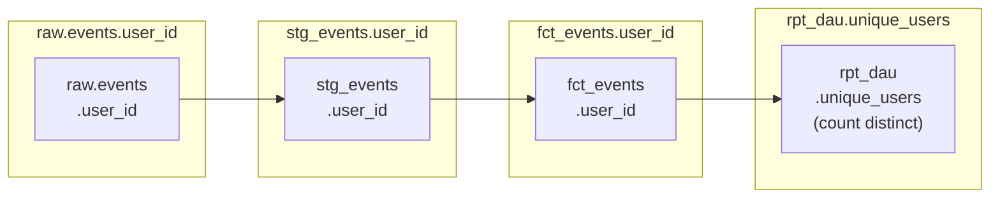

# dbt Docs: Documentation, Lineage, and the dbt Docs v2 Catalog

Documentation is not optional in a production dbt project. It is the map that lets every engineer — including you in six months — understand what every model does, where data comes from, and what breaks if you change something. dbt makes documentation a first-class citizen: it is generated from the same YAML that defines your tests and contracts, and it is always in sync with your project.

As of June 2026, dbt offers three documentation surfaces:

| Surface | Availability | Key capability |
| :--- | :--- | :--- |
| **dbt Docs (Legacy)** | dbt-core v1.x, all users | Static site, model lineage, catalog.json |
| **dbt Docs v2 (alpha)** | dbt Core v2 + Fusion | Modern UI, column-level lineage, REST API, Parquet artifacts |
| **Catalog** | dbt platform (paid) | Real-time, collaboration, custom views |

This module covers the first two — everything available to self-hosted dbt-core + Fusion users.

---

## Writing Documentation That Actually Gets Used

The gap between good and bad dbt documentation is not technical — it is discipline. Follow these rules on every model.

### Layer 1: Model-Level Descriptions

```yaml
# models/marts/facts/schema.yml
models:
  - name: fct_orders
    description: >
      One row per customer order. Grain: order_id. Built from `stg_orders`
      joined to `dim_customers`. Populated incrementally via the `merge`
      strategy on `order_id`. Used by the Revenue dashboard and the
      Customer 360 mart.

      **Owner:** Data Engineering  
      **SLA:** Updated within 30 minutes of source freshness.  
      **Downstream consumers:** `rpt_daily_revenue`, `dim_customer_ltv`,
      Tableau Revenue workbook.

    config:
      contract:
        enforced: true
      tags: ['finance', 'orders', 'tier-1']
      meta:
        owner: data-engineering
        tier: 1
        pii: false
        sla_minutes: 30
        slack_alert_channel: '#alerts-data-platform'
```

### Layer 2: Column Descriptions with Docs Blocks

For long, reusable descriptions, use `docs` blocks instead of inline strings:

```markdown
<!-- docs/orders.md -->


The unique identifier for an order, sourced from the OMS system.
Format: `ORD-XXXXXXXXXX` (10-digit zero-padded integer with prefix).
Primary key — guaranteed unique and not null by model contract.



The current lifecycle state of the order. Mapped from raw OMS status codes:

| Raw code | Display value | Terminal? |
|----------|--------------|-----------|
| P        | Pending      | No        |
| S        | Shipped      | No        |
| D        | Delivered    | Yes       |
| C        | Cancelled    | Yes       |
| RJ       | Rejected     | Yes       |

Late-arriving status updates are captured via the 3-day `lookback` window
in the incremental strategy.



Segment assigned by the CRM system. One of: Enterprise, SMB, Consumer.
Sourced from `dim_customers.customer_segment`. Snapshotted — reflects
the segment at the time of the order, not the current segment.

```

```yaml
# models/marts/facts/schema.yml
models:
  - name: fct_orders
    columns:
      - name: order_id
        description: "{{ doc('order_id') }}"
        data_tests: [not_null, unique]

      - name: status
        description: "{{ doc('order_status') }}"
        data_tests:
          - accepted_values:
              values: ['Pending', 'Shipped', 'Delivered', 'Cancelled', 'Rejected']

      - name: customer_segment
        description: "{{ doc('customer_segment') }}"
```

[!TIP]
Docs blocks in `.md` files under `docs/` are version-controlled alongside your models. They can be referenced across multiple schemas — write `{{ doc('order_id') }}` once, reuse it everywhere `order_id` appears. This is the key to consistent, maintainable documentation at scale.

### Layer 3: Source Documentation

```yaml
# models/staging/sources.yml
sources:
  - name: raw_events
    description: >
      Raw clickstream events delivered via Amazon Kinesis Data Firehose
      to S3, then loaded into Redshift via COPY. Schema is enforced
      at the Firehose delivery layer. Events are append-only — never
      updated after landing.
    tables:
      - name: events
        description: >
          Individual user events (page views, clicks, form submits).
          Partitioned by `event_date` in Redshift. Volume: ~50M rows/day.
          Raw status — no deduplication or null handling applied.
        columns:
          - name: event_id
            description: "UUID assigned by the event producer. Not guaranteed unique in raw."
          - name: event_timestamp
            description: "UTC timestamp set by the client SDK. Can be up to 5 min behind server time."
```

### Layer 4: Exposures — Document Downstream Consumers

Exposures declare what consumes your dbt models, completing the lineage picture from source to dashboard.

```yaml
# models/exposures.yml
exposures:
  - name: revenue_dashboard
    label: "Revenue Dashboard (Tableau)"
    type: dashboard
    maturity: high
    url: https://tableau.example.com/views/RevenueDashboard
    description: >
      Executive revenue dashboard. Refreshes every 30 minutes.
      Directly queries `fct_orders` and `rpt_daily_revenue`.
      Owned by the Finance Analytics team.
    depends_on:
      - ref('fct_orders')
      - ref('rpt_daily_revenue')
      - ref('dim_customers')
    owner:
      name: Finance Analytics
      email: analytics@example.com

  - name: customer_api
    label: "Customer 360 API"
    type: application
    maturity: high
    url: https://api.example.com/customer-360/docs
    description: >
      Internal REST API serving customer data to the product. Queries
      `dim_customer_ltv` directly via Redshift IAM credentials.
    depends_on:
      - ref('dim_customer_ltv')
      - ref('dim_customers')
    owner:
      name: Platform Engineering
      email: platform@example.com
```

Exposures appear in the dbt DAG, letting you trace: source → staging → mart → dashboard. This is critical for impact analysis before making breaking changes.

---

## Generating and Serving Documentation

### Generate Docs

```bash
# Full generation (compiles + introspects warehouse for column types)
dbt docs generate

# Skip compilation (faster, uses last compiled manifest)
dbt docs generate --no-compile

# Generate catalog for specific models only (useful for large projects)
dbt docs generate --select +marts

# Skip catalog (fastest; column types won't appear, but descriptions will)
dbt docs generate --empty-catalog
```

`dbt docs generate` produces two files in `target/`:

| File | Contents |
| :--- | :--- |
| `manifest.json` | Full project graph — models, tests, sources, macros, docs |
| `catalog.json` | Warehouse introspection — column types, row counts, stats |

### Serve Locally

```bash
# Start local web server (default: http://localhost:8080)
dbt docs serve

# Custom port
dbt docs serve --port 8090
```

[!WARNING]
`dbt docs serve` is for local development only — it starts an unauthenticated HTTP server. Never expose it publicly. For team-wide hosting, deploy the static files to S3 + CloudFront or an internal web server.

---

## Hosting Docs on S3 + CloudFront

```bash
# Build and upload to S3
dbt docs generate

aws s3 sync ./target/ s3://my-dbt-docs-bucket/ \
    --exclude "*" \
    --include "index.html" \
    --include "manifest.json" \
    --include "catalog.json"
```

Terraform for the CloudFront distribution:

```hcl
# infrastructure/docs_hosting.tf
resource "aws_s3_bucket" "dbt_docs" {
  bucket = "my-dbt-docs-bucket"
}

resource "aws_s3_bucket_website_configuration" "dbt_docs" {
  bucket = aws_s3_bucket.dbt_docs.id
  index_document { suffix = "index.html" }
}

resource "aws_cloudfront_distribution" "dbt_docs" {
  origin {
    domain_name = aws_s3_bucket.dbt_docs.bucket_regional_domain_name
    origin_id   = "dbt-docs-s3"

    s3_origin_config {
      origin_access_identity = aws_cloudfront_origin_access_identity.dbt_docs.cloudfront_access_identity_path
    }
  }

  enabled             = true
  default_root_object = "index.html"
  price_class         = "PriceClass_100"

  # Auth via Cognito or IP allowlist (recommended for internal tools)
  restrictions {
    geo_restriction { restriction_type = "none" }
  }

  viewer_certificate {
    acm_certificate_arn = var.acm_cert_arn
    ssl_support_method  = "sni-only"
  }
}
```

Add docs generation to your CD pipeline:

```yaml
# .github/workflows/dbt-cd.yml (addition)
- name: Generate and upload docs
  run: |
    dbt docs generate --no-compile   # manifest already exists from dbt build
    aws s3 sync ./target/ s3://${{ env.DBT_DOCS_BUCKET }}/ \
      --include "index.html" \
      --include "manifest.json" \
      --include "catalog.json"
    aws cloudfront create-invalidation \
      --distribution-id ${{ secrets.CLOUDFRONT_DIST_ID }} \
      --paths "/*"
```

---

## dbt Docs v2 (Alpha — dbt Core v2 + Fusion)

<cite index="96-1">dbt Docs v2 is a modern, performant open-source catalog with a redesigned UI, Semantic Layer metadata, column-level lineage, and a REST API. It is available with the dbt Fusion engine and dbt Core v2.</cite>

### Key differences from legacy dbt Docs

| Feature | dbt Docs (Legacy) | dbt Docs v2 |
| :--- | :--- | :--- |
| Artifact format | `manifest.json` + `catalog.json` (large JSON) | Parquet artifacts (queryable via DuckDB) |
| Column-level lineage | No | Yes — powered by Fusion SQL parsing |
| Project scale | Struggles at 1,000+ models | Scales to arbitrary project size |
| REST API | No | Yes |
| UI | v1 (functional) | Redesigned (faster, filterable) |

### Parquet Artifacts

<cite index="71-1">dbt v2.0 can emit Parquet artifacts as a high-performance alternative to large JSON files like manifest.json. Because they're Parquet, you can query them directly through DuckDB — a big deal for metadata tooling and AI workflows. The local docs experience has been rebuilt, powered by those new Parquet artifacts, and is now capable of scaling to projects of arbitrary size — a long-standing pain point for large dbt deployments.</cite>

Query artifacts directly with DuckDB:

```bash
# Install DuckDB
pip install duckdb

# Query the Parquet manifest from your dbt project
python3 -c "
import duckdb
con = duckdb.connect()

# List all models with their descriptions
con.execute(\"\"\"
    SELECT
        name,
        description,
        config.materialized AS materialization,
        config.schema AS schema_name
    FROM read_parquet('target/manifest.parquet')
    WHERE resource_type = 'model'
    ORDER BY schema_name, name
\"\"\").df().to_string()
"
```

### Column-Level Lineage

With the Fusion engine, dbt Docs v2 shows which source columns flow into which mart columns — through every transformation step. This is powered by Fusion's native SQL parsing:



Column-level lineage enables:
- **Impact analysis**: "If I rename `user_id` in the raw table, what breaks?"
- **Data origin tracing**: "Where does this KPI's numerator actually come from?"
- **Privacy auditing**: "Which columns contain PII and where do they flow?"

---

## Documentation Coverage Enforcement

Use `dbt-project-evaluator` to enforce documentation standards:

```yaml
# packages.yml
packages:
  - package: dbt-labs/dbt_project_evaluator
    version: 0.13.0
```

```bash
dbt build --select package:dbt_project_evaluator
```

This generates models like `fct_undocumented_models`, `fct_missing_primary_key_tests`, and `fct_model_fanout` — tables you can query or alert on in CI.

Custom thresholds in `dbt_project_evaluator.yml`:

```yaml
vars:
  dbt_project_evaluator:
    # Fail CI if documentation coverage drops below 80%
    documentation_coverage_target: 80

    # Flag models with more than 5 parents (DAG complexity smell)
    max_fanout_models: 5

    # Require all mart models to have at least one test
    marts_without_tests: error
```

---

## 5 Practice Questions

```question
{
  "id": "dbt-rs-09-q1",
  "type": "multiple-choice",
  "question": "What is a `docs` block and where should it be stored in a dbt project?",
  "options": [
    "A Python docstring in a macro file, stored in macros/",
    "A Jinja markdown block in a .md file under the docs-paths directory, referenced with {{ doc('name') }}",
    "A JSON object in schema.yml describing model metadata",
    "A comment block at the top of a SQL model file"
  ],
  "correct": 1,
  "explanation": "Docs blocks are Jinja markdown blocks written inside ... in .md files under the docs-paths directory. They are referenced in YAML with {{ doc('name') }} and allow reusable, formatted descriptions across multiple models."
}
```

```question
{
  "id": "dbt-rs-09-q2",
  "type": "multiple-choice",
  "question": "What do `exposures` add to dbt's lineage graph?",
  "options": [
    "Additional source tables not covered by sources.yml",
    "Downstream consumers (dashboards, APIs, apps) that depend on dbt models, completing the source-to-consumer lineage",
    "External macros imported from packages",
    "Redshift external tables via Spectrum"
  ],
  "correct": 1,
  "explanation": "Exposures declare downstream consumers — dashboards, APIs, ML models — that depend on dbt mart models. They appear in the DAG, enabling full end-to-end lineage tracing from raw source to business consumer."
}
```

```question
{
  "id": "dbt-rs-09-q3",
  "type": "multiple-choice",
  "question": "Which dbt docs generate flag gives the fastest execution during development, at the cost of not showing column types in the UI?",
  "options": [
    "--no-compile",
    "--empty-catalog",
    "--select staging",
    "--fast"
  ],
  "correct": 1,
  "explanation": "--empty-catalog skips the warehouse introspection step that populates catalog.json. This removes column type and row count metadata from the docs site but is significantly faster — useful during development when column types are already known."
}
```

```question
{
  "id": "dbt-rs-09-q4",
  "type": "multiple-choice",
  "question": "What enables column-level lineage in dbt Docs v2, and why can't dbt Core v1 provide it?",
  "options": [
    "A dbt-redshift adapter plugin; v1 lacks Redshift integration",
    "The dbt Fusion engine's native SQL parsing; Core v1 renders Jinja but does not parse SQL ASTs to trace column flows",
    "A CloudFront Lambda@Edge function that analyzes query logs",
    "The catalog.json file, which v1 also generates but in an incompatible format"
  ],
  "correct": 1,
  "explanation": "Column-level lineage requires parsing SQL to build an Abstract Syntax Tree (AST) and trace each column's origin. The Fusion engine does this natively across multiple SQL dialects. dbt Core v1 only renders Jinja into SQL strings — it does not parse SQL ASTs."
}
```

```question
{
  "id": "dbt-rs-09-q5",
  "type": "multiple-choice",
  "question": "Why is `dbt docs serve` not appropriate for team-wide documentation sharing?",
  "options": [
    "It only generates documentation for the staging layer",
    "It starts an unauthenticated HTTP server — it must not be exposed publicly",
    "It requires a paid dbt platform license",
    "It is too slow for multi-user access"
  ],
  "correct": 1,
  "explanation": "dbt docs serve is designed for local development use only. It serves files over an unauthenticated HTTP server. For team access, deploy the generated static files (index.html, manifest.json, catalog.json) to S3 + CloudFront with appropriate access controls."
}
```

```question
{
  "id": "dbt-rs-09-q6",
  "type": "multiple-choice",
  "question": "The dbt-project-evaluator package generates models like `fct_undocumented_models`. How should you use this in CI?",
  "options": [
    "Run dbt build --select package:dbt_project_evaluator and alert if any evaluator models contain rows",
    "Manually review the generated models after each production run",
    "Use it only during development, never in CI",
    "It is only compatible with dbt Cloud orchestration"
  ],
  "correct": 0,
  "explanation": "dbt-project-evaluator materializes findings as tables. Running it in CI and failing the build if evaluator tables contain rows (via a singular test or a separate check step) enforces documentation and test coverage standards automatically."
}
```

---

[!SUCCESS]
### Key Takeaways

- Write descriptions at three levels: model (what, why, who owns it), column (exact semantics, format, source), and source (raw data characteristics, volume, latency).
- Use `docs` blocks in `.md` files for long, reusable descriptions — reference them with `{{ doc('name') }}` to avoid repetition.
- `exposures` complete your lineage by adding downstream consumers (dashboards, APIs, apps) to the DAG.
- `dbt docs generate` produces `manifest.json` (project graph) and `catalog.json` (warehouse introspection). Host the static site on S3 + CloudFront for team-wide access.
- dbt Docs v2 (available with dbt Core v2 / Fusion) introduces Parquet artifacts, column-level lineage, and a REST API — queryable directly with DuckDB.
- `dbt-project-evaluator` enforces documentation coverage and DAG quality standards in CI — run it as part of your quality gate.