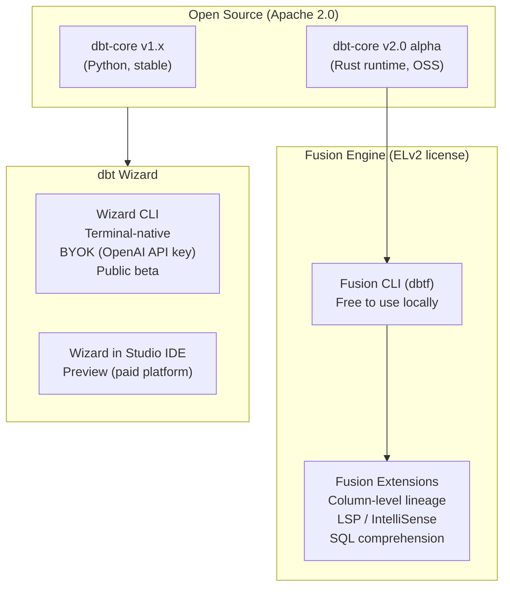
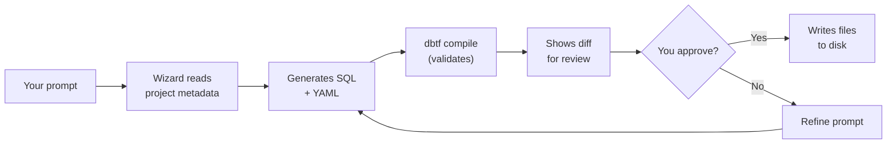
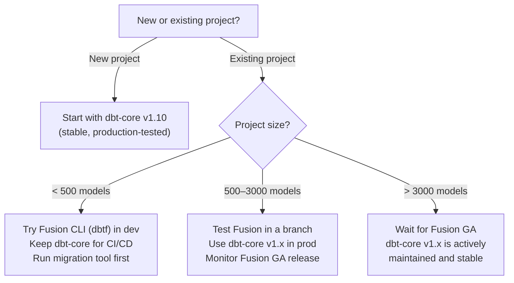

# dbt Fusion Engine and dbt Wizard

The analytics engineering toolchain is undergoing its most significant shift since dbt itself was created. Two technologies define this new era: the **dbt Fusion engine** — a Rust-based rewrite that replaces the Python execution layer with SQL-aware, dramatically faster compilation — and **dbt Wizard** — an AI agent that understands your full dbt project before it writes a single line. Both are available to self-hosted, open-source dbt users.

---

## The Ecosystem in June 2026

Before diving into installation, understand the current landscape:



<cite index="79-1">dbt Core v2 is the open-source Apache 2.0 foundation that the dbt Fusion engine builds on. It delivers a faster, Rust-based runtime while preserving the dbt experience practitioners already know. It is currently in alpha.</cite>

<cite index="78-1">dbt Fusion is distributed under the Elastic License Version 2 (ELv2). dbt Core remains under the open-source Apache 2.0 license and will continue to be maintained indefinitely.</cite>

**What this means for self-hosted dbt-Redshift users:**
- You can install the **Fusion CLI** (`dbtf`) for free — get faster parsing and compilation without any license restrictions for self-hosted use.
- **dbt Wizard CLI** is in public beta and free to use with your own OpenAI API key (BYOK).
- dbt-core v1.x continues to be fully supported and is the production-stable choice for large projects.

---

## dbt Fusion Engine

### What Fusion Changes

<cite index="74-1">The dbt Fusion engine gives your team up to 30x faster performance and comes with different features depending on where you use it. It powers both engine-level improvements (like faster compilation and incremental builds) and editor-level features (like IntelliSense, hover info, and inline errors) through the LSP through the dbt VS Code extension.</cite>

| Capability | dbt-core v1.x | dbt-core v2 (Rust OSS) | Fusion engine |
| :--- | :--- | :--- | :--- |
| Parse speed | Baseline | Up to 30× faster | Up to 30× faster |
| SQL rendering (Jinja) | ✅ | ✅ | ✅ |
| SQL parsing (AST) | ❌ | Partial | ✅ |
| Column-level lineage | ❌ | Partial | ✅ |
| LSP / IntelliSense | ❌ | ❌ | ✅ (via VS Code extension) |
| Parquet artifacts | ❌ | ✅ | ✅ |
| Strict config validation | ❌ | ✅ | ✅ |
| License | Apache 2.0 | Apache 2.0 | ELv2 |

<cite index="71-1">v2.0 introduces a strict, well-defined language specification. It becomes impossible to silently misconfigure a key — a typo'd `desciptin` instead of `description` is caught rather than ignored.</cite>

### Redshift Adapter in Fusion

<cite index="109-1">The Fusion engine launched support for Redshift (along with Snowflake, Databricks, and BigQuery) as part of the preview release.</cite> The Redshift ADBC driver was released in September 2025, replacing the Python `redshift-connector` with an Arrow-native data transfer layer.

<cite index="111-1">For BigQuery and Redshift, Fusion respects user-set threads to manage rate limits and concurrency constraints. Setting `--threads 0` or omitting the setting allows Fusion to dynamically optimize.</cite>

### Installing the Fusion CLI

```bash
# macOS / Linux — one-line installer
curl -fsSL https://fusion.getdbt.com/install.sh | sh

# Reload shell after installation
source ~/.zshrc   # or ~/.bashrc

# Verify — Fusion installs as both 'dbt' and 'dbtf'
dbtf --version
# dbt Fusion 1.0.0-preview (Rust runtime)

# If you have dbt-core installed, use dbtf to avoid conflicts
dbtf --version    # Fusion
dbt --version     # dbt-core (unchanged)
```

On Windows (PowerShell):

```powershell
# Windows installer
iwr -useb https://fusion.getdbt.com/install.ps1 | iex

# Verify
dbtf --version
```

### Running Fusion Against Redshift

Your existing `profiles.yml` works without modification — Fusion reads the same file:

```bash
# Same commands, dramatically faster parse + compile
dbtf debug                          # test connection
dbtf compile --select staging       # compile without running
dbtf run --select +fct_orders       # run models
dbtf test --select marts            # run tests
dbtf build --select +marts          # build + test in DAG order
```

### Fusion-Specific Features on Redshift

#### 1. Strict Key Validation

Fusion catches typos in YAML configs that dbt-core v1.x silently ignores:

```yaml
# This silently does nothing in dbt-core v1.x
# Fusion raises an error: "Unknown config key 'destription'"
models:
  - name: fct_orders
    destription: "One row per order"    # ← typo caught by Fusion
    config:
      materialzed: table               # ← typo caught by Fusion
```

#### 2. `--sample` Flag (Fusion preview)

Run your full SQL logic against a sample of rows — without modifying your models:

```bash
# Run fct_orders against 1% sample of upstream data
dbtf run --select fct_orders --sample 0.01

# Use for fast iteration during model development
dbtf build --select +new_mart_model --sample 0.05
```

This is particularly useful for Redshift Serverless where scanning full tables during development incurs unnecessary cost.

#### 3. Incremental Builds (Fusion State Cache)

<cite index="83-1">dbt State (preview) acts as a caching layer for data pipelines, building only what has changed. The company claims this can reduce infrastructure costs by 30 percent or more.</cite>

Fusion maintains a local state cache that tracks which models need rebuilding — like Slim CI, but for local development:

```bash
# First run — builds everything, saves state
dbtf run --select +marts

# Second run — only rebuilds models whose SQL changed
dbtf run --select +marts --state ./target
# Output: 3 models changed, 47 models skipped (cached)
```

#### 4. VS Code Extension for Redshift Development

Install the dbt VS Code extension for Fusion-powered IDE features:

```
1. Open VS Code
2. Extensions → search "dbt Power User" or "dbt (official)"  
3. Install the official dbt Labs extension
4. Open your dbt project folder
5. The extension auto-detects Fusion if dbtf is in PATH
```

Features active on Redshift:
- **IntelliSense**: `{{ ref('` autocompletes with model names from your project
- **Hover info**: hover over a `ref()` to see the model's description and columns
- **Inline errors**: typos in YAML and broken `ref()` calls highlighted without running
- **Column lineage**: click a column to trace it upstream/downstream

#### 5. Parquet Artifacts for Metadata Queries

With Fusion, `manifest.json` and `catalog.json` are also emitted as Parquet:

```python
# Query your dbt project metadata with DuckDB — no JSON parsing needed
import duckdb

con = duckdb.connect()

# Find all models over 60 seconds in the last run
slow_models = con.execute("""
    SELECT
        name,
        execution_time_seconds,
        schema_name,
        materialization
    FROM read_parquet('target/run_results.parquet')
    WHERE resource_type = 'model'
      AND execution_time_seconds > 60
    ORDER BY execution_time_seconds DESC
""").df()

print(slow_models.to_string())
```

---

## dbt Wizard CLI

### What dbt Wizard Is (and Is Not)

<cite index="81-1">The dbt Wizard CLI is a terminal-native AI agent purpose-built for analytics engineers. Unlike general-purpose coding agents that hallucinate joins, break downstream refs, and ignore your contracts, Wizard is grounded in your dbt project's compiled state, lineage graph, and semantic definitions from the first prompt.</cite>

<cite index="88-1">dbt Wizard is an AI agent purpose-built for governed data development in dbt. Unlike general-purpose coding agents, it understands your dbt project through a native metadata engine — a structured index of lineage, model health, tests, contracts, run results, and semantic definitions. Think of it like a map of your city: dbt Wizard knows how everything connects before it starts, rather than walking every street to figure out the layout.</cite>

The key difference from using Claude, Copilot, or Cursor in a dbt project:

| Capability | General AI coding agent | dbt Wizard |
| :--- | :--- | :--- |
| Knows your model grain | No | Yes |
| Respects model contracts | No | Yes |
| Understands ref() lineage | No | Yes |
| Validates changes before showing diff | No | Yes |
| Knows your MetricFlow definitions | No | Yes |
| Updates downstream refs on rename | No | Yes |

<cite index="86-1">Of the latest set of 75 ADE-bench tasks, dbt Wizard scores 76% and showed significant improvement on hard tasks over other agentic systems. The native understanding of dbt projects dramatically improves agent performance, especially as project sizes increase.</cite>

### Installing Wizard CLI

```bash
# Install via pip (uses your own OpenAI API key — BYOK)
pip install dbt-wizard

# Configure your API key
wizard providers configure openai
# Enter your OPENAI_API_KEY when prompted

# Verify
wizard --version
```

### Core Wizard CLI Commands

```bash
# Get a project overview — Wizard reads your full project state first
wizard /overview

# List available commands
wizard /

# Start an interactive session (recommended for complex tasks)
wizard
```

### Use Case 1: Building a New Model

```bash
# In your dbt project directory
wizard

> Build a new fact table fct_customer_revenue that aggregates
> total revenue, order count, and average order value per customer
> per month. It should join fct_orders with dim_customers. Use
> the customer_id distribution key. Include a model contract.

# Wizard:
# 1. Reads your project manifest to find fct_orders and dim_customers
# 2. Checks their schemas (columns, types, contracts)
# 3. Writes the model SQL
# 4. Writes the schema.yml with contract and tests
# 5. Compiles and validates before showing you the diff
# 6. Waits for your review before writing files
```

Wizard output workflow:



### Use Case 2: Refactoring an Existing Model

```bash
wizard

> Refactor stg_orders to rename the column raw_status to status_code,
> then update fct_orders and any other downstream models that reference
> raw_status. Also update all tests and documentation.

# Wizard:
# 1. Finds all models downstream of stg_orders using lineage graph
# 2. Identifies every reference to raw_status
# 3. Updates stg_orders, fct_orders, and all affected YAML files
# 4. Compiles the full affected subgraph to validate
# 5. Shows a multi-file diff
```

### Use Case 3: Investigating a Failure

```bash
wizard

> The last dbt run failed on fct_orders with a unique test failure.
> Investigate and suggest fixes.

# Wizard:
# 1. Reads run_results.json from ./target/
# 2. Identifies the failing test and which rows caused it
# 3. Traces back through the lineage to find likely causes
# 4. Suggests fixes (deduplication logic, source data issue, etc.)
```

### Use Case 4: Generating Documentation

```bash
wizard

> Generate missing column descriptions for fct_orders. Use context
> from upstream models and existing descriptions where available.

# Wizard:
# 1. Reads fct_orders schema to find undocumented columns
# 2. Traces each column back to its source via lineage
# 3. Reads existing descriptions from upstream models
# 4. Generates context-aware descriptions
# 5. Writes to schema.yml after your approval
```

### Use Case 5: Writing Unit Tests

```bash
wizard

> Write unit tests for the status mapping logic in fct_orders.
> Cover all raw status codes including edge cases like null and
> unexpected values.

# Wizard:
# 1. Reads the model SQL to understand the mapping logic
# 2. Reads the contract to understand expected output types
# 3. Generates the unit_tests YAML block with given/expect rows
# 4. Validates the tests compile before showing the diff
```

### Wizard Configuration: Project Instructions

Give Wizard standing instructions for your project so every session starts with context:

```markdown
<!-- .dbt-wizard/instructions.md -->
# Project: Analytics Platform

## Conventions
- All mart models must have a model contract enforced: true
- Distribution key should match the primary join key
- All fact tables use compound sort key with the date column first
- Status columns map raw codes using the seed/status_mapping.csv reference
- All new models require at least: not_null, unique tests on PK
- Use docs blocks for descriptions longer than one sentence

## Naming
- Staging: stg_<source>_<entity> (e.g., stg_oms_orders)
- Intermediate: int_<entity>_<transformation> (e.g., int_orders_enriched)
- Marts: fct_<entity> (facts), dim_<entity> (dimensions), rpt_<entity> (reports)

## Redshift Config Defaults
- Staging: materialized=view, bind=false, backup=false
- Marts/Facts: materialized=table, backup=true
- Reporting: materialized=materialized_view, auto_refresh=true

## Do Not
- Do not use SELECT * in mart models — list columns explicitly
- Do not join raw sources directly in mart models
- Do not hardcode schema names — use ref() and source()
```

```bash
# Wizard reads this file automatically at the start of each session
wizard /overview
# "Reading project instructions from .dbt-wizard/instructions.md..."
```

### Wizard Threads: Organized Long-Running Work

For multi-session work (e.g., a migration that spans days), use named threads:

```bash
# Start a named thread
wizard --thread "redshift-to-serverless-migration"

> We're migrating 150 models from provisioned Redshift to Serverless.
> Start with the staging layer. Update all profiles and configs.

# Resume the thread in a future session
wizard --thread "redshift-to-serverless-migration" --resume
```

---

## When to Use Fusion vs. dbt-core v1.x



<cite index="78-1">For large dbt Core infrastructures (over 3000 models): It is probably safer to wait for the final version (General Availability). The risk of losing critical features is still too high. For small and medium-sized projects (up to 500 models): It is strongly recommended that you test the migration tool in a development environment.</cite>

### Fusion Migration Checklist

```bash
# 1. Install Fusion CLI
curl -fsSL https://fusion.getdbt.com/install.sh | sh

# 2. Run the built-in migration audit tool
dbtf migrate audit --project-dir .

# Output: list of issues to fix before Fusion is fully compatible
# Common issues on Redshift projects:
# - Interleaved sort keys (unsupported in Fusion DDL currently)
# - Some custom materializations using internal dbt-core Python APIs
# - Macros using run_query() without execute guard

# 3. Fix flagged issues, then verify
dbtf compile --select staging

# 4. Compare output with dbt-core v1.x
dbt compile --select staging --target dev > /tmp/core_compiled.txt
dbtf compile --select staging --target dev > /tmp/fusion_compiled.txt
diff /tmp/core_compiled.txt /tmp/fusion_compiled.txt
```

---

## 5 Practice Questions

```question
{
  "id": "dbt-rs-11-q1",
  "type": "multiple-choice",
  "question": "What license is the dbt Fusion engine distributed under, and what restriction does it impose?",
  "options": [
    "Apache 2.0 — no restrictions",
    "MIT — attribution required",
    "ELv2 (Elastic License v2) — you cannot use it to host a managed service that competes with dbt Labs",
    "GPL v3 — all derivative works must be open source"
  ],
  "correct": 2,
  "explanation": "The dbt Fusion engine uses the Elastic License v2 (ELv2). You can use it freely for local development and self-hosted workflows, but you cannot use it to build a managed service that competes with dbt Labs. dbt-core remains Apache 2.0."
}
```

```question
{
  "id": "dbt-rs-11-q2",
  "type": "multiple-choice",
  "question": "On Amazon Redshift, how does Fusion handle thread parallelism differently from Snowflake?",
  "options": [
    "Fusion ignores the threads setting on Redshift and auto-optimizes like Snowflake",
    "Fusion respects user-set threads on Redshift to manage rate limits; setting threads=0 lets Fusion dynamically optimize",
    "Fusion uses a fixed 8 threads on Redshift regardless of configuration",
    "Fusion requires threads to be set higher than 16 on Redshift Serverless"
  ],
  "correct": 1,
  "explanation": "Fusion auto-optimizes parallelism for Snowflake and Databricks. For Redshift (and BigQuery), it respects user-set threads to manage concurrency constraints. Setting threads=0 enables dynamic optimization."
}
```

```question
{
  "id": "dbt-rs-11-q3",
  "type": "multiple-choice",
  "question": "What does the `--sample 0.01` flag in the Fusion CLI do?",
  "options": [
    "Runs only 1% of the selected models",
    "Executes model SQL against a 1% statistical sample of upstream data without modifying model definitions",
    "Reduces the thread count to 1% of the configured value",
    "Generates documentation for 1% of models for faster preview"
  ],
  "correct": 1,
  "explanation": "The --sample flag runs your SQL against a fraction of the upstream data. This enables fast iteration on model logic during development without the cost of scanning full tables — particularly valuable on Redshift Serverless."
}
```

```question
{
  "id": "dbt-rs-11-q4",
  "type": "multiple-choice",
  "question": "What fundamentally separates dbt Wizard from using a general-purpose AI assistant (Claude, Copilot, Cursor) in a dbt project?",
  "options": [
    "dbt Wizard uses a more powerful LLM model",
    "dbt Wizard reads a native metadata engine built from your project's compiled state, lineage, contracts, tests, and run results — and validates changes before presenting them",
    "dbt Wizard only works with dbt Cloud, not dbt-core",
    "dbt Wizard generates Python models instead of SQL"
  ],
  "correct": 1,
  "explanation": "General AI assistants have no knowledge of your dbt project structure. Wizard builds a structured index of your project's lineage, grain, contracts, tests, and run history before responding — and compiles/validates generated changes before showing you a diff."
}
```

```question
{
  "id": "dbt-rs-11-q5",
  "type": "multiple-choice",
  "question": "What is the purpose of `.dbt-wizard/instructions.md` in a project?",
  "options": [
    "It replaces the dbt_project.yml configuration file",
    "It provides Wizard with standing project conventions (naming, config defaults, coding rules) that are loaded at the start of every session",
    "It logs all Wizard interactions for compliance auditing",
    "It configures which OpenAI model Wizard uses"
  ],
  "correct": 1,
  "explanation": "The instructions file gives Wizard persistent context about your project's conventions — naming patterns, materialization defaults, testing requirements, coding rules. Without it, Wizard must re-learn your conventions every session."
}
```

```question
{
  "id": "dbt-rs-11-q6",
  "type": "multiple-choice",
  "question": "For a production dbt-Redshift project with 800 models, what is the recommended approach to Fusion adoption as of June 2026?",
  "options": [
    "Immediately migrate everything to Fusion — it is production-ready for all sizes",
    "Test Fusion CLI in a development branch, use dbt-core v1.x in production CI/CD, and monitor progress toward Fusion GA",
    "Wait until Fusion reaches version 2.0 before testing",
    "Fusion is not yet compatible with Redshift — use dbt-core only"
  ],
  "correct": 1,
  "explanation": "At 800 models, the recommended approach is to use Fusion locally for development speed benefits while keeping the production CI/CD pipeline on stable dbt-core v1.x. Run the migration audit tool, fix any incompatibilities, and plan cutover as Fusion approaches GA."
}
```

---

[!SUCCESS]
### Key Takeaways

- The dbt Fusion engine is a Rust-based rewrite offering up to 30× faster parse and compile times. It ships as a free binary CLI (`dbtf`) under the ELv2 license.
- dbt-core v2.0 (Apache 2.0, currently alpha) is the open-source Rust foundation Fusion builds on — it includes strict key validation, Parquet artifacts, and faster parsing.
- The Redshift ADBC driver shipped in September 2025 — Fusion is production-compatible with Redshift provisioned clusters and Serverless.
- On Redshift, set `--threads 0` or respect user-set threads (unlike Snowflake, where Fusion auto-optimizes). Use `--sample` to develop against data subsets.
- dbt Wizard CLI is a terminal-native AI agent grounded in your project's compiled state, lineage, contracts, and run results — not a generic coding assistant.
- Wizard validates changes by compiling them before presenting a diff, preventing broken refs and contract violations from reaching your codebase.
- For projects under 500 models, test Fusion now. For 500–3,000 models, use Fusion in development and dbt-core v1.x in production. Above 3,000 models, wait for GA.
- Write `.dbt-wizard/instructions.md` to give Wizard persistent knowledge of your naming conventions, config defaults, and coding rules.