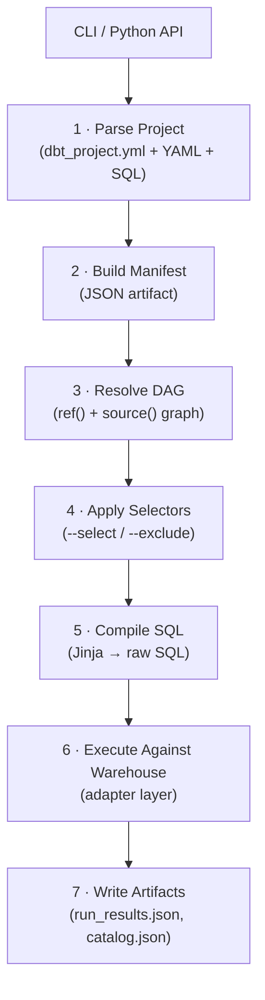
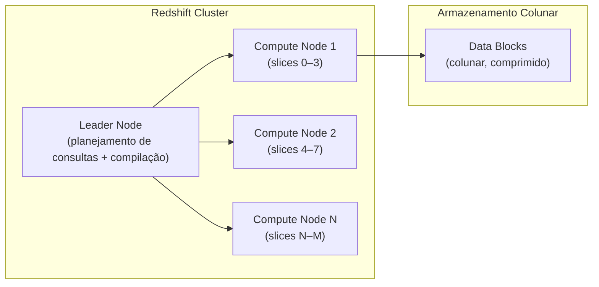

# Arquitetura do dbt-core e o Adapter dbt-redshift

Antes de ajustar modelos, escrever macros avançadas ou orquestrar pipelines, você precisa de um modelo mental claro do que acontece quando executa `dbt run`. Este módulo mapeia o pipeline de execução interna do dbt-core sobre a arquitetura do Amazon Redshift para que cada escolha que você fizer posteriormente tenha uma razão fundamentada.

O dbt-core é um compilador SQL que transforma seus modelos escritos em Jinja (SQL com templates) em SQL nativo do warehouse, gerencia dependências entre modelos através de um DAG (Directed Acyclic Graph) e executa as transformações na ordem correta. Tudo isso acontece através de um pipeline deterministico e reproduzível.

---

## Como o dbt-core Executa uma Execução

O dbt-core segue um pipeline determinístico toda vez que você invoca um comando:



Cada etapa tem um propósito específico:

1. **Parse Project**: O dbt lê e valida `dbt_project.yml`, arquivos YAML de schema e modelos SQL. É aqui que erros de sintaxe são detectados precocemente.
2. **Build Manifest**: Constrói um manifesto JSON contendo todos os recursos do projeto (modelos, testes, fontes, macros, etc.).
3. **Resolve DAG**: Resolve as chamadas `ref()` e `source()` para construir o grafo de dependências. Isso determina a ordem de execução.
4. **Apply Selectors**: Filtra quais modelos serão executados com base nos seletores fornecidos (`--select`, `--exclude`).
5. **Compile SQL**: Converte modelos Jinja em SQL puro do warehouse. Toda a lógica condicional, loops e macros são resolvidos aqui.
6. **Execute Against Warehouse**: Envia o SQL compilado para o Redshift através da camada de adapter. Esta é a etapa que realmente toca o banco de dados.
7. **Write Artifacts**: Salva metadados da execução (tempo, status, erros) em arquivos JSON para auditoria e reuso.

A **camada de adapter** (etapa 6) é o que isola suas transformações SQL do DDL específico do warehouse. `dbt-redshift` implementa essa camada para o Amazon Redshift.

[!NOTE]
A partir do **dbt-core v2.0** (Junho de 2026), as etapas de parse e compilação rodam em um motor baseado em Rust compartilhado com o dbt Fusion. Os tempos de parse em projetos grandes caíram em até **30×** comparado ao dbt-core v1.x. Mesmo se você estiver na v1.10 ou v1.11, você se beneficia de melhorias parciais introduzidas via back-ports.

---

## O Protocolo de Adapter

Cada adapter implementa um conjunto de interfaces definidas em `dbt-adapters`:

| Interface | O que faz | Implementação Redshift |
| :--- | :--- | :--- |
| `SQLAdapter` | Executar SQL puro, buscar resultados | `redshift-connector` (ADBC no Fusion) |
| `Relation` | Representar tabelas, views, materialized views | Adiciona flags `late_binding`, `backup` |
| `Column` | Mapear tipos do warehouse para tipos dbt | Mapeamento específico de tipos Redshift |
| `Credentials` | Autenticar e conectar | IAM, senha, IAM Identity Center |
| `ConnectionManager` | Pool e reuso de conexões | `keepalives_idle`, opções SSL |

O protocolo de adapter segue o padrão de **plugins** do dbt-core. Isso significa que qualquer pessoa pode implementar um adapter para um novo warehouse sem modificar o núcleo do dbt. Você pode pensar no adapter como uma "camada de tradução" que converte comandos genéricos do dbt em SQL específico do Redshift.

[!IMPORTANT]
Em Setembro de 2025, o repositório `dbt-redshift` foi **arquivado e mesclado** em [`dbt-labs/dbt-adapters`](https://github.com/dbt-labs/dbt-adapters). Todas as issues e PRs futuros devem ser enviados para lá. O pacote PyPI `dbt-redshift` continua sendo publicado sob o mesmo nome — apenas o repositório fonte mudou.

---

## Instalando dbt-redshift

```bash
# Última versão estável (segue dbt-core 1.10.x)
pip install dbt-redshift==1.10.1

# Para dbt-core 1.11 (release candidate em Junho de 2026)
pip install dbt-redshift==1.11.0rc3

# Fixar versões específicas para reprodutibilidade
pip install "dbt-core==1.10.4" "dbt-redshift==1.10.1"
```

Sempre fixe `dbt-core` e `dbt-redshift` na **mesma versão minor** em `requirements.txt`. Versões minor diferentes frequentemente causam falhas sutis em tempo de execução porque o protocolo de adapter evolui entre versões.

---

## profiles.yml — Métodos de Conexão

O dbt-redshift suporta quatro métodos de autenticação. Escolha aquele que se adequa à sua postura de segurança:

### Método 1: Usuário + Senha (mais simples, não recomendado para produção)

```yaml
# ~/.dbt/profiles.yml
my_redshift:
  target: dev
  outputs:
    dev:
      type: redshift
      host: my-cluster.abc123.us-east-1.redshift.amazonaws.com
      port: 5439
      user: analytics_user
      password: "{{ env_var('DBT_REDSHIFT_PASSWORD') }}"
      dbname: analytics
      schema: dbt_dev
      threads: 4
      keepalives_idle: 240
      connect_timeout: 30
      sslmode: require
```

### Método 2: IAM Role (recomendado para EC2, ECS, Lambda)

```yaml
my_redshift:
  target: prod
  outputs:
    prod:
      type: redshift
      method: iam
      host: my-cluster.abc123.us-east-1.redshift.amazonaws.com
      port: 5439
      user: analytics_user
      dbname: analytics
      schema: dbt_prod
      cluster_id: my-cluster          # necessário para IAM
      region: us-east-1
      iam_profile: dbt-prod-profile   # opcional: perfil AWS nomeado
      threads: 8
      keepalives_idle: 240
```

### Método 3: IAM Identity Center (Browser SSO, adicionado no dbt-redshift 1.9.x)

```yaml
my_redshift:
  target: dev
  outputs:
    dev:
      type: redshift
      method: browser_identity_center
      host: my-cluster.abc123.us-east-1.redshift.amazonaws.com
      port: 5439
      dbname: analytics
      schema: dbt_dev
      iam_idp_arn: arn:aws:iam::123456789012:saml-provider/MyIdP
      iam_role_arn: arn:aws:iam::123456789012:role/RedshiftAnalyticsRole
      threads: 4
      region: us-east-1
```

### Método 4: Redshift Serverless

```yaml
my_redshift:
  target: serverless
  outputs:
    serverless:
      type: redshift
      method: iam                      # autenticação via IAM Role
      host: my-workgroup.abc123.us-east-1.redshift-serverless.amazonaws.com
      port: 5439
      dbname: analytics
      schema: dbt_prod
      iam_role_arn: arn:aws:iam::123456789012:role/RedshiftServerlessRole
      threads: 16                      # Serverless escala dinamicamente
      region: us-east-1
```

[!TIP]
O Redshift Serverless não possui `cluster_id`. Remova esse campo e use `iam_role_arn`. A IAM Role especificada deve ter permissões `redshift-serverless:GetCredentials`.

---

## dbt_project.yml — Configuração Base do Projeto

```yaml
# dbt_project.yml
name: 'my_analytics'
version: '1.0.0'
config-version: 2

profile: 'my_redshift'

model-paths: ["models"]
analysis-paths: ["analyses"]
test-paths: ["tests"]
seed-paths: ["seeds"]
macro-paths: ["macros"]
snapshot-paths: ["snapshots"]
docs-paths: ["docs"]

target-path: "target"
clean-targets: ["target", "dbt_packages"]

# Padrões específicos Redshift para todos os modelos
models:
  my_analytics:
    # Camada staging: views (rápidas de reconstruir, sem custo de armazenamento)
    staging:
      +materialized: view
      +bind: false              # late-binding views para todo staging
      +schema: staging

    # Camada intermediate: efêmera ou views
    intermediate:
      +materialized: ephemeral

    # Camada marts: tabelas com configurações de performance Redshift
    marts:
      +materialized: table
      +dist: even               # dist style padrão para tabelas mart
      +sort_type: auto          # sort automático para simplicidade
      +schema: marts
      +contract:
        enforced: true          # forçar contratos de modelo nos marts

# Flags de comportamento (dbt-core 1.9+)
flags:
  require_batched_execution_for_custom_microbatch_strategy: false
  source_freshness_run_project_hooks: false
```

A seção `models` em `dbt_project.yml` segue uma hierarquia de precedência. As configurações mais específicas (nível de modelo) sobrescrevem as mais gerais (nível de diretório ou projeto). Isso permite definir padrões sensatos no projeto e fazer override caso a caso quando necessário.

---

## Suporte Cross-Database com Datasharing (dbt-redshift 1.11+)

A partir do `dbt-redshift v1.11.0rc1`, você pode habilitar o Redshift Datasharing para materializar modelos em um banco de dados ou cluster diferente:

```yaml
# profiles.yml
my_redshift:
  target: prod
  outputs:
    prod:
      type: redshift
      method: iam
      host: my-cluster.abc123.us-east-1.redshift.amazonaws.com
      port: 5439
      dbname: primary_db
      schema: dbt_prod
      datasharing: true          # ← habilita suporte cross-database
      threads: 8
      region: us-east-1
```

Com `datasharing: true`, o dbt-redshift troca as consultas de metadados das views `pg_*` / `information_schema` para comandos nativos `SHOW` do Redshift, que retornam objetos cross-database e cross-cluster.

Isso é útil em cenários onde diferentes equipes mantêm dados em clusters Redshift separados e precisam compartilhar dados sem copiá-los fisicamente. O Datasharing permite criar uma camada de dados virtualizada.

```sql
-- model: models/marts/fct_orders.sql
{{ config(
    materialized='table',
    database='consumer_db',   -- materializar em um banco de dados diferente
    schema='shared_marts'
) }}

select
    o.order_id,
    o.customer_id,
    o.total_amount
from {{ ref('stg_orders') }} o
```

[!WARNING]
Escritas cross-database exigem o **nível de isolamento de transação SNAPSHOT**. Para views que referenciam tabelas em outro banco de dados, sempre use late-binding views (`bind: false`). Views regulares que referenciam objetos cross-database falharão.

---

## Entendendo a Arquitetura Redshift — O Que o dbt Considera

O Amazon Redshift é um data warehouse **Massively Parallel Processing (MPP)** colunar. Cada decisão de design no seu projeto dbt deve levar em conta como o Redshift armazena e consulta dados fisicamente.



O **Leader Node** é o cérebro do cluster: ele recebe a consulta SQL, planeja a execução, compila o plano e distribui o trabalho para os **Compute Nodes**. Cada Compute Node é dividido em **slices** (fatias), que são unidades de processamento paralelo. Quanto mais slices, maior o paralelismo.

Propriedades chave relevantes para o dbt:

| Propriedade | O que controla | Configuração dbt |
| :--- | :--- | :--- |
| **Distribution style** | Como as linhas são distribuídas entre slices | `dist:` |
| **Sort key** | Ordenação física das linhas no disco | `sort:` / `sort_type:` |
| **Compression encoding** | Algoritmo de compressão por coluna | `encode:` (via DDL puro) |
| **Backup** | Se a tabela é incluída em snapshots | `backup: true/false` |
| **Bind** | Late-binding view | `bind: false` |

Essas propriedades são passadas diretamente através do bloco de configuração Redshift do dbt e compiladas no DDL que o dbt executa contra seu cluster. Entender cada uma delas é fundamental para extrair o máximo desempenho do Redshift.

---

## Verificando Sua Configuração

```bash
# Testar a conexão
dbt debug --profiles-dir . --profile my_redshift

# Compilar sem executar (verificação segura)
dbt compile --select staging

# Executar um único modelo
dbt run --select stg_orders

# Verificar versão do dbt-redshift
python -c "import dbt.adapters.redshift; print(dbt.adapters.redshift.__version__)"
```

Saída esperada do `dbt debug`:

```
Running with dbt=1.10.4
dbt-redshift: 1.10.1

Connection:
  host: my-cluster.abc123.us-east-1.redshift.amazonaws.com
  database: analytics
  schema: dbt_dev
  user: analytics_user

Required fields are all present and valid.
Connection test: OK connection ok
```

Sempre execute `dbt debug` antes de começar um novo projeto ou após modificar configurações de conexão. É a maneira mais rápida de confirmar que o dbt consegue se comunicar com o Redshift.

---

## 6 Perguntas de Prática

```question
{
  "id": "dbt-rs-01-q1",
  "type": "multiple-choice",
  "question": "No pipeline de execução do dbt-core, em qual etapa o Jinja é resolvido para SQL puro?",
  "options": [
    "Parse Project",
    "Build Manifest",
    "Compile SQL",
    "Execute Against Warehouse"
  ],
  "correct": 2,
  "explanation": "Jinja é resolvido na etapa 5 — Compile SQL — que converte arquivos de modelo (com {{ ref() }}, {{ config() }}, loops, etc.) em SQL nativo do warehouse antes da execução."
}
```

```question
{
  "id": "dbt-rs-01-q2",
  "type": "multiple-choice",
  "question": "Qual método de autenticação é recomendado ao executar dbt-core a partir de tarefas AWS ECS Fargate?",
  "options": [
    "Usuário e senha no profiles.yml",
    "IAM Role (method: iam)",
    "Browser Identity Center",
    "Nenhuma autenticação — ECS é confiável por padrão"
  ],
  "correct": 1,
  "explanation": "Autenticação via IAM Role (method: iam) é a abordagem recomendada para serviços computacionais como ECS Fargate. A role da tarefa é assumida automaticamente — sem necessidade de credenciais estáticas."
}
```

```question
{
  "id": "dbt-rs-01-q3",
  "type": "multiple-choice",
  "question": "O que muda ao definir `datasharing: true` no profiles.yml sobre como o dbt-redshift consulta metadados?",
  "options": [
    "Habilita o dbt a escrever diretamente no S3",
    "Troca consultas de metadados de tabelas pg_* para comandos nativos SHOW do Redshift",
    "Desabilita validação de schema por performance",
    "Automaticamente replica dados para um cluster secundário"
  ],
  "correct": 1,
  "explanation": "Com datasharing: true, dbt-redshift usa comandos nativos SHOW em vez das tabelas de catálogo pg_* / information_schema, que só mostram objetos no banco de dados atualmente conectado."
}
```

```question
{
  "id": "dbt-rs-01-q4",
  "type": "multiple-choice",
  "question": "O repositório fonte do dbt-redshift foi arquivado em Setembro de 2025. Onde você deve agora reportar bugs?",
  "options": [
    "github.com/dbt-labs/dbt-redshift (ainda ativo)",
    "github.com/dbt-labs/dbt-adapters",
    "github.com/dbt-labs/dbt-core",
    "aws.amazon.com/redshift/issues"
  ],
  "correct": 1,
  "explanation": "O repositório dbt-redshift foi mesclado ao dbt-labs/dbt-adapters em Setembro de 2025. Todas as novas issues, PRs e contribuições devem ser enviadas para lá."
}
```

```question
{
  "id": "dbt-rs-01-q5",
  "type": "multiple-choice",
  "question": "Qual é a diferença chave entre Redshift Serverless e um cluster provisionado ao configurar o profiles.yml?",
  "options": [
    "Serverless usa porta 5432 em vez de 5439",
    "Serverless requer um campo cluster_id",
    "Serverless não tem cluster_id; use iam_role_arn e o endpoint serverless",
    "Serverless não suporta autenticação IAM"
  ],
  "correct": 2,
  "explanation": "Endpoints Redshift Serverless não têm cluster_id. A autenticação usa iam_role_arn com a permissão GetCredentials, e o host aponta para o endpoint do workgroup."
}
```

```question
{
  "id": "dbt-rs-01-q6",
  "type": "multiple-choice",
  "question": "Por que você deve sempre fixar dbt-core e dbt-redshift na mesma versão minor?",
  "options": [
    "AWS exige alinhamento de versão para faturamento",
    "Versões minor diferentes frequentemente causam falhas sutis em runtime devido a mudanças de interface",
    "dbt-core só funciona com uma versão específica do dbt-redshift",
    "Reduz a latência de rede ao conectar ao Redshift"
  ],
  "correct": 1,
  "explanation": "O protocolo de adapter entre dbt-core e os adapters evolui com cada versão minor. Incompatibilidades causam falhas sutis porque o adapter pode chamar interfaces internas do dbt-core que mudaram."
}
```

---

[!SUCCESS]
### Principais Conclusões

- O dbt-core segue um pipeline de 7 etapas: parse → manifesto → DAG → selecionar → compilar → executar → artefatos. A camada de adapter isola seu SQL do DDL do warehouse.
- O pacote `dbt-redshift` foi movido para `dbt-labs/dbt-adapters` em Setembro de 2025. O nome no PyPI permanece o mesmo.
- Quatro métodos de autenticação são suportados: senha, IAM Role, IAM Identity Center (browser SSO) e Redshift Serverless via `iam_role_arn`.
- Defina `datasharing: true` no profiles.yml (dbt-redshift 1.11+) para habilitar materialização de modelos cross-database e cross-cluster.
- A arquitetura MPP do Redshift significa que cada decisão de configuração — dist style, sort key, bind, backup — tem um impacto direto na performance.
- Sempre fixe `dbt-core` e `dbt-redshift` na mesma versão minor em seu arquivo de dependências.
