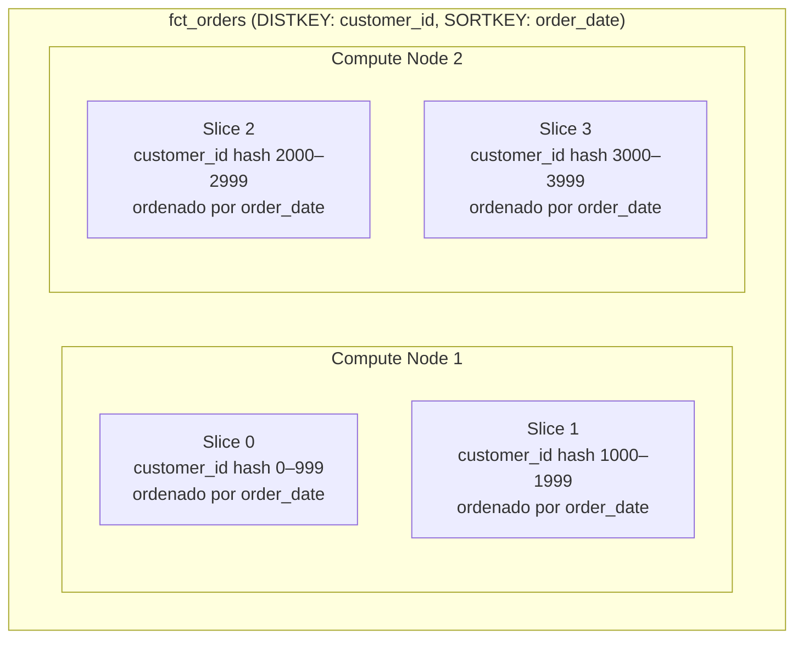
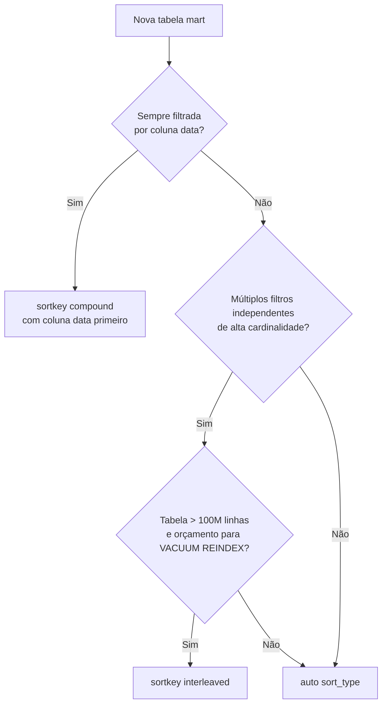

# Padrões de Performance Redshift: Sort Keys, Dist Styles e Compressão

Toda consulta SQL que você executa no Redshift ou se beneficia ou é prejudicada pelas decisões de armazenamento físico tomadas quando as tabelas foram criadas. O dbt te dá controle total sobre essas decisões através de configurações no nível do modelo. Este módulo ensina você a tomá-las intencionalmente.

O desempenho no Redshift é determinado por três fatores principais: (1) como os dados são distribuídos entre os nós, (2) como os dados são ordenados fisicamente no disco e (3) como cada coluna é comprimida. Ignorar qualquer um desses aspectos pode levar a consultas lentas e consumo excessivo de armazenamento.

---

## Como o Redshift Armazena Dados

O Redshift armazena dados de tabelas em **blocos de colunas** distribuídos através de **slices** nos nós de computação. Duas propriedades governam o posicionamento físico:

- **Distribution style** — para qual slice cada linha vai (afeta movimentação de dados durante joins)
- **Sort key** — a ordenação física das linhas no disco (afeta varreduras com restrição de faixa)



Cada **slice** é uma fatia de CPU e memória que processa uma parte dos dados em paralelo. Quando você executa uma consulta, o Redshift distribui o trabalho igualmente entre todos os slices disponíveis. É por isso que o paralelismo é tão importante no Redshift.

---

## Estilos de Distribuição

O estilo de distribuição controla onde o Redshift coloca as linhas entre os slices. Escolher o estilo errado causa **redistribuição de dados em tempo de consulta**, que é o assassino de performance mais comum no Redshift.

Quando ocorre a redistribuição? Basicamente, quando duas tabelas sendo joinadas não estão co-localizadas (isto é, as linhas correspondentes estão em slices diferentes). O Redshift precisa então mover dados entre os nós para completar o join — uma operação cara.

| Estilo | Configuração dbt | Comportamento | Melhor para |
| :--- | :--- | :--- | :--- |
| `AUTO` | `dist: auto` | Redshift decide (pequeno → ALL, grande → KEY ou EVEN) | Padrão; deixe o Advisor ajustar |
| `EVEN` | `dist: even` | Round-robin através de todos os slices | Tabelas fato grandes sem chave de join clara |
| `KEY` | `dist: <coluna>` | Linhas com mesma chave vão para o mesmo slice | Tabelas com muitos joins; co-localiza linhas |
| `ALL` | `dist: all` | Cópia completa em cada nó | Tabelas dimensão pequenas e frequentemente joinadas |

### Configurando Distribuição no dbt

```sql
-- models/marts/fct_orders.sql
{{ config(
    materialized='table',
    dist='customer_id',          -- KEY dist em customer_id
    sort=['order_date', 'status'],
    sort_type='compound'
) }}

select
    order_id,
    customer_id,
    order_date,
    status,
    total_amount
from {{ ref('stg_orders') }}
```

```yaml
# models/marts/schema.yml — Configuração em nível YAML (aplica a todos os arquivos no diretório)
models:
  - name: dim_customers
    config:
      materialized: table
      dist: all          -- dimensão pequena → copiar para todos os nós
      sort: customer_id
      sort_type: compound
```

[!TIP]
Quando `fct_orders` e `dim_customers` são consultadas juntas, defina `fct_orders.dist = customer_id` e `dim_customers.dist = all`. O Redshift pode então fazer o join sem redistribuir nenhuma linha — um **join co-localizado**. Essa é a otimização mais impactante que você pode fazer.

---

## Sort Keys

Sort keys definem a ordem física das linhas no disco. O Redshift usa **zone maps** (metadados de min/max por bloco de disco) para pular blocos que não podem conter linhas correspondentes à sua cláusula `WHERE`. Uma sort key bem escolhida pode reduzir blocos varridos em 90%+.

Como as zone maps funcionam: para cada bloco de 1MB no disco, o Redshift armazena o valor mínimo e máximo de cada coluna que faz parte da sort key. Quando uma consulta filtra por essa coluna, o Redshift pode ignorar blocos inteiros cujo intervalo não contém o valor procurado.

### Compound Sort Key

Linhas são ordenadas primeiramente pela primeira coluna da chave, depois pela segunda, etc. — como um índice composto.

```sql
{{ config(
    materialized='table',
    sort=['order_date', 'customer_id', 'status'],
    sort_type='compound'         -- padrão quando sort_type é omitido
) }}
```

Use compound quando:
- Consultas filtram pela(s) **coluna(s) líder(es)** com frequência
- Você tem uma dimensão temporal clara (`event_date`, `created_at`)
- A coluna líder tem alta cardinalidade relativa aos predicados da consulta

Exemplo prático: uma tabela `fct_sales` com sort key compound em `sale_date` será extremamente eficiente para consultas como `WHERE sale_date BETWEEN '2024-01-01' AND '2024-01-31'` porque o Redshift pode pular blocos de meses anteriores.

### Interleaved Sort Key

Cada coluna recebe peso igual na ordenação. Mais flexível, mas incorre em maior custo de manutenção (`VACUUM REINDEX`).

```sql
{{ config(
    materialized='table',
    sort=['region', 'product_category', 'customer_segment'],
    sort_type='interleaved'
) }}
```

[!WARNING]
Sort keys interleaved exigem um `VACUUM REINDEX` completo para manter a eficácia. Em tabelas grandes, isso pode levar horas. A AWS recomenda fortemente sort keys compound ou `AUTO` para a maioria das cargas de trabalho. Evite interleaved a menos que você tenha múltiplas colunas de filtro de alta cardinalidade e independentes, sem prioridade clara.

### Auto Sort Key

O Redshift Advisor escolhe e ajusta automaticamente a sort key baseado nos padrões de consulta.

```sql
{{ config(
    materialized='table',
    sort_type='auto'
) }}
```

Defina `+sort_type: auto` no `dbt_project.yml` como padrão para todo o projeto e faça override apenas para tabelas onde você tem um padrão de filtro forte e estável (por exemplo, uma tabela fato temporal sempre filtrada por `event_date`).

### Fluxo de Decisão de Sort Key



---

## Configurando Sort Keys no Nível do Projeto

```yaml
# dbt_project.yml
models:
  my_analytics:
    marts:
      facts:
        +sort_type: compound
        +sort: event_date        -- toda tabela fato padrão com sort event_date
      dimensions:
        +dist: all               -- todas as tabelas dimensão → distribuição ALL
        +sort_type: compound
```

Modelos individuais fazem override do padrão do projeto:

```sql
-- models/marts/facts/fct_page_views.sql
-- Herda: sort=event_date, sort_type=compound do dbt_project.yml
-- Override dist para KEY para co-localização com dim_sessions
{{ config(
    dist='session_id'
) }}

select *
from {{ ref('stg_page_views') }}
```

---

## Codificações de Compressão de Colunas

O Redshift usa compressão no nível de coluna para reduzir armazenamento e melhorar performance de I/O. Por padrão, `COPY` e `CREATE TABLE AS SELECT` aplicam **compressão automática (AZ64 / LZO)**.

Para tabelas criadas pelo dbt, você tem duas opções:

### Opção 1: Deixe o Redshift Auto-Analisar (Recomendado)

```sql
{{ config(
    materialized='table',
    dist='customer_id',
    sort='order_date'
    -- Sem encode config: Redshift aplica ENCODE AUTO
) }}
```

Quando você cria uma tabela via `CREATE TABLE AS SELECT` (que o dbt usa), o Redshift aplica `ENCODE AUTO` por padrão em versões mais recentes do cluster. O Advisor analisará e aplicará codificações ótimas. Na prática, essa é a abordagem mais simples e eficaz para a maioria dos casos.

### Opção 2: Post-Hook ANALYZE COMPRESSION + ALTER

Para tabelas onde você quer controle explícito, use um post-hook com macro:

```sql
-- macros/analyze_and_compress.sql

    analyze compression {{ relation }};

```

```sql
-- models/marts/fct_events.sql
{{ config(
    materialized='table',
    dist='event_id',
    sort=['event_date', 'event_type'],
    sort_type='compound',
    post_hook="{{ analyze_and_compress(this) }}"
) }}

select * from {{ ref('stg_events') }}
```

---

## Backup de Tabelas

A configuração `backup` controla se uma tabela é incluída nos snapshots automatizados do Redshift. Desabilite backups para tabelas staging ou intermediárias que podem ser reconstruídas:

```sql
{{ config(
    materialized='table',
    backup=false        -- não incluir em snapshots do cluster
) }}
```

```yaml
# dbt_project.yml — desabilitar backup para todas as tabelas staging
models:
  my_analytics:
    staging:
      +backup: false
    intermediate:
      +backup: false
    marts:
      +backup: true     -- explícito; este é o padrão
```

Esta é uma maneira simples e eficaz de reduzir custos de armazenamento de snapshot. Tabelas staging e intermediate são derivadas de fontes brutas e podem ser completamente reconstruídas — não há risco de perda de dados ao excluí-las dos snapshots.

---

## Referência de Configuração Prática

Aqui está um exemplo completo de configuração para uma tabela fato de produção:

```sql
-- models/marts/facts/fct_sales.sql
{{ config(
    materialized='table',

    -- Distribuição: KEY em customer_id
    -- (co-localiza com dim_customers que usa dist=all)
    dist='customer_id',

    -- Sort: compound com sale_date primeiro (consultas por faixa de data são primárias)
    sort=['sale_date', 'product_id'],
    sort_type='compound',

    -- Incluir em snapshots Redshift
    backup=true,

    -- Contrato de modelo (forçado em prod)
    contract={'enforced': true},

    -- Grants
    grants={'select': ['role_analyst', 'role_reporting']},

    -- Post-hook: vacuum após full-refresh
    post_hook=[
        "{{ vacuumable(this) }}"
    ]
) }}

with sales as (
    select * from {{ ref('stg_sales') }}
),

customers as (
    select * from {{ ref('dim_customers') }}
)

select
    s.sale_id,
    s.customer_id,
    s.product_id,
    s.sale_date,
    s.amount,
    s.quantity,
    c.customer_segment,
    c.region
from sales s
left join customers c using (customer_id)
```

---

## VACUUM e ANALYZE no dbt

O Redshift requer `VACUUM` periódico (recuperar linhas deletadas) e `ANALYZE` (atualizar estatísticas do planejador de consultas). O dbt permite automatizar isso com post-hooks ou operações.

```sql
-- macros/maintenance.sql

    
        
            vacuum {{ vacuum_type }} {{ relation }};
        
        
        {{ log("VACUUM completo: " ~ relation, info=true) }}
    



    
        
            analyze {{ relation }};
        
        
        {{ log("ANALYZE completo: " ~ relation, info=true) }}
    

```

Execute como uma operação após a execução completa do pipeline:

```bash
dbt run-operation vacuum_table --args "{'relation': 'analytics.marts.fct_sales'}"
dbt run-operation analyze_table --args "{'relation': 'analytics.marts.fct_sales'}"
```

[!IMPORTANT]
Redshift Serverless **recupera armazenamento automaticamente** e não requer `VACUUM` manual. Para clusters provisionados em nós RA3, agende `VACUUM` como uma operação recorrente do dbt ou função AWS Lambda acionada após seu pipeline dbt ser concluído. A frequência recomendada é após cargas de dados significativas ou pelo menos semanalmente.

---

## 6 Perguntas de Prática

```question
{
  "id": "dbt-rs-02-q1",
  "type": "multiple-choice",
  "question": "Você tem uma tabela fato grande (fct_orders) e uma tabela dimensão pequena (dim_customers, ~50K linhas). Ambas são frequentemente joinadas por customer_id. Qual configuração de distribuição minimiza a movimentação de dados?",
  "options": [
    "fct_orders: dist=even, dim_customers: dist=even",
    "fct_orders: dist=customer_id, dim_customers: dist=all",
    "fct_orders: dist=all, dim_customers: dist=customer_id",
    "Ambas as tabelas: dist=auto"
  ],
  "correct": 1,
  "explanation": "Definir fct_orders com distribuição KEY em customer_id e dim_customers com distribuição ALL cria um join co-localizado — o Redshift pode fazer o join sem nenhuma redistribuição de dados."
}
```

```question
{
  "id": "dbt-rs-02-q2",
  "type": "multiple-choice",
  "question": "Uma tabela é sempre consultada com WHERE event_date BETWEEN '2024-01-01' AND '2024-12-31'. Qual configuração de sort key dá a melhor performance?",
  "options": [
    "sort_type: interleaved, sort: [event_date, user_id]",
    "sort_type: compound, sort: [event_date]",
    "sort_type: auto",
    "Nenhuma sort key — Redshift lida com isso automaticamente"
  ],
  "correct": 1,
  "explanation": "Uma sort key compound com event_date como primeira coluna permite que o Redshift use zone maps para pular blocos de disco fora do intervalo de datas, reduzindo drasticamente o I/O."
}
```

```question
{
  "id": "dbt-rs-02-q3",
  "type": "multiple-choice",
  "question": "Qual é a principal desvantagem operacional das sort keys interleaved?",
  "options": [
    "Elas não suportam filtros compostos",
    "Elas exigem um VACUUM REINDEX completo para manter a eficácia, o que pode levar horas em tabelas grandes",
    "Não são suportadas no Redshift Serverless",
    "Só funcionam com dist=even"
  ],
  "correct": 1,
  "explanation": "Sort keys interleaved perdem eficácia conforme linhas são inseridas e deletadas. Restaurar a performance exige VACUUM REINDEX, uma operação intensiva que consome muitos recursos e tempo."
}
```

```question
{
  "id": "dbt-rs-02-q4",
  "type": "multiple-choice",
  "question": "Por que você pode definir `backup: false` em seus modelos staging?",
  "options": [
    "Para habilitar datasharing cross-database",
    "Para reduzir custos de armazenamento de snapshot do cluster em tabelas que podem ser reconstruídas a partir das fontes",
    "Para permitir comportamento de late-binding view",
    "Para pular análise de compressão"
  ],
  "correct": 1,
  "explanation": "Tabelas staging são derivadas de fontes brutas e podem ser reconstruídas. Excluí-las dos snapshots reduz custos de armazenamento sem risco de perda de dados."
}
```

```question
{
  "id": "dbt-rs-02-q5",
  "type": "multiple-choice",
  "question": "Quando o Redshift Serverless exige que você execute VACUUM manualmente?",
  "options": [
    "Após toda execução dbt",
    "Nunca — Redshift Serverless recupera armazenamento automaticamente",
    "Apenas após executar comandos COPY",
    "Apenas para tabelas com sort keys interleaved"
  ],
  "correct": 1,
  "explanation": "Redshift Serverless recupera armazenamento automaticamente e não requer operações VACUUM manuais. Esta é uma de suas principais vantagens operacionais sobre clusters provisionados."
}
```

```question
{
  "id": "dbt-rs-02-q6",
  "type": "multiple-choice",
  "question": "Um engenheiro de dados define `+sort_type: auto` como padrão global no dbt_project.yml mas faz override para `sort_type: compound, sort: event_date` em uma tabela fato específica. Qual configuração vence?",
  "options": [
    "O padrão do projeto sempre vence",
    "O override no bloco config do modelo vence",
    "Ambas são mescladas — ambos os tipos de sort são aplicados",
    "O arquivo modificado mais recentemente vence"
  ],
  "correct": 1,
  "explanation": "A precedência de configuração do dbt segue uma hierarquia: blocos config no nível do modelo sobrescrevem schema.yml, que sobrescreve dbt_project.yml. A definição mais específica vence."
}
```

---

[!SUCCESS]
### Principais Conclusões

- O estilo de distribuição controla o posicionamento dos dados entre slices. Escolhas erradas causam redistribuição cara em runtime. Use KEY + ALL para joins fato–dimensão comuns.
- Sort keys compound são a escolha mais comum; coloque sua coluna de filtro primária primeiro. Reserve interleaved para padrões de filtro multidimensionais específicos.
- `sort_type: auto` é um padrão global seguro; faça override apenas onde você tem padrões de consulta fortes e estáveis.
- Desabilite `backup` em tabelas staging e intermediate para reduzir custos de armazenamento de snapshot.
- Redshift Serverless elimina a necessidade de VACUUM manual — uma vantagem operacional chave.
- Use macros post-hook para automatizar `VACUUM` e `ANALYZE` em clusters provisionados.
- Blocos config no nível do modelo sobrescrevem schema.yml, que sobrescreve dbt_project.yml — o mais específico vence.
