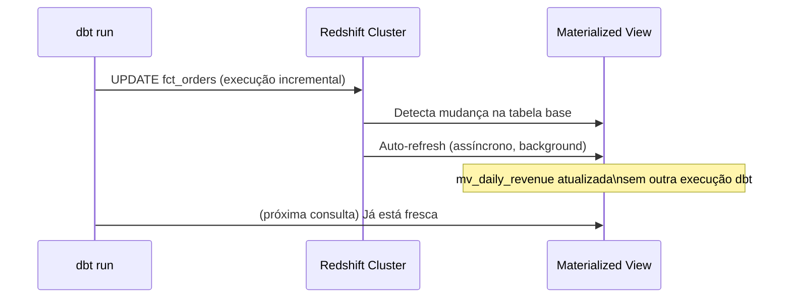
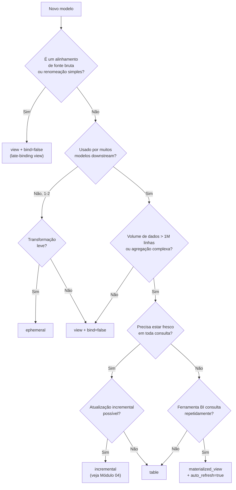

# Materializações em Profundidade: Tabelas, Views, Late-Binding Views e Materialized Views do Redshift

Escolher a materialização correta é a decisão arquitetural de maior impacto em um projeto dbt. Cada tipo de materialização tem diferentes trade-offs em termos de armazenamento, frescor, performance de consulta e resiliência de deploy. O Redshift estende o conjunto padrão do dbt com duas opções específicas da plataforma que são essenciais para uso em produção.

Entender essas diferenças é fundamental porque a escolha errada pode levar a:
- Custos de armazenamento desnecessários (materializar tudo como tabela)
- Consultas lentas (usar views para agregações complexas)
- Falhas em cascata durante deploys (views vinculadas a tabelas que são recriadas)
- Frescor inadequado dos dados (materialized views com atualização infrequente)

---

## A Matriz Completa de Materializações no Redshift

| Materialização | Tipo dbt | Armazenamento | Frescor | Seguro para cascade | Específico Redshift |
| :--- | :--- | :--- | :--- | :--- | :--- |
| Table | `table` | Cópia completa | Atualizado na execução | Sim (drop + recreate) | sort/dist/backup |
| View | `view` | Nenhum (metadados apenas) | Sempre atual | Não (quebra no drop+cascade) | bind config |
| Late-binding view | `view` + `bind: false` | Nenhum | Sempre atual | **Sim** | Apenas Redshift |
| Incremental | `incremental` | Atualizações parciais | Atualizado incrementalmente | Parcial | Todas as estratégias |
| Ephemeral | `ephemeral` | Nenhum (CTE) | N/A — inline | N/A | Nenhum |
| Materialized view | `materialized_view` | Pré-computado | Auto ou manual | Sim (DROP CASCADE) | sort/dist/auto_refresh/backup |

---

## Views Padrão vs. Late-Binding Views

Views padrão do Redshift são **fortemente vinculadas** (tightly bound) às suas dependências. Se você remover uma tabela upstream com `CASCADE`, todas as views dependentes também são removidas. Isso causa falhas em cascata em produção durante execuções de full refresh do dbt.

**Late-binding views** (`bind: false`) são desvinculadas de suas dependências. Elas sobrevivem a drops de tabelas upstream e são compatíveis com Redshift Spectrum (tabelas externas).

```sql
-- View regular — quebrará se stg_orders for removida
{{ config(materialized='view') }}

select * from {{ ref('stg_orders') }}
```

```sql
-- Late-binding view — sobrevive a drops upstream
{{ config(
    materialized='view',
    bind=false
) }}

select * from {{ ref('stg_orders') }}
```

A diferença no DDL gerado pelo dbt:
- View regular: `CREATE VIEW ... AS SELECT * FROM analytics.staging.stg_orders` (vinculada)
- Late-binding view: `CREATE VIEW ... AS SELECT * FROM analytics.staging.stg_orders WITH NO SCHEMA BINDING` (não vinculada)

### Definindo Late-Binding como Padrão do Projeto

Para ambientes de produção, torne late-binding o padrão para todas as views:

```yaml
# dbt_project.yml
models:
  my_analytics:
    # Todas as views em staging e intermediate são late-binding por padrão
    staging:
      +materialized: view
      +bind: false
    intermediate:
      +materialized: view
      +bind: false
    # Marts usam tabelas; bind é irrelevante para tabelas
    marts:
      +materialized: table
```

[!IMPORTANT]
Sempre use `bind: false` (late-binding views) em ambientes de produção no Redshift. Views regulares quebram quando tabelas upstream são removidas durante um full refresh — uma operação muito comum no dbt. Esta é a principal razão para preferir late-binding views para a materialização `view` no Redshift.

---

## Materialized Views do Redshift

Materialized views do Redshift armazenam resultados de consultas pré-computados em disco e podem ser atualizadas automaticamente ou sob demanda. Elas são distintas da estratégia `incremental` do dbt — são um recurso nativo do Redshift.

### Quando usar materialized views

- Agregações complexas consultadas repetidamente por ferramentas de BI (Tableau, QuickSight)
- Consultas Redshift Spectrum sobre dados no S3 que devem ser pré-computados
- Modelos onde a latência de consulta é crítica mas a reconstrução completa é muito lenta

Diferentemente de tabelas, as materialized views não precisam ser totalmente recriadas quando os dados de base mudam — elas podem ser atualizadas incrementalmente. Diferentemente de views, os resultados são armazenados em disco, então as consultas são muito mais rápidas.

### Configuração no dbt

```sql
-- models/marts/mv_daily_revenue.sql
{{ config(
    materialized='materialized_view',

    -- Distribuição
    dist='region',

    -- Sort key
    sort=['report_date', 'region'],
    sort_type='compound',

    -- Auto-refresh: Redshift atualiza quando tabelas base mudam
    auto_refresh=true,

    -- Incluir em snapshots do cluster
    backup=true,

    -- O que acontece quando a configuração muda (apply, continue, ou fail)
    on_configuration_change='apply'
) }}

select
    date_trunc('day', o.order_date)::date   as report_date,
    c.region,
    sum(o.total_amount)                      as total_revenue,
    count(distinct o.customer_id)            as unique_customers,
    count(o.order_id)                        as order_count
from {{ ref('fct_orders') }} o
join {{ ref('dim_customers') }} c using (customer_id)
group by 1, 2
```

### Comportamento do on_configuration_change

| Valor | Comportamento quando a configuração muda |
| :--- | :--- |
| `apply` | dbt executa `ALTER MATERIALIZED VIEW` para aplicar a mudança in-place |
| `continue` | dbt registra um aviso e pula o modelo |
| `fail` | dbt levanta um erro |

Use `apply` para mudanças em `auto_refresh` e sort/dist. Use `fail` em ambientes CI para detectar mudanças inesperadas de configuração.

### Arquitetura de Auto-Refresh



[!TIP]
Materialized views com `auto_refresh=true` são atualizadas assincronamente pelo Redshift quando tabelas base mudam. Isso significa que ferramentas de BI consultando a MV recebem dados frescos sem esperar pela próxima execução do dbt. No entanto, o auto-refresh tem uma **latência de até 5 minutos** no Redshift Serverless. Para relatórios com SLA crítico, combine `auto_refresh=true` com um post-hook do dbt que execute `REFRESH MATERIALIZED VIEW` imediatamente após a construção das tabelas base.

### Post-Hook de Refresh Manual

```sql
-- macros/refresh_mv.sql

    
        
            refresh materialized view {{ relation }};
        
        
        {{ log("Materialized view atualizada: " ~ relation, info=true) }}
    

```

```sql
-- models/marts/mv_daily_revenue.sql
{{ config(
    materialized='materialized_view',
    auto_refresh=true,
    post_hook="{{ refresh_materialized_view(this) }}"
) }}
```

### Materialized View com Cascade Drop

Remover uma materialized view que referencia outra materialized view requer `CASCADE`. O dbt-redshift lida com isso automaticamente com suporte a `DROP CASCADE` adicionado na v1.9.x:

```sql
-- Funciona corretamente no dbt-redshift >= 1.9
-- dbt lida com DROP CASCADE quando uma materialized view referencia outra
{{ config(
    materialized='materialized_view',
    auto_refresh=false
) }}

select *
from {{ ref('mv_daily_revenue') }}   -- referencia outra materialized view
where region = 'EMEA'
```

---

## Modelos Ephemeral — Quando Usar e Quando Evitar

Modelos ephemeral injetam seu SQL como uma CTE nas consultas downstream. Eles **não têm armazenamento** e são computados inline no momento da consulta.

```sql
-- models/intermediate/int_orders_enriched.sql (ephemeral)
{{ config(materialized='ephemeral') }}

select
    o.*,
    c.customer_segment,
    c.region
from {{ ref('stg_orders') }} o
left join {{ ref('stg_customers') }} c using (customer_id)
```

Modelos downstream que usam `ref('int_orders_enriched')` vão inlinar esta CTE automaticamente.

**Use ephemeral quando:**
- A transformação é um join leve ou renomeação de coluna usado em apenas 1–2 modelos downstream
- Você quer evitar materializar resultados intermediários por razões de custo

**Evite ephemeral quando:**
- O mesmo resultado intermediário é usado em 3+ modelos downstream (Redshift executa a CTE N vezes)
- A CTE é complexa ou cara (sem oportunidade de cache pelo Redshift)
- Você precisa testar ou documentar a transformação intermediária independentemente

---

## Escolhendo a Materialização Correta



---

## Arquitetura Prática de Camadas para Redshift

```yaml
# dbt_project.yml — configuração recomendada de camadas para produção Redshift
models:
  my_analytics:
    sources:
      # Camada bruta: não é uma camada dbt, mas documentada via sources.yml

    staging:
      +materialized: view
      +bind: false              -- late-binding sempre
      +backup: false            -- reconstruído das fontes; sem necessidade de snapshot
      +schema: staging

    intermediate:
      +materialized: ephemeral  -- padrão; faça override para view em CTEs complexas

    marts:
      dimensions:
        +materialized: table
        +dist: all              -- dimensão pequena → cópia para todos os nós
        +sort_type: compound
        +backup: true
        +schema: marts

      facts:
        +materialized: table
        +sort_type: compound    -- faça override da coluna sort por modelo
        +backup: true
        +schema: marts

      reporting:
        +materialized: materialized_view
        +auto_refresh: true
        +backup: true
        +schema: reporting
```

---

## 6 Perguntas de Prática

```question
{
  "id": "dbt-rs-03-q1",
  "type": "multiple-choice",
  "question": "Uma execução full-refresh do dbt remove tabelas staging upstream com CASCADE. Qual tipo de view sobrevive a esta operação?",
  "options": [
    "View padrão (bind: true)",
    "Late-binding view (bind: false)",
    "Materialized view com auto_refresh=true",
    "Modelo ephemeral"
  ],
  "correct": 1,
  "explanation": "Late-binding views (bind: false) são desvinculadas de suas dependências de origem. Elas não são removidas quando tabelas upstream são dropadas com CASCADE, tornando-as seguras para ambientes de produção."
}
```

```question
{
  "id": "dbt-rs-03-q2",
  "type": "multiple-choice",
  "question": "Qual valor de on_configuration_change você deve usar em materialized views no CI para detectar mudanças inesperadas de configuração?",
  "options": [
    "apply",
    "continue",
    "fail",
    "rebuild"
  ],
  "correct": 2,
  "explanation": "Definir on_configuration_change: fail no CI faz com que o dbt levante um erro quando a configuração de uma materialized view difere do que está implantado, capturando mudanças acidentais antes que cheguem à produção."
}
```

```question
{
  "id": "dbt-rs-03-q3",
  "type": "multiple-choice",
  "question": "Um modelo ephemeral é referenciado por 8 modelos downstream diferentes. Qual é o risco de performance?",
  "options": [
    "Modelos ephemeral não podem ser referenciados por mais de 3 modelos",
    "A CTE ephemeral é inlinada e re-executada uma vez por modelo downstream — 8 vezes no total",
    "O modelo ephemeral é cacheado após a primeira execução",
    "dbt automaticamente converte para tabela se for referenciado mais de 5 vezes"
  ],
  "correct": 1,
  "explanation": "Modelos ephemeral são CTEs inlinadas no SQL compilado de cada modelo downstream. O Redshift executa a CTE para cada modelo downstream independentemente — não há cache."
}
```

```question
{
  "id": "dbt-rs-03-q4",
  "type": "multiple-choice",
  "question": "Você precisa de uma agregação para BI que esteja sempre fresca, construída sobre uma tabela fato grande, e consultada centenas de vezes por hora. Qual materialização se encaixa melhor?",
  "options": [
    "table",
    "view",
    "ephemeral",
    "materialized_view com auto_refresh=true"
  ],
  "correct": 3,
  "explanation": "Uma materialized view do Redshift com auto_refresh=true armazena a agregação pré-computada (consultas rápidas) e atualiza automaticamente quando a tabela base muda (sempre fresco), sem exigir outra execução dbt."
}
```

```question
{
  "id": "dbt-rs-03-q5",
  "type": "multiple-choice",
  "question": "O que também deve ser configurado quando uma late-binding view referencia uma tabela externa via Redshift Spectrum?",
  "options": [
    "bind: true",
    "dist: all",
    "bind: false — late-binding views são necessárias para compatibilidade com tabelas externas do Spectrum",
    "auto_refresh: true"
  ],
  "correct": 2,
  "explanation": "Late-binding views (bind: false) são necessárias ao referenciar tabelas externas do Redshift Spectrum. Views regulares (vinculadas) não podem referenciar tabelas externas e falharão com erro de compilação."
}
```

```question
{
  "id": "dbt-rs-03-q6",
  "type": "multiple-choice",
  "question": "Quanto pode ser a latência do auto-refresh para materialized views no Redshift Serverless?",
  "options": [
    "Imediata — sem latência",
    "Até 5 minutos",
    "Até 1 hora",
    "Até 24 horas"
  ],
  "correct": 1,
  "explanation": "Materialized views do Redshift Serverless com auto_refresh=true podem ter latência de até 5 minutos. Para SLAs mais rigorosos, combine auto_refresh com um post-hook dbt que execute REFRESH MATERIALIZED VIEW imediatamente após atualizações da tabela base."
}
```

---

[!SUCCESS]
### Principais Conclusões

- Sempre use late-binding views (`bind: false`) em ambientes de produção no Redshift para sobreviver a operações DROP CASCADE upstream.
- Materialized views do Redshift com `auto_refresh=true` são a melhor escolha para agregações voltadas para BI — armazenamento pré-computado, frescor automático, sem execuções dbt extras.
- Use `on_configuration_change: fail` em pipelines CI para detectar desvios de configuração de materialized views precocemente.
- Modelos ephemeral são CTEs inlinadas por modelo downstream — evite-os quando referenciados por muitos modelos.
- O padrão `post_hook` com `REFRESH MATERIALIZED VIEW` garante frescor mais rigoroso que a latência de 5 minutos do auto-refresh.
- Organize seu projeto em camadas: staging → late-binding views, intermediate → ephemeral ou views, marts/facts → tabelas, reporting → materialized views.
