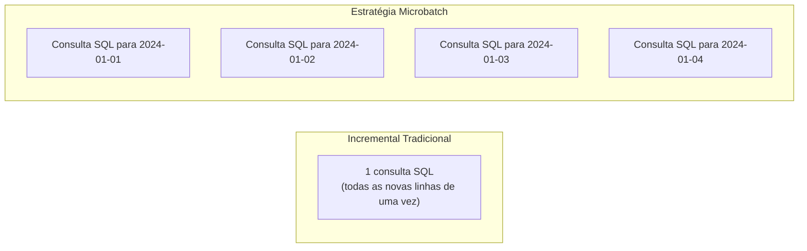
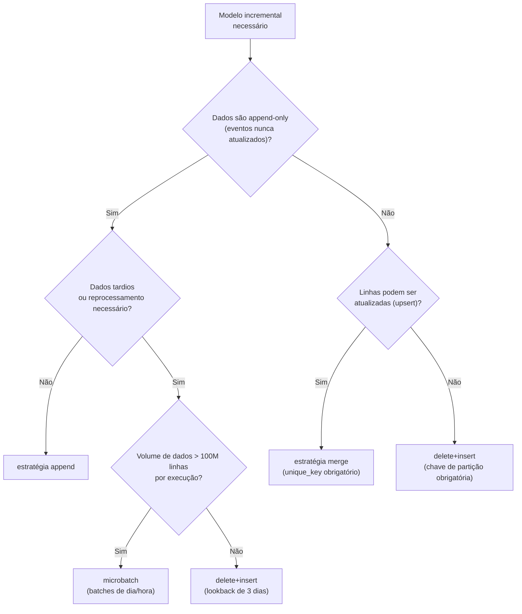

# Modelos Incrementais Avançados e a Estratégia Microbatch

Modelos incrementais são a ferramenta central para lidar com conjuntos de dados grandes demais para serem reconstruídos do zero a cada execução. O dbt-core 1.9 introduziu a **estratégia microbatch**, um padrão de primeira classe para processar dados de eventos em janelas de tempo isoladas — cada batch é sua própria instrução SQL, independentemente retentável. Este módulo cobre todas as estratégias incrementais disponíveis no Redshift e explica quando usar cada uma.

A escolha da estratégia incremental correta depende de três fatores: (1) a natureza dos dados de origem (imutáveis ou atualizáveis?), (2) o volume de dados por execução e (3) a tolerância a duplicatas.

---

## Visão Geral das Estratégias Incrementais

O dbt-redshift suporta quatro estratégias incrementais:

| Estratégia | Mecanismo | Duplicatas | Full refresh suportado | Melhor para |
| :--- | :--- | :--- | :--- | :--- |
| `append` | `INSERT INTO` | Possíveis | Sim | Logs de eventos imutáveis |
| `delete+insert` | `DELETE` depois `INSERT` | Não | Sim | Dados particionados, sem suporte MERGE |
| `merge` | `MERGE` (upsert) | Não | Sim | Fatos que mudam lentamente, SCD Tipo 1 |
| `microbatch` | `DELETE+INSERT` por batch | Não | Limitado | Dados de série temporal (dbt 1.9+) |

---

## Estratégia 1: Append

Insere todas as novas linhas sem verificar duplicatas. A estratégia mais simples e rápida.

```sql
-- models/marts/facts/fct_raw_events.sql
{{ config(
    materialized='incremental',
    incremental_strategy='append',
    dist='event_id',
    sort=['event_timestamp'],
    sort_type='compound',
    unique_key='event_id'       -- usado apenas para docs; não aplicado no append
) }}

select
    event_id,
    user_id,
    event_type,
    event_timestamp,
    properties
from {{ ref('stg_raw_events') }}


    where event_timestamp > (
        select coalesce(max(event_timestamp), '1970-01-01') 
        from {{ this }}
    )

```

Use `append` apenas quando os dados de origem são verdadeiramente imutáveis — cada event_id aparece exatamente uma vez e nunca é atualizado. Exemplos típicos incluem logs de servidor web, eventos de clickstream e mensagens de fila.

---

## Estratégia 2: Delete + Insert

Remove a partição afetada e depois insere. Evita duplicatas sem exigir suporte MERGE do Redshift (embora o Redshift suporte MERGE desde 2022).

```sql
-- models/marts/facts/fct_daily_metrics.sql
{{ config(
    materialized='incremental',
    incremental_strategy='delete+insert',
    unique_key=['report_date', 'region'],   -- chave de partição para deletar + reinserir
    dist='region',
    sort=['report_date'],
    sort_type='compound'
) }}

select
    report_date,
    region,
    sum(revenue)       as total_revenue,
    count(order_id)    as order_count
from {{ ref('fct_orders') }}


    where report_date >= (
        select dateadd('day', -3, max(report_date)) 
        from {{ this }}
    )

group by 1, 2
```

A lista `unique_key` define quais linhas deletar antes de reinserir. O dbt compila isso como:

```sql
delete from analytics.marts.fct_daily_metrics
where (report_date, region) in (
    select report_date, region from __dbt_tmp
);

insert into analytics.marts.fct_daily_metrics
select * from __dbt_tmp;
```

---

## Estratégia 3: Merge (Upsert)

Usa uma instrução `MERGE` nativa para atualizar linhas existentes ou inserir novas. A estratégia mais poderosa para dados de fato que mudam lentamente.

```sql
-- models/marts/facts/fct_order_status.sql
{{ config(
    materialized='incremental',
    incremental_strategy='merge',
    unique_key='order_id',
    dist='customer_id',
    sort=['updated_at'],
    sort_type='compound',
    merge_update_columns=['status', 'updated_at', 'total_amount']
) }}

select
    order_id,
    customer_id,
    status,
    total_amount,
    updated_at
from {{ ref('stg_orders') }}


    where updated_at > (
        select coalesce(max(updated_at), '1970-01-01')
        from {{ this }}
    )

```

A configuração `merge_update_columns` limita quais colunas são atualizadas em caso de match — eficiente quando apenas algumas colunas mudam com frequência. Por exemplo, se apenas `status` e `updated_at` mudam, não há necessidade de re-escrever `customer_id` ou `total_amount`.

[!NOTE]
O Redshift suporta MERGE desde 2022 (lançamento das funcionalidades de conformidade com PostgreSQL). Em clusters mais antigos, pode ser necessário usar `delete+insert` como fallback.

---

## Estratégia 4: Microbatch (dbt-core 1.9+)

A estratégia microbatch é uma abordagem fundamentalmente diferente. Em vez de uma consulta SQL com um bloco `is_incremental()`, o dbt gera **uma consulta SQL por batch de tempo** e as executa independentemente.

### Diferenças chave do incremental tradicional



Cada batch:
- É independentemente retentável
- Filtra modelos `ref()` upstream automaticamente quando eles também têm `event_time`
- Executa concorrentemente até o limite de `threads`
- Não requer um bloco `is_incremental()`

A principal vantagem do microbatch sobre o incremental tradicional é o isolamento de falhas. Se um batch falha (por exemplo, dados corrompidos em um dia específico), apenas aquele dia precisa ser corrigido e reexecutado — os batches adjacentes não são afetados.

### Configuração Microbatch

```sql
-- models/marts/facts/fct_events_microbatch.sql
{{ config(
    materialized='incremental',
    incremental_strategy='microbatch',

    -- Obrigatório: a coluna timestamp que define os limites do batch
    event_time='event_timestamp',

    -- Tamanho do batch: 'hour', 'day', 'month', 'year'
    batch_size='day',

    -- Quantos batches passados reprocessar em cada execução
    -- (para capturar dados tardios)
    lookback=3,

    -- O timestamp mais antigo possível a ser processado
    begin='2023-01-01',

    -- Prevenir full refresh acidental
    full_refresh=false,

    -- Configurações de performance Redshift
    dist='user_id',
    sort=['event_timestamp', 'event_type'],
    sort_type='compound'
) }}

-- Escreva SQL para um ÚNICO batch — dbt lida com a filtragem por faixa de data
select
    event_id,
    user_id,
    event_type,
    event_timestamp,
    session_id,
    page_url,
    properties
from {{ ref('stg_raw_events') }}
-- Sem bloco is_incremental() necessário!
-- dbt automaticamente filtra stg_raw_events para a janela do batch atual
```

### O que o dbt gera para cada batch

Para `batch_size='day'` executado em 2024-03-15, o dbt compila:

```sql
-- Batch para 2024-03-13 (lookback=3, então 3 dias são reprocessados)
delete from analytics.marts.fct_events_microbatch
where event_timestamp >= '2024-03-13 00:00:00'
  and event_timestamp <  '2024-03-14 00:00:00';

insert into analytics.marts.fct_events_microbatch
select ...
from stg_raw_events
where event_timestamp >= '2024-03-13 00:00:00'
  and event_timestamp <  '2024-03-14 00:00:00';

-- Batch para 2024-03-14
delete from ...  where event_timestamp >= '2024-03-14' ...
insert ...

-- Batch para 2024-03-15
delete from ...  where event_timestamp >= '2024-03-15' ...
insert ...
```

### Full Refresh Limitado

Com `full_refresh=false`, um `dbt run --full-refresh` padrão vai **gerar erro** em modelos microbatch (protegendo contra reconstrução acidental). Use flags limitadas:

```bash
# Reconstruir uma janela de tempo específica sem tocar nos outros batches
dbt run --select fct_events_microbatch \
    --event-time-start 2024-01-01 \
    --event-time-end   2024-02-01
```

### Filtragem Automática Upstream

Se modelos `ref()` upstream também declararem `event_time`, o dbt passa a faixa de data do batch atual para eles automaticamente:

```sql
-- models/staging/stg_raw_events.sql
{{ config(
    materialized='view',
    bind=false,
    event_time='event_timestamp'   -- declarar event_time aqui
) }}

select * from {{ source('raw', 'events') }}
```

Agora, quando o microbatch processar o batch de 2024-03-15, `stg_raw_events` é automaticamente filtrado para aquele dia — o dbt adiciona o predicado `WHERE event_timestamp >= ... AND event_timestamp < ...` na consulta de origem.

---

## Escolhendo Entre Estratégias Incrementais



---

## Melhores Práticas para Modelos Incrementais no Redshift

### 1. Sempre especifique uma janela de lookback

Eventos tardios são comuns em sistemas distribuídos. Um lookback de 3 dias garante que sejam capturados:

```sql

    where event_date >= (
        select dateadd('day', -3, max(event_date)) 
        from {{ this }}
    )

```

### 2. Use coalesce para segurança na primeira execução

Na primeira execução (ou após full refresh), `max()` sobre uma tabela vazia retorna NULL:

```sql

    where updated_at > (
        select coalesce(max(updated_at), '2020-01-01'::timestamp)
        from {{ this }}
    )

```

### 3. Combine dist key com unique_key para performance de merge

```sql
{{ config(
    incremental_strategy='merge',
    unique_key='event_id',
    dist='event_id'    -- hash join: event_id em ambas as tabelas → co-localizado
) }}
```

Definir `dist` para a mesma coluna que `unique_key` garante que o Redshift possa executar o merge com movimentação mínima de dados entre nós.

### 4. Monitore metadados de execução microbatch

O dbt 1.9+ captura metadados por batch no `run_results.json`:

```bash
# Inspecionar quais batches executaram e seu status
cat target/run_results.json | python3 -c "
import json, sys
results = json.load(sys.stdin)
for r in results['results']:
    if 'batch' in r:
        print(r['unique_id'], r['batch']['event_time_start'], r['status'])
"
```

---

## 6 Perguntas de Prática

```question
{
  "id": "dbt-rs-04-q1",
  "type": "multiple-choice",
  "question": "A estratégia microbatch no dbt 1.9+ NÃO requer qual elemento que os modelos incrementais tradicionais requerem?",
  "options": [
    "Uma configuração unique_key",
    "Um bloco is_incremental() no SQL do modelo",
    "Uma configuração de dist style",
    "Uma data begin"
  ],
  "correct": 1,
  "explanation": "Modelos microbatch não usam blocos is_incremental(). O dbt gera uma consulta SQL por período de batch e lida com a filtragem de data automaticamente, então o SQL do modelo é escrito para uma única janela de batch."
}
```

```question
{
  "id": "dbt-rs-04-q2",
  "type": "multiple-choice",
  "question": "Você executa `dbt run --full-refresh` em um modelo microbatch configurado com `full_refresh: false`. O que acontece?",
  "options": [
    "dbt reconstrói toda a tabela a partir da data begin",
    "dbt levanta um erro — full refresh é bloqueado pela config full_refresh: false",
    "dbt reconstrói apenas os últimos 3 batches",
    "dbt ignora a flag e executa normalmente"
  ],
  "correct": 1,
  "explanation": "Definir full_refresh: false em um modelo microbatch protege contra reconstruções completas acidentais. O dbt levanta um erro. Para reconstruir um intervalo, use --event-time-start e --event-time-end."
}
```

```question
{
  "id": "dbt-rs-04-q3",
  "type": "multiple-choice",
  "question": "Para um modelo incremental com estratégia merge no Redshift, definir `dist` para a mesma coluna que `unique_key` tem qual benefício de performance?",
  "options": [
    "Reduz o número de instruções SQL geradas",
    "Garante que tanto a tabela alvo quanto a tabela temporária tenham linhas co-localizadas, minimizando redistribuição de dados durante o join do merge",
    "Habilita auto_refresh no modelo",
    "Permite que o modelo execute sem unique_key"
  ],
  "correct": 1,
  "explanation": "Quando a chave de distribuição corresponde à chave do join do merge (unique_key), o Redshift pode fazer o join das tabelas alvo e temporária sem redistribuir linhas entre nós — um hash join co-localizado."
}
```

```question
{
  "id": "dbt-rs-04-q4",
  "type": "multiple-choice",
  "question": "Qual é o propósito do parâmetro `lookback` na estratégia microbatch?",
  "options": [
    "Define quantos batches passados o dbt busca para encontrar a data begin",
    "Especifica quantos períodos de batch passados reprocessar em cada execução para capturar dados tardios",
    "Define o período de retenção após o qual batches são deletados",
    "Controla o número de threads concorrentes do batch"
  ],
  "correct": 1,
  "explanation": "lookback=3 com batch_size='day' significa que o dbt reprocessa os últimos 3 dias a cada execução. Isso garante que eventos tardios (que tipicamente chegam dentro de alguns dias) sejam capturados em seu batch correto."
}
```

```question
{
  "id": "dbt-rs-04-q5",
  "type": "multiple-choice",
  "question": "Quando o dbt filtra automaticamente um modelo ref() upstream em uma execução microbatch?",
  "options": [
    "Sempre — todos os refs são automaticamente filtrados",
    "Apenas quando o modelo upstream usa a materialização incremental",
    "Quando o modelo upstream também declara uma configuração event_time",
    "Apenas quando o modelo upstream é uma source (não um ref)"
  ],
  "correct": 2,
  "explanation": "A filtragem automática upstream só se aplica quando o modelo referenciado também declara event_time. O dbt então passa a janela de tempo do batch atual como um filtro na saída daquele modelo."
}
```

```question
{
  "id": "dbt-rs-04-q6",
  "type": "multiple-choice",
  "question": "Qual estratégia você deve escolher para uma tabela fato onde linhas podem ser retroativamente atualizadas (ex.: status do pedido muda de 'pending' para 'shipped')?",
  "options": [
    "append",
    "delete+insert com faixa de data completa",
    "merge com unique_key='order_id'",
    "microbatch"
  ],
  "correct": 2,
  "explanation": "Merge (upsert) é a estratégia correta quando linhas de origem podem ser atualizadas após a ingestão inicial. Ele encontra correspondência pela unique_key e atualiza linhas existentes enquanto insere novas."
}
```

---

[!SUCCESS]
### Principais Conclusões

- O dbt-redshift suporta quatro estratégias incrementais: append, delete+insert, merge e microbatch (1.9+).
- Microbatch gera uma consulta SQL por período de tempo — sem bloco `is_incremental()`; cada batch é independentemente retentável.
- Configure `lookback` para reprocessar batches recentes e capturar dados tardios.
- Proteja modelos microbatch com `full_refresh: false`; use `--event-time-start` / `--event-time-end` para reconstruções limitadas.
- Para performance de merge no Redshift, alinhe `dist` com `unique_key` para habilitar joins co-localizados.
- Use `coalesce(max(col), 'fallback_date')` em filtros `is_incremental()` para lidar com casos de primeira execução (tabela vazia).
- Refs upstream com `event_time` correspondente são automaticamente filtrados em execuções microbatch — declare event_time em todas as suas views staging.
