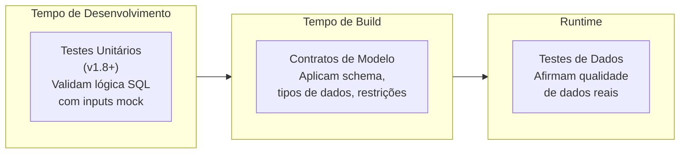
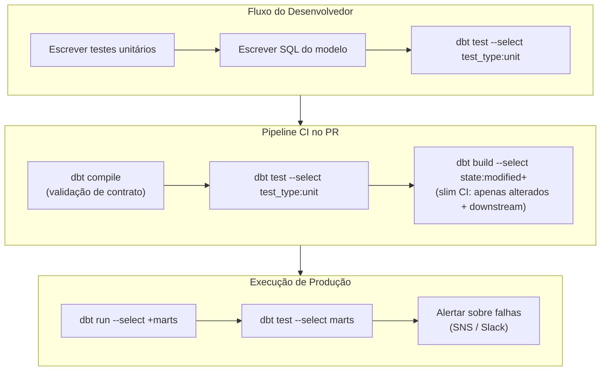

# Contratos de Modelo, Testes Unitários e Qualidade de Dados

O dbt-core fornece três mecanismos complementares para qualidade de dados: **contratos de modelo** (validação de schema em tempo de compilação), **testes unitários** (validação de lógica com dados mock, v1.8+) e **testes de dados** (asserções de dados em runtime). Juntos, eles formam um fluxo de trabalho de desenvolvimento orientado a testes para engenharia de análise que rivaliza com práticas de qualidade de engenharia de software.

A ideia central é detectar problemas o mais cedo possível no pipeline:
1. **Testes unitários** — durante o desenvolvimento, antes mesmo de tocar no warehouse
2. **Contratos de modelo** — em tempo de compilação, antes de executar qualquer SQL
3. **Testes de dados** — após a materialização, contra dados reais

---

## Os Três Pilares da Qualidade de Dados no dbt



| Funcionalidade | Quando executa | O que testa | Dados mock? |
| :--- | :--- | :--- | :--- |
| Testes unitários | Antes da materialização | Lógica de transformação SQL | Sim — inputs estáticos |
| Contratos de modelo | No build/compilação | Estrutura do schema, tipos de coluna | Não |
| Testes de dados | Após materialização | Valores de dados reais | Não |

---

## Contratos de Modelo

Um contrato de modelo declara o schema esperado para um modelo e o aplica em tempo de build. Quando um contrato é aplicado, o dbt valida que o SQL compilado retorna exatamente as colunas, tipos e restrições definidos — falhando antes que qualquer dado seja escrito se não corresponderem.

### Definindo um Contrato

```yaml
# models/marts/facts/schema.yml
models:
  - name: fct_orders
    description: "Tabela fato de pedidos de clientes"

    config:
      contract:
        enforced: true          -- aplicar em tempo de build

    columns:
      - name: order_id
        description: "Identificador único do pedido"
        data_type: varchar      -- tipo aplicado
        constraints:
          - type: not_null
          - type: primary_key   -- informacional no Redshift (não aplicado via DDL)
          - type: unique

      - name: customer_id
        description: "FK para dim_customers"
        data_type: integer
        constraints:
          - type: not_null
          - type: foreign_key
            to: ref('dim_customers')
            to_columns: [customer_id]   -- suportado no dbt-core 1.9+

      - name: order_date
        data_type: date
        constraints:
          - type: not_null

      - name: total_amount
        data_type: numeric(18, 4)
        constraints:
          - type: not_null
          - type: check
            expression: "total_amount >= 0"

      - name: status
        data_type: varchar(50)
        constraints:
          - type: not_null
```

[!WARNING]
No Redshift, as restrições `primary_key`, `foreign_key` e `unique` são **apenas informacionais** — o Redshift não as aplica no nível do banco de dados. Os contratos de modelo do dbt validam o schema em tempo de compilação, mas a integridade referencial deve ser aplicada via `data_tests` do dbt. Use `not_null` e `check` onde o Redshift as aplica.

### Aplicando Contratos em Todo o Projeto para Marts

```yaml
# dbt_project.yml
models:
  my_analytics:
    marts:
      +contract:
        enforced: true    -- todos os modelos mart exigem um contrato definido
```

Modelos staging individuais podem optar por não participar:

```yaml
models:
  my_analytics:
    staging:
      +contract:
        enforced: false   -- contratos staging são opcionais
```

### O que acontece quando um contrato é violado?

```
dbt run --select fct_orders

Compilation Error in model fct_orders
  This model has an enforced contract that failed.
  Please ensure the name, data_type, and number of columns in your
  contract match the columns in your model's definition.

  Contract Violation(s):
  - Column 'discount_pct' is present in model but missing in contract
  - Column 'total_amount' declared as numeric(18,4) but model returns float8
```

Isso significa que o erro é capturado **antes** de qualquer SQL ser executado contra o Redshift — economizando tempo e recursos computacionais.

---

## Testes Unitários (dbt-core 1.8+)

Testes unitários validam sua lógica de transformação SQL usando **dados mock estáticos** — nenhum processamento no warehouse é necessário além do próprio teste. Eles permitem desenvolvimento orientado a testes: escreva o teste, escreva o modelo, execute o teste.

### Estrutura Básica de Teste Unitário

```yaml
# models/marts/facts/schema.yml (continuação)

unit_tests:
  - name: test_fct_orders_status_mapping
    description: "Verificar se códigos de status brutos mapeiam para valores de exibição corretos"
    model: fct_orders

    given:
      # Mock do ref('stg_orders') upstream
      - input: ref('stg_orders')
        rows:
          - {order_id: 1, customer_id: 101, raw_status: 'P',  total_amount: 99.99,  order_date: '2024-01-15'}
          - {order_id: 2, customer_id: 102, raw_status: 'S',  total_amount: 149.50, order_date: '2024-01-16'}
          - {order_id: 3, customer_id: 103, raw_status: 'C',  total_amount: 0.00,   order_date: '2024-01-17'}
          - {order_id: 4, customer_id: 104, raw_status: 'RJ', total_amount: 55.00,  order_date: '2024-01-18'}

      # Mock do ref('dim_customers') upstream
      - input: ref('dim_customers')
        rows:
          - {customer_id: 101, customer_segment: 'Enterprise', region: 'US'}
          - {customer_id: 102, customer_segment: 'SMB',        region: 'EMEA'}
          - {customer_id: 103, customer_segment: 'Enterprise', region: 'APAC'}
          - {customer_id: 104, customer_segment: 'SMB',        region: 'US'}

    expect:
      rows:
        - {order_id: 1, status: 'Pending',   customer_segment: 'Enterprise', region: 'US'}
        - {order_id: 2, status: 'Shipped',   customer_segment: 'SMB',        region: 'EMEA'}
        - {order_id: 3, status: 'Cancelled', customer_segment: 'Enterprise', region: 'APAC'}
        - {order_id: 4, status: 'Rejected',  customer_segment: 'SMB',        region: 'US'}
```

### Teste Unitário com Override de Timestamp

Funções não-determinísticas como `current_timestamp` quebram testes unitários. Use `overrides` para corrigi-las:

```yaml
unit_tests:
  - name: test_fct_orders_loaded_at_is_set
    model: fct_orders
    overrides:
      macros:
        # Fixar a macro current_timestamp para teste determinístico
        current_timestamp: "'2024-06-01 12:00:00'::timestamp"
      env_vars:
        # Sobrescrever variáveis de ambiente se usadas no modelo
        DBT_ENV_NAME: "test"
    given:
      - input: ref('stg_orders')
        rows:
          - {order_id: 1, customer_id: 101, raw_status: 'P', total_amount: 99.99, order_date: '2024-01-15'}
    expect:
      rows:
        - {order_id: 1, loaded_at: '2024-06-01 12:00:00'}
```

### Executando Testes Unitários

```bash
# Executar todos os testes unitários
dbt test --select "test_type:unit"

# Executar todos os testes de dados (exclui testes unitários)
dbt test --select "test_type:data"

# Executar testes unitários para um modelo específico
dbt test --select "fct_orders,test_type:unit"

# Executar ambos no CI (todos os testes)
dbt test --select marts
```

### Teste Unitário para Modelo Incremental

Testes unitários para modelos incrementais podem mockar o "estado atual da tabela" para simular o caminho `is_incremental()`:

```yaml
unit_tests:
  - name: test_incremental_dedup_logic
    model: fct_order_status
    overrides:
      is_incremental: true     -- simular execução incremental
    given:
      - input: ref('stg_orders')
        rows:
          - {order_id: 1, status: 'Shipped', updated_at: '2024-03-15 10:00:00'}
      - input: this            -- mock do estado atual da tabela
        rows:
          - {order_id: 1, status: 'Pending', updated_at: '2024-03-14 08:00:00'}
    expect:
      rows:
        - {order_id: 1, status: 'Shipped', updated_at: '2024-03-15 10:00:00'}
```

---

## Testes de Dados

Testes de dados executam contra dados materializados reais após os modelos serem construídos. Eles complementam os testes unitários afirmando a qualidade dos dados em runtime.

### Testes Genéricos (Integrados)

```yaml
# models/marts/facts/schema.yml
models:
  - name: fct_orders
    columns:
      - name: order_id
        data_tests:
          - not_null
          - unique

      - name: customer_id
        data_tests:
          - not_null
          - relationships:
              to: ref('dim_customers')
              field: customer_id

      - name: status
        data_tests:
          - accepted_values:
              values: ['Pending', 'Shipped', 'Cancelled', 'Rejected']

      - name: total_amount
        data_tests:
          - not_null
          - dbt_utils.accepted_range:
              min_value: 0
              max_value: 1000000
```

### Testes Singulares (Asserções SQL Customizadas)

Para lógica de negócio complexa que não pode ser expressa com testes genéricos:

```sql
-- tests/assert_orders_have_valid_dates.sql
-- Este teste falha se alguma linha for retornada
select
    order_id,
    order_date,
    shipped_date
from {{ ref('fct_orders') }}
where shipped_date < order_date
  and shipped_date is not null
  and order_date is not null
```

```sql
-- tests/assert_revenue_matches_line_items.sql
-- Receita em fct_orders deve igualar a soma dos line items
select
    o.order_id,
    o.total_amount            as header_amount,
    sum(li.unit_price * li.quantity) as calculated_amount,
    abs(o.total_amount - sum(li.unit_price * li.quantity)) as discrepancy
from {{ ref('fct_orders') }} o
join {{ ref('fct_order_line_items') }} li using (order_id)
group by 1, 2
having abs(o.total_amount - sum(li.unit_price * li.quantity)) > 0.01
```

### Severidade de Teste e Armazenamento de Falhas

```yaml
models:
  - name: fct_orders
    columns:
      - name: total_amount
        data_tests:
          - not_null:
              severity: error      -- falhar a execução
          - dbt_utils.accepted_range:
              min_value: 0
              severity: warn       -- logar aviso, continuar execução
              store_failures: true -- salvar linhas com falha no warehouse
              store_failures_as: table
```

Armazenar falhas permite consultar as linhas com falha diretamente no Redshift:

```sql
-- Após uma execução com store_failures: true
select * from analytics.dbt_test__audit.accepted_range_fct_orders_total_amount_min_value__0
order by dbt_sentry_run_started_at desc
limit 100;
```

---

## Combinando Todos os Três: Um Quality Gate de Produção



### `dbt build` Recomendado para Quality Gate Completo

`dbt build` executa modelos, testes, seeds e snapshots na ordem do DAG — modelos executam, então seus testes imediatamente:

```bash
# Build completo com todas as verificações de qualidade
dbt build --select +marts --exclude "test_type:unit"

# Slim CI: apenas modelos modificados e seus descendentes
dbt build \
    --select "state:modified+" \
    --defer \
    --state ./prod-artifacts \
    --exclude "test_type:unit"
```

---

## 6 Perguntas de Prática

```question
{
  "id": "dbt-rs-05-q1",
  "type": "multiple-choice",
  "question": "Um contrato de modelo é violado porque o modelo retorna uma coluna não listada no contrato. Em que momento o dbt falha?",
  "options": [
    "Após o modelo executar e os dados serem escritos no warehouse",
    "Em tempo de compilação, antes de qualquer SQL ser executado contra o warehouse",
    "Apenas durante dbt test, não durante dbt run",
    "Ele loga um aviso mas não falha"
  ],
  "correct": 1,
  "explanation": "Contratos de modelo são aplicados em tempo de compilação/build. O dbt valida o schema declarado do modelo contra a definição do contrato antes de executar qualquer SQL contra o warehouse."
}
```

```question
{
  "id": "dbt-rs-05-q2",
  "type": "multiple-choice",
  "question": "No Amazon Redshift, qual tipo de restrição em um contrato de modelo é realmente aplicada no nível do banco de dados?",
  "options": [
    "primary_key",
    "foreign_key",
    "unique",
    "not_null via uma restrição CHECK"
  ],
  "correct": 3,
  "explanation": "O Redshift aplica restrições check (incluindo not_null, que mapeia para uma restrição NOT NULL de coluna). primary_key, foreign_key e unique são informacionais — declaradas mas não aplicadas pelo motor de armazenamento do Redshift."
}
```

```question
{
  "id": "dbt-rs-05-q3",
  "type": "multiple-choice",
  "question": "Por que a configuração `overrides.macros.current_timestamp` é importante em testes unitários?",
  "options": [
    "Faz os testes rodarem mais rápido pulando computações de timestamp",
    "Corrige funções não-determinísticas para que testes unitários retornem resultados consistentes e reproduzíveis",
    "É necessária para testes unitários funcionarem no Redshift",
    "Habilita o teste a executar sem conexão com o warehouse"
  ],
  "correct": 1,
  "explanation": "Funções como current_timestamp retornam valores diferentes a cada chamada, tornando as asserções de teste unitário não-determinísticas. Sobrescrevê-las com um valor fixo garante que o resultado do teste seja o mesmo a cada execução."
}
```

```question
{
  "id": "dbt-rs-05-q4",
  "type": "multiple-choice",
  "question": "Qual comando executa APENAS testes unitários e exclui testes de dados?",
  "options": [
    "dbt test --unit-only",
    "dbt test --select test_type:unit",
    "dbt test --no-data-tests",
    "dbt unit-test"
  ],
  "correct": 1,
  "explanation": "O seletor test_type:unit filtra a execução do teste para apenas testes unitários. Use test_type:data para executar apenas testes de dados. Ambos os seletores estão disponíveis a partir do dbt-core 1.9+."
}
```

```question
{
  "id": "dbt-rs-05-q5",
  "type": "multiple-choice",
  "question": "Definir `store_failures: true` em um teste de dados faz o quê?",
  "options": [
    "Previne o teste de falhar a execução",
    "Salva as linhas que falham no teste em uma tabela no warehouse para inspeção",
    "Executa o teste com mais frequência",
    "Envia falhas de teste para um bucket S3"
  ],
  "correct": 1,
  "explanation": "store_failures: true materializa linhas com falha em uma tabela no seu warehouse (schema padrão: dbt_test__audit). Engenheiros podem então consultar a tabela para entender quais dados falharam e por quê."
}
```

```question
{
  "id": "dbt-rs-05-q6",
  "type": "multiple-choice",
  "question": "O que `dbt build` faz de diferente de executar `dbt run` seguido de `dbt test`?",
  "options": [
    "dbt build pula testes por performance",
    "dbt build executa os testes de cada modelo imediatamente após aquele modelo ser bem-sucedido, na ordem do DAG",
    "dbt build executa apenas testes unitários, não testes de dados",
    "dbt build compila modelos mas não os executa"
  ],
  "correct": 1,
  "explanation": "dbt build processa modelos na ordem do DAG, executando os testes de cada modelo imediatamente após sua construção. Se um modelo falha em seus testes, modelos downstream não são construídos — isso captura problemas mais cedo do que executar testes após todos os modelos serem concluídos."
}
```

---

[!SUCCESS]
### Principais Conclusões

- Contratos de modelo aplicam validação de schema em tempo de compilação — nomes de colunas, tipos de dados e restrições devem corresponder antes do SQL executar.
- No Redshift, apenas restrições `not_null` e `check` são aplicadas no banco de dados. Use `primary_key`, `foreign_key` e `unique` como documentação informacional e aplique-os com testes de dados.
- Testes unitários (v1.8+) validam lógica de transformação SQL com dados mock estáticos — nenhum processamento no warehouse é necessário além da consulta do teste em si.
- Sobrescreva macros não-determinísticas (`current_timestamp`) em testes unitários para garantir resultados reproduzíveis.
- `store_failures: true` materializa linhas de teste com falha em uma tabela de auditoria no seu warehouse para depuração.
- `dbt build` executa modelos e seus testes na ordem do DAG — os testes de um modelo executam antes de seus descendentes serem construídos.
- Combine testes unitários (desenvolvimento), contratos de modelo (tempo de build) e testes de dados (runtime) para um quality gate completo.
