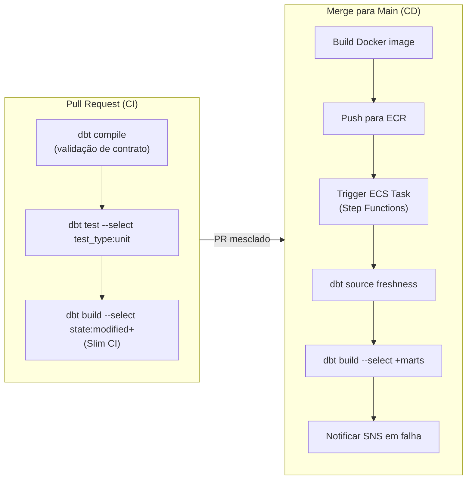
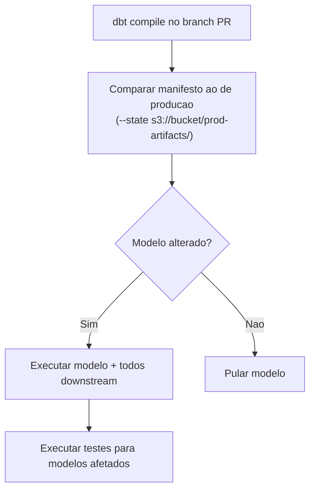

# Pipelines CI/CD e Slim CI no Redshift

Um projeto dbt sem um pipeline CI/CD é um passivo esperando para ser descoberto em produção. Este módulo constrói um pipeline de deploy de produção completo para dbt-core na AWS: GitHub Actions para CI, Slim CI usando comparação de estado do dbt, armazenamento de artefatos no S3 e deploy com Amazon ECS Fargate.

A automação de CI/CD traz três benefícios principais:
1. **Detecção precoce de erros**: problemas são capturados antes de chegar à produção
2. **Reprodutibilidade**: cada execução segue os mesmos passos determinísticos
3. **Velocidade**: Slim CI reduz drasticamente o tempo de execução ao processar apenas modelos modificados

---

## Visão Geral da Arquitetura do Pipeline



---

## Slim CI: Comparação Baseada em Estado

Slim CI executa o dbt apenas em modelos que mudaram desde a última execução de produção. Requer:

1. Um manifesto de produção (`manifest.json`) armazenado no S3
2. `--state` apontando para esse manifesto
3. `--select state:modified+` para selecionar modelos alterados e seus descendentes

### Como funciona



### Estrutura de Artefatos no S3

```
s3://my-dbt-artifacts/
├── prod/
│   ├── latest/
│   │   ├── manifest.json
│   │   ├── run_results.json
│   │   └── catalog.json
│   └── 2024-03-15T14:30:00/
│       ├── manifest.json
│       └── run_results.json
└── ci/
    └── pr-123/
        ├── manifest.json
        └── run_results.json
```

---

## Workflow CI do GitHub Actions

```yaml
# .github/workflows/dbt-ci.yml
name: dbt CI

on:
  pull_request:
    branches: [main]
    paths:
      - 'models/**'
      - 'macros/**'
      - 'tests/**'
      - 'snapshots/**'
      - 'seeds/**'
      - 'dbt_project.yml'
      - 'packages.yml'

env:
  AWS_REGION: us-east-1
  DBT_ARTIFACT_BUCKET: my-dbt-artifacts

jobs:
  dbt-ci:
    runs-on: ubuntu-latest
    permissions:
      id-token: write    # para autenticacao OIDC na AWS
      contents: read

    steps:
      - name: Checkout
        uses: actions/checkout@v4

      - name: Set up Python
        uses: actions/setup-python@v5
        with:
          python-version: '3.12'

      - name: Install dbt
        run: |
          pip install             dbt-core==1.10.4             dbt-redshift==1.10.1

      - name: Configure AWS credentials (OIDC)
        uses: aws-actions/configure-aws-credentials@v4
        with:
          role-to-assume: arn:aws:iam::${{ secrets.AWS_ACCOUNT_ID }}:role/GithubActionsDBTRole
          aws-region: ${{ env.AWS_REGION }}

      - name: Download prod manifest for Slim CI
        run: |
          mkdir -p ./prod-artifacts
          aws s3 cp s3://${{ env.DBT_ARTIFACT_BUCKET }}/prod/latest/manifest.json             ./prod-artifacts/manifest.json             || echo "No prod manifest found — running full CI"

      - name: Install dbt packages
        run: dbt deps
        env:
          DBT_PROFILES_DIR: ./ci-profiles

      - name: dbt compile (contract + Jinja validation)
        run: dbt compile
        env:
          DBT_PROFILES_DIR: ./ci-profiles
          DBT_TARGET: ci

      - name: Run unit tests
        run: dbt test --select "test_type:unit"
        env:
          DBT_PROFILES_DIR: ./ci-profiles
          DBT_TARGET: ci

      - name: Slim CI — build changed models + tests
        run: |
          if [ -f ./prod-artifacts/manifest.json ]; then
            dbt build               --select "state:modified+"               --defer               --state ./prod-artifacts               --exclude "test_type:unit"               --target ci
          else
            dbt build               --select "+marts"               --exclude "test_type:unit"               --target ci
          fi
        env:
          DBT_PROFILES_DIR: ./ci-profiles

      - name: Upload CI artifacts to S3
        if: always()
        run: |
          aws s3 sync ./target/             s3://${{ env.DBT_ARTIFACT_BUCKET }}/ci/pr-${{ github.event.pull_request.number }}/
```

### CI profiles.yml

```yaml
# ci-profiles/profiles.yml
my_analytics:
  target: ci
  outputs:
    ci:
      type: redshift
      method: iam
      host: ${{ secrets.REDSHIFT_CI_HOST }}
      port: 5439
      dbname: analytics_ci
      schema: "dbt_ci_pr_{{ env_var('PR_NUMBER', 'local') }}"
      region: us-east-1
      threads: 4
      keepalives_idle: 240
```

[!TIP]
Nomear dinamicamente o schema CI com o número do PR (`dbt_ci_pr_123`) garante que cada PR tenha seu próprio schema isolado. Adicione um job de limpeza que remova esses schemas após o merge do PR.

---

## CD: Deploy com Amazon ECS Fargate

### Dockerfile

```dockerfile
# Dockerfile
FROM python:3.12-slim

RUN pip install --no-cache-dir     dbt-core==1.10.4     dbt-redshift==1.10.1

WORKDIR /dbt

COPY . .

RUN dbt deps

ENTRYPOINT ["dbt"]
```

### Definição de Tarefa ECS (Terraform)

```hcl
# infrastructure/ecs_task.tf
resource "aws_ecs_task_definition" "dbt_run" {
  family                   = "dbt-analytics-run"
  network_mode             = "awsvpc"
  requires_compatibilities = ["FARGATE"]
  cpu                      = "2048"
  memory                   = "4096"
  execution_role_arn       = aws_iam_role.ecs_task_execution.arn
  task_role_arn            = aws_iam_role.dbt_task.arn

  container_definitions = jsonencode([{
    name  = "dbt"
    image = "${aws_ecr_repository.dbt.repository_url}:latest"

    environment = [
      { name = "DBT_TARGET", value = "prod" }
    ]

    secrets = [
      {
        name      = "REDSHIFT_HOST"
        valueFrom = "${aws_secretsmanager_secret.redshift.arn}:host::"
      },
      {
        name      = "REDSHIFT_USER"
        valueFrom = "${aws_secretsmanager_secret.redshift.arn}:user::"
      },
      {
        name      = "REDSHIFT_PASSWORD"
        valueFrom = "${aws_secretsmanager_secret.redshift.arn}:password::"
      }
    ]

    logConfiguration = {
      logDriver = "awslogs"
      options = {
        "awslogs-group"         = "/ecs/dbt-analytics"
        "awslogs-region"        = "us-east-1"
        "awslogs-stream-prefix" = "ecs"
      }
    }
  }])
}
```

### Máquina de Estados Step Functions

```json
{
  "Comment": "Pipeline de producao dbt",
  "StartAt": "SourceFreshness",
  "States": {
    "SourceFreshness": {
      "Type": "Task",
      "Resource": "arn:aws:states:::ecs:runTask.sync",
      "Parameters": {
        "Cluster": "${ECS_CLUSTER_ARN}",
        "TaskDefinition": "${TASK_DEF_ARN}",
        "Overrides": {
          "ContainerOverrides": [{
            "Name": "dbt",
            "Command": ["source", "freshness"]
          }]
        }
      },
      "Next": "DbtBuild",
      "Catch": [{
        "ErrorEquals": ["States.ALL"],
        "Next": "NotifyFailure"
      }]
    },

    "DbtBuild": {
      "Type": "Task",
      "Resource": "arn:aws:states:::ecs:runTask.sync",
      "Parameters": {
        "Cluster": "${ECS_CLUSTER_ARN}",
        "TaskDefinition": "${TASK_DEF_ARN}",
        "Overrides": {
          "ContainerOverrides": [{
            "Name": "dbt",
            "Command": ["build", "--select", "+marts", "--exclude", "test_type:unit"]
          }]
        }
      },
      "Next": "UploadArtifacts",
      "Catch": [{
        "ErrorEquals": ["States.ALL"],
        "Next": "NotifyFailure"
      }]
    },

    "UploadArtifacts": {
      "Type": "Task",
      "Resource": "arn:aws:states:::ecs:runTask.sync",
      "Parameters": {
        "Cluster": "${ECS_CLUSTER_ARN}",
        "TaskDefinition": "${TASK_DEF_ARN}",
        "Overrides": {
          "ContainerOverrides": [{
            "Name": "dbt",
            "Command": ["run-operation", "upload_artifacts_to_s3"]
          }]
        }
      },
      "End": true,
      "Catch": [{
        "ErrorEquals": ["States.ALL"],
        "Next": "NotifyFailure"
      }]
    },

    "NotifyFailure": {
      "Type": "Task",
      "Resource": "arn:aws:states:::sns:publish",
      "Parameters": {
        "TopicArn": "${SNS_FAILURE_TOPIC}",
        "Message.$": "States.Format('dbt pipeline falhou: {}', $.Error)"
      },
      "End": true
    }
  }
}
```

### Macro: Upload de Artefatos para S3

```sql
-- macros/ops/upload_artifacts_to_s3.sql

    
    {% set timestamp = run_started_at.strftime('%Y-%m-%dT%H:%M:%S') %}

    

    
        {{ log("Executando: " ~ cmd, info=true) }}
    

    {{ log("Artefatos enviados para s3://" ~ bucket ~ "/prod/latest/", info=true) }}

```

---

## Limpeza de Schema de PR

```yaml
# .github/workflows/pr-cleanup.yml
name: Cleanup PR Schema

on:
  pull_request:
    types: [closed]

jobs:
  cleanup:
    runs-on: ubuntu-latest
    steps:
      - name: Configure AWS credentials
        uses: aws-actions/configure-aws-credentials@v4
        with:
          role-to-assume: arn:aws:iam::${{ secrets.AWS_ACCOUNT_ID }}:role/GithubActionsDBTRole
          aws-region: us-east-1

      - name: Drop CI schema
        run: |
          aws redshift-data execute-statement             --cluster-identifier ${{ secrets.REDSHIFT_CLUSTER_ID }}             --database analytics_ci             --sql "DROP SCHEMA IF EXISTS dbt_ci_pr_${{ github.event.pull_request.number }} CASCADE;"             --region us-east-1
```

---

## 6 Perguntas de Pratica

```question
{
  "id": "dbt-rs-08-q1",
  "type": "multiple-choice",
  "question": "Qual artefato o Slim CI requer para saber quais modelos mudaram desde a ultima execucao de producao?",
  "options": [
    "catalog.json da execucao CI",
    "manifest.json da ultima execucao de producao",
    "run_results.json da execucao CI",
    "sources.json de qualquer execucao anterior"
  ],
  "correct": 1,
  "explanation": "Slim CI compara o manifesto compilado do branch atual contra o manifest.json de producao usando --state. O manifesto registra o hash de cada modelo, permitindo que o dbt detecte quais mudaram."
}
```

```question
{
  "id": "dbt-rs-08-q2",
  "type": "multiple-choice",
  "question": "A flag `--defer` no Slim CI faz o que?",
  "options": [
    "Adia a execucao de testes para depois que todos os modelos sao construidos",
    "Busca modelos nao selecionados por --select do ambiente de producao em vez de reconstrui-los no CI",
    "Atrasa a execucao CI em 60 segundos para permitir que o Redshift aqueça",
    "Adia o upload de artefatos para uma etapa pos-execucao"
  ],
  "correct": 1,
  "explanation": "--defer diz ao dbt para buscar dependencias ref() nao selecionadas do artefato --state em vez de reconstrui-las no ambiente CI. Isso significa que um modelo alterado no PR ainda pode referenciar suas dependencias upstream construidas em producao."
}
```

```question
{
  "id": "dbt-rs-08-q3",
  "type": "multiple-choice",
  "question": "Por que nomear schemas CI com o numero do PR (ex.: `dbt_ci_pr_123`) e uma boa pratica?",
  "options": [
    "Acelera a execucao de consultas no Redshift",
    "Fornece isolamento entre execucoes CI concorrentes e permite limpeza automatizada apos merge do PR",
    "E exigido pelo adapter dbt-redshift",
    "Melhora a precisao da comparacao de estado do Slim CI"
  ],
  "correct": 1,
  "explanation": "Schemas numerados por PR previnem que execucoes CI de diferentes PRs interfiram umas com as outras. Apos o merge, o schema pode ser automaticamente removido via um workflow de limpeza, mantendo o banco de dados CI organizado."
}
```

```question
{
  "id": "dbt-rs-08-q4",
  "type": "multiple-choice",
  "question": "Na maquina de estados Step Functions, o que acontece se o estado DbtBuild falhar?",
  "options": [
    "Step Functions tenta novamente automaticamente com backoff exponencial",
    "O bloco Catch transiciona para NotifyFailure, que publica em um topico SNS",
    "O pipeline reinicia a partir de SourceFreshness",
    "A falha e silenciosamente ignorada"
  ],
  "correct": 1,
  "explanation": "A clausula Catch em cada estado captura erros States.ALL e transiciona para o estado NotifyFailure, que publica os detalhes do erro em um topico SNS para alerta."
}
```

```question
{
  "id": "dbt-rs-08-q5",
  "type": "multiple-choice",
  "question": "Qual combinacao de seletor garante que testes unitarios sejam excluidos do comando `dbt build` do Slim CI?",
  "options": [
    "--exclude tests/",
    "--exclude test_type:unit",
    "--select test_type:data",
    "--no-unit-tests"
  ],
  "correct": 1,
  "explanation": "O seletor --exclude test_type:unit diz ao dbt para pular testes unitarios durante o build. Testes unitarios ja devem ter sido executados em uma etapa dedicada anterior no pipeline CI."
}
```

```question
{
  "id": "dbt-rs-08-q6",
  "type": "multiple-choice",
  "question": "Usar OIDC da AWS em vez de credenciais AWS estaticas no GitHub Actions fornece qual beneficio chave de seguranca?",
  "options": [
    "Autenticacao mais rapida ao Redshift",
    "Tokens de curta duracao sao trocados por execucao de workflow — nenhuma chave de acesso AWS de longa duracao e armazenada em segredos do GitHub",
    "Ignora os requisitos de security group do Redshift",
    "Habilita acesso a clusters Redshift privados sem VPN"
  ],
  "correct": 1,
  "explanation": "Autenticacao OIDC (OpenID Connect) para AWS a partir do GitHub Actions gera tokens de curta duracao por execucao de workflow. Isso elimina a necessidade de armazenar chaves de acesso AWS de longa duracao como segredos do GitHub, reduzindo significativamente o raio de explosao de um vazamento de credenciais."
}
```

---

[!SUCCESS]
### Principais Conclusoes

- Slim CI usa `--select state:modified+` e `--state ./prod-artifacts` para construir apenas modelos alterados e seus descendentes — drasticamente mais rapido que execucoes de projeto completo.
- `--defer` permite que o CI referencie modelos upstream construidos em producao sem reconstrui-los no ambiente CI.
- Armazene `manifest.json` no S3 apos cada execucao de producao para que esteja disponivel para a proxima comparacao CI.
- Use autenticacao OIDC para AWS a partir do GitHub Actions — sem credenciais estaticas armazenadas em segredos.
- ECS Fargate + Step Functions e o padrao idiomatico na AWS para executar dbt em producao: containerizado, serverless e totalmente observavel.
- Schemas CI numerados por PR fornecem isolamento e permitem limpeza automatizada apos merge.
- O padrao de notificacao de falha (SNS + Step Functions Catch) e essencial para observabilidade em producao.
