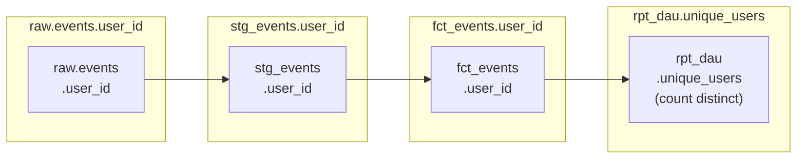

# dbt Docs: Documentação, Linhagem e o Catálogo dbt Docs v2

Documentação não é opcional em um projeto dbt de produção. É o mapa que permite que todo engenheiro — incluindo você daqui a seis meses — entenda o que cada modelo faz, de onde os dados vêm e o que quebra se você mudar algo. O dbt torna a documentação um cidadão de primeira classe: ela é gerada a partir do mesmo YAML que define seus testes e contratos, e está sempre em sincronia com seu projeto.

A partir de Junho de 2026, o dbt oferece três superfícies de documentação:

| Superfície | Disponibilidade | Capacidade chave |
| :--- | :--- | :--- |
| **dbt Docs (Legacy)** | dbt-core v1.x, todos usuários | Site estático, linhagem de modelos, catalog.json |
| **dbt Docs v2 (alpha)** | dbt Core v2 + Fusion | UI moderna, linhagem em nível de coluna, API REST, artefatos Parquet |
| **Catálogo** | Plataforma dbt (paga) | Tempo real, colaboração, visualizações customizadas |

Este módulo cobre as duas primeiras — tudo disponível para usuários self-hosted de dbt-core + Fusion.

---

## Escrevendo Documentação Que Realmente é Usada

A diferença entre documentação boa e ruim no dbt não é técnica — é disciplina. Siga estas regras em todo modelo.

### Camada 1: Descrições no Nível do Modelo

```yaml
# models/marts/facts/schema.yml
models:
  - name: fct_orders
    description: >
      Uma linha por pedido de cliente. Grão: order_id. Construída a partir de `stg_orders`
      com join em `dim_customers`. Populada incrementalmente via estratégia `merge`
      em `order_id`. Usada pelo dashboard de Receita e pelo mart
      Customer 360.

      **Proprietário:** Engenharia de Dados
      **SLA:** Atualizado dentro de 30 minutos do frescor da fonte.
      **Consumidores downstream:** `rpt_daily_revenue`, `dim_customer_ltv`,
      workbook Tableau de Receita.

    config:
      contract:
        enforced: true
      tags: ['finance', 'orders', 'tier-1']
      meta:
        owner: data-engineering
        tier: 1
        pii: false
        sla_minutes: 30
        slack_alert_channel: '#alerts-data-platform'
```

### Camada 2: Descrições de Colunas com Blocos Docs

Para descrições longas e reutilizáveis, use blocos `docs` em vez de strings inline:

```markdown
<!-- docs/orders.md -->


O identificador único para um pedido, originado do sistema OMS.
Formato: `ORD-XXXXXXXXXX` (inteiro de 10 dígitos zero-padded com prefixo).
Chave primária — garantida única e não nula por contrato de modelo.



O estado atual do ciclo de vida do pedido. Mapeado de códigos de status brutos do OMS:

| Código bruto | Valor de exibição | Terminal? |
|-------------|-------------------|-----------|
| P           | Pending           | Não       |
| S           | Shipped           | Não       |
| D           | Delivered         | Sim       |
| C           | Cancelled         | Sim       |
| RJ          | Rejected          | Sim       |

Atualizações de status tardias são capturadas através da janela de `lookback`
de 3 dias na estratégia incremental.



Segmento atribuído pelo sistema CRM. Um de: Enterprise, SMB, Consumer.
Originado de `dim_customers.customer_segment`. Snapshotado — reflete
o segmento no momento do pedido, não o segmento atual.

```

```yaml
# models/marts/facts/schema.yml
models:
  - name: fct_orders
    columns:
      - name: order_id
        description: "{{ doc('order_id') }}"
        data_tests: [not_null, unique]

      - name: status
        description: "{{ doc('order_status') }}"
        data_tests:
          - accepted_values:
              values: ['Pending', 'Shipped', 'Delivered', 'Cancelled', 'Rejected']

      - name: customer_segment
        description: "{{ doc('customer_segment') }}"
```

[!TIP]
Blocos Docs em arquivos `.md` sob `docs/` são versionados junto com seus modelos. Eles podem ser referenciados através de múltiplos schemas — escreva `{{ doc('order_id') }}` uma vez, reutilize em todo lugar que `order_id` aparecer. Esta é a chave para documentação consistente e sustentável em escala.

### Camada 3: Documentação de Sources

```yaml
# models/staging/sources.yml
sources:
  - name: raw_events
    description: >
      Eventos de clickstream brutos entregues via Amazon Kinesis Data Firehose
      para o S3, então carregados no Redshift via COPY. O schema é aplicado
      na camada de entrega do Firehose. Eventos são append-only — nunca
      atualizados após o landing.
    tables:
      - name: events
        description: >
          Eventos individuais de usuário (page views, clicks, form submits).
          Particionado por `event_date` no Redshift. Volume: ~50M linhas/dia.
          Status bruto — sem deduplicação ou tratamento de nulos aplicado.
        columns:
          - name: event_id
            description: "UUID atribuído pelo produtor do evento. Não garantido único no bruto."
          - name: event_timestamp
            description: "Timestamp UTC definido pelo SDK do cliente. Pode estar até 5 min atrás do tempo do servidor."
```

### Camada 4: Exposures — Documente Consumidores Downstream

Exposures declaram o que consome seus modelos dbt, completando o quadro de linhagem da fonte ao dashboard.

```yaml
# models/exposures.yml
exposures:
  - name: revenue_dashboard
    label: "Dashboard de Receita (Tableau)"
    type: dashboard
    maturity: high
    url: https://tableau.example.com/views/RevenueDashboard
    description: >
      Dashboard executivo de receita. Atualiza a cada 30 minutos.
      Consulta diretamente `fct_orders` e `rpt_daily_revenue`.
      Pertence ao time de Analytics Financeiro.
    depends_on:
      - ref('fct_orders')
      - ref('rpt_daily_revenue')
      - ref('dim_customers')
    owner:
      name: Analytics Financeiro
      email: analytics@example.com

  - name: customer_api
    label: "API Customer 360"
    type: application
    maturity: high
    url: https://api.example.com/customer-360/docs
    description: >
      API REST interna servindo dados de cliente para o produto. Consulta
      `dim_customer_ltv` diretamente via credenciais IAM do Redshift.
    depends_on:
      - ref('dim_customer_ltv')
      - ref('dim_customers')
    owner:
      name: Engenharia de Plataforma
      email: platform@example.com
```

Exposures aparecem no DAG do dbt, permitindo rastrear: fonte → staging → mart → dashboard. Isso é crítico para análise de impacto antes de fazer mudanças disruptivas.

---

## Gerando e Servindo Documentação

### Gerar Docs

```bash
# Geração completa (compila + inspeciona warehouse para tipos de coluna)
dbt docs generate

# Pular compilação (mais rápido, usa último manifesto compilado)
dbt docs generate --no-compile

# Gerar catálogo apenas para modelos específicos (útil para projetos grandes)
dbt docs generate --select +marts

# Pular catálogo (mais rápido; tipos de coluna não aparecerão, mas descrições sim)
dbt docs generate --empty-catalog
```

`dbt docs generate` produz dois arquivos em `target/`:

| Arquivo | Conteúdo |
| :--- | :--- |
| `manifest.json` | Grafo completo do projeto — modelos, testes, fontes, macros, docs |
| `catalog.json` | Introspecção do warehouse — tipos de coluna, contagens de linhas, estatísticas |

### Servir Localmente

```bash
# Iniciar servidor web local (padrão: http://localhost:8080)
dbt docs serve

# Porta personalizada
dbt docs serve --port 8090
```

[!WARNING]
`dbt docs serve` é apenas para desenvolvimento local — ele inicia um servidor HTTP não autenticado. Nunca o exponha publicamente. Para hospedagem para equipe, implante os arquivos estáticos no S3 + CloudFront ou em um servidor web interno.

---

## Hospedando Docs no S3 + CloudFront

```bash
# Build e upload para S3
dbt docs generate

aws s3 sync ./target/ s3://my-dbt-docs-bucket/     --exclude "*"     --include "index.html"     --include "manifest.json"     --include "catalog.json"
```

Terraform para a distribuição CloudFront:

```hcl
# infrastructure/docs_hosting.tf
resource "aws_s3_bucket" "dbt_docs" {
  bucket = "my-dbt-docs-bucket"
}

resource "aws_s3_bucket_website_configuration" "dbt_docs" {
  bucket = aws_s3_bucket.dbt_docs.id
  index_document { suffix = "index.html" }
}

resource "aws_cloudfront_distribution" "dbt_docs" {
  origin {
    domain_name = aws_s3_bucket.dbt_docs.bucket_regional_domain_name
    origin_id   = "dbt-docs-s3"

    s3_origin_config {
      origin_access_identity = aws_cloudfront_origin_access_identity.dbt_docs.cloudfront_access_identity_path
    }
  }

  enabled             = true
  default_root_object = "index.html"
  price_class         = "PriceClass_100"

  # Autenticação via Cognito ou allowlist de IP (recomendado para ferramentas internas)
  restrictions {
    geo_restriction { restriction_type = "none" }
  }

  viewer_certificate {
    acm_certificate_arn = var.acm_cert_arn
    ssl_support_method  = "sni-only"
  }
}
```

Adicione geração de docs ao seu pipeline CD:

```yaml
# .github/workflows/dbt-cd.yml (adição)
- name: Gerar e enviar docs
  run: |
    dbt docs generate --no-compile   # manifesto já existe do dbt build
    aws s3 sync ./target/ s3://${{ env.DBT_DOCS_BUCKET }}/       --include "index.html"       --include "manifest.json"       --include "catalog.json"
    aws cloudfront create-invalidation       --distribution-id ${{ secrets.CLOUDFRONT_DIST_ID }}       --paths "/*"
```

---

## dbt Docs v2 (Alpha — dbt Core v2 + Fusion)

O dbt Docs v2 é um catálogo open-source moderno e performático com uma UI redesenhada, metadados da Semantic Layer, linhagem em nível de coluna e uma API REST. Está disponível com o motor dbt Fusion e dbt Core v2.

### Principais diferenças do dbt Docs legado

| Funcionalidade | dbt Docs (Legacy) | dbt Docs v2 |
| :--- | :--- | :--- |
| Formato de artefato | `manifest.json` + `catalog.json` (JSON grande) | Artefatos Parquet (consultáveis via DuckDB) |
| Linhagem em nível de coluna | Não | Sim — potencializado pelo parsing SQL do Fusion |
| Escala do projeto | Dificuldade com 1.000+ modelos | Escala para projetos de tamanho arbitrário |
| API REST | Não | Sim |
| UI | v1 (funcional) | Redesenhada (mais rápida, filtrável) |

### Artefatos Parquet

O dbt v2.0 pode emitir artefatos Parquet como uma alternativa de alta performance para grandes arquivos JSON como manifest.json. Por serem Parquet, você pode consultá-los diretamente através do DuckDB — um grande avanço para ferramentas de metadados e workflows de IA. A experiência local de docs foi reconstruída, potencializada por esses novos artefatos Parquet, e agora é capaz de escalar para projetos de tamanho arbitrário.

Consulte artefatos diretamente com DuckDB:

```bash
# Instalar DuckDB
pip install duckdb

# Consultar o manifesto Parquet do seu projeto dbt
python3 -c "
import duckdb
con = duckdb.connect()

# Listar todos os modelos com suas descrições
con.execute("""
    SELECT
        name,
        description,
        config.materialized AS materialization,
        config.schema AS schema_name
    FROM read_parquet('target/manifest.parquet')
    WHERE resource_type = 'model'
    ORDER BY schema_name, name
""").df().to_string()
"
```

### Linhagem em Nível de Coluna

Com o motor Fusion, o dbt Docs v2 mostra quais colunas de origem fluem para quais colunas de mart — através de cada etapa de transformação. Isso é potencializado pelo parsing SQL nativo do Fusion:



A linhagem em nível de coluna permite:
- **Análise de impacto**: "Se eu renomear `user_id` na tabela bruta, o que quebra?"
- **Rastreamento de origem de dados**: "De onde vem o numerador deste KPI?"
- **Auditoria de privacidade**: "Quais colunas contêm PII e para onde elas fluem?"

---

## Aplicação de Cobertura de Documentação

Use `dbt-project-evaluator` para aplicar padrões de documentação:

```yaml
# packages.yml
packages:
  - package: dbt-labs/dbt_project_evaluator
    version: 0.13.0
```

```bash
dbt build --select package:dbt_project_evaluator
```

Isso gera modelos como `fct_undocumented_models`, `fct_missing_primary_key_tests`, e `fct_model_fanout` — tabelas que você pode consultar ou alertar no CI.

Limiares customizados no `dbt_project_evaluator.yml`:

```yaml
vars:
  dbt_project_evaluator:
    # Falhar CI se a cobertura de documentação cair abaixo de 80%
    documentation_coverage_target: 80

    # Sinalizar modelos com mais de 5 pais (cheiro de complexidade de DAG)
    max_fanout_models: 5

    # Exigir que todos os modelos mart tenham pelo menos um teste
    marts_without_tests: error
```

---

## 6 Perguntas de Prática

```question
{
  "id": "dbt-rs-09-q1",
  "type": "multiple-choice",
  "question": "O que é um bloco `docs` e onde deve ser armazenado em um projeto dbt?",
  "options": [
    "Um docstring Python em um arquivo de macro, armazenado em macros/",
    "Um bloco Jinja markdown em um arquivo .md sob o diretório docs-paths, referenciado com {{ doc('nome') }}",
    "Um objeto JSON em schema.yml descrevendo metadados do modelo",
    "Um bloco de comentário no topo de um arquivo de modelo SQL"
  ],
  "correct": 1,
  "explanation": "Blocos Docs são blocos Jinja markdown escritos dentro de ... em arquivos .md sob o diretório docs-paths. São referenciados em YAML com {{ doc('nome') }} e permitem descrições reutilizáveis e formatadas através de múltiplos modelos."
}
```

```question
{
  "id": "dbt-rs-09-q2",
  "type": "multiple-choice",
  "question": "O que `exposures` adiciona ao grafo de linhagem do dbt?",
  "options": [
    "Tabelas fonte adicionais não cobertas por sources.yml",
    "Consumidores downstream (dashboards, APIs, apps) que dependem de modelos dbt, completando a linhagem fonte-ao-consumidor",
    "Macros externas importadas de pacotes",
    "Tabelas externas do Redshift via Spectrum"
  ],
  "correct": 1,
  "explanation": "Exposures declaram consumidores downstream — dashboards, APIs, modelos ML — que dependem de modelos mart do dbt. Eles aparecem no DAG, permitindo rastreamento de linhagem completo de ponta a ponta da fonte bruta ao consumidor de negócio."
}
```

```question
{
  "id": "dbt-rs-09-q3",
  "type": "multiple-choice",
  "question": "Qual flag do dbt docs generate dá a execução mais rápida durante o desenvolvimento, ao custo de não mostrar tipos de coluna na UI?",
  "options": [
    "--no-compile",
    "--empty-catalog",
    "--select staging",
    "--fast"
  ],
  "correct": 1,
  "explanation": "--empty-catalog pula a etapa de introspecção do warehouse que popula catalog.json. Isso remove metadados de tipo de coluna e contagem de linhas do site de docs mas é significativamente mais rápido — útil durante o desenvolvimento quando os tipos de coluna já são conhecidos."
}
```

```question
{
  "id": "dbt-rs-09-q4",
  "type": "multiple-choice",
  "question": "O que permite a linhagem em nível de coluna no dbt Docs v2, e por que o dbt Core v1 não pode fornecê-la?",
  "options": [
    "Um plugin do adapter dbt-redshift; v1 carece de integração Redshift",
    "O parsing SQL nativo do motor dbt Fusion; Core v1 renderiza Jinja mas não faz parsing de ASTs SQL para rastrear fluxos de coluna",
    "Uma função Lambda@Edge do CloudFront que analisa logs de consulta",
    "O arquivo catalog.json, que v1 também gera mas em formato incompatível"
  ],
  "correct": 1,
  "explanation": "Linhagem em nível de coluna requer parsing de SQL para construir uma Árvore Sintática Abstrata (AST) e rastrear a origem de cada coluna. O motor Fusion faz isso nativamente através de múltiplos dialetos SQL. O dbt Core v1 apenas renderiza Jinja em strings SQL — ele não faz parsing de ASTs SQL."
}
```

```question
{
  "id": "dbt-rs-09-q5",
  "type": "multiple-choice",
  "question": "Por que `dbt docs serve` não é apropriado para compartilhamento de documentação em equipe?",
  "options": [
    "Ele só gera documentação para a camada staging",
    "Ele inicia um servidor HTTP não autenticado — não deve ser exposto publicamente",
    "Requer uma licença paga da plataforma dbt",
    "É muito lento para acesso multiusuário"
  ],
  "correct": 1,
  "explanation": "dbt docs serve é projetado apenas para uso em desenvolvimento local. Ele serve arquivos através de um servidor HTTP não autenticado. Para acesso da equipe, implante os arquivos estáticos gerados (index.html, manifest.json, catalog.json) no S3 + CloudFront com controles de acesso apropriados."
}
```

```question
{
  "id": "dbt-rs-09-q6",
  "type": "multiple-choice",
  "question": "O pacote dbt-project-evaluator gera modelos como `fct_undocumented_models`. Como você deve usar isso no CI?",
  "options": [
    "Executar dbt build --select package:dbt_project_evaluator e alertar se algum modelo evaluator contiver linhas",
    "Revisar manualmente os modelos gerados após cada execução de produção",
    "Usar apenas durante o desenvolvimento, nunca no CI",
    "É compatível apenas com orquestração dbt Cloud"
  ],
  "correct": 0,
  "explanation": "dbt-project-evaluator materializa descobertas como tabelas. Executá-lo no CI e falhar o build se tabelas evaluator contiverem linhas (via um teste singular ou uma etapa de verificação separada) aplica padrões de documentação e cobertura de teste automaticamente."
}
```

---

[!SUCCESS]
### Principais Conclusões

- Escreva descrições em três níveis: modelo (o que, por que, quem é dono), coluna (semântica exata, formato, fonte) e source (características de dados brutos, volume, latência).
- Use blocos `docs` em arquivos `.md` para descrições longas e reutilizáveis — referencie-os com `{{ doc('nome') }}` para evitar repetição.
- `exposures` completam sua linhagem adicionando consumidores downstream (dashboards, APIs, apps) ao DAG.
- `dbt docs generate` produz `manifest.json` (grafo do projeto) e `catalog.json` (introspecção do warehouse). Hospede o site estático no S3 + CloudFront para acesso da equipe.
- dbt Docs v2 (disponível com dbt Core v2 / Fusion) introduz artefatos Parquet, linhagem em nível de coluna e uma API REST — consultáveis diretamente com DuckDB.
- `dbt-project-evaluator` aplica cobertura de documentação e padrões de qualidade de DAG no CI — execute-o como parte do seu quality gate.
