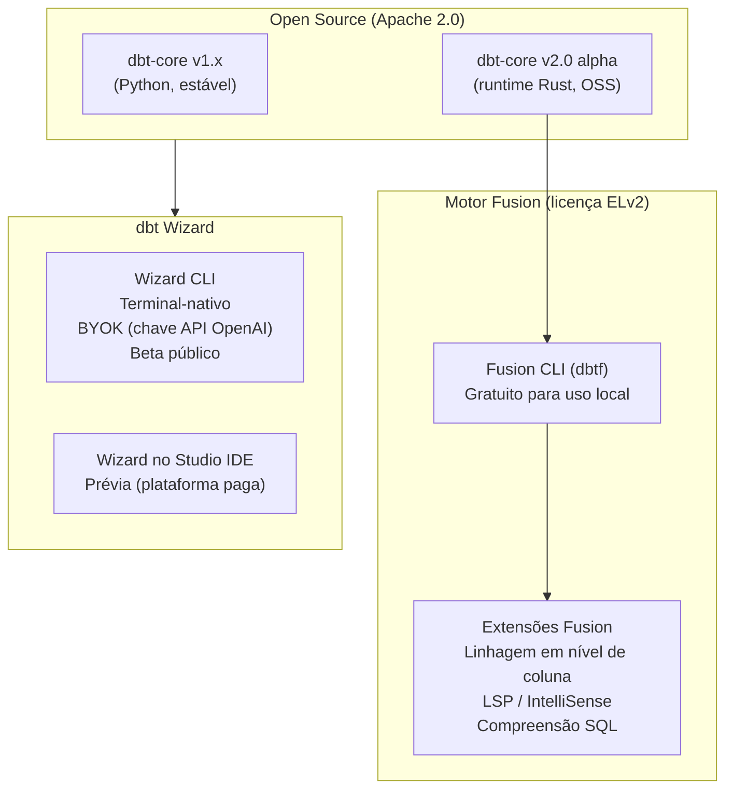
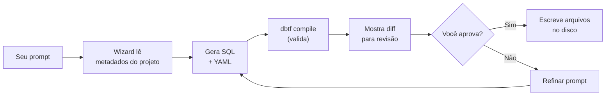
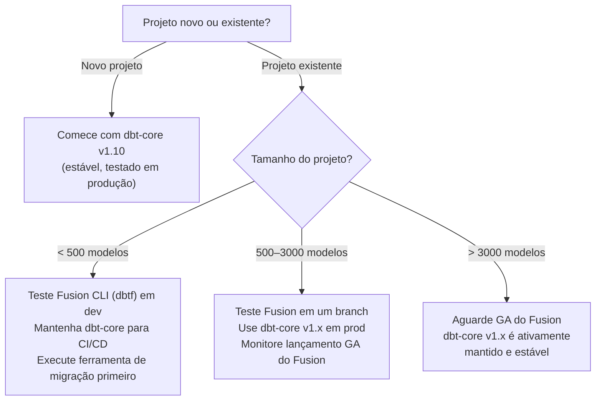

# Motor dbt Fusion e dbt Wizard

O toolchain de engenharia de análise está passando pela mudança mais significativa desde que o próprio dbt foi criado. Duas tecnologias definem esta nova era: o **motor dbt Fusion** — uma reescrita em Rust que substitui a camada de execução Python com compilação incrivelmente mais rápida e consciente de SQL — e o **dbt Wizard** — um agente de IA que entende seu projeto dbt completo antes de escrever uma única linha. Ambos estão disponíveis para usuários self-hosted e open-source do dbt.

---

## O Ecossistema em Junho de 2026

Antes de mergulhar na instalação, entenda o panorama atual:



O dbt Core v2 é a fundação open-source Apache 2.0 sobre a qual o motor dbt Fusion é construído. Ele oferece um runtime mais rápido baseado em Rust enquanto preserva a experiência dbt que os profissionais já conhecem. Está atualmente em alpha.

O dbt Fusion é distribuído sob a Elastic License Version 2 (ELv2). O dbt Core permanece sob a licença open-source Apache 2.0 e continuará sendo mantido indefinidamente.

**O que isso significa para usuários self-hosted de dbt-Redshift:**
- Você pode instalar o **Fusion CLI** (`dbtf`) gratuitamente — obtenha parsing e compilação mais rápidos sem restrições de licença para uso self-hosted.
- **dbt Wizard CLI** está em beta público e é gratuito para usar com sua própria chave de API OpenAI (BYOK).
- dbt-core v1.x continua totalmente suportado e é a escolha estável de produção para projetos grandes.

---

## Motor dbt Fusion

### O que o Fusion Muda

O motor dbt Fusion oferece à sua equipe até 30x mais performance e vem com diferentes funcionalidades dependendo de onde você o usa. Ele potencializa tanto melhorias no nível do motor (como compilação mais rápida e builds incrementais) quanto funcionalidades no nível do editor (como IntelliSense, informações de hover e erros inline) através do LSP por meio da extensão VS Code do dbt.

| Capacidade | dbt-core v1.x | dbt-core v2 (Rust OSS) | Motor Fusion |
| :--- | :--- | :--- | :--- |
| Velocidade de parse | Linha de base | Até 30× mais rápido | Até 30× mais rápido |
| Renderização SQL (Jinja) | ✅ | ✅ | ✅ |
| Parsing SQL (AST) | ❌ | Parcial | ✅ |
| Linhagem em nível de coluna | ❌ | Parcial | ✅ |
| LSP / IntelliSense | ❌ | ❌ | ✅ (via extensão VS Code) |
| Artefatos Parquet | ❌ | ✅ | ✅ |
| Validação estrita de configuração | ❌ | ✅ | ✅ |
| Licença | Apache 2.0 | Apache 2.0 | ELv2 |

O v2.0 introduz uma especificação de linguagem estrita e bem definida. Torna-se impossível configurar silenciosamente uma chave incorretamente — um `desciptin` digitado errado em vez de `description` é capturado em vez de ignorado.

### Adapter Redshift no Fusion

O motor Fusion lançou suporte para Redshift (junto com Snowflake, Databricks e BigQuery) como parte do lançamento de prévia. O driver ADBC do Redshift foi lançado em Setembro de 2025, substituindo o `redshift-connector` Python por uma camada de transferência de dados nativa Arrow.

Para BigQuery e Redshift, o Fusion respeita o número de threads definido pelo usuário para gerenciar limites de taxa e restrições de concorrência. Definir `--threads 0` ou omitir a configuração permite que o Fusion otimize dinamicamente.

### Instalando o Fusion CLI

```bash
# macOS / Linux — instalador de uma linha
curl -fsSL https://fusion.getdbt.com/install.sh | sh

# Recarregar shell após instalação
source ~/.zshrc   # ou ~/.bashrc

# Verificar — Fusion instala como 'dbt' e 'dbtf'
dbtf --version
# dbt Fusion 1.0.0-preview (Rust runtime)

# Se você tem dbt-core instalado, use dbtf para evitar conflitos
dbtf --version    # Fusion
dbt --version     # dbt-core (inalterado)
```

No Windows (PowerShell):

```powershell
# Instalador Windows
iwr -useb https://fusion.getdbt.com/install.ps1 | iex

# Verificar
dbtf --version
```

### Executando Fusion Contra Redshift

Seu `profiles.yml` existente funciona sem modificação — o Fusion lê o mesmo arquivo:

```bash
# Mesmos comandos, parse + compilação dramaticamente mais rápidos
dbtf debug                          # testar conexão
dbtf compile --select staging       # compilar sem executar
dbtf run --select +fct_orders       # executar modelos
dbtf test --select marts            # executar testes
dbtf build --select +marts          # build + teste na ordem do DAG
```

### Funcionalidades Específicas do Fusion no Redshift

#### 1. Validação Estrita de Chaves

O Fusion captura erros de digitação em configurações YAML que o dbt-core v1.x ignora silenciosamente:

```yaml
# Isto silenciosamente não faz nada no dbt-core v1.x
# Fusion levanta um erro: "Unknown config key 'destription'"
models:
  - name: fct_orders
    destription: "Uma linha por pedido"    # ← erro de digitação capturado pelo Fusion
    config:
      materialzed: table               # ← erro de digitação capturado pelo Fusion
```

#### 2. Flag `--sample` (prévia Fusion)

Execute sua lógica SQL completa contra uma amostra de linhas — sem modificar seus modelos:

```bash
# Executar fct_orders contra 1% de amostra dos dados upstream
dbtf run --select fct_orders --sample 0.01

# Usar para iteração rápida durante desenvolvimento de modelo
dbtf build --select +new_mart_model --sample 0.05
```

Isso é particularmente útil para Redshift Serverless onde escanear tabelas completas durante o desenvolvimento incorre em custo desnecessário.

#### 3. Builds Incrementais (Cache de Estado do Fusion)

O dbt State (prévia) atua como uma camada de cache para pipelines de dados, construindo apenas o que mudou. A empresa alega que isso pode reduzir custos de infraestrutura em 30 por cento ou mais.

O Fusion mantém um cache de estado local que rastreia quais modelos precisam ser reconstruídos — como Slim CI, mas para desenvolvimento local:

```bash
# Primeira execução — constrói tudo, salva estado
dbtf run --select +marts

# Segunda execução — apenas reconstrói modelos cujo SQL mudou
dbtf run --select +marts --state ./target
# Saída: 3 modelos alterados, 47 modelos pulados (em cache)
```

#### 4. Extensão VS Code para Desenvolvimento Redshift

Instale a extensão VS Code do dbt para funcionalidades de IDE potencializadas pelo Fusion:

```
1. Abra VS Code
2. Extensões → pesquise "dbt Power User" ou "dbt (oficial)"
3. Instale a extensão oficial da dbt Labs
4. Abra sua pasta de projeto dbt
5. A extensão detecta automaticamente o Fusion se dbtf estiver no PATH
```

Funcionalidades ativas no Redshift:
- **IntelliSense**: `{{ ref('` autocompleta com nomes de modelos do seu projeto
- **Informação de hover**: passe o mouse sobre um `ref()` para ver a descrição e colunas do modelo
- **Erros inline**: erros de digitação em YAML e chamadas `ref()` quebradas são destacados sem executar
- **Linhagem de coluna**: clique em uma coluna para rastreá-la upstream/downstream

#### 5. Artefatos Parquet para Consultas de Metadados

Com o Fusion, `manifest.json` e `catalog.json` também são emitidos como Parquet:

```python
# Consulte metadados do seu projeto dbt com DuckDB — sem necessidade de parsing JSON
import duckdb

con = duckdb.connect()

# Encontrar todos os modelos acima de 60 segundos na última execução
slow_models = con.execute("""
    SELECT
        name,
        execution_time_seconds,
        schema_name,
        materialization
    FROM read_parquet('target/run_results.parquet')
    WHERE resource_type = 'model'
      AND execution_time_seconds > 60
    ORDER BY execution_time_seconds DESC
""").df()

print(slow_models.to_string())
```

---

## dbt Wizard CLI

### O que o dbt Wizard É (e Não É)

O dbt Wizard CLI é um agente de IA terminal-nativo construído especificamente para engenheiros de análise. Diferente de agentes de codificação de propósito geral que alucinam joins, quebram refs downstream e ignoram seus contratos, o Wizard é fundamentado no estado compilado do seu projeto dbt, grafo de linhagem e definições semânticas desde o primeiro prompt.

O dbt Wizard é um agente de IA construído para desenvolvimento governado de dados em dbt. Diferente de agentes de codificação de propósito geral, ele entende seu projeto dbt através de um motor de metadados nativo — um índice estruturado de linhagem, saúde do modelo, testes, contratos, resultados de execução e definições semânticas. Pense nele como um mapa da sua cidade: o dbt Wizard sabe como tudo está conectado antes de começar, em vez de andar por cada rua para descobrir o layout.

A diferença chave de usar Claude, Copilot ou Cursor em um projeto dbt:

| Capacidade | Agente de IA genérico | dbt Wizard |
| :--- | :--- | :--- |
| Conhece o grão do seu modelo | Não | Sim |
| Respeita contratos de modelo | Não | Sim |
| Entende linhagem ref() | Não | Sim |
| Valida mudanças antes de mostrar diff | Não | Sim |
| Conhece suas definições MetricFlow | Não | Sim |
| Atualiza refs downstream ao renomear | Não | Sim |

Dos mais recentes 75 benchmarks ADE-bench, o dbt Wizard pontua 76% e mostrou melhoria significativa em tarefas difíceis sobre outros sistemas de agente. O entendimento nativo de projetos dbt melhora dramaticamente a performance do agente, especialmente à medida que os tamanhos dos projetos aumentam.

### Instalando o Wizard CLI

```bash
# Instalar via pip (usa sua própria chave de API OpenAI — BYOK)
pip install dbt-wizard

# Configurar sua chave de API
wizard providers configure openai
# Digite sua OPENAI_API_KEY quando solicitado

# Verificar
wizard --version
```

### Comandos Principais do Wizard CLI

```bash
# Obter uma visão geral do projeto — Wizard lê o estado completo do projeto primeiro
wizard /overview

# Listar comandos disponíveis
wizard /

# Iniciar uma sessão interativa (recomendado para tarefas complexas)
wizard
```

### Caso de Uso 1: Construindo um Novo Modelo

```bash
# No diretório do seu projeto dbt
wizard

> Construa uma nova tabela fato fct_customer_revenue que agregue
> receita total, contagem de pedidos e valor médio do pedido por cliente
> por mês. Deve juntar fct_orders com dim_customers. Use
> a chave de distribuição customer_id. Inclua um contrato de modelo.

# Wizard:
# 1. Lê o manifesto do projeto para encontrar fct_orders e dim_customers
# 2. Verifica seus schemas (colunas, tipos, contratos)
# 3. Escreve o SQL do modelo
# 4. Escreve o schema.yml com contrato e testes
# 5. Compila e valida antes de mostrar o diff
# 6. Aguarda sua revisão antes de escrever arquivos
```

Fluxo de trabalho de saída do Wizard:



### Caso de Uso 2: Refatorando um Modelo Existente

```bash
wizard

> Refatore stg_orders para renomear a coluna raw_status para status_code,
> depois atualize fct_orders e quaisquer outros modelos downstream que referenciem
> raw_status. Atualize também todos os testes e documentação.

# Wizard:
# 1. Encontra todos os modelos downstream de stg_orders usando o grafo de linhagem
# 2. Identifica toda referência a raw_status
# 3. Atualiza stg_orders, fct_orders e todos os arquivos YAML afetados
# 4. Compila o subgrafo completo afetado para validar
# 5. Mostra um diff multi-arquivo
```

### Caso de Uso 3: Investigando uma Falha

```bash
wizard

> A última execução dbt falhou em fct_orders com uma falha de teste unique.
> Investigue e sugira correções.

# Wizard:
# 1. Lê run_results.json de ./target/
# 2. Identifica o teste com falha e quais linhas o causaram
# 3. Rastreia de volta através da linhagem para encontrar causas prováveis
# 4. Sugere correções (lógica de deduplicação, problema de dados fonte, etc.)
```

### Caso de Uso 4: Gerando Documentação

```bash
wizard

> Gere descrições de coluna faltantes para fct_orders. Use contexto
> de modelos upstream e descrições existentes quando disponíveis.

# Wizard:
# 1. Lê o schema de fct_orders para encontrar colunas não documentadas
# 2. Rastreia cada coluna até sua fonte via linhagem
# 3. Lê descrições existentes de modelos upstream
# 4. Gera descrições sensíveis ao contexto
# 5. Escreve no schema.yml após sua aprovação
```

### Caso de Uso 5: Escrevendo Testes Unitários

```bash
wizard

> Escreva testes unitários para a lógica de mapeamento de status em fct_orders.
> Cubra todos os códigos de status brutos incluindo casos de borda como nulo e
> valores inesperados.

# Wizard:
# 1. Lê o SQL do modelo para entender a lógica de mapeamento
# 2. Lê o contrato para entender os tipos de saída esperados
# 3. Gera o bloco YAML unit_tests com linhas given/expect
# 4. Valida que os testes compilam antes de mostrar o diff
```

### Configuração do Wizard: Instruções do Projeto

Dê ao Wizard instruções permanentes para seu projeto para que toda sessão comece com contexto:

```markdown
<!-- .dbt-wizard/instructions.md -->
# Projeto: Plataforma de Analytics

## Convenções
- Todos os modelos mart devem ter um contrato de modelo enforced: true
- A chave de distribuição deve corresponder à chave de join primária
- Todas as tabelas fato usam sort key compound com a coluna de data primeiro
- Colunas de status mapeiam códigos brutos usando a referência seed/status_mapping.csv
- Todos os modelos novos exigem pelo menos: testes not_null, unique na PK
- Use blocos docs para descrições maiores que uma frase

## Nomenclatura
- Staging: stg_<fonte>_<entidade> (ex.: stg_oms_orders)
- Intermediate: int_<entidade>_<transformação> (ex.: int_orders_enriched)
- Marts: fct_<entidade> (fatos), dim_<entidade> (dimensões), rpt_<entidade> (relatórios)

## Padrões de Configuração Redshift
- Staging: materialized=view, bind=false, backup=false
- Marts/Facts: materialized=table, backup=true
- Reporting: materialized=materialized_view, auto_refresh=true

## Não Fazer
- Não usar SELECT * em modelos mart — liste colunas explicitamente
- Não juntar fontes brutas diretamente em modelos mart
- Não usar nomes de schema hardcoded — use ref() e source()
```

```bash
# Wizard lê este arquivo automaticamente no início de cada sessão
wizard /overview
# "Lendo instruções do projeto de .dbt-wizard/instructions.md..."
```

### Threads do Wizard: Trabalho Organizado de Longa Duração

Para trabalho multi-sessão (ex.: uma migração que leva dias), use threads nomeadas:

```bash
# Iniciar uma thread nomeada
wizard --thread "migracao-redshift-serverless"

> Estamos migrando 150 modelos de Redshift provisionado para Serverless.
> Comece com a camada staging. Atualize todos os perfis e configurações.

# Retomar a thread em uma sessão futura
wizard --thread "migracao-redshift-serverless" --resume
```

---

## Quando Usar Fusion vs. dbt-core v1.x



Para grandes infraestruturas dbt Core (acima de 3000 modelos): provavelmente é mais seguro aguardar a versão final (General Availability). O risco de perder funcionalidades críticas ainda é muito alto. Para projetos pequenos e médios (até 500 modelos): é fortemente recomendado que você teste a ferramenta de migração em um ambiente de desenvolvimento.

### Checklist de Migração para Fusion

```bash
# 1. Instalar Fusion CLI
curl -fsSL https://fusion.getdbt.com/install.sh | sh

# 2. Executar a ferramenta de auditoria de migração integrada
dbtf migrate audit --project-dir .

# Saída: lista de problemas para corrigir antes que o Fusion seja totalmente compatível
# Problemas comuns em projetos Redshift:
# - Sort keys interleaved (não suportado no DDL do Fusion atualmente)
# - Algumas materializações customizadas usando APIs Python internas do dbt-core
# - Macros usando run_query() sem proteção execute

# 3. Corrigir problemas sinalizados, depois verificar
dbtf compile --select staging

# 4. Comparar saída com dbt-core v1.x
dbt compile --select staging --target dev > /tmp/core_compiled.txt
dbtf compile --select staging --target dev > /tmp/fusion_compiled.txt
diff /tmp/core_compiled.txt /tmp/fusion_compiled.txt
```

---

## 6 Perguntas de Prática

```question
{
  "id": "dbt-rs-11-q1",
  "type": "multiple-choice",
  "question": "Sob qual licença o motor dbt Fusion é distribuído, e qual restrição ele impõe?",
  "options": [
    "Apache 2.0 — sem restrições",
    "MIT — atribuição necessária",
    "ELv2 (Elastic License v2) — você não pode usá-lo para hospedar um serviço gerenciado que compita com a dbt Labs",
    "GPL v3 — todos os trabalhos derivados devem ser open source"
  ],
  "correct": 2,
  "explanation": "O motor dbt Fusion usa a Elastic License v2 (ELv2). Você pode usá-lo livremente para desenvolvimento local e workflows self-hosted, mas não pode usá-lo para construir um serviço gerenciado que compita com a dbt Labs. O dbt-core permanece Apache 2.0."
}
```

```question
{
  "id": "dbt-rs-11-q2",
  "type": "multiple-choice",
  "question": "No Amazon Redshift, como o Fusion lida com paralelismo de threads de forma diferente do Snowflake?",
  "options": [
    "Fusion ignora a configuração de threads no Redshift e auto-otimiza como no Snowflake",
    "Fusion respeita threads definidos pelo usuário no Redshift para gerenciar limites de taxa; definir threads=0 permite que o Fusion otimize dinamicamente",
    "Fusion usa 8 threads fixos no Redshift independentemente da configuração",
    "Fusion exige que threads sejam definidos acima de 16 no Redshift Serverless"
  ],
  "correct": 1,
  "explanation": "Fusion auto-otimiza paralelismo para Snowflake e Databricks. Para Redshift (e BigQuery), ele respeita threads definidos pelo usuário para gerenciar restrições de concorrência. Definir threads=0 permite otimização dinâmica."
}
```

```question
{
  "id": "dbt-rs-11-q3",
  "type": "multiple-choice",
  "question": "O que a flag `--sample 0.01` no Fusion CLI faz?",
  "options": [
    "Executa apenas 1% dos modelos selecionados",
    "Executa o SQL do modelo contra uma amostra estatística de 1% dos dados upstream sem modificar as definições do modelo",
    "Reduz a contagem de threads para 1% do valor configurado",
    "Gera documentação para 1% dos modelos para prévia mais rápida"
  ],
  "correct": 1,
  "explanation": "A flag --sample executa seu SQL contra uma fração dos dados upstream. Isso permite iteração rápida na lógica do modelo durante o desenvolvimento sem o custo de escanear tabelas completas — particularmente valioso no Redshift Serverless."
}
```

```question
{
  "id": "dbt-rs-11-q4",
  "type": "multiple-choice",
  "question": "O que fundamentalmente separa o dbt Wizard de usar um assistente de IA de propósito geral (Claude, Copilot, Cursor) em um projeto dbt?",
  "options": [
    "dbt Wizard usa um modelo LLM mais poderoso",
    "dbt Wizard lê um motor de metadados nativo construído a partir do estado compilado do seu projeto, linhagem, contratos, testes e resultados de execução — e valida mudanças antes de apresentá-las",
    "dbt Wizard só funciona com dbt Cloud, não com dbt-core",
    "dbt Wizard gera modelos Python em vez de SQL"
  ],
  "correct": 1,
  "explanation": "Assistentes de IA genéricos não têm conhecimento da estrutura do seu projeto dbt. O Wizard constrói um índice estruturado da linhagem, grão, contratos, testes e histórico de execução do seu projeto antes de responder — e compila/valida mudanças geradas antes de mostrar um diff."
}
```

```question
{
  "id": "dbt-rs-11-q5",
  "type": "multiple-choice",
  "question": "Qual é o propósito de `.dbt-wizard/instructions.md` em um projeto?",
  "options": [
    "Substitui o arquivo de configuração dbt_project.yml",
    "Fornece ao Wizard convenções permanentes do projeto (nomenclatura, padrões de configuração, regras de codificação) que são carregadas no início de toda sessão",
    "Registra todas as interações do Wizard para auditoria de conformidade",
    "Configura qual modelo OpenAI o Wizard usa"
  ],
  "correct": 1,
  "explanation": "O arquivo de instruções dá ao Wizard contexto persistente sobre as convenções do seu projeto — padrões de nomenclatura, padrões de materialização, requisitos de teste, regras de codificação. Sem ele, o Wizard precisa reaprender suas convenções a cada sessão."
}
```

```question
{
  "id": "dbt-rs-11-q6",
  "type": "multiple-choice",
  "question": "Para um projeto dbt-Redshift de produção com 800 modelos, qual é a abordagem recomendada para adoção do Fusion em Junho de 2026?",
  "options": [
    "Migrar imediatamente tudo para o Fusion — ele está pronto para produção em todos os tamanhos",
    "Testar Fusion CLI em um branch de desenvolvimento, usar dbt-core v1.x no CI/CD de produção e monitorar o progresso em direção ao GA do Fusion",
    "Aguardar até que o Fusion atinja a versão 2.0 antes de testar",
    "Fusion ainda não é compatível com Redshift — use apenas dbt-core"
  ],
  "correct": 1,
  "explanation": "Com 800 modelos, a abordagem recomendada é usar o Fusion localmente para benefícios de velocidade de desenvolvimento enquanto mantém o pipeline CI/CD de produção no estável dbt-core v1.x. Execute a ferramenta de auditoria de migração, corrija quaisquer incompatibilidades e planeje o corte à medida que o Fusion se aproxima do GA."
}
```

---

[!SUCCESS]
### Principais Conclusões

- O motor dbt Fusion é uma reescrita em Rust oferecendo até 30× mais velocidade de parse e compilação. Ele é distribuído como um binário CLI gratuito (`dbtf`) sob a licença ELv2.
- dbt-core v2.0 (Apache 2.0, atualmente alpha) é a fundação Rust open-source sobre a qual o Fusion é construído — inclui validação estrita de chaves, artefatos Parquet e parsing mais rápido.
- O driver ADBC do Redshift foi lançado em Setembro de 2025 — o Fusion é compatível com produção em clusters Redshift provisionados e Serverless.
- No Redshift, defina `--threads 0` ou respeite threads definidos pelo usuário (diferente do Snowflake, onde o Fusion auto-otimiza). Use `--sample` para desenvolver contra subconjuntos de dados.
- dbt Wizard CLI é um agente de IA terminal-nativo fundamentado no estado compilado, linhagem, contratos e resultados de execução do seu projeto — não um assistente de codificação genérico.
- O Wizard valida mudanças compilando-as antes de apresentar um diff, prevenindo refs quebrados e violações de contrato de chegarem ao seu código.
- Para projetos com menos de 500 modelos, teste o Fusion agora. Para 500–3.000 modelos, use Fusion em desenvolvimento e dbt-core v1.x em produção. Acima de 3.000 modelos, aguarde o GA.
- Escreva `.dbt-wizard/instructions.md` para dar ao Wizard conhecimento persistente de suas convenções de nomenclatura, padrões de configuração e regras de codificação.
