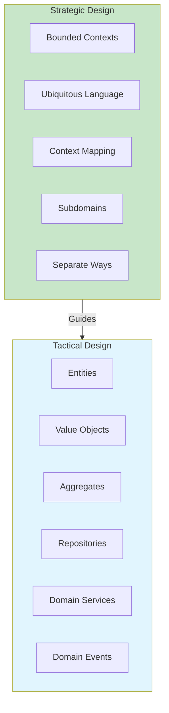
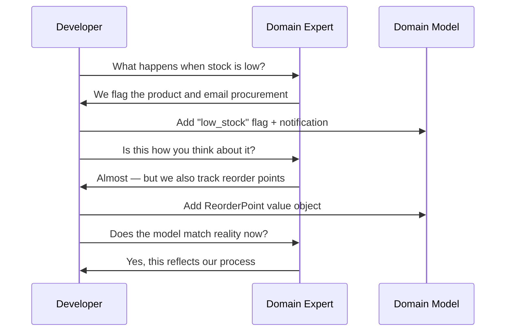
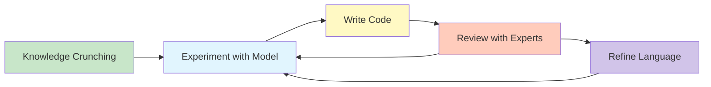

# Introduction to Domain-Driven Design

Domain-Driven Design (DDD) is a software development approach introduced by Eric Evans in his seminal 2003 book *Domain-Driven Design: Tackling Complexity in the Heart of Software*. DDD emphasizes that the **core complexity** of most software projects lies not in technical infrastructure but in the domain itself — the business problem the software aims to solve.

> [!NOTE]
> DDD is not a technology, framework, or architecture pattern. It is a **philosophy and methodology** that places the domain model at the center of software design. The goal is to create software that reflects the mental models of domain experts.

## The Origins of DDD

DDD emerged from observing failed software projects. The root cause was almost never bad technology — it was **miscommunication** between domain experts (business people) and developers. Each group spoke a different language, leading to models that did not match reality.

| Era | Problem | Solution |
|-----|---------|----------|
| 1990s | Waterfall methods, rigid requirements | Agile methodologies |
| Early 2000s | Complex enterprise software | DDD, Eric Evans |
| 2010s | Distributed systems complexity | Microservices + DDD |
| 2020s | AI-driven systems, event-driven | DDD + Event Storming |

```python
# Without DDD: the model is anemic and disconnected from the domain
class Order:
    def __init__(self):
        self.id = ""
        self.status = ""
        self.items: list = []
        self.total = 0.0

    # Getters and setters only — no domain behavior
    def get_id(self): return self.id
    def set_id(self, v): self.id = v
    def get_status(self): return self.status
    def set_status(self, v): self.status = v

# With DDD: the model captures business rules and behavior
from dataclasses import dataclass, field
from enum import Enum
from datetime import datetime

class OrderStatus(Enum):
    PENDING = "pending"
    CONFIRMED = "confirmed"
    SHIPPED = "shipped"
    DELIVERED = "delivered"
    CANCELLED = "cancelled"

@dataclass
class OrderLine:
    product_id: str
    product_name: str
    quantity: int
    unit_price: float

    def subtotal(self) -> float:
        return self.quantity * self.unit_price

@dataclass
class Order:
    id: str
    customer_id: str
    lines: list[OrderLine] = field(default_factory=list)
    status: OrderStatus = OrderStatus.PENDING
    created_at: datetime = field(default_factory=datetime.now)

    def add_line(self, line: OrderLine) -> None:
        if self.status != OrderStatus.PENDING:
            raise ValueError("Cannot add items to a non-pending order")
        self.lines.append(line)

    def confirm(self) -> None:
        if not self.lines:
            raise ValueError("Cannot confirm an empty order")
        self.status = OrderStatus.CONFIRMED

    def cancel(self) -> None:
        if self.status in (OrderStatus.SHIPPED, OrderStatus.DELIVERED):
            raise ValueError("Cannot cancel shipped or delivered order")
        self.status = OrderStatus.CANCELLED
```

## Strategic vs Tactical Design

DDD is divided into two levels: **strategic** and **tactical**. Both are essential, but they address different scales of the problem.



### Strategic Design

Strategic DDD focuses on the **big picture**: how different parts of the system relate to each other and to the business domain.

| Concept | Description | Example |
|---------|-------------|---------|
| Domain | The business problem space | E-commerce |
| Subdomain | A sub-area of the domain | Inventory, Shipping, Payments |
| Core Domain | The most valuable subdomain | Checkout logic |
| Supporting Domain | Needed but not core | User authentication |
| Generic Domain | Commodity domain | Email notifications |
| Bounded Context | A specific model boundary | Sales context, Warehouse context |
| Ubiquitous Language | Common language for devs + experts | "Order", "Line Item", "Invoice" |

```python
# Strategic DDD: identifying subdomains and their relationships
class DomainCatalog:
    """A conceptual model of how domains are organized."""

    CORE_DOMAINS = {
        "sales": "Order management, pricing, checkout",
        "inventory": "Stock tracking, reorder points",
    }

    SUPPORTING_DOMAINS = {
        "user_management": "Customer accounts, authentication",
        "payment": "Payment processing, refunds",
    }

    GENERIC_DOMAINS = {
        "notifications": "Email, SMS, push",
        "audit_logging": "Change tracking, compliance",
    }

    @classmethod
    def classify(cls, domain_name: str) -> str:
        if domain_name in cls.CORE_DOMAINS:
            return "core"
        if domain_name in cls.SUPPORTING_DOMAINS:
            return "supporting"
        return "generic"
```

### Tactical Design

Tactical DDD provides **building blocks** for implementing the domain model within a single bounded context.

```python
from abc import ABC, abstractmethod
from decimal import Decimal

# Entity: has identity and continuity through time
class Customer:
    def __init__(self, customer_id: str, name: str, email: str):
        self._id = customer_id
        self._name = name
        self._email = email
        self._loyalty_points = 0

    @property
    def id(self) -> str:
        return self._id

    @property
    def name(self) -> str:
        return self._name

    def add_loyalty_points(self, points: int) -> None:
        if points < 0:
            raise ValueError("Points cannot be negative")
        self._loyalty_points += points

# Value Object: immutable, defined by attributes
@dataclass(frozen=True)
class Money:
    amount: Decimal
    currency: str

    def __add__(self, other: "Money") -> "Money":
        if self.currency != other.currency:
            raise ValueError("Currency mismatch")
        return Money(self.amount + other.amount, self.currency)

    def __mul__(self, factor: int) -> "Money":
        return Money(self.amount * factor, self.currency)

# Aggregate Root: consistency boundary
class ShoppingCart:
    def __init__(self, cart_id: str, customer_id: str):
        self._id = cart_id
        self._customer_id = customer_id
        self._items: list[CartItem] = []
        self._is_checked_out = False

    def add_item(self, product_id: str, name: str, price: Money, quantity: int) -> None:
        if self._is_checked_out:
            raise ValueError("Cart already checked out")
        self._items.append(CartItem(product_id, name, price, quantity))

    def remove_item(self, product_id: str) -> None:
        self._items = [i for i in self._items if i.product_id != product_id]

    def checkout(self) -> "Order":
        if self._is_checked_out:
            raise ValueError("Cart already checked out")
        if not self._items:
            raise ValueError("Cannot checkout empty cart")
        self._is_checked_out = True
        return Order(self._items)

@dataclass(frozen=True)
class CartItem:
    product_id: str
    name: str
    price: Money
    quantity: int
```

## The DDD Mindset

DDD requires a shift in how developers think about software:

1. **Model exploration**: The domain model is not designed upfront — it emerges through collaboration
2. **Continuous refinement**: The model evolves as understanding deepens
3. **Bounded contexts**: Different parts of the system may have different models
4. **Language matters**: The words you use shape the model you build

> [!WARNING]
> A common mistake is jumping straight to tactical patterns (Entities, Aggregates, Repositories) without doing strategic design work. Strategic DDD answers **what** to build and **where**; tactical DDD answers **how** to build it. Both are necessary.

## The Role of Domain Experts

Domain experts are the most valuable resource in a DDD project. They are not just stakeholders — they are **co-creators** of the domain model.



## Knowledge Crunching

Eric Evans calls the DDD modeling process **knowledge crunching**: distilling vast amounts of domain knowledge into a precise, useful model.

```python
# Knowledge crunching in action: evolving from simple to rich model

# Phase 1: Anemic model (no DDD)
class Product:
    def __init__(self, pid, name, price, stock):
        self.pid = pid
        self.name = name
        self.price = price
        self.stock = stock

# Phase 2: Adding domain logic
class Product:
    def __init__(self, pid: str, name: str, price: Decimal, stock: int):
        self._pid = pid
        self._name = name
        self._price = price
        self._stock = stock

    def is_in_stock(self) -> bool:
        return self._stock > 0

    def can_fulfill(self, quantity: int) -> bool:
        return self._stock >= quantity

    def reserve(self, quantity: int) -> None:
        if not self.can_fulfill(quantity):
            raise ValueError(f"Insufficient stock for {self._name}")
        self._stock -= quantity

# Phase 3: Rich domain model with business invariants
from dataclasses import dataclass
from typing import Optional

@dataclass
class StockKeepingUnit:
    """A SKU represents a unique product variant."""
    product_id: str
    variant: str  # e.g., "RED-XL", "BLUE-M"
    quantity_on_hand: int
    quantity_reserved: int
    reorder_point: int

    @property
    def available_quantity(self) -> int:
        return self.quantity_on_hand - self.quantity_reserved

    def reserve(self, quantity: int) -> None:
        if quantity <= 0:
            raise ValueError("Reservation quantity must be positive")
        if quantity > self.available_quantity:
            raise ValueError(f"Only {self.available_quantity} available")
        self.quantity_reserved += quantity

    def needs_reorder(self) -> bool:
        return self.available_quantity <= self.reorder_point

    def receive_stock(self, quantity: int) -> None:
        if quantity <= 0:
            raise ValueError("Received quantity must be positive")
        self.quantity_on_hand += quantity
```

## When to Use DDD

DDD is powerful but not always appropriate. Here is a decision framework:

| Factor | DDD is Good | DDD is Overkill |
|--------|-------------|-----------------|
| Domain complexity | High | Low (simple CRUD) |
| Business rules | Complex, evolving | Simple, stable |
| Team size | Multiple teams | Small team |
| System lifespan | Long-lived | Short-lived |
| Collaboration needs | High | Low |

> [!NOTE]
> DDD is an **investment**. The upfront cost of modeling with domain experts is significant, but it pays off when the domain is complex and the system will evolve for years.

## Common Anti-Patterns

| Anti-Pattern | Symptom | Fix |
|-------------|---------|-----|
| Anemic Domain Model | Classes with only getters/setters | Move behavior into the model |
| Database-Driven Design | Model mirrors DB tables | Design the model first |
| Technical Bias | Code smells like the framework | Use Ubiquitous Language |
| Big Ball of Mud | No clear boundaries | Define Bounded Contexts |
| Golden Hammer | DDD for everything | Use DDD only for complex domains |

```python
# Anti-pattern: Anemic Domain Model
class UserAnemic:
    """This is NOT DDD — it is a data container."""
    def __init__(self):
        self.id = None
        self.name = None
        self.email = None
        self.status = None
        self.role = None

# DDD: Rich Domain Model
class User:
    def __init__(self, user_id: str, name: str, email: str, role: str):
        self._id = user_id
        self._name = name
        self._email = email
        self._status = "active"
        self._role = role

    def deactivate(self) -> None:
        if self._role == "admin":
            raise ValueError("Cannot deactivate admin users")
        self._status = "inactive"

    def change_email(self, new_email: str) -> None:
        if not self._is_valid_email(new_email):
            raise ValueError("Invalid email format")
        self._email = new_email

    def has_permission(self, permission: str) -> bool:
        permissions = {
            "admin": ["read", "write", "delete", "manage_users"],
            "editor": ["read", "write"],
            "viewer": ["read"],
        }
        return permission in permissions.get(self._role, [])

    @staticmethod
    def _is_valid_email(email: str) -> bool:
        return "@" in email and "." in email
```

## The DDD Process

The typical DDD workflow involves iterative cycles of collaboration:



1. **Knowledge Crunching**: Meet with domain experts, ask questions, sketch models
2. **Experiment with Model**: Try different modeling approaches on a whiteboard
3. **Write Code**: Implement the model as executable software
4. **Review with Experts**: Show the running code to experts and refine
5. **Refine Language**: Update the Ubiquitous Language based on discoveries

## Domain Events as Knowledge

> [!TIP]
> Domain events often reveal the most important modeling insights. When a domain expert says "when this happens, we need to do that", they are describing a domain event. Capture it explicitly in the model.

```python
from dataclasses import dataclass
from datetime import datetime
from typing import Protocol

# Domain event: something meaningful that happened in the domain
@dataclass
class OrderPlaced:
    order_id: str
    customer_id: str
    total_amount: float
    occurred_at: datetime = datetime.now()

@dataclass
class InventoryAdjusted:
    product_id: str
    quantity_change: int
    reason: str

# Domain event publisher interface
class EventPublisher(Protocol):
    def publish(self, event: object) -> None:
        ...

# Using domain events in the model
class InventoryService:
    def __init__(self, publisher: EventPublisher):
        self._publisher = publisher

    def adjust_stock(self, product_id: str, quantity: int, reason: str) -> None:
        # Perform the adjustment
        event = InventoryAdjusted(product_id, quantity, reason)
        self._publisher.publish(event)
```

## The Ubiquitous Language in Code

> [!SUCCESS]
> When DDD is done right, the code reads like the domain experts speak. A domain expert should be able to read your code and validate its logic without understanding programming.

```python
# The code speaks the domain language
from dataclasses import dataclass

# A domain expert would understand this:
class OverdueInvoiceNotifier:
    """When an invoice is overdue for more than 30 days,
    we send a reminder and apply a late fee."""

    def process(self, invoice: "Invoice") -> None:
        if invoice.is_overdue():
            days_overdue = invoice.days_overdue()
            if days_overdue > 30:
                invoice.apply_late_fee()
                self._send_reminder(invoice)
                self._raise_credit_flag(invoice.customer_id)

    def _send_reminder(self, invoice) -> None:
        print(f"Sending overdue reminder for invoice {invoice.id}")

    def _raise_credit_flag(self, customer_id: str) -> None:
        print(f"Raising credit flag for customer {customer_id}")
```

## Essential Reading

DDD is best learned through a combination of theory and practice. Essential resources:

| Resource | Type | Focus |
|----------|------|-------|
| *Domain-Driven Design* (Evans, 2003) | Blue Book | Full DDD overview |
| *Implementing Domain-Driven Design* (Vernon, 2013) | Red Book | Practical implementation |
| *Domain-Driven Design Distilled* (Vernon, 2016) | Pocket guide | Quick reference |
| *Event Storming* (Brandolini, 2018) | Workshop | Collaborative modeling |

## Practice Exercises

1. **Identify subdomains**: Pick a business you know (e.g., a pizza delivery service). List its core, supporting, and generic subdomains. Justify each classification.

2. **Anemic vs rich model**: Take the following anemic model and transform it into a rich DDD model with business rules:
   ```python
   class Account:
       def __init__(self):
           self.number = ""
           self.balance = 0.0
           self.owner = ""
           self.is_frozen = False
           self.overdraft_limit = 0.0
   ```

3. **Domain expert interview**: Write down 5 questions you would ask a domain expert for an online banking system. What aspects of the domain would you explore?

4. **Knowledge crunching simulation**: Given this business rule — "A customer cannot place an order if their account is past due, unless the order total is under $50 and they have been a customer for more than 2 years" — model this as Python code with explicit domain rules.

5. **Strategic vs tactical**: For each of the following, classify as strategic or tactical DDD: Bounded Context, Repository, Ubiquitous Language, Context Mapping, Entity, Domain Event, Subdomain, Aggregate.

6. **Anti-pattern detection**: Find an anemic domain model in a project you work on or an open-source project. Document 3 places where behavior should move into the model.

7. **Domain event extraction**: Write down 5 domain events that would occur in an e-commerce system. For each, list what information it carries and what other parts of the system would react to it.

8. **Code review challenge**: Review this code and identify 3 violations of DDD principles:
   ```python
   class OrderService:
       def process(self, data):
           db = Database.connect()
           order = Order()
           order.id = data["id"]
           order.status = "pending"
           db.insert("orders", order)
           send_email(data["email"], "Order received")
           return order
   ```

> [!SUCCESS]
> You have completed Lesson 1. You now understand the foundations of Domain-Driven Design — its origins, the distinction between strategic and tactical design, and the mindset shifts required. The next lessons will dive deep into each concept.
