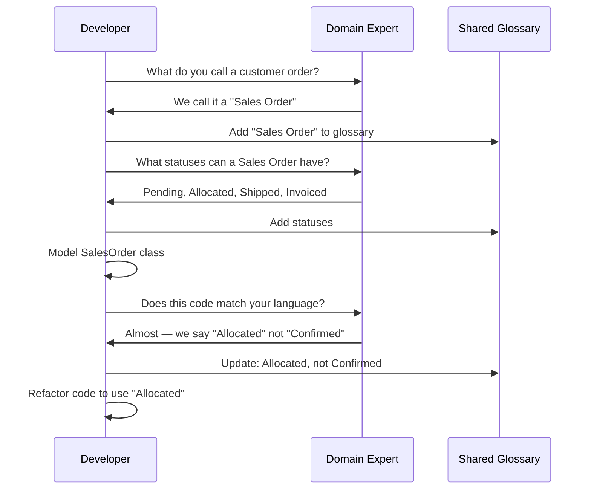

# Ubiquitous Language

Ubiquitous Language is the cornerstone of Domain-Driven Design. It is a **shared, structured language** that developers and domain experts use together to describe the domain. Every term in this language has a precise, unambiguous meaning — and that meaning is reflected directly in the code.

> [!NOTE]
> The term "Ubiquitous Language" was coined by Eric Evans in his DDD book. The key insight: most software failures are caused not by technical problems but by **translation errors** between business and technical teams. Ubiquitous Language eliminates that translation.

## The Problem of Translation

In traditional software development, requirements go through multiple translations:

```mermaid
flowchart LR
    A[Domain Expert] -->|"Natural Language\n(imprecise)"| B[Business Analyst]
    B -->|"Requirements Doc\n(ambiguous)"| C[Technical Lead]
    C -->|"Technical Spec\n(lossy)"| D[Developer]
    D -->|"Code\n(does it match?)"| E[Software]
    A -.->|"Feedback loop\n(expensive)" E

    style A fill:#c8e6c9
    style D fill:#ffccbc
    style E fill:#e1f5fe
```

Each translation step introduces ambiguity, loss of meaning, and potential errors. The developer writes code based on a document that was already an approximation of what the expert said.

> [!WARNING]
> Without Ubiquitous Language, you end up with two models: the business model (in the experts' heads) and the software model (in the code). These two models **always diverge** over time, making the software increasingly difficult to maintain and evolve.

## What Ubiquitous Language Looks Like

A Ubiquitous Language consists of:

1. **Nouns**: Domain concepts (Order, Invoice, Customer, Product)
2. **Verbs**: Domain actions (place order, cancel invoice, archive product)
3. **Rules**: Business invariants (cannot ship unpaid orders)
4. **Events**: Domain occurrences (OrderPlaced, PaymentReceived)

```python
# Without Ubiquitous Language: technical terms dominate
class DataEntity:
    def __init__(self):
        self.pk = 0
        self.fk_customer = 0
        self.dt = ""
        self.st = ""
        self.amnt = 0.0

    def proc(self):
        if self.st == "P" and self.amnt > 0:
            self.st = "C"

# With Ubiquitous Language: domain terms are everywhere
from dataclasses import dataclass
from enum import Enum
from datetime import datetime

class OrderStatus(Enum):
    PENDING = "pending"
    CONFIRMED = "confirmed"
    IN_TRANSIT = "in_transit"
    DELIVERED = "delivered"

@dataclass
class Order:
    order_id: str
    customer_id: str
    placed_at: datetime
    status: OrderStatus
    total_amount: float

    def confirm(self) -> None:
        if self.status != OrderStatus.PENDING:
            raise ValueError("Only pending orders can be confirmed")
        self.status = OrderStatus.CONFIRMED
```

## Building a Ubiquitous Language

Building a Ubiquitous Language is an **iterative, collaborative process**. It is not something a single person creates and documents. It emerges from conversation.



### Step 1: Listen to Domain Experts

Record the exact words and phrases domain experts use. Avoid translating into technical jargon.

```python
# Domain expert says:
# "When a sales order is allocated, we reserve the stock."

# Developer captures this directly in code:
class SalesOrder:
    def allocate(self, warehouse_id: str) -> None:
        """Reserve stock when a sales order is allocated."""
        if self.status != SalesOrderStatus.PENDING:
            raise ValueError("Can only allocate pending orders")
        self._warehouse_id = warehouse_id
        self.status = SalesOrderStatus.ALLOCATED

    @property
    def is_allocated(self) -> bool:
        return self.status == SalesOrderStatus.ALLOCATED
```

### Step 2: Create a Shared Glossary

A glossary ensures everyone uses the same words to mean the same things.

| Term | Definition | Synonyms to Avoid |
|------|-----------|-------------------|
| Sales Order | A request from a customer to purchase products | Order, ticket, request |
| Allocate | Reserve inventory for a sales order | Confirm, commit, reserve |
| Pick List | A document listing items to retrieve from warehouse | Packing list, pull sheet |
| Backorder | An order item that cannot be fulfilled from current stock | Backordered item, OOS item |

```python
# The glossary is enforced in code through type names and docstrings
from typing import NewType

# These types exist because the domain language defines them
SalesOrderId = NewType("SalesOrderId", str)
WarehouseId = NewType("WarehouseId", str)
PickListNumber = NewType("PickListNumber", str)
BackorderItemId = NewType("BackorderItemId", str)

# Every type tells a story about the domain
```

### Step 3: Use Language in All Artifacts

The Ubiquitous Language should appear in:
- **Code**: class names, method names, variable names
- **Tests**: test descriptions, test data
- **Documentation**: README, API docs, architecture docs
- **Conversations**: standups, planning, reviews
- **UI**: labels, menus, error messages

```python
# Tests speak the Ubiquitous Language
def test_a_sales_order_can_be_allocated_when_pending():
    order = SalesOrder("SO-001", customer_id="CUST-42")
    warehouse = Warehouse("WH-EAST")

    order.allocate(warehouse.id)

    assert order.is_allocated
    assert order.warehouse_id == "WH-EAST"

def test_a_sales_order_cannot_be_allocated_twice():
    order = SalesOrder("SO-001", customer_id="CUST-42")
    order.allocate("WH-EAST")

    with raises(ValueError, match="already allocated"):
        order.allocate("WH-WEST")
```

## Avoiding Translation

The most important rule: **never translate between business language and technical language**. Instead, make the code speak the business language.

```python
# Translation approach (BAD):
# Domain expert: "Cancel the order and refund the customer"
# Developer translates to:

def update_record_and_process_refund(order_id: str):
    """Developer's translation of 'cancel and refund'."""
    db.execute("UPDATE orders SET status = 'X' WHERE id = ?", order_id)
    db.execute("UPDATE customers SET balance = balance + ? WHERE ...")
    queue.send("refund.notification", {"order": order_id})

# Ubiquitous Language approach (GOOD):
# Same requirement, directly captured:

class CancelOrderHandler:
    """Handles: 'Cancel the order and refund the customer'."""

    def handle(self, command: CancelOrder) -> None:
        order = self._orders.find(command.order_id)
        order.cancel()
        refund = self._refunds.initiate_for(order)
        self._event_publisher.publish(OrderCancelled(order.id, refund.id))
```

> [!TIP]
> If you find yourself explaining domain concepts to a new team member using different words than what appears in the code, your Ubiquitous Language has eroded. Re-align the code with the language you actually use.

## The Language in Domain Events

Domain events are especially important for Ubiquitous Language because they capture **things that happened** in the domain. Their names should be past-tense verbs that domain experts recognize.

```python
from dataclasses import dataclass, field
from datetime import datetime
from typing import Optional

# These event names come from the domain language:
# "When an order is placed..."
# "When payment is received..."
# "When a shipment is delayed..."

@dataclass
class OrderPlaced:
    order_id: str
    customer_id: str
    item_count: int
    total: float
    occurred_at: datetime = field(default_factory=datetime.now)

@dataclass
class PaymentReceived:
    order_id: str
    transaction_id: str
    amount: float
    occurred_at: datetime = field(default_factory=datetime.now)

@dataclass
class ShipmentDelayed:
    order_id: str
    tracking_number: str
    original_delivery_date: datetime
    new_delivery_date: datetime
    reason: str
    occurred_at: datetime = field(default_factory=datetime.now)

# Domain services that react to these events
class ShippingService:
    def on_shipment_delayed(self, event: ShipmentDelayed) -> None:
        """Domain expert says: 'If a shipment is delayed,
        notify the customer and update the ETA.'"""
        self._notification_service.notify_customer(
            event.order_id,
            f"Your shipment is delayed. New ETA: {event.new_delivery_date.date()}"
        )
        self._tracking_service.update_eta(
            event.tracking_number,
            event.new_delivery_date
        )
```

## Refining the Language

A Ubiquitous Language is never "done." It evolves as understanding deepens. Whenever a term becomes ambiguous or new concepts emerge, the language must be refined.

```python
# Early version: "Order" was good enough
class Order:
    def place(self): ...
    def cancel(self): ...

# Later, the team realized "Sales Order" and "Purchase Order"
# are different concepts with different lifecycle rules

class SalesOrder:
    """An order placed by a customer."""
    def place(self): ...
    def cancel(self): ...
    def dispatch(self): ...

class PurchaseOrder:
    """An order placed with a supplier."""
    def place(self): ...
    def receive(self): ...
    def close(self): ...
```

### Signs the Language Needs Refinement

| Sign | Example | Fix |
|------|---------|-----|
| Ambiguous term | "Order" could mean sales or purchase | Create distinct terms |
| Overloaded term | "Status" means different things in different contexts | Use specific status types |
| Developer jargon | "Persist", "Execute", "Process" instead of domain verbs | Replace with domain terms |
| Unspoken concept | Experts say "you know, the usual way" | Make the implicit explicit |
| Translation needed | Developer: "Oh, you mean _x_ maps to _y_" | Align code with expert language |

## Ubiquitous Language in Event Storming

Event Storming, created by Alberto Brandolini, is a workshop technique that naturally produces a Ubiquitous Language. Orange sticky notes represent domain events, and the language used on those stickies becomes the Ubiquitous Language.

```python
# After an Event Storming session, the events become code
# Each orange sticky becomes a domain event class:

class CustomerCheckedIn:
    """Orange sticky: 'Customer checked in'"""
    pass

class RoomKeyIssued:
    """Orange sticky: 'Room key issued'"""
    pass

class EarlyCheckoutFeeApplied:
    """Orange sticky: 'Early checkout fee applied'"""
    pass

class MinibarChargeRecorded:
    """Orange sticky: 'Minibar charge recorded'"""
    pass
```

> [!SUCCESS]
> Event Storming is the fastest way to build a Ubiquitous Language. In a single workshop, a team can map the entire business process and agree on terminology for every step.

## The Language and Bounded Contexts

Each Bounded Context has its own Ubiquitous Language. The same word may mean different things in different contexts.

```python
# "Customer" means different things in different contexts

# Sales Context
class Customer:
    """Represents a buyer with purchasing history."""
    def __init__(self, customer_id: str, name: str, credit_limit: float):
        self._id = customer_id
        self._name = name
        self._credit_limit = credit_limit
        self._lifetime_value = 0.0

    def record_purchase(self, amount: float) -> None:
        self._lifetime_value += amount

    def can_place_order(self, order_total: float) -> bool:
        return order_total <= self._credit_limit

# Support Context
class Customer:
    """Represents a person seeking help with a product."""
    def __init__(self, customer_id: str, name: str, tier: str):
        self._id = customer_id
        self._name = name
        self._tier = tier  # "standard", "premium", "enterprise"

    @property
    def priority(self) -> int:
        return {"standard": 1, "premium": 2, "enterprise": 3}.get(self._tier, 0)

    def escalate(self) -> None:
        if self._tier == "enterprise":
            self._assign_to_senior_agent()

# Billing Context
class Customer:
    """Represents a debtor responsible for payments."""
    def __init__(self, customer_id: str, name: str):
        self._id = customer_id
        self._name = name
        self._balance = 0.0
        self._is_overdue = False

    def apply_charge(self, amount: float) -> None:
        self._balance += amount

    def mark_overdue(self) -> None:
        self._is_overdue = True
```

## Ubiquitous Language and Modeling

The language directly shapes the model. If the language changes, the model should change. If the model diverges from the language, the model — not the language — should be corrected.

```python
# Example: evolving language → evolving model

# Phase 1: Experts say "User"
class User:
    def login(self): ...
    def change_password(self): ...

# Phase 2: Experts distinguish "Customer" from "Staff"
class Customer:
    def place_order(self): ...
    def view_order_history(self): ...

class StaffMember:
    def process_order(self): ...
    def update_inventory(self): ...

# Phase 3: Experts identify "Premium Customer" with VIP treatment
class PremiumCustomer(Customer):
    @property
    def free_shipping(self) -> bool:
        return True

    def concierge_request(self, request: str) -> None:
        self._assign_to_vip_team()
```

## Common Pitfalls

| Pitfall | Description | Prevention |
|---------|-------------|-----------|
| Glossary rot | Glossary exists but is never updated | Keep glossary version-controlled with code |
| Expert not involved | Language defined without domain experts | Include experts in all modeling sessions |
| Language vs code drift | Code uses old terms while language evolved | Refactor code aggressively to match language |
| Too generic | Terms like "item", "data", "info" | Push for specific, concrete terms |
| Team silo | Different teams develop different languages | Cross-team context mapping sessions |

> [!WARNING]
> The worst fate for a Ubiquitous Language is for it to become a **document that nobody reads**. The language must live in the code, in conversations, and in daily work — not in a PDF that was written once and forgotten.

## Measuring Ubiquitous Language Quality

How do you know if your Ubiquitous Language is healthy? Here are some indicators:

| Metric | Healthy | Unhealthy |
|--------|---------|-----------|
| Code review comments | "This method name doesn't match the term we use" | "This variable should be renamed" |
| Onboarding time | New devs understand domain in days | New devs need weeks of domain explanation |
| Expert involvement | Experts can read the code | Experts need a translator |
| Changes to language | Frequent refinements | Never discussed |
| Term consistency | Same term = same concept everywhere | Same term used for different concepts |

```python
# Healthy Ubiquitous Language: domain expert could read this
class PremiumSubscription:
    """A subscription with VIP benefits."""

    def __init__(self, subscriber: "Subscriber", plan: "Plan"):
        self._subscriber = subscriber
        self._plan = plan
        self._is_active = True
        self._benefits: list[str] = ["priority_support", "exclusive_content"]

    def renew(self, payment_method: str) -> None:
        if not self._is_active:
            raise ValueError("Cannot renew an inactive subscription")
        self._plan.renew()
        self._subscriber.charge(payment_method, self._plan.price)

    def upgrade(self, new_plan: "Plan") -> None:
        if new_plan.price < self._plan.price:
            raise ValueError("Upgrade must be to a more expensive plan")
        self._plan = new_plan
```

## Practice Exercises

1. **Build a glossary**: Choose a domain you know (e.g., library management, hotel booking, hospital scheduling). Create a glossary of 10 terms with definitions and synonyms to avoid.

2. **Translate to Ubiquitous Language**: Rewrite the following code using Ubiquitous Language:
   ```python
   def process_data(x):
       db = get_db()
       r = db.query("SELECT * FROM tbl_ords WHERE st = 'P'")
       for row in r:
           row.st = 'A'
           db.update(row)
           notify(row.c_id, "Your order is ready")
   ```

3. **Find translation errors**: Look at a project you work on. Find 3 places where the code uses technical language where domain language should be used (e.g., "execute" instead of "place order", "data" instead of "invoice").

4. **Event storming simulation**: List 8 domain events for a restaurant management system. Write each event as a Python dataclass with appropriate fields.

5. **Cross-context language**: The term "Patient" appears in a hospital's Scheduling Context and Medical Records Context. Define the Patient class for each context, highlighting the different attributes and behaviors.

6. **Refine the language**: A team uses "Item" to mean both "menu item" and "order line item". Create two distinct classes with appropriate names and differentiate their behavior.

7. **Expert interview transcript**: Write a mock interview between a developer and a hotel front desk manager. Extract 5 domain terms from the conversation and show how they would become code.

8. **Code review for language**: Review this code for Ubiquitous Language violations:
   ```python
   class EntityManager:
       def __init__(self):
           self._items = []

       def add_item(self, obj):
           self._items.append(obj)

       def remove_item(self, idx):
           self._items.pop(idx)

       def get_active(self):
           return [x for x in self._items if x.flg == 1]

       def proc_all(self):
           for x in self._items:
               x.st = 2
   ```

> [!SUCCESS]
> You have completed Lesson 2. Ubiquitous Language is the foundation of DDD — without it, bounded contexts, aggregates, and all other patterns lose their power. Keep the language alive in every conversation and every line of code.
