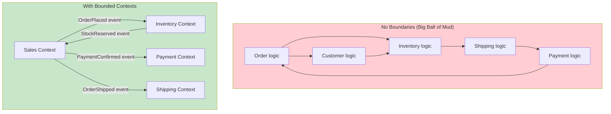
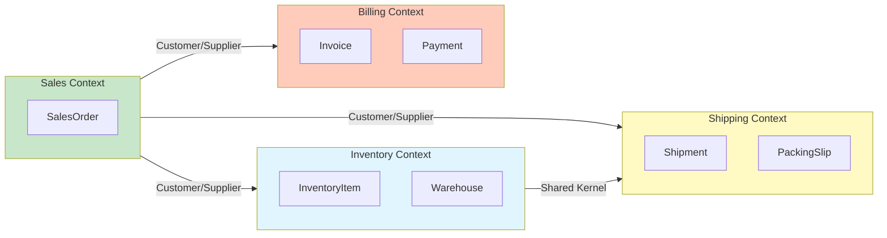
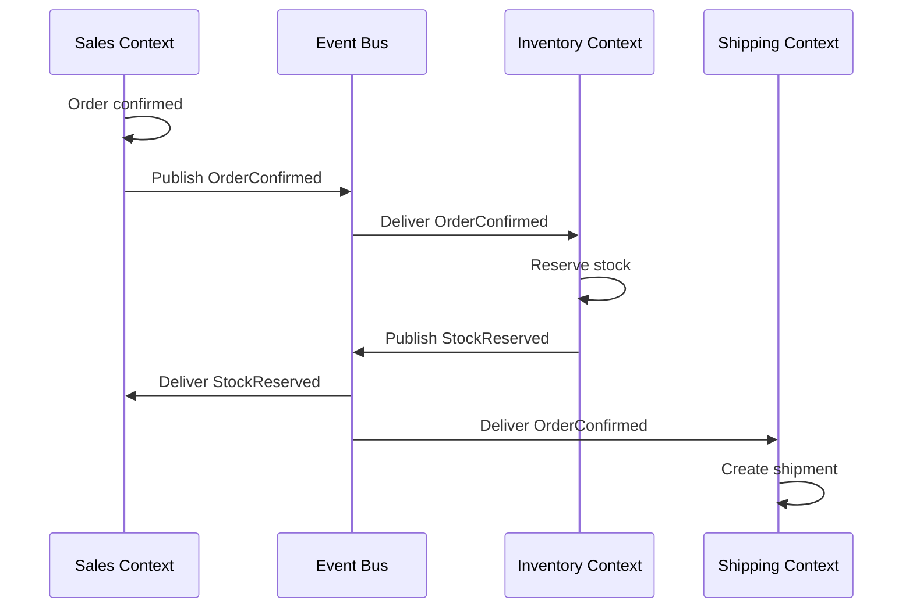

# Bounded Contexts

A Bounded Context is a **semantic boundary** within which a particular domain model applies. Inside the boundary, all terms of the Ubiquitous Language have precise, consistent meanings. Outside the boundary, different terms or different meanings may apply.

> [!NOTE]
> The term "Bounded Context" is often misunderstood. It is not the same as a microservice, a module, or a namespace — though it often maps to one. A Bounded Context is first and foremost a **linguistic boundary**. The code and services follow from that boundary.

## Why Boundaries Matter

Without explicit boundaries, domain models bleed into each other. Terms become ambiguous, responsibilities blur, and the system becomes a "Big Ball of Mud."



### What a Boundary Contains

Within a Bounded Context, you have a **full, self-contained model**:

1. **Entities and Value Objects** specific to that context
2. **Aggregates** that enforce consistency boundaries
3. **Domain Events** that represent occurrences
4. **Repositories** for persistence
5. **Domain Services** for operations that do not fit naturally in entities

```python
# Sales Context's complete model — it stands alone
from dataclasses import dataclass, field
from enum import Enum
from datetime import datetime
from typing import Protocol

class SalesOrderStatus(Enum):
    PENDING = "pending"
    CONFIRMED = "confirmed"
    IN_TRANSIT = "in_transit"
    DELIVERED = "delivered"

@dataclass
class SalesOrderLine:
    product_id: str
    product_name: str
    quantity: int
    unit_price: float

    def subtotal(self) -> float:
        return self.quantity * self.unit_price

@dataclass
class SalesOrder:
    order_id: str
    customer_id: str
    lines: list[SalesOrderLine] = field(default_factory=list)
    status: SalesOrderStatus = SalesOrderStatus.PENDING
    created_at: datetime = field(default_factory=datetime.now)

    def add_line(self, line: SalesOrderLine) -> None:
        if self.status != SalesOrderStatus.PENDING:
            raise ValueError("Order already confirmed")
        self.lines.append(line)

    def confirm(self) -> None:
        if not self.lines:
            raise ValueError("Cannot confirm empty order")
        self.status = SalesOrderStatus.CONFIRMED

class SalesOrderRepository(Protocol):
    def save(self, order: SalesOrder) -> None: ...
    def find_by_id(self, order_id: str) -> SalesOrder | None: ...
```

## Context Mapping

Context Mapping is the practice of **identifying and documenting the relationships** between Bounded Contexts. Every context relationship has a pattern that describes how the two contexts integrate.



### Integration Patterns

| Pattern | Description | Coupling | When to Use |
|---------|-------------|----------|-------------|
| Partnership | Two contexts cooperate on integration | Tight | Two teams working closely together |
| Shared Kernel | Shared subset of model | Tight | Overlapping domains |
| Customer/Supplier | Upstream supplies, downstream consumes | Loose | Standard producer/consumer |
| Conformist | Downstream conforms to upstream model | Loose | No control over upstream |
| Anti-Corruption Layer | Translation layer protects downstream | Very Loose | Preventing upstream changes from leaking |
| Open-Host Service | Upstream provides a protocol for integration | Very Loose | Multiple downstream consumers |
| Published Language | Well-documented, versioned integration format | Very Loose | Public API |
| Separate Ways | No integration; each context operates independently | None | Independent functionality |

## Anti-Corruption Layer (ACL)

The Anti-Corruption Layer is one of the most important patterns. It **prevents a downstream context from being polluted** by the model of an upstream context.

```python
# The upstream system has its own model — we cannot change it
# Upstream's "Order" (legacy system):

class LegacyOrder:
    """This comes from the mainframe. We cannot modify it."""
    def __init__(self):
        self.ord_no = ""
        self.cust_id = ""
        self.ord_dt = ""
        self.ln_itms: list[LegacyLineItem] = []
        self.ord_st = ""

class LegacyLineItem:
    def __init__(self):
        self.itm_id = ""
        self.itm_qty = 0
        self.itm_pr = 0.0
        self.itm_st = ""

# Anti-Corruption Layer: translates Legacy → Sales Context

class LegacyOrderTranslator:
    """Protects our Sales Context from the legacy model."""

    def to_sales_order(self, legacy: LegacyOrder) -> "SalesOrder":
        order = SalesOrder(
            order_id=legacy.ord_no,
            customer_id=legacy.cust_id,
            status=self._translate_status(legacy.ord_st),
        )
        for item in legacy.ln_itms:
            order.add_line(SalesOrderLine(
                product_id=item.itm_id,
                quantity=item.itm_qty,
                unit_price=item.itm_pr,
            ))
        return order

    def _translate_status(self, legacy_status: str) -> SalesOrderStatus:
        mapping = {
            "N": SalesOrderStatus.PENDING,
            "C": SalesOrderStatus.CONFIRMED,
            "S": SalesOrderStatus.IN_TRANSIT,
            "D": SalesOrderStatus.DELIVERED,
        }
        return mapping.get(legacy_status, SalesOrderStatus.PENDING)

# The ACL adapter
class LegacyOrderRepository:
    """Adapter that uses the ACL to translate."""

    def __init__(self, legacy_db, translator: LegacyOrderTranslator):
        self._db = legacy_db
        self._translator = translator

    def find_by_id(self, order_id: str) -> "SalesOrder":
        legacy_data = self._db.query(f"SELECT * FROM orders WHERE ord_no = '{order_id}'")
        legacy_order = self._row_to_legacy(legacy_data)
        return self._translator.to_sales_order(legacy_order)

    def _row_to_legacy(self, row) -> LegacyOrder:
        legacy = LegacyOrder()
        legacy.ord_no = row["ord_no"]
        legacy.cust_id = row["cust_id"]
        legacy.ord_dt = row["ord_dt"]
        legacy.ord_st = row["ord_st"]
        # ... map line items
        return legacy
```

> [!WARNING]
> Without an ACL, upstream model changes can cascade through your entire system. A field rename in a legacy system should never require changes in your domain logic. The ACL absorbs those changes.

## Open-Host Service (OHS)

Open-Host Service defines a **published protocol** that downstream contexts use to communicate with the upstream context. The upstream context commits to maintaining this protocol.

```python
# Sales Context publishes an Open-Host Service protocol
from typing import Protocol
from dataclasses import dataclass

@dataclass
class OrderCreatedEvent:
    order_id: str
    customer_id: str
    items: list[dict]
    total: float
    version: int = 1

class SalesOrderNotifier(Protocol):
    """Published protocol for downstream consumers."""

    def on_order_created(self, event: OrderCreatedEvent) -> None:
        """Called when a new order is created. Ordered by order_id."""

    def on_order_cancelled(self, order_id: str, reason: str) -> None:
        """Called when an order is cancelled."""

# Downstream: Inventory Context implements the protocol
class InventoryOrderHandler:
    """Handles order events for inventory reservation."""

    def on_order_created(self, event: OrderCreatedEvent) -> None:
        for item in event.items:
            self._reserve_stock(item["product_id"], item["quantity"])

    def on_order_cancelled(self, order_id: str, reason: str) -> None:
        self._release_reservations(order_id)

    def _reserve_stock(self, product_id: str, quantity: int) -> None:
        print(f"Reserving {quantity} of {product_id}")

    def _release_reservations(self, order_id: str) -> None:
        print(f"Releasing reservations for {order_id}")
```

## Shared Kernel

Shared Kernel is a carefully chosen subset of the domain model that two contexts share. It must be kept small, stable, and agreed upon by both teams.

```python
# Shared Kernel: both Sales and Shipping use this
from dataclasses import dataclass

@dataclass
class Address:
    """Shared across Sales and Shipping contexts."""
    street: str
    city: str
    state: str
    zip_code: str
    country: str

    def is_valid(self) -> bool:
        return all([self.street, self.city, self.zip_code, self.country])

@dataclass
class Money:
    """Shared value object for monetary values."""
    amount: float
    currency: str

    def __add__(self, other: "Money") -> "Money":
        if self.currency != other.currency:
            raise ValueError("Currency mismatch")
        return Money(self.amount + other.amount, self.currency)

# Sales Context uses Address and Money
class SalesOrder:
    def __init__(self, order_id: str, shipping_address: Address):
        self._id = order_id
        self._shipping_address = shipping_address
        self._total = Money(0.0, "USD")

# Shipping Context uses the same Address
class Shipment:
    def __init__(self, shipment_id: str, destination: Address):
        self._id = shipment_id
        self._destination = destination
```

## Conformist Pattern

When a downstream context has no control over the upstream context, it may choose to **conform** to the upstream model rather than building an ACL.

```python
# Upstream ERP system defines the product catalog model
# Downstream Sales Context conforms to it

# ERP's Product model (upstream — we cannot change it)
class ERPProduct:
    def __init__(self, code: str, desc: str, list_price: float):
        self.code = code
        self.desc = desc
        self.list_price = list_price

# Sales Context conforms — uses the same terms
class SalesProduct:
    """Conforms to ERP model. Same terms, same meaning."""

    def __init__(self, code: str, desc: str, list_price: float):
        self.code = code
        self.desc = desc
        self.list_price = list_price

    def calculate_discount(self, percentage: float) -> float:
        return self.list_price * (1 - percentage / 100)
```

## Partnership Pattern

In a partnership, two teams **coordinate** their integration. Changes are planned together, and both teams adjust their models to work together.

```python
# Sales and Billing teams agree on the "Invoice" concept together

# Partnership agreement: both teams define this jointly
@dataclass
class InvoiceData:
    """Jointly agreed data format for invoicing."""
    invoice_number: str
    order_id: str
    customer_tax_id: str
    line_items: list[dict]
    subtotal: float
    tax_total: float
    grand_total: float

# Sales Context: produces invoice data
class SalesInvoicingService:
    def generate_invoice_data(self, order: "SalesOrder") -> InvoiceData:
        return InvoiceData(
            invoice_number=f"INV-{order.order_id}",
            order_id=order.order_id,
            customer_tax_id=order.customer_tax_id,
            line_items=[
                {"description": line.product_name, "amount": line.subtotal()}
                for line in order.lines
            ],
            subtotal=sum(line.subtotal() for line in order.lines),
            tax_total=self._calculate_tax(order),
            grand_total=order.total,
        )

# Billing Context: consumes invoice data
class InvoiceGenerator:
    def create_from(self, data: InvoiceData) -> "Invoice":
        invoice = Invoice(
            number=data.invoice_number,
            customer_tax_id=data.customer_tax_id,
        )
        for item in data.line_items:
            invoice.add_line(item["description"], item["amount"])
        return invoice
```

## Separate Ways

Sometimes, two contexts have **nothing to do with each other**. They operate independently with no integration. This is perfectly valid.

```python
# Marketing Context and Warehouse Context — Separate Ways

# Marketing Context: campaigns, newsletters, analytics
class EmailCampaign:
    def send_promotion(self, segment: str, offer: str) -> None:
        print(f"Sending '{offer}' to {segment} segment")

# Warehouse Context: inventory, receiving, shipping
class WarehouseBin:
    def __init__(self, bin_id: str, location: str):
        self._id = bin_id
        self._location = location

    def store(self, product_id: str, quantity: int) -> None:
        print(f"Storing {quantity} of {product_id} in {self._location}")
```

## Defining Context Boundaries

How do you decide where one context ends and another begins? These are the most common heuristics:

| Heuristic | Question | Example Boundary |
|-----------|----------|-----------------|
| Different language | Do experts use different terms? | "Order" in Sales vs "Job" in Manufacturing |
| Different lifecycle | Does the concept have different lifecycle? | Customer record vs Customer support ticket |
| Team ownership | Does a different team own it? | Checkout team vs Recommendation team |
| Change frequency | Does it change at different rates? | Product catalog (stable) vs Pricing (dynamic) |
| Deployment independence | Can it be deployed separately? | Mobile API vs Admin panel |

```python
# Example: same company, different contexts for "Customer"

# 1. Sales Context — Customer as buyer
class Buyer:
    def __init__(self, buyer_id: str, email: str, credit_limit: float):
        self._id = buyer_id
        self._email = email
        self._credit_limit = credit_limit

    def place_order(self, order_total: float) -> bool:
        return order_total <= self._credit_limit

# 2. Marketing Context — Customer as target
class Lead:
    def __init__(self, lead_id: str, email: str, score: int):
        self._id = lead_id
        self._email = email
        self._score = score

    def nurture(self, campaign: str) -> None:
        print(f"Sending campaign '{campaign}' to lead {self._id}")

# 3. Support Context — Customer as ticket creator
class Requester:
    def __init__(self, requester_id: str, name: str, tier: str):
        self._id = requester_id
        self._name = name
        self._tier = tier

    @property
    def sla_minutes(self) -> int:
        return {"standard": 480, "premium": 120, "enterprise": 30}.get(self._tier, 1440)
```

## Integrating Bounded Contexts

Integration happens through **translation at the boundary**. The most common integration mechanisms:



```python
# Integration via domain events (asynchronous)

from dataclasses import dataclass, field
from datetime import datetime
from typing import Callable

# The event
@dataclass
class OrderConfirmed:
    order_id: str
    confirmed_at: datetime = field(default_factory=datetime.now)

# Simple event bus
class EventBus:
    def __init__(self):
        self._handlers: dict[type, list[Callable]] = {}

    def subscribe(self, event_type: type, handler: Callable) -> None:
        self._handlers.setdefault(event_type, []).append(handler)

    def publish(self, event: object) -> None:
        for handler in self._handlers.get(type(event), []):
            handler(event)

# Sales Context publishes
class SalesContext:
    def __init__(self, bus: EventBus):
        self._bus = bus

    def confirm_order(self, order_id: str) -> None:
        print(f"[Sales] Confirming order {order_id}")
        self._bus.publish(OrderConfirmed(order_id))

# Inventory Context subscribes
class InventoryContext:
    def __init__(self, bus: EventBus):
        bus.subscribe(OrderConfirmed, self.on_order_confirmed)

    def on_order_confirmed(self, event: OrderConfirmed) -> None:
        print(f"[Inventory] Reserving stock for order {event.order_id}")
```

## Context Map as Living Documentation

A context map should be kept up to date as the system evolves. It is a **living document** that shows the current state of context relationships.

```python
# A context map expressed as code
from dataclasses import dataclass, field
from enum import Enum

class RelationshipType(Enum):
    PARTNERSHIP = "partnership"
    SHARED_KERNEL = "shared_kernel"
    CUSTOMER_SUPPLIER = "customer_supplier"
    CONFORMIST = "conformist"
    ACL = "anti_corruption_layer"
    OHS = "open_host_service"
    PUBLISHED_LANGUAGE = "published_language"
    SEPARATE_WAYS = "separate_ways"

@dataclass
class ContextRelationship:
    upstream: str
    downstream: str
    pattern: RelationshipType
    notes: str = ""

@dataclass
class ContextMap:
    contexts: list[str] = field(default_factory=list)
    relationships: list[ContextRelationship] = field(default_factory=list)

    def add_relationship(
        self, upstream: str, downstream: str,
        pattern: RelationshipType, notes: str = ""
    ) -> None:
        self.relationships.append(
            ContextRelationship(upstream, downstream, pattern, notes)
        )

# Define the context map
map = ContextMap(contexts=["Sales", "Inventory", "Shipping", "Billing", "Marketing"])
map.add_relationship("Sales", "Inventory", RelationshipType.CUSTOMER_SUPPLIER,
                     "Sales publishes OrderConfirmed, Inventory reserves stock")
map.add_relationship("Sales", "Shipping", RelationshipType.CUSTOMER_SUPPLIER,
                     "Sales publishes OrderShipped")
map.add_relationship("Sales", "Billing", RelationshipType.PARTNERSHIP,
                     "Jointly define InvoiceData format")
map.add_relationship("Inventory", "Shipping", RelationshipType.SHARED_KERNEL,
                     "Share Address and Money value objects")
map.add_relationship("Marketing", None, RelationshipType.SEPARATE_WAYS,
                     "Marketing operates independently")
```

> [!TIP]
> Keep your context map in version control alongside your code. When a new team member joins, the context map is the first thing they should study to understand the system landscape.

## The Perils of Monolithic Context

Avoid the temptation to put everything in one giant Bounded Context. The symptoms of a monolithic context include:

| Symptom | Description | Fix |
|---------|-------------|-----|
| Giant model | Hundreds of entities in one context | Split by subdomain |
| Team bottlenecks | Multiple teams touching the same code | Split by team ownership |
| Slow builds | Long compilation/deployment times | Split for independent deployability |
| Ambiguous terms | Same word, different meanings | Split by linguistic boundary |
| Merge conflicts | Frequent git conflicts | Split by ownership |

> [!WARNING]
> A Bounded Context that contains more than about 10 aggregates is a strong candidate for splitting. If the model is so large that no single person can understand it all, the boundary is too wide.

## Practice Exercises

1. **Identify boundaries**: For a hospital management system, list at least 5 Bounded Contexts. For each, describe the Ubiquitous Language and what entities it contains.

2. **Context mapping**: Draw a context map (as text) for an online marketplace. Include at least 6 contexts and label the relationship patterns between them.

3. **Build an ACL**: A legacy CRM system has a `Customer` model with fields `cust_id`, `cust_name`, `cust_email`, `cust_stat` (A=active, I=inactive). Build an Anti-Corruption Layer that translates this into a modern Sales Context `Account` model with appropriate field names and types.

4. **Partnership contract**: Two teams — Payments and Fraud Detection — need to integrate. Define the shared protocol (as Python interfaces) that both teams agree on.

5. **Context boundary decision**: A company has "Product Catalog" and "Pricing Strategy". Currently they are one context. List 3 reasons why they should be split and describe the integration pattern they should use.

6. **Shared Kernel design**: Identify a concept that could be shared between the Sales and Shipping contexts of an e-commerce system. Design the shared value object or entity with at least 3 fields and 2 methods.

7. **Separate Ways justification**: Describe a scenario where two contexts in the same company should operate in "Separate Ways" mode. Explain why integration would be harmful.

8. **Monolithic context refactoring**: The following class is from a monolithic context. Split it into at least 3 Bounded Contexts and show how they communicate:
   ```python
   class OrderManager:
       def create_order(self, customer, items): ...
       def process_payment(self, order, card_info): ...
       def reserve_inventory(self, order): ...
       def schedule_shipment(self, order): ...
       def generate_invoice(self, order): ...
       def send_confirmation_email(self, order): ...
       def update_loyalty_points(self, customer, order): ...
   ```

> [!SUCCESS]
> You have completed Lesson 3. Bounded Contexts are the strategic backbone of DDD. They define where your models live and how they relate to each other. Understanding context mapping patterns is essential for designing systems that can evolve independently.
