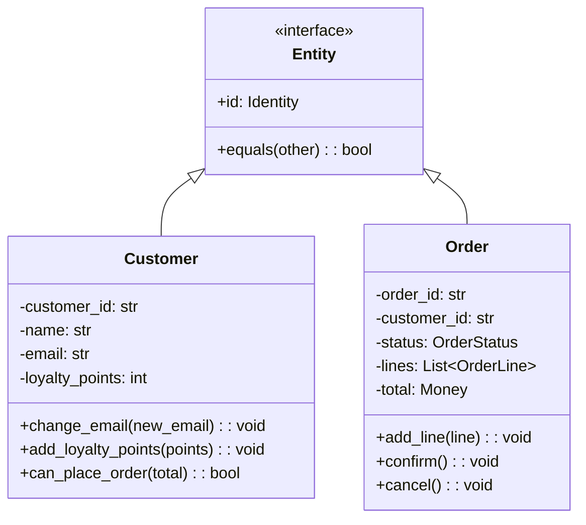
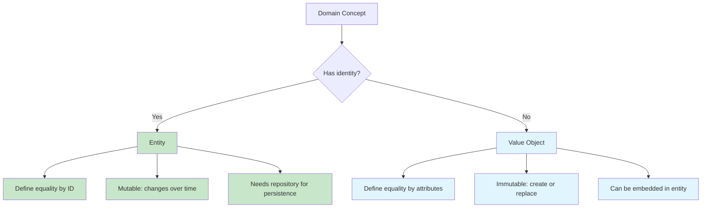
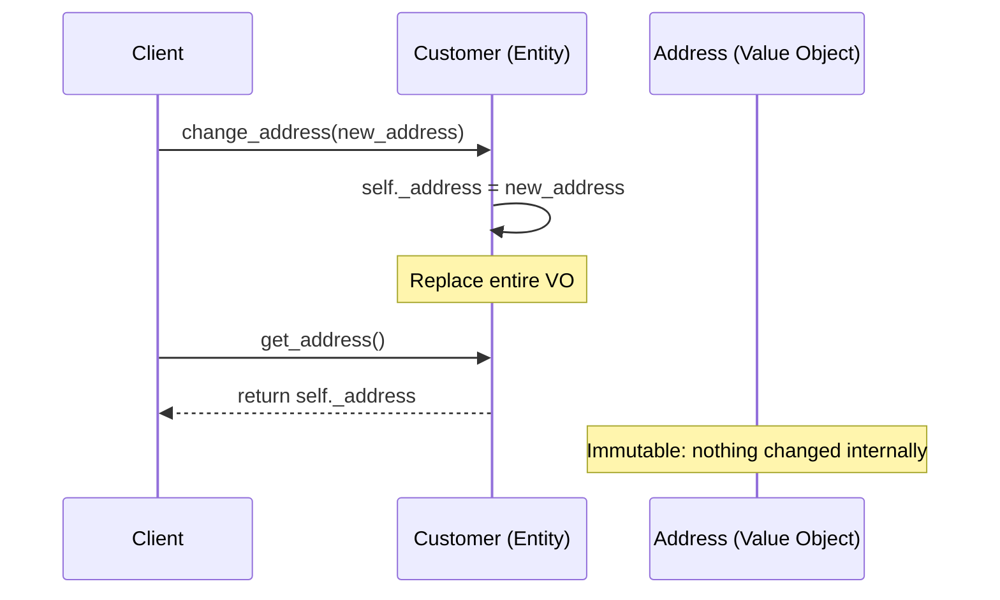

# Entities & Value Objects

Entities and Value Objects are the **two fundamental building blocks** of a domain model in DDD. Together, they form the atoms from which richer structures like Aggregates are built. Understanding the distinction between them — and applying it correctly — is essential for a clean domain model.

> [!NOTE]
> Eric Evans defines an Entity as "an object that is not defined by its attributes, but rather by a thread of continuity and identity." A Value Object is "an object that describes some characteristic or attribute but carries no concept of identity."

## Entities: Objects with Identity

An Entity has a **unique identity** that persists across time and changes. Two entities may have all the same attribute values but still be different objects because they have different identities.



```python
from dataclasses import dataclass, field
from enum import Enum
from datetime import datetime
from typing import Optional

class OrderStatus(Enum):
    PENDING = "pending"
    CONFIRMED = "confirmed"
    SHIPPED = "shipped"
    DELIVERED = "delivered"

class Customer:
    """An Entity: identity is the customer_id, not the attributes."""

    def __init__(self, customer_id: str, name: str, email: str):
        self._id = customer_id
        self._name = name
        self._email = email
        self._loyalty_points = 0
        self._created_at = datetime.now()

    @property
    def id(self) -> str:
        return self._id

    @property
    def email(self) -> str:
        return self._email

    def change_email(self, new_email: str) -> None:
        if not self._is_valid_email(new_email):
            raise ValueError("Invalid email address")
        self._email = new_email

    def add_loyalty_points(self, points: int) -> None:
        if points < 0:
            raise ValueError("Points cannot be negative")
        self._loyalty_points += points

    def can_place_order(self, order_total: float) -> bool:
        return order_total <= self._credit_limit

    @staticmethod
    def _is_valid_email(email: str) -> bool:
        return "@" in email and "." in email

    def __eq__(self, other: object) -> bool:
        if not isinstance(other, Customer):
            return False
        return self._id == other._id

    def __hash__(self) -> int:
        return hash(self._id)
```

### Identity Generation Strategies

| Strategy | Description | Example | Pros | Cons |
|----------|-------------|---------|------|------|
| Natural Key | Domain-provided ID | SSN, Email, SKU | Meaningful | May change, may not exist |
| Surrogate Key | System-generated ID | UUID, Auto-increment | Stable, simple | Meaningless |
| Composite Key | Combination of fields | (Warehouse, Aisle, Bin) | Precise location | Complex |
| External ID | ID from another system | Payment Transaction ID | Links systems | External dependency |

```python
import uuid
from dataclasses import dataclass

# Surrogate key: UUID
@dataclass
class OrderEntity:
    order_id: str = field(default_factory=lambda: f"ORD-{uuid.uuid4().hex[:8].upper()}")

# Natural key: SKU
class Product:
    def __init__(self, sku: str, name: str, price: float):
        self._sku = sku  # Natural key: Stock Keeping Unit
        self._name = name
        self._price = price

    @property
    def id(self) -> str:
        return self._sku  # Identity = SKU

# Composite key
@dataclass(frozen=True)
class WarehouseBinId:
    warehouse_code: str
    aisle: str
    rack: str
    shelf: str

    def __str__(self) -> str:
        return f"{self.warehouse_code}-{self.aisle}-{self.rack}-{self.shelf}"

class WarehouseBin:
    def __init__(self, bin_id: WarehouseBinId, capacity: int):
        self._id = bin_id
        self._capacity = capacity
        self._current_usage = 0
```

## Value Objects: Objects with Equality by Value

A Value Object has **no identity**. Two Value Objects are equal if all their attributes are equal. They are immutable — once created, they cannot change.

```python
from dataclasses import dataclass
from decimal import Decimal
from typing import Optional

# Value Object: immutable, equality by value, no identity
@dataclass(frozen=True)
class Money:
    amount: Decimal
    currency: str

    def __add__(self, other: "Money") -> "Money":
        if self.currency != other.currency:
            raise ValueError(f"Cannot add {self.currency} to {other.currency}")
        return Money(self.amount + other.amount, self.currency)

    def __sub__(self, other: "Money") -> "Money":
        if self.currency != other.currency:
            raise ValueError(f"Cannot subtract {self.currency} from {other.currency}")
        return Money(self.amount - other.amount, self.currency)

    def __mul__(self, multiplier: int) -> "Money":
        return Money(self.amount * multiplier, self.currency)

    def __repr__(self) -> str:
        return f"{self.currency} {self.amount:.2f}"

# Using the Value Object
price = Money(Decimal("29.99"), "USD")
tax = Money(Decimal("2.40"), "USD")
total = price + tax  # Money(32.39, "USD")

five_items = price * 5  # Money(149.95, "USD")
```

### When to Use a Value Object

A concept should be a Value Object when:

1. **It describes a characteristic** of something else
2. **It has no identity** of its own
3. **You replace it, not modify it** when it needs to change
4. **You care about what it is**, not which one it is
5. **It is immutable**

```python
# Common Value Objects in a domain model
from dataclasses import dataclass
from enum import Enum

@dataclass(frozen=True)
class Email:
    address: str

    def __post_init__(self) -> None:
        if "@" not in self.address or "." not in self.address:
            raise ValueError(f"Invalid email: {self.address}")

    @property
    def domain(self) -> str:
        return self.address.split("@")[1]

@dataclass(frozen=True)
class PhoneNumber:
    country_code: str
    area_code: str
    number: str

    def __str__(self) -> str:
        return f"+{self.country_code} ({self.area_code}) {self.number}"

@dataclass(frozen=True)
class Address:
    street: str
    city: str
    state: str
    zip_code: str
    country: str

    def is_in_united_states(self) -> bool:
        return self.country.upper() == "US"

@dataclass(frozen=True)
class DateRange:
    start: "datetime"
    end: "datetime"

    def __post_init__(self) -> None:
        if self.start >= self.end:
            raise ValueError("Start must be before end")

    def overlaps_with(self, other: "DateRange") -> bool:
        return self.start < other.end and self.end > other.start

@dataclass(frozen=True)
class Dimension:
    width: float
    height: float
    depth: float
    unit: str

    @property
    def volume(self) -> float:
        return self.width * self.height * self.depth
```

## The Distinction in Practice

Here is how Entities and Value Objects are used together in a domain model:

```python
# Entity: Customer has identity
class Customer:
    def __init__(self, customer_id: str, name: str, email: str):
        self._id = customer_id
        self._name = name
        self._email = Email(email)  # Value Object inside Entity
        self._shipping_address: Optional[Address] = None  # Value Object
        self._phone: Optional[PhoneNumber] = None  # Value Object

    def update_shipping_address(self, address: Address) -> None:
        """Replace the Value Object entirely (immutable pattern)."""
        self._shipping_address = address

    def change_email(self, email: str) -> None:
        """Replace the Value Object."""
        self._email = Email(email)
```

> [!TIP]
> Value Objects are the perfect candidates for `dataclass(frozen=True)` in Python. The immutability guarantee ensures they behave correctly as value types and can be safely shared and cached.

## Modeling with Value Objects

Value Objects help avoid **primitive obsession** — the anti-pattern of using primitive types (strings, ints, floats) for domain concepts.

```python
# Primitive obsession (BAD)
class OrderPrimitive:
    def __init__(self, customer_id: str, amount: float, tax: float,
                 street: str, city: str, zip_code: str):
        self.customer_id = customer_id
        self.amount = amount
        self.tax = tax
        self.street = street
        self.city = city
        self.zip_code = zip_code

# With Value Objects (GOOD)
@dataclass(frozen=True)
class CustomerId:
    value: str

@dataclass(frozen=True)
class TaxRate:
    rate: float

    def apply_to(self, amount: Money) -> Money:
        return Money(amount.amount * self.rate, amount.currency)

class OrderRich:
    def __init__(self, customer_id: CustomerId, amount: Money,
                 tax_rate: TaxRate, shipping_address: Address):
        self._customer_id = customer_id
        self._amount = amount
        self._tax = tax_rate.apply_to(amount)
        self._shipping_address = shipping_address
```

## Immutability and Side-Effect-Free Functions

Value Objects are immutable. When you need a "different" value, you create a new one. This leads to side-effect-free functions that are easy to test and reason about.

```python
@dataclass(frozen=True)
class Percentage:
    value: float  # 0 to 100

    def __post_init__(self) -> None:
        if self.value < 0 or self.value > 100:
            raise ValueError(f"Percentage must be 0-100, got {self.value}")

    def of(self, amount: float) -> float:
        return amount * self.value / 100

    def add(self, other: "Percentage") -> "Percentage":
        return Percentage(self.value + other.value)

    def subtract(self, other: "Percentage") -> "Percentage":
        return Percentage(self.value - other.value)

# Used in a domain service
class DiscountCalculator:
    def apply_discount(self, price: Money, discount: Percentage) -> Money:
        discount_amount = price.amount * (discount.value / 100)
        return Money(price.amount - discount_amount, price.currency)
```

## Testing Value Objects

Value Objects are the easiest things to test in a domain model because they have no dependencies and are immutable.

```python
import pytest

def test_money_addition():
    a = Money(Decimal("10.00"), "USD")
    b = Money(Decimal("5.00"), "USD")
    result = a + b
    assert result == Money(Decimal("15.00"), "USD")

def test_money_currency_mismatch():
    usd = Money(Decimal("10.00"), "USD")
    eur = Money(Decimal("10.00"), "EUR")
    with pytest.raises(ValueError, match="Currency mismatch"):
        usd + eur

def test_money_immutability():
    original = Money(Decimal("10.00"), "USD")
    result = original * 3
    assert original == Money(Decimal("10.00"), "USD")  # Unchanged
    assert result == Money(Decimal("30.00"), "USD")

def test_percentage_validation():
    with pytest.raises(ValueError):
        Percentage(150)  # Invalid percentage
    with pytest.raises(ValueError):
        Percentage(-5)   # Invalid percentage

def test_email_validation():
    valid = Email("user@example.com")
    assert valid.domain == "example.com"

    with pytest.raises(ValueError):
        Email("not-an-email")
```

## Equality Semantics

Entities and Value Objects have different equality rules:

```python
# Entity: equality by identity
customer_a = Customer("123", "Alice", "alice@example.com")
customer_b = Customer("123", "Alice", "alice@example.com")
customer_c = Customer("456", "Alice", "alice@example.com")

assert customer_a == customer_b  # Same ID → equal
assert customer_a != customer_c  # Different ID → not equal

# Value Object: equality by value
money_a = Money(Decimal("10.00"), "USD")
money_b = Money(Decimal("10.00"), "USD")
money_c = Money(Decimal("20.00"), "USD")

assert money_a == money_b  # Same attributes → equal
assert money_a != money_c  # Different attributes → not equal
```



## Common Mistakes

| Mistake | Wrong | Correct |
|---------|-------|---------|
| Making an entity a value object | `Customer` without id | `Customer` has customer_id |
| Making a value object an entity | `Address` with id | `Address` is a value object |
| Mutating a value object | `address.city = "NYC"` | `new_address = Address(...)` |
| Not overriding `__eq__` on entity | Default object comparison | Compare by ID |
| Primitive obsession | `email: str` | `email: Email` (value object) |
| Entity without behavior | Getter/setter only | Business methods on entity |

## Value Objects in Practice: Real-World Example

Here is how a rich domain model uses both Entities and Value Objects in an e-commerce context:

```python
from dataclasses import dataclass, field
from enum import Enum
from datetime import datetime
from decimal import Decimal
from typing import List, Optional
import uuid

# --- Value Objects ---

@dataclass(frozen=True)
class Money:
    amount: Decimal
    currency: str

    def __add__(self, other: "Money") -> "Money":
        if self.currency != other.currency:
            raise ValueError("Currency mismatch")
        return Money(self.amount + other.amount, self.currency)

    def __mul__(self, quantity: int) -> "Money":
        return Money(self.amount * quantity, self.currency)

@dataclass(frozen=True)
class ProductSnapshot:
    """Immutable snapshot of product info at time of order."""
    product_id: str
    name: str
    price: Money
    category: str

@dataclass(frozen=True)
class ShippingAddress:
    street: str
    city: str
    state: str
    zip_code: str
    country: str

    def is_domestic(self) -> bool:
        return self.country.upper() == "US"

# --- Entities ---

class OrderStatus(Enum):
    PENDING = "pending"
    PAID = "paid"
    SHIPPED = "shipped"
    DELIVERED = "delivered"
    CANCELLED = "cancelled"

class Order:
    """Entity: an order has identity."""

    def __init__(self, customer_id: str, shipping_address: ShippingAddress):
        self._id = f"ORD-{uuid.uuid4().hex[:8].upper()}"
        self._customer_id = customer_id
        self._shipping_address = shipping_address
        self._lines: List["OrderLine"] = []
        self._status = OrderStatus.PENDING
        self._placed_at = datetime.now()

    @property
    def id(self) -> str:
        return self._id

    @property
    def status(self) -> OrderStatus:
        return self._status

    def add_product(self, product: ProductSnapshot, quantity: int) -> None:
        if self._status != OrderStatus.PENDING:
            raise ValueError("Cannot modify a non-pending order")
        self._lines.append(OrderLine(product, quantity))

    def calculate_total(self) -> Money:
        total = Money(Decimal("0.00"), "USD")
        for line in self._lines:
            total = total + line.subtotal()
        return total

    def mark_paid(self) -> None:
        if self._status != OrderStatus.PENDING:
            raise ValueError("Order is not pending")
        if not self._lines:
            raise ValueError("Cannot pay for empty order")
        self._status = OrderStatus.PAID

    def ship(self) -> None:
        if self._status != OrderStatus.PAID:
            raise ValueError("Can only ship paid orders")
        self._status = OrderStatus.SHIPPED

    def cancel(self) -> None:
        if self._status in (OrderStatus.SHIPPED, OrderStatus.DELIVERED):
            raise ValueError("Cannot cancel shipped or delivered order")
        self._status = OrderStatus.CANCELLED

    def __eq__(self, other: object) -> bool:
        if not isinstance(other, Order):
            return False
        return self._id == other._id

    def __hash__(self) -> int:
        return hash(self._id)


class OrderLine:
    """Entity within the Order aggregate (has local identity)."""

    def __init__(self, product: ProductSnapshot, quantity: int):
        self._line_id = f"LN-{uuid.uuid4().hex[:8].upper()}"
        self._product = product
        self._quantity = quantity

    @property
    def line_id(self) -> str:
        return self._line_id

    def subtotal(self) -> Money:
        return self._product.price * self._quantity

    def __eq__(self, other: object) -> bool:
        if not isinstance(other, OrderLine):
            return False
        return self._line_id == other._line_id

    def __hash__(self) -> int:
        return hash(self._line_id)
```

> [!SUCCESS]
> The distinction between Entities and Value Objects is one of the most important modeling decisions you will make. Get it right, and your model is clean, expressive, and maintainable. Get it wrong, and you end up with identity-less entities or over-engineered value objects.

## Entity Lifecycle with Value Objects



## Practice Exercises

1. **Entity vs Value Object classification**: For each concept, classify as Entity or Value Object and explain why:
   - A bank account
   - A credit card number
   - A transaction receipt
   - A customer session
   - A geographic coordinate
   - An invoice line item
   - A social security number

2. **Primitive obsession refactor**: The following code suffers from primitive obsession. Refactor it using Value Objects:
   ```python
   class Movie:
       def __init__(self, title: str, year: int, duration_minutes: int,
                    rating: str, genre: str):
           self.title = title
           self.year = year
           self.duration = duration_minutes
           self.rating = rating  # "PG-13", "R", etc.
           self.genre = genre
   ```

3. **Implement a Value Object**: Create a `Temperature` value object that supports Celsius and Fahrenheit. It should be immutable, have proper equality, and provide conversion methods.

4. **Entity identity design**: Design the identity strategy for a "MedicalRecord" entity in a hospital system. Consider: what makes a medical record unique? Could there be multiple records for the same patient? What natural keys exist?

5. **Entity equality**: Implement `__eq__` and `__hash__` for a `Document` entity. The document has a `document_id` (UUID), `title`, `author`, `content_hash`, and `version`. Which field(s) should determine identity?

6. **Value Object composition**: Create a `GeoLocation` value object (latitude, longitude) with a method `distance_to(other: GeoLocation) -> Distance` that returns a `Distance` value object. Both should be frozen dataclasses.

7. **Entity with embedded Value Objects**: Design a `FlightReservation` entity that embeds the following Value Objects: `FlightNumber`, `SeatAssignment`, `DateRange`, `PassengerName`. Each Value Object should have validation in `__post_init__`.

8. **Refactor anemic model**: The following model uses only primitives. Refactor to use Value Objects and ensure entities have proper identity and behavior:
   ```python
   class Book:
       def __init__(self):
           self.isbn = ""
           self.title = ""
           self.author = ""
           self.pages = 0
           self.publisher = ""
           self.publish_year = 0
           self.genre = ""
           self.available_copies = 0
           self.total_copies = 0

       def borrow(self):
           if self.available_copies > 0:
               self.available_copies -= 1

       def return_book(self):
           if self.available_copies < self.total_copies:
               self.available_copies += 1
   ```

> [!SUCCESS]
> You have completed Lesson 4. Entities provide identity and continuity; Value Objects provide descriptive power and immutability. Together, they give you precise building blocks for modeling any domain.
