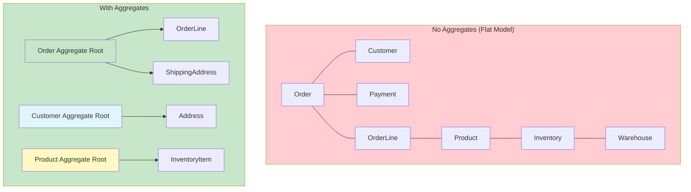
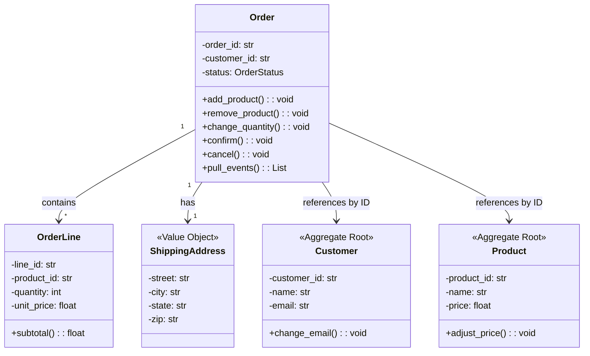

# Aggregates & Aggregate Roots

An Aggregate is a **cluster of domain objects** that can be treated as a single unit. Each Aggregate has an **Aggregate Root** — a single Entity that acts as the entry point and controls access to everything inside the boundary.

> [!NOTE]
> The Aggregate pattern is DDD's answer to consistency. In any system with concurrent access and complex data, ensuring invariants (business rules that must always hold true) is hard. Aggregates define clear **consistency boundaries** that make invariants enforceable.

## Why Aggregates Matter

Without aggregates, transactions become complex, invariants are scattered across the codebase, and the domain model offers no guidance about what can be modified together.



## The Aggregate Root

The Aggregate Root is the **single entry point** to the aggregate. External objects can only hold references to the root, not to internal entities. The root is responsible for:

1. **Enforcing invariants**: Business rules that involve multiple internal objects
2. **Controlling access**: External objects cannot directly modify internal entities
3. **Managing persistence**: The root is loaded and saved as a whole
4. **Generating events**: Domain events are published by the root

```python
from dataclasses import dataclass, field
from enum import Enum
from datetime import datetime
from typing import List, Optional, Protocol
import uuid


class OrderStatus(Enum):
    PENDING = "pending"
    CONFIRMED = "confirmed"
    SHIPPED = "shipped"
    DELIVERED = "delivered"
    CANCELLED = "cancelled"


# --- Internal Entity (not a root) ---
class OrderLine:
    """Entity inside the Order aggregate.
    External code NEVER holds a direct reference to this.
    All access goes through the Order aggregate root."""

    def __init__(self, product_id: str, product_name: str,
                 quantity: int, unit_price: float):
        self._line_id = f"LN-{uuid.uuid4().hex[:8].upper()}"
        self._product_id = product_id
        self._product_name = product_name
        self._quantity = quantity
        self._unit_price = unit_price

    @property
    def product_id(self) -> str:
        return self._product_id

    def subtotal(self) -> float:
        return self._quantity * self._unit_price

    def change_quantity(self, new_quantity: int) -> None:
        if new_quantity <= 0:
            raise ValueError("Quantity must be positive")
        self._quantity = new_quantity


# --- Aggregate Root ---
class Order:
    """Aggregate Root.
    Controls all access to OrderLines inside the aggregate."""

    def __init__(self, customer_id: str):
        self._id = f"ORD-{uuid.uuid4().hex[:8].upper()}"
        self._customer_id = customer_id
        self._lines: List[OrderLine] = []
        self._status = OrderStatus.PENDING
        self._placed_at = datetime.now()
        self._events: List[object] = []  # Domain events to publish

    @property
    def id(self) -> str:
        return self._id

    @property
    def status(self) -> OrderStatus:
        return self._status

    @property
    def total(self) -> float:
        return sum(line.subtotal() for line in self._lines)

    # --- Commands (behavior) ---

    def add_product(self, product_id: str, product_name: str,
                    quantity: int, unit_price: float) -> None:
        if quantity <= 0:
            raise ValueError("Quantity must be positive")
        self._assert_is_pending()
        self._lines.append(OrderLine(product_id, product_name,
                                     quantity, unit_price))

    def remove_product(self, product_id: str) -> None:
        self._assert_is_pending()
        original_count = len(self._lines)
        self._lines = [l for l in self._lines
                       if l.product_id != product_id]
        if len(self._lines) == original_count:
            raise ValueError(f"Product {product_id} not in order")

    def change_quantity(self, product_id: str, new_quantity: int) -> None:
        self._assert_is_pending()
        for line in self._lines:
            if line.product_id == product_id:
                line.change_quantity(new_quantity)
                return
        raise ValueError(f"Product {product_id} not in order")

    def confirm(self) -> None:
        self._assert_is_pending()
        if not self._lines:
            raise ValueError("Cannot confirm an empty order")
        if self.total <= 0:
            raise ValueError("Cannot confirm order with zero total")
        self._status = OrderStatus.CONFIRMED
        self._events.append(OrderConfirmed(self._id, self._customer_id))

    def ship(self) -> None:
        if self._status != OrderStatus.CONFIRMED:
            raise ValueError("Can only ship confirmed orders")
        self._status = OrderStatus.SHIPPED

    def cancel(self) -> None:
        if self._status in (OrderStatus.SHIPPED, OrderStatus.DELIVERED):
            raise ValueError("Cannot cancel shipped or delivered order")
        self._status = OrderStatus.CANCELLED

    # --- Domain events ---

    def pull_events(self) -> List[object]:
        events = list(self._events)
        self._events.clear()
        return events

    # --- Internal helpers ---

    def _assert_is_pending(self) -> None:
        if self._status != OrderStatus.PENDING:
            raise ValueError(
                f"Cannot modify order in status {self._status.value}"
            )

    def __eq__(self, other: object) -> bool:
        if not isinstance(other, Order):
            return False
        return self._id == other._id

    def __hash__(self) -> int:
        return hash(self._id)


# --- Domain Event ---
@dataclass
class OrderConfirmed:
    order_id: str
    customer_id: str
    occurred_at: datetime = field(default_factory=datetime.now)
```

## Aggregate Design Principles

### 1. Make Aggregates Small

The smaller the aggregate, the fewer concurrent conflicts. Load and save the entire aggregate as one unit.

| Size | Example | Concurrent Users | Conflicts |
|------|---------|-----------------|-----------|
| Large | Order with 1000+ lines | 5 | Frequent |
| Medium | Order with 10-50 lines | 100 | Rare |
| Small | Order with 1-5 lines | 1000 | Very rare |

> [!WARNING]
> The most common aggregate design mistake is making them too large. A good rule of thumb: **if an aggregate has more than 5-7 internal entities, it is probably too large.** Split it.

### 2. Reference Other Aggregates by ID Only

Never hold an object reference to another aggregate's internal entities. Use the other aggregate's ID.

```python
# Correct: Order references Customer by ID, not by object reference
class Order:
    def __init__(self, customer_id: str):
        self._customer_id = customer_id  # Just the ID
        # We do NOT hold a Customer object here

    @property
    def customer_id(self) -> str:
        return self._customer_id

# Wrong: holding reference to another aggregate's internal data
class OrderWrong:
    def __init__(self, customer: "Customer"):
        self._customer = customer  # Never reference another aggregate root
        self._lines: List[OrderLine] = []

    def get_customer_email(self) -> str:
        return self._customer.email  # Accessing internal data of another aggregate
```

### 3. Define Clear Invariants

Each aggregate should have explicit invariants — business rules that must always be true.

```python
class ShoppingCart:
    """Aggregate with explicit invariants."""

    INVARIANT_MAX_ITEMS = 50
    INVARIANT_MAX_QUANTITY_PER_ITEM = 99
    INVARIANT_MIN_ORDER_AMOUNT = 10.0

    def __init__(self, cart_id: str, customer_id: str):
        self._id = cart_id
        self._customer_id = customer_id
        self._items: List[CartItem] = []
        self._is_checked_out = False

    def add_item(self, product_id: str, quantity: int, price: float) -> None:
        self._assert_not_checked_out()

        # Invariant 1: max items
        if len(self._items) >= self.INVARIANT_MAX_ITEMS:
            raise ValueError(f"Cannot exceed {self.INVARIANT_MAX_ITEMS} items")

        # Invariant 2: max quantity per item
        existing = self._find_item(product_id)
        new_qty = (existing._quantity if existing else 0) + quantity
        if new_qty > self.INVARIANT_MAX_QUANTITY_PER_ITEM:
            raise ValueError(
                f"Cannot exceed {self.INVARIANT_MAX_QUANTITY_PER_ITEM} "
                f"per item"
            )

        if existing:
            existing.change_quantity(new_qty)
        else:
            self._items.append(CartItem(product_id, quantity, price))

    def checkout(self) -> None:
        self._assert_not_checked_out()

        # Invariant 3: min order amount
        if self._calculate_total() < self.INVARIANT_MIN_ORDER_AMOUNT:
            raise ValueError(
                f"Minimum order amount is ${self.INVARIANT_MIN_ORDER_AMOUNT}"
            )

        # Invariant 4: cannot checkout empty
        if not self._items:
            raise ValueError("Cannot checkout empty cart")

        self._is_checked_out = True

    def _calculate_total(self) -> float:
        return sum(item.subtotal() for item in self._items)

    def _find_item(self, product_id: str):
        for item in self._items:
            if item.product_id == product_id:
                return item
        return None

    def _assert_not_checked_out(self) -> None:
        if self._is_checked_out:
            raise ValueError("Cart has already been checked out")
```

### 4. Transactions Span One Aggregate Only

A transaction should modify only one aggregate. If you need to modify multiple aggregates, use eventual consistency via domain events.

```python
# Correct: one transaction per aggregate
class OrderService:
    def confirm_order(self, order_id: str) -> None:
        order = self._repo.find_by_id(order_id)
        order.confirm()
        self._repo.save(order)
        # Publish events for eventual consistency with other aggregates
        for event in order.pull_events():
            self._event_publisher.publish(event)

# Wrong: modifying two aggregates in one transaction
class OrderServiceWrong:
    def confirm_order(self, order_id: str) -> None:
        order = self._repo.find_by_id(order_id)
        customer = self._customer_repo.find_by_id(order.customer_id)
        order.confirm()
        customer.increment_order_count()  # Another aggregate!
        self._repo.save(order)
        self._customer_repo.save(customer)  # Two saves = bad
```

## Consistent Aggregate Design



## Transaction Boundaries

> [!TIP]
> The aggregate defines the **transaction boundary**. Everything inside the aggregate is saved or nothing is saved. Everything inside is consistent. Everything outside is eventually consistent.

```python
from typing import Protocol, List
from dataclasses import dataclass

class UnitOfWork(Protocol):
    """Ensures atomicity for aggregate operations."""

    def begin(self) -> None: ...
    def commit(self) -> None: ...
    def rollback(self) -> None: ...

class OrderRepository(Protocol):
    def find_by_id(self, order_id: str) -> Order | None: ...
    def save(self, order: Order) -> None: ...

class ConfirmOrderHandler:
    """Use case that operates on one aggregate within a transaction."""

    def __init__(self, repo: OrderRepository, uow: UnitOfWork):
        self._repo = repo
        self._uow = uow

    def handle(self, order_id: str) -> None:
        self._uow.begin()
        try:
            order = self._repo.find_by_id(order_id)
            if not order:
                raise ValueError(f"Order {order_id} not found")
            order.confirm()
            self._repo.save(order)
            self._uow.commit()
        except Exception:
            self._uow.rollback()
            raise
```

## Designing Aggregates: A Step-by-Step Process

### Step 1: Identify Entities and Value Objects

Understand the key concepts in your bounded context.

### Step 2: Group by Invariant

Which entities must be consistent with each other? Group them into aggregates.

### Step 3: Choose the Root

Which entity is the natural entry point? The one that controls access and enforces invariants.

### Step 4: Define Boundaries

Decide what is inside and outside the aggregate. External access goes through the root only.

### Step 5: Design for Consistency

Define the invariants the aggregate must enforce. Design operations around them.

```python
# Step-by-step: Designing a Reservation aggregate for a hotel

# Step 1: Candidate entities and value objects
# - Reservation (entity)
# - Guest (entity? value object?)
# - Room (entity)
# - DateRange (value object)
# - Money (value object)
# - BookingCharge (value object)

# Step 2: Invariants
# - A room cannot be double-booked for overlapping dates
# - A reservation has exactly one guest
# - Total charge must be paid before check-in

# Step 3: Aggregate Root = Reservation
# Step 4: Boundary = Reservation + Guest + DateRange + BookingCharge

class Reservation:
    """Aggregate Root for hotel reservations."""

    def __init__(self, room_id: str, guest_name: str,
                 guest_email: str, date_range: "DateRange"):
        self._id = f"RES-{uuid.uuid4().hex[:8].upper()}"
        self._room_id = room_id  # Reference to Room aggregate by ID
        self._guest = GuestInfo(guest_name, guest_email)
        self._date_range = date_range
        self._charges: List[BookingCharge] = []
        self._is_cancelled = False

    def add_charge(self, description: str, amount: "Money") -> None:
        if self._is_cancelled:
            raise ValueError("Cannot add charges to cancelled reservation")
        self._charges.append(BookingCharge(description, amount))

    def cancel(self) -> None:
        if self._is_cancelled:
            raise ValueError("Reservation already cancelled")
        self._is_cancelled = True
        # Domain event for eventual consistency
        self._publish(ReservationCancelled(self._id, self._room_id))

    def change_dates(self, new_range: "DateRange") -> None:
        if self._is_cancelled:
            raise ValueError("Cannot change dates of cancelled reservation")
        self._date_range = new_range

    @property
    def total_charge(self) -> "Money":
        total = Money(0, "USD")
        for charge in self._charges:
            total = total + charge.amount
        return total


@dataclass(frozen=True)
class GuestInfo:
    """Value Object inside Reservation aggregate."""
    name: str
    email: str


@dataclass(frozen=True)
class BookingCharge:
    """Value Object inside Reservation aggregate."""
    description: str
    amount: "Money"
```

## Common Aggregate Patterns

| Pattern | Description | Example |
|---------|-------------|---------|
| Single Entity | Aggregate is just a root entity | User, Customer |
| Root + Children | Root with owned entities | Order + OrderLines |
| Root + Value Objects | Root with value objects only | Product + Money + Dimension |
| Composition | Root composed of sub-entities | ShoppingCart + CartItems |
| Event Source | Aggregate rebuilt from events | BankAccount + Transactions |

## Eventual Consistency Between Aggregates

When a command on one aggregate must affect another aggregate, use **domain events** and a **saga/process manager**.

```python
# When Order is confirmed, Inventory must reserve stock
# These are different aggregates — handled with eventual consistency

@dataclass
class OrderConfirmed:
    order_id: str
    items: List[dict]

# This runs AFTER the Order aggregate transaction commits
class InventoryReservationHandler:
    """Reacts to OrderConfirmed with eventual consistency."""

    def __init__(self, inventory_repo, event_publisher):
        self._inventory_repo = inventory_repo
        self._event_publisher = event_publisher

    def handle(self, event: OrderConfirmed) -> None:
        for item in event.items:
            product = self._inventory_repo.find_by_id(item["product_id"])
            product.reserve_stock(item["quantity"])
            self._inventory_repo.save(product)
```

> [!SUCCESS]
> Aggregates are the most important tactical pattern in DDD for managing consistency. They define clear boundaries that make invariants enforceable, transactions manageable, and concurrent access predictable. Small aggregates, referenced by ID, with eventual consistency between them — this is the DDD way.

## Testing Aggregate Invariants

```python
import pytest

def test_cannot_confirm_empty_order():
    order = Order(customer_id="CUST-001")
    with pytest.raises(ValueError, match="empty order"):
        order.confirm()

def test_cannot_add_product_to_confirmed_order():
    order = Order(customer_id="CUST-001")
    order.add_product("P1", "Widget", 2, 10.0)
    order.confirm()
    with pytest.raises(ValueError, match="modify order in status"):
        order.add_product("P2", "Gadget", 1, 20.0)

def test_cannot_ship_unconfirmed_order():
    order = Order(customer_id="CUST-001")
    with pytest.raises(ValueError, match="only ship confirmed"):
        order.ship()

def test_cancel_shipped_order():
    order = Order(customer_id="CUST-001")
    order.add_product("P1", "Widget", 1, 10.0)
    order.confirm()
    order.ship()
    with pytest.raises(ValueError, match="Cannot cancel shipped"):
        order.cancel()

def test_order_total():
    order = Order(customer_id="CUST-001")
    order.add_product("P1", "Widget", 2, 10.0)
    order.add_product("P2", "Gadget", 1, 20.0)
    assert order.total == 40.0

def test_aggregate_events_are_collected():
    order = Order(customer_id="CUST-001")
    order.add_product("P1", "Widget", 1, 10.0)
    assert order.pull_events() == []  # No events yet
    order.confirm()
    events = order.pull_events()
    assert len(events) == 1
    assert isinstance(events[0], OrderConfirmed)
```

## Practice Exercises

1. **Identify aggregates**: For a library management system, identify the aggregates. Justify why each cluster forms an aggregate, who the root is, and what invariants it enforces.

2. **Design an aggregate**: Design a `FlightBooking` aggregate for an airline. List the entities inside, the value objects, the aggregate root, and at least 3 invariants the aggregate enforces.

3. **Fix aggregate violation**: The following code violates aggregate design principles. Identify the violations and fix them:
   ```python
   class Order:
       def __init__(self, customer):
           self._customer = customer
           self._items = []
           self._status = "pending"

       def get_customer_name(self):
           return self._customer.name
   ```

4. **Eventual consistency design**: An e-commerce system has separate `Order` and `Customer` aggregates. When an order is confirmed, the customer's `lifetime_value` should be updated. Design this using domain events and eventual consistency.

5. **Transaction boundary**: Given the following aggregates — `Payment`, `Order`, `Shipment` — describe a scenario where a single user operation triggers changes to all three. Show how you would design this using eventual consistency.

6. **Resize an aggregate**: A `ShoppingCart` aggregate currently holds `CartItem` entities that contain full `Product` data (name, description, image_url, price, weight, dimensions). Refactor so the cart only holds product IDs and references. Explain the tradeoffs.

7. **Invariant enforcement**: Design an aggregate for a bank `Account` with these invariants:
   - Balance must never go below the overdraft limit
   - Maximum withdrawal per day is $10,000
   - Account must be active for transactions
   - Deposits over $10,000 require manager approval flag

8. **Aggregate splitting**: A monolithic `PatientRecord` aggregate contains: personal info, medical history, allergies, prescriptions, lab results, billing info, and insurance details. Split this into at least 3 aggregates. Justify each split based on consistency requirements.

> [!SUCCESS]
> You have completed Lesson 5. Aggregates are the cornerstone of consistency in DDD. Design them small, protect their invariants through the root, and use eventual consistency for cross-aggregate operations. This discipline is what makes complex domains manageable at scale.
