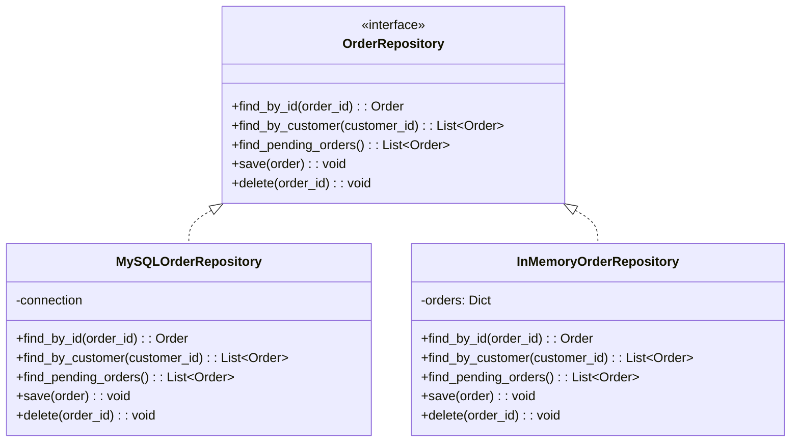

# Repositories & Domain Services

Repositories and Domain Services are two more tactical building blocks in DDD. **Repositories** provide a clean abstraction for storing and retrieving aggregates. **Domain Services** encapsulate domain logic that does not naturally belong in an Entity or Value Object.

> [!NOTE]
> In DDD, a Repository is not a DAO (Data Access Object). A DAO is a technical concept for data access. A Repository is a **domain concept** that speaks the Ubiquitous Language — you ask it for aggregates by domain terms, not by SQL queries.

## Repositories: The Collection Metaphor

A Repository acts like an **in-memory collection** of aggregates. You add items, remove items, and query by domain-relevant criteria. The underlying storage (database, filesystem, API) is hidden behind this interface.



### Repository Interface

The repository interface is defined in the **domain layer**. The implementation is in the **infrastructure layer**. This follows the Dependency Inversion Principle.

```python
from abc import ABC, abstractmethod
from typing import List, Optional, Protocol


# --- Domain Layer: Repository interface ---

class OrderRepository(Protocol):
    """A repository for Order aggregates.
    Defined in the domain layer — speaks the Ubiquitous Language."""

    def find_by_id(self, order_id: str) -> Optional["Order"]:
        """Find an order by its unique identifier."""
        ...

    def find_by_customer(self, customer_id: str) -> List["Order"]:
        """Find all orders placed by a customer."""
        ...

    def find_pending_orders(self) -> List["Order"]:
        """Find all orders that have not been confirmed yet."""
        ...

    def find_orders_older_than(self, days: int) -> List["Order"]:
        """Find orders placed more than the specified days ago."""
        ...

    def save(self, order: "Order") -> None:
        """Persist an order aggregate (insert or update)."""
        ...

    def delete(self, order_id: str) -> None:
        """Remove an order from the repository."""
        ...
```

### Repository Implementation

The implementation lives in the infrastructure layer. It translates between the domain model and the persistence mechanism.

```python
# --- Infrastructure Layer: Repository Implementation ---

import sqlite3
from typing import List, Optional
from datetime import datetime, timedelta


class SQLiteOrderRepository:
    """Implements OrderRepository using SQLite.
    This is infrastructure code — it depends on the domain interface."""

    def __init__(self, db_path: str):
        self._conn = sqlite3.connect(db_path, detect_types=sqlite3.PARSE_DECLTYPES)
        self._init_tables()

    def _init_tables(self) -> None:
        self._conn.execute("""
            CREATE TABLE IF NOT EXISTS orders (
                order_id TEXT PRIMARY KEY,
                customer_id TEXT NOT NULL,
                status TEXT NOT NULL,
                placed_at TIMESTAMP NOT NULL,
                total REAL NOT NULL,
                data TEXT NOT NULL
            )
        """)
        self._conn.execute("""
            CREATE TABLE IF NOT EXISTS order_lines (
                line_id TEXT PRIMARY KEY,
                order_id TEXT NOT NULL,
                product_id TEXT NOT NULL,
                product_name TEXT NOT NULL,
                quantity INTEGER NOT NULL,
                unit_price REAL NOT NULL,
                FOREIGN KEY (order_id) REFERENCES orders(order_id)
            )
        """)
        self._conn.commit()

    def find_by_id(self, order_id: str) -> Optional["Order"]:
        cursor = self._conn.execute(
            "SELECT order_id, customer_id, status, placed_at FROM orders WHERE order_id = ?",
            (order_id,)
        )
        row = cursor.fetchone()
        if not row:
            return None
        return self._row_to_aggregate(row)

    def find_by_customer(self, customer_id: str) -> List["Order"]:
        cursor = self._conn.execute(
            "SELECT order_id, customer_id, status, placed_at FROM orders WHERE customer_id = ?",
            (customer_id,)
        )
        return [self._row_to_aggregate(row) for row in cursor.fetchall()]

    def find_pending_orders(self) -> List["Order"]:
        cursor = self._conn.execute(
            "SELECT order_id, customer_id, status, placed_at FROM orders WHERE status = ?",
            ("pending",)
        )
        return [self._row_to_aggregate(row) for row in cursor.fetchall()]

    def save(self, order: "Order") -> None:
        # Serialize order data
        self._conn.execute(
            """INSERT OR REPLACE INTO orders
               (order_id, customer_id, status, placed_at, total)
               VALUES (?, ?, ?, ?, ?)""",
            (order.id, order.customer_id, order.status.value,
             order.placed_at, order.total)
        )
        # Delete old lines, insert current ones
        self._conn.execute("DELETE FROM order_lines WHERE order_id = ?", (order.id,))
        for line in order.lines:
            self._conn.execute(
                """INSERT INTO order_lines
                   (line_id, order_id, product_id, product_name, quantity, unit_price)
                   VALUES (?, ?, ?, ?, ?, ?)""",
                (line.id, order.id, line.product_id, line.product_name,
                 line.quantity, line.unit_price)
            )
        self._conn.commit()

    def delete(self, order_id: str) -> None:
        self._conn.execute("DELETE FROM order_lines WHERE order_id = ?", (order_id,))
        self._conn.execute("DELETE FROM orders WHERE order_id = ?", (order_id,))
        self._conn.commit()

    def _row_to_aggregate(self, row) -> "Order":
        order = Order(row["customer_id"])
        # Load from row data...
        return order

    def __del__(self):
        self._conn.close()
```

### In-Memory Repository for Testing

The testability benefit of the Repository pattern is enormous. You can write an in-memory implementation for unit tests:

```python
class InMemoryOrderRepository:
    """In-memory implementation for testing.
    No database needed — tests run in milliseconds."""

    def __init__(self):
        self._orders: dict[str, "Order"] = {}

    def find_by_id(self, order_id: str) -> Optional["Order"]:
        return self._orders.get(order_id)

    def find_by_customer(self, customer_id: str) -> List["Order"]:
        return [o for o in self._orders.values()
                if o.customer_id == customer_id]

    def find_pending_orders(self) -> List["Order"]:
        return [o for o in self._orders.values()
                if o.status == "pending"]

    def save(self, order: "Order") -> None:
        self._orders[order.id] = order

    def delete(self, order_id: str) -> None:
        self._orders.pop(order_id, None)
```

> [!WARNING]
> A Repository should **not** be used for arbitrary queries. If you find yourself adding query methods for every possible data access pattern, you are using the Repository wrong. The Repository is for **aggregate retrieval**, not for reporting or data exploration.

## Repository Usage in Application Services

```python
class ConfirmOrderHandler:
    """Application service using the Repository."""

    def __init__(self, repo: OrderRepository, uow: "UnitOfWork"):
        self._repo = repo
        self._uow = uow

    def handle(self, order_id: str) -> None:
        self._uow.begin()
        try:
            order = self._repo.find_by_id(order_id)
            if not order:
                raise ValueError(f"Order {order_id} not found")
            order.confirm()
            self._repo.save(order)
            self._uow.commit()
        except Exception:
            self._uow.rollback()
            raise
```

## Domain Services

A Domain Service is an **operation that does not naturally belong to an Entity or Value Object**. It coordinates multiple aggregates or performs calculations that involve domain logic.

### When to Use a Domain Service

| Situation | Example | Solution |
|-----------|---------|----------|
| Operation involves multiple aggregates | Transfer money between accounts | AccountTransferService |
| Operation involves external domain | Calculate shipping cost with carrier rules | ShippingCostService |
| Operation is stateless computation | Apply complex pricing rules | PricingService |
| Operation requires domain knowledge not owned by any entity | Detect fraud patterns | FraudDetectionService |

```python
from dataclasses import dataclass
from typing import List, Protocol
from decimal import Decimal


# --- Domain Service: Pricing ---

@dataclass(frozen=True)
class Money:
    amount: Decimal
    currency: str

    def __add__(self, other: "Money") -> "Money":
        if self.currency != other.currency:
            raise ValueError("Currency mismatch")
        return Money(self.amount + other.amount, self.currency)

    def __mul__(self, quantity: int) -> "Money":
        return Money(self.amount * quantity, self.currency)


class PricingService:
    """Domain Service for pricing calculations.
    Not a natural fit for Order or Product — it involves
    multiple aggregates and external rules."""

    GOLD_DISCOUNT = Decimal("0.15")
    SILVER_DISCOUNT = Decimal("0.10")
    STANDARD_VAT = Decimal("0.20")

    def calculate_order_total(
        self,
        items: List["OrderLine"],
        customer_tier: str,
        coupon_code: str | None
    ) -> Money:
        subtotal = self._calculate_subtotal(items)
        discount = self._apply_discount(subtotal, customer_tier, coupon_code)
        vat = self._calculate_vat(discount)
        return discount + vat

    def _calculate_subtotal(self, items: List["OrderLine"]) -> Money:
        total = Money(Decimal("0.00"), "USD")
        for item in items:
            total = total + item.subtotal()
        return total

    def _apply_discount(
        self, subtotal: Money, tier: str, coupon: str | None
    ) -> Money:
        discount_rate = Decimal("0")
        if tier == "gold":
            discount_rate = self.GOLD_DISCOUNT
        elif tier == "silver":
            discount_rate = self.SILVER_DISCOUNT
        if coupon == "WELCOME10":
            discount_rate += Decimal("0.10")
        discount_amount = subtotal.amount * discount_rate
        return Money(subtotal.amount - discount_amount, subtotal.currency)

    def _calculate_vat(self, amount: Money) -> Money:
        vat_amount = amount.amount * self.STANDARD_VAT
        return Money(vat_amount, amount.currency)
```

### Domain Service Example: Transfer Money

```python
class Account:
    """Aggregate Root for a bank account."""

    def __init__(self, account_id: str, owner: str):
        self._id = account_id
        self._owner = owner
        self._balance = Money(Decimal("0.00"), "USD")
        self._is_frozen = False

    @property
    def balance(self) -> Money:
        return self._balance

    def deposit(self, amount: Money) -> None:
        if self._is_frozen:
            raise ValueError("Account is frozen")
        if amount.amount <= 0:
            raise ValueError("Deposit amount must be positive")
        self._balance = self._balance + amount

    def withdraw(self, amount: Money) -> None:
        if self._is_frozen:
            raise ValueError("Account is frozen")
        if amount.amount <= 0:
            raise ValueError("Withdrawal amount must be positive")
        if self._balance.amount < amount.amount:
            raise ValueError("Insufficient funds")
        self._balance = self._balance - amount


class TransferService:
    """Domain Service for money transfers.
    Coordinates two Account aggregates."""

    MINIMUM_TRANSFER = Money(Decimal("1.00"), "USD")
    MAXIMUM_TRANSFER = Money(Decimal("10000.00"), "USD")

    def transfer(
        self, source: Account, destination: Account,
        amount: Money, reason: str
    ) -> None:
        if amount.amount < self.MINIMUM_TRANSFER.amount:
            raise ValueError("Transfer amount below minimum")
        if amount.amount > self.MAXIMUM_TRANSFER.amount:
            raise ValueError("Transfer amount exceeds maximum")
        source.withdraw(amount)
        destination.deposit(amount)
```

> [!TIP]
| > Domain Services should be **stateless**. They hold no mutable state of their own. Their dependencies (repositories, other services) are injected through the constructor. The operations they perform are the reason they exist.

### Domain Service Example: Fraud Detection

```python
@dataclass
class FraudAssessment:
    risk_level: str  # "low", "medium", "high"
    score: int
    reasons: List[str]

class FraudDetectionService:
    """Domain Service that assesses fraud risk.
    Coordinates across multiple aggregates and external data."""

    def __init__(self, order_repo: "OrderRepository",
                 customer_repo: "CustomerRepository"):
        self._order_repo = order_repo
        self._customer_repo = customer_repo

    def assess_order_risk(self, order: "Order") -> FraudAssessment:
        reasons: List[str] = []
        score = 0

        # Rule 1: Large orders
        if order.total.amount > 5000:
            score += 30
            reasons.append("Order total exceeds $5,000")

        # Rule 2: Multiple orders in short time
        recent_orders = self._order_repo.find_by_customer(order.customer_id)
        recent_count = sum(
            1 for o in recent_orders
            if (datetime.now() - o.placed_at).hours < 24
        )
        if recent_count >= 3:
            score += 25
            reasons.append("More than 3 orders in 24 hours")

        # Rule 3: New customer with high value
        customer = self._customer_repo.find_by_id(order.customer_id)
        if customer and customer.account_age_days < 30 and order.total.amount > 2000:
            score += 20
            reasons.append("New customer with high-value order")

        risk = "low" if score < 30 else "medium" if score < 60 else "high"
        return FraudAssessment(risk, score, reasons)
```

## Repository vs DAO vs Unit of Work

| Pattern | Purpose | Layer |
|---------|---------|-------|
| Repository | Collection-like access to aggregates | Domain interface |
| DAO | Low-level data access | Infrastructure |
| Unit of Work | Transaction management | Infrastructure |
| Query Object | Read-optimized queries | Application |

```python
# Separate read model (CQRS) from the write model repository
class OrderQueryService:
    """Optimized for reads — not a repository.
    Returns read-only DTOs, not aggregates."""

    def __init__(self, connection):
        self._conn = connection

    def get_order_summary(self, order_id: str) -> dict | None:
        cursor = self._conn.execute("""
            SELECT o.order_id, o.customer_id, o.status,
                   COUNT(ol.line_id) as item_count,
                   o.total
            FROM orders o
            LEFT JOIN order_lines ol ON o.order_id = ol.order_id
            WHERE o.order_id = ?
            GROUP BY o.order_id
        """, (order_id,))
        row = cursor.fetchone()
        if not row:
            return None
        return dict(row)

    def get_customer_order_history(self, customer_id: str) -> List[dict]:
        cursor = self._conn.execute("""
            SELECT order_id, placed_at, status, total
            FROM orders
            WHERE customer_id = ?
            ORDER BY placed_at DESC
            LIMIT 50
        """, (customer_id,))
        return [dict(row) for row in cursor.fetchall()]
```

## Testing with Repositories and Domain Services

The true power of these patterns becomes evident in tests:

```python
import pytest
from datetime import datetime, timedelta


class TestTransferService:
    def setup_method(self):
        self.source = Account("ACC-001", "Alice")
        self.source.deposit(Money(Decimal("1000.00"), "USD"))

        self.destination = Account("ACC-002", "Bob")
        self.destination.deposit(Money(Decimal("100.00"), "USD"))

        self.service = TransferService()

    def test_successful_transfer(self):
        self.service.transfer(
            self.source, self.destination,
            Money(Decimal("200.00"), "USD"), "Payment"
        )
        assert self.source.balance == Money(Decimal("800.00"), "USD")
        assert self.destination.balance == Money(Decimal("300.00"), "USD")

    def test_transfer_insufficient_funds(self):
        with pytest.raises(ValueError, match="Insufficient funds"):
            self.service.transfer(
                self.source, self.destination,
                Money(Decimal("2000.00"), "USD"), "Overdraft"
            )


class TestOrderLifecycleWithRepo:
    def test_confirm_order_through_repo(self):
        # Arrange
        repo = InMemoryOrderRepository()
        order = Order(customer_id="CUST-001")
        order.add_product("P1", "Widget", 2, 10.0)
        repo.save(order)

        # Act
        loaded = repo.find_by_id(order.id)
        loaded.confirm()
        repo.save(loaded)

        # Assert
        confirmed = repo.find_by_id(order.id)
        assert confirmed.status == OrderStatus.CONFIRMED
```

## Summary: Repository and Domain Service Guidelines

| Aspect | Repository | Domain Service |
|--------|------------|----------------|
| Purpose | Store/retrieve aggregates | Coordinate domain operations |
| State | Stateless | Stateless |
| Dependency | Depends on infrastructure | Depends on domain interfaces |
| Testability | Easy (in-memory impl) | Easy (unit tests) |
| Layer | Domain interface, Infrastructure impl | Domain |
| Methods | `find_by_*`, `save`, `delete` | Domain-specific verbs |
| Granularity | One per aggregate root | One per domain capability |

```mermaid
graph TD
    subgraph Application["Application Layer"]
        AUS[Application Use Case]
    end
    subgraph Domain["Domain Layer"]
        AGG[Aggregate Root]
        REP[Repository Interface]
        DS[Domain Service]
    end
    subgraph Infrastructure["Infrastructure Layer"]
        REPI[Repository Implementation]
        DB[(Database)]
    end

    AUS --> AGG
    AUS --> REP
    AUS --> DS
    REP <|-- REPI
    REPI --> DB
    DS --> AGG
    DS --> REP

    style Domain fill:#c8e6c9
    style Application fill:#e1f5fe
    style Infrastructure fill:#fff9c4
```

> [!SUCCESS]
> Repositories keep your domain model persistence-ignorant. Domain Services keep domain logic from leaking into application services. Together, they ensure that the domain layer remains the center of your system, with infrastructure concerns pushed to the edges.

## Practice Exercises

1. **Design a Repository interface**: Design a `CustomerRepository` for a subscription management system. Include methods for finding customers, querying by subscription status, and the standard save/delete operations. Write the interface using `Protocol`.

2. **Implement an in-memory Repository**: Implement the `CustomerRepository` from exercise 1 as an `InMemoryCustomerRepository`. Use it in a test that creates a customer, saves it, retrieves it by ID, and verifies the data.

3. **Implement a SQLite Repository**: Write a `SQLiteCustomerRepository` that implements the same interface. Include the table creation SQL and the mapping logic.

4. **Design a Domain Service**: Design a `SlotAllocationService` for a hospital scheduling system. The service should allocate a patient to a doctor's time slot. Consider: what happens if the slot is taken? What if the patient has a conflict? What if the doctor is overbooked?

5. **Refactor anemic application service**: The following code has domain logic leaking into the application layer. Extract the domain logic into a Domain Service:
   ```python
   class PlaceOrderController:
       def handle(self, request):
           order = Order()
           for item in request["items"]:
               if item["quantity"] > 10:
                   raise ValueError("Cannot order more than 10")
               if item["quantity"] <= 0:
                   raise ValueError("Quantity must be positive")
               order.add_line(item)
           if request["customer_tier"] == "gold":
               order.apply_discount(0.15)
           repo.save(order)
   ```

6. **Repository vs Query Service**: Your team needs to display a dashboard showing: total orders today, average order value, top 5 products, and orders by hour. Would you use a Repository or a separate Query Service? Explain why.

7. **Domain Service with dependencies**: Design a `SubscriptionRenewalService` that checks if a subscription should be renewed, processes the payment via a payment gateway, and sends a confirmation. List its dependencies and show the interface.

8. **Test with in-memory repository**: Write a test for this scenario: a customer can place up to 5 active orders. When they try to place a 6th, the system rejects it. Use an `InMemoryOrderRepository` and an `OrderService` that coordinates the check.

> [!SUCCESS]
> You have completed Lesson 6. Repositories keep aggregates persistence-agnostic, and Domain Services keep operations that span multiple aggregates cleanly modeled. Together with Entities, Value Objects, and Aggregates, they form the complete tactical DDD toolbox.
