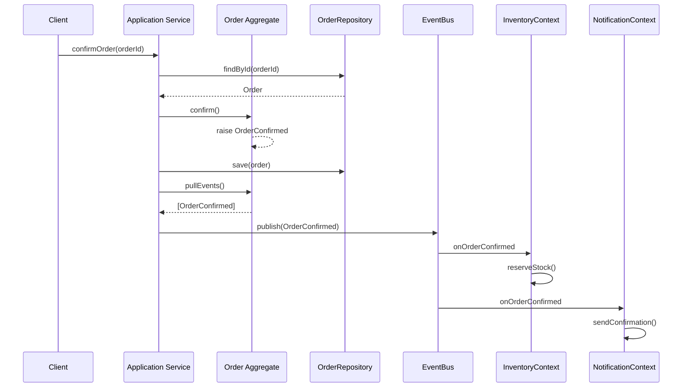
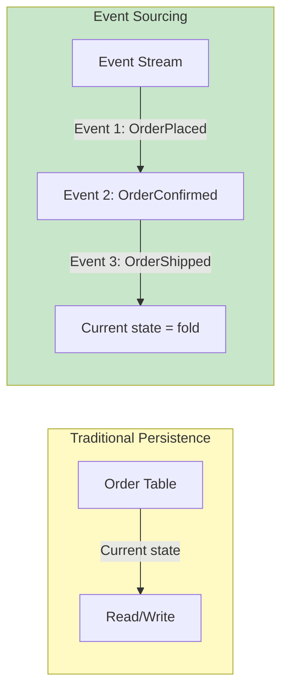
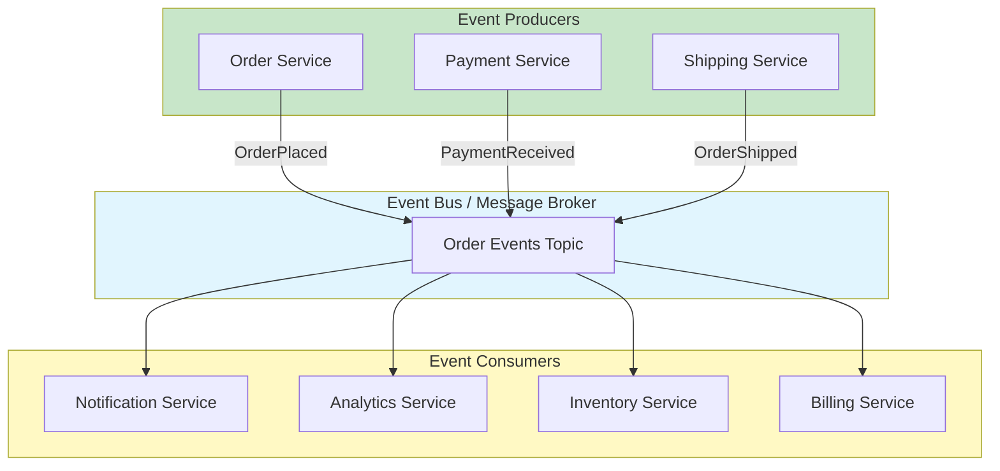

# Event-Driven Architecture

Event-Driven Architecture (EDA) is a software architecture pattern that uses **events** to trigger and communicate between decoupled services. In DDD, Domain Events are used to model significant business occurrences, enabling eventual consistency between aggregates and creating a rich audit trail.

> [!NOTE]
> An event is "something that happened in the past." In DDD, Domain Events are named in the past tense (e.g., `OrderPlaced`, `PaymentReceived`, `InventoryDepleted`). They represent facts that the domain cares about.

## Domain Events

A Domain Event is a **record of something significant that happened** in the domain. It captures the who, what, when, and (optionally) why of a business occurrence.

```python
from dataclasses import dataclass, field
from datetime import datetime
from typing import Optional


@dataclass
class DomainEvent:
    """Base class for domain events."""
    occurred_at: datetime = field(default_factory=datetime.now)

@dataclass
class OrderPlaced(DomainEvent):
    order_id: str
    customer_id: str
    total_amount: float
    item_count: int

@dataclass
class OrderConfirmed(DomainEvent):
    order_id: str
    confirmed_by: str

@dataclass
class PaymentReceived(DomainEvent):
    order_id: str
    transaction_id: str
    amount: float
    payment_method: str

@dataclass
class InventoryReserved(DomainEvent):
    order_id: str
    product_id: str
    quantity: int

@dataclass
class OrderShipped(DomainEvent):
    order_id: str
    tracking_number: str
    shipped_at: datetime
```

### Raising Domain Events from Aggregates

Domain events are typically raised **inside an aggregate** and collected for publication after the transaction commits.

```python
from dataclasses import dataclass, field
from enum import Enum
from typing import List


class OrderStatus(Enum):
    PENDING = "pending"
    CONFIRMED = "confirmed"
    SHIPPED = "shipped"
    DELIVERED = "delivered"

class Order:
    def __init__(self, order_id: str, customer_id: str):
        self._id = order_id
        self._customer_id = customer_id
        self._items: List["OrderLine"] = []
        self._status = OrderStatus.PENDING
        self._events: List[DomainEvent] = []

    @property
    def id(self) -> str:
        return self._id

    @property
    def status(self) -> OrderStatus:
        return self._status

    def add_item(self, product_id: str, quantity: int, price: float) -> None:
        if self._status != OrderStatus.PENDING:
            raise ValueError("Cannot modify confirmed order")
        self._items.append(OrderLine(product_id, quantity, price))

    def confirm(self) -> None:
        if self._status != OrderStatus.PENDING:
            raise ValueError("Order is not pending")
        if not self._items:
            raise ValueError("Cannot confirm empty order")
        self._status = OrderStatus.CONFIRMED
        self._events.append(OrderConfirmed(
            order_id=self._id,
            confirmed_by="system"
        ))

    def ship(self, tracking_number: str) -> None:
        if self._status != OrderStatus.CONFIRMED:
            raise ValueError("Can only ship confirmed orders")
        self._status = OrderStatus.SHIPPED
        self._events.append(OrderShipped(
            order_id=self._id,
            tracking_number=tracking_number,
            shipped_at=datetime.now()
        ))

    def pull_events(self) -> List[DomainEvent]:
        events = list(self._events)
        self._events.clear()
        return events
```

## Event Flow in a DDD System



## Event Dispatching and Handling

```python
from typing import Callable, Type, Dict, List


class EventBus:
    """Simple synchronous event bus for in-process communication."""

    def __init__(self):
        self._handlers: Dict[Type, List[Callable]] = {}

    def subscribe(self, event_type: Type, handler: Callable) -> None:
        self._handlers.setdefault(event_type, []).append(handler)

    def publish(self, event: DomainEvent) -> None:
        for handler in self._handlers.get(type(event), []):
            handler(event)


class OrderApplicationService:
    def __init__(self, repo: "OrderRepository", bus: EventBus):
        self._repo = repo
        self._bus = bus

    def confirm_order(self, order_id: str) -> None:
        order = self._repo.find_by_id(order_id)
        if not order:
            raise ValueError(f"Order {order_id} not found")
        order.confirm()
        self._repo.save(order)
        for event in order.pull_events():
            self._bus.publish(event)


class InventoryEventHandler:
    def __init__(self, repo: "InventoryRepository", bus: EventBus):
        self._repo = repo
        bus.subscribe(OrderConfirmed, self.on_order_confirmed)

    def on_order_confirmed(self, event: OrderConfirmed) -> None:
        print(f"[Inventory] Reserving stock for order {event.order_id}")

class NotificationEventHandler:
    def __init__(self, bus: EventBus):
        bus.subscribe(OrderConfirmed, self.on_order_confirmed)
        bus.subscribe(OrderShipped, self.on_order_shipped)

    def on_order_confirmed(self, event: OrderConfirmed) -> None:
        print(f"[Notification] Sending confirmation for order {event.order_id}")

    def on_order_shipped(self, event: OrderShipped) -> None:
        print(f"[Notification] Sending tracking for order {event.order_id}")
```

## Event Sourcing

Event Sourcing is a persistence pattern where **state is derived from events**. Instead of storing the current state of an aggregate, you store the sequence of events that led to that state.

```python
from dataclasses import dataclass
from typing import List, Protocol


class EventStore(Protocol):
    def save_events(self, aggregate_id: str, events: List[DomainEvent],
                    expected_version: int) -> None: ...
    def get_events(self, aggregate_id: str) -> List[DomainEvent]: ...


class EventSourcedOrder:
    """An aggregate rebuilt from its event stream."""

    def __init__(self, order_id: str):
        self._id = order_id
        self._customer_id = ""
        self._items: List[dict] = []
        self._status = "pending"
        self._version = 0
        self._changes: List[DomainEvent] = []

    @property
    def id(self) -> str: return self._id

    @property
    def version(self) -> int: return self._version

    @classmethod
    def load_from_history(cls, events: List[DomainEvent]) -> "EventSourcedOrder":
        order = cls.__new__(cls)
        for event in events:
            order._apply(event)
        order._changes.clear()
        return order

    def place(self, customer_id: str, items: List[dict]) -> None:
        event = OrderPlaced(
            order_id=self._id,
            customer_id=customer_id,
            total_amount=sum(i["price"] * i["quantity"] for i in items),
            item_count=len(items)
        )
        self._apply(event)
        self._changes.append(event)

    def confirm(self) -> None:
        if self._status != "pending":
            raise ValueError("Cannot confirm non-pending order")
        event = OrderConfirmed(order_id=self._id, confirmed_by="system")
        self._apply(event)
        self._changes.append(event)

    def _apply(self, event: DomainEvent) -> None:
        if isinstance(event, OrderPlaced):
            self._customer_id = event.customer_id
            self._status = "pending"
        elif isinstance(event, OrderConfirmed):
            self._status = "confirmed"
        elif isinstance(event, OrderShipped):
            self._status = "shipped"
        self._version += 1

    def pull_changes(self) -> List[DomainEvent]:
        changes = list(self._changes)
        self._changes.clear()
        return changes


class InMemoryEventStore:
    def __init__(self):
        self._streams: Dict[str, List[DomainEvent]] = {}

    def save_events(self, aggregate_id: str, events: List[DomainEvent],
                    expected_version: int) -> None:
        stream = self._streams.setdefault(aggregate_id, [])
        if len(stream) != expected_version:
            raise ValueError(f"Concurrency conflict for {aggregate_id}")
        stream.extend(events)

    def get_events(self, aggregate_id: str) -> List[DomainEvent]:
        return list(self._streams.get(aggregate_id, []))
```

### Event Sourcing Storage



## CQRS: Command Query Responsibility Segregation

CQRS separates **commands** (writes) from **queries** (reads). The write model uses the domain model with aggregates. The read model uses denormalized views optimized for display.

```python
# --- Command Side (Write Model) ---

@dataclass
class PlaceOrderCommand:
    customer_id: str
    items: List[dict]

class PlaceOrderHandler:
    def __init__(self, repo: "OrderRepository", bus: EventBus, uow: "UnitOfWork"):
        self._repo = repo
        self._bus = bus
        self._uow = uow

    def handle(self, cmd: PlaceOrderCommand) -> str:
        self._uow.begin()
        try:
            order_id = generate_order_id()
            order = Order(order_id, cmd.customer_id)
            for item in cmd.items:
                order.add_item(item["product_id"], item["quantity"], item["price"])
            order.confirm()
            self._repo.save(order)
            self._uow.commit()
            for event in order.pull_events():
                self._bus.publish(event)
            return order_id
        except Exception:
            self._uow.rollback()
            raise


# --- Query Side (Read Model) ---

@dataclass
class OrderSummary:
    """Denormalized read model optimized for display."""
    order_id: str
    customer_name: str
    status: str
    total: float
    item_count: int
    placed_at: str

class OrderQueryService:
    """Read-only service. No domain model, no business logic."""

    def __init__(self, connection):
        self._conn = connection

    def get_order_summary(self, order_id: str) -> Optional[OrderSummary]:
        cursor = self._conn.execute("""
            SELECT o.order_id, c.name, o.status, o.total,
                   COUNT(ol.line_id) as item_count, o.placed_at
            FROM orders o
            JOIN customers c ON o.customer_id = c.customer_id
            LEFT JOIN order_lines ol ON o.order_id = ol.order_id
            WHERE o.order_id = ?
            GROUP BY o.order_id
        """, (order_id,))
        row = cursor.fetchone()
        if not row:
            return None
        return OrderSummary(**row)

    def get_daily_sales_report(self, date: str) -> List[dict]:
        cursor = self._conn.execute("""
            SELECT o.status, COUNT(*) as count, SUM(o.total) as revenue
            FROM orders o
            WHERE DATE(o.placed_at) = ?
            GROUP BY o.status
        """, (date,))
        return [dict(row) for row in cursor.fetchall()]
```

> [!WARNING]
> CQRS adds complexity. Do not add CQRS unless you have a clear need: different read and write shapes, performance requirements, or team scaling. Many systems work perfectly with repositories alone.

## When to Use Event Sourcing

| Factor | Event Sourcing Good | Event Sourcing Overkill |
|--------|-------------------|----------------------|
| Audit trail required | Financial systems, compliance | Internal tools |
| Complex state evolution | Long-running business processes | Simple CRUD |
| Debugging/value | Need to replay historical state | Current state is sufficient |
| Team maturity | Experienced with DDD | New to DDD concepts |
| Storage requirements | Append-only, immutable | Update-in-place is fine |

```python
# Projection: building a read model from events
class OrderSummaryProjection:
    """Builds denormalized read models from the event stream."""

    def __init__(self, db_connection):
        self._conn = db_connection

    def apply(self, event: DomainEvent) -> None:
        if isinstance(event, OrderPlaced):
            self._conn.execute("""
                INSERT INTO order_summaries
                (order_id, status, total, item_count, placed_at)
                VALUES (?, 'pending', ?, ?, ?)
            """, (event.order_id, event.total_amount,
                  event.item_count, event.occurred_at))
        elif isinstance(event, OrderConfirmed):
            self._conn.execute("""
                UPDATE order_summaries SET status = 'confirmed'
                WHERE order_id = ?
            """, (event.order_id,))
        elif isinstance(event, OrderShipped):
            self._conn.execute("""
                UPDATE order_summaries SET status = 'shipped'
                WHERE order_id = ?
            """, (event.order_id,))
        self._conn.commit()
```

## Sagas and Process Managers

When a business process spans multiple aggregates (and possibly multiple contexts), a **Saga** or **Process Manager** coordinates the flow.

```python
@dataclass
class OrderProcessingSaga:
    """Coordinates the order fulfillment process across aggregates."""

    def __init__(self, order_repo, payment_service,
                 inventory_service, shipping_service):
        self._order_repo = order_repo
        self._payment = payment_service
        self._inventory = inventory_service
        self._shipping = shipping_service

    def handle_order_placed(self, event: OrderPlaced) -> None:
        order = self._order_repo.find_by_id(event.order_id)
        try:
            self._payment.capture(order.total_amount)
            self._inventory.reserve_items(event.order_id, order.items)
            self._shipping.create_shipment(event.order_id)
            order.mark_fulfilled()
        except Exception as e:
            order.mark_failed(str(e))
            raise
        finally:
            self._order_repo.save(order)
```

## Event Naming Conventions

| Convention | Example | When to Use |
|-----------|---------|-------------|
| Past tense verb | `OrderPlaced` | Standard DDD |
| Noun + verb | `OrderConfirmed` | Standard DDD |
| Source + verb | `Sales.OrderConfirmed` | Multi-context |
| Verb + past participle | `PaymentReceived` | Common alternative |

> [!TIP]
| > Choose one naming convention and stick to it consistently. The Ubiquitous Language applies to events too — use the words domain experts use when they describe what happened.

## Event Versioning

Events are data contracts. They evolve over time. Versioning strategies:

```python
from dataclasses import dataclass
from datetime import datetime
from typing import Optional

# V1: Original event
@dataclass
class OrderPlacedV1:
    order_id: str
    customer_id: str
    total: float

# V2: Added discount field
@dataclass
class OrderPlacedV2:
    order_id: str
    customer_id: str
    total: float
    discount: float = 0.0

# Upcast function: converts V1 to V2
def upcast_order_placed(v1: OrderPlacedV1) -> OrderPlacedV2:
    return OrderPlacedV2(
        order_id=v1.order_id,
        customer_id=v1.customer_id,
        total=v1.total,
        discount=0.0
    )
```

## Event-Driven Architecture Benefits

| Benefit | Description |
|---------|-------------|
| Loose coupling | Services communicate via events, not direct calls |
| Audit trail | Every state change is recorded |
| Temporal queries | Can answer "what was the state at time X?" |
| Replay capability | Rebuild state from scratch for debugging |
| Asynchronous processing | No blocking between producer and consumer |
| Scalability | Event handlers can be scaled independently |



## Testing Event-Driven Systems

```python
import pytest
from datetime import datetime

class TestEventDrivenOrder:
    def test_order_raises_event_on_confirm(self):
        order = Order("ORD-001", "CUST-001")
        order.add_item("PROD-1", 2, 10.0)
        order.confirm()
        events = order.pull_events()
        assert len(events) == 1
        assert isinstance(events[0], OrderConfirmed)
        assert events[0].order_id == "ORD-001"

    def test_event_bus_dispatches_to_handlers(self):
        bus = EventBus()
        received = []

        def handler(event):
            received.append(event)

        bus.subscribe(OrderConfirmed, handler)
        event = OrderConfirmed(order_id="ORD-001", confirmed_by="test")
        bus.publish(event)
        assert len(received) == 1
        assert received[0].order_id == "ORD-001"

    def test_event_sourced_order_replay(self):
        store = InMemoryEventStore()
        order = EventSourcedOrder("ORD-001")
        order.place("CUST-001", [{"product_id": "P1", "quantity": 2, "price": 10.0}])
        store.save_events(order.id, order.pull_changes(), 0)

        loaded = EventSourcedOrder.load_from_history(
            store.get_events("ORD-001")
        )
        assert loaded.id == "ORD-001"
        assert loaded.version == 1

    def test_cqrs_read_model_updates(self):
        bus = EventBus()
        projection = FakeProjection()
        bus.subscribe(OrderPlaced, projection.on_placed)
        bus.subscribe(OrderConfirmed, projection.on_confirmed)

        bus.publish(OrderPlaced(order_id="ORD-001", customer_id="CUST-001",
                                total_amount=100.0, item_count=2))
        assert projection.statuses["ORD-001"] == "pending"

        bus.publish(OrderConfirmed(order_id="ORD-001", confirmed_by="system"))
        assert projection.statuses["ORD-001"] == "confirmed"


class FakeProjection:
    def __init__(self):
        self.statuses: dict = {}

    def on_placed(self, event: OrderPlaced):
        self.statuses[event.order_id] = "pending"

    def on_confirmed(self, event: OrderConfirmed):
        self.statuses[event.order_id] = "confirmed"
```

## Practice Exercises

1. **Define domain events**: For a library management system, list 8 domain events. For each event, write the Python dataclass with appropriate fields.

2. **Implement event collection**: Add event collection to a `BankAccount` aggregate. Include events for `AccountOpened`, `DepositMade`, `WithdrawalMade`, and `AccountFrozen`. Show the `pull_events` method.

3. **Event bus implementation**: Implement a simple asynchronous event bus using a queue.Queue in Python. Demonstrate subscribing multiple handlers and publishing events.

4. **Event sourcing for BankAccount**: Implement an event-sourced `BankAccount` aggregate. Include `load_from_history`, `apply`, and methods for deposit and withdrawal. Test that replaying events produces the correct balance.

5. **CQRS read model**: Design a read model for a hotel booking dashboard. What queries would it support? What denormalized tables would you create? Show the SQL schema and query service.

6. **Projection implementation**: Implement a `CustomerLoyaltyProjection` that listens to `OrderPlaced` events and maintains a running total of customer spending in a separate table.

7. **Saga design**: Design a saga for handling the return process in e-commerce: when a return is initiated, the refund must be processed, inventory must be restocked, and a notification sent. Show the saga as Python code coordinating across three aggregates.

8. **Event versioning**: You have an `InvoiceGenerated` event V1 with fields `invoice_id`, `customer_id`, `total`. In V2, you need to add `tax_amount` and `discount_amount`. Write the V2 dataclass, an upcast function, and show how you handle both versions in a handler.

> [!SUCCESS]
> You have completed Lesson 7. Event-Driven Architecture, Domain Events, Event Sourcing, and CQRS are powerful patterns for building scalable, auditable, and decoupled systems. Use them when the complexity they address exceeds the complexity they introduce.
