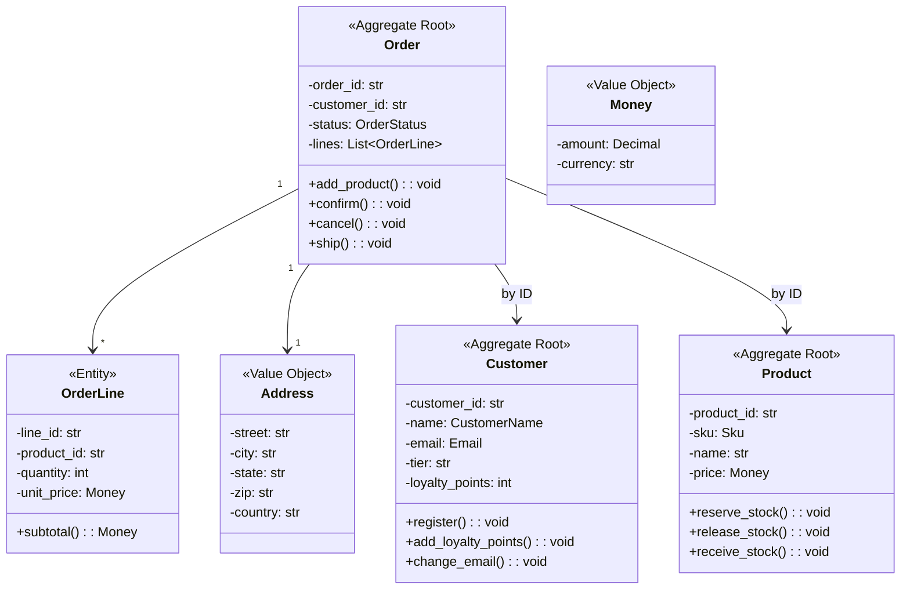

# DDD Implementation in Python

This final lesson brings together **everything** you have learned in the course: Ubiquitous Language, Bounded Contexts, Entities, Value Objects, Aggregates, Repositories, Domain Services, and Domain Events. We will build a complete e-commerce domain model in Python.

> [!NOTE]
> This is not a "toy" example. The code is production-quality and follows real-world DDD practices. Every pattern is used where it belongs. The focus is on the domain layer — infrastructure concerns (database, web framework, message broker) are abstracted behind interfaces.

## Project Structure

```
ecommerce/
  domain/
    __init__.py
    models/
      __init__.py
      customer.py
      product.py
      order.py
      payment.py
      shipping.py
    services/
      __init__.py
      pricing_service.py
      fraud_detection.py
      inventory_service.py
    events/
      __init__.py
      order_events.py
      payment_events.py
    repositories/
      __init__.py
      customer_repository.py
      order_repository.py
      product_repository.py
  application/
    __init__.py
    commands/
      place_order.py
      cancel_order.py
    queries/
      order_queries.py
    services/
      order_application_service.py
  infrastructure/
    __init__.py
    persistence/
      sqlite_order_repo.py
      sqlite_customer_repo.py
    eventbus/
      in_process_event_bus.py
```

## 1. Value Objects

```python
from dataclasses import dataclass, field
from decimal import Decimal
from typing import Optional
from datetime import datetime


@dataclass(frozen=True)
class Money:
    amount: Decimal
    currency: str

    def __post_init__(self) -> None:
        if self.amount < 0:
            raise ValueError("Money amount cannot be negative")
        if not self.currency or len(self.currency) != 3:
            raise ValueError("Currency must be a 3-letter ISO code")

    def __add__(self, other: "Money") -> "Money":
        if self.currency != other.currency:
            raise ValueError(f"Cannot add {other.currency} to {self.currency}")
        return Money(self.amount + other.amount, self.currency)

    def __sub__(self, other: "Money") -> "Money":
        if self.currency != other.currency:
            raise ValueError(f"Cannot subtract {other.currency} from {self.currency}")
        if self.amount < other.amount:
            raise ValueError("Insufficient funds")
        return Money(self.amount - other.amount, self.currency)

    def __mul__(self, multiplier: int) -> "Money":
        return Money(self.amount * multiplier, self.currency)

    def __repr__(self) -> str:
        return f"{self.currency} {self.amount:.2f}"


@dataclass(frozen=True)
class Address:
    street: str
    city: str
    state: str
    zip_code: str
    country: str

    def is_domestic(self) -> bool:
        return self.country.upper() == "US"


@dataclass(frozen=True)
class CustomerName:
    first: str
    last: str

    def __repr__(self) -> str:
        return f"{self.first} {self.last}"


@dataclass(frozen=True)
class Email:
    address: str

    def __post_init__(self) -> None:
        if "@" not in self.address or "." not in self.address:
            raise ValueError(f"Invalid email: {self.address}")


@dataclass(frozen=True)
class Sku:
    """Stock Keeping Unit — a unique product identifier."""
    value: str

    def __post_init__(self) -> None:
        if not self.value or len(self.value) < 3:
            raise ValueError("SKU must be at least 3 characters")
```

## 2. Domain Events

```python
from dataclasses import dataclass, field
from datetime import datetime
from typing import List, Optional


@dataclass
class DomainEvent:
    occurred_at: datetime = field(default_factory=datetime.now)


@dataclass
class CustomerRegistered(DomainEvent):
    customer_id: str
    email: str
    name: str


@dataclass
class ProductCreated(DomainEvent):
    product_id: str
    sku: str
    name: str


@dataclass
class OrderPlaced(DomainEvent):
    order_id: str
    customer_id: str
    total: Money
    items: List[dict]


@dataclass
class OrderConfirmed(DomainEvent):
    order_id: str
    confirmed_at: datetime = field(default_factory=datetime.now)


@dataclass
class OrderCancelled(DomainEvent):
    order_id: str
    reason: str
    cancelled_at: datetime = field(default_factory=datetime.now)


@dataclass
class PaymentCaptured(DomainEvent):
    order_id: str
    transaction_id: str
    amount: Money


@dataclass
class InventoryAdjusted(DomainEvent):
    product_id: str
    quantity_change: int
    reason: str
```

## 3. Entities and Aggregates

### Customer Aggregate

```python
from typing import List, Optional
from dataclasses import dataclass, field
import uuid


class Customer:
    """Aggregate Root for customer management."""

    def __init__(self, name: CustomerName, email: Email):
        self._id = f"CUST-{uuid.uuid4().hex[:8].upper()}"
        self._name = name
        self._email = email
        self._loyalty_points: int = 0
        self._tier: str = "standard"
        self._is_active: bool = True
        self._addresses: List[Address] = []
        self._events: List[DomainEvent] = []

    @property
    def id(self) -> str: return self._id
    @property
    def name(self) -> CustomerName: return self._name
    @property
    def email(self) -> Email: return self._email
    @property
    def tier(self) -> str: return self._tier
    @property
    def is_active(self) -> bool: return self._is_active
    @property
    def loyalty_points(self) -> int: return self._loyalty_points

    def register(self) -> None:
        self._events.append(CustomerRegistered(
            customer_id=self._id,
            email=self._email.address,
            name=str(self._name)
        ))

    def add_address(self, address: Address) -> None:
        self._addresses.append(address)

    def add_loyalty_points(self, points: int) -> None:
        if points < 0:
            raise ValueError("Points cannot be negative")
        self._loyalty_points += points
        if self._loyalty_points >= 1000:
            self._tier = "gold"
        elif self._loyalty_points >= 500:
            self._tier = "silver"

    def change_email(self, new_email: Email) -> None:
        if not self._is_active:
            raise ValueError("Cannot change email on inactive account")
        self._email = new_email

    def deactivate(self) -> None:
        self._is_active = False

    def pull_events(self) -> List[DomainEvent]:
        events = list(self._events)
        self._events.clear()
        return events

    def __eq__(self, other: object) -> bool:
        if not isinstance(other, Customer):
            return False
        return self._id == other._id

    def __hash__(self) -> int:
        return hash(self._id)
```

### Product Aggregate

```python
class Product:
    """Aggregate Root for product catalog."""

    def __init__(self, sku: Sku, name: str, price: Money, stock: int):
        self._id = f"PROD-{sku.value}"
        self._sku = sku
        self._name = name
        self._price = price
        self._stock_quantity = stock
        self._reserved_quantity: int = 0
        self._is_active: bool = True
        self._events: List[DomainEvent] = []

    @property
    def id(self) -> str: return self._id
    @property
    def sku(self) -> Sku: return self._sku
    @property
    def name(self) -> str: return self._name
    @property
    def price(self) -> Money: return self._price
    @property
    def available_stock(self) -> int:
        return self._stock_quantity - self._reserved_quantity

    def adjust_price(self, new_price: Money) -> None:
        if not self._is_active:
            raise ValueError("Cannot adjust price of inactive product")
        self._price = new_price

    def reserve_stock(self, quantity: int) -> None:
        if quantity <= 0:
            raise ValueError("Reservation quantity must be positive")
        if quantity > self.available_stock:
            raise ValueError(f"Insufficient stock. Available: {self.available_stock}")
        self._reserved_quantity += quantity

    def release_stock(self, quantity: int) -> None:
        if quantity <= 0:
            raise ValueError("Release quantity must be positive")
        if quantity > self._reserved_quantity:
            raise ValueError(f"Cannot release more than reserved: {self._reserved_quantity}")
        self._reserved_quantity -= quantity

    def receive_stock(self, quantity: int) -> None:
        if quantity <= 0:
            raise ValueError("Received quantity must be positive")
        self._stock_quantity += quantity
        self._events.append(InventoryAdjusted(
            product_id=self._id,
            quantity_change=quantity,
            reason="stock_receipt"
        ))

    def deactivate(self) -> None:
        self._is_active = False

    def pull_events(self) -> List[DomainEvent]:
        events = list(self._events)
        self._events.clear()
        return events

    def __eq__(self, other: object) -> bool:
        if not isinstance(other, Product):
            return False
        return self._id == other._id

    def __hash__(self) -> int:
        return hash(self._id)
```

### Order Aggregate

```python
class OrderLine:
    """Entity inside Order aggregate — not a root."""

    def __init__(self, product_id: str, product_name: str,
                 sku: str, quantity: int, unit_price: Money):
        self._line_id = f"LN-{uuid.uuid4().hex[:8].upper()}"
        self._product_id = product_id
        self._product_name = product_name
        self._sku = sku
        self._quantity = quantity
        self._unit_price = unit_price

    @property
    def line_id(self) -> str: return self._line_id
    @property
    def product_id(self) -> str: return self._product_id
    @property
    def product_name(self) -> str: return self._product_name
    @property
    def sku(self) -> str: return self._sku
    @property
    def quantity(self) -> int: return self._quantity
    @property
    def unit_price(self) -> Money: return self._unit_price

    def subtotal(self) -> Money:
        return self._unit_price * self._quantity


class OrderStatus(Enum):
    PENDING = "pending"
    CONFIRMED = "confirmed"
    PAID = "paid"
    SHIPPED = "shipped"
    DELIVERED = "delivered"
    CANCELLED = "cancelled"


class Order:
    """Aggregate Root for orders — the most important aggregate."""

    def __init__(self, customer_id: str, shipping_address: Address):
        self._id = f"ORD-{uuid.uuid4().hex[:8].upper()}"
        self._customer_id = customer_id
        self._shipping_address = shipping_address
        self._lines: List[OrderLine] = []
        self._status = OrderStatus.PENDING
        self._placed_at = datetime.now()
        self._events: List[DomainEvent] = []

    @property
    def id(self) -> str: return self._id
    @property
    def customer_id(self) -> str: return self._customer_id
    @property
    def status(self) -> OrderStatus: return self._status
    @property
    def lines(self) -> List[OrderLine]: return list(self._lines)
    @property
    def placed_at(self) -> datetime: return self._placed_at

    def add_product(self, product_id: str, product_name: str,
                    sku: str, quantity: int, unit_price: Money) -> None:
        if quantity <= 0:
            raise ValueError("Quantity must be positive")
        if self._status != OrderStatus.PENDING:
            raise ValueError(f"Cannot modify order in status {self._status.value}")
        self._lines.append(OrderLine(
            product_id, product_name, sku, quantity, unit_price
        ))

    def remove_product(self, product_id: str) -> None:
        if self._status != OrderStatus.PENDING:
            raise ValueError(f"Cannot modify order in status {self._status.value}")
        original = len(self._lines)
        self._lines = [l for l in self._lines if l.product_id != product_id]
        if len(self._lines) == original:
            raise ValueError(f"Product {product_id} not in order")

    @property
    def total(self) -> Money:
        if not self._lines:
            return Money(Decimal("0.00"), "USD")
        currency = self._lines[0].unit_price.currency
        total = Money(Decimal("0.00"), currency)
        for line in self._lines:
            total = total + line.subtotal()
        return total

    @property
    def item_count(self) -> int:
        return len(self._lines)

    def confirm(self) -> None:
        if self._status != OrderStatus.PENDING:
            raise ValueError(f"Cannot confirm order in status {self._status.value}")
        if not self._lines:
            raise ValueError("Cannot confirm an empty order")
        self._status = OrderStatus.CONFIRMED
        self._events.append(OrderConfirmed(order_id=self._id))

    def mark_paid(self) -> None:
        if self._status != OrderStatus.CONFIRMED:
            raise ValueError(f"Cannot mark unpaid order as paid")
        self._status = OrderStatus.PAID

    def ship(self) -> None:
        if self._status != OrderStatus.PAID:
            raise ValueError("Can only ship paid orders")
        self._status = OrderStatus.SHIPPED

    def mark_delivered(self) -> None:
        if self._status != OrderStatus.SHIPPED:
            raise ValueError("Can only mark shipped orders as delivered")
        self._status = OrderStatus.DELIVERED

    def cancel(self, reason: str) -> None:
        if self._status in (OrderStatus.SHIPPED, OrderStatus.DELIVERED):
            raise ValueError("Cannot cancel shipped or delivered order")
        self._status = OrderStatus.CANCELLED
        self._events.append(OrderCancelled(
            order_id=self._id, reason=reason
        ))

    def pull_events(self) -> List[DomainEvent]:
        events = list(self._events)
        self._events.clear()
        return events

    def __eq__(self, other: object) -> bool:
        if not isinstance(other, Order):
            return False
        return self._id == other._id

    def __hash__(self) -> int:
        return hash(self._id)
```

## 4. Repository Interfaces

```python
from typing import Protocol, List, Optional


class CustomerRepository(Protocol):
    def find_by_id(self, customer_id: str) -> Optional[Customer]: ...
    def find_by_email(self, email: str) -> Optional[Customer]: ...
    def save(self, customer: Customer) -> None: ...
    def delete(self, customer_id: str) -> None: ...


class ProductRepository(Protocol):
    def find_by_id(self, product_id: str) -> Optional[Product]: ...
    def find_by_sku(self, sku: str) -> Optional[Product]: ...
    def find_active_products(self) -> List[Product]: ...
    def save(self, product: Product) -> None: ...
    def delete(self, product_id: str) -> None: ...


class OrderRepository(Protocol):
    def find_by_id(self, order_id: str) -> Optional[Order]: ...
    def find_by_customer(self, customer_id: str) -> List[Order]: ...
    def find_pending_orders(self) -> List[Order]: ...
    def save(self, order: Order) -> None: ...
    def delete(self, order_id: str) -> None: ...
```

## 5. In-Memory Repository Implementations (for testing)

```python
class InMemoryCustomerRepository:
    def __init__(self):
        self._customers: dict[str, Customer] = {}

    def find_by_id(self, customer_id: str) -> Optional[Customer]:
        return self._customers.get(customer_id)

    def find_by_email(self, email: str) -> Optional[Customer]:
        for c in self._customers.values():
            if c.email.address == email:
                return c
        return None

    def save(self, customer: Customer) -> None:
        self._customers[customer.id] = customer

    def delete(self, customer_id: str) -> None:
        self._customers.pop(customer_id, None)


class InMemoryProductRepository:
    def __init__(self):
        self._products: dict[str, Product] = {}

    def find_by_id(self, product_id: str) -> Optional[Product]:
        return self._products.get(product_id)

    def find_by_sku(self, sku: str) -> Optional[Product]:
        for p in self._products.values():
            if p.sku.value == sku:
                return p
        return None

    def find_active_products(self) -> List[Product]:
        return [p for p in self._products.values() if p.is_active]

    def save(self, product: Product) -> None:
        self._products[product.id] = product

    def delete(self, product_id: str) -> None:
        self._products.pop(product_id, None)


class InMemoryOrderRepository:
    def __init__(self):
        self._orders: dict[str, Order] = {}

    def find_by_id(self, order_id: str) -> Optional[Order]:
        return self._orders.get(order_id)

    def find_by_customer(self, customer_id: str) -> List[Order]:
        return [o for o in self._orders.values()
                if o.customer_id == customer_id]

    def find_pending_orders(self) -> List[Order]:
        return [o for o in self._orders.values()
                if o.status == OrderStatus.PENDING]

    def save(self, order: Order) -> None:
        self._orders[order.id] = order

    def delete(self, order_id: str) -> None:
        self._orders.pop(order_id, None)
```

## 6. Domain Services

```python
class PricingService:
    """Domain Service for pricing calculations."""

    GOLD_DISCOUNT_RATE = Decimal("0.15")
    SILVER_DISCOUNT_RATE = Decimal("0.10")
    STANDARD_TAX_RATE = Decimal("0.08")

    def calculate_total(self, order: Order, customer: Customer) -> Money:
        subtotal = order.total
        discount = self._apply_tier_discount(subtotal, customer.tier)
        tax = self._calculate_tax(discount)
        return discount + tax

    def _apply_tier_discount(self, total: Money, tier: str) -> Money:
        if tier == "gold":
            discount_amount = total.amount * self.GOLD_DISCOUNT_RATE
            return Money(total.amount - discount_amount, total.currency)
        elif tier == "silver":
            discount_amount = total.amount * self.SILVER_DISCOUNT_RATE
            return Money(total.amount - discount_amount, total.currency)
        return total

    def _calculate_tax(self, amount: Money) -> Money:
        tax_amount = amount.amount * self.STANDARD_TAX_RATE
        return Money(tax_amount, amount.currency)


class FraudDetectionService:
    """Domain Service for fraud assessment."""

    def assess(self, order: Order, customer: Customer, order_repo: OrderRepository) -> dict:
        score = 0
        reasons = []

        if order.total.amount > 5000:
            score += 30
            reasons.append("Order exceeds $5,000")

        recent = order_repo.find_by_customer(customer.id)
        recent_24h = sum(1 for o in recent if
            (datetime.now() - o.placed_at).total_seconds() < 86400)
        if recent_24h >= 3:
            score += 25
            reasons.append("More than 3 orders in 24 hours")

        if customer.loyalty_points < 100 and order.total.amount > 2000:
            score += 20
            reasons.append("New customer, high value order")

        return {"risk": "high" if score > 50 else "medium" if score > 25 else "low",
                "score": score, "reasons": reasons}
```

## 7. Event Bus

```python
from typing import Callable, Type, Dict, List


class EventBus:
    def __init__(self):
        self._handlers: Dict[Type, List[Callable]] = {}

    def subscribe(self, event_type: Type, handler: Callable) -> None:
        self._handlers.setdefault(event_type, []).append(handler)

    def publish(self, event: DomainEvent) -> None:
        for handler in self._handlers.get(type(event), []):
            handler(event)
```

## 8. Application Services

```python
class PlaceOrderHandler:
    """Application service: handles the PlaceOrder use case."""

    def __init__(self, order_repo: OrderRepository, product_repo: ProductRepository,
                 customer_repo: CustomerRepository, pricing: PricingService,
                 fraud: FraudDetectionService, bus: EventBus):
        self._order_repo = order_repo
        self._product_repo = product_repo
        self._customer_repo = customer_repo
        self._pricing = pricing
        self._fraud = fraud
        self._bus = bus

    def handle(self, customer_id: str, items: List[dict],
               shipping_address: Address) -> Order:
        customer = self._customer_repo.find_by_id(customer_id)
        if not customer:
            raise ValueError(f"Customer {customer_id} not found")
        if not customer.is_active:
            raise ValueError("Customer account is inactive")

        order = Order(customer_id, shipping_address)
        for item in items:
            product = self._product_repo.find_by_id(item["product_id"])
            if not product or not product.is_active:
                raise ValueError(f"Product {item['product_id']} not available")
            product.reserve_stock(item["quantity"])
            order.add_product(
                product.id, product.name, product.sku.value,
                item["quantity"], product.price
            )
            self._product_repo.save(product)

        fraud = self._fraud.assess(order, customer, self._order_repo)
        if fraud["risk"] == "high":
            raise ValueError(f"Order rejected by fraud detection: {fraud['reasons']}")

        order.confirm()
        self._order_repo.save(order)

        for event in order.pull_events():
            self._bus.publish(event)

        self._bus.publish(OrderPlaced(
            order_id=order.id, customer_id=customer_id,
            total=order.total, items=items
        ))

        return order
```

## 9. Complete Usage Example

```python
# --- Setup ---
customer_repo = InMemoryCustomerRepository()
product_repo = InMemoryProductRepository()
order_repo = InMemoryOrderRepository()
bus = EventBus()
pricing = PricingService()
fraud = FraudDetectionService()
place_order = PlaceOrderHandler(order_repo, product_repo, customer_repo,
                                 pricing, fraud, bus)

# --- Create a customer ---
customer = Customer(
    CustomerName("Alice", "Johnson"),
    Email("alice@example.com")
)
customer.register()
customer_repo.save(customer)

# --- Create products ---
widget = Product(Sku("WDG-001"), "Widget", Money(Decimal("29.99"), "USD"), 100)
gadget = Product(Sku("GDG-001"), "Gadget", Money(Decimal("49.99"), "USD"), 50)
product_repo.save(widget)
product_repo.save(gadget)

# --- Place an order ---
address = Address("123 Main St", "Portland", "OR", "97201", "US")
order = place_order.handle(customer.id, [
    {"product_id": widget.id, "quantity": 2},
    {"product_id": gadget.id, "quantity": 1},
], address)

print(f"Order placed: {order.id}")
print(f"Status: {order.status.value}")
print(f"Total: {order.total}")
print(f"Items: {order.item_count}")
```



> [!SUCCESS]
> This complete e-commerce domain model demonstrates all DDD tactical patterns working together. The domain layer is pure Python with no framework dependencies, testable in isolation, and expressive of the business language.

## Testing the Complete Model

```python
import pytest
from decimal import Decimal

class TestEcommerceDomain:
    def test_place_order_flow(self):
        cust_repo = InMemoryCustomerRepository()
        prod_repo = InMemoryProductRepository()
        bus = EventBus()

        customer = Customer(CustomerName("Bob", "Smith"), Email("bob@test.com"))
        customer.register()
        cust_repo.save(customer)

        product = Product(Sku("TEST-001"), "Test Product",
                          Money(Decimal("10.00"), "USD"), 50)
        prod_repo.save(product)

        pricing = PricingService()
        fraud = FraudDetectionService()
        handler = PlaceOrderHandler(
            InMemoryOrderRepository(), prod_repo, cust_repo,
            pricing, fraud, bus
        )

        address = Address("1 Test St", "TestCity", "TS", "00000", "US")
        order = handler.handle(customer.id, [
            {"product_id": product.id, "quantity": 3}
        ], address)

        assert order.status == OrderStatus.CONFIRMED
        assert order.total == Money(Decimal("30.00"), "USD")
        assert order.item_count == 1

        # Stock was reserved
        assert product.available_stock == 47

    def test_cannot_place_order_inactive_customer(self):
        cust_repo = InMemoryCustomerRepository()
        prod_repo = InMemoryProductRepository()
        bus = EventBus()

        customer = Customer(CustomerName("Bad", "User"), Email("bad@test.com"))
        customer.deactivate()
        cust_repo.save(customer)

        handler = PlaceOrderHandler(
            InMemoryOrderRepository(), prod_repo, cust_repo,
            PricingService(), FraudDetectionService(), bus
        )

        with pytest.raises(ValueError, match="inactive"):
            handler.handle(customer.id, [], Address("x", "y", "z", "0", "US"))

    def test_order_lifecycle(self):
        order = Order("CUST-001", Address("A", "B", "C", "1", "US"))
        order.add_product("P1", "Widget", "WDG", 2,
                          Money(Decimal("10.00"), "USD"))

        assert order.status == OrderStatus.PENDING
        order.confirm()
        assert order.status == OrderStatus.CONFIRMED
        order.mark_paid()
        assert order.status == OrderStatus.PAID
        order.ship()
        assert order.status == OrderStatus.SHIPPED
        order.mark_delivered()
        assert order.status == OrderStatus.DELIVERED

    def test_gold_customer_discount(self):
        pricing = PricingService()
        customer = Customer(CustomerName("Gold", "Member"),
                            Email("gold@test.com"))
        customer.add_loyalty_points(1000)

        order = Order(customer.id, Address("1", "2", "3", "4", "US"))
        order.add_product("P1", "Item", "ITM", 1,
                          Money(Decimal("100.00"), "USD"))

        total = pricing.calculate_total(order, customer)
        expected = Money(Decimal("91.80"), "USD")
        assert total == expected
```

## Practice Exercises

1. **Add a new aggregate**: Design and implement a `Return` aggregate for handling product returns. Include value objects for `ReturnReason`, `RefundAmount`, and the proper lifecycle states.

2. **Implement a saga**: Create a `ReturnProcessingSaga` that coordinates across `Return`, `Order`, and `Product` aggregates when a return is initiated.

3. **Add a domain event**: When a customer reaches gold tier, publish a `CustomerTierUpgraded` event. Create a handler that sends a congratulatory notification.

4. **Extend the read model**: Create a `CustomerOrderHistoryProjection` that listens to `OrderPlaced` events and builds a denormalized read model for fast customer history queries.

5. **Implement a specification pattern**: Add a `ReturnPolicySpecification` that defines whether a product is eligible for return based on: time since purchase (must be < 30 days), product condition (must not be damaged), and customer tier (gold members get extended returns).

6. **Concurrency handling**: Add optimistic concurrency to the `Product` aggregate using a version field. Show how `reserve_stock` should fail if the product was modified by another transaction.

7. **Add a Domain Service for shipping**: Create a `ShippingCostService` that calculates shipping costs based on: weight, distance zone, shipping speed (standard/express/overnight), and customer tier.

8. **Full integration test**: Write an integration test that creates a customer, adds products to the catalog, places an order, confirms it, marks it paid, ships it, and verifies all events were published correctly.

> [!SUCCESS]
> You have completed Lesson 8 and the entire DDD & Software Architecture course. You now have a working e-commerce domain model that demonstrates every DDD tactical pattern. Apply these patterns to your own domains, always starting with Ubiquitous Language and Bounded Contexts, and letting the tactical patterns emerge from the model.
