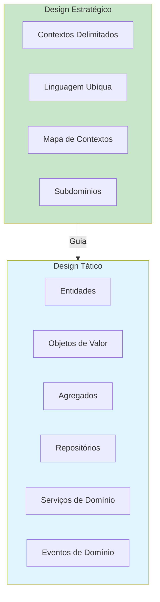
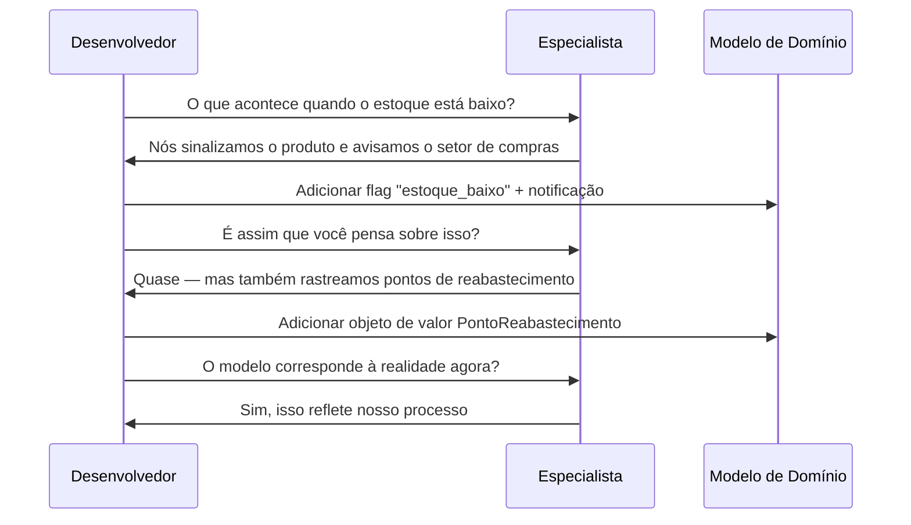
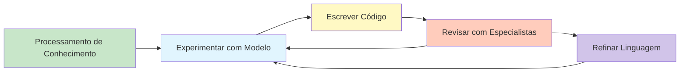

# Introdução ao Domain-Driven Design

Domain-Driven Design (DDD) é uma abordagem de desenvolvimento de software introduzida por Eric Evans em seu livro seminal de 2003 *Domain-Driven Design: Tackling Complexity in the Heart of Software*. O DDD enfatiza que a **complexidade central** da maioria dos projetos de software não está na infraestrutura técnica, mas no próprio domínio — o problema de negócio que o software visa resolver.

> [!NOTE]
> DDD não é uma tecnologia, framework ou padrão de arquitetura. É uma **filosofia e metodologia** que coloca o modelo de domínio no centro do design de software. O objetivo é criar software que reflita os modelos mentais dos especialistas do domínio.

## As Origens do DDD

O DDD surgiu da observação de projetos de software fracassados. A causa raiz quase nunca era tecnologia ruim — era **falha de comunicação** entre especialistas do domínio (pessoas de negócio) e desenvolvedores. Cada grupo falava uma língua diferente, levando a modelos que não correspondiam à realidade.

| Era | Problema | Solução |
|-----|----------|---------|
| 1990s | Métodos waterfall, requisitos rígidos | Metodologias ágeis |
| Início dos 2000 | Software empresarial complexo | DDD, Eric Evans |
| 2010s | Complexidade de sistemas distribuídos | Microsserviços + DDD |
| 2020s | Sistemas orientados a IA, eventos | DDD + Event Storming |

```python
# Sem DDD: o modelo é anêmico e desconectado do domínio
class Pedido:
    def __init__(self):
        self.id = ""
        self.status = ""
        self.itens: list = []
        self.total = 0.0

    # Apenas getters e setters — sem comportamento de domínio
    def get_id(self): return self.id
    def set_id(self, v): self.id = v

# Com DDD: o modelo captura regras de negócio e comportamento
from dataclasses import dataclass, field
from enum import Enum
from datetime import datetime

class StatusPedido(Enum):
    PENDENTE = "pendente"
    CONFIRMADO = "confirmado"
    ENVIADO = "enviado"
    ENTREGUE = "entregue"
    CANCELADO = "cancelado"

@dataclass
class LinhaPedido:
    produto_id: str
    nome_produto: str
    quantidade: int
    preco_unitario: float

    def subtotal(self) -> float:
        return self.quantidade * self.preco_unitario

@dataclass
class Pedido:
    id: str
    cliente_id: str
    linhas: list[LinhaPedido] = field(default_factory=list)
    status: StatusPedido = StatusPedido.PENDENTE
    criado_em: datetime = field(default_factory=datetime.now)

    def adicionar_linha(self, linha: LinhaPedido) -> None:
        if self.status != StatusPedido.PENDENTE:
            raise ValueError("Não é possível adicionar itens a um pedido não pendente")
        self.linhas.append(linha)

    def confirmar(self) -> None:
        if not self.linhas:
            raise ValueError("Não é possível confirmar um pedido vazio")
        self.status = StatusPedido.CONFIRMADO

    def cancelar(self) -> None:
        if self.status in (StatusPedido.ENVIADO, StatusPedido.ENTREGUE):
            raise ValueError("Não é possível cancelar pedido enviado ou entregue")
        self.status = StatusPedido.CANCELADO
```

## Design Estratégico vs Tático

O DDD é dividido em dois níveis: **estratégico** e **tático**. Ambos são essenciais, mas abordam diferentes escalas do problema.



### Design Estratégico

O DDD estratégico foca no **quadro geral**: como diferentes partes do sistema se relacionam entre si e com o domínio de negócio.

| Conceito | Descrição | Exemplo |
|----------|-----------|---------|
| Domínio | O espaço do problema de negócio | E-commerce |
| Subdomínio | Uma subárea do domínio | Estoque, Envio, Pagamentos |
| Domínio Central | O subdomínio mais valioso | Lógica de checkout |
| Domínio de Apoio | Necessário mas não central | Autenticação de usuário |
| Domínio Genérico | Domínio commoditizado | Notificações por email |
| Contexto Delimitado | Limite de um modelo específico | Contexto de Vendas, Almoxarifado |
| Linguagem Ubíqua | Linguagem comum para devs + especialistas | "Pedido", "Item", "Fatura" |

```python
# DDD Estratégico: identificando subdomínios e seus relacionamentos
class CatalogoDominio:
    """Um modelo conceitual de como os domínios são organizados."""

    DOMINIOS_CENTRAIS = {
        "vendas": "Gerenciamento de pedidos, preços, checkout",
        "estoque": "Rastreamento de estoque, pontos de reabastecimento",
    }

    DOMINIOS_APOIO = {
        "gestao_usuarios": "Contas de cliente, autenticação",
        "pagamento": "Processamento de pagamentos, reembolsos",
    }

    DOMINIOS_GENERICOS = {
        "notificacoes": "Email, SMS, push",
        "auditoria": "Rastreamento de mudanças, conformidade",
    }

    @classmethod
    def classificar(cls, nome_dominio: str) -> str:
        if nome_dominio in cls.DOMINIOS_CENTRAIS:
            return "central"
        if nome_dominio in cls.DOMINIOS_APOIO:
            return "apoio"
        return "generico"
```

### Design Tático

O DDD tático fornece **blocos de construção** para implementar o modelo de domínio dentro de um único contexto delimitado.

```python
from abc import ABC, abstractmethod
from decimal import Decimal

# Entidade: tem identidade e continuidade através do tempo
class Cliente:
    def __init__(self, cliente_id: str, nome: str, email: str):
        self._id = cliente_id
        self._nome = nome
        self._email = email
        self._pontos_fidelidade = 0

    @property
    def id(self) -> str:
        return self._id

    def adicionar_pontos_fidelidade(self, pontos: int) -> None:
        if pontos < 0:
            raise ValueError("Pontos não podem ser negativos")
        self._pontos_fidelidade += pontos

# Objeto de Valor: imutável, definido por atributos
@dataclass(frozen=True)
class Dinheiro:
    valor: Decimal
    moeda: str

    def __add__(self, other: "Dinheiro") -> "Dinheiro":
        if self.moeda != other.moeda:
            raise ValueError("Moeda incompatível")
        return Dinheiro(self.valor + other.valor, self.moeda)

# Agregado Raiz: limite de consistência
class CarrinhoCompras:
    def __init__(self, carrinho_id: str, cliente_id: str):
        self._id = carrinho_id
        self._cliente_id = cliente_id
        self._itens: list[ItemCarrinho] = []
        self._finalizado = False

    def adicionar_item(self, produto_id: str, nome: str,
                       preco: Dinheiro, quantidade: int) -> None:
        if self._finalizado:
            raise ValueError("Carrinho já foi finalizado")
        self._itens.append(ItemCarrinho(produto_id, nome, preco, quantidade))

    def finalizar(self) -> "Pedido":
        if self._finalizado:
            raise ValueError("Carrinho já foi finalizado")
        if not self._itens:
            raise ValueError("Não é possível finalizar carrinho vazio")
        self._finalizado = True
        return Pedido(self._itens)

@dataclass(frozen=True)
class ItemCarrinho:
    produto_id: str
    nome: str
    preco: Dinheiro
    quantidade: int
```

## A Mentalidade DDD

DDD requer uma mudança na forma como os desenvolvedores pensam sobre software:

1. **Exploração do modelo**: O modelo de domínio não é projetado antecipadamente — ele emerge através da colaboração
2. **Refinamento contínuo**: O modelo evolui à medida que o entendimento se aprofunda
3. **Contextos delimitados**: Diferentes partes do sistema podem ter modelos diferentes
4. **Linguagem importa**: As palavras que você usa moldam o modelo que você constrói

> [!WARNING]
> Um erro comum é pular diretamente para padrões táticos (Entidades, Agregados, Repositórios) sem fazer o trabalho de design estratégico. O DDD estratégico responde **o que** construir e **onde**; o DDD tático responde **como** construir. Ambos são necessários.

## O Papel dos Especialistas do Domínio

Especialistas do domínio são o recurso mais valioso em um projeto DDD. Eles não são apenas stakeholders — são **co-criadores** do modelo de domínio.



## Processamento de Conhecimento

Eric Evans chama o processo de modelagem DDD de **processamento de conhecimento** (knowledge crunching): destilar grandes quantidades de conhecimento do domínio em um modelo preciso e útil.

```python
# Processamento de conhecimento em ação: evoluindo de modelo simples para rico

# Fase 1: Modelo anêmico (sem DDD)
class Produto:
    def __init__(self, pid, nome, preco, estoque):
        self.pid = pid
        self.nome = nome
        self.preco = preco
        self.estoque = estoque

# Fase 2: Adicionando lógica de domínio
class Produto:
    def __init__(self, pid: str, nome: str, preco: Decimal, estoque: int):
        self._pid = pid
        self._nome = nome
        self._preco = preco
        self._estoque = estoque

    def esta_em_estoque(self) -> bool:
        return self._estoque > 0

    def pode_atender(self, quantidade: int) -> bool:
        return self._estoque >= quantidade

    def reservar(self, quantidade: int) -> None:
        if not self.pode_atender(quantidade):
            raise ValueError(f"Estoque insuficiente para {self._nome}")
        self._estoque -= quantidade
```

## Eventos de Domínio como Conhecimento

> [!TIP]
> Eventos de domínio frequentemente revelam os insights de modelagem mais importantes. Quando um especialista do domínio diz "quando isso acontece, precisamos fazer aquilo", ele está descrevendo um evento de domínio. Capture-o explicitamente no modelo.

```python
from dataclasses import dataclass
from datetime import datetime

@dataclass
class PedidoRealizado:
    pedido_id: str
    cliente_id: str
    valor_total: float
    ocorrido_em: datetime = datetime.now()

@dataclass
class EstoqueAjustado:
    produto_id: str
    quantidade_mudanca: int
    motivo: str
```

## Quando Usar DDD

| Fator | DDD é Bom | DDD é Exagero |
|-------|-----------|---------------|
| Complexidade do domínio | Alta | Baixa (CRUD simples) |
| Regras de negócio | Complexas, evolutivas | Simples, estáveis |
| Tamanho da equipe | Múltiplas equipes | Equipe pequena |
| Vida útil do sistema | Longa | Curta |

## Antipadrões Comuns

| Antipadrão | Sintoma | Correção |
|------------|---------|----------|
| Modelo de Domínio Anêmico | Classes com apenas getters/setters | Mover comportamento para o modelo |
| Design Orientado a Banco | Modelo espelha tabelas do BD | Projetar o modelo primeiro |
| Viés Técnico | Código cheira ao framework | Usar Linguagem Ubíqua |
| Grande Bola de Lama | Sem limites claros | Definir Contextos Delimitados |

## Exercícios Práticos

1. **Identifique subdomínios**: Escolha um negócio que você conhece (ex: serviço de entrega de pizza). Liste seus subdomínios central, de apoio e genérico. Justifique cada classificação.

2. **Modelo anêmico vs rico**: Transforme o seguinte modelo anêmico em um modelo DDD rico com regras de negócio:
   ```python
   class Conta:
       def __init__(self):
           self.numero = ""
           self.saldo = 0.0
           self.titular = ""
           self.congelada = False
           self.limite_cheque_especial = 0.0
   ```

3. **Entrevista com especialista**: Escreva 5 perguntas que você faria a um especialista de domínio para um sistema bancário online. Que aspectos do domínio você exploraria?

4. **Simulação de processamento de conhecimento**: Dada a regra de negócio "Um cliente não pode fazer um pedido se sua conta estiver em atraso, a menos que o total do pedido seja inferior a R$ 50 e ele seja cliente há mais de 2 anos", modele isso como código Python com regras de domínio explícitas.

5. **Estratégico vs tático**: Para cada um dos seguintes, classifique como DDD estratégico ou tático: Contexto Delimitado, Repositório, Linguagem Ubíqua, Mapa de Contextos, Entidade, Evento de Domínio, Subdomínio, Agregado.

6. **Detecção de antipadrões**: Encontre um modelo de domínio anêmico em um projeto em que você trabalha ou em um projeto open source. Documente 3 lugares onde o comportamento deveria ser movido para o modelo.

7. **Extração de eventos de domínio**: Escreva 5 eventos de domínio que ocorreriam em um sistema de e-commerce. Para cada um, liste quais informações ele carrega e quais partes do sistema reagiriam a ele.

8. **Revisão de código DDD**: Revise este código e identifique 3 violações dos princípios DDD:
   ```python
   class ServicoPedido:
       def processar(self, dados):
           db = Database.conectar()
           pedido = Pedido()
           pedido.id = dados["id"]
           pedido.status = "pendente"
           db.inserir("pedidos", pedido)
           enviar_email(dados["email"], "Pedido recebido")
           return pedido
   ```

> [!SUCCESS]
> Você completou a Lição 1. Agora você entende os fundamentos do Domain-Driven Design — suas origens, a distinção entre design estratégico e tático, e as mudanças de mentalidade necessárias. As próximas lições mergulharão profundamente em cada conceito.

## A Linguagem Ubíqua em Código

> [!SUCCESS]
> Quando o DDD é feito corretamente, o código lê como os especialistas do domínio falam. Um especialista do domínio deve ser capaz de ler seu código e validar sua lógica sem entender programação.

```python
# O código fala a linguagem do domínio

class NotificadorFaturaVencida:
    """Quando uma fatura está vencida há mais de 30 dias,
    enviamos um lembrete e aplicamos uma multa."""

    def processar(self, fatura: "Fatura") -> None:
        if fatura.esta_vencida():
            dias = fatura.dias_vencidos()
            if dias > 30:
                fatura.aplicar_multa()
                self._enviar_lembrete(fatura)
                self._levantar_alerta_credito(fatura.cliente_id)

    def _enviar_lembrete(self, fatura) -> None:
        print(f"Enviando lembrete de vencimento para fatura {fatura.id}")

    def _levantar_alerta_credito(self, cliente_id: str) -> None:
        print(f"Levantando alerta de crédito para cliente {cliente_id}")
```

## Anti-Padrões Comuns

| Anti-Padrão | Sintoma | Correção |
|-------------|---------|----------|
| Modelo de Domínio Anêmico | Classes com apenas getters/setters | Mover comportamento para o modelo |
| Design Orientado a Banco de Dados | Modelo espelha tabelas do BD | Projetar o modelo primeiro |
| Viés Técnico | Código cheira ao framework | Usar Linguagem Ubíqua |
| Grande Bola de Lama | Sem limites claros | Definir Contextos Delimitados |
| Martelo de Ouro | DDD para tudo | Usar DDD apenas para domínios complexos |

```python
# Anti-padrão: Modelo de Domínio Anêmico
class UsuarioAnemico:
    """Isto NÃO é DDD — é um contêiner de dados."""
    def __init__(self):
        self.id = None
        self.nome = None
        self.email = None
        self.status = None
        self.papel = None

# DDD: Modelo de Domínio Rico
class Usuario:
    def __init__(self, usuario_id: str, nome: str, email: str, papel: str):
        self._id = usuario_id
        self._nome = nome
        self._email = email
        self._status = "ativo"
        self._papel = papel

    def desativar(self) -> None:
        if self._papel == "admin":
            raise ValueError("Não é possível desativar usuários admin")
        self._status = "inativo"

    def alterar_email(self, novo_email: str) -> None:
        if not self._email_valido(novo_email):
            raise ValueError("Formato de email inválido")
        self._email = novo_email

    def tem_permissao(self, permissao: str) -> bool:
        permissoes = {
            "admin": ["ler", "escrever", "excluir", "gerenciar_usuarios"],
            "editor": ["ler", "escrever"],
            "visualizador": ["ler"],
        }
        return permissao in permissoes.get(self._papel, [])

    @staticmethod
    def _email_valido(email: str) -> bool:
        return "@" in email and "." in email
```

## O Processo DDD

O fluxo de trabalho típico do DDD envolve ciclos iterativos de colaboração:



1. **Processamento de Conhecimento**: Reúna-se com especialistas do domínio, faça perguntas, esboce modelos
2. **Experimentar com Modelo**: Tente diferentes abordagens de modelagem no quadro branco
3. **Escrever Código**: Implemente o modelo como software executável
4. **Revisar com Especialistas**: Mostre o código em execução para especialistas e refine
5. **Refinar Linguagem**: Atualize a Linguagem Ubíqua com base nas descobertas

## Leituras Essenciais

DDD é melhor aprendido através de uma combinação de teoria e prática. Recursos essenciais:

| Recurso | Tipo | Foco |
|---------|------|------|
| *Domain-Driven Design* (Evans, 2003) | Livro Azul | Visão geral completa do DDD |
| *Implementando Domain-Driven Design* (Vernon, 2013) | Livro Vermelho | Implementação prática |
| *Domain-Driven Design Distilled* (Vernon, 2016) | Guia de bolso | Referência rápida |
| *Event Storming* (Brandolini, 2018) | Workshop | Modelagem colaborativa |

## Quando Usar DDD

DDD é poderoso mas nem sempre apropriado. Aqui está um quadro de decisão:

| Fator | DDD é Bom | DDD é Exagero |
|-------|-----------|---------------|
| Complexidade do domínio | Alta | Baixa (CRUD simples) |
| Regras de negócio | Complexas, evolutivas | Simples, estáveis |
| Tamanho da equipe | Múltiplas equipes | Equipe pequena |
| Vida útil do sistema | Longa | Curta |
| Necessidade de colaboração | Alta | Baixa |

> [!NOTE]
> DDD é um **investimento**. O custo inicial de modelagem com especialistas do domínio é significativo, mas compensa quando o domínio é complexo e o sistema evoluirá por anos.
