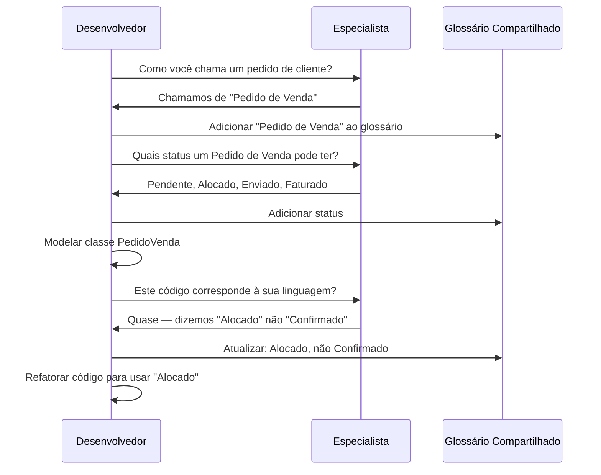

# Linguagem Ubíqua

A Linguagem Ubíqua é a pedra angular do Domain-Driven Design. É uma **linguagem compartilhada e estruturada** que desenvolvedores e especialistas do domínio usam juntos para descrever o domínio. Cada termo nesta linguagem tem um significado preciso e inequívoco — e esse significado é refletido diretamente no código.

> [!NOTE]
> O termo "Linguagem Ubíqua" foi cunhado por Eric Evans em seu livro DDD. A percepção fundamental: a maioria das falhas de software é causada não por problemas técnicos, mas por **erros de tradução** entre equipes de negócio e técnicas. A Linguagem Ubíqua elimina essa tradução.

## O Problema da Tradução

No desenvolvimento de software tradicional, os requisitos passam por múltiplas traduções:

```mermaid
flowchart LR
    A[Especialista do Domínio] -->|"Linguagem Natural\n(imprecisa)"| B[Analista de Negócios]
    B -->|"Documento de Requisitos\n(ambíguo)"| C[Líder Técnico]
    C -->|"Especificação Técnica\n(com perdas)"| D[Desenvolvedor]
    D -->|"Código\n(corresponde?)"| E[Software]
    A -.->|"Feedback\n(caro)" E

    style A fill:#c8e6c9
    style D fill:#ffccbc
    style E fill:#e1f5fe
```

Cada etapa de tradução introduz ambiguidade, perda de significado e potenciais erros. O desenvolvedor escreve código baseado em um documento que já era uma aproximação do que o especialista disse.

> [!WARNING]
> Sem Linguagem Ubíqua, você acaba com dois modelos: o modelo de negócio (na cabeça dos especialistas) e o modelo de software (no código). Esses dois modelos **sempre divergem** com o tempo, tornando o software cada vez mais difícil de manter e evoluir.

## Como é uma Linguagem Ubíqua

Uma Linguagem Ubíqua consiste em:

1. **Substantivos**: Conceitos do domínio (Pedido, Fatura, Cliente, Produto)
2. **Verbos**: Ações do domínio (fazer pedido, cancelar fatura, arquivar produto)
3. **Regras**: Invariantes de negócio (não pode enviar pedidos não pagos)
4. **Eventos**: Ocorrências do domínio (PedidoRealizado, PagamentoRecebido)

```python
# Sem Linguagem Ubíqua: termos técnicos dominam
class EntidadeDados:
    def __init__(self):
        self.pk = 0
        self.fk_cliente = 0
        self.dt = ""
        self.st = ""
        self.vlr = 0.0

    def proc(self):
        if self.st == "P" and self.vlr > 0:
            self.st = "C"

# Com Linguagem Ubíqua: termos do domínio em todo lugar
from dataclasses import dataclass
from enum import Enum
from datetime import datetime

class StatusPedido(Enum):
    PENDENTE = "pendente"
    CONFIRMADO = "confirmado"
    EM_TRANSITO = "em_transito"
    ENTREGUE = "entregue"

@dataclass
class Pedido:
    pedido_id: str
    cliente_id: str
    realizado_em: datetime
    status: StatusPedido
    valor_total: float

    def confirmar(self) -> None:
        if self.status != StatusPedido.PENDENTE:
            raise ValueError("Apenas pedidos pendentes podem ser confirmados")
        self.status = StatusPedido.CONFIRMADO
```

## Construindo uma Linguagem Ubíqua

Construir uma Linguagem Ubíqua é um processo **iterativo e colaborativo**. Não é algo que uma única pessoa cria e documenta. Ela emerge da conversa.



### Passo 1: Ouça os Especialistas do Domínio

Registre as palavras e frases exatas que os especialistas do domínio usam. Evite traduzir para jargão técnico.

```python
# Especialista diz:
# "Quando um pedido de venda é alocado, reservamos o estoque."

# Desenvolvedor captura isso diretamente no código:
class PedidoVenda:
    def alocar(self, armazem_id: str) -> None:
        """Reservar estoque quando um pedido de venda é alocado."""
        if self.status != StatusPedidoVenda.PENDENTE:
            raise ValueError("Só é possível alocar pedidos pendentes")
        self._armazem_id = armazem_id
        self.status = StatusPedidoVenda.ALOCADO

    @property
    def esta_alocado(self) -> bool:
        return self.status == StatusPedidoVenda.ALOCADO
```

### Passo 2: Crie um Glossário Compartilhado

Um glossário garante que todos usem as mesmas palavras para significar as mesmas coisas.

| Termo | Definição | Sinônimos a Evitar |
|-------|-----------|-------------------|
| Pedido de Venda | Solicitação de cliente para comprar produtos | Pedido, ticket, requisição |
| Alocar | Reservar inventário para um pedido de venda | Confirmar, comprometer, reservar |
| Lista de Separação | Documento listando itens para retirar do armazém | Lista de embalagem, folha de retirada |

```python
from typing import NewType

IdPedidoVenda = NewType("IdPedidoVenda", str)
IdArmazem = NewType("IdArmazem", str)
NumeroListaSeparacao = NewType("NumeroListaSeparacao", str)
```

### Passo 3: Use a Linguagem em Todos os Artefatos

A Linguagem Ubíqua deve aparecer em:
- **Código**: nomes de classes, métodos, variáveis
- **Testes**: descrições de teste, dados de teste
- **Documentação**: README, docs de API, docs de arquitetura
- **Conversas**: dailys, planejamento, revisões

```python
# Testes falam a Linguagem Ubíqua
def test_um_pedido_de_venda_pode_ser_alocado_quando_pendente():
    pedido = PedidoVenda("PV-001", cliente_id="CLI-42")
    armazem = Armazem("ARM-LESTE")

    pedido.alocar(armazem.id)

    assert pedido.esta_alocado
    assert pedido.armazem_id == "ARM-LESTE"

def test_um_pedido_de_venda_nao_pode_ser_alocado_duas_vezes():
    pedido = PedidoVenda("PV-001", cliente_id="CLI-42")
    pedido.alocar("ARM-LESTE")

    with raises(ValueError, match="já alocado"):
        pedido.alocar("ARM-OESTE")
```

## Refinando a Linguagem

Uma Linguagem Ubíqua nunca está "pronta." Ela evolui à medida que o entendimento se aprofunda. Sempre que um termo se torna ambíguo ou novos conceitos surgem, a linguagem deve ser refinada.

```python
# Versão inicial: "Pedido" era suficiente
class Pedido:
    def fazer(self): ...
    def cancelar(self): ...

# Mais tarde, a equipe percebeu que "Pedido de Venda" e "Pedido de Compra"
# são conceitos diferentes com ciclos de vida diferentes

class PedidoVenda:
    """Um pedido feito por um cliente."""
    def fazer(self): ...
    def cancelar(self): ...
    def despachar(self): ...

class PedidoCompra:
    """Um pedido feito a um fornecedor."""
    def fazer(self): ...
    def receber(self): ...
    def fechar(self): ...
```

### Sinais de que a Linguagem Precisa de Refinamento

| Sinal | Exemplo | Correção |
|-------|---------|----------|
| Termo ambíguo | "Pedido" pode ser venda ou compra | Criar termos distintos |
| Termo sobrecarregado | "Status" significa coisas diferentes | Usar tipos de status específicos |
| Jargão de desenvolvedor | "Persistir", "Executar", "Processar" | Substituir por termos do domínio |
| Conceito não dito | Especialistas dizem "você sabe, do jeito usual" | Tornar o implícito explícito |

## A Linguagem e os Contextos Delimitados

Cada Contexto Delimitado tem sua própria Linguagem Ubíqua. A mesma palavra pode significar coisas diferentes em contextos diferentes.

```python
# "Cliente" significa coisas diferentes em diferentes contextos

# Contexto de Vendas
class Cliente:
    """Representa um comprador com histórico de compras."""
    def __init__(self, cliente_id: str, nome: str, limite_credito: float):
        self._id = cliente_id
        self._nome = nome
        self._limite_credito = limite_credito

    def pode_fazer_pedido(self, total_pedido: float) -> bool:
        return total_pedido <= self._limite_credito

# Contexto de Suporte
class Cliente:
    """Representa uma pessoa buscando ajuda com um produto."""
    def __init__(self, cliente_id: str, nome: str, nivel: str):
        self._id = cliente_id
        self._nome = nome
        self._nivel = nivel

    @property
    def prioridade(self) -> int:
        return {"standard": 1, "premium": 2, "enterprise": 3}.get(self._nivel, 0)
```

## Exercícios Práticos

1. **Construa um glossário**: Escolha um domínio que você conhece (ex: gerenciamento de biblioteca, reserva de hotel, agendamento hospitalar). Crie um glossário de 10 termos com definições e sinônimos a evitar.

2. **Traduza para Linguagem Ubíqua**: Reescreva o seguinte código usando Linguagem Ubíqua:
   ```python
   def processar_dados(x):
       db = get_db()
       r = db.query("SELECT * FROM tbl_ped WHERE st = 'P'")
       for linha in r:
           linha.st = 'A'
           db.atualizar(linha)
           notificar(linha.c_id, "Seu pedido está pronto")
   ```

3. **Revise o código para linguagem**: Revise este código por violações de Linguagem Ubíqua:
   ```python
   class GerenciadorEntidade:
       def __init__(self):
           self._itens = []

       def adicionar_item(self, obj):
           self._itens.append(obj)

       def get_ativos(self):
           return [x for x in self._itens if x.flg == 1]
   ```

4. **Simulação de Event Storming**: Liste 8 eventos de domínio para um sistema de gerenciamento de restaurante. Escreva cada evento como um dataclass Python com campos apropriados.

5. **Linguagem entre contextos**: O termo "Paciente" aparece no Contexto de Agendamento e no Contexto de Prontuário Médico de um hospital. Defina a classe Paciente para cada contexto, destacando os diferentes atributos e comportamentos.

6. **Refine a linguagem**: Uma equipe usa "Item" para significar tanto "item do menu" quanto "linha do pedido". Crie duas classes distintas com nomes apropriados e diferencie seus comportamentos.

7. **Transcrição de entrevista com especialista**: Escreva uma entrevista simulada entre um desenvolvedor e um gerente de recepção de hotel. Extraia 5 termos do domínio da conversa e mostre como eles se tornariam código.

8. **Exercício de tradução**: Encontre 3 lugares em um projeto em que você trabalha onde o código usa linguagem técnica onde a linguagem de domínio deveria ser usada (ex: "executar" em vez de "fazer pedido", "dados" em vez de "fatura").

> [!SUCCESS]
> Você completou a Lição 2. A Linguagem Ubíqua é a fundação do DDD — sem ela, contextos delimitados, agregados e todos os outros padrões perdem seu poder. Mantenha a linguagem viva em cada conversa e em cada linha de código.

## A Linguagem e os Contextos Delimitados

Cada Contexto Delimitado tem sua própria Linguagem Ubíqua. A mesma palavra pode significar coisas diferentes em contextos diferentes.

```python
# "Cliente" significa coisas diferentes em diferentes contextos

# Contexto de Vendas
class Cliente:
    """Representa um comprador com histórico de compras."""
    def __init__(self, cliente_id: str, nome: str, limite_credito: float):
        self._id = cliente_id
        self._nome = nome
        self._limite_credito = limite_credito
        self._valor_acumulado = 0.0

    def registrar_compra(self, valor: float) -> None:
        self._valor_acumulado += valor

    def pode_fazer_pedido(self, total_pedido: float) -> bool:
        return total_pedido <= self._limite_credito

# Contexto de Suporte
class Cliente:
    """Representa uma pessoa buscando ajuda com um produto."""
    def __init__(self, cliente_id: str, nome: str, nivel: str):
        self._id = cliente_id
        self._nome = nome
        self._nivel = nivel  # "standard", "premium", "enterprise"

    @property
    def prioridade(self) -> int:
        return {"standard": 1, "premium": 2, "enterprise": 3}.get(self._nivel, 0)

    def escalar(self) -> None:
        if self._nivel == "enterprise":
            self._atribuir_agente_senior()

# Contexto de Cobrança
class Cliente:
    """Representa um devedor responsável por pagamentos."""
    def __init__(self, cliente_id: str, nome: str):
        self._id = cliente_id
        self._nome = nome
        self._saldo = 0.0
        self._esta_inadimplente = False

    def aplicar_cobranca(self, valor: float) -> None:
        self._saldo += valor

    def marcar_inadimplente(self) -> None:
        self._esta_inadimplente = True
```

## Linguagem Ubíqua e Modelagem

A linguagem molda diretamente o modelo. Se a linguagem mudar, o modelo deve mudar. Se o modelo divergir da linguagem, o modelo — não a linguagem — deve ser corrigido.

```python
# Exemplo: evolução da linguagem -> evolução do modelo

# Fase 1: Especialistas dizem "Usuário"
class Usuario:
    def login(self): ...
    def alterar_senha(self): ...

# Fase 2: Especialistas distinguem "Cliente" de "Funcionário"
class Cliente:
    def fazer_pedido(self): ...
    def ver_historico_pedidos(self): ...

class Funcionario:
    def processar_pedido(self): ...
    def atualizar_estoque(self): ...

# Fase 3: Especialistas identificam "Cliente Premium" com tratamento VIP
class ClientePremium(Cliente):
    @property
    def frete_gratis(self) -> bool:
        return True

    def solicitar_concierge(self, solicitacao: str) -> None:
        self._atribuir_equipe_vip()
```

## Armadilhas Comuns

| Armadilha | Descrição | Prevenção |
|-----------|-----------|-----------|
| Glossário abandonado | Glossário existe mas nunca é atualizado | Manter glossário versionado com código |
| Especialista não envolvido | Linguagem definida sem especialistas | Incluir especialistas em todas as sessões |
| Deriva linguagem vs código | Código usa termos antigos | Refatorar código agressivamente |
| Muito genérico | Termos como "item", "dados", "info" | Usar termos específicos e concretos |
| Silos de equipe | Equipes desenvolvem linguagens diferentes | Sessões de mapeamento entre equipes |

> [!WARNING]
> O pior destino para uma Linguagem Ubíqua é tornar-se um **documento que ninguém lê**. A linguagem deve viver no código, nas conversas e no trabalho diário — não em um PDF que foi escrito uma vez e esquecido.

## Medindo a Qualidade da Linguagem Ubíqua

Como saber se sua Linguagem Ubíqua está saudável? Aqui estão alguns indicadores:

| Métrica | Saudável | Não Saudável |
|---------|----------|--------------|
| Revisões de código | "Este nome de método não corresponde ao termo que usamos" | "Esta variável deveria ser renomeada" |
| Tempo de onboarding | Novos devs entendem o domínio em dias | Novos devs precisam de semanas de explicação |
| Envolvimento do especialista | Especialistas podem ler o código | Especialistas precisam de um tradutor |
| Mudanças na linguagem | Refinamentos frequentes | Nunca discutida |
| Consistência de termos | Mesmo termo = mesmo conceito | Mesmo termo usado para conceitos diferentes |

```python
# Linguagem Ubíqua saudável: especialista do domínio poderia ler isto
class AssinaturaPremium:
    """Uma assinatura com benefícios VIP."""

    def __init__(self, assinante: "Assinante", plano: "Plano"):
        self._assinante = assinante
        self._plano = plano
        self._ativa = True
        self._beneficios: list[str] = ["suporte_prioritario", "conteudo_exclusivo"]

    def renovar(self, metodo_pagamento: str) -> None:
        if not self._ativa:
            raise ValueError("Não é possível renovar uma assinatura inativa")
        self._plano.renovar()
        self._assinante.cobrar(metodo_pagamento, self._plano.preco)

    def fazer_upgrade(self, novo_plano: "Plano") -> None:
        if novo_plano.preco < self._plano.preco:
            raise ValueError("Upgrade deve ser para um plano mais caro")
        self._plano = novo_plano
```

## O Papel dos Eventos na Linguagem

Eventos de domínio são uma parte crucial da Linguagem Ubíqua porque capturam coisas que aconteceram — e os especialistas do domínio sempre descrevem processos em termos de eventos.

```python
# Especialista diz: "Quando um cliente faz check-in, emitimos o cartão-chave"
# Isso gera dois eventos:

@dataclass
class CheckinRealizado:
    reserva_id: str
    hospede_nome: str
    quarto_numero: str
    ocorrido_em: datetime = field(default_factory=datetime.now)

@dataclass
class CartaoChaveEmitido:
    reserva_id: str
    quarto_numero: str
    quantidade_chaves: int

# O código reflete exatamente a linguagem do especialista
class ServicoCheckin:
    def realizar_checkin(self, reserva: "Reserva") -> None:
        reserva.marcar_checkin()
        self._emitir_cartao_chave(reserva)
        self._barramento.publicar(CheckinRealizado(
            reserva_id=reserva.id,
            hospede_nome=reserva.hospede.nome,
            quarto_numero=reserva.quarto.numero
        ))
```

## Exercícios Adicionais

9. **Refine a linguagem em código existente**: Encontre uma classe em seu código atual chamada "Manager", "Handler", "Processor" ou "Service" (genérico). Renomeie-a para um termo do domínio e refatore os métodos correspondentes.

10. **Mapeamento de linguagem entre contextos**: Em uma clínica médica, o termo "Paciente" existe no contexto de Agendamento e no contexto de Prontuário. Liste 3 atributos que existem em cada contexto e 1 comportamento específico de cada um.

> [!SUCCESS]
> Você completou a Lição 2. Lembre-se: a Linguagem Ubíqua é a fundação sobre a qual todo o DDD é construído. Invista tempo nela — o retorno é imenso.
