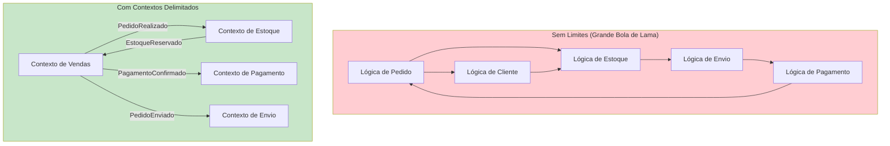
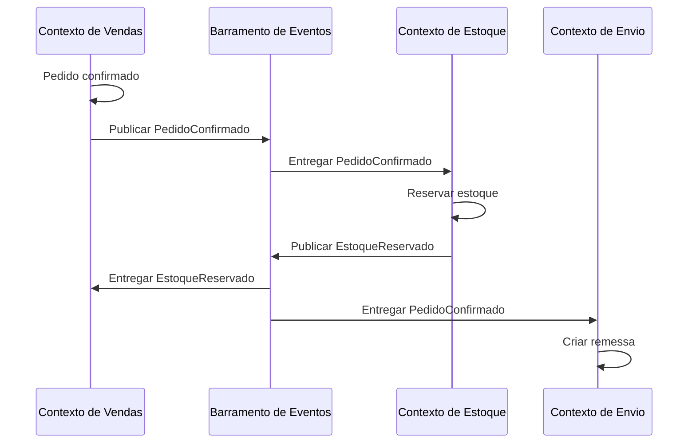

# Contextos Delimitados

Um Contexto Delimitado é um **limite semântico** dentro do qual um determinado modelo de domínio se aplica. Dentro do limite, todos os termos da Linguagem Ubíqua têm significados precisos e consistentes. Fora do limite, diferentes termos ou diferentes significados podem se aplicar.

> [!NOTE]
> O termo "Contexto Delimitado" é frequentemente mal compreendido. Não é o mesmo que microsserviço, módulo ou namespace — embora frequentemente mapeie para um deles. Um Contexto Delimitado é antes de tudo um **limite linguístico**. O código e os serviços seguem a partir desse limite.

## Por que os Limites Importam

Sem limites explícitos, os modelos de domínio se misturam. Os termos se tornam ambíguos, as responsabilidades se confundem e o sistema se torna uma "Grande Bola de Lama."



### O que um Limite Contém

Dentro de um Contexto Delimitado, você tem um **modelo completo e autocontido**:

1. **Entidades e Objetos de Valor** específicos desse contexto
2. **Agregados** que impõem limites de consistência
3. **Eventos de Domínio** que representam ocorrências
4. **Repositórios** para persistência
5. **Serviços de Domínio** para operações que não cabem naturalmente em entidades

```python
# Modelo completo do Contexto de Vendas — independente
from dataclasses import dataclass, field
from enum import Enum
from datetime import datetime
from typing import Protocol

class StatusPedidoVenda(Enum):
    PENDENTE = "pendente"
    CONFIRMADO = "confirmado"
    EM_TRANSITO = "em_transito"
    ENTREGUE = "entregue"

@dataclass
class LinhaPedidoVenda:
    produto_id: str
    nome_produto: str
    quantidade: int
    preco_unitario: float

    def subtotal(self) -> float:
        return self.quantidade * self.preco_unitario

@dataclass
class PedidoVenda:
    pedido_id: str
    cliente_id: str
    linhas: list[LinhaPedidoVenda] = field(default_factory=list)
    status: StatusPedidoVenda = StatusPedidoVenda.PENDENTE
    criado_em: datetime = field(default_factory=datetime.now)

    def adicionar_linha(self, linha: LinhaPedidoVenda) -> None:
        if self.status != StatusPedidoVenda.PENDENTE:
            raise ValueError("Pedido já confirmado")
        self.linhas.append(linha)

    def confirmar(self) -> None:
        if not self.linhas:
            raise ValueError("Não é possível confirmar pedido vazio")
        self.status = StatusPedidoVenda.CONFIRMADO
```

## Mapeamento de Contextos

Mapeamento de Contextos é a prática de **identificar e documentar os relacionamentos** entre Contextos Delimitados. Cada relacionamento de contexto tem um padrão que descreve como os dois contextos se integram.

### Padrões de Integração

| Padrão | Descrição | Acoplamento | Quando Usar |
|--------|-----------|-------------|-------------|
| Parceria | Dois contextos cooperam na integração | Alto | Duas equipes trabalhando próximas |
| Kernel Compartilhado | Subconjunto compartilhado do modelo | Alto | Domínios sobrepostos |
| Cliente/Fornecedor | Upstream fornece, downstream consome | Baixo | Produtor/consumidor padrão |
| Conformista | Downstream se conforma ao upstream | Baixo | Sem controle sobre upstream |
| Camada Anticorrupção | Camada de tradução protege downstream | Muito Baixo | Evitar vazamento upstream |
| Serviço Aberto | Upstream fornece protocolo de integração | Muito Baixo | Múltiplos consumidores downstream |
| Idioma Publicado | Formato de integração documentado e versionado | Muito Baixo | API pública |
| Caminhos Separados | Sem integração; cada contexto opera independente | Nenhum | Funcionalidade independente |

## Camada Anticorrupção (ACL)

A Camada Anticorrupção é um dos padrões mais importantes. Ela **impede que um contexto downstream seja poluído** pelo modelo de um contexto upstream.

```python
# O sistema upstream tem seu próprio modelo — não podemos mudá-lo
# "Pedido" do upstream (sistema legado):

class PedidoLegado:
    """Vem do mainframe. Não podemos modificar."""
    def __init__(self):
        self.ped_no = ""
        self.cli_id = ""
        self.ped_dt = ""
        self.ln_itens: list[LinhaItemLegado] = []
        self.ped_st = ""

class LinhaItemLegado:
    def __init__(self):
        self.itm_id = ""
        self.itm_qtd = 0
        self.itm_pr = 0.0
        self.itm_st = ""

# Camada Anticorrupção: traduz Legado -> Contexto de Vendas

class TradutorPedidoLegado:
    """Protege nosso Contexto de Vendas do modelo legado."""

    def para_pedido_venda(self, legado: PedidoLegado) -> "PedidoVenda":
        pedido = PedidoVenda(
            pedido_id=legado.ped_no,
            cliente_id=legado.cli_id,
            status=self._traduzir_status(legado.ped_st),
        )
        for item in legado.ln_itens:
            pedido.adicionar_linha(LinhaPedidoVenda(
                produto_id=item.itm_id,
                quantidade=item.itm_qtd,
                preco_unitario=item.itm_pr,
            ))
        return pedido

    def _traduzir_status(self, status_legado: str) -> StatusPedidoVenda:
        mapeamento = {
            "N": StatusPedidoVenda.PENDENTE,
            "C": StatusPedidoVenda.CONFIRMADO,
            "S": StatusPedidoVenda.EM_TRANSITO,
            "E": StatusPedidoVenda.ENTREGUE,
        }
        return mapeamento.get(status_legado, StatusPedidoVenda.PENDENTE)
```

> [!WARNING]
> Sem uma ACL, mudanças no modelo upstream podem se propagar por todo o seu sistema. Uma renomeação de campo em um sistema legado nunca deve exigir mudanças na sua lógica de domínio. A ACL absorve essas mudanças.

## Serviço Aberto (Open-Host Service)

O Serviço Aberto define um **protocolo publicado** que contextos downstream usam para se comunicar com o contexto upstream. O upstream se compromete a manter este protocolo.

```python
# Contexto de Vendas publica um protocolo de Serviço Aberto
from typing import Protocol
from dataclasses import dataclass

@dataclass
class EventoPedidoCriado:
    pedido_id: str
    cliente_id: str
    itens: list[dict]
    total: float
    versao: int = 1

class NotificadorPedidoVenda(Protocol):
    """Protocolo publicado para consumidores downstream."""

    def ao_pedido_criado(self, evento: EventoPedidoCriado) -> None:
        """Chamado quando um novo pedido é criado."""

    def ao_pedido_cancelado(self, pedido_id: str, motivo: str) -> None:
        """Chamado quando um pedido é cancelado."""

# Downstream: Contexto de Estoque implementa o protocolo
class ManipuladorPedidoEstoque:
    """Manipula eventos de pedido para reserva de estoque."""

    def ao_pedido_criado(self, evento: EventoPedidoCriado) -> None:
        for item in evento.itens:
            self._reservar_estoque(item["produto_id"], item["quantidade"])

    def ao_pedido_cancelado(self, pedido_id: str, motivo: str) -> None:
        self._liberar_reservas(pedido_id)

    def _reservar_estoque(self, produto_id: str, quantidade: int) -> None:
        print(f"Reservando {quantidade} de {produto_id}")

    def _liberar_reservas(self, pedido_id: str) -> None:
        print(f"Liberando reservas para {pedido_id}")
```

## Definindo Limites de Contexto

Como decidir onde um contexto termina e outro começa? Estas são as heurísticas mais comuns:

| Heurística | Pergunta | Exemplo de Limite |
|------------|----------|-------------------|
| Linguagem diferente | Especialistas usam termos diferentes? | "Pedido" em Vendas vs "Trabalho" em Manufatura |
| Ciclo de vida diferente | O conceito tem ciclo de vida diferente? | Registro do cliente vs Ticket de suporte |
| Propriedade da equipe | Uma equipe diferente é dona? | Equipe de checkout vs Equipe de recomendação |
| Frequência de mudança | Muda em taxas diferentes? | Catálogo (estável) vs Preços (dinâmico) |
| Independência de deploy | Pode ser implantado separadamente? | API mobile vs Painel admin |

```python
# Exemplo: mesma empresa, contextos diferentes para "Cliente"

# 1. Contexto de Vendas — Cliente como comprador
class Comprador:
    def __init__(self, comprador_id: str, email: str, limite_credito: float):
        self._id = comprador_id
        self._email = email
        self._limite_credito = limite_credito

    def fazer_pedido(self, total_pedido: float) -> bool:
        return total_pedido <= self._limite_credito

# 2. Contexto de Marketing — Cliente como alvo
class Lead:
    def __init__(self, lead_id: str, email: str, pontuacao: int):
        self._id = lead_id
        self._email = email
        self._pontuacao = pontuacao

    def nutrir(self, campanha: str) -> None:
        print(f"Enviando campanha '{campanha}' para lead {self._id}")

# 3. Contexto de Suporte — Cliente como criador de ticket
class Solicitante:
    def __init__(self, solicitante_id: str, nome: str, nivel: str):
        self._id = solicitante_id
        self._nome = nome
        self._nivel = nivel

    @property
    def sla_minutos(self) -> int:
        return {"standard": 480, "premium": 120, "enterprise": 30}.get(self._nivel, 1440)
```

## Integrando Contextos Delimitados

A integração acontece através de **tradução no limite**. Os mecanismos de integração mais comuns:



## Exercícios Práticos

1. **Identifique limites**: Para um sistema de gerenciamento hospitalar, liste pelo menos 5 Contextos Delimitados. Para cada um, descreva a Linguagem Ubíqua e quais entidades ele contém.

2. **Mapa de contextos**: Desenhe um mapa de contextos (como texto) para um marketplace online. Inclua pelo menos 6 contextos e rotule os padrões de relacionamento entre eles.

3. **Construa uma ACL**: Um sistema CRM legado tem um modelo `Cliente` com campos `cli_id`, `cli_nome`, `cli_email`, `cli_stat` (A=ativo, I=inativo). Construa uma Camada Anticorrupção que traduza isso para um modelo `Conta` do Contexto de Vendas moderno com nomes e tipos de campo apropriados.

4. **Contrato de parceria**: Duas equipes — Pagamentos e Detecção de Fraude — precisam se integrar. Defina o protocolo compartilhado (como interfaces Python) que ambas as equipes concordam.

5. **Decisão de limite de contexto**: Uma empresa tem "Catálogo de Produtos" e "Estratégia de Preços". Atualmente são um contexto. Liste 3 razões pelas quais eles deveriam ser separados e descreva o padrão de integração que deveriam usar.

6. **Design de Kernel Compartilhado**: Identifique um conceito que poderia ser compartilhado entre os Contextos de Vendas e Envio de um sistema de e-commerce. Projete o objeto de valor ou entidade compartilhada com pelo menos 3 campos e 2 métodos.

7. **Justificativa de Caminhos Separados**: Descreva um cenário onde dois contextos na mesma empresa deveriam operar em modo "Caminhos Separados". Explique por que a integração seria prejudicial.

8. **Refatoração de contexto monolítico**: A seguinte classe é de um contexto monolítico. Divida-a em pelo menos 3 Contextos Delimitados e mostre como eles se comunicam:
   ```python
   class GerenciadorPedidos:
       def criar_pedido(self, cliente, itens): ...
       def processar_pagamento(self, pedido, dados_cartao): ...
       def reservar_estoque(self, pedido): ...
       def agendar_entrega(self, pedido): ...
       def gerar_fatura(self, pedido): ...
       def enviar_email_confirmacao(self, pedido): ...
   ```

> [!SUCCESS]
> Você completou a Lição 3. Contextos Delimitados são a espinha dorsal estratégica do DDD. Eles definem onde seus modelos vivem e como se relacionam entre si. Entender os padrões de mapeamento de contexto é essencial para projetar sistemas que podem evoluir independentemente.

## Mapa de Contextos como Documentação Viva

Um mapa de contextos deve ser mantido atualizado à medida que o sistema evolui. É um **documento vivo** que mostra o estado atual dos relacionamentos entre contextos.

```python
# Um mapa de contextos expresso como código
from dataclasses import dataclass, field
from enum import Enum

class TipoRelacionamento(Enum):
    PARCERIA = "parceria"
    KERNEL_COMPARTILHADO = "kernel_compartilhado"
    CLIENTE_FORNECEDOR = "cliente_fornecedor"
    CONFORMISTA = "conformista"
    ACL = "camada_anticorrupcao"
    SERVICO_ABERTO = "servico_aberto"
    IDIOMA_PUBLICADO = "idioma_publicado"
    CAMINHOS_SEPARADOS = "caminhos_separados"

@dataclass
class RelacionamentoContexto:
    upstream: str
    downstream: str
    padrao: TipoRelacionamento
    notas: str = ""

@dataclass
class MapaContextos:
    contextos: list[str] = field(default_factory=list)
    relacionamentos: list[RelacionamentoContexto] = field(default_factory=list)

    def adicionar_relacionamento(
        self, upstream: str, downstream: str,
        padrao: TipoRelacionamento, notas: str = ""
    ) -> None:
        self.relacionamentos.append(
            RelacionamentoContexto(upstream, downstream, padrao, notas)
        )

# Definir o mapa de contextos
mapa = MapaContextos(
    contextos=["Vendas", "Estoque", "Envio", "Cobranca", "Marketing"]
)
mapa.adicionar_relacionamento("Vendas", "Estoque", TipoRelacionamento.CLIENTE_FORNECEDOR,
    "Vendas publica PedidoConfirmado, Estoque reserva estoque")
mapa.adicionar_relacionamento("Vendas", "Envio", TipoRelacionamento.CLIENTE_FORNECEDOR,
    "Vendas publica PedidoEnviado")
mapa.adicionar_relacionamento("Vendas", "Cobranca", TipoRelacionamento.PARCERIA,
    "Definem juntos o formato InvoiceData")
mapa.adicionar_relacionamento("Estoque", "Envio", TipoRelacionamento.KERNEL_COMPARTILHADO,
    "Compartilham objetos de valor Endereco e Dinheiro")
mapa.adicionar_relacionamento("Marketing", None, TipoRelacionamento.CAMINHOS_SEPARADOS,
    "Marketing opera independentemente")
```

> [!TIP]
> Mantenha seu mapa de contextos no controle de versão junto com seu código. Quando um novo membro da equipe entra, o mapa de contextos é a primeira coisa que ele deve estudar para entender a paisagem do sistema.

## Os Perigos do Contexto Monolítico

Evite a tentação de colocar tudo em um Contexto Delimitado gigante. Os sintomas de um contexto monolítico incluem:

| Sintoma | Descrição | Correção |
|---------|-----------|----------|
| Modelo gigante | Centenas de entidades em um contexto | Dividir por subdomínio |
| Gargalos de equipe | Múltiplas equipes tocando o mesmo código | Dividir por propriedade |
| Builds lentos | Longos tempos de compilação/deploy | Dividir para deploys independentes |
| Termos ambíguos | Mesma palavra, significados diferentes | Dividir por limite linguístico |
| Conflitos de merge | Conflitos frequentes no git | Dividir por propriedade |

> [!WARNING]
> Um Contexto Delimitado que contém mais de cerca de 10 agregados é um forte candidato a divisão. Se o modelo é tão grande que nenhuma pessoa consegue entendê-lo completamente, o limite é muito amplo.

## Kernel Compartilhado

Kernel Compartilhado é um subconjunto cuidadosamente escolhido do modelo de domínio que dois contextos compartilham. Deve ser mantido pequeno, estável e acordado por ambas as equipes.

```python
# Kernel Compartilhado: ambos os contextos de Vendas e Envio usam isto
from dataclasses import dataclass

@dataclass
class Endereco:
    """Compartilhado entre contextos de Vendas e Envio."""
    rua: str
    cidade: str
    estado: str
    cep: str
    pais: str

    def valido(self) -> bool:
        return all([self.rua, self.cidade, self.cep, self.pais])

@dataclass
class Dinheiro:
    """Objeto de valor compartilhado para valores monetários."""
    valor: float
    moeda: str

    def __add__(self, other: "Dinheiro") -> "Dinheiro":
        if self.moeda != other.moeda:
            raise ValueError("Moeda incompatível")
        return Dinheiro(self.valor + other.valor, self.moeda)

# Contexto de Vendas usa Endereco e Dinheiro
class PedidoVenda:
    def __init__(self, pedido_id: str, endereco_entrega: Endereco):
        self._id = pedido_id
        self._endereco_entrega = endereco_entrega
        self._total = Dinheiro(0.0, "BRL")

# Contexto de Envio usa o mesmo Endereco
class Remessa:
    def __init__(self, remessa_id: str, destino: Endereco):
        self._id = remessa_id
        self._destino = destino
```

## Exercícios Adicionais

9. **Desenhe um mapa de contextos**: Para um sistema de e-commerce que você conhece, desenhe (como texto/diagrama) pelo menos 5 contextos e seus relacionamentos. Use os padrões de integração apropriados.

10. **Analise um contexto monolítico**: Identifique um sistema ou módulo em seu trabalho que seja um contexto monolítico. Liste 3 razões pelas quais ele deveria ser dividido e proponha como os novos contextos se comunicariam.

> [!SUCCESS]
> Você completou a Lição 3. Contextos Delimitados são a espinha dorsal estratégica do DDD. Eles definem onde seus modelos vivem e como se relacionam. Dominar os padrões de mapeamento de contexto é essencial para arquitetar sistemas que evoluem independentemente.
