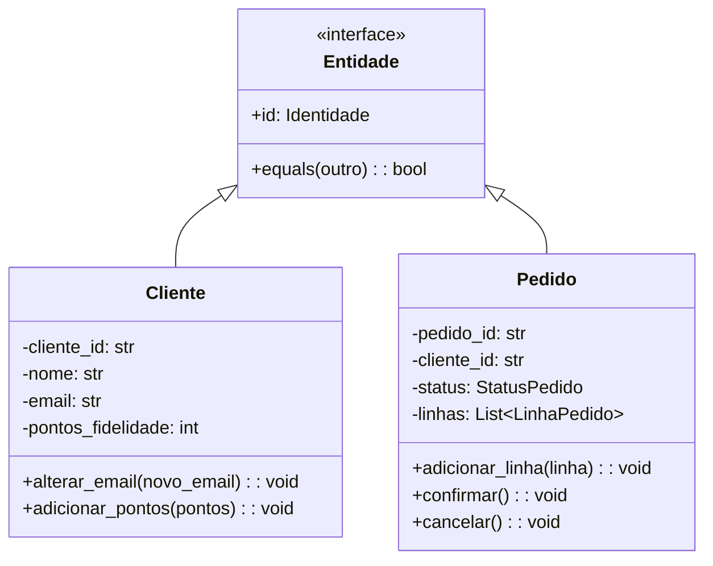

# Entidades e Objetos de Valor

Entidades e Objetos de Valor são os **dois blocos de construção fundamentais** de um modelo de domínio em DDD. Juntos, eles formam os átomos a partir dos quais estruturas mais ricas, como Agregados, são construídas. Entender a distinção entre eles — e aplicá-la corretamente — é essencial para um modelo de domínio limpo.

> [!NOTE]
> Eric Evans define uma Entidade como "um objeto que não é definido por seus atributos, mas por uma linha de continuidade e identidade." Um Objeto de Valor é "um objeto que descreve alguma característica ou atributo, mas não carrega nenhum conceito de identidade."

## Entidades: Objetos com Identidade

Uma Entidade tem uma **identidade única** que persiste através do tempo e das mudanças. Duas entidades podem ter todos os mesmos valores de atributo, mas ainda serem objetos diferentes porque têm identidades diferentes.



```python
from dataclasses import dataclass, field
from enum import Enum
from datetime import datetime
from typing import Optional

class StatusPedido(Enum):
    PENDENTE = "pendente"
    CONFIRMADO = "confirmado"
    ENVIADO = "enviado"
    ENTREGUE = "entregue"

class Cliente:
    """Uma Entidade: a identidade é o cliente_id, não os atributos."""

    def __init__(self, cliente_id: str, nome: str, email: str):
        self._id = cliente_id
        self._nome = nome
        self._email = email
        self._pontos_fidelidade = 0
        self._criado_em = datetime.now()

    @property
    def id(self) -> str:
        return self._id

    def alterar_email(self, novo_email: str) -> None:
        if "@" not in novo_email or "." not in novo_email:
            raise ValueError("Endereço de email inválido")
        self._email = novo_email

    def adicionar_pontos_fidelidade(self, pontos: int) -> None:
        if pontos < 0:
            raise ValueError("Pontos não podem ser negativos")
        self._pontos_fidelidade += pontos

    def __eq__(self, other: object) -> bool:
        if not isinstance(other, Cliente):
            return False
        return self._id == other._id

    def __hash__(self) -> int:
        return hash(self._id)
```

### Estratégias de Geração de Identidade

| Estratégia | Descrição | Exemplo | Prós | Contras |
|------------|-----------|---------|------|---------|
| Chave Natural | ID fornecido pelo domínio | CPF, Email, SKU | Significativo | Pode mudar, pode não existir |
| Chave Substituta | ID gerado pelo sistema | UUID, Auto-incremento | Estável, simples | Sem significado |
| Chave Composta | Combinação de campos | (Armazém, Corredor, Prateleira) | Localização precisa | Complexo |
| ID Externo | ID de outro sistema | ID de Transação de Pagamento | Liga sistemas | Dependência externa |

## Objetos de Valor: Objetos com Igualdade por Valor

Um Objeto de Valor **não tem identidade**. Dois Objetos de Valor são iguais se todos os seus atributos forem iguais. Eles são imutáveis — uma vez criados, não podem mudar.

```python
from dataclasses import dataclass
from decimal import Decimal

@dataclass(frozen=True)
class Dinheiro:
    valor: Decimal
    moeda: str

    def __add__(self, other: "Dinheiro") -> "Dinheiro":
        if self.moeda != other.moeda:
            raise ValueError(f"Não é possível somar {self.moeda} com {other.moeda}")
        return Dinheiro(self.valor + other.valor, self.moeda)

    def __sub__(self, other: "Dinheiro") -> "Dinheiro":
        if self.moeda != other.moeda:
            raise ValueError(f"Não é possível subtrair {self.moeda} de {other.moeda}")
        return Dinheiro(self.valor - other.valor, self.moeda)

    def __mul__(self, multiplicador: int) -> "Dinheiro":
        return Dinheiro(self.valor * multiplicador, self.moeda)

    def __repr__(self) -> str:
        return f"{self.moeda} {self.valor:.2f}"
```

### Quando Usar um Objeto de Valor

Um conceito deve ser um Objeto de Valor quando:

1. **Descreve uma característica** de outra coisa
2. **Não tem identidade** própria
3. **Você o substitui, não o modifica** quando precisa mudar
4. **Você se importa com o que é**, não com qual é
5. **É imutável**

```python
from dataclasses import dataclass
from enum import Enum

@dataclass(frozen=True)
class Email:
    endereco: str

    def __post_init__(self) -> None:
        if "@" not in self.endereco or "." not in self.endereco:
            raise ValueError(f"Email inválido: {self.endereco}")

    @property
    def dominio(self) -> str:
        return self.endereco.split("@")[1]

@dataclass(frozen=True)
class Endereco:
    rua: str
    cidade: str
    estado: str
    cep: str
    pais: str

    def eh_nacional(self) -> bool:
        return self.pais.upper() == "BR"

@dataclass(frozen=True)
class IntervaloDatas:
    inicio: "datetime"
    fim: "datetime"

    def __post_init__(self) -> None:
        if self.inicio >= self.fim:
            raise ValueError("Início deve ser anterior ao fim")

    def sobrepoe(self, other: "IntervaloDatas") -> bool:
        return self.inicio < other.fim and self.fim > other.inicio
```

## A Distinção na Prática

```python
# Entidade: Cliente tem identidade
class Cliente:
    def __init__(self, cliente_id: str, nome: str, email: str):
        self._id = cliente_id
        self._nome = nome
        self._email = Email(email)  # Objeto de Valor dentro da Entidade
        self._endereco_entrega: Optional[Endereco] = None

    def atualizar_endereco_entrega(self, endereco: Endereco) -> None:
        """Substitui o Objeto de Valor completamente."""
        self._endereco_entrega = endereco
```

> [!TIP]
> Objetos de Valor são candidatos perfeitos para `dataclass(frozen=True)` em Python. A garantia de imutabilidade assegura que eles se comportem corretamente como tipos de valor e possam ser compartilhados e armazenados em cache com segurança.

## Obsessão por Primitivos

Objetos de Valor ajudam a evitar **obsessão por primitivos** — o antipadrão de usar tipos primitivos (strings, ints, floats) para conceitos do domínio.

```python
# Obsessão por primitivos (RUIM)
class PedidoPrimitivo:
    def __init__(self, cliente_id: str, valor: float, imposto: float,
                 rua: str, cidade: str, cep: str):
        self.cliente_id = cliente_id
        self.valor = valor
        self.imposto = imposto
        self.rua = rua
        self.cidade = cidade
        self.cep = cep

# Com Objetos de Valor (BOM)
class PedidoRico:
    def __init__(self, cliente_id: IdCliente, valor: Dinheiro,
                 aliquota_imposto: AliquotaImposto, endereco: Endereco):
        self._cliente_id = cliente_id
        self._valor = valor
        self._imposto = aliquota_imposto.aplicar_a(valor)
        self._endereco = endereco
```

## Imutabilidade e Funções sem Efeitos Colaterais

Objetos de Valor são imutáveis. Quando você precisa de um valor "diferente", você cria um novo. Isso leva a funções sem efeitos colaterais que são fáceis de testar e raciocinar.

```python
@dataclass(frozen=True)
class Porcentagem:
    valor: float  # 0 a 100

    def __post_init__(self) -> None:
        if self.valor < 0 or self.valor > 100:
            raise ValueError(f"Porcentagem deve ser 0-100, recebido {self.valor}")

    def de(self, quantia: float) -> float:
        return quantia * self.valor / 100

    def somar(self, other: "Porcentagem") -> "Porcentagem":
        return Porcentagem(self.valor + other.valor)

    def subtrair(self, other: "Porcentagem") -> "Porcentagem":
        return Porcentagem(self.valor - other.valor)
```

## Semântica de Igualdade

Entidades e Objetos de Valor têm regras de igualdade diferentes:

```python
# Entidade: igualdade por identidade
cliente_a = Cliente("123", "Alice", "alice@exemplo.com")
cliente_b = Cliente("123", "Alice", "alice@exemplo.com")
cliente_c = Cliente("456", "Alice", "alice@exemplo.com")

assert cliente_a == cliente_b  # Mesmo ID -> igual
assert cliente_a != cliente_c  # ID diferente -> diferente

# Objeto de Valor: igualdade por valor
dinheiro_a = Dinheiro(Decimal("10.00"), "USD")
dinheiro_b = Dinheiro(Decimal("10.00"), "USD")
dinheiro_c = Dinheiro(Decimal("20.00"), "USD")

assert dinheiro_a == dinheiro_b  # Mesmos atributos -> igual
assert dinheiro_a != dinheiro_c  # Atributos diferentes -> diferente
```

## Exercícios Práticos

1. **Classificação Entidade vs Objeto de Valor**: Para cada conceito, classifique como Entidade ou Objeto de Valor e explique por quê:
   - Uma conta bancária
   - Um número de cartão de crédito
   - Um recibo de transação
   - Uma coordenada geográfica
   - Uma linha de fatura
   - Um número de CPF

2. **Refatoração de obsessão por primitivos**: O código a seguir sofre de obsessão por primitivos. Refatore usando Objetos de Valor:
   ```python
   class Filme:
       def __init__(self, titulo: str, ano: int, duracao_minutos: int,
                    classificacao: str, genero: str):
           self.titulo = titulo
           self.ano = ano
           self.duracao = duracao_minutos
           self.classificacao = classificacao
           self.genero = genero
   ```

3. **Implemente um Objeto de Valor**: Crie um Objeto de Valor `Temperatura` que suporte Celsius e Fahrenheit. Deve ser imutável, ter igualdade adequada e fornecer métodos de conversão.

4. **Design de identidade de entidade**: Projete a estratégia de identidade para uma entidade "ProntuárioMedico" em um sistema hospitalar. Considere: o que torna um prontuário único? Podem existir múltiplos prontuários para o mesmo paciente? Que chaves naturais existem?

5. **Igualdade de entidade**: Implemente `__eq__` e `__hash__` para uma entidade `Documento`. O documento tem `documento_id` (UUID), `titulo`, `autor`, `hash_conteudo` e `versao`. Qual(is) campo(s) deve(m) determinar a identidade?

6. **Composição de Objeto de Valor**: Crie um Objeto de Valor `LocalizacaoGeo` (latitude, longitude) com um método `distancia_ate(other: LocalizacaoGeo) -> Distancia` que retorna um Objeto de Valor `Distancia`. Ambos devem ser dataclasses congeladas.

7. **Entidade com Objetos de Valor incorporados**: Projete uma entidade `ReservaVoo` que incorpora os seguintes Objetos de Valor: `NumeroVoo`, `Assento`, `IntervaloDatas`, `NomePassageiro`. Cada Objeto de Valor deve ter validação em `__post_init__`.

8. **Refatore modelo anêmico**: O modelo a seguir usa apenas primitivos. Refatore para usar Objetos de Valor e garanta que as entidades tenham identidade e comportamento adequados:
   ```python
   class Livro:
       def __init__(self):
           self.isbn = ""
           self.titulo = ""
           self.autor = ""
           self.paginas = 0
           self.editora = ""
           self.ano_publicacao = 0
           self.genero = ""
           self.copias_disponiveis = 0
           self.total_copias = 0

       def emprestar(self):
           if self.copias_disponiveis > 0:
               self.copias_disponiveis -= 1

       def devolver(self):
           if self.copias_disponiveis < self.total_copias:
               self.copias_disponiveis += 1
   ```

> [!SUCCESS]
> Você completou a Lição 4. Entidades fornecem identidade e continuidade; Objetos de Valor fornecem poder descritivo e imutabilidade. Juntos, eles lhe dão blocos de construção precisos para modelar qualquer domínio.

## Testando Objetos de Valor

Objetos de Valor são as coisas mais fáceis de testar em um modelo de domínio porque não têm dependências e são imutáveis.

```python
import pytest

def test_adicao_dinheiro():
    a = Dinheiro(Decimal("10.00"), "BRL")
    b = Dinheiro(Decimal("5.00"), "BRL")
    resultado = a + b
    assert resultado == Dinheiro(Decimal("15.00"), "BRL")

def test_dinheiro_moeda_incompativel():
    brl = Dinheiro(Decimal("10.00"), "BRL")
    usd = Dinheiro(Decimal("10.00"), "USD")
    with pytest.raises(ValueError, match="Moeda incompatível"):
        brl + usd

def test_dinheiro_imutabilidade():
    original = Dinheiro(Decimal("10.00"), "BRL")
    resultado = original * 3
    assert original == Dinheiro(Decimal("10.00"), "BRL")  # Inalterado
    assert resultado == Dinheiro(Decimal("30.00"), "BRL")

def test_porcentagem_validacao():
    with pytest.raises(ValueError):
        Porcentagem(150)
    with pytest.raises(ValueError):
        Porcentagem(-5)

def test_email_validacao():
    valido = Email("usuario@exemplo.com")
    assert valido.dominio == "exemplo.com"

    with pytest.raises(ValueError):
        Email("nao-email")
```

## Objetos de Valor na Prática: Exemplo Real

Aqui está como um modelo de domínio rico usa Entidades e Objetos de Valor em um contexto de e-commerce:

```python
from dataclasses import dataclass, field
from enum import Enum
from datetime import datetime
from decimal import Decimal
from typing import List, Optional
import uuid

# --- Objetos de Valor ---

@dataclass(frozen=True)
class Dinheiro:
    valor: Decimal
    moeda: str

    def __add__(self, other: "Dinheiro") -> "Dinheiro":
        if self.moeda != other.moeda:
            raise ValueError("Moeda incompatível")
        return Dinheiro(self.valor + other.valor, self.moeda)

    def __mul__(self, quantidade: int) -> "Dinheiro":
        return Dinheiro(self.valor * quantidade, self.moeda)

@dataclass(frozen=True)
 class InstantaneaProduto:
    """Snapshot imutável das informações do produto no momento do pedido."""
    produto_id: str
    nome: str
    preco: Dinheiro
    categoria: str

@dataclass(frozen=True)
class EnderecoEntrega:
    rua: str
    cidade: str
    estado: str
    cep: str
    pais: str

# --- Entidades ---

class StatusPedido(Enum):
    PENDENTE = "pendente"
    PAGO = "pago"
    ENVIADO = "enviado"
    ENTREGUE = "entregue"
    CANCELADO = "cancelado"

class Pedido:
    """Entidade: um pedido tem identidade."""

    def __init__(self, cliente_id: str, endereco_entrega: EnderecoEntrega):
        self._id = f"PED-{uuid.uuid4().hex[:8].upper()}"
        self._cliente_id = cliente_id
        self._endereco_entrega = endereco_entrega
        self._linhas: List["LinhaPedido"] = []
        self._status = StatusPedido.PENDENTE
        self._realizado_em = datetime.now()

    @property
    def id(self) -> str:
        return self._id

    def adicionar_produto(self, produto: InstantaneaProduto, quantidade: int) -> None:
        if self._status != StatusPedido.PENDENTE:
            raise ValueError("Não é possível modificar um pedido não pendente")
        self._linhas.append(LinhaPedido(produto, quantidade))

    def calcular_total(self) -> Dinheiro:
        total = Dinheiro(Decimal("0.00"), "BRL")
        for linha in self._linhas:
            total = total + linha.subtotal()
        return total

    def __eq__(self, other: object) -> bool:
        if not isinstance(other, Pedido):
            return False
        return self._id == other._id

    def __hash__(self) -> int:
        return hash(self._id)
```

## Erros Comuns

| Erro | Errado | Correto |
|------|--------|---------|
| Fazer entidade como objeto de valor | `Cliente` sem id | `Cliente` tem cliente_id |
| Fazer objeto de valor como entidade | `Endereco` com id | `Endereco` é objeto de valor |
| Mutar um objeto de valor | `endereco.cidade = "SP"` | `novo_endereco = Endereco(...)` |
| Não sobrescrever `__eq__` em entidade | Comparação padrão de objeto | Comparar por ID |
| Obsessão por primitivos | `email: str` | `email: Email` (objeto de valor) |
| Entidade sem comportamento | Apenas getters/setters | Métodos de negócio na entidade |

## Exercícios Adicionais

9. **Implemente equals/hashcode**: Em uma entidade `TransacaoBancaria`, determine qual campo define a identidade. Implemente `__eq__` e `__hash__` adequadamente.

10. **Value Object composto**: Crie um Objeto de Valor `Coordenada` (latitude, longitude) que valida que latitude está entre -90 e 90 e longitude entre -180 e 180. Adicione um método `distancia_ate` que usa a fórmula de Haversine.

> [!SUCCESS]
> Você completou a Lição 4. Entidades fornecem identidade e continuidade; Objetos de Valor fornecem poder descritivo e imutabilidade. Juntos, eles lhe dão blocos de construção precisos para modelar qualquer domínio.
