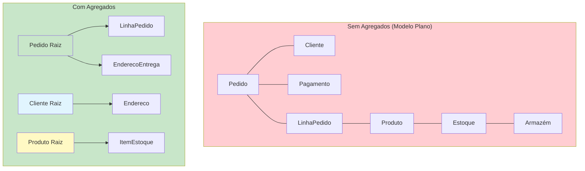
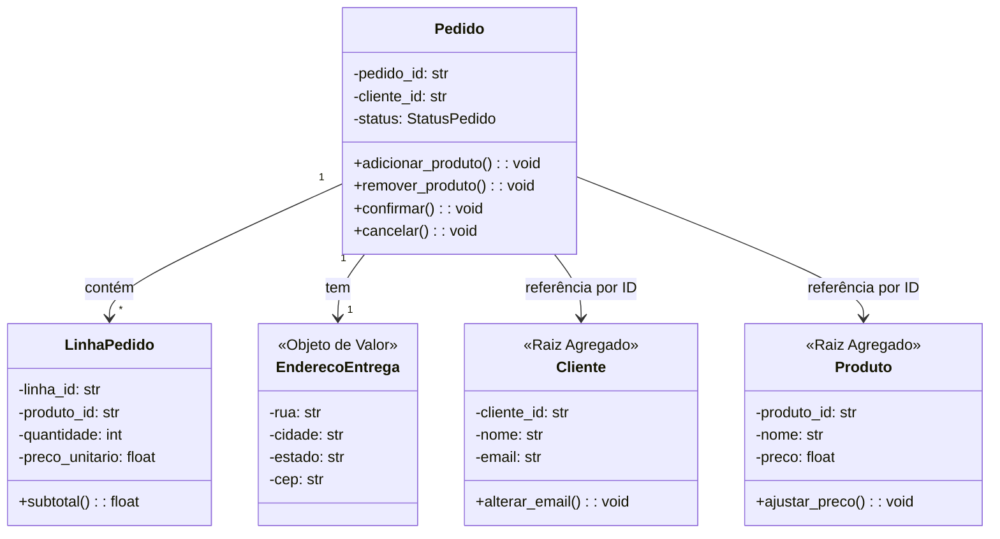

# Agregados e Raízes de Agregados

Um Agregado é um **cluster de objetos de domínio** que pode ser tratado como uma única unidade. Cada Agregado tem uma **Raiz de Agregado** — uma única Entidade que atua como ponto de entrada e controla o acesso a tudo dentro do limite.

> [!NOTE]
> O padrão Agregado é a resposta do DDD para consistência. Em qualquer sistema com acesso concorrente e dados complexos, garantir invariantes (regras de negócio que devem sempre ser verdadeiras) é difícil. Agregados definem **limites de consistência** claros que tornam os invariantes aplicáveis.

## Por que Agregados Importam

Sem agregados, as transações se tornam complexas, os invariantes ficam espalhados pelo código e o modelo de domínio não oferece orientação sobre o que pode ser modificado junto.



## A Raiz do Agregado

A Raiz do Agregado é o **único ponto de entrada** para o agregado. Objetos externos só podem manter referências à raiz, não a entidades internas. A raiz é responsável por:

1. **Aplicar invariantes**: Regras de negócio que envolvem múltiplos objetos internos
2. **Controlar acesso**: Objetos externos não podem modificar entidades internas diretamente
3. **Gerenciar persistência**: A raiz é carregada e salva como um todo
4. **Gerar eventos**: Eventos de domínio são publicados pela raiz

```python
from dataclasses import dataclass, field
from enum import Enum
from datetime import datetime
from typing import List, Optional, Protocol
import uuid


class StatusPedido(Enum):
    PENDENTE = "pendente"
    CONFIRMADO = "confirmado"
    ENVIADO = "enviado"
    ENTREGUE = "entregue"
    CANCELADO = "cancelado"


class LinhaPedido:
    """Entidade dentro do agregado Pedido.
    Código externo NUNCA mantém referência direta a isto.
    Todo acesso passa pela raiz do agregado."""

    def __init__(self, produto_id: str, nome_produto: str,
                 quantidade: int, preco_unitario: float):
        self._linha_id = f"LN-{uuid.uuid4().hex[:8].upper()}"
        self._produto_id = produto_id
        self._nome_produto = nome_produto
        self._quantidade = quantidade
        self._preco_unitario = preco_unitario

    @property
    def produto_id(self) -> str:
        return self._produto_id

    def subtotal(self) -> float:
        return self._quantidade * self._preco_unitario


class Pedido:
    """Raiz do Agregado. Controla todo acesso às LinhasPedido."""

    def __init__(self, cliente_id: str):
        self._id = f"PED-{uuid.uuid4().hex[:8].upper()}"
        self._cliente_id = cliente_id
        self._linhas: List[LinhaPedido] = []
        self._status = StatusPedido.PENDENTE
        self._realizado_em = datetime.now()

    @property
    def id(self) -> str: return self._id
    @property
    def status(self) -> StatusPedido: return self._status
    @property
    def total(self) -> float:
        return sum(linha.subtotal() for linha in self._linhas)

    def adicionar_produto(self, produto_id: str, nome_produto: str,
                          quantidade: int, preco_unitario: float) -> None:
        if quantidade <= 0:
            raise ValueError("Quantidade deve ser positiva")
        self._assert_pendente()
        self._linhas.append(LinhaPedido(produto_id, nome_produto,
                                        quantidade, preco_unitario))

    def confirmar(self) -> None:
        self._assert_pendente()
        if not self._linhas:
            raise ValueError("Não é possível confirmar um pedido vazio")
        if self.total <= 0:
            raise ValueError("Não é possível confirmar pedido com valor zero")
        self._status = StatusPedido.CONFIRMADO

    def cancelar(self) -> None:
        if self._status in (StatusPedido.ENVIADO, StatusPedido.ENTREGUE):
            raise ValueError("Não é possível cancelar pedido enviado ou entregue")
        self._status = StatusPedido.CANCELADO

    def _assert_pendente(self) -> None:
        if self._status != StatusPedido.PENDENTE:
            raise ValueError(
                f"Não é possível modificar pedido no status {self._status.value}"
            )

    def __eq__(self, other: object) -> bool:
        if not isinstance(other, Pedido):
            return False
        return self._id == other._id

    def __hash__(self) -> int:
        return hash(self._id)
```

## Princípios de Design de Agregados

### 1. Agregados Pequenos

Quanto menor o agregado, menos conflitos concorrentes. Carregue e salve o agregado inteiro como uma unidade.

| Tamanho | Exemplo | Usuários Concorrentes | Conflitos |
|---------|---------|----------------------|-----------|
| Grande | Pedido com 1000+ linhas | 5 | Frequentes |
| Médio | Pedido com 10-50 linhas | 100 | Raros |
| Pequeno | Pedido com 1-5 linhas | 1000 | Muito raros |

> [!WARNING]
> O erro mais comum no design de agregados é torná-los muito grandes. Uma boa regra: **se um agregado tem mais de 5-7 entidades internas, provavelmente é grande demais.** Divida-o.

### 2. Referencie Outros Agregados Apenas por ID

Nunca mantenha uma referência de objeto para as entidades internas de outro agregado. Use o ID do outro agregado.

```python
# Correto: Pedido referencia Cliente por ID, não por referência de objeto
class Pedido:
    def __init__(self, cliente_id: str):
        self._cliente_id = cliente_id  # Apenas o ID
        # NÃO mantemos um objeto Cliente aqui

    @property
    def cliente_id(self) -> str:
        return self._cliente_id

# Errado: mantendo referência a dados internos de outro agregado
class PedidoErrado:
    def __init__(self, cliente: "Cliente"):
        self._cliente = cliente  # Nunca referencie outra raiz de agregado
```

### 3. Defina Invariantes Claros

Cada agregado deve ter invariantes explícitos — regras de negócio que devem sempre ser verdadeiras.

```python
class CarrinhoCompras:
    INVARIANTE_MAX_ITENS = 50
    INVARIANTE_MAX_QUANTIDADE = 99
    INVARIANTE_VALOR_MINIMO = 10.0

    def adicionar_item(self, produto_id: str, quantidade: int, preco: float) -> None:
        # Invariante 1: máximo de itens
        if len(self._itens) >= self.INVARIANTE_MAX_ITENS:
            raise ValueError(f"Não pode exceder {self.INVARIANTE_MAX_ITENS} itens")

        # Invariante 2: quantidade máxima por item
        if quantidade > self.INVARIANTE_MAX_QUANTIDADE:
            raise ValueError(f"Não pode exceder {self.INVARIANTE_MAX_QUANTIDADE} por item")

    def finalizar(self) -> None:
        # Invariante 3: valor mínimo do pedido
        if self._calcular_total() < self.INVARIANTE_VALOR_MINIMO:
            raise ValueError(f"Valor mínimo do pedido é R$ {self.INVARIANTE_VALOR_MINIMO}")
```

### 4. Transações Abrangem Apenas Um Agregado

Uma transação deve modificar apenas um agregado. Se precisar modificar múltiplos agregados, use consistência eventual via eventos de domínio.

```python
# Correto: uma transação por agregado
class ServicoPedido:
    def confirmar_pedido(self, pedido_id: str) -> None:
        pedido = self._repo.encontrar_por_id(pedido_id)
        pedido.confirmar()
        self._repo.salvar(pedido)

# Errado: modificando dois agregados em uma transação
class ServicoPedidoErrado:
    def confirmar_pedido(self, pedido_id: str) -> None:
        pedido = self._repo.encontrar_por_id(pedido_id)
        cliente = self._cliente_repo.encontrar_por_id(pedido.cliente_id)
        pedido.confirmar()
        cliente.incrementar_contagem_pedidos()  # Outro agregado!
        self._repo.salvar(pedido)
        self._cliente_repo.salvar(cliente)  # Duas transações = ruim
```

## Limites Transacionais

> [!TIP]
> O agregado define o **limite da transação**. Tudo dentro do agregado é salvo ou nada é salvo. Tudo dentro é consistente. Tudo fora é eventualmente consistente.

## Projetando Agregados: Processo Passo a Passo

### Passo 1: Identifique Entidades e Objetos de Valor
### Passo 2: Agrupe por Invariante
### Passo 3: Escolha a Raiz
### Passo 4: Defina Limites
### Passo 5: Projete para Consistência

```python
# Projetando um agregado Reserva para um hotel

class Reserva:
    """Raiz do Agregado para reservas de hotel."""

    def __init__(self, quarto_id: str, nome_hospede: str,
                 email_hospede: str, periodo: "IntervaloDatas"):
        self._id = f"RES-{uuid.uuid4().hex[:8].upper()}"
        self._quarto_id = quarto_id
        self._hospede = InfoHospede(nome_hospede, email_hospede)
        self._periodo = periodo
        self._cobrancas: List[CobrancaReserva] = []
        self._cancelada = False

    def cancelar(self) -> None:
        if self._cancelada:
            raise ValueError("Reserva já cancelada")
        self._cancelada = True

    def alterar_periodo(self, novo_periodo: "IntervaloDatas") -> None:
        if self._cancelada:
            raise ValueError("Não é possível alterar período de reserva cancelada")
        self._periodo = novo_periodo


@dataclass(frozen=True)
class InfoHospede:
    nome: str
    email: str

@dataclass(frozen=True)
class CobrancaReserva:
    descricao: str
    valor: "Dinheiro"
```

## Consistência Eventual Entre Agregados

Quando um comando em um agregado deve afetar outro agregado, use **eventos de domínio**.

```python
@dataclass
class PedidoConfirmado:
    pedido_id: str
    itens: List[dict]

class ManipuladorReservaEstoque:
    """Reage a PedidoConfirmado com consistência eventual."""

    def handle(self, evento: PedidoConfirmado) -> None:
        for item in evento.itens:
            produto = self._repo_estoque.encontrar_por_id(item["produto_id"])
            produto.reservar_estoque(item["quantidade"])
            self._repo_estoque.salvar(produto)
```

## Exercícios Práticos

1. **Identifique agregados**: Para um sistema de gerenciamento de biblioteca, identifique os agregados. Justifique por que cada cluster forma um agregado, quem é a raiz e quais invariantes ele impõe.

2. **Projete um agregado**: Projete um agregado `ReservaVoo` para uma companhia aérea. Liste as entidades internas, os objetos de valor, a raiz do agregado e pelo menos 3 invariantes que o agregado impõe.

3. **Corrija violação de agregado**: O código a seguir viola os princípios de design de agregados. Identifique as violações e corrija-as:
   ```python
   class Pedido:
       def __init__(self, cliente):
           self._cliente = cliente
           self._itens = []
           self._status = "pendente"

       def get_nome_cliente(self):
           return self._cliente.nome
   ```

4. **Design de consistência eventual**: Um sistema de e-commerce tem agregados `Pedido` e `Cliente` separados. Quando um pedido é confirmado, o `valor_acumulado` do cliente deve ser atualizado. Projete isso usando eventos de domínio e consistência eventual.

5. **Limite de transação**: Dados os seguintes agregados — `Pagamento`, `Pedido`, `Remessa` — descreva um cenário onde uma única operação do usuário aciona mudanças em todos os três. Mostre como você projetaria isso usando consistência eventual.

6. **Redimensione um agregado**: Um agregado `CarrinhoCompras` atualmente mantém entidades `ItemCarrinho` que contêm dados completos do `Produto` (nome, descrição, url_imagem, preco, peso, dimensoes). Refatore para que o carrinho mantenha apenas IDs de produtos e referências. Explique os trade-offs.

7. **Aplicação de invariante**: Projete um agregado para uma `Conta` bancária com estes invariantes:
   - Saldo nunca pode ficar abaixo do limite de cheque especial
   - Saque máximo por dia é R$ 10.000
   - Conta deve estar ativa para transações
   - Depósitos acima de R$ 10.000 exigem flag de aprovação do gerente

8. **Divisão de agregado**: Um `ProntuarioPaciente` agregado monolítico contém: informações pessoais, histórico médico, alergias, prescrições, resultados de exames, informações de faturamento e detalhes de seguro. Divida em pelo menos 3 agregados. Justifique cada divisão com base em requisitos de consistência.

> [!SUCCESS]
> Você completou a Lição 5. Agregados são a pedra angular da consistência em DDD. Projete-os pequenos, proteja seus invariantes através da raiz e use consistência eventual para operações entre agregados. Esta disciplina é o que torna domínios complexos gerenciáveis em escala.

## Design Consistente de Agregados



## Testando Invariantes de Agregados

```python
import pytest

def test_nao_pode_confirmar_pedido_vazio():
    pedido = Pedido(cliente_id="CLI-001")
    with pytest.raises(ValueError, match="vazio"):
        pedido.confirmar()

def test_nao_pode_adicionar_produto_em_pedido_confirmado():
    pedido = Pedido(cliente_id="CLI-001")
    pedido.adicionar_produto("P1", "Widget", 2, 10.0)
    pedido.confirmar()
    with pytest.raises(ValueError, match="modificar pedido"):
        pedido.adicionar_produto("P2", "Gadget", 1, 20.0)

def test_nao_pode_enviar_pedido_nao_confirmado():
    pedido = Pedido(cliente_id="CLI-001")
    with pytest.raises(ValueError, match="confirmados"):
        pedido.enviar()

def test_cancelar_pedido_enviado():
    pedido = Pedido(cliente_id="CLI-001")
    pedido.adicionar_produto("P1", "Widget", 1, 10.0)
    pedido.confirmar()
    pedido.enviar()
    with pytest.raises(ValueError, match="enviado"):
        pedido.cancelar()

def test_total_pedido():
    pedido = Pedido(cliente_id="CLI-001")
    pedido.adicionar_produto("P1", "Widget", 2, 10.0)
    pedido.adicionar_produto("P2", "Gadget", 1, 20.0)
    assert pedido.total == 40.0
```

## Consistência Eventual Entre Agregados

Quando um comando em um agregado precisa afetar outro agregado, use **eventos de domínio** e um **saga/gerenciador de processos**.

```python
# Quando Pedido é confirmado, Estoque deve reservar estoque
# Estes são agregados diferentes — tratados com consistência eventual

@dataclass
class PedidoConfirmado:
    pedido_id: str
    itens: List[dict]

class ManipuladorReservaEstoque:
    """Reage a PedidoConfirmado com consistência eventual."""

    def __init__(self, repositorio_estoque, publicador_eventos):
        self._repositorio_estoque = repositorio_estoque
        self._publicador_eventos = publicador_eventos

    def handle(self, evento: PedidoConfirmado) -> None:
        for item in evento.itens:
            produto = self._repositorio_estoque.encontrar_por_id(item["produto_id"])
            produto.reservar_estoque(item["quantidade"])
            self._repositorio_estoque.salvar(produto)
```

## Padrões Comuns de Agregados

| Padrão | Descrição | Exemplo |
|--------|-----------|---------|
| Entidade Única | Agregado é apenas uma entidade raiz | Usuário, Cliente |
| Raiz + Filhos | Raiz com entidades owned | Pedido + LinhasPedido |
| Raiz + Objetos de Valor | Raiz apenas com objetos de valor | Produto + Dinheiro + Dimensão |
| Composição | Raiz composta de sub-entidades | CarrinhoCompras + ItensCarrinho |

## Exercícios Adicionais

9. **Projete um agregado com Event Sourcing**: Reimplemente o agregado `Pedido` usando Event Sourcing. Em vez de armazenar o estado atual, armazene os eventos. Inclua `carregar_do_historico` e `_aplicar`.

10. **Consistência entre agregados**: Projete um mecanismo de consistência eventual entre `Pedido` e `NotaFiscal`. Quando um pedido é enviado, uma nota fiscal deve ser gerada. Mostre os eventos e handlers envolvidos.

> [!SUCCESS]
> Você completou a Lição 5. Agregados são a pedra angular da consistência em DDD. Projete-os pequenos, proteja seus invariantes através da raiz e use consistência eventual para operações entre agregados. Esta disciplina é o que torna domínios complexos gerenciáveis em escala.
