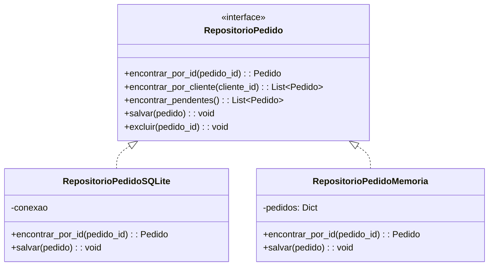

# Repositórios e Serviços de Domínio

Repositórios e Serviços de Domínio são mais dois blocos de construção táticos em DDD. **Repositórios** fornecem uma abstração limpa para armazenar e recuperar agregados. **Serviços de Domínio** encapsulam lógica de domínio que não pertence naturalmente a uma Entidade ou Objeto de Valor.

> [!NOTE]
> Em DDD, um Repositório não é um DAO (Data Access Object). Um DAO é um conceito técnico para acesso a dados. Um Repositório é um **conceito de domínio** que fala a Linguagem Ubíqua — você consulta agregados por termos do domínio, não por consultas SQL.

## Repositórios: A Metáfora da Coleção

Um Repositório age como uma **coleção em memória** de agregados. Você adiciona itens, remove itens e consulta por critérios relevantes ao domínio. O armazenamento subjacente (banco de dados, sistema de arquivos, API) fica oculto por trás desta interface.



### Interface do Repositório

A interface do repositório é definida na **camada de domínio**. A implementação está na **camada de infraestrutura**. Isso segue o Princípio da Inversão de Dependência.

```python
from typing import Protocol, List, Optional


class RepositorioPedido(Protocol):
    """Um repositório para agregados Pedido.
    Definido na camada de domínio — fala a Linguagem Ubíqua."""

    def encontrar_por_id(self, pedido_id: str) -> Optional["Pedido"]:
        """Encontra um pedido pelo seu identificador único."""
        ...

    def encontrar_por_cliente(self, cliente_id: str) -> List["Pedido"]:
        """Encontra todos os pedidos de um cliente."""
        ...

    def encontrar_pendentes(self) -> List["Pedido"]:
        """Encontra todos os pedidos que não foram confirmados ainda."""
        ...

    def salvar(self, pedido: "Pedido") -> None:
        """Persiste um agregado Pedido (insere ou atualiza)."""
        ...

    def excluir(self, pedido_id: str) -> None:
        """Remove um pedido do repositório."""
        ...
```

### Implementação do Repositório

A implementação vive na camada de infraestrutura. Ela traduz entre o modelo de domínio e o mecanismo de persistência.

```python
import sqlite3

class RepositorioPedidoSQLite:
    """Implementa RepositorioPedido usando SQLite."""

    def __init__(self, caminho_db: str):
        self._conn = sqlite3.connect(caminho_db)
        self._iniciar_tabelas()

    def _iniciar_tabelas(self) -> None:
        self._conn.execute("""
            CREATE TABLE IF NOT EXISTS pedidos (
                pedido_id TEXT PRIMARY KEY,
                cliente_id TEXT NOT NULL,
                status TEXT NOT NULL,
                realizado_em TIMESTAMP NOT NULL,
                total REAL NOT NULL
            )
        """)
        self._conn.execute("""
            CREATE TABLE IF NOT EXISTS linhas_pedido (
                linha_id TEXT PRIMARY KEY,
                pedido_id TEXT NOT NULL,
                produto_id TEXT NOT NULL,
                quantidade INTEGER NOT NULL,
                preco_unitario REAL NOT NULL,
                FOREIGN KEY (pedido_id) REFERENCES pedidos(pedido_id)
            )
        """)
        self._conn.commit()

    def salvar(self, pedido: "Pedido") -> None:
        self._conn.execute(
            """INSERT OR REPLACE INTO pedidos
               (pedido_id, cliente_id, status, realizado_em, total)
               VALUES (?, ?, ?, ?, ?)""",
            (pedido.id, pedido.cliente_id, pedido.status.value,
             pedido.realizado_em, pedido.total)
        )
        self._conn.execute("DELETE FROM linhas_pedido WHERE pedido_id = ?",
                          (pedido.id,))
        self._conn.commit()
```

### Repositório em Memória para Testes

O benefício de testabilidade do padrão Repositório é enorme:

```python
class RepositorioPedidoMemoria:
    """Implementação em memória para testes."""

    def __init__(self):
        self._pedidos: dict[str, "Pedido"] = {}

    def encontrar_por_id(self, pedido_id: str) -> Optional["Pedido"]:
        return self._pedidos.get(pedido_id)

    def encontrar_por_cliente(self, cliente_id: str) -> List["Pedido"]:
        return [p for p in self._pedidos.values()
                if p.cliente_id == cliente_id]

    def salvar(self, pedido: "Pedido") -> None:
        self._pedidos[pedido.id] = pedido

    def excluir(self, pedido_id: str) -> None:
        self._pedidos.pop(pedido_id, None)
```

> [!WARNING]
| > Um Repositório não deve ser usado para consultas arbitrárias. Se você se pegar adicionando métodos de consulta para cada padrão de acesso a dados, está usando o Repositório de forma errada. O Repositório é para **recuperação de agregados**, não para relatórios ou exploração de dados.

## Serviços de Domínio

Um Serviço de Domínio é uma **operação que não pertence naturalmente a uma Entidade ou Objeto de Valor**. Ele coordena múltiplos agregados ou realiza cálculos que envolvem lógica de domínio.

### Quando Usar um Serviço de Domínio

| Situação | Exemplo | Solução |
|----------|---------|---------|
| Operação envolve múltiplos agregados | Transferir dinheiro entre contas | ServicoTransferencia |
| Operação envolve domínio externo | Calcular frete com regras da transportadora | ServicoCalculoFrete |
| Operação é computação sem estado | Aplicar regras de preço complexas | ServicoPrecificacao |

```python
from decimal import Decimal

class ServicoPrecificacao:
    """Serviço de Domínio para cálculos de preço."""

    DESCONTO_OURO = Decimal("0.15")
    DESCONTO_PRATA = Decimal("0.10")
    IMPOSTO_PADRAO = Decimal("0.08")

    def calcular_total_pedido(
        self, itens: List["LinhaPedido"], nivel_cliente: str,
        codigo_cupom: str | None
    ) -> Dinheiro:
        subtotal = self._calcular_subtotal(itens)
        desconto = self._aplicar_desconto(subtotal, nivel_cliente, codigo_cupom)
        imposto = self._calcular_imposto(desconto)
        return desconto + imposto

    def _calcular_subtotal(self, itens: List["LinhaPedido"]) -> Dinheiro:
        total = Dinheiro(Decimal("0.00"), "BRL")
        for item in itens:
            total = total + item.subtotal()
        return total

    def _aplicar_desconto(
        self, subtotal: Dinheiro, nivel: str, cupom: str | None
    ) -> Dinheiro:
        taxa = Decimal("0")
        if nivel == "ouro":
            taxa = self.DESCONTO_OURO
        elif nivel == "prata":
            taxa = self.DESCONTO_PRATA
        valor_desconto = subtotal.valor * taxa
        return Dinheiro(subtotal.valor - valor_desconto, subtotal.moeda)
```

### Serviço de Domínio: Transferência Bancária

```python
class Conta:
    def depositar(self, valor: Dinheiro) -> None:
        if self._congelada:
            raise ValueError("Conta está congelada")
        self._saldo = self._saldo + valor

    def sacar(self, valor: Dinheiro) -> None:
        if self._congelada:
            raise ValueError("Conta está congelada")
        if self._saldo.valor < valor.valor:
            raise ValueError("Saldo insuficiente")
        self._saldo = self._saldo - valor


class ServicoTransferencia:
    """Serviço de Domínio para transferências.
    Coordena dois agregados Conta."""

    TRANSFERENCIA_MINIMA = Dinheiro(Decimal("1.00"), "BRL")
    TRANSFERENCIA_MAXIMA = Dinheiro(Decimal("10000.00"), "BRL")

    def transferir(
        self, origem: Conta, destino: Conta, valor: Dinheiro
    ) -> None:
        if valor.valor < self.TRANSFERENCIA_MINIMA.valor:
            raise ValueError("Valor abaixo do mínimo")
        if valor.valor > self.TRANSFERENCIA_MAXIMA.valor:
            raise ValueError("Valor excede o máximo")
        origem.sacar(valor)
        destino.depositar(valor)
```

## Resumo: Diretrizes de Repositório e Serviço de Domínio

| Aspecto | Repositório | Serviço de Domínio |
|---------|-------------|-------------------|
| Propósito | Armazenar/recuperar agregados | Coordenar operações de domínio |
| Estado | Stateless | Stateless |
| Dependência | Depende de infraestrutura | Depende de interfaces de domínio |
| Testabilidade | Fácil (impl. em memória) | Fácil (testes unitários) |
| Camada | Interface: Domínio, Implementação: Infraestrutura | Domínio |
| Granularidade | Um por raiz de agregado | Um por capacidade de domínio |

```mermaid
graph TD
    subgraph Aplicacao["Camada de Aplicação"]
        AUS[Caso de Uso]
    end
    subgraph Dominio["Camada de Domínio"]
        AGG[Raiz do Agregado]
        REP[Interface do Repositório]
        DS[Serviço de Domínio]
    end
    subgraph Infraestrutura["Camada de Infraestrutura"]
        REPI[Implementação do Repositório]
        DB[(Banco de Dados)]
    end

    AUS --> AGG
    AUS --> REP
    AUS --> DS
    REP <|-- REPI
    REPI --> DB
    DS --> AGG
    DS --> REP

    style Dominio fill:#c8e6c9
    style Aplicacao fill:#e1f5fe
    style Infraestrutura fill:#fff9c4
```

## Exercícios Práticos

1. **Projete uma interface de Repositório**: Projete um `RepositorioCliente` para um sistema de gerenciamento de assinaturas. Inclua métodos para encontrar clientes, consultar por status de assinatura e operações padrão de salvar/excluir.

2. **Implemente um Repositório em memória**: Implemente o `RepositorioCliente` do exercício 1 como `RepositorioClienteMemoria`. Use-o em um teste que cria um cliente, salva, recupera por ID e verifica os dados.

3. **Implemente um Repositório SQLite**: Escreva um `RepositorioClienteSQLite` que implementa a mesma interface. Inclua o SQL de criação de tabela e a lógica de mapeamento.

4. **Projete um Serviço de Domínio**: Projete um `ServicoAlocacaoHorario` para um sistema de agendamento hospitalar. O serviço deve alocar um paciente ao horário de um médico. Considere: o que acontece se o horário estiver ocupado? E se o paciente tiver um conflito?

5. **Refatore serviço de aplicação anêmico**: O código a seguir tem lógica de domínio vazando para a camada de aplicação. Extraia a lógica de domínio para um Serviço de Domínio:
   ```python
   class ControladorFazerPedido:
       def handle(self, request):
           pedido = Pedido()
           for item in request["itens"]:
               if item["quantidade"] > 10:
                   raise ValueError("Não pode pedir mais de 10")
               pedido.adicionar_linha(item)
           repositorio.salvar(pedido)
   ```

6. **Repositório vs Serviço de Consulta**: Sua equipe precisa exibir um dashboard com: total de pedidos hoje, valor médio do pedido, top 5 produtos e pedidos por hora. Você usaria um Repositório ou um Serviço de Consulta separado? Explique por quê.

7. **Serviço de Domínio com dependências**: Projete um `ServicoRenovacaoAssinatura` que verifica se uma assinatura deve ser renovada, processa o pagamento e envia uma confirmação. Liste suas dependências e mostre a interface.

8. **Teste com repositório em memória**: Escreva um teste para este cenário: um cliente pode ter no máximo 5 pedidos ativos. Quando ele tenta fazer um 6º pedido, o sistema rejeita. Use um `RepositorioPedidoMemoria` e um `ServicoPedido` que coordena a verificação.

> [!SUCCESS]
> Você completou a Lição 6. Repositórios mantêm seu modelo de domínio ignorante de persistência. Serviços de Domínio mantêm a lógica de domínio de vazar para serviços de aplicação. Juntos, eles garantem que a camada de domínio permaneça o centro do seu sistema.

## Serviço de Domínio: Exemplo de Detecção de Fraude

```python
from dataclasses import dataclass
from typing import List

@dataclass
class AvaliacaoFraude:
    nivel_risco: str  # "baixo", "medio", "alto"
    pontuacao: int
    razoes: List[str]

class ServicoDeteccaoFraude:
    """Serviço de Domínio que avalia risco de fraude.
    Coordena entre múltiplos agregados e dados externos."""

    def __init__(self, repositorio_pedido: "RepositorioPedido",
                 repositorio_cliente: "RepositorioCliente"):
        self._repositorio_pedido = repositorio_pedido
        self._repositorio_cliente = repositorio_cliente

    def avaliar_risco_pedido(self, pedido: "Pedido") -> AvaliacaoFraude:
        razoes: List[str] = []
        pontuacao = 0

        # Regra 1: Pedidos grandes
        if pedido.total.valor > 5000:
            pontuacao += 30
            razoes.append("Total do pedido excede R$ 5.000")

        # Regra 2: Múltiplos pedidos em pouco tempo
        pedidos_recentes = self._repositorio_pedido.encontrar_por_cliente(
            pedido.cliente_id
        )
        quantidade_recente = sum(
            1 for p in pedidos_recentes
            if (datetime.now() - p.realizado_em).hours < 24
        )
        if quantidade_recente >= 3:
            pontuacao += 25
            razoes.append("Mais de 3 pedidos em 24 horas")

        # Regra 3: Cliente novo com pedido de alto valor
        cliente = self._repositorio_cliente.encontrar_por_id(pedido.cliente_id)
        if cliente and cliente.dias_desde_cadastro < 30 and pedido.total.valor > 2000:
            pontuacao += 20
            razoes.append("Cliente novo com pedido de alto valor")

        risco = "baixo" if pontuacao < 30 else "medio" if pontuacao < 60 else "alto"
        return AvaliacaoFraude(risco, pontuacao, razoes)
```

## Repositório vs DAO vs Unit of Work

| Padrão | Propósito | Camada |
|--------|-----------|--------|
| Repositório | Acesso tipo-coleção a agregados | Interface: Domínio |
| DAO | Acesso a dados de baixo nível | Infraestrutura |
| Unit of Work | Gerenciamento de transações | Infraestrutura |
| Query Object | Leitura otimizada | Aplicação |

```python
# Modelo de leitura separado (CQRS) do repositório do modelo de escrita
class ServicoConsultaPedido:
    """Otimizado para leituras — não é um repositório.
    Retorna DTOs somente leitura, não agregados."""

    def __init__(self, conexao):
        self._conn = conexao

    def obter_resumo_pedido(self, pedido_id: str) -> dict | None:
        cursor = self._conn.execute("""
            SELECT p.pedido_id, p.cliente_id, p.status,
                   COUNT(lp.linha_id) as quantidade_itens,
                   p.total
            FROM pedidos p
            LEFT JOIN linhas_pedido lp ON p.pedido_id = lp.pedido_id
            WHERE p.pedido_id = ?
            GROUP BY p.pedido_id
        """, (pedido_id,))
        row = cursor.fetchone()
        if not row:
            return None
        return dict(row)
```

## Testando com Repositórios e Serviços de Domínio

O verdadeiro poder desses padrões se torna evidente nos testes:

```python
class TestServicoTransferencia:
    def setup_method(self):
        self.origem = Conta("ACC-001", "Alice")
        self.origem.depositar(Dinheiro(Decimal("1000.00"), "BRL"))

        self.destino = Conta("ACC-002", "Bob")
        self.destino.depositar(Dinheiro(Decimal("100.00"), "BRL"))

        self.servico = ServicoTransferencia()

    def test_transferencia_com_sucesso(self):
        self.servico.transferir(
            self.origem, self.destino,
            Dinheiro(Decimal("200.00"), "BRL"), "Pagamento"
        )
        assert self.origem.saldo == Dinheiro(Decimal("800.00"), "BRL")
        assert self.destino.saldo == Dinheiro(Decimal("300.00"), "BRL")

    def test_transferencia_saldo_insuficiente(self):
        with pytest.raises(ValueError, match="Saldo insuficiente"):
            self.servico.transferir(
                self.origem, self.destino,
                Dinheiro(Decimal("2000.00"), "BRL"), "Excedido"
            )
```

## Diretrizes de Repositório e Serviço de Domínio

| Aspecto | Repositório | Serviço de Domínio |
|---------|-------------|-------------------|
| Propósito | Armazenar/recuperar agregados | Coordenar operações de domínio |
| Estado | Sem estado (stateless) | Sem estado (stateless) |
| Dependência | Depende de infraestrutura | Depende de interfaces de domínio |
| Testabilidade | Fácil (impl. em memória) | Fácil (testes unitários) |
| Camada | Interface: Domínio, Implementação: Infraestrutura | Domínio |
| Métodos | `encontrar_por_*`, `salvar`, `excluir` | Verbos específicos do domínio |
| Granularidade | Um por raiz de agregado | Um por capacidade de domínio |

## Exercícios Adicionais

9. **Repositório com paginação**: Adicione métodos de paginação ao `RepositorioPedido` para suportar consultas como `encontrar_por_cliente_paginado(cliente_id, pagina, tamanho)`.

10. **Serviço de Domínio notificador**: Crie um `ServicoNotificacaoPedido` que coordena o envio de diferentes tipos de notificação (email, SMS, push) baseado nas preferências do cliente e no tipo de evento.

> [!SUCCESS]
> Você completou a Lição 6. Repositórios mantêm seu modelo de domínio ignorante de persistência. Serviços de Domínio mantêm a lógica de domínio de vazar para serviços de aplicação. Juntos, eles garantem que a camada de domínio permaneça o centro do seu sistema.
