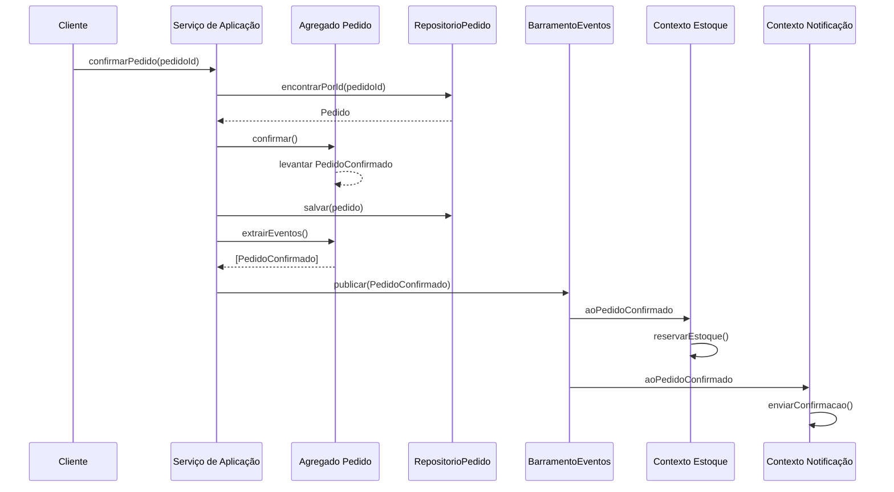
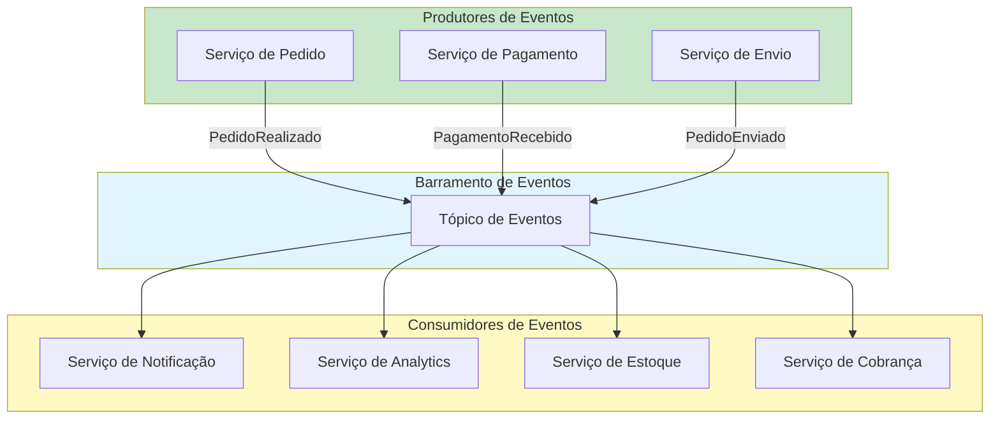

# Arquitetura Orientada a Eventos

Arquitetura Orientada a Eventos (EDA) é um padrão de arquitetura de software que usa **eventos** para disparar e comunicar entre serviços desacoplados. Em DDD, Eventos de Domínio são usados para modelar ocorrências significativas de negócio, permitindo consistência eventual entre agregados e criando uma rica trilha de auditoria.

> [!NOTE]
> Um evento é "algo que aconteceu no passado." Em DDD, Eventos de Domínio são nomeados no passado (ex: `PedidoRealizado`, `PagamentoRecebido`, `EstoqueEsgotado`). Eles representam fatos que o domínio considera importantes.

## Eventos de Domínio

Um Evento de Domínio é um **registro de algo significativo que aconteceu** no domínio. Ele captura quem, o quê, quando e (opcionalmente) por que de uma ocorrência de negócio.

```python
from dataclasses import dataclass, field
from datetime import datetime


@dataclass
class EventoDominio:
    """Classe base para eventos de domínio."""
    ocorrido_em: datetime = field(default_factory=datetime.now)

@dataclass
class PedidoRealizado(EventoDominio):
    pedido_id: str
    cliente_id: str
    valor_total: float
    quantidade_itens: int

@dataclass
class PedidoConfirmado(EventoDominio):
    pedido_id: str
    confirmado_por: str

@dataclass
class PagamentoRecebido(EventoDominio):
    pedido_id: str
    transacao_id: str
    valor: float
    metodo_pagamento: str

@dataclass
class EstoqueReservado(EventoDominio):
    pedido_id: str
    produto_id: str
    quantidade: int

@dataclass
class PedidoEnviado(EventoDominio):
    pedido_id: str
    codigo_rastreio: str
    enviado_em: datetime
```

### Levantando Eventos de Domínio de Agregados

Eventos de domínio são tipicamente levantados **dentro de um agregado** e coletados para publicação após a transação ser confirmada.

```python
from dataclasses import dataclass, field
from enum import Enum
from typing import List


class StatusPedido(Enum):
    PENDENTE = "pendente"
    CONFIRMADO = "confirmado"
    ENVIADO = "enviado"
    ENTREGUE = "entregue"

class Pedido:
    def __init__(self, pedido_id: str, cliente_id: str):
        self._id = pedido_id
        self._cliente_id = cliente_id
        self._itens: List["LinhaPedido"] = []
        self._status = StatusPedido.PENDENTE
        self._eventos: List[EventoDominio] = []

    def confirmar(self) -> None:
        if self._status != StatusPedido.PENDENTE:
            raise ValueError("Pedido não está pendente")
        if not self._itens:
            raise ValueError("Não é possível confirmar pedido vazio")
        self._status = StatusPedido.CONFIRMADO
        self._eventos.append(PedidoConfirmado(
            pedido_id=self._id,
            confirmado_por="sistema"
        ))

    def extrair_eventos(self) -> List[EventoDominio]:
        eventos = list(self._eventos)
        self._eventos.clear()
        return eventos
```

## Fluxo de Eventos em um Sistema DDD



## Event Sourcing

Event Sourcing é um padrão de persistência onde **o estado é derivado de eventos**. Em vez de armazenar o estado atual de um agregado, você armazena a sequência de eventos que levaram a esse estado.

```python
from typing import List, Protocol, Dict


class ArmazenamentoEventos(Protocol):
    def salvar_eventos(self, aggregate_id: str, eventos: List[EventoDominio],
                       versao_esperada: int) -> None: ...
    def obter_eventos(self, aggregate_id: str) -> List[EventoDominio]: ...


class PedidoEventSourced:
    """Um agregado reconstruído a partir de seu fluxo de eventos."""

    def __init__(self, pedido_id: str):
        self._id = pedido_id
        self._cliente_id = ""
        self._status = "pendente"
        self._versao = 0
        self._mudancas: List[EventoDominio] = []

    @classmethod
    def carregar_do_historico(cls, eventos: List[EventoDominio]) -> "PedidoEventSourced":
        pedido = cls.__new__(cls)
        for evento in eventos:
            pedido._aplicar(evento)
        pedido._mudancas.clear()
        return pedido

    def confirmar(self) -> None:
        if self._status != "pendente":
            raise ValueError("Não é possível confirmar pedido não pendente")
        evento = PedidoConfirmado(pedido_id=self._id, confirmado_por="sistema")
        self._aplicar(evento)
        self._mudancas.append(evento)

    def _aplicar(self, evento: EventoDominio) -> None:
        if isinstance(evento, PedidoConfirmado):
            self._status = "confirmado"
        self._versao += 1

    def extrair_mudancas(self) -> List[EventoDominio]:
        mudancas = list(self._mudancas)
        self._mudancas.clear()
        return mudancas
```

## CQRS: Command Query Responsibility Segregation

CQRS separa **comandos** (escritas) de **consultas** (leituras). O modelo de escrita usa o modelo de domínio com agregados. O modelo de leitura usa visões desnormalizadas otimizadas para exibição.

```python
# --- Lado do Comando (Modelo de Escrita) ---

class ManipuladorFazerPedido:
    def handle(self, cmd: "FazerPedidoComando") -> str:
        self._uow.begin()
        try:
            pedido_id = gerar_id_pedido()
            pedido = Pedido(pedido_id, cmd.cliente_id)
            for item in cmd.itens:
                pedido.adicionar_item(item["produto_id"], item["quantidade"])
            pedido.confirmar()
            self._repo.salvar(pedido)
            self._uow.commit()
            for evento in pedido.extrair_eventos():
                self._bus.publicar(evento)
            return pedido_id
        except Exception:
            self._uow.rollback()
            raise


# --- Lado da Consulta (Modelo de Leitura) ---

@dataclass
class ResumoPedido:
    """Modelo de leitura desnormalizado otimizado para exibição."""
    pedido_id: str
    nome_cliente: str
    status: str
    total: float
    quantidade_itens: int
    realizado_em: str

class ServicoConsultaPedido:
    """Serviço somente leitura. Sem modelo de domínio, sem lógica de negócio."""

    def obter_resumo_pedido(self, pedido_id: str) -> Optional[ResumoPedido]:
        cursor = self._conn.execute("""
            SELECT p.pedido_id, c.nome, p.status, p.total,
                   COUNT(lp.linha_id) as quantidade_itens, p.realizado_em
            FROM pedidos p
            JOIN clientes c ON p.cliente_id = c.cliente_id
            LEFT JOIN linhas_pedido lp ON p.pedido_id = lp.pedido_id
            WHERE p.pedido_id = ?
            GROUP BY p.pedido_id
        """, (pedido_id,))
        row = cursor.fetchone()
        if not row:
            return None
        return ResumoPedido(**row)
```

> [!WARNING]
> CQRS adiciona complexidade. Não adicione CQRS a menos que você tenha uma necessidade clara: formatos diferentes de leitura e escrita, requisitos de desempenho ou escala de equipe. Muitos sistemas funcionam perfeitamente apenas com repositórios.

## Sagas e Gerenciadores de Processos

Quando um processo de negócio abrange múltiplos agregados (e possivelmente múltiplos contextos), uma **Saga** ou **Gerenciador de Processos** coordena o fluxo.

```python
@dataclass
class SagaProcessamentoPedido:
    """Coordena o processo de atendimento do pedido entre agregados."""

    def handle_pedido_realizado(self, evento: PedidoRealizado) -> None:
        try:
            self._pagamento.capturar(evento.valor_total)
            self._estoque.reservar_itens(evento.pedido_id, itens)
            self._envio.criar_remessa(evento.pedido_id)
        except Exception as e:
            print(f"Falha no processamento do pedido {evento.pedido_id}: {e}")
            raise
```

## Nomenclatura de Eventos

| Convenção | Exemplo | Quando Usar |
|-----------|---------|-------------|
| Verbo no passado | `PedidoRealizado` | DDD padrão |
| Substantivo + verbo | `PedidoConfirmado` | DDD padrão |
| Fonte + verbo | `Vendas.PedidoConfirmado` | Múltiplos contextos |

> [!TIP]
> Escolha uma convenção de nomenclatura e mantenha-se consistente. A Linguagem Ubíqua se aplica a eventos também — use as palavras que os especialistas do domínio usam quando descrevem o que aconteceu.

## Versionamento de Eventos

Eventos são contratos de dados. Eles evoluem ao longo do tempo:

```python
from dataclasses import dataclass

# V1: Evento original
@dataclass
class PedidoRealizadoV1:
    pedido_id: str
    cliente_id: str
    total: float

# V2: Adicionado campo de desconto
@dataclass
class PedidoRealizadoV2:
    pedido_id: str
    cliente_id: str
    total: float
    desconto: float = 0.0

# Função de upcast: converte V1 para V2
def upcast_pedido_realizado(v1: PedidoRealizadoV1) -> PedidoRealizadoV2:
    return PedidoRealizadoV2(
        pedido_id=v1.pedido_id,
        cliente_id=v1.cliente_id,
        total=v1.total,
        desconto=0.0
    )
```

## Exercícios Práticos

1. **Defina eventos de domínio**: Para um sistema de gerenciamento de biblioteca, liste 8 eventos de domínio. Para cada evento, escreva o dataclass Python com campos apropriados.

2. **Implemente coleta de eventos**: Adicione coleta de eventos a um agregado `ContaBancaria`. Inclua eventos para `ContaAberta`, `DepositoRealizado`, `SaqueRealizado` e `ContaCongelada`. Mostre o método `extrair_eventos`.

3. **Implementação de barramento de eventos**: Implemente um barramento de eventos assíncrono simples usando queue.Queue em Python. Demonstre a inscrição de múltiplos handlers e a publicação de eventos.

4. **Event Sourcing para ContaBancaria**: Implemente um agregado `ContaBancaria` com event sourcing. Inclua `carregar_do_historico`, `_aplicar` e métodos para depósito e saque. Teste que a reprodução de eventos produz o saldo correto.

5. **Modelo de leitura CQRS**: Projete um modelo de leitura para um dashboard de reservas de hotel. Que consultas ele suportaria? Que tabelas desnormalizadas você criaria? Mostre o schema SQL e o serviço de consulta.

6. **Implementação de projeção**: Implemente uma `ProjecaoFidelidadeCliente` que ouve eventos `PedidoRealizado` e mantém um total acumulado de gastos do cliente em uma tabela separada.

7. **Design de saga**: Projete uma saga para lidar com o processo de devolução em e-commerce: quando uma devolução é iniciada, o reembolso deve ser processado, o estoque deve ser restaurado e uma notificação enviada. Mostre a saga como código Python coordenando três agregados.

8. **Versionamento de eventos**: Você tem um evento `FaturaGerada` V1 com campos `fatura_id`, `cliente_id`, `total`. No V2, você precisa adicionar `valor_imposto` e `valor_desconto`. Escreva o dataclass V2, uma função de upcast e mostre como você lida com ambas as versões em um handler.

> [!SUCCESS]
> Você completou a Lição 7. Arquitetura Orientada a Eventos, Eventos de Domínio, Event Sourcing e CQRS são padrões poderosos para construir sistemas escaláveis, auditáveis e desacoplados. Use-os quando a complexidade que eles abordam exceder a complexidade que eles introduzem.

## Projeções: Construindo Modelos de Leitura a partir de Eventos

```python
class ProjecaoResumoPedido:
    """Constrói modelos de leitura desnormalizados a partir do fluxo de eventos."""

    def __init__(self, conexao_db):
        self._conn = conexao_db

    def aplicar(self, evento: EventoDominio) -> None:
        if isinstance(evento, PedidoRealizado):
            self._conn.execute("""
                INSERT INTO resumos_pedido
                (pedido_id, status, total, quantidade_itens, realizado_em)
                VALUES (?, 'pendente', ?, ?, ?)
            """, (evento.pedido_id, evento.total.valor,
                  len(evento.itens), evento.ocorrido_em))
        elif isinstance(evento, PedidoConfirmado):
            self._conn.execute("""
                UPDATE resumos_pedido SET status = 'confirmado'
                WHERE pedido_id = ?
            """, (evento.pedido_id,))
        elif isinstance(evento, PedidoEnviado):
            self._conn.execute("""
                UPDATE resumos_pedido SET status = 'enviado'
                WHERE pedido_id = ?
            """, (evento.pedido_id,))
        self._conn.commit()
```

## Benefícios da Arquitetura Orientada a Eventos

| Benefício | Descrição |
|-----------|-----------|
| Acoplamento fraco | Serviços comunicam via eventos, não chamadas diretas |
| Trilha de auditoria | Cada mudança de estado é registrada |
| Consultas temporais | Pode responder "qual era o estado no tempo X?" |
| Capacidade de replay | Reconstruir estado do zero para depuração |
| Processamento assíncrono | Sem bloqueio entre produtor e consumidor |
| Escalabilidade | Handlers de eventos podem ser escalados independentemente |



## Testando Sistemas Orientados a Eventos

```python
class TestEventosDominio:
    def test_pedido_levanta_evento_ao_confirmar(self):
        pedido = Pedido("PED-001", "CLI-001")
        pedido.adicionar_item("PROD-1", 2, 10.0)
        pedido.confirmar()
        eventos = pedido.extrair_eventos()
        assert len(eventos) == 1
        assert isinstance(eventos[0], PedidoConfirmado)
        assert eventos[0].pedido_id == "PED-001"

    def test_barramento_eventos_despacha_para_handlers(self):
        barramento = BarramentoEventos()
        recebidos = []

        def handler(evento):
            recebidos.append(evento)

        barramento.inscrever(PedidoConfirmado, handler)
        evento = PedidoConfirmado(pedido_id="PED-001")
        barramento.publicar(evento)
        assert len(recebidos) == 1
        assert recebidos[0].pedido_id == "PED-001"

    def test_event_sourcing_replay(self):
        armazenamento = ArmazenamentoEventosMemoria()
        pedido = PedidoEventSourced("PED-001")
        pedido.adicionar_item("P1", 2, 10.0)
        pedido.confirmar()

        # Salvar eventos
        armazenamento.salvar(pedido.id, pedido.extrair_mudancas(), 0)

        # Recarregar do histórico
        carregado = PedidoEventSourced.carregar_do_historico(
            armazenamento.obter_eventos("PED-001")
        )
        assert carregado.status == "confirmado"
```

## Versionamento de Eventos

Eventos são contratos de dados. Eles evoluem ao longo do tempo. Estratégias de versionamento:

```python
from dataclasses import dataclass
from datetime import datetime
from typing import Optional

# V1: Evento original
@dataclass
class FaturaGeradaV1:
    fatura_id: str
    cliente_id: str
    total: float

# V2: Adicionados campos de imposto e desconto
@dataclass
class FaturaGeradaV2:
    fatura_id: str
    cliente_id: str
    total: float
    valor_imposto: float = 0.0
    valor_desconto: float = 0.0

# Função de upcast: converte V1 para V2
def upcast_fatura_gerada(v1: FaturaGeradaV1) -> FaturaGeradaV2:
    return FaturaGeradaV2(
        fatura_id=v1.fatura_id,
        cliente_id=v1.cliente_id,
        total=v1.total,
        valor_imposto=0.0,
        valor_desconto=0.0
    )

# Handler que lida com ambas as versões
class ManipuladorFatura:
    def handle(self, evento) -> None:
        if isinstance(evento, FaturaGeradaV1):
            evento = upcast_fatura_gerada(evento)
        if isinstance(evento, FaturaGeradaV2):
            self._processar_fatura(evento)

    def _processar_fatura(self, evento: FaturaGeradaV2) -> None:
        print(f"Processando fatura {evento.fatura_id}: "
              f"total={evento.total}, imposto={evento.valor_imposto}")
```

## Exercícios Adicionais

9. **Implemente um saga de compensação**: Projete uma saga para um processo de reserva de hotel que envolve: reservar quarto, cobrar cartão, e enviar confirmação. Se a cobrança falhar, a reserva deve ser cancelada (compensação).

10. **Event Storming completo**: Escolha um processo de negócio que você conhece bem (ex: aluguel de carros). Liste pelo menos 12 eventos de domínio, ordenados cronologicamente, e identifique os comandos e agregados envolvidos em cada etapa.

> [!SUCCESS]
> Você completou a Lição 7. Arquitetura Orientada a Eventos, Eventos de Domínio, Event Sourcing e CQRS são padrões poderosos para construir sistemas escaláveis, auditáveis e desacoplados. Use-os quando a complexidade que eles abordam exceder a complexidade que eles introduzem.
