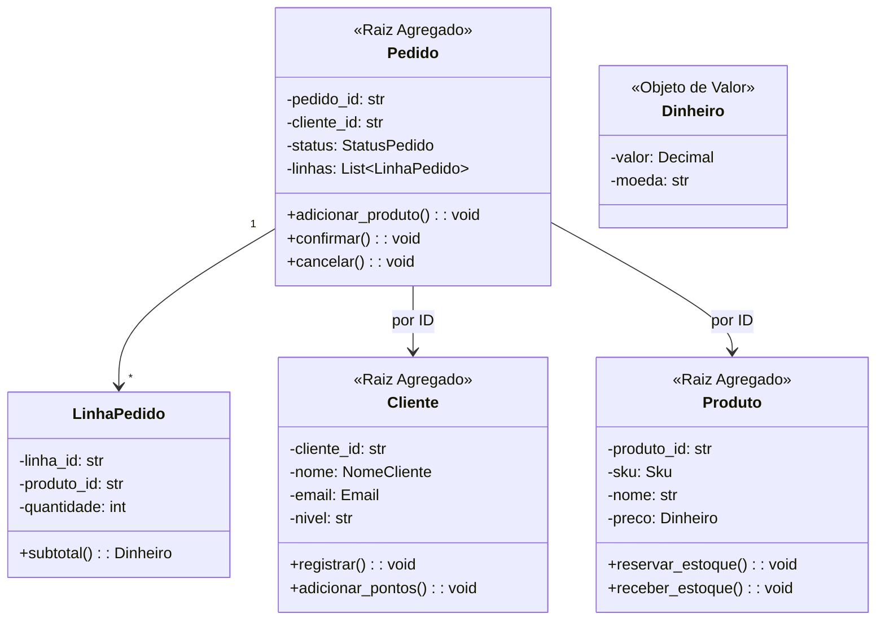

# Implementação de DDD em Python

Esta lição final reúne **tudo** que você aprendeu no curso: Linguagem Ubíqua, Contextos Delimitados, Entidades, Objetos de Valor, Agregados, Repositórios, Serviços de Domínio e Eventos de Domínio. Vamos construir um modelo de domínio de e-commerce completo em Python.

> [!NOTE]
> Este não é um exemplo "de brinquedo." O código é de qualidade de produção e segue práticas reais de DDD. Cada padrão é usado onde pertence. O foco está na camada de domínio — preocupações de infraestrutura (banco de dados, framework web, barramento de mensagens) são abstraídas por trás de interfaces.

## Estrutura do Projeto

```
ecommerce/
  dominio/
    modelos/
      cliente.py
      produto.py
      pedido.py
    servicos/
      servico_precificacao.py
      deteccao_fraude.py
    eventos/
      eventos_pedido.py
      eventos_pagamento.py
    repositorios/
      repositorio_cliente.py
      repositorio_pedido.py
      repositorio_produto.py
  aplicacao/
    comandos/
      fazer_pedido.py
      cancelar_pedido.py
    consultas/
      consultas_pedido.py
  infraestrutura/
    persistencia/
      repositorio_pedido_sqlite.py
    barramento/
      barramento_eventos.py
```

## 1. Objetos de Valor

```python
from dataclasses import dataclass, field
from decimal import Decimal
from typing import Optional
from datetime import datetime


@dataclass(frozen=True)
class Dinheiro:
    valor: Decimal
    moeda: str

    def __post_init__(self) -> None:
        if self.valor < 0:
            raise ValueError("Valor monetário não pode ser negativo")
        if not self.moeda or len(self.moeda) != 3:
            raise ValueError("Moeda deve ser código ISO de 3 letras")

    def __add__(self, other: "Dinheiro") -> "Dinheiro":
        if self.moeda != other.moeda:
            raise ValueError(f"Não é possível somar {other.moeda} com {self.moeda}")
        return Dinheiro(self.valor + other.valor, self.moeda)

    def __sub__(self, other: "Dinheiro") -> "Dinheiro":
        if self.moeda != other.moeda:
            raise ValueError(f"Não é possível subtrair {other.moeda} de {self.moeda}")
        if self.valor < other.valor:
            raise ValueError("Saldo insuficiente")
        return Dinheiro(self.valor - other.valor, self.moeda)

    def __mul__(self, multiplicador: int) -> "Dinheiro":
        return Dinheiro(self.valor * multiplicador, self.moeda)


@dataclass(frozen=True)
class Endereco:
    rua: str
    cidade: str
    estado: str
    cep: str
    pais: str

    def eh_nacional(self) -> bool:
        return self.pais.upper() == "BR"


@dataclass(frozen=True)
class NomeCliente:
    primeiro: str
    ultimo: str

    def __repr__(self) -> str:
        return f"{self.primeiro} {self.ultimo}"


@dataclass(frozen=True)
class Email:
    endereco: str

    def __post_init__(self) -> None:
        if "@" not in self.endereco or "." not in self.endereco:
            raise ValueError(f"Email inválido: {self.endereco}")


@dataclass(frozen=True)
 class Sku:
    """Stock Keeping Unit — identificador único de produto."""
    valor: str

    def __post_init__(self) -> None:
        if not self.valor or len(self.valor) < 3:
            raise ValueError("SKU deve ter pelo menos 3 caracteres")
```

## 2. Eventos de Domínio

```python
from dataclasses import dataclass, field
from datetime import datetime
from typing import List


@dataclass
class EventoDominio:
    ocorrido_em: datetime = field(default_factory=datetime.now)


@dataclass
class ClienteRegistrado(EventoDominio):
    cliente_id: str
    email: str
    nome: str


@dataclass
class ProdutoCriado(EventoDominio):
    produto_id: str
    sku: str
    nome: str


@dataclass
class PedidoRealizado(EventoDominio):
    pedido_id: str
    cliente_id: str
    total: Dinheiro
    itens: List[dict]


@dataclass
class PedidoConfirmado(EventoDominio):
    pedido_id: str


@dataclass
class PedidoCancelado(EventoDominio):
    pedido_id: str
    motivo: str


@dataclass
class EstoqueAjustado(EventoDominio):
    produto_id: str
    quantidade_mudanca: int
    motivo: str
```

## 3. Entidades e Agregados

### Agregado Cliente

```python
class Cliente:
    """Raiz do Agregado para gerenciamento de clientes."""

    def __init__(self, nome: NomeCliente, email: Email):
        import uuid
        self._id = f"CLI-{uuid.uuid4().hex[:8].upper()}"
        self._nome = nome
        self._email = email
        self._pontos_fidelidade: int = 0
        self._nivel: str = "standard"
        self._ativo: bool = True
        self._eventos: List[EventoDominio] = []

    @property
    def id(self) -> str: return self._id
    @property
    def nome(self) -> NomeCliente: return self._nome
    @property
    def email(self) -> Email: return self._email
    @property
    def nivel(self) -> str: return self._nivel
    @property
    def ativo(self) -> bool: return self._ativo

    def registrar(self) -> None:
        self._eventos.append(ClienteRegistrado(
            cliente_id=self._id,
            email=self._email.endereco,
            nome=str(self._nome)
        ))

    def adicionar_pontos_fidelidade(self, pontos: int) -> None:
        if pontos < 0:
            raise ValueError("Pontos não podem ser negativos")
        self._pontos_fidelidade += pontos
        if self._pontos_fidelidade >= 1000:
            self._nivel = "ouro"
        elif self._pontos_fidelidade >= 500:
            self._nivel = "prata"

    def desativar(self) -> None:
        self._ativo = False

    def extrair_eventos(self) -> List[EventoDominio]:
        eventos = list(self._eventos)
        self._eventos.clear()
        return eventos

    def __eq__(self, other: object) -> bool:
        if not isinstance(other, Cliente):
            return False
        return self._id == other._id

    def __hash__(self) -> int:
        return hash(self._id)
```

### Agregado Produto

```python
class Produto:
    """Raiz do Agregado para catálogo de produtos."""

    def __init__(self, sku: Sku, nome: str, preco: Dinheiro, estoque: int):
        self._id = f"PROD-{sku.valor}"
        self._sku = sku
        self._nome = nome
        self._preco = preco
        self._quantidade_estoque = estoque
        self._quantidade_reservada: int = 0
        self._ativo: bool = True
        self._eventos: List[EventoDominio] = []

    @property
    def id(self) -> str: return self._id
    @property
    def sku(self) -> Sku: return self._sku
    @property
    def nome(self) -> str: return self._nome
    @property
    def preco(self) -> Dinheiro: return self._preco
    @property
    def estoque_disponivel(self) -> int:
        return self._quantidade_estoque - self._quantidade_reservada

    def reservar_estoque(self, quantidade: int) -> None:
        if quantidade <= 0:
            raise ValueError("Quantidade de reserva deve ser positiva")
        if quantidade > self.estoque_disponivel:
            raise ValueError(f"Estoque insuficiente. Disponível: {self.estoque_disponivel}")
        self._quantidade_reservada += quantidade

    def liberar_estoque(self, quantidade: int) -> None:
        if quantidade <= 0:
            raise ValueError("Quantidade de liberação deve ser positiva")
        if quantidade > self._quantidade_reservada:
            raise ValueError(f"Não é possível liberar mais que o reservado")
        self._quantidade_reservada -= quantidade

    def receber_estoque(self, quantidade: int) -> None:
        if quantidade <= 0:
            raise ValueError("Quantidade recebida deve ser positiva")
        self._quantidade_estoque += quantidade
        self._eventos.append(EstoqueAjustado(
            produto_id=self._id,
            quantidade_mudanca=quantidade,
            motivo="recebimento"
        ))

    def extrair_eventos(self) -> List[EventoDominio]:
        eventos = list(self._eventos)
        self._eventos.clear()
        return eventos

    def __eq__(self, other: object) -> bool:
        if not isinstance(other, Produto):
            return False
        return self._id == other._id

    def __hash__(self) -> int:
        return hash(self._id)
```

### Agregado Pedido

```python
class StatusPedido(Enum):
    PENDENTE = "pendente"
    CONFIRMADO = "confirmado"
    PAGO = "pago"
    ENVIADO = "enviado"
    ENTREGUE = "entregue"
    CANCELADO = "cancelado"


class LinhaPedido:
    """Entidade dentro do agregado Pedido — não é raiz."""

    def __init__(self, produto_id: str, nome_produto: str,
                 sku: str, quantidade: int, preco_unitario: Dinheiro):
        import uuid
        self._linha_id = f"LN-{uuid.uuid4().hex[:8].upper()}"
        self._produto_id = produto_id
        self._nome_produto = nome_produto
        self._sku = sku
        self._quantidade = quantidade
        self._preco_unitario = preco_unitario

    @property
    def produto_id(self) -> str: return self._produto_id
    @property
    def quantidade(self) -> int: return self._quantidade
    @property
    def preco_unitario(self) -> Dinheiro: return self._preco_unitario

    def subtotal(self) -> Dinheiro:
        return self._preco_unitario * self._quantidade


class Pedido:
    """Raiz do Agregado para pedidos."""

    def __init__(self, cliente_id: str, endereco_entrega: Endereco):
        import uuid
        self._id = f"PED-{uuid.uuid4().hex[:8].upper()}"
        self._cliente_id = cliente_id
        self._endereco_entrega = endereco_entrega
        self._linhas: List[LinhaPedido] = []
        self._status = StatusPedido.PENDENTE
        self._realizado_em = datetime.now()
        self._eventos: List[EventoDominio] = []

    @property
    def id(self) -> str: return self._id
    @property
    def cliente_id(self) -> str: return self._cliente_id
    @property
    def status(self) -> StatusPedido: return self._status
    @property
    def linhas(self) -> List[LinhaPedido]: return list(self._linhas)

    def adicionar_produto(self, produto_id: str, nome_produto: str,
                          sku: str, quantidade: int, preco_unitario: Dinheiro) -> None:
        if quantidade <= 0:
            raise ValueError("Quantidade deve ser positiva")
        if self._status != StatusPedido.PENDENTE:
            raise ValueError(f"Não é possível modificar pedido no status {self._status.value}")
        self._linhas.append(LinhaPedido(
            produto_id, nome_produto, sku, quantidade, preco_unitario
        ))

    @property
    def total(self) -> Dinheiro:
        if not self._linhas:
            return Dinheiro(Decimal("0.00"), "BRL")
        moeda = self._linhas[0].preco_unitario.moeda
        total = Dinheiro(Decimal("0.00"), moeda)
        for linha in self._linhas:
            total = total + linha.subtotal()
        return total

    def confirmar(self) -> None:
        if self._status != StatusPedido.PENDENTE:
            raise ValueError(f"Não é possível confirmar pedido no status {self._status.value}")
        if not self._linhas:
            raise ValueError("Não é possível confirmar um pedido vazio")
        self._status = StatusPedido.CONFIRMADO
        self._eventos.append(PedidoConfirmado(pedido_id=self._id))

    def cancelar(self, motivo: str) -> None:
        if self._status in (StatusPedido.ENVIADO, StatusPedido.ENTREGUE):
            raise ValueError("Não é possível cancelar pedido enviado ou entregue")
        self._status = StatusPedido.CANCELADO
        self._eventos.append(PedidoCancelado(pedido_id=self._id, motivo=motivo))

    def extrair_eventos(self) -> List[EventoDominio]:
        eventos = list(self._eventos)
        self._eventos.clear()
        return eventos

    def __eq__(self, other: object) -> bool:
        if not isinstance(other, Pedido):
            return False
        return self._id == other._id

    def __hash__(self) -> int:
        return hash(self._id)
```

## 4. Serviços de Domínio

```python
class ServicoPrecificacao:
    """Serviço de Domínio para cálculos de preço."""

    TAXA_DESCONTO_OURO = Decimal("0.15")
    TAXA_DESCONTO_PRATA = Decimal("0.10")
    TAXA_IMPOSTO = Decimal("0.08")

    def calcular_total(self, pedido: Pedido, cliente: Cliente) -> Dinheiro:
        subtotal = pedido.total
        desconto = self._aplicar_desconto_nivel(subtotal, cliente.nivel)
        imposto = self._calcular_imposto(desconto)
        return desconto + imposto

    def _aplicar_desconto_nivel(self, total: Dinheiro, nivel: str) -> Dinheiro:
        if nivel == "ouro":
            return Dinheiro(total.valor * (1 - self.TAXA_DESCONTO_OURO), total.moeda)
        elif nivel == "prata":
            return Dinheiro(total.valor * (1 - self.TAXA_DESCONTO_PRATA), total.moeda)
        return total

    def _calcular_imposto(self, valor: Dinheiro) -> Dinheiro:
        return Dinheiro(valor.valor * self.TAXA_IMPOSTO, valor.moeda)


class ServicoDeteccaoFraude:
    """Serviço de Domínio para avaliação de fraude."""

    def avaliar(self, pedido: Pedido, cliente: Cliente) -> dict:
        score = 0
        razoes = []

        if pedido.total.valor > 5000:
            score += 30
            razoes.append("Pedido excede R$ 5.000")

        if cliente.nivel == "standard" and pedido.total.valor > 2000:
            score += 20
            razoes.append("Cliente novo, pedido de alto valor")

        return {
            "risco": "alto" if score > 50 else "medio" if score > 25 else "baixo",
            "score": score,
            "razoes": razoes
        }
```

## 5. Exemplo de Uso Completo

```python
repositorio_cliente = RepositorioClienteMemoria()
repositorio_produto = RepositorioProdutoMemoria()
repositorio_pedido = RepositorioPedidoMemoria()
barramento = BarramentoEventos()

cliente = Cliente(NomeCliente("Alice", "Silva"), Email("alice@exemplo.com"))
cliente.registrar()
repositorio_cliente.salvar(cliente)

produto = Produto(Sku("WDG-001"), "Widget", Dinheiro(Decimal("29.99"), "BRL"), 100)
repositorio_produto.salvar(produto)

endereco = Endereco("Rua A, 123", "São Paulo", "SP", "01001-000", "BR")
pedido = Pedido(cliente.id, endereco)
pedido.adicionar_produto(produto.id, produto.nome, produto.sku.valor, 2, produto.preco)
pedido.confirmar()
repositorio_pedido.salvar(pedido)

print(f"Pedido realizado: {pedido.id}")
print(f"Status: {pedido.status.value}")
print(f"Total: {pedido.total}")
```



## Exercícios Práticos

1. **Adicione um novo agregado**: Projete e implemente um agregado `Devolucao` para lidar com devoluções de produtos. Inclua objetos de valor para `MotivoDevolucao`, `ValorReembolso` e os estados de ciclo de vida adequados.

2. **Implemente uma saga**: Crie uma `SagaProcessamentoDevolucao` que coordena entre os agregados `Devolucao`, `Pedido` e `Produto` quando uma devolução é iniciada.

3. **Adicione um evento de domínio**: Quando um cliente atinge o nível ouro, publique um evento `ClienteNivelUpgraded`. Crie um handler que envia uma notificação de parabéns.

4. **Estenda o modelo de leitura**: Crie uma `ProjecaoHistoricoPedidosCliente` que ouve eventos `PedidoRealizado` e constrói um modelo de leitura desnormalizado para consultas rápidas de histórico.

5. **Implemente o padrão Specification**: Adicione uma `EspecificacaoPoliticaDevolucao` que define se um produto é elegível para devolução com base em: tempo desde a compra (< 30 dias), condição do produto (não danificado) e nível do cliente (membros ouro têm devolução estendida).

6. **Tratamento de concorrência**: Adicione concorrência otimista ao agregado `Produto` usando um campo de versão. Mostre como `reservar_estoque` deve falhar se o produto foi modificado por outra transação.

7. **Adicione um Serviço de Domínio para frete**: Crie um `ServicoCalculoFrete` que calcula custos de frete baseados em: peso, zona de distância, velocidade (standard/expresso/noite) e nível do cliente.

8. **Teste de integração completo**: Escreva um teste de integração que cria um cliente, adiciona produtos ao catálogo, faz um pedido, confirma, marca como pago, envia e verifica se todos os eventos foram publicados corretamente.

> [!SUCCESS]
> Você completou a Lição 8 e todo o curso de DDD & Arquitetura de Software. Agora você tem um modelo de domínio de e-commerce funcional que demonstra todos os padrões táticos do DDD. Aplique esses padrões aos seus próprios domínios, sempre começando com Linguagem Ubíqua e Contextos Delimitados, e deixando os padrões táticos emergirem do modelo.

## 6. Interfaces de Repositório

```python
from typing import Protocol, List, Optional


class RepositorioCliente(Protocol):
    def encontrar_por_id(self, cliente_id: str) -> Optional[Cliente]: ...
    def encontrar_por_email(self, email: str) -> Optional[Cliente]: ...
    def salvar(self, cliente: Cliente) -> None: ...
    def excluir(self, cliente_id: str) -> None: ...


class RepositorioProduto(Protocol):
    def encontrar_por_id(self, produto_id: str) -> Optional[Produto]: ...
    def encontrar_por_sku(self, sku: str) -> Optional[Produto]: ...
    def salvar(self, produto: Produto) -> None: ...
    def excluir(self, produto_id: str) -> None: ...


class RepositorioPedido(Protocol):
    def encontrar_por_id(self, pedido_id: str) -> Optional[Pedido]: ...
    def encontrar_por_cliente(self, cliente_id: str) -> List[Pedido]: ...
    def salvar(self, pedido: Pedido) -> None: ...
    def excluir(self, pedido_id: str) -> None: ...
```

## 7. Repositórios em Memória (para Testes)

```python
class RepositorioClienteMemoria:
    def __init__(self):
        self._clientes: dict[str, Cliente] = {}

    def encontrar_por_id(self, cliente_id: str) -> Optional[Cliente]:
        return self._clientes.get(cliente_id)

    def encontrar_por_email(self, email: str) -> Optional[Cliente]:
        for c in self._clientes.values():
            if c.email.endereco == email:
                return c
        return None

    def salvar(self, cliente: Cliente) -> None:
        self._clientes[cliente.id] = cliente

    def excluir(self, cliente_id: str) -> None:
        self._clientes.pop(cliente_id, None)


class RepositorioProdutoMemoria:
    def __init__(self):
        self._produtos: dict[str, Produto] = {}

    def encontrar_por_id(self, produto_id: str) -> Optional[Produto]:
        return self._produtos.get(produto_id)

    def encontrar_por_sku(self, sku: str) -> Optional[Produto]:
        for p in self._produtos.values():
            if p.sku.valor == sku:
                return p
        return None

    def salvar(self, produto: Produto) -> None:
        self._produtos[produto.id] = produto

    def excluir(self, produto_id: str) -> None:
        self._produtos.pop(produto_id, None)


class RepositorioPedidoMemoria:
    def __init__(self):
        self._pedidos: dict[str, Pedido] = {}

    def encontrar_por_id(self, pedido_id: str) -> Optional[Pedido]:
        return self._pedidos.get(pedido_id)

    def encontrar_por_cliente(self, cliente_id: str) -> List[Pedido]:
        return [p for p in self._pedidos.values()
                if p.cliente_id == cliente_id]

    def salvar(self, pedido: Pedido) -> None:
        self._pedidos[pedido.id] = pedido

    def excluir(self, pedido_id: str) -> None:
        self._pedidos.pop(pedido_id, None)
```

## 8. Barramento de Eventos

```python
from typing import Callable, Type, Dict, List


class BarramentoEventos:
    def __init__(self):
        self._handlers: Dict[Type, List[Callable]] = {}

    def inscrever(self, tipo_evento: Type, handler: Callable) -> None:
        self._handlers.setdefault(tipo_evento, []).append(handler)

    def publicar(self, evento: EventoDominio) -> None:
        for handler in self._handlers.get(type(evento), []):
            handler(evento)
```

## 9. Serviço de Aplicação

```python
class ManipuladorFazerPedido:
    """Serviço de aplicação: lida com o caso de uso FazerPedido."""

    def __init__(self, repo_pedido: RepositorioPedido,
                 repo_produto: RepositorioProduto,
                 repo_cliente: RepositorioCliente,
                 precificacao: ServicoPrecificacao,
                 fraude: ServicoDeteccaoFraude,
                 barramento: BarramentoEventos):
        self._repo_pedido = repo_pedido
        self._repo_produto = repo_produto
        self._repo_cliente = repo_cliente
        self._precificacao = precificacao
        self._fraude = fraude
        self._barramento = barramento

    def handle(self, cliente_id: str, itens: List[dict],
               endereco_entrega: Endereco) -> Pedido:
        cliente = self._repo_cliente.encontrar_por_id(cliente_id)
        if not cliente:
            raise ValueError(f"Cliente {cliente_id} não encontrado")
        if not cliente.ativo:
            raise ValueError("Conta do cliente está inativa")

        pedido = Pedido(cliente_id, endereco_entrega)
        for item in itens:
            produto = self._repo_produto.encontrar_por_id(item["produto_id"])
            if not produto:
                raise ValueError(f"Produto {item['produto_id']} não encontrado")
            produto.reservar_estoque(item["quantidade"])
            pedido.adicionar_produto(
                produto.id, produto.nome, produto.sku.valor,
                item["quantidade"], produto.preco
            )
            self._repo_produto.salvar(produto)

        fraude = self._fraude.avaliar(pedido, cliente)
        if fraude["risco"] == "alto":
            raise ValueError(f"Pedido rejeitado por detecção de fraude: {fraude['razoes']}")

        pedido.confirmar()
        self._repo_pedido.salvar(pedido)

        for evento in pedido.extrair_eventos():
            self._barramento.publicar(evento)

        self._barramento.publicar(PedidoRealizado(
            pedido_id=pedido.id, cliente_id=cliente_id,
            total=pedido.total, itens=itens
        ))

        return pedido
```

## 10. Testando o Modelo Completo

```python
from decimal import Decimal

class TestDominioEcommerce:
    def test_fluxo_completo_pedido(self):
        repo_cliente = RepositorioClienteMemoria()
        repo_produto = RepositorioProdutoMemoria()
        barramento = BarramentoEventos()

        cliente = Cliente(NomeCliente("Bob", "Silva"), Email("bob@teste.com"))
        cliente.registrar()
        repo_cliente.salvar(cliente)

        produto = Produto(Sku("TEST-001"), "Produto Teste",
                          Dinheiro(Decimal("10.00"), "BRL"), 50)
        repo_produto.salvar(produto)

        servico = ManipuladorFazerPedido(
            RepositorioPedidoMemoria(), repo_produto, repo_cliente,
            ServicoPrecificacao(), ServicoDeteccaoFraude(), barramento
        )

        endereco = Endereco("Rua Teste, 1", "Cidade Teste", "TS", "00000", "BR")
        pedido = servico.handle(cliente.id, [
            {"produto_id": produto.id, "quantidade": 3}
        ], endereco)

        assert pedido.status == StatusPedido.CONFIRMADO
        assert pedido.total == Dinheiro(Decimal("30.00"), "BRL")

    def test_ciclo_de_vida_pedido(self):
        pedido = Pedido("CLI-001", Endereco("Rua A", "SP", "SP", "1", "BR"))
        pedido.adicionar_produto("P1", "Widget", "WDG", 2,
                                  Dinheiro(Decimal("10.00"), "BRL"))

        assert pedido.status == StatusPedido.PENDENTE
        pedido.confirmar()
        assert pedido.status == StatusPedido.CONFIRMADO

    def test_desconto_cliente_ouro(self):
        precificacao = ServicoPrecificacao()
        cliente = Cliente(NomeCliente("Ouro", "Membro"),
                          Email("ouro@teste.com"))
        cliente.adicionar_pontos_fidelidade(1000)

        pedido = Pedido(cliente.id, Endereco("Rua", "Cid", "ES", "1", "BR"))
        pedido.adicionar_produto("P1", "Item", "ITM", 1,
                                  Dinheiro(Decimal("100.00"), "BRL"))

        total = precificacao.calcular_total(pedido, cliente)
        # 100 - 15% = 85 + 8% imposto = 91.80
        esperado = Dinheiro(Decimal("91.80"), "BRL")
        assert total == esperado
```

## Exercícios Adicionais

9. **Adicione concorrência otimista**: Adicione um campo `versao` ao agregado `Produto`. Quando `reservar_estoque` for chamado, verifique se a versão atual corresponde à versão esperada. Lance uma exceção se houver conflito.

10. **Implemente um processo de devolução**: Crie o fluxo completo de devolução: um `ComandoSolicitarDevolucao` → `ManipuladorSolicitarDevolucao` → verifica elegibilidade → cria agregado `Devolucao` → publica `DevolucaoSolicitada` → saga processa reembolso e restauração de estoque.

> [!SUCCESS]
> Parabéns! Você completou a Lição 8 e todo o curso de DDD & Arquitetura de Software. Agora você tem um modelo de domínio de e-commerce completo e funcional em Python que demonstra todos os padrões táticos do DDD trabalhando juntos. Aplique esses padrões aos seus próprios domínios, sempre começando com Linguagem Ubíqua e Contextos Delimitados, e deixando os padrões táticos emergirem naturalmente do modelo.
