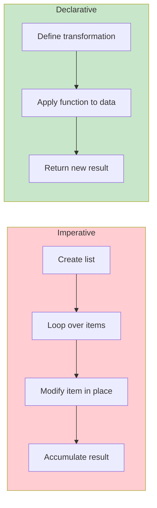
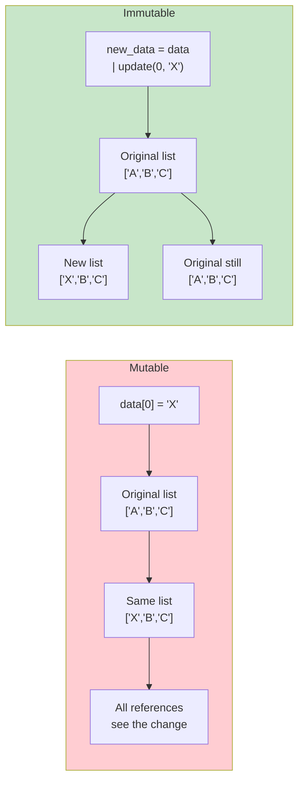
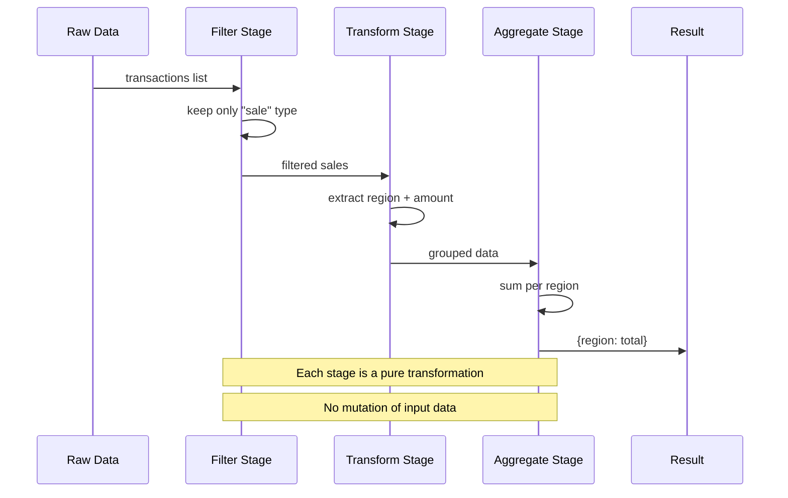
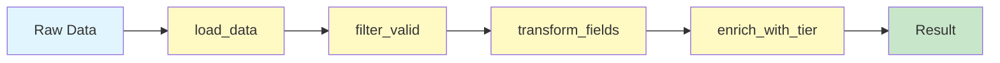

# Functional Programming Concepts

Functional programming (FP) is a paradigm that treats computation as the evaluation of mathematical functions and avoids changing state and mutable data. This lesson introduces the foundational concepts that make FP powerful for building predictable, testable, and concurrent software.

## What Is Functional Programming?

At its core, functional programming is about building programs through function composition, where functions are pure, data is immutable, and expressions are preferred over statements.

| Aspect | Imperative (How) | Declarative (What) |
|--------|-----------------|-------------------|
| **Focus** | Step-by-step instructions | Desired result |
| **State** | Mutable variables | Immutable data |
| **Functions** | Procedures with side effects | Pure mathematical functions |
| **Control Flow** | Loops, conditionals | Recursion, composable functions |
| **Assignment** | Reassign variables | Bind names to values |
| **Parallelism** | Manual locking | Safe by default (no shared state) |



## Pure Functions

A **pure function** always produces the same output for the same input and has no side effects. It depends only on its arguments and returns a new value without modifying anything outside its scope.

```python
from typing import List, Dict, Any
import math

# IMPURE — mutates external state
total_sales = 0

def add_sale_impure(amount: float) -> float:
    global total_sales         # side effect: modifies global
    total_sales += amount       # side effect: mutation
    print(f"Sale added: {amount}")  # side effect: I/O
    return total_sales

# PURE — no side effects, deterministic
def add_sale_pure(
    current_total: float,
    amount: float
) -> float:
    return current_total + amount

# IMPURE — modifies input
def apply_discount_impure(prices: List[float]) -> None:
    for i in range(len(prices)):
        prices[i] *= 0.9       # mutates the list in place

# PURE — returns new collection
def apply_discount_pure(prices: List[float]) -> List[float]:
    return [p * 0.9 for p in prices]

# IMPURE — relies on external state
DISCOUNT_RATE = 0.1

def calculate_discount_impure(price: float) -> float:
    return price * DISCOUNT_RATE  # depends on external global

# PURE — takes all dependencies as arguments
def calculate_discount_pure(price: float, rate: float) -> float:
    return price * rate

# Example usage
original = [100.0, 200.0, 300.0]
discounted = apply_discount_pure(original)
print(f"Original: {original}")    # Unchanged — [100.0, 200.0, 300.0]
print(f"Discounted: {discounted}") # [90.0, 180.0, 270.0]

new_total = add_sale_pure(1500.0, 250.0)
print(f"New total: {new_total}")  # 1750.0
```

> [!NOTE]
> Pure functions are fundamentally easier to test, reason about, and parallelize. If a function is pure, you never need to set up external state before testing it.

## Side Effects

A **side effect** occurs when a function interacts with or modifies the state of the outside world. In FP, we isolate side effects to the boundaries of our system.

```python
from typing import List
import json
import csv
from pathlib import Path

# Function with MULTIPLE side effects
def process_user_data_bad(path: str) -> None:
    with open(path, "r") as f:         # I/O side effect
        data = json.load(f)            # I/O side effect

    for user in data:
        user["score"] = user["score"] * 1.1  # mutation

    with open(path, "w") as f:         # I/O side effect
        json.dump(data, f)             # I/O side effect
    print("Done!")                     # console side effect

# Function with SIDE EFFECTS ISOLATED at the boundary
def load_json(path: str) -> List[dict]:
    with open(path, "r") as f:
        return json.load(f)

def boost_scores(users: List[dict], factor: float) -> List[dict]:
    return [
        {**user, "score": user["score"] * factor}
        for user in users
    ]

def save_json(path: str, data: List[dict]) -> None:
    with open(path, "w") as f:
        json.dump(data, f)

# Pure core, impure shell
data = load_json("/tmp/users.json")
updated = boost_scores(data, 1.1)
save_json("/tmp/users.json", updated)

# Common side effect categories:
# 1. Modifying a global variable or static local
# 2. Modifying an argument (mutable input)
# 3. I/O (files, network, database)
# 4. Throwing exceptions
# 5. Printing to console or logging
# 6. Random number generation (non-deterministic)
# 7. Getting current time or date
```

> [!WARNING]
> Functions that throw exceptions also have side effects in the form of control flow disruption. In strict FP, errors are handled through return types like `Either` or `Optional`, not exceptions.

## Immutability

**Immutability** means that once data is created, it cannot be changed. Instead of modifying existing data, you create new copies with the desired changes.

```python
from typing import List, Dict, Tuple
from copy import deepcopy

# MUTABLE approach — dangerous
class ShoppingCartMutable:
    def __init__(self) -> None:
        self.items: List[str] = []

    def add_item(self, item: str) -> None:
        self.items.append(item)  # mutates in place

cart1 = ShoppingCartMutable()
cart1.add_item("apple")
cart1.add_item("banana")

# Someone else has a reference — BUG!
other_ref = cart1.items
cart1.add_item("cherry")
print(other_ref)  # ['apple', 'banana', 'cherry'] — unexpected!

# IMMUTABLE approach — safe
class ShoppingCartImmutable:
    def __init__(self, items: Tuple[str, ...] = ()) -> None:
        self._items = items

    @property
    def items(self) -> Tuple[str, ...]:
        return self._items

    def add_item(self, item: str) -> "ShoppingCartImmutable":
        return ShoppingCartImmutable(self._items + (item,))

    def remove_item(self, item: str) -> "ShoppingCartImmutable":
        new_items = tuple(i for i in self._items if i != item)
        return ShoppingCartImmutable(new_items)

cart2 = ShoppingCartImmutable()
cart2 = cart2.add_item("apple")
cart2 = cart2.add_item("banana")
other_ref2 = cart2.items
cart2 = cart2.add_item("cherry")
print(other_ref2)  # ('apple', 'banana') — stable!

# Immutable dict/pattern in practice
def update_user_bad(user: Dict[str, Any], key: str, value: Any) -> None:
    user[key] = value  # mutates input!

def update_user_good(user: Dict[str, Any], key: str, value: Any) -> Dict[str, Any]:
    return {**user, key: value}  # returns new dict

original = {"id": 1, "name": "Alice", "score": 100}
updated = update_user_good(original, "score", 150)
print(original)  # {'id': 1, 'name': 'Alice', 'score': 100} — intact
print(updated)   # {'id': 1, 'name': 'Alice', 'score': 150}
```



## Declarative vs Imperative

Declarative code expresses **what** to do, while imperative code expresses **how** to do it.

```python
from typing import List

numbers = [1, 2, 3, 4, 5, 6, 7, 8, 9, 10]

# IMPERATIVE: Step by step
def sum_even_squares_imperative(nums: List[int]) -> int:
    result = 0
    for n in nums:            # how: manual loop
        if n % 2 == 0:        # how: explicit check
            result += n ** 2   # how: manual accumulation
    return result

# DECLARATIVE: Express intent
def sum_even_squares_declarative(nums: List[int]) -> int:
    return sum(                # what: sum
        n ** 2                 # what: squared
        for n in nums          # what: for each number
        if n % 2 == 0          # what: that are even
    )

print(sum_even_squares_imperative(numbers))    # 220
print(sum_even_squares_declarative(numbers))   # 220

# IMPERATIVE: Building a report
def build_report_imperative(students: List[Dict[str, Any]]) -> None:
    report = []
    for s in students:                          # how
        if s["grade"] >= 70:                    # how
            entry = {
                "name": s["name"],
                "status": "Passed",
                "grade": s["grade"]
            }
            report.append(entry)                # how
    for entry in report:
        print(f"{entry['name']}: {entry['status']} ({entry['grade']})")

# DECLARATIVE: Building a report
def build_report_declarative(students: List[Dict[str, Any]]) -> List[Dict[str, Any]]:
    return [
        {"name": s["name"], "status": "Passed", "grade": s["grade"]}
        for s in students
        if s["grade"] >= 70
    ]

students_data = [
    {"name": "Alice", "grade": 85},
    {"name": "Bob", "grade": 62},
    {"name": "Charlie", "grade": 91},
]

report = build_report_declarative(students_data)
for entry in report:
    print(f"{entry['name']}: {entry['status']} ({entry['grade']})")
```

## Referential Transparency

An expression is **referentially transparent** if it can be replaced with its value without changing the program's behavior. This is the bedrock of equational reasoning.

```python
import random
from datetime import datetime

# REFERENTIALLY OPAQUE — can't replace with value
def roll_dice() -> int:
    return random.randint(1, 6)

# These two calls produce different values:
first = roll_dice()
second = roll_dice()
# Can't simplify: roll_dice() != roll_dice()

# REFERENTIALLY TRANSPARENT — always same result
def add(a: int, b: int) -> int:
    return a + b

# Can replace add(2, 3) with 5 anywhere:
result1 = add(2, 3) + add(2, 3)  # 10
result2 = 5 + 5                   # 10 — equivalent!
print(result1 == result2)         # True

# Benefits of referential transparency:
# - Memoization: cache results safely
# - Reordering: expressions can be parallelized
# - Reasoning: understand each part independently
# - Testing: no mocking needed
# - Refactoring: replace expression with value safely

# Example: memoizing a pure function
from functools import lru_cache

@lru_cache(maxsize=128)
def fibonacci(n: int) -> int:
    if n < 2:
        return n
    return fibonacci(n - 1) + fibonacci(n - 2)

print(fibonacci(50))  # 12586269025 — fast due to memoization
```

> [!TIP]
> Referential transparency is your license to refactor fearlessly. When every expression is referentially transparent, you can extract, inline, reorder, and parallelize code with mathematical certainty.

## Immutability Benefits

| Benefit | Explanation | Example |
|---------|-------------|---------|
| **Thread safety** | No locks needed for shared data | Multiple threads read same tuple |
| **Predictability** | Data never changes unexpectedly | Defensive copies eliminated |
| **Caching** | Results can be safely cached | `@lru_cache` on pure functions |
| **Debugging** | Values at each step are preserved | Time-travel debugging |
| **Testing** | No setup/teardown of mutable state | Functional core tests |
| **Reasoning** | Code is easier to understand | Local reasoning suffices |

## Functions as First-Class Citizens

In FP, functions are values. They can be assigned to variables, passed as arguments, and returned from other functions. This is explored deeply in the next lesson, but here's a taste:

```python
from typing import Callable, List

def apply_twice(f: Callable[[int], int], x: int) -> int:
    return f(f(x))

def square(n: int) -> int:
    return n * n

# Pass function as argument
result = apply_twice(square, 3)  # square(square(3)) = 81
print(result)  # 81

# Return a function
def make_multiplier(factor: int) -> Callable[[int], int]:
    def multiplier(n: int) -> int:
        return n * factor
    return multiplier

double = make_multiplier(2)
triple = make_multiplier(3)
print(double(5))  # 10
print(triple(5))  # 15

# Store functions in data structures
operations: Dict[str, Callable[[int, int], int]] = {
    "add": lambda a, b: a + b,
    "subtract": lambda a, b: a - b,
    "multiply": lambda a, b: a * b,
}

print(operations["add"](10, 5))      # 15
print(operations["multiply"](10, 5))  # 50
```

## Declarative Data Processing Pipeline

```python
from typing import List, Dict, Any

transactions = [
    {"id": 1, "amount": 150.0, "type": "sale", "region": "NA"},
    {"id": 2, "amount": 200.0, "type": "refund", "region": "EU"},
    {"id": 3, "amount": 99.0, "type": "sale", "region": "NA"},
    {"id": 4, "amount": 300.0, "type": "sale", "region": "APAC"},
    {"id": 5, "amount": 50.0, "type": "sale", "region": "NA"},
]

# IMPERATIVE pipeline
def process_sales_imperative(transactions: List[Dict[str, Any]]) -> Dict[str, float]:
    result: Dict[str, float] = {}
    for t in transactions:                          # manual filter
        if t["type"] != "sale":
            continue
        region = t["region"]
        if region not in result:                   # manual group
            result[region] = 0.0
        result[region] += t["amount"]               # manual accumulate
    return result

# DECLARATIVE pipeline
def process_sales_declarative(transactions: List[Dict[str, Any]]) -> Dict[str, float]:
    sales = [t for t in transactions if t["type"] == "sale"]
    regions = {t["region"] for t in sales}
    return {
        region: sum(t["amount"] for t in sales if t["region"] == region)
        for region in regions
    }

print(process_sales_imperative(transactions))
print(process_sales_declarative(transactions))
```



## Comparing Pure vs Impure Functions

| Property | Pure Function | Impure Function |
|----------|--------------|-----------------|
| **Deterministic** | Always same output for same input | May differ each call |
| **Side effects** | None | I/O, mutates state, calls random |
| **Testability** | Trivial (no mocking) | Requires mocks, fixtures |
| **Parallelism** | Safe (no shared state) | Needs locks, coordination |
| **Memoizable** | Yes (output is cached) | No (output depends on hidden state) |
| **Composability** | Easy (no hidden dependencies) | Hard (carries baggage) |
| **Reasoning** | Local (just the function) | Global (whole program state) |

## Recursion Over Loops

In functional programming, recursion replaces loops as the primary iteration mechanism. Python supports recursion but has a recursion limit.

```python
from typing import List

# IMPERATIVE: loop-based sum
def sum_list_imperative(nums: List[int]) -> int:
    total = 0
    for n in nums:
        total += n
    return total

# FUNCTIONAL: recursion-based sum
def sum_list_functional(nums: List[int]) -> int:
    if not nums:
        return 0
    return nums[0] + sum_list_functional(nums[1:])

# FUNCTIONAL with accumulator (tail-recursive style)
def sum_list_tail(nums: List[int], acc: int = 0) -> int:
    if not nums:
        return acc
    return sum_list_tail(nums[1:], acc + nums[0])

# FACTORIAL: imperative vs recursive
def factorial_imperative(n: int) -> int:
    result = 1
    for i in range(2, n + 1):
        result *= i
    return result

def factorial_recursive(n: int) -> int:
    return 1 if n <= 1 else n * factorial_recursive(n - 1)

print(sum_list_imperative([1, 2, 3, 4, 5]))   # 15
print(sum_list_functional([1, 2, 3, 4, 5]))   # 15
print(factorial_imperative(5))                 # 120
print(factorial_recursive(5))                  # 120
```

> [!WARNING]
> Python's recursion limit is ~1000 by default. For deep recursion, consider iterative solutions or use `sys.setrecursionlimit()`. In production, `functools.reduce` or loops are often more practical.

## Pipeline Architecture

The functional paradigm naturally leads to a pipeline architecture where data flows through a chain of transformations.

```python
from typing import List, Dict, Any, Callable
from functools import reduce

# Define pipeline stages as pure functions
def load_data(raw: List[Dict[str, Any]]) -> List[Dict[str, Any]]:
    return raw

def filter_valid(records: List[Dict[str, Any]]) -> List[Dict[str, Any]]:
    return [r for r in records if r.get("active", False) and r.get("value", 0) > 0]

def transform_fields(records: List[Dict[str, Any]]) -> List[Dict[str, Any]]:
    return [
        {
            "id": r["id"],
            "display_name": r["name"].strip().title(),
            "value_usd": r["value"] * 1.12,  # EUR to USD
            "category": r["category"].upper(),
        }
        for r in records
    ]

def enrich_with_tier(records: List[Dict[str, Any]]) -> List[Dict[str, Any]]:
    return [
        {
            **r,
            "tier": "premium" if r["value_usd"] > 1000 else "standard",
        }
        for r in records
    ]

def build_pipeline(*stages: Callable) -> Callable:
    """Compose multiple functions into a pipeline."""
    return lambda data: reduce(lambda d, fn: fn(d), stages, data)

pipeline = build_pipeline(
    load_data,
    filter_valid,
    transform_fields,
    enrich_with_tier,
)

input_data = [
    {"id": 1, "name": "  alice  ", "value": 1500.0, "active": True, "category": "electronics"},
    {"id": 2, "name": "bob", "value": -50.0, "active": True, "category": "food"},
    {"id": 3, "name": "charlie", "value": 200.0, "active": False, "category": "books"},
    {"id": 4, "name": "diana", "value": 800.0, "active": True, "category": "clothing"},
]

result = pipeline(input_data)
for item in result:
    print(f"{item['display_name']}: {item['value_usd']:.2f} ({item['tier']})")
# Alice: 1680.00 (premium)
# Diana: 896.00 (standard)
```



## Practice Exercises

1. Convert the following impure function into a pure function:
   ```python
   tax_rate = 0.08
   def calculate_total(prices):
       total = sum(prices)
       print(f"Subtotal: {total}")
       return total * (1 + tax_rate)
   ```

2. Write a function `apply_discount` that takes a list of prices and a discount rate, and returns a **new** list without modifying the original. Verify immutability.

3. Implement `sum_of_positive_squares` in both imperative and declarative styles. The function should sum the squares of all positive numbers in a list.

4. Identify all side effects in this function and refactor it:
   ```python
   import random
   def process_order(order):
       global processed_count
       order["id"] = random.randint(1000, 9999)
       order["processed_at"] = "2025-01-01"
       processed_count += 1
       with open("log.txt", "a") as f:
           f.write(str(order))
       return True
   ```

5. Create a data processing pipeline using pure functions: load CSV rows, filter rows where `status == "active"`, extract `(id, score)` pairs, and compute the average score.

6. Explain why `random.randint(1, 6)` is not referentially transparent. Rewrite a dice-rolling program to make the random part isolated at the boundary.

7. Implement a simple `Counter` using immutable style. Instead of mutating an internal count, return a new counter each time. Show both mutable and immutable versions side by side.

8. Refactor the following imperative code into a declarative pipeline using list comprehensions and built-in functions:
   ```python
   def process_students(students):
       result = []
       for s in students:
           if s["score"] >= 80 and s["attendance"] >= 0.9:
               result.append({
                   "name": s["name"],
                   "grade": "A",
                   "honors": s["score"] >= 95,
               })
       return result
   ```

## Summary

- **Pure functions** are deterministic, side-effect-free, and composable
- **Immutability** prevents unexpected state changes and enables safe concurrency
- **Declarative code** expresses intent (what) rather than mechanics (how)
- **Referential transparency** enables memoization, parallelization, and fearless refactoring
- **Functions as first-class citizens** unlock higher-order patterns
- **Pipelines** compose pure transformations into readable data flows
- **Recursion** replaces loops as the functional iteration mechanism
- Isolate side effects to the boundary; keep the core pure

> [!SUCCESS]
> You've mastered the foundational concepts of functional programming. These principles will be your guide as you explore higher-order functions, closures, composition, and declarative patterns in the coming lessons.
