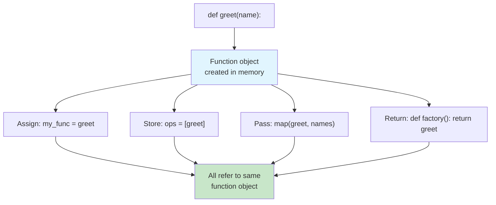
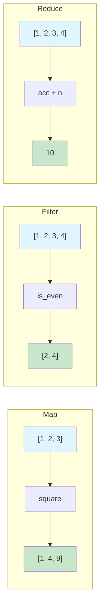
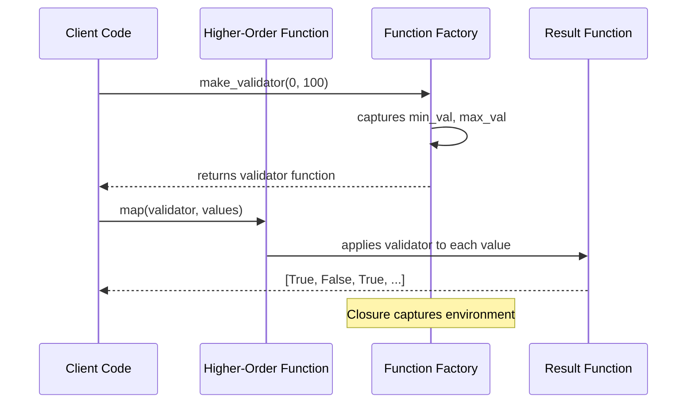

# First-Class & Higher-Order Functions

In Python, functions are **first-class citizens** — they can be assigned to variables, passed as arguments, returned from other functions, and stored in data structures. **Higher-order functions** take advantage of this by taking functions as arguments or returning functions as results.

## Functions Are Objects

Everything in Python is an object, and functions are no exception.

```python
from typing import Callable, List, Any, Optional
import math

# Functions have a type — just like any other object
print(type(len))           # <class 'builtin_function_or_method'>
print(type(str.upper))     # <class 'method_descriptor'>

# Functions have attributes
def greet(name: str) -> str:
    """Return a greeting string."""
    return f"Hello, {name}!"

print(greet.__name__)      # "greet"
print(greet.__doc__)       # "Return a greeting string."
print(greet.__code__)      # <code object greet at ...>

# Assign to a variable
my_func = greet
print(my_func("Alice"))    # "Hello, Alice!"

# Store in a list
operations = [greet, len, str.upper]
print(operations[0]("Bob"))    # "Hello, Bob!"
print(operations[1]("hello")) # 5
print(operations[2]("hello")) # "HELLO"

# Store in a dictionary
dispatch: Dict[str, Callable] = {
    "greet": greet,
    "double": lambda x: x * 2,
}
print(dispatch["double"](5))  # 10
```



## Passing Functions as Arguments

This is the most common use of higher-order functions.

```python
from typing import List, Callable, TypeVar

T = TypeVar("T")

# A higher-order function that applies a transform to every item
def transform_list(
    items: List[T],
    transform_fn: Callable[[T], T]
) -> List[T]:
    return [transform_fn(item) for item in items]

def double(x: int) -> int:
    return x * 2

def square(x: int) -> int:
    return x * x

numbers = [1, 2, 3, 4]
print(transform_list(numbers, double))  # [2, 4, 6, 8]
print(transform_list(numbers, square))  # [1, 4, 9, 16]

# Passing methods
words = ["hello", "world", "python"]
uppercased = transform_list(words, str.upper)
print(uppercased)  # ["HELLO", "WORLD", "PYTHON"]

# Custom sorting with key function
students = [
    {"name": "Alice", "grade": 85},
    {"name": "Bob", "grade": 72},
    {"name": "Charlie", "grade": 91},
]
by_grade = sorted(students, key=lambda s: s["grade"])
print(by_grade)
```

## The Trinity: Map, Filter, Reduce

These three functions form the backbone of functional data processing in Python.

### Map — Transform Every Element

```python
from typing import List, Callable, Iterable, Any

# map() applies a function to each item in an iterable

# IMPERATIVE
def square_all_imperative(nums: List[float]) -> List[float]:
    result = []
    for n in nums:
        result.append(n ** 2)
    return result

# DECLARATIVE with map
def square_all_map(nums: List[float]) -> List[float]:
    return list(map(lambda n: n ** 2, nums))

# Real-world: convert temperatures
celsius = [0, 10, 20, 30, 40]
fahrenheit = list(map(lambda c: c * 9/5 + 32, celsius))
print(fahrenheit)  # [32.0, 50.0, 68.0, 86.0, 104.0]

# Map with multiple iterables
def add_pairs(a: int, b: int) -> int:
    return a + b

result = list(map(add_pairs, [1, 2, 3], [10, 20, 30]))
print(result)  # [11, 22, 33]

# Named function is clearer than lambda for complex logic
def clean_name(name: str) -> str:
    return name.strip().title()

raw_names = ["  alice ", "BOB", "CHARLIE  ", "  diana  "]
cleaned = list(map(clean_name, raw_names))
print(cleaned)  # ["Alice", "Bob", "Charlie", "Diana"]
```

### Filter — Keep Matching Elements

```python
from typing import List, Callable

# filter() keeps items where the predicate returns True

# IMPERATIVE
def get_even_imperative(nums: List[int]) -> List[int]:
    result = []
    for n in nums:
        if n % 2 == 0:
            result.append(n)
    return result

# DECLARATIVE with filter
def get_even_filter(nums: List[int]) -> List[int]:
    return list(filter(lambda n: n % 2 == 0, nums))

numbers = [1, 2, 3, 4, 5, 6, 7, 8, 9, 10]
print(get_even_filter(numbers))  # [2, 4, 6, 8, 10]

# Filtering complex data
products = [
    {"name": "Laptop", "price": 1200, "in_stock": True},
    {"name": "Mouse", "price": 25, "in_stock": False},
    {"name": "Keyboard", "price": 80, "in_stock": True},
    {"name": "Monitor", "price": 350, "in_stock": True},
]

def is_available(product: dict) -> bool:
    return product["in_stock"] and product["price"] < 100

available_under_100 = list(filter(is_available, products))
print([p["name"] for p in available_under_100])  # ["Keyboard"]

# filter with None removes falsy values
mixed = [0, 1, "", "hello", None, [], [1, 2]]
truthy = list(filter(None, mixed))
print(truthy)  # [1, "hello", [1, 2]]
```

> [!TIP]
> Prefer named predicate functions over lambdas in `filter()` when the logic is non-trivial. Named functions document intent better.

### Reduce — Accumulate to a Single Value

```python
from functools import reduce
from typing import List, Callable

# reduce() repeatedly applies a function to accumulate a result

# IMPERATIVE
def sum_all_imperative(nums: List[int]) -> int:
    total = 0
    for n in nums:
        total += n
    return total

# DECLARATIVE with reduce
def sum_all_reduce(nums: List[int]) -> int:
    return reduce(lambda acc, n: acc + n, nums, 0)

numbers = [1, 2, 3, 4, 5]
print(sum_all_reduce(numbers))  # 15
print(sum(numbers))  # 15 — built-in is preferred for this case

# Custom reduce: find maximum
def find_max(nums: List[int]) -> int:
    return reduce(lambda a, b: a if a > b else b, nums)

print(find_max([3, 7, 2, 9, 5]))  # 9

# Reduce with complex data
orders = [
    {"id": 1, "items": [{"price": 10}, {"price": 20}]},
    {"id": 2, "items": [{"price": 30}]},
    {"id": 3, "items": [{"price": 15}, {"price": 25}, {"price": 5}]},
]

def total_revenue(acc: float, order: dict) -> float:
    order_total = sum(item["price"] for item in order["items"])
    return acc + order_total

revenue = reduce(total_revenue, orders, 0.0)
print(f"Total revenue: ${revenue}")  # $105.00

# Reduce to build a dictionary
def index_by_id(acc: dict, product: dict) -> dict:
    acc[product["id"]] = product
    return acc

catalog = [
    {"id": "p1", "name": "Widget", "price": 9.99},
    {"id": "p2", "name": "Gadget", "price": 24.99},
    {"id": "p3", "name": "Doohickey", "price": 4.99},
]

indexed = reduce(index_by_id, catalog, {})
print(indexed["p2"]["name"])  # "Gadget"
```



## Chaining Map, Filter, and Reduce

The real power emerges when you chain these operations together.

```python
from functools import reduce
from typing import List, Dict, Any

# Problem: Given a list of transactions, calculate the total
# value of all sales over $100 made in the "NA" region.

transactions = [
    {"id": 1, "amount": 150.0, "type": "sale", "region": "NA"},
    {"id": 2, "amount": 2000.0, "type": "sale", "region": "EU"},
    {"id": 3, "amount": 75.0, "type": "sale", "region": "NA"},
    {"id": 4, "amount": 300.0, "type": "refund", "region": "NA"},
    {"id": 5, "amount": 500.0, "type": "sale", "region": "NA"},
    {"id": 6, "amount": 25.0, "type": "sale", "region": "EU"},
]

# IMPERATIVE approach
def calculate_total_imperative(transactions: List[Dict[str, Any]]) -> float:
    total = 0.0
    for t in transactions:
        if t["type"] == "sale" and t["region"] == "NA" and t["amount"] > 100:
            total += t["amount"]
    return total

# FUNCTIONAL approach with chaining
def calculate_total_functional(transactions: List[Dict[str, Any]]) -> float:
    return reduce(
        lambda acc, t: acc + t["amount"],
        filter(
            lambda t: t["type"] == "sale" and t["region"] == "NA" and t["amount"] > 100,
            transactions
        ),
        0.0
    )

# FUNCTIONAL with intermediate variables (more readable)
def calculate_total_readable(transactions: List[Dict[str, Any]]) -> float:
    sales_only = filter(lambda t: t["type"] == "sale", transactions)
    na_sales = filter(lambda t: t["region"] == "NA", sales_only)
    big_sales = filter(lambda t: t["amount"] > 100, na_sales)
    return reduce(lambda acc, t: acc + t["amount"], big_sales, 0.0)

print(calculate_total_imperative(transactions))   # 650.0
print(calculate_total_functional(transactions))   # 650.0
print(calculate_total_readable(transactions))     # 650.0

# Complex pipeline: process user data
users = [
    {"name": "Alice", "age": 25, "scores": [85, 90, 78]},
    {"name": "Bob", "age": 17, "scores": [92, 88, 95]},
    {"name": "Charlie", "age": 30, "scores": [70, 65, 72]},
    {"name": "Diana", "age": 22, "scores": [95, 97, 99]},
]

def average_score(scores: List[float]) -> float:
    return sum(scores) / len(scores) if scores else 0.0

adults = filter(lambda u: u["age"] >= 18, users)
avg_scores = map(lambda u: {"name": u["name"], "avg": average_score(u["scores"])}, adults)
high_performers = filter(lambda u: u["avg"] >= 80, avg_scores)
result = list(high_performers)
print(result)
# [{'name': 'Alice', 'avg': 84.33}, {'name': 'Diana', 'avg': 97.0}]
```

## Partial Application

`functools.partial` creates a new function with some arguments pre-filled.

```python
from functools import partial
from typing import Callable

def power(base: float, exponent: float) -> float:
    return base ** exponent

# Create specialized functions
square = partial(power, exponent=2)
cube = partial(power, exponent=3)
sqrt = partial(power, exponent=0.5)

print(square(5))   # 25
print(cube(3))     # 27
print(sqrt(16))    # 4.0

# Partial for data processing
def format_entry(name: str, score: float, precision: int) -> str:
    return f"{name}: {score:.{precision}f}"

format_2dp = partial(format_entry, precision=2)
format_0dp = partial(format_entry, precision=0)

print(format_2dp("Alice", 85.6789))  # "Alice: 85.68"
print(format_0dp("Bob", 72.1))       # "Bob: 72"

# Partial with map
def process_temperature(temp: float, scale: str, offset: float) -> float:
    if scale == "F":
        return temp * 9/5 + 32 + offset
    return temp + offset

to_fahrenheit = partial(process_temperature, scale="F", offset=0)
celsius_temps = [0, 10, 20, 30]
fahrenheit_temps = list(map(to_fahrenheit, celsius_temps))
print(fahrenheit_temps)  # [32.0, 50.0, 68.0, 86.0]
```

## Function Factories

Functions that **return** functions are powerful for creating parameterized behavior.

```python
from typing import Callable, List, Any

# Simple function factory
def make_greeter(greeting: str) -> Callable[[str], str]:
    def greeter(name: str) -> str:
        return f"{greeting}, {name}!"
    return greeter

say_hello = make_greeter("Hello")
say_hi = make_greeter("Hi")
say_yo = make_greeter("Yo")

print(say_hello("Alice"))  # "Hello, Alice!"
print(say_hi("Bob"))       # "Hi, Bob!"
print(say_yo("Charlie"))   # "Yo, Charlie!"

# Factory for validation functions
def make_validator(min_val: float = 0, max_val: float = 100) -> Callable[[float], bool]:
    def validator(value: float) -> bool:
        return min_val <= value <= max_val
    return validator

is_percentage = make_validator(0, 100)
is_grade = make_validator(0, 10)
is_temperature_c = make_validator(-273.15, 1000)

print(is_percentage(150))    # False
print(is_grade(8.5))         # True
print(is_temperature_c(-300))  # False

# Factory for sorting keys
def make_sorter(key: str, reverse: bool = False) -> Callable:
    def sorter(collection: List[dict]) -> List[dict]:
        return sorted(collection, key=lambda x: x[key], reverse=reverse)
    return sorter

students = [
    {"name": "Alice", "grade": 85, "age": 22},
    {"name": "Bob", "grade": 92, "age": 19},
    {"name": "Charlie", "grade": 78, "age": 25},
]

sort_by_grade = make_sorter("grade")
sort_by_age_desc = make_sorter("age", reverse=True)

print(sort_by_grade(students))
print(sort_by_age_desc(students))
```

## Custom Higher-Order Functions

```python
from typing import Callable, List, TypeVar, Any
import time

T = TypeVar("T")
R = TypeVar("R")

# A decorator is a higher-order function
def timed(func: Callable[..., R]) -> Callable[..., R]:
    def wrapper(*args: Any, **kwargs: Any) -> R:
        start = time.perf_counter()
        result = func(*args, **kwargs)
        elapsed = time.perf_counter() - start
        print(f"{func.__name__} took {elapsed:.4f}s")
        return result
    return wrapper

@timed
def slow_square(n: int) -> int:
    sum([i ** 2 for i in range(1000000)])
    return n * n

print(slow_square(5))

# A function that applies a function N times
def apply_n_times(
    func: Callable[[T], T],
    n: int
) -> Callable[[T], T]:
    def applicator(value: T) -> T:
        result = value
        for _ in range(n):
            result = func(result)
        return result
    return applicator

double = lambda x: x * 2
double_3 = apply_n_times(double, 3)
print(double_3(5))  # 5 * 2 * 2 * 2 = 40

# Conditional application
def when(
    predicate: Callable[[T], bool],
    func: Callable[[T], T]
) -> Callable[[T], T]:
    def conditional(value: T) -> T:
        return func(value) if predicate(value) else value
    return conditional

to_upper_if_long = when(
    lambda s: len(s) > 5,
    lambda s: s.upper()
)

print(to_upper_if_long("hi"))      # "hi"
print(to_upper_if_long("hello!"))  # "HELLO!"
```



## Comparing Map/Filter/Reduce with Loops

| Aspect | Imperative Loop | Functional (map/filter/reduce) |
|--------|----------------|-------------------------------|
| **Intent** | Buried in loop mechanics | Expressed in function name |
| **State** | Accumulator variable | Immutable pipeline |
| **Reuse** | Rewrite loop each time | Compose existing functions |
| **Testing** | Test the whole loop | Test each function independently |
| **Parallelism** | Manual threading | `multiprocessing.Pool.map` |
| **Brevity** | Verbose | Concise |
| **Readability** | Familiar to all | Requires FP literacy |

## Real-World: Data Processing Pipeline

```python
from functools import reduce
from typing import List, Dict, Any, Callable
import json

# Simulated API response
api_response = [
    {"user_id": 1, "name": "Alice", "orders": [
        {"total": 150.0, "status": "completed"},
        {"total": 50.0, "status": "pending"},
    ]},
    {"user_id": 2, "name": "Bob", "orders": [
        {"total": 200.0, "status": "completed"},
    ]},
    {"user_id": 3, "name": "Charlie", "orders": [
        {"total": 75.0, "status": "cancelled"},
        {"total": 300.0, "status": "completed"},
        {"total": 25.0, "status": "completed"},
    ]},
]

# Step 1: Extract all completed orders
def get_completed_orders(users: List[Dict[str, Any]]) -> List[Dict[str, Any]]:
    return [
        {**order, "user_name": user["name"], "user_id": user["user_id"]}
        for user in users
        for order in user["orders"]
        if order["status"] == "completed"
    ]

# Step 2: Apply discount to large orders
def apply_volume_discount(
    orders: List[Dict[str, Any]],
    threshold: float = 200.0,
    discount: float = 0.1
) -> List[Dict[str, Any]]:
    return [
        {
            **order,
            "discounted_total": (
                order["total"] * (1 - discount)
                if order["total"] >= threshold
                else order["total"]
            ),
            "discount_applied": order["total"] >= threshold,
        }
        for order in orders
    ]

# Step 3: Summarize per user
def summarize_by_user(orders: List[Dict[str, Any]]) -> Dict[str, Dict[str, Any]]:
    return reduce(
        lambda acc, order: {
            **acc,
            order["user_name"]: {
                "user_id": order["user_id"],
                "total_orders": acc.get(order["user_name"], {}).get("total_orders", 0) + 1,
                "total_spent": acc.get(order["user_name"], {}).get("total_spent", 0.0) + order["discounted_total"],
                "discounts_received": acc.get(order["user_name"], {}).get("discounts_received", 0) + (1 if order["discount_applied"] else 0),
            }
        },
        orders,
        {}
    )

# Compose the pipeline
result = summarize_by_user(
    apply_volume_discount(
        get_completed_orders(api_response)
    )
)

for user, stats in result.items():
    print(f"{user}: ${stats['total_spent']:.2f} ({stats['total_orders']} orders, {stats['discounts_received']} discounts)")
```

> [!SUCCESS]
> Higher-order functions like map, filter, and reduce let you express data transformations as composable, testable building blocks. Combined with closures and partial application, they form the toolkit for declarative programming.

## Comparing Imperative vs Functional Approaches

| Problem | Imperative | Functional |
|---------|-----------|------------|
| **Sum of squares** | `total = 0` → `for n in nums: total += n*n` | `reduce(lambda a,n: a+n*n, nums, 0)` |
| **Filter adults** | `result = []` → `for p in people: if p.age >= 18: result.append(p)` | `list(filter(lambda p: p.age >= 18, people))` |
| **Extract names** | `names = []` → `for p in people: names.append(p.name)` | `list(map(lambda p: p.name, people))` |
| **Group by key** | Manual dict building | `reduce` with dict merge |
| **Nested loops** | Double `for` loop | Nested comprehensions / `itertools.product` |

## Practice Exercises

1. Use `map` to convert a list of temperatures in Celsius to Fahrenheit: `[0, 10, 20, 30, 40]` → `[32, 50, 68, 86, 104]`.

2. Use `filter` to extract all strings longer than 5 characters from `["cat", "elephant", "dog", "butterfly", "ant"]`.

3. Use `reduce` to find the product of all numbers in a list. Then use `reduce` to flatten a list of lists: `[[1,2], [3,4], [5]]` → `[1,2,3,4,5]`.

4. Chain `map`, `filter`, and `reduce` to:
   - Start with a list of integers
   - Filter to keep only even numbers
   - Map to square each
   - Reduce to sum the squares

5. Create a function factory `make_discount` that takes a discount percentage and returns a function that applies that discount to a price.

6. Implement `my_map`, `my_filter`, and `my_reduce` from scratch using loops. Verify they produce the same results as the built-ins.

7. Use `functools.partial` to create `double`, `triple`, and `quadruple` functions from a `multiply` function.

8. Given a list of dictionaries with keys `"city"` and `"population"`, use `reduce` to build a dictionary mapping city names to their populations.

## Summary

- **First-class functions** can be assigned, passed, and returned like any value
- **map** transforms every element in a collection
- **filter** keeps elements that satisfy a predicate
- **reduce** accumulates elements into a single value
- **Chaining** these functions creates expressive data pipelines
- **Partial application** pre-fills arguments to create specialized functions
- **Function factories** return parameterized functions via closures
- These patterns eliminate boilerplate and make intent explicit

> [!WARNING]
> Don't overuse `reduce` when a simpler alternative exists. Use `sum()`, `any()`, `all()`, `max()`, `min()` for common cases. Reserve `reduce` for genuinely custom accumulations.
