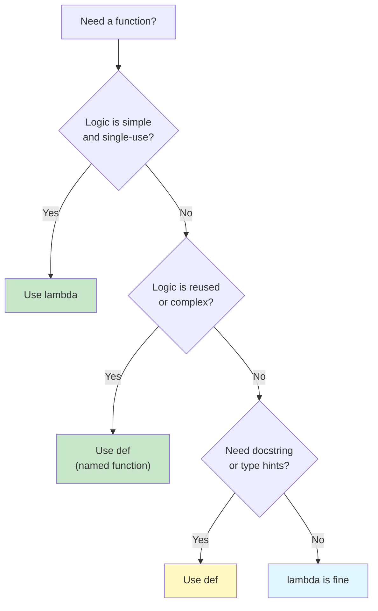
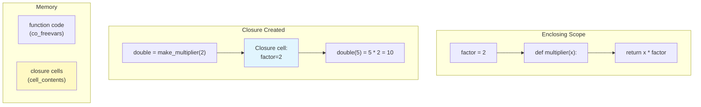

# Lambda Functions & Closures

Lambda functions (anonymous functions) and closures are essential tools in the functional programmer's toolkit. Lambdas provide concise inline function definitions, while closures capture and remember the environment in which they were created.

## Lambda Functions

A **lambda function** is a small anonymous function defined with the `lambda` keyword. It can take any number of arguments but returns only one expression.

```python
from typing import Callable, List, Any

# Syntax: lambda arguments: expression

# Named function equivalent
def add_one(x: int) -> int:
    return x + 1

# Lambda equivalent
add_one_lambda = lambda x: x + 1

print(add_one(5))          # 6
print(add_one_lambda(5))   # 6

# Multiple arguments
multiply = lambda a, b: a * b
print(multiply(3, 4))  # 12

# Default arguments
power = lambda base, exp=2: base ** exp
print(power(5))     # 25
print(power(2, 10)) # 1024

# Common use: sorting with custom key
students = [
    {"name": "Alice", "grade": 85},
    {"name": "Bob", "grade": 72},
    {"name": "Charlie", "grade": 91},
    {"name": "Diana", "grade": 88},
]

# Sort by grade descending
by_grade = sorted(students, key=lambda s: s["grade"], reverse=True)
print([s["name"] for s in by_grade])
# ["Charlie", "Diana", "Alice", "Bob"]

# Sort by name length
by_name_len = sorted(students, key=lambda s: len(s["name"]))
print([s["name"] for s in by_name_len])
# ["Bob", "Alice", "Diana", "Charlie"]
```

> [!NOTE]
> Lambda bodies are limited to a single expression — you cannot use statements like `return`, `if`/`elif`/`else` (though you can use the ternary expression), or loops. If you need more complexity, use a named function.

## When to Use Lambdas

Lambdas shine in situations where the function logic is simple and only needed in one place.

```python
from typing import List, Tuple

# 1. Inline with sorted, max, min
words = ["python", "java", "javascript", "c", "rust"]
longest = max(words, key=lambda w: len(w))
print(longest)  # "javascript"

# 2. With map, filter, reduce
from functools import reduce

numbers = [1, 2, 3, 4, 5]
squared = list(map(lambda x: x ** 2, numbers))
evens = list(filter(lambda x: x % 2 == 0, numbers))
product = reduce(lambda a, b: a * b, numbers)

print(squared)   # [1, 4, 9, 16, 25]
print(evens)     # [2, 4]
print(product)   # 120

# 3. As callback functions
import tkinter as tk
# root = tk.Tk()
# button = tk.Button(root, text="Click", command=lambda: print("Clicked!"))

# 4. In defaultdict factory
from collections import defaultdict

grouped = defaultdict(lambda: [])
items = [("fruit", "apple"), ("fruit", "banana"), ("color", "red")]
for category, value in items:
    grouped[category].append(value)

print(dict(grouped))
# {"fruit": ["apple", "banana"], "color": ["red"]}

# 5. Key functions for complex data
data = [
    (1, "zebra", 50),
    (2, "apple", 30),
    (3, "mango", 40),
]

# Sort by second element (string)
by_name = sorted(data, key=lambda t: t[1])
print([t[1] for t in by_name])  # ["apple", "mango", "zebra"]

# Sort by third element (number)
by_value = sorted(data, key=lambda t: t[2])
print([t[2] for t in by_value])  # [30, 40, 50]
```

## When NOT to Use Lambdas

Named functions are better when the logic is complex or reused.

```python
from typing import List, Dict, Any

# BAD: Complex lambda — hard to read
process_complex = lambda items: list(
    filter(
        lambda x: x["score"] >= 50 and x["status"] != "inactive",
        sorted(
            items,
            key=lambda x: (-x["score"], x["name"])
        )
    )
)

# GOOD: Named function — clear intent
def process_items(items: List[Dict[str, Any]]) -> List[Dict[str, Any]]:
    def is_active_high_scorer(item: Dict[str, Any]) -> bool:
        return item["score"] >= 50 and item["status"] != "inactive"

    def sort_key(item: Dict[str, Any]) -> Tuple[int, str]:
        return (-item["score"], item["name"])

    sorted_items = sorted(items, key=sort_key)
    return list(filter(is_active_high_scorer, sorted_items))

# BAD: Lambda assigned to variable (just use def)
double = lambda x: x * 2

# GOOD: Named function
def double(x: int) -> int:
    return x * 2

# BAD: Lambda with conditional logic
status = lambda x: "passed" if x >= 60 else "failed"

# GOOD: Named function
def get_status(score: float) -> str:
    return "passed" if score >= 60 else "failed"
```



## Closures

A **closure** is a function that remembers the variables from the enclosing scope even after that scope has finished executing.

```python
from typing import Callable, List

# Basic closure example
def make_multiplier(factor: int) -> Callable[[int], int]:
    def multiplier(x: int) -> int:
        return x * factor  # factor is captured from enclosing scope
    return multiplier

double = make_multiplier(2)
triple = make_multiplier(3)

print(double(5))   # 10
print(triple(5))   # 15

# The closure captures the variable, not just the value
def make_counters() -> tuple:
    count = [0]  # mutable captured variable

    def increment() -> int:
        count[0] += 1
        return count[0]

    def reset() -> None:
        count[0] = 0

    return increment, reset

inc, reset = make_counters()
print(inc())  # 1
print(inc())  # 2
print(inc())  # 3
reset()
print(inc())  # 1
```

## How Closures Work

When a nested function references a variable from an enclosing scope, Python bundles the function with the referenced variables into a closure.

```python
from typing import Callable

def outer(msg: str) -> Callable[[], str]:
    # msg is a free variable
    def inner() -> str:
        return f"Message: {msg}"
    return inner

fn = outer("Hello, World!")
print(fn())  # "Message: Hello, World!"

# Introspecting closure internals
print(fn.__closure__)       # (<cell at 0x...: str object at 0x...>,)
print(fn.__code__.co_freevars)  # ("msg",)
print(fn.__closure__[0].cell_contents)  # "Hello, World!"

# Multiple layers of closure
def make_formatter(prefix: str, suffix: str) -> Callable[[str], str]:
    def formatter(value: str) -> str:
        return f"{prefix}{value}{suffix}"
    return formatter

bracket = make_formatter("[", "]")
angle = make_formatter("<", ">")

print(bracket("Alice"))  # "[Alice]"
print(angle("Bob"))      # "<Bob>"
```

> [!WARNING]
> Closures capture variables by reference, not by value. If the captured variable changes after the closure is created, the closure sees the new value. This can cause surprising behavior in loops.

## The Lambda-in-a-Loop Pitfall

This is a classic gotcha in Python:

```python
from typing import List, Callable

# WRONG: All closures capture the same variable
def build_functions_wrong() -> List[Callable[[], int]]:
    funcs = []
    for i in range(5):
        funcs.append(lambda: i ** 2)  # i is captured by reference
    return funcs

for f in build_functions_wrong():
    print(f(), end=" ")  # 16 16 16 16 16 — all use i=4!

# CORRECT: Capture the current value via default argument
def build_functions_correct() -> List[Callable[[], int]]:
    funcs = []
    for i in range(5):
        funcs.append(lambda x=i: x ** 2)  # default arg is evaluated NOW
    return funcs

for f in build_functions_correct():
    print(f(), end=" ")  # 0 1 4 9 16

# CORRECT: Use a factory function
def make_squarer(n: int) -> Callable[[], int]:
    return lambda: n ** 2  # n is captured in a new scope

def build_functions_factory() -> List[Callable[[], int]]:
    return [make_squarer(i) for i in range(5)]

for f in build_functions_factory():
    print(f(), end=" ")  # 0 1 4 9 16
```

## Closures for Encapsulation

Closures can provide private state without classes.

```python
from typing import Callable, Tuple, Optional

# Counter using closure (no class needed)
def create_counter(start: int = 0) -> Tuple[Callable[[], int], Callable[[], int]]:
    count = start

    def increment() -> int:
        nonlocal count
        count += 1
        return count

    def get_count() -> int:
        return count

    return increment, get_count

inc, get = create_counter(10)
print(inc())  # 11
print(inc())  # 12
print(get())  # 12

# Bank account using closures
def create_account(owner: str, initial_balance: float = 0.0) -> dict:
    balance = initial_balance

    def deposit(amount: float) -> float:
        nonlocal balance
        if amount <= 0:
            raise ValueError("Amount must be positive")
        balance += amount
        return balance

    def withdraw(amount: float) -> float:
        nonlocal balance
        if amount <= 0:
            raise ValueError("Amount must be positive")
        if amount > balance:
            raise ValueError("Insufficient funds")
        balance -= amount
        return balance

    def get_balance() -> float:
        return balance

    def info() -> dict:
        return {"owner": owner, "balance": balance}

    return {
        "deposit": deposit,
        "withdraw": withdraw,
        "balance": get_balance,
        "info": info,
    }

acc = create_account("Alice", 1000)
acc["deposit"](500)
acc["withdraw"](200)
print(acc["info"]())  # {'owner': 'Alice', 'balance': 1300}
```



## Practical Closure Patterns

```python
from typing import Callable, List, Any
import time

# 1. Memoization via closure
def make_memoized(func: Callable) -> Callable:
    cache = {}

    def memoized(*args: Any) -> Any:
        if args not in cache:
            cache[args] = func(*args)
        return cache[args]

    return memoized

def fib(n: int) -> int:
    if n < 2:
        return n
    return fib(n - 1) + fib(n - 2)

fib_memo = make_memoized(fib)

start = time.perf_counter()
print(fib_memo(35))  # 9227465
print(f"Memoized: {time.perf_counter() - start:.4f}s")

start = time.perf_counter()
print(fib_memo(35))  # 9227465 (instant from cache)
print(f"Cached: {time.perf_counter() - start:.4f}s")

# 2. Rate limiter
def make_rate_limiter(max_calls: int, period: float) -> Callable[[Callable], Callable]:
    calls = []

    def limiter(func: Callable) -> Callable:
        def wrapped(*args: Any, **kwargs: Any) -> Any:
            now = time.time()
            nonlocal calls
            calls = [t for t in calls if now - t < period]

            if len(calls) >= max_calls:
                raise RuntimeError(f"Rate limit exceeded ({max_calls}/{period}s)")

            calls.append(now)
            return func(*args, **kwargs)
        return wrapped
    return limiter

rate_limit = make_rate_limiter(3, 1.0)

@rate_limit
def api_call(name: str) -> str:
    return f"Processed {name}"

for i in range(5):
    try:
        print(api_call(f"req-{i}"))
    except RuntimeError as e:
        print(f"Blocked: {e}")

# 3. Lazy initialization
def make_lazy(initializer: Callable) -> Callable:
    value = None
    initialized = False

    def get_value() -> Any:
        nonlocal value, initialized
        if not initialized:
            value = initializer()
            initialized = True
        return value

    return get_value

config = make_lazy(lambda: {"host": "localhost", "port": 8080})
print(config())  # Computes and caches
print(config())  # Returns cached value
```

## Decorators Are Closures

Decorators are just syntactic sugar for applying a closure to a function.

```python
from typing import Callable, Any
from functools import wraps
import time

# Manual decorator (closure)
def log_calls(func: Callable) -> Callable:
    @wraps(func)
    def wrapper(*args: Any, **kwargs: Any) -> Any:
        arg_str = ", ".join([repr(a) for a in args] + [f"{k}={v!r}" for k, v in kwargs.items()])
        print(f"Calling: {func.__name__}({arg_str})")
        result = func(*args, **kwargs)
        print(f"Returned: {result!r}")
        return result
    return wrapper

@log_calls
def add(a: int, b: int) -> int:
    return a + b

add(3, 5)
# Calling: add(3, 5)
# Returned: 8

# Decorator with arguments (factory + closure)
def retry(max_attempts: int = 3, delay: float = 0.1) -> Callable:
    def decorator(func: Callable) -> Callable:
        @wraps(func)
        def wrapper(*args: Any, **kwargs: Any) -> Any:
            for attempt in range(max_attempts):
                try:
                    return func(*args, **kwargs)
                except Exception as e:
                    if attempt == max_attempts - 1:
                        raise
                    time.sleep(delay)
            return None
        return wrapper
    return decorator

@retry(max_attempts=3, delay=0.05)
def unstable_call(n: int) -> int:
    import random
    if random.random() < 0.7:
        raise ConnectionError("Network error")
    return n * 2

# This will retry up to 3 times
try:
    result = unstable_call(10)
    print(f"Result: {result}")
except ConnectionError:
    print("Failed after retries")
```

## Advanced Lambda Patterns

```python
from typing import List, Dict, Any, Callable
from functools import reduce

# Using lambda for function composition helpers
def compose(*funcs: Callable) -> Callable:
    """Compose functions right-to-left: compose(f, g)(x) => f(g(x))"""
    return reduce(lambda f, g: lambda x: f(g(x)), funcs)

def pipe(*funcs: Callable) -> Callable:
    """Pipe functions left-to-right: pipe(f, g)(x) => g(f(x))"""
    return reduce(lambda f, g: lambda x: g(f(x)), funcs)

add_one = lambda x: x + 1
double = lambda x: x * 2
square = lambda x: x ** 2

# Compose: square(double(add_one(x)))
composed = compose(square, double, add_one)
print(composed(3))  # ((3 + 1) * 2) ** 2 = 64

# Pipe: add_one -> double -> square
piped = pipe(add_one, double, square)
print(piped(3))  # ((3 + 1) * 2) ** 2 = 64 (same result)

# Lambda in data transformation
def transform_pipeline(
    data: List[Dict[str, Any]],
    transforms: List[Callable]
) -> List[Dict[str, Any]]:
    result = data
    for transform in transforms:
        result = list(map(transform, result))
    return result

users = [
    {"name": "  Alice  ", "age": 25, "score": 85},
    {"name": "Bob", "age": 17, "score": 92},
    {"name": "  CHARLIE  ", "age": 30, "score": 78},
]

pipeline = [
    lambda u: {**u, "name": u["name"].strip().title()},
    lambda u: {**u, "is_adult": u["age"] >= 18},
    lambda u: {**u, "grade": "A" if u["score"] >= 90 else "B" if u["score"] >= 80 else "C"},
]

result = transform_pipeline(users, pipeline)
for r in result:
    print(f"{r['name']}: {r['grade']} (Adult: {r['is_adult']})")
```

## Comparison: Functions vs Lambdas

| Aspect | `def` Function | `lambda` |
|--------|---------------|----------|
| **Name** | Named (required) | Anonymous |
| **Statements** | Multiple allowed | Single expression only |
| **Return** | Explicit `return` | Implicit (the expression result) |
| **Docs** | Can have docstring | No docstring |
| **Type hints** | Supported | Not supported |
| **Reuse** | By name, anywhere | Inline only (unless assigned, but why?) |
| **Recursion** | Supported | Not practical (no name) |
| **Readability** | Better for complex logic | Better for simple transforms |
| **Debugging** | Stack trace shows name | Stack trace shows `<lambda>` |

## Practice Exercises

1. Use a lambda with `sorted()` to sort a list of tuples `[(1, "z"), (3, "a"), (2, "c")]` by the second element of each tuple.

2. Write a closure `make_counter(step)` that creates a counter incrementing by the given step. `counter = make_counter(3); counter()` → 3, `counter()` → 6.

3. Fix the following lambda-in-a-loop bug:
   ```python
   multipliers = [lambda x: x * i for i in range(5)]
   print([m(2) for m in multipliers])  # Expected: [0, 2, 4, 6, 8]
   ```

4. Create a closure `make_password_checker` that takes a valid password and returns a function that checks if a given password matches. Bonus: add a max attempt limit.

5. Write a decorator (which is a closure) `@validate_args` that checks if all arguments to the decorated function are positive integers.

6. Use a lambda with `filter` to extract all palindromes from a list of strings: `["radar", "hello", "level", "world", "madam"]`.

7. Implement `make_averager` as a closure that maintains a running average. Each call adds a new number and returns the current average.

8. Create a function `make_comparator(key, reverse=False)` that returns a lambda suitable for use as a `sorted()` key. Compare it with `operator.attrgetter`.

## Summary

- **Lambda functions** provide concise, anonymous function definitions
- Use lambdas for simple, single-use operations; prefer `def` for complex logic
- **Closures** capture variables from the enclosing scope by reference
- Closures enable encapsulation without classes (private state via `nonlocal`)
- The **lambda-in-a-loop** bug occurs because all closures share the same variable
- Fix it with default arguments or factory functions
- **Decorators** are closures that wrap other functions
- Closures power memoization, rate limiting, lazy initialization, and more

> [!SUCCESS]
> You now understand lambdas and closures — the foundation for function composition, partial application, and many advanced functional patterns. These tools let you create specialized functions on the fly and encapsulate state without classes.
